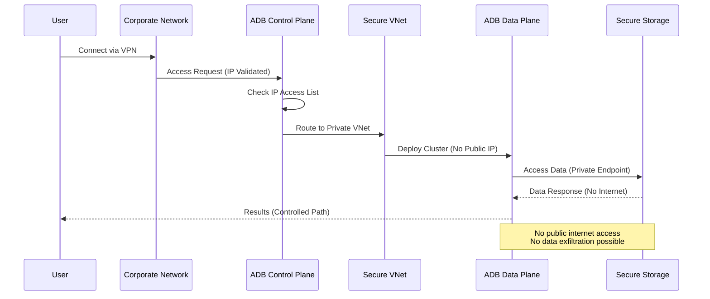
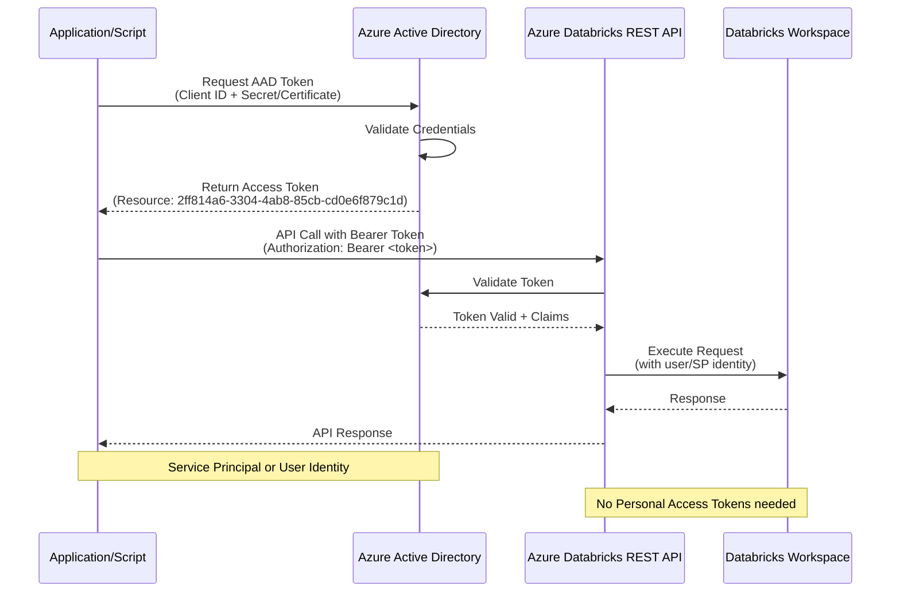
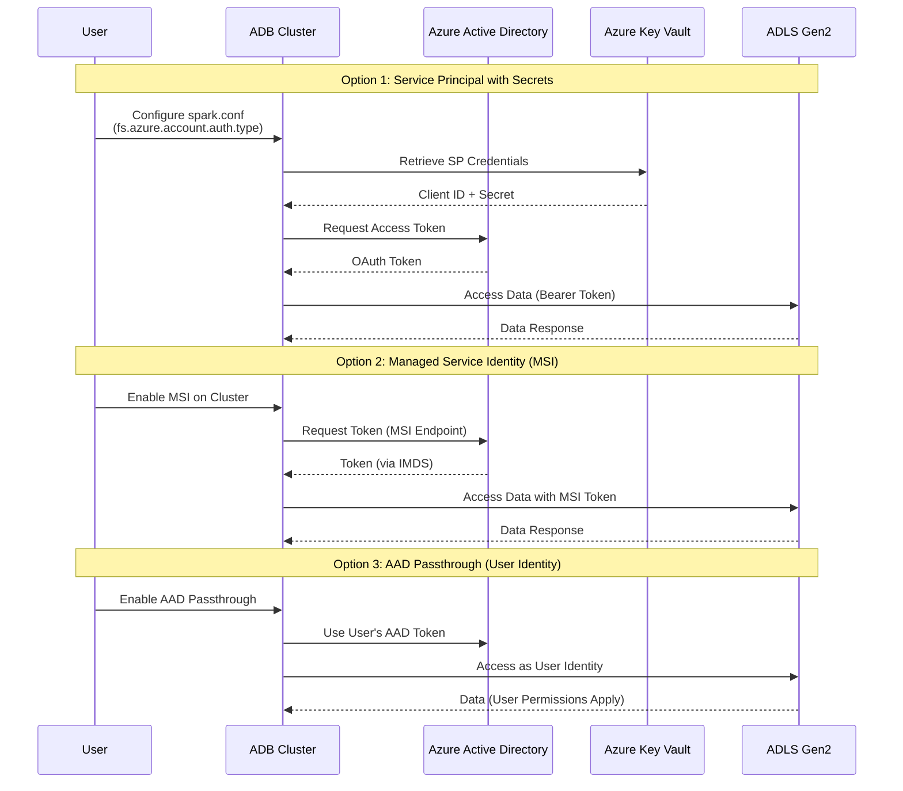
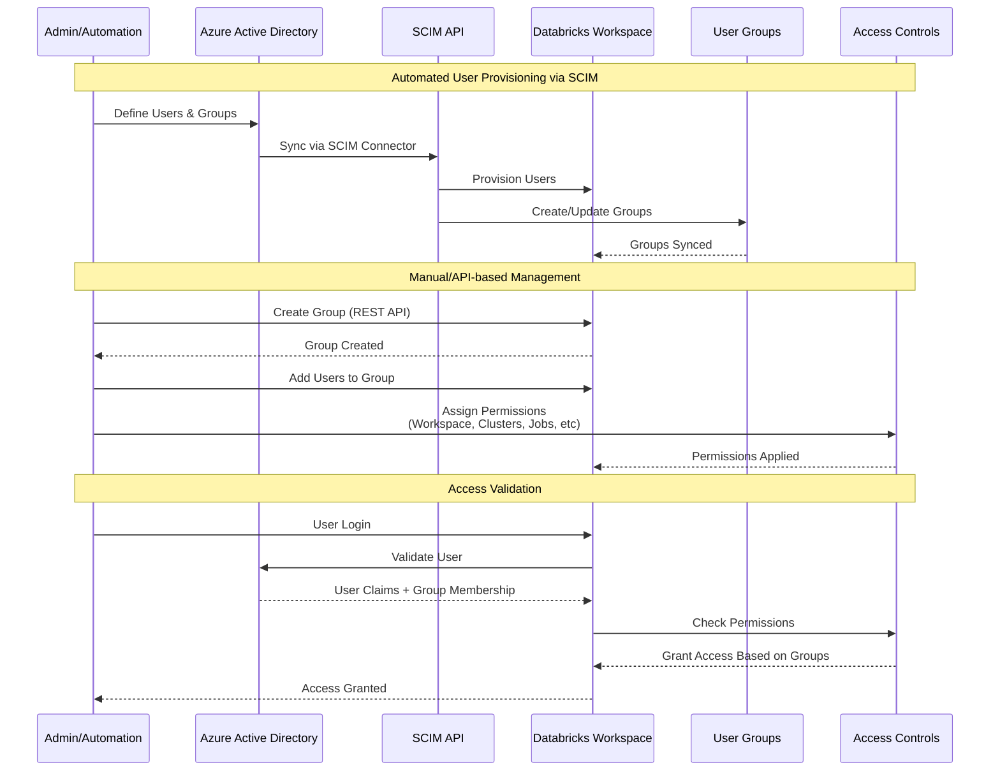
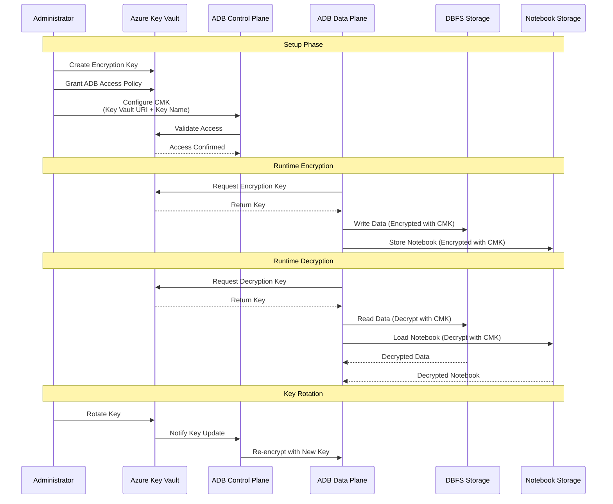

Azure Databricks Security Best Practices
==============
- Documenting and sharing security best practices related to platform deployment and configuration.
- [Security Guide](https://bit.ly/adbsecurityguide)

***REMOVED******REMOVED*** 🚀 New Modular Terraform Structure

This repository provides **production-ready, modular Terraform templates** for Azure Databricks deployments.

***REMOVED******REMOVED******REMOVED*** 📁 Repository Structure

```
adb4u/
├── docs/                      ***REMOVED*** 📚 All documentation centralized here
│   ├── README.md              ***REMOVED*** Documentation index
│   ├── 01-QUICKSTART.md       ***REMOVED*** Quick start guide
│   ├── TROUBLESHOOTING.md     ***REMOVED*** ⚠️ Common issues & solutions
│   ├── DEPLOYMENT-CHECKLIST.md ***REMOVED*** Pre-flight checklist
│   ├── 03-AUTHENTICATION.md   ***REMOVED*** Authentication setup
│   ├── modules/               ***REMOVED*** Module documentation
│   └── patterns/              ***REMOVED*** Pattern-specific guides
│
├── deployments/               ***REMOVED*** Pre-built deployment patterns
│   ├── non-pl/                ***REMOVED*** ✅ Non-Private Link (Ready)
│   ├── full-private/          ***REMOVED*** 🚧 Full Private (Coming soon)
│   └── hub-spoke/             ***REMOVED*** 🚧 Hub-Spoke (Future)
│
├── modules/                   ***REMOVED*** Reusable Terraform modules
│   ├── networking/            ***REMOVED*** VNet, subnets, NSG, NAT
│   ├── workspace/             ***REMOVED*** Databricks workspace
│   └── unity-catalog/         ***REMOVED*** Metastore, storage, credentials
│
└── templates/                 ***REMOVED*** Legacy templates (reference only)
```

***REMOVED******REMOVED******REMOVED*** 🎯 Deployment Patterns

***REMOVED******REMOVED******REMOVED******REMOVED*** 1. **Non-Private Link (Non-PL)** ✅ Production Ready
- **Control Plane**: Public
- **Data Plane**: Private (NPIP)
- **Egress**: NAT Gateway
- **Storage**: Service Endpoints
- **Cost**: ~$58/month

👉 **[Quick Start Guide →](./docs/01-QUICKSTART.md)**  
⚠️ **[Troubleshooting Guide →](./docs/TROUBLESHOOTING.md)** - Review before deploying!

***REMOVED******REMOVED******REMOVED******REMOVED*** 2. **Full Private (Air-gapped)** 🚧 Coming Soon
- **Control Plane**: Private Link
- **Data Plane**: Private (NPIP)
- **Egress**: None (isolated)
- **Storage**: Private Link
- **Cost**: ~$100/month

***REMOVED******REMOVED******REMOVED******REMOVED*** 3. **Hub-Spoke with Firewall** 🚧 Future
- Enterprise-scale multi-workspace deployments

***REMOVED******REMOVED******REMOVED*** ✨ Key Features

- ✅ **Secure Cluster Connectivity (NPIP)**: Always enabled
- ✅ **Unity Catalog**: Mandatory, regional metastore
- ✅ **Flexible Networking**: Create new or BYOV
- ✅ **Service Endpoint Policies**: Enhanced storage security
- ✅ **Modular Design**: Reusable, composable components
- ✅ **Well-Documented**: Comprehensive guides in `/docs`

***REMOVED******REMOVED******REMOVED*** 🚀 Quick Start

```bash
***REMOVED*** Navigate to deployment
cd deployments/non-pl

***REMOVED*** Configure
cp terraform.tfvars.example terraform.tfvars
***REMOVED*** Edit terraform.tfvars with your values

***REMOVED*** Deploy
export TF_VAR_databricks_account_id="<your-account-id>"
terraform init
terraform plan
terraform apply
```

**Full guide:** See [docs/01-QUICKSTART.md](./docs/01-QUICKSTART.md)

***REMOVED******REMOVED******REMOVED*** 📚 Documentation

All documentation is centralized in the **[docs/](./docs/)** folder:

- **[Quick Start Guide](./docs/01-QUICKSTART.md)** - Deploy your first workspace
- **[Authentication Guide](./docs/02-AUTHENTICATION.md)** - Configure credentials
- **[Module Documentation](./docs/modules/)** - Detailed module reference
- **[Pattern Guides](./docs/patterns/)** - Pattern-specific documentation

---

***REMOVED******REMOVED*** Legacy Content (Below)

The following content documents historical best practices and patterns. For new deployments, use the modular structure above.

***REMOVED******REMOVED*** Architecture Overview

```mermaid
graph TB
    subgraph "Corporate Network"
        Users[Users/Developers]
        CorpNet[Corporate VPN/Network]
    end

    subgraph "Azure AD"
        AAD[Azure Active Directory]
        SP[Service Principals]
        Groups[User Groups]
    end

    subgraph "Azure Databricks - Control Plane"
        WebApp[Web Application]
        RestAPI[REST API]
        IPAccess[IP Access Lists]
    end

    subgraph "Azure Databricks - Data Plane VNet"
        Workspace[Databricks Workspace]
        Clusters[Compute Clusters]
        DBFS[DBFS with CMK]
        Notebooks[Notebooks with CMK]
        Secrets[Secret Scopes]
    end

    subgraph "Azure Data Services"
        ADLS[ADLS Gen2]
        KeyVault[Azure Key Vault]
        ADF[Azure Data Factory]
        Synapse[Azure Synapse]
        PowerBI[Power BI]
    end

    Users -->|Authenticate| AAD
    AAD -->|AAD Token| WebApp
    AAD -->|AAD Token| RestAPI
    Users -->|Via| CorpNet
    CorpNet -->|Allowed IPs| IPAccess
    IPAccess --> WebApp
    WebApp --> Workspace
    RestAPI --> Workspace
    Workspace --> Clusters
    Clusters -->|Encrypted| DBFS
    Clusters -->|Encrypted| Notebooks
    Clusters -->|Read Secrets| KeyVault
    Clusters -->|Service Principal/MSI| ADLS
    ADF -->|Orchestrate| Clusters
    Clusters -->|Write Data| Synapse
    PowerBI -->|Query| Clusters
    SP -->|Automate| RestAPI
    Groups -->|Access Control| Workspace

    style AAD fill:***REMOVED***0078D4
    style Workspace fill:***REMOVED***FF3621
    style ADLS fill:***REMOVED***0078D4
    style KeyVault fill:***REMOVED***0078D4
```


Topics
------------

   Ready to use
   ------------
   - **Preventing Data Exfiltration** - Secure Deployments
      - [Deployment walk thru video]()


   -  **Authenticating API calls using AAD tokens** - Securely accessing Azure Databricks REST API using AAD tokens
      - [Video walk thru]()
      - [Using Service Principal AAD Tokens]()


   -  **Accessing ADLS Gen2** - options available to read/write data from ADLS Gen2
      - [Demo video]()


   -  **Users and Groups Management** - Automate users/groups onboarding and management
      - [Demo video]()



   Work in progress
   ------------

   -  **IP Access List** - Connect to Azure Databricks only through existing corporate networks with a secure perimeter
   -  **Platform tokens** - Manage Azure Databricks platform tokens
   -  **Working with Secrets**
   -  **Bring Your Own Keys (Customer Managed Keys)**
         - DBFS
         - Notebooks
   -  **Securely and Efficiently connect to:**
         - ADF
         - Power BI
         - Synapse DW

```mermaid
graph LR
    subgraph "Network Security"
        IPList[IP Access Lists]
        VPN[Corporate VPN]
    end

    subgraph "Identity & Access"
        Tokens[Platform Token Management]
        AAD2[AAD Authentication]
    end

    subgraph "Data Protection"
        Secrets[Secret Scopes]
        KV2[Azure Key Vault]
        CMK_DBFS[CMK for DBFS]
        CMK_NB[CMK for Notebooks]
    end

    subgraph "Integration Security"
        ADF2[Azure Data Factory]
        PBI[Power BI]
        Synapse2[Azure Synapse]
    end

    VPN -->|Allowed IPs| IPList
    IPList --> AAD2
    AAD2 --> Tokens
    Tokens --> Secrets
    Secrets --> KV2
    KV2 --> CMK_DBFS
    KV2 --> CMK_NB
    AAD2 --> ADF2
    AAD2 --> PBI
    AAD2 --> Synapse2

    style CMK_DBFS fill:***REMOVED***FFD700
    style CMK_NB fill:***REMOVED***FFD700
    style Secrets fill:***REMOVED***90EE90
    style IPList fill:***REMOVED***87CEEB
```

***REMOVED******REMOVED******REMOVED*** Customer Managed Keys (CMK) Flow



