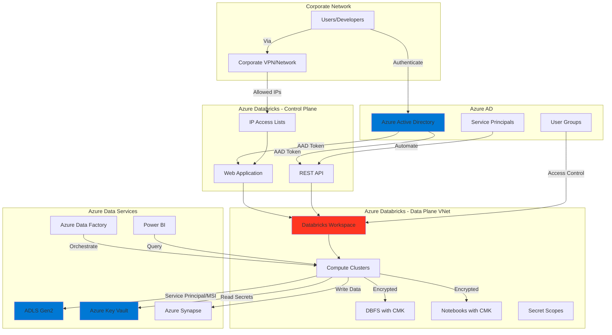
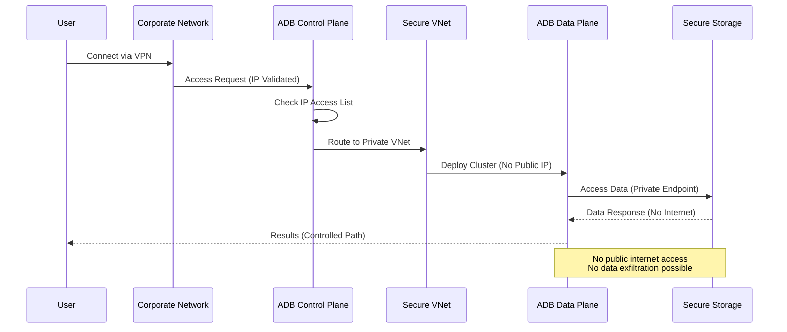
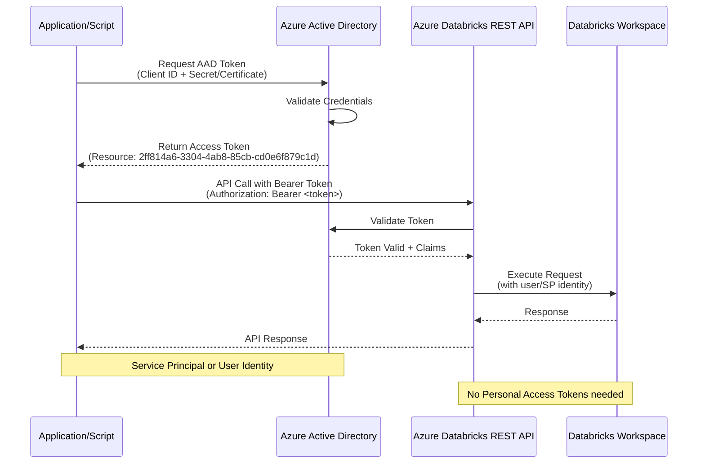
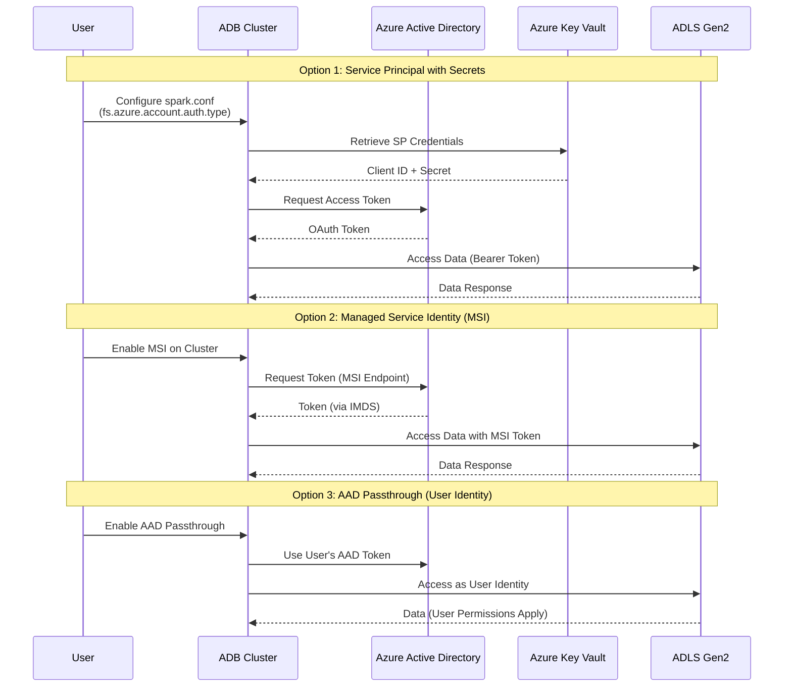
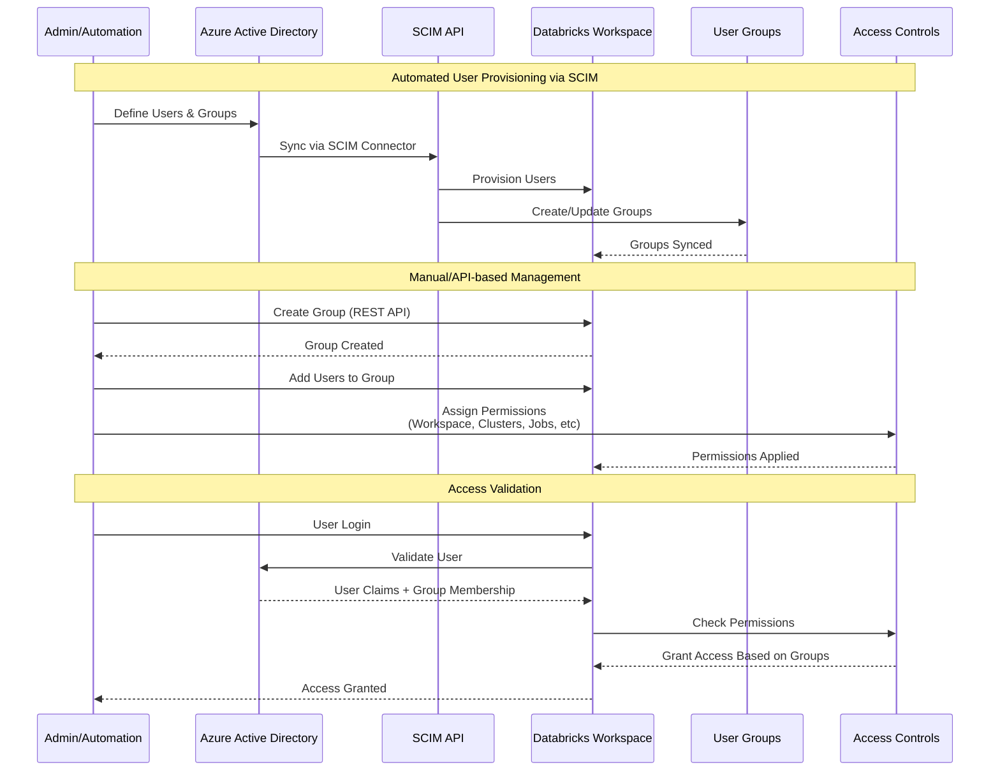
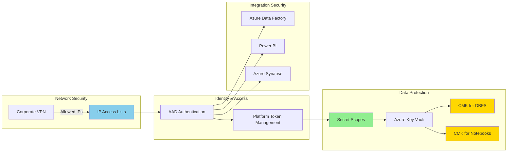
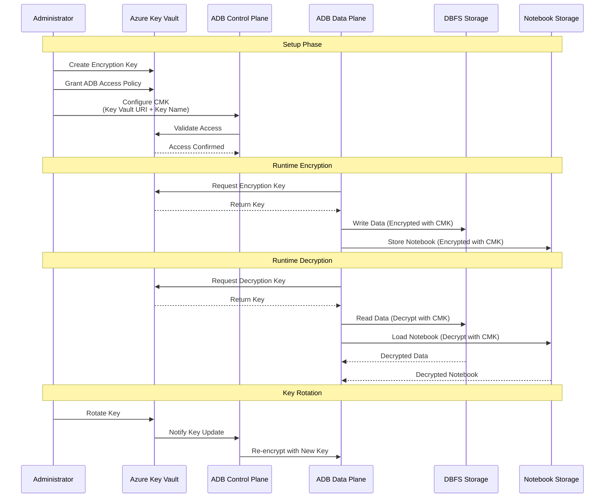

# Azure Databricks Security Best Practices - Legacy Content

**Status**: 📦 **ARCHIVED** - For reference only

This document contains historical best practices and patterns. **For new deployments, use the modular structure in the main repository.**

---

## Architecture Overview

---

## Topics

### Ready to use

#### **Preventing Data Exfiltration** - Secure Deployments
- Deployment walk thru video (link unavailable)

#### **Authenticating API calls using AAD tokens** - Securely accessing Azure Databricks REST API using AAD tokens
- Video walk thru (link unavailable)
- Using Service Principal AAD Tokens (link unavailable)

#### **Accessing ADLS Gen2** - options available to read/write data from ADLS Gen2
- Demo video (link unavailable)

#### **Users and Groups Management** - Automate users/groups onboarding and management
- Demo video (link unavailable)

---

## Work in progress

- **IP Access List** - Connect to Azure Databricks only through existing corporate networks with a secure perimeter
- **Platform tokens** - Manage Azure Databricks platform tokens
- **Working with Secrets**
- **Bring Your Own Keys (Customer Managed Keys)**
  - DBFS
  - Notebooks
- **Securely and Efficiently connect to:**
  - ADF
  - Power BI
  - Synapse DW

### Customer Managed Keys (CMK) Flow

---

**Archived**: 2026-01-10
**Replacement**: See [main README](../README.md) and [docs/](../docs/) for current documentation
