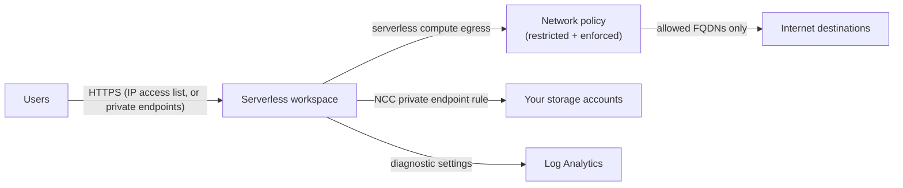

# Serverless Workspace

A serverless-only Azure Databricks workspace (`computeMode = Serverless`).
Serverless compute runs in the Databricks account, so there's **no VNet to
manage**: a resource group, the workspace, and account-level connectivity
(NCC and network policy). A network is created only if you choose a private
front-end.

The workspace is created through the ARM API (AzAPI) with the same call as the
official [Databricks SRA `serverless_workspace` module](https://github.com/databricks/terraform-databricks-sra/tree/main/azure/tf/modules/serverless_workspace).
That module always adds a browser-authentication private endpoint, which forces
a VNet even for a public workspace; this deployment leaves it out unless the
front-end is private. `azurerm_databricks_workspace` can't create serverless
workspaces yet ([azurerm#31218](https://github.com/hashicorp/terraform-provider-azurerm/issues/31218)).

> **Maturity: tested.** Deployed and verified with the Well-Architected Agent
> (plan, state and live scan); mock-provider tests run in CI.

## What gets created

| Resource | Why |
|---|---|
| Resource group | Holds the workspace |
| Workspace (`computeMode = Serverless`) | No VNet injection, managed resource group or classic clusters |
| Contributor on the workspace for the Terraform identity | So the same login can configure the workspace |
| Metastore assignment | Attaches the region's Unity Catalog metastore |
| Network connectivity config (NCC) + binding | Governs serverless connectivity |
| Serverless network policy | `FULL_ACCESS` by default; `RESTRICTED_ACCESS` + `ENFORCED` with `enable_network_policy` |
| *Optional:* NCC private endpoint rules | Serverless → your storage accounts over Private Link |
| *Optional:* IP access lists, workspace settings | Restrict the public front-end; turn off data-leak features |
| *Optional:* customer-managed key | Managed services encryption |
| *Optional:* diagnostic settings | Audit logs via [`modules/monitoring`](../../modules/monitoring) |
| *Only for a private front-end:* VNet, subnet, private DNS zone, UI/API and browser-authentication private endpoints | `enable_public_network_access = false` |



## Use

The simplest path is the Well-Architected Agent, which writes a ready-to-run
folder with inputs and staged settings for a baseline:

```bash
cd well-architected-agent
uv run --frozen wa-agent new --baseline serverless --out ./my-serverless --set location=eastus2
```

Or directly:

```bash
cp terraform.tfvars.example terraform.tfvars
export TF_VAR_databricks_account_id=<account-id>
terraform init
terraform plan -out tf.plan
terraform apply tf.plan
```

Authentication: `ARM_SUBSCRIPTION_ID` plus `ARM_*` service principal variables
or `az login` for Azure. For Databricks, `DATABRICKS_AUTH_TYPE=azure-cli` uses
the same `az login` (the identity must be a Databricks account admin), or set
`DATABRICKS_CLIENT_ID`, `DATABRICKS_CLIENT_SECRET` and `DATABRICKS_AZURE_TENANT_ID`.

## Before you apply

- **Unity Catalog metastore:** set `metastore_id` to the existing metastore in
  this region.
- **Region support:** serverless workspaces need Default Storage in the region.
- **IP access lists:** include the IP Terraform runs from, or Terraform locks
  itself out of the workspace after creating the list.
- **Restricted egress:** with `enable_network_policy = true`, serverless can reach
  only the destinations you list. An empty list blocks package installs (e.g.
  PyPI). Start with `network_policy_enforcement_mode = "DRY_RUN"` to see what
  would be blocked.
- **Private front-end:** with `enable_public_network_access = false`, connect the
  created VNet (peering, VPN or ExpressRoute) to where your users are, and run
  Terraform from there.
- **CMK:** the Key Vault must grant the AzureDatabricks application `get`,
  `wrapKey` and `unwrapKey` on the key
  ([docs](https://learn.microsoft.com/en-us/azure/databricks/security/keys/cmk-managed-services-azure/)).
- **NCC private endpoint rules** start pending. Approve each on the storage
  account after apply.
- **Destroy waits for the account.** The Databricks account detaches the NCC and
  network policy a few minutes after the workspace is deleted; until then it
  refuses to delete them ("attached to … running workspace(s)"). `destroy`
  therefore waits `account_detach_wait` (default `5m`) between the workspace and
  the NCC and policy. If it still fails, wait a few minutes and run `destroy`
  again, or raise `account_detach_wait`.

## Tests

```bash
terraform init -backend=false && terraform test   # mock providers, no credentials
```

## References

- [Serverless workspaces](https://learn.microsoft.com/en-us/azure/databricks/admin/workspace/serverless-workspaces)
- [Serverless network security](https://learn.microsoft.com/en-us/azure/databricks/security/network/serverless-network-security/)
- [Databricks SRA for Azure](https://github.com/databricks/terraform-databricks-sra/tree/main/azure/tf)
