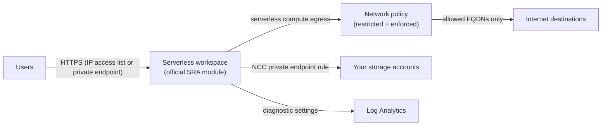

# Serverless Workspace

A serverless-only Azure Databricks workspace (`computeMode = Serverless`). There's
no compute in your VNet: SQL warehouses, notebooks, jobs and apps run on
Databricks serverless compute.

The workspace itself comes from the official
[Databricks Security Reference Architecture `serverless_workspace` module](https://github.com/databricks/terraform-databricks-sra/tree/bc5af72e46e9ddcf21b7eb246b4e4bad0e3d3be4/azure/tf/modules/serverless_workspace),
pinned to a reviewed commit. That module uses the ARM API (AzAPI), because
`azurerm_databricks_workspace` can't create serverless workspaces yet
([azurerm#31218](https://github.com/hashicorp/terraform-provider-azurerm/issues/31218)).
This root supplies what the module needs, plus optional controls.

> **Maturity: validated.** `terraform validate` and mock-provider tests pass
> in CI. Not yet applied end to end; test in a non-production subscription first.

## What gets created

| Resource | Why |
|---|---|
| Resource group, small VNet, private endpoint subnet | The module always creates a browser-authentication private endpoint |
| `privatelink.azuredatabricks.net` zone + VNet link | Resolves the private endpoints |
| Network connectivity config (NCC) | Governs serverless connectivity; bound by the module |
| Serverless network policy | `FULL_ACCESS` by default; `RESTRICTED_ACCESS` + `ENFORCED` with `enable_network_policy` |
| Workspace (official module) | Serverless compute mode, metastore assignment, NCC binding, network policy |
| *Optional:* front-end private endpoint | Created when `enable_public_network_access = false` |
| *Optional:* NCC private endpoint rules | Serverless → your storage accounts over Private Link |
| *Optional:* IP access lists, workspace settings | Restrict the public front-end; turn off data-leak features |
| *Optional:* customer-managed key | Managed services encryption |
| *Optional:* diagnostic settings | Audit logs via [`modules/monitoring`](../../modules/monitoring) |



## Use

The simplest path is the Well-Architected Agent, which writes a ready-to-run
folder with inputs and staged settings for a baseline:

```bash
cd well-architected-agent
uv run wa-agent new --baseline serverless --out ./my-serverless --set location=eastus2
```

Or directly:

```bash
cp terraform.tfvars.example terraform.tfvars   # edit
export TF_VAR_databricks_account_id=<account-id>
terraform init
terraform plan -out tf.plan
terraform apply tf.plan
```

Authentication: `ARM_*` environment variables or `az login` for Azure;
`DATABRICKS_CLIENT_ID`, `DATABRICKS_CLIENT_SECRET` and `DATABRICKS_AZURE_TENANT_ID`
for the Databricks account.

## Before you apply

- **Unity Catalog metastore:** set `metastore_id` to the existing metastore in
  this region (one per region).
- **Region support:** serverless workspaces need Default Storage in the region.
- **Restricted egress:** with `enable_network_policy = true`, serverless can reach
  only the destinations you list. An empty list blocks package installs (e.g.
  PyPI). Start with `network_policy_enforcement_mode = "DRY_RUN"` to see what
  would be blocked.
- **Browser authentication:** the module always creates a `browser_authentication`
  private endpoint. If your network already has a web-auth endpoint for this
  region in the same private DNS zone, review the DNS records it creates.
- **CMK:** the Key Vault must grant the AzureDatabricks application `get`,
  `wrapKey` and `unwrapKey` on the key
  ([docs](https://learn.microsoft.com/en-us/azure/databricks/security/keys/cmk-managed-services-azure/)).
- **NCC private endpoint rules** start pending. Approve each on the storage
  account after apply.

## Tests

```bash
terraform init -backend=false && terraform test   # mock providers, no credentials
```

## References

- [Serverless workspaces](https://learn.microsoft.com/en-us/azure/databricks/admin/workspace/serverless-workspaces)
- [Serverless network security](https://learn.microsoft.com/en-us/azure/databricks/security/network/serverless-network-security/)
- [Databricks SRA for Azure](https://github.com/databricks/terraform-databricks-sra/tree/main/azure/tf)
