# Customer-Managed Keys (CMK) Module

> **Encrypt your workspace data** with your own Azure Key Vault encryption keys for complete control over data security.

---

## Overview

The CMK module enables encryption of Databricks workspace data using customer-managed keys stored in Azure Key Vault. This gives you complete control over encryption keys and allows you to meet compliance requirements for key management.

### What Gets Encrypted

**Three encryption scopes available:**

1. **Managed Services** - Control plane data (notebooks, secrets, queries, cluster configurations)
2. **Managed Disks** - Data plane VM disks (cluster worker node data disks)
3. **DBFS Root** - Workspace storage (DBFS root, libraries, init scripts)

### Key Features

✅ **Auto-Rotation** - Keys automatically rotate every 90 days
✅ **Flexible** - Create new Key Vault or use existing
✅ **Comprehensive** - All three scopes supported
✅ **Access Control** - Automatic access policy configuration
✅ **Single Apply** - Works in one `terraform apply` for fresh deployments

---

## Architecture

### Component Overview

```
┌─────────────────────────────────────────────────────────┐
│              Azure Key Vault (Your Control)             │
│  ┌─────────────────────────────────────────────────┐   │
│  │  CMK Key (Auto-Rotation: 90 days)              │   │
│  │  ├─ Version 1                                   │   │
│  │  ├─ Version 2                                   │   │
│  │  └─ Version N (Active)                          │   │
│  └─────────────────────────────────────────────────┘   │
│                                                          │
│  Access Policies:                                       │
│  ├─ Terraform: Full key management                     │
│  ├─ Databricks SP: Get, WrapKey, UnwrapKey            │
│  └─ DBFS Storage: Get, WrapKey, UnwrapKey             │
└─────────────────────────────────────────────────────────┘
                         │
                         │ Encrypts
                         ▼
┌─────────────────────────────────────────────────────────┐
│           Azure Databricks Workspace                     │
│  ┌────────────────────────────────────────────┐         │
│  │ 🔒 Managed Services (Notebooks, Secrets)   │         │
│  └────────────────────────────────────────────┘         │
│  ┌────────────────────────────────────────────┐         │
│  │ 🔒 Managed Disks (Cluster VM Data Disks)   │         │
│  └────────────────────────────────────────────┘         │
│  ┌────────────────────────────────────────────┐         │
│  │ 🔒 DBFS Root (Workspace Storage)           │         │
│  └────────────────────────────────────────────┘         │
└─────────────────────────────────────────────────────────┘
```

### CMK Encryption Flow

```mermaid
sequenceDiagram
    participant TF as Terraform
    participant KV as Azure Key Vault
    participant DBX as Databricks Workspace
    participant DES as Disk Encryption Set
    participant DBFS as DBFS Storage

    Note over TF,DBFS: Workspace Creation with CMK

    TF->>KV: 1. Create Key Vault + CMK Key
    TF->>KV: 2. Grant access to Terraform
    TF->>KV: 3. Grant access to Databricks SP

    TF->>DBX: 4. Create workspace with CMK enabled
    Note right of DBX: Sets managed_services_cmk<br/>managed_disk_cmk<br/>dbfs_cmk

    DBX-->>DES: 5. Azure auto-creates DES
    Note right of DES: System-assigned<br/>managed identity

    TF->>DES: 6. Read DES identity
    TF->>KV: 7. Grant DES access to Key Vault
    Note right of KV: Get, WrapKey, UnwrapKey

    DBX-->>DBFS: 8. Create DBFS storage account
    Note right of DBFS: customer_managed_key_enabled

    TF->>DBFS: 9. Read storage identity
    TF->>KV: 10. Grant DBFS access to Key Vault

    TF->>DBX: 11. Apply DBFS root CMK

    Note over TF,DBFS: ✅ Workspace Ready with CMK

    rect rgb(240, 255, 240)
    Note over DBX,KV: Runtime: Encryption in Action
    DBX->>KV: Encrypt/Decrypt (Managed Services)
    DES->>KV: Wrap/Unwrap keys (Managed Disks)
    DBFS->>KV: Wrap/Unwrap keys (DBFS Root)
    end
```



### Key Permissions Model

| Component | Identity Type | Permissions | Purpose |
|-----------|--------------|-------------|---------|
| **Terraform** | Service Principal | Get, List, Create, Delete, Update, Recover, Purge, GetRotationPolicy, SetRotationPolicy | Full key management |
| **Databricks SP** | Service Principal | Get, WrapKey, UnwrapKey | Encrypt managed services |
| **Disk Encryption Set** | System-Assigned MI | Get, WrapKey, UnwrapKey | Encrypt cluster VM disks |
| **DBFS Storage** | System-Assigned MI | Get, WrapKey, UnwrapKey | Encrypt workspace storage |

### How It Works

1. **Key Vault Creation** - Module creates (or uses existing) Azure Key Vault with required configuration
2. **CMK Key Generation** - Encryption key created with auto-rotation policy
3. **Access Policies** - Automatic configuration for Terraform, Databricks, and DBFS storage
4. **Workspace Configuration** - Workspace created with CMK references for each scope
5. **Data Encryption** - All data encrypted at rest with your key

---

## Configuration

### Basic Usage

Enable all three CMK scopes:

```hcl
# terraform.tfvars
enable_cmk_managed_services = true  # Notebooks, secrets, queries
enable_cmk_managed_disks    = true  # Cluster VM disks
enable_cmk_dbfs_root        = true  # Workspace storage

create_key_vault = true  # Create new Key Vault
```

### Option 1: Create New Key Vault (Recommended)

```hcl
create_key_vault = true

# Key Vault automatically configured with:
# - Purge protection: Enabled
# - Soft delete: 90 days
# - Key rotation: 90 days
# - RBAC model: Enabled
```

### Option 2: Use Existing Key Vault

```hcl
create_key_vault = false

existing_key_vault_id = "/subscriptions/<sub-id>/resourceGroups/<rg>/providers/Microsoft.KeyVault/vaults/<kv-name>"
existing_key_id       = "https://<kv-name>.vault.azure.net/keys/<key-name>/<version>"  # Optional

# Requirements for existing Key Vault:
# - Purge protection: Must be enabled
# - Soft delete: Must be enabled
# - Access policies: Will be added automatically
```

### Selective Scope Enablement

Enable only specific scopes:

```hcl
# Example: Only encrypt managed services and DBFS
enable_cmk_managed_services = true
enable_cmk_managed_disks    = false  # Skip managed disks
enable_cmk_dbfs_root        = true
```

---

## Module Structure

```
modules/key-vault/
├── main.tf       # Key Vault, key, access policies
├── variables.tf  # Configuration options
└── outputs.tf    # Key Vault ID, key ID, summary
```

### Key Resources

- `azurerm_key_vault` - Key Vault with purge protection
- `azurerm_key_vault_key` - CMK key with rotation policy
- `azurerm_key_vault_access_policy` - Access for Terraform, Databricks, DBFS
- Integration with workspace module for encryption

---

## Practical Usage

### Deployment Workflow

**1. Configure Variables**

```hcl
# Enable CMK in terraform.tfvars
enable_cmk_managed_services = true
enable_cmk_managed_disks    = true
enable_cmk_dbfs_root        = true
create_key_vault            = true
```

**2. Deploy**

```bash
terraform apply
```

**3. Verify**

```bash
terraform output customer_managed_keys
```

Expected output:
```hcl
{
  "auto_rotation_enabled" = true
  "dbfs_root"            = true
  "key_id"               = "https://<workspace-prefix>-kv-<suffix>.vault.azure.net/keys/databricks-cmk/<version>"
  "key_vault_id"         = "/subscriptions/<subscription-id>/resourceGroups/<rg-name>/providers/Microsoft.KeyVault/vaults/<kv-name>"
  "key_vault_name"       = "<workspace-prefix>-kv-<suffix>"
  "managed_disks"        = true
  "managed_services"     = true
}
```

### Validation Checklist

After deployment, verify:

- [ ] Key Vault created (or existing one used)
- [ ] CMK key generated with rotation policy
- [ ] Access policies configured (3 policies: Terraform, Databricks, DBFS)
- [ ] Workspace shows CMK enabled in Azure Portal
- [ ] Cluster can start successfully (validates managed disks CMK)
- [ ] Can read/write to DBFS (validates DBFS root CMK)

### Testing Encryption

**Test Managed Services CMK:**
```python
# Create a notebook and secret
databricks secrets create-scope --scope test-scope
databricks secrets put --scope test-scope --key test-key --string-value "encrypted"

# Verify it's stored (encrypted at rest with your key)
databricks secrets list --scope test-scope
```

**Test Managed Disks CMK:**
```bash
# Start a cluster - disks are automatically encrypted
# Check Azure Portal → Cluster VMs → Disks → Encryption = "Customer-managed key"
```

**Test DBFS Root CMK:**
```python
# Write to DBFS
dbutils.fs.put("/test.txt", "encrypted content")

# Verify storage account encryption in Azure Portal
# Storage Account → Encryption → "Customer-managed keys"
```

---

## How-To Guides

### Rotate Keys Manually

Keys auto-rotate, but you can manually rotate if needed:

```bash
# Azure CLI
az keyvault key rotate \
  --vault-name <key-vault-name> \
  --name databricks-cmk
```

### Update Key Version

```bash
# Get latest key version
az keyvault key show \
  --vault-name <key-vault-name> \
  --name databricks-cmk \
  --query "key.kid"

# Update in terraform.tfvars (if using existing key)
existing_key_id = "https://<kv>.vault.azure.net/keys/databricks-cmk/<new-version>"

terraform apply
```

### Disable CMK (Not Recommended)

⚠️ **Warning**: Cannot disable CMK once enabled. You must destroy and recreate workspace.

---

## Troubleshooting

### Issue: "Storage account identity is empty"

**Cause**: Workspace not configured for CMK infrastructure.

**Solution**: Ensure `customer_managed_key_enabled = true` is set on workspace.

### Issue: "Authentication issue on keyvault"

**Cause**: DBFS storage account missing access policy.

**Solution**: Check `azurerm_key_vault_access_policy.dbfs_storage` exists.

### Issue: Workspace destroy fails

**Cause**: Key Vault still in use.

**Solution**: Module handles this automatically via `depends_on` ordering.

---

## Best Practices

✅ **DO:**
- Enable all three scopes for comprehensive encryption
- Use auto-rotation (90-day default)
- Set `create_key_vault = true` for new deployments
- Enable purge protection on Key Vault
- Tag Key Vault appropriately

❌ **DON'T:**
- Disable purge protection on Key Vault
- Share Key Vault across multiple workspaces
- Delete Key Vault before workspace
- Manually modify access policies created by Terraform

---

## Cost Considerations

- **Key Vault**: ~$0.03/month per vault
- **CMK Operations**: ~$0.03 per 10,000 operations
- **Key Rotations**: Included (no extra cost)

**Typical monthly cost**: < $5 for standard usage

---

## References

**Azure Documentation:**
- [CMK for Managed Services](https://learn.microsoft.com/en-us/azure/databricks/security/keys/cmk-managed-services-azure/)
- [CMK for Managed Disks](https://learn.microsoft.com/en-us/azure/databricks/security/keys/cmk-managed-disks-azure/)
- [Azure Key Vault](https://learn.microsoft.com/en-us/azure/key-vault/)

**Terraform Providers:**
- [azurerm_key_vault](https://registry.terraform.io/providers/hashicorp/azurerm/latest/docs/resources/key_vault)
- [azurerm_databricks_workspace](https://registry.terraform.io/providers/hashicorp/azurerm/latest/docs/resources/databricks_workspace)
- [azurerm_databricks_workspace_root_dbfs_customer_managed_key](https://registry.terraform.io/providers/hashicorp/azurerm/latest/docs/resources/databricks_workspace_root_dbfs_customer_managed_key)

**Related Guides:**
- [CMK Configuration Guide](../guides/02-CMK-CONFIGURATION.md)
- [Workspace Module](02-WORKSPACE.md)
- [Troubleshooting](../04-TROUBLESHOOTING.md)
