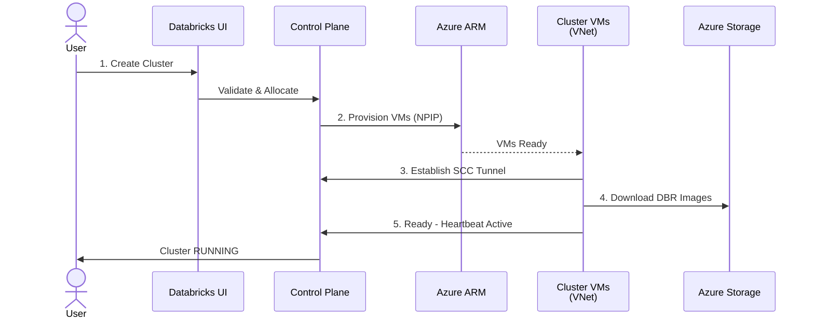
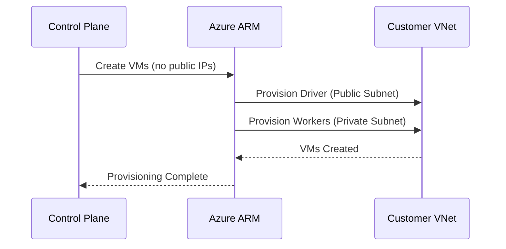

***REMOVED*** Non-Private Link (Non-PL) Deployment Pattern

**Pattern**: `deployments/non-pl`  
**Status**: ✅ **Production Ready**

---

***REMOVED******REMOVED*** Overview

The Non-Private Link (Non-PL) pattern provides a **secure** Azure Databricks deployment with:
- **Public control plane** (UI/API accessible from internet)
- **Private data plane** (NPIP - no public IPs on clusters)
- **NAT Gateway** for managed internet egress
- **Unity Catalog** for data governance
- **Service Endpoints** for storage connectivity
- **Network Connectivity Configuration (NCC)** for serverless compute

***REMOVED******REMOVED******REMOVED*** Use Cases

✅ **Standard production workloads**  
✅ **Teams needing internet access** (PyPI, Maven, etc.)  
✅ **Development and testing environments**  
✅ **Proof of concepts and demos**

---

***REMOVED******REMOVED*** Architecture

***REMOVED******REMOVED******REMOVED*** **High-Level Design**

```
┌──────────────────────────────────────────────────────────────────┐
│ Internet                                                          │
└──────────────────────────────────────────────────────────────────┘
    │                                      ↑
    │ (HTTPS)                              │ (Egress via NAT)
    ↓                                      │
┌──────────────────────────────────────────────────────────────────┐
│ Databricks SaaS (Microsoft Managed)                              │
│  ┌────────────────────────────────────────────────────────────┐  │
│  │ Workspace Services                                          │  │
│  │ - Web UI: https://adb-123.azuredatabricks.net              │  │
│  │ - REST API                                                  │  │
│  │ - SCC Relay (cluster connectivity)                         │  │
│  └────────────────────────────────────────────────────────────┘  │
│  ┌────────────────────────────────────────────────────────────┐  │
│  │ Serverless Compute Plane (Optional)                        │  │
│  │ - SQL Warehouses                                            │  │
│  │ - Serverless Notebooks                                      │  │
│  │ - Connects to customer storage via NCC                     │  │
│  └────────────────────────────────────────────────────────────┘  │
└──────────────────────────────────────────────────────────────────┘
    │                                      │
    │ (SCC over Azure backbone)            │ (NCC - Service EP or PL)
    ↓                                      ↓
┌──────────────────────────────────────────────────────────────────┐
│ Customer VNet (VNet Injection)                                    │
│  ┌────────────────────────────┐  ┌──────────────────────────┐   │
│  │ Public/Host Subnet         │  │ Private/Container Subnet │   │
│  │ (10.100.1.0/26)            │  │ (10.100.2.0/26)          │   │
│  │                            │  │                          │   │
│  │ - Driver Nodes             │  │ - Worker Nodes           │   │
│  │ - No Public IPs (NPIP)     │  │ - No Public IPs (NPIP)   │   │
│  │ - NAT Gateway attached     │  │ - NAT Gateway attached   │   │
│  └────────────────────────────┘  └──────────────────────────┘   │
│          │                                   │                    │
│          └───────────────┬───────────────────┘                    │
│                          │                                        │
│  ┌────────────────────────────────────────────────────────────┐  │
│  │ Network Security Group (NSG)                                │  │
│  │ - Databricks-managed rules (automatic)                     │  │
│  │ - Worker-to-worker communication                           │  │
│  └────────────────────────────────────────────────────────────┘  │
│                          │                                        │
│  ┌────────────────────────────────────────────────────────────┐  │
│  │ NAT Gateway                                                 │  │
│  │ - Stable outbound IP: 203.0.113.45                         │  │
│  │ - PyPI, Maven, custom repos                                │  │
│  └────────────────────────────────────────────────────────────┘  │
└──────────────────────────────────────────────────────────────────┘
    │                                      │
    │ (Service Endpoints)                  │ (Service EP or PL via NCC)
    ↓                                      ↓
┌──────────────────────────────────────────────────────────────────┐
│ Azure Storage (ADLS Gen2)                                         │
│  ┌────────────────────────────────────────────────────────────┐  │
│  │ Unity Catalog Metastore Storage                             │  │
│  │ - Classic: Service Endpoints                                │  │
│  │ - Serverless: Service Endpoints or PL via NCC               │  │
│  └────────────────────────────────────────────────────────────┘  │
│  ┌────────────────────────────────────────────────────────────┐  │
│  │ External Location Storage (Per-Workspace)                  │  │
│  │ - Classic: Service Endpoints                                │  │
│  │ - Serverless: Service Endpoints or PL via NCC               │  │
│  └────────────────────────────────────────────────────────────┘  │
└──────────────────────────────────────────────────────────────────┘

┌────────────────────────────────────────────────────────────────────┐
│ Network Connectivity Configuration (NCC)                           │
│ - Created automatically (mandatory)                                │
│ - Enables serverless → customer storage connectivity             │
│ - Configuration: Empty (no PE rules in Terraform)                 │
│ - Setup: Manual (see SERVERLESS-SETUP.md)                         │
└────────────────────────────────────────────────────────────────────┘
```

---

***REMOVED******REMOVED*** Architecture Diagrams

***REMOVED******REMOVED******REMOVED*** High-Level Architecture (Mermaid)

```mermaid
graph TB
    subgraph Internet
        User[User Browser]
        PyPI[PyPI/Maven<br/>Custom Repos]
    end
    
    subgraph Azure["Azure Cloud"]
        subgraph ControlPlane["Databricks Control Plane<br/>(Microsoft-Managed)"]
            UI[Web UI/API]
            ClusterMgr[Cluster Manager]
            MetaService[Metadata Service]
        end
        
        subgraph CustomerVNet["Customer VNet (10.100.0.0/16)"]
            subgraph PublicSubnet["Public/Host Subnet<br/>(10.100.1.0/26)"]
                Driver[Driver Node<br/>No Public IP]
            end
            
            subgraph PrivateSubnet["Private/Container Subnet<br/>(10.100.2.0/26)"]
                Worker1[Worker Node 1<br/>No Public IP]
                Worker2[Worker Node 2<br/>No Public IP]
            end
            
            NSG[Network Security Group<br/>Service Tags:<br/>AzureDatabricks, Storage, EventHub]
            NAT[NAT Gateway<br/>203.0.113.45]
        end
        
        subgraph Storage["Azure Storage"]
            DBFS[DBFS Root<br/>Databricks-Managed]
            UCMetastore[UC Metastore<br/>Customer-Owned]
            ExtLocation[External Location<br/>Customer-Owned]
            DBRImages[DBR Runtime Images<br/>Databricks-Managed<br/>dbartifactsprod*]
        end
        
        EventHub[Event Hub<br/>Logs & Metrics]
    end
    
    User -->|HTTPS| UI
    UI -->|Commands| ClusterMgr
    
    ClusterMgr -.->|Provisions| Driver
    ClusterMgr -.->|Provisions| Worker1
    ClusterMgr -.->|Provisions| Worker2
    
    Driver -->|NSG: AzureDatabricks| ControlPlane
    Worker1 -->|NSG: AzureDatabricks| ControlPlane
    Worker2 -->|NSG: AzureDatabricks| ControlPlane
    
    Driver -->|NAT Gateway| PyPI
    Worker1 -->|NAT Gateway| PyPI
    Worker2 -->|NAT Gateway| PyPI
    
    Driver -->|NSG: Storage<br/>Service Endpoint| DBFS
    Driver -->|NSG: Storage<br/>Service Endpoint| UCMetastore
    Driver -->|NSG: Storage<br/>Service Endpoint| ExtLocation
    Driver -->|NSG: Storage<br/>Service Endpoint| DBRImages
    
    Worker1 -->|NSG: Storage<br/>Service Endpoint| ExtLocation
    Worker1 -->|NSG: Storage<br/>Service Endpoint| DBRImages
    Worker2 -->|NSG: Storage<br/>Service Endpoint| ExtLocation
    Worker2 -->|NSG: Storage<br/>Service Endpoint| DBRImages
    
    Driver -->|NSG: EventHub| EventHub
    Worker1 -->|NSG: EventHub| EventHub
    Worker2 -->|NSG: EventHub| EventHub
    
    Driver <-->|Within VNet| Worker1
    Driver <-->|Within VNet| Worker2
    Worker1 <-->|Within VNet| Worker2
    
    style ControlPlane fill:***REMOVED***e1f5ff
    style CustomerVNet fill:***REMOVED***fff4e1
    style Storage fill:***REMOVED***e8f5e9
    style NAT fill:***REMOVED***ffebee
    style NSG fill:***REMOVED***f3e5f5
```

***REMOVED******REMOVED******REMOVED*** Traffic Flow Routing

```mermaid
graph LR
    subgraph VNet["Customer VNet"]
        VM[Cluster VMs<br/>No Public IPs]
        NSG[NSG Outbound Rules]
    end
    
    subgraph Destinations
        DB[Databricks Control Plane]
        ST[Azure Storage]
        EH[Event Hub]
        INT[Internet<br/>PyPI/Maven/Docker]
    end
    
    NAT[NAT Gateway<br/>Public IP]
    
    VM --> NSG
    
    NSG -->|Service Tag:<br/>AzureDatabricks| DB
    NSG -->|Service Tag:<br/>Storage<br/>+Service Endpoint| ST
    NSG -->|Service Tag:<br/>EventHub| EH
    NSG -->|Default Route| NAT
    NAT -->|SNAT| INT
    
    style NSG fill:***REMOVED***f3e5f5
    style NAT fill:***REMOVED***ffebee
    style DB fill:***REMOVED***e1f5ff
    style ST fill:***REMOVED***e8f5e9
    style EH fill:***REMOVED***fff9c4
    style INT fill:***REMOVED***ffebee
```

---

***REMOVED******REMOVED*** Serverless Compute Connectivity

***REMOVED******REMOVED******REMOVED*** **Overview**

This deployment includes Network Connectivity Configuration (NCC) for serverless compute (SQL Warehouses, Serverless Notebooks).

| Component | Classic Clusters | Serverless Compute |
|-----------|------------------|-------------------|
| **Runs In** | Customer VNet | Databricks-managed VNet |
| **Storage Access** | Service Endpoints (VNet) | Service Endpoints or Private Link (NCC) |
| **Setup** | ✅ Immediate | ⏸️ Manual configuration required |
| **Use Cases** | ETL, ML, batch jobs | SQL queries, ad-hoc analysis |

***REMOVED******REMOVED******REMOVED*** **Serverless Connectivity Options**

***REMOVED******REMOVED******REMOVED******REMOVED*** **Option A: Service Endpoints** (Recommended)

**How It Works**:
```
Serverless Compute → NCC → Service Endpoint → Storage
(Databricks VNet)          (Azure backbone)    (Your subscription)
```

**Benefits**:
- ✅ **Setup**: Simple firewall configuration
- ✅ **Performance**: Low latency via Azure backbone
- ✅ **Security**: Traffic stays on Azure network (never touches internet)

**Setup Steps** (Manual):
1. Enable serverless in Databricks UI
2. Get serverless subnet IDs from Databricks
3. Add subnet IDs to storage account firewall

**Documentation**: See [../deployments/non-pl/docs/SERVERLESS-SETUP.md](../../deployments/non-pl/docs/SERVERLESS-SETUP.md)

---

***REMOVED******REMOVED******REMOVED******REMOVED*** **Option B: Private Link via NCC**

**How It Works**:
```
Serverless Compute → NCC → Private Endpoint → Storage
(Databricks VNet)          (Private Link)      (Your subscription)
```

**Benefits**:
- ✅ **Security**: Fully isolated (zero public routing)
- ✅ **Performance**: Best latency
- ✅ **Compliance**: Meets strict network isolation requirements

**Setup Steps** (Manual):
1. Enable serverless with Private Link in Databricks UI
2. Approve Private Endpoint connections in Azure Portal
3. Verify connection status
4. (Optional) Lock down storage public access

**Documentation**: See [../deployments/non-pl/docs/SERVERLESS-SETUP.md](../../deployments/non-pl/docs/SERVERLESS-SETUP.md)

---

***REMOVED******REMOVED******REMOVED*** **NCC Configuration**

**What's Created by Terraform**:
```hcl
module "ncc" {
  source = "../../modules/ncc"
  
  workspace_id_numeric = module.workspace.workspace_id_numeric
  workspace_prefix     = var.workspace_prefix
  location             = var.location
}
```

**Resources**:
- ✅ `databricks_mws_network_connectivity_config` - NCC configuration
- ✅ `databricks_mws_ncc_binding` - Binds NCC to workspace
- ❌ NO Private Endpoint rules (manual setup required)

**Why Manual Setup?**:
- Private Endpoint connections from Databricks to customer storage require **manual approval** in Azure Portal
- Service Endpoint option requires **firewall configuration** with serverless subnet IDs
- Both approaches need customer decision on which option to use

**After Deployment**:
```bash
***REMOVED*** Check NCC is attached
terraform output ncc_id
***REMOVED*** Output: ncc-abc123

terraform output ncc_name
***REMOVED*** Output: proddb-ncc
```

---

***REMOVED******REMOVED******REMOVED*** **Recommendation**

| Scenario | Recommended Option |
|----------|-------------------|
| **Development/Testing** | Service Endpoints |
| **Standard production** | Service Endpoints |
| **Highly regulated** | Private Link |
| **Zero-trust networks** | Private Link |
| **Air-gapped requirements** | Private Link |

**Default Choice**: Start with **Service Endpoints** (simpler). Upgrade to Private Link later if needed.

---

***REMOVED******REMOVED*** Traffic Flow: Cluster Startup Sequence

This section documents the network traffic flow when a Databricks cluster starts.

**Contents**:
- [High-Level Flow](***REMOVED***high-level-cluster-startup) - Quick overview (30 seconds)
- [Detailed Phase Breakdown](***REMOVED***detailed-phase-breakdown) - Per-phase traffic analysis
- [Network Routing Table](***REMOVED***network-routing-summary) - Where each traffic type goes

---

***REMOVED******REMOVED******REMOVED*** High-Level Cluster Startup

**Simplified 5-Phase Flow**:



**Timeline**: ~3-5 minutes from creation to ready state

**Key Points**:
- ✅ VMs have **no public IPs** (NPIP enabled)
- ✅ Control plane traffic via **NSG service tag** (not NAT)
- ✅ Storage access via **Service Endpoints** (Azure backbone)
- ✅ User libraries via **NAT Gateway** (PyPI/Maven)

---

***REMOVED******REMOVED******REMOVED*** Detailed Phase Breakdown

***REMOVED******REMOVED******REMOVED******REMOVED*** **Phase 1: Cluster Request** (T+0s)

```
User → Databricks UI/API
├─ POST /api/2.0/clusters/create
├─ Payload: {node_type, count, dbr_version}
└─ Response: Cluster ID (pending state)
```

**Network Path**: User → Public Internet → Databricks SaaS (Azure region)

---

***REMOVED******REMOVED******REMOVED******REMOVED*** **Phase 2: VM Provisioning** (T+0s to T+2min)



**Resources Created**:
- Driver VM (public subnet, no public IP)
- Worker VMs (private subnet, no public IP)
- Managed disks (encrypted if CMK enabled)
- NSG rules (auto-applied by Databricks)

---

***REMOVED******REMOVED******REMOVED******REMOVED*** **Phase 3: Control Plane Tunnel** (T+2min to T+3min)

```
Cluster VMs → NSG (AzureDatabricks tag) → Control Plane

Protocol: HTTPS/WebSocket (443)
Direction: Outbound only (VNet initiates)
Purpose: Cluster management, commands, monitoring
Routing: NOT via NAT Gateway (direct via NSG service tag)
```

**Traffic Type**: Heartbeats (every 30s) + Commands

---

***REMOVED******REMOVED******REMOVED******REMOVED*** **Phase 4: Resource Downloads** (T+2min to T+4min)

**4a. DBR Images** (Databricks Runtime):
```
Cluster VMs → NSG (Storage tag) → Databricks-Managed Storage

Source: dbartifactsprod*, dblogprod* (Databricks subscription)
Size: 2-5 GB per cluster
Routing: Service Endpoint (Azure backbone)
Authentication: Managed by Databricks
```

**4b. User Libraries** (Optional):
```
Cluster VMs → NAT Gateway → Internet

Examples: pip install pandas, Maven dependencies
Source: PyPI, Maven Central, custom repos
Routing: NAT Gateway (public IP for whitelisting)
```

---

***REMOVED******REMOVED******REMOVED******REMOVED*** **Phase 5: Storage Access** (T+3min onwards)

```mermaid
graph LR
    Cluster[Cluster VMs]
    NSG[NSG: Storage Tag]
    SE[Service Endpoint]
    
    subgraph Storage["Azure Storage (Customer)"]
        DBFS[DBFS Root]
        UC[UC Metastore]
        ExtLoc[External Location]
    end
    
    Cluster --> NSG
    NSG --> SE
    SE --> DBFS
    SE --> UC
    SE --> ExtLoc
    
    style NSG fill:***REMOVED***f3e5f5
    style SE fill:***REMOVED***e8f5e9
```

**Access Pattern**:
- DBFS: Init scripts, cluster logs, libraries
- UC Metastore: Table metadata, schemas, permissions
- External Location: User data (Delta, Parquet, etc.)

**Authentication**: Managed Identity (Access Connector) via RBAC

---

***REMOVED******REMOVED******REMOVED*** Network Routing Summary

| Traffic Type | Source | Destination | Path | Authentication |
|--------------|--------|-------------|------|----------------|
| **Control Plane** | Cluster VMs | Databricks SaaS | NSG: AzureDatabricks | Databricks-managed |
| **DBR Images** | Cluster VMs | Databricks Storage | NSG: Storage → Backbone | Databricks-managed |
| **User Libraries** | Cluster VMs | Internet (PyPI/Maven) | NAT Gateway → Internet | N/A |
| **DBFS Access** | Cluster VMs | DBFS (Customer) | NSG: Storage → Service Endpoint | Managed Identity |
| **UC Metastore** | Cluster VMs | UC Storage (Customer) | NSG: Storage → Service Endpoint | Managed Identity |
| **External Data** | Cluster VMs | External Location | NSG: Storage → Service Endpoint | Managed Identity |
| **Worker-to-Worker** | Worker VMs | Worker VMs | Within VNet | N/A |
| **Logs/Metrics** | Cluster VMs | Event Hub | NSG: EventHub | Databricks-managed |

**Key NSG Service Tags**:
- `AzureDatabricks` - Control plane communication
- `Storage` - All Azure Storage access (Databricks + Customer)
- `EventHub` - Logs and metrics
- Default route (0.0.0.0/0) → NAT Gateway for internet

---

***REMOVED******REMOVED******REMOVED*** Traffic Flow Diagram (Simplified)

```
┌─────────────┐
│ User/API    │
└──────┬──────┘
       │
       ↓
┌─────────────────────────────────────┐
│ Databricks Control Plane (SaaS)    │
│ - Cluster Manager                   │
│ - Metadata Service                  │
└──────┬──────────────────────────────┘
       │
       │ Provisions VMs
       ↓
┌─────────────────────────────────────┐
│ Customer VNet (VNet Injection)      │
│  ┌────────────┐  ┌────────────┐    │
│  │ Driver VM  │  │ Worker VMs │    │
│  │ (No Pub IP)│  │ (No Pub IP)│    │
│  └─────┬──────┘  └──────┬─────┘    │
│        │                 │           │
│   ┌────┴─────────────────┴────┐    │
│   │ NSG (Service Tags)        │    │
│   │ - AzureDatabricks (CP)    │    │
│   │ - Storage (SE backbone)   │    │
│   │ - EventHub (logs)         │    │
│   │ - Default → NAT           │    │
│   └────┬──────────────────────┘    │
│        │                            │
│   ┌────┴────────┐                  │
│   │ NAT Gateway │                  │
│   │ (Pub IP)    │                  │
│   └─────────────┘                  │
└─────────────────────────────────────┘
       │        │        │
       │        │        └─→ Internet (PyPI/Maven)
       │        │
       │        └─→ Azure Storage (Service Endpoints)
       │            - DBFS Root
       │            - UC Metastore
       │            - External Location
       │
       └─→ Databricks Storage (DBR Images)
           - dbartifactsprod*
           - dblogprod*
```

---

***REMOVED******REMOVED******REMOVED*** Security Controls

| Layer | Control | Purpose |
|-------|---------|---------|
| **Network** | NPIP (No Public IPs) | Prevents direct internet access to VMs |
| **Network** | NSG Rules | Controls allowed inbound/outbound traffic |
| **Network** | Service Endpoints | Secures storage access via Azure backbone |
| **Egress** | NAT Gateway | Provides stable outbound IP for whitelisting |
| **Authentication** | Managed Identity | Passwordless auth to storage (Access Connector) |
| **Data** | TLS 1.2+ | Encrypted in transit for all connections |
| **Data** | RBAC | Fine-grained access control via Unity Catalog |

---

**📖 For More Details**: See [Traffic Flows Deep Dive](../../docs/TRAFFIC-FLOWS.md) for complete sequence diagrams and packet-level analysis.

---

***REMOVED******REMOVED*** Features

***REMOVED******REMOVED******REMOVED*** Included Features

| Feature | Status | Details |
|---------|--------|---------|
| **Secure Cluster Connectivity (NPIP)** | ✅ Always enabled | No public IPs on clusters |
| **VNet Injection** | ✅ Always enabled | Deploy into customer VNet |
| **NAT Gateway** | ✅ Default enabled | Stable egress IP for internet access |
| **Unity Catalog** | ✅ Mandatory | Data governance and access control |
| **Service Endpoints** | ✅ Always enabled | Azure Storage and Key Vault |
| **BYOV Support** | ✅ Optional | Bring Your Own VNet/Subnets/NSG |
| **Customer-Managed Keys** | ✅ Optional | CMK for managed services, disks, DBFS |
| **IP Access Lists** | ✅ Optional | Restrict workspace access by IP |
| **Random Suffixes** | ✅ Always enabled | Prevent naming conflicts |
| **Resource Tagging** | ✅ Always enabled | Owner and KeepUntil tags |

***REMOVED******REMOVED******REMOVED*** Not Included

| Feature | Status | Alternative |
|---------|--------|-------------|
| **Private Link** (Classic) | ❌ Not included | Use `full-private` pattern |
| **Hub-Spoke Topology** | ❌ Not included | Use `hub-spoke` pattern (future) |
| **Azure Firewall** | ❌ Not included | Use `hub-spoke` pattern (future) |

**Note**: Private Link for **serverless compute** is available via NCC (see [Serverless Compute Connectivity](***REMOVED***serverless-compute-connectivity)).

---

***REMOVED******REMOVED*** Deployment

***REMOVED******REMOVED******REMOVED*** Prerequisites

See [Quick Start Guide](../01-QUICKSTART.md***REMOVED***prerequisites) for complete details.

**Required**:
- Azure subscription with appropriate permissions
- Terraform >= 1.5
- Azure CLI (for development) or Service Principal (for CI/CD)
- Databricks Account ID

**Environment Variables**:
```bash
***REMOVED*** Azure Authentication
export ARM_SUBSCRIPTION_ID="..."
export ARM_TENANT_ID="..."

***REMOVED*** Databricks Authentication
export DATABRICKS_ACCOUNT_ID="..."
export DATABRICKS_AZURE_TENANT_ID="$ARM_TENANT_ID"
```

***REMOVED******REMOVED******REMOVED*** Quick Deploy

```bash
***REMOVED*** 1. Navigate to deployment folder
cd deployments/non-pl

***REMOVED*** 2. Copy and configure variables
cp terraform.tfvars.example terraform.tfvars
vim terraform.tfvars

***REMOVED*** 3. Initialize Terraform
terraform init

***REMOVED*** 4. Review deployment plan
terraform plan

***REMOVED*** 5. Deploy
terraform apply
```

***REMOVED******REMOVED******REMOVED*** Deployment Time

- **Initial deployment**: 15-20 minutes
- **Subsequent deployments**: 10-15 minutes

---

***REMOVED******REMOVED*** Configuration

***REMOVED******REMOVED******REMOVED*** Required Variables

```hcl
***REMOVED*** terraform.tfvars

***REMOVED*** Core Configuration
workspace_prefix    = "proddb"          ***REMOVED*** Lowercase, alphanumeric, max 12 chars
location           = "eastus2"          ***REMOVED*** Azure region
resource_group_name = "rg-databricks-prod-eastus2"

***REMOVED*** Databricks Configuration
databricks_account_id = "12345678-1234-1234-1234-123456789012"  ***REMOVED*** Your account ID

***REMOVED*** Unity Catalog
metastore_name = "prod-eastus2-metastore"  ***REMOVED*** Or use existing metastore ID

***REMOVED*** Tags
tag_owner     = "platform-team@company.com"
tag_keepuntil = "12/31/2026"

***REMOVED*** Standard tags
tags = {
  Environment = "Production"
  ManagedBy   = "Terraform"
  Project     = "DataPlatform"
}
```

***REMOVED******REMOVED******REMOVED*** Optional Configurations

**BYOV (Bring Your Own VNet)**:
```hcl
use_existing_network        = true
existing_vnet_name          = "existing-vnet"
existing_resource_group_name = "existing-rg"
existing_public_subnet_name  = "databricks-public"
existing_private_subnet_name = "databricks-private"
existing_nsg_name           = "databricks-nsg"
```

**Customer-Managed Keys**:
```hcl
enable_cmk_managed_services = true
enable_cmk_managed_disks    = true
enable_cmk_dbfs_root        = true
cmk_key_vault_key_id        = "/subscriptions/.../keys/databricks-cmk"
cmk_key_vault_id            = "/subscriptions/.../vaults/databricks-kv"
```

**IP Access Lists**:
```hcl
enable_ip_access_lists = true
allowed_ip_ranges = [
  "203.0.113.0/24",    ***REMOVED*** Corporate office
  "198.51.100.0/24",   ***REMOVED*** Remote office
]
```

**Unity Catalog (Existing Metastore)**:
```hcl
create_metastore      = false
existing_metastore_id = "abc-123-def-456"  ***REMOVED*** From first workspace
```

---

***REMOVED******REMOVED*** Outputs

***REMOVED******REMOVED******REMOVED*** Essential Outputs

```hcl
workspace_url               = "https://adb-1234567890123456.azuredatabricks.net"
workspace_id                = "/subscriptions/.../databrickses/proddb-workspace"
resource_group_name         = "rg-databricks-prod-eastus2"
vnet_name                   = "proddb-vnet-9a8b"
nat_gateway_public_ip       = "203.0.113.45"
metastore_id                = "abc-123-def-456"
external_location_url       = "abfss://external@proddbexternal9a8b.dfs.core.windows.net/"
```

***REMOVED******REMOVED******REMOVED*** Deployment Summary

```hcl
deployment_summary = {
  pattern             = "non-pl"
  deployment_type     = "Non-Private Link"
  control_plane       = "Public"
  data_plane          = "Private (NPIP)"
  egress_method       = "NAT Gateway"
  storage_connectivity = "Service Endpoints"
  unity_catalog       = "Enabled"
}
```

---

***REMOVED******REMOVED*** Security

***REMOVED******REMOVED******REMOVED*** Network Security

**Secure Cluster Connectivity (NPIP)**:
- ✅ No public IPs on cluster VMs
- ✅ All cluster communication within VNet
- ✅ Control plane access via secure tunnel

**NSG Rules**:
- ✅ Databricks manages NSG rules automatically
- ✅ Worker-to-worker communication allowed
- ✅ Control plane communication secured
- ❌ Do not manually add rules to Databricks NSG

**Service Endpoints**:
- ✅ Direct Azure backbone routing to storage
- ✅ No internet exposure for storage traffic

***REMOVED******REMOVED******REMOVED*** Data Security

**Unity Catalog**:
- ✅ Fine-grained access control (GRANT/REVOKE)
- ✅ Data lineage and audit logging
- ✅ Centralized governance across workspaces

**Storage Security**:
- ✅ HTTPS-only (TLS 1.2+)
- ✅ Managed identity authentication (no keys)
- ✅ Storage Blob Data Contributor RBAC

**Optional CMK**:
- ✅ Managed services encryption (notebooks, secrets)
- ✅ Managed disks encryption (cluster VMs)
- ✅ DBFS root encryption (workspace storage)

---

***REMOVED******REMOVED*** Operations

***REMOVED******REMOVED******REMOVED*** Monitoring

**Azure Monitor**:
```bash
***REMOVED*** View workspace activity
az monitor activity-log list \
  --resource-group rg-databricks-prod-eastus2 \
  --resource-id /subscriptions/.../databrickses/proddb-workspace
```

**Databricks Audit Logs**:
- Enabled by default with Unity Catalog
- Tracks all workspace and data access
- Available via Databricks System Tables

***REMOVED******REMOVED******REMOVED*** Scaling

**Cluster Autoscaling**:
- Configure min/max workers per cluster
- Scales based on workload demand
- Autotermination after idle time

**Workspace Scaling**:
- No limit on concurrent clusters (DBU-based)
- Unity Catalog shared across workspaces
- Network resources sized appropriately

***REMOVED******REMOVED******REMOVED*** Backup and Disaster Recovery

**Databricks Workspace**:
- Notebooks: Export via Workspace API or Repos
- Jobs: Export job definitions
- Clusters: Document cluster configurations

**Unity Catalog**:
- Metadata: Backed up by Databricks
- Data: Customer-owned storage (ADLS Gen2)
- Recovery: Point-in-time restore via storage snapshots

---

***REMOVED******REMOVED*** Troubleshooting

See [Troubleshooting Guide](../TROUBLESHOOTING.md) for comprehensive issue resolution.

***REMOVED******REMOVED******REMOVED*** Common Issues

**Issue**: NSG Rule Conflicts

**Error**:
```
Security rule conflicts with Microsoft.Databricks-workspaces_UseOnly_*
```

**Solution**: Non-PL workspaces auto-create NSG rules. Do not manually add rules.

---

**Issue**: NAT Gateway Not Working

**Symptom**: Clusters cannot download packages from PyPI/Maven

**Solution**:
1. Verify NAT Gateway is attached to subnets
2. Check route tables (should be automatic)
3. Verify `enable_nat_gateway = true`

---

**Issue**: Unity Catalog Metastore Exists

**Error**:
```
Error: cannot create metastore: Metastore 'prod-eastus2-metastore' already exists
```

**Solution**: Use existing metastore:
```hcl
create_metastore      = false
existing_metastore_id = "abc-123-def-456"
```

---

***REMOVED******REMOVED*** Best Practices

***REMOVED******REMOVED******REMOVED*** Naming Conventions

```hcl
workspace_prefix = "{env}{app}"  ***REMOVED*** e.g., proddb, devml, stageetl
resource_group_name = "rg-databricks-{env}-{location}"
metastore_name = "{env}-{location}-metastore"
```

***REMOVED******REMOVED******REMOVED*** Resource Tagging

```hcl
tags = {
  Environment     = "Production"
  ManagedBy       = "Terraform"
  Project         = "DataPlatform"
  CostCenter      = "IT-Analytics"
  DataSensitivity = "Confidential"
}
```

***REMOVED******REMOVED******REMOVED*** Network Planning

- **Subnet Sizing**: Use `/24` (256 IPs) for production
- **VNet CIDR**: Avoid conflicts with other VNets (plan for peering)
- **NAT Gateway**: Always enable for Non-PL pattern

***REMOVED******REMOVED******REMOVED*** Resource Management

- **Cluster Policies**: Enforce autotermination and max DBUs
- **Storage Lifecycle**: Archive old data to cool/archive tiers
- **Unity Catalog**: Share metastore across regional workspaces
- **Tagging**: Use tags for resource organization

---

***REMOVED******REMOVED*** Migration from Legacy Templates

If migrating from legacy templates in `templates/terraform-scripts/adb-npip`:

1. **Review [Migration Guide](../../docs/MIGRATION.md)** (coming soon)
2. **Backup existing workspace** (notebooks, jobs, clusters)
3. **Document current configuration** (network, Unity Catalog, etc.)
4. **Deploy new workspace** in parallel (test thoroughly)
5. **Migrate data and jobs** to new workspace
6. **Decommission old workspace** after validation

---

***REMOVED******REMOVED*** Next Steps

***REMOVED******REMOVED******REMOVED*** After Deployment

1. ✅ **Verify workspace access**: Open `workspace_url` in browser
2. ✅ **Configure Unity Catalog**: Create catalogs and schemas
3. ✅ **Set up cluster policies**: Enforce governance
4. ✅ **Configure notebooks repos**: Connect Git repos
5. ✅ **Create service principals**: For CI/CD automation
6. ✅ **Enable audit logging**: Monitor workspace activity

***REMOVED******REMOVED******REMOVED*** Advanced Configurations

- [Add CMK](../modules/05-CMK.md)
- [Configure IP Access Lists](../modules/02-WORKSPACE.md)
- [Set up BYOV](../modules/01-NETWORKING.md)
- [Share Unity Catalog metastore](../../docs/modules/UNITY-CATALOG.md***REMOVED***example-2-additional-workspace-use-existing-metastore)

***REMOVED******REMOVED******REMOVED*** Production Readiness

- [ ] Review [Troubleshooting Guide](../TROUBLESHOOTING.md)
- [ ] Complete [Deployment Checklist](../DEPLOYMENT-CHECKLIST.md)
- [ ] Set up monitoring and alerting
- [ ] Document runbook procedures
- [ ] Train operations team

---

***REMOVED******REMOVED*** References

- [Azure Databricks Documentation](https://learn.microsoft.com/en-us/azure/databricks/)
- [Unity Catalog](https://learn.microsoft.com/en-us/azure/databricks/data-governance/unity-catalog/)
- [Secure Cluster Connectivity](https://learn.microsoft.com/en-us/azure/databricks/security/network/classic/secure-cluster-connectivity)
- [VNet Injection](https://learn.microsoft.com/en-us/azure/databricks/security/network/classic/vnet-inject)
- [Service Endpoints](https://learn.microsoft.com/en-us/azure/databricks/security/network/classic/service-endpoints)

---

**Pattern Version**: 1.0  
**Status**: ✅ Production Ready  
**Terraform Version**: >= 1.5
