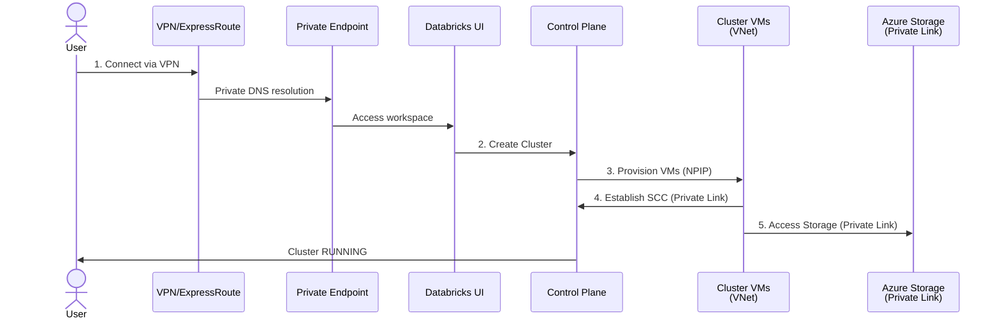
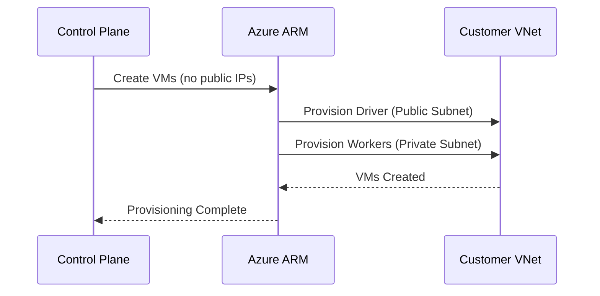
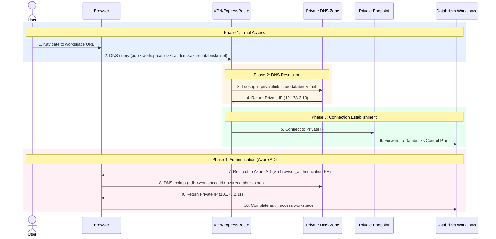

***REMOVED*** Full Private (Air-Gapped) Deployment Pattern

**Pattern**: `deployments/full-private`  
**Status**: ✅ **Production Ready**

---

***REMOVED******REMOVED*** Overview

The Full Private (Air-Gapped) pattern provides a **fully isolated** Azure Databricks deployment with:
- **Private Link for Control Plane** (UI/API via Private Endpoints)
- **Private Link for Data Plane** (SCC via Private Endpoints)
- **No Internet Egress** (air-gapped - no NAT Gateway)
- **Private Endpoints for all storage** (DBFS, Unity Catalog)
- **Unity Catalog** for data governance
- **Network Connectivity Configuration (NCC)** for serverless compute
- **Customer-Managed Keys (CMK)** enabled by default

***REMOVED******REMOVED******REMOVED*** Use Cases

✅ **Highly regulated industries** (Financial services, Healthcare)  
✅ **Zero-trust network architectures**  
✅ **Air-gapped requirements** (No internet access)  
✅ **Strict data residency** (All traffic on Azure backbone)  
✅ **Compliance mandates** (HIPAA, PCI-DSS, FedRAMP)

---

***REMOVED******REMOVED*** Architecture

***REMOVED******REMOVED******REMOVED*** **High-Level Design**

```
┌──────────────────────────────────────────────────────────────────┐
│ User Network (On-Premises or VPN)                                │
└────────────┬─────────────────────────────────────────────────────┘
             │
             │ (Private DNS resolution)
             │ (VPN or ExpressRoute)
             ↓
┌──────────────────────────────────────────────────────────────────┐
│ Customer VNet (VNet Injection)                                    │
│  ┌────────────────────────────────────────────────────────────┐  │
│  │ Private Link Subnet                                         │  │
│  │ ┌────────────────────────┐  ┌──────────────────────────┐  │  │
│  │ │ PE: UI/API Endpoint    │  │ PE: Browser Auth         │  │  │
│  │ │ → Control Plane        │  │ → Control Plane          │  │  │
│  │ └────────────────────────┘  └──────────────────────────┘  │  │
│  │ ┌────────────────────────┐  ┌──────────────────────────┐  │  │
│  │ │ PE: DBFS Storage       │  │ PE: UC Storage           │  │  │
│  │ │ → Customer Storage     │  │ → Customer Storage       │  │  │
│  │ └────────────────────────┘  └──────────────────────────┘  │  │
│  └────────────────────────────────────────────────────────────┘  │
│                                                                   │
│  ┌────────────────────────────┐  ┌──────────────────────────┐   │
│  │ Public/Host Subnet         │  │ Private/Container Subnet │   │
│  │ (10.178.0.0/26)            │  │ (10.178.1.0/26)          │   │
│  │                            │  │                          │   │
│  │ - Driver Nodes             │  │ - Worker Nodes           │   │
│  │ - No Public IPs (NPIP)     │  │ - No Public IPs (NPIP)   │   │
│  │ - NO NAT Gateway           │  │ - NO NAT Gateway         │   │
│  └────────────────────────────┘  └──────────────────────────┘   │
│          │                                   │                    │
│          └───────────────┬───────────────────┘                    │
│                          │                                        │
│  ┌────────────────────────────────────────────────────────────┐  │
│  │ Network Security Group (NSG)                                │  │
│  │ - Custom rules (when public access disabled)               │  │
│  │ - Worker-to-worker communication                           │  │
│  └────────────────────────────────────────────────────────────┘  │
└──────────────────────────────────────────────────────────────────┘
    │                                      │
    │ (Private Link - Control Plane)       │ (Private Link - Storage)
    ↓                                      ↓
┌──────────────────────────────────────────────────────────────────┐
│ Databricks Control Plane (Microsoft-Managed)                     │
│  - SCC Relay (backend Private Link)                              │
│  - API Service (frontend Private Link)                           │
│  - Cluster Management                                            │
└──────────────────────────────────────────────────────────────────┘

┌──────────────────────────────────────────────────────────────────┐
│ Azure Storage (ADLS Gen2) - Customer Subscription                │
│  - DBFS Root Storage (via Private Endpoint)                      │
│  - UC Metastore Storage (via Private Endpoint)                   │
│  - UC External Location (via Private Endpoint)                   │
└──────────────────────────────────────────────────────────────────┘

┌────────────────────────────────────────────────────────────────────┐
│ Network Connectivity Configuration (NCC) - Optional                │
│ - Enables serverless → customer storage connectivity             │
│ - PE rules require manual approval in Azure Portal                │
│ - Setup: See docs/04-SERVERLESS-SETUP.md                          │
└────────────────────────────────────────────────────────────────────┘
```

**Legend**:
- 🔒 **All traffic**: Private (Azure backbone)
- ❌ **No NAT Gateway**: Air-gapped (no internet)
- 🔐 **Private Endpoints**: All connectivity via Private Link

---

***REMOVED******REMOVED*** Key Differences from Non-PL

| Feature | Non-PL | Full Private |
|---------|--------|--------------|
| **Control Plane Access** | Public internet | Private Link only |
| **User Access** | Any internet connection | VPN/ExpressRoute required |
| **Internet Egress** | ✅ NAT Gateway (PyPI/Maven) | ❌ None (air-gapped) |
| **Storage Connectivity** | Service Endpoints | Private Link |
| **Package Management** | Internet repos | Customer repos required |
| **Deployment Complexity** | Low | High |
| **Security Posture** | Secure | Maximum security |

---

***REMOVED******REMOVED*** Traffic Flow: Cluster Startup Sequence

***REMOVED******REMOVED******REMOVED*** High-Level Flow



**Timeline**: ~3-5 minutes from creation to ready state

**Key Points**:
- ✅ All traffic via **Private Link** (no public internet)
- ✅ VMs have **no public IPs** (NPIP enabled)
- ✅ **No NAT Gateway** (air-gapped deployment)
- ❌ **No internet access** for package downloads

---

***REMOVED******REMOVED******REMOVED*** Detailed Phase Breakdown

***REMOVED******REMOVED******REMOVED******REMOVED*** **Phase 1: User Access** (Prerequisites)

```
User → VPN/ExpressRoute → Private Link Subnet → Private Endpoint → Databricks UI

Requirements:
- Network connectivity to customer VNet (VPN/ExpressRoute/Bastion)
- Private DNS resolution configured
- IP in allow-list (if IP Access Lists enabled)
```

**Access Methods**:
1. **VPN Connection**: Site-to-site or Point-to-site VPN
2. **ExpressRoute**: Dedicated private connection
3. **Azure Bastion**: Jump box within VNet

---

***REMOVED******REMOVED******REMOVED******REMOVED*** **Phase 2: Cluster Request** (T+0s)

```
User → Private Endpoint (UI/API) → Databricks Control Plane
├─ POST /api/2.0/clusters/create
├─ Payload: {node_type, count, dbr_version}
└─ Response: Cluster ID (pending state)
```

**Network Path**: Private Link → Databricks SaaS (no public internet)

---

***REMOVED******REMOVED******REMOVED******REMOVED*** **Phase 3: VM Provisioning** (T+0s to T+2min)



**Resources Created**:
- Driver VM (public subnet, no public IP)
- Worker VMs (private subnet, no public IP)
- Managed disks (encrypted with CMK)
- NSG rules (custom rules when public access disabled)

---

***REMOVED******REMOVED******REMOVED******REMOVED*** **Phase 4: Control Plane Tunnel** (T+2min to T+3min)

```
Cluster VMs → Private Endpoint (Backend) → Control Plane SCC Relay

Protocol: HTTPS/WebSocket (443)
Direction: Outbound only (VNet initiates)
Purpose: Cluster management, commands, monitoring
Routing: Private Link (NOT via public internet)
```

**Private Link Architecture**:
- **Frontend PE**: UI/API access (user-facing)
- **Backend PE**: SCC Relay (cluster management)
- Both use Azure backbone network (zero public routing)

---

***REMOVED******REMOVED******REMOVED******REMOVED*** **Phase 5: Storage Access** (T+2min onwards)

```mermaid
graph LR
    Cluster[Cluster VMs]
    PE[Private Endpoint]
    
    subgraph Storage["Azure Storage (Customer)"]
        DBFS[DBFS Root]
        UC[UC Metastore]
        ExtLoc[External Location]
    end
    
    Cluster --> PE
    PE --> DBFS
    PE --> UC
    PE --> ExtLoc
    
    style PE fill:***REMOVED***e8f5e9
    style Storage fill:***REMOVED***fff9c4
```

**Access Pattern**:
- DBFS: Init scripts, cluster logs
- UC Metastore: Table metadata, schemas, permissions
- External Location: User data (Delta, Parquet, etc.)

**Authentication**: Managed Identity (Access Connector) via RBAC

---

***REMOVED******REMOVED******REMOVED******REMOVED*** **Phase 6: Package Management** (Air-Gapped)

```
❌ NO internet access for packages

Customer Responsibilities:
1. Host internal PyPI mirror (e.g., JFrog Artifactory, Nexus)
2. Configure pip.conf to point to internal mirror
3. Pre-install libraries via init scripts
4. Use private container registry for custom images
```

**Example Init Script**:
```bash
***REMOVED***!/bin/bash
***REMOVED*** Configure pip to use internal PyPI mirror
cat > /etc/pip.conf << EOF
[global]
index-url = https://pypi.company.internal/simple
trusted-host = pypi.company.internal
EOF

***REMOVED*** Install common libraries from internal mirror
pip install pandas numpy scikit-learn
```

---

***REMOVED******REMOVED******REMOVED*** Network Routing Summary

| Traffic Type | Source | Destination | Path | Authentication |
|--------------|--------|-------------|------|----------------|
| **UI/API Access** | User | Databricks SaaS | VPN → Private Endpoint | AAD/Bearer Token |
| **Control Plane (SCC)** | Cluster VMs | Databricks SaaS | Private Endpoint (Backend) | Databricks-managed |
| **DBFS Access** | Cluster VMs | DBFS (Customer) | Private Endpoint | Managed Identity |
| **UC Metastore** | Cluster VMs | UC Storage (Customer) | Private Endpoint | Managed Identity |
| **External Data** | Cluster VMs | External Location | Private Endpoint | Managed Identity |
| **Worker-to-Worker** | Worker VMs | Worker VMs | Within VNet | N/A |
| **Logs/Metrics** | Cluster VMs | Event Hub | Private Endpoint (optional) | Databricks-managed |
| **Package Downloads** | ❌ | ❌ | **NONE** (air-gapped) | N/A |

**Key Routing**:
- **Zero internet traffic**: All communication via Private Link
- **Private DNS**: Custom DNS zones for Private Endpoints
- **No NAT Gateway**: Air-gapped deployment

---

***REMOVED******REMOVED*** Features

***REMOVED******REMOVED******REMOVED*** Included Features

| Feature | Status | Details |
|---------|--------|---------|
| **Secure Cluster Connectivity (NPIP)** | ✅ Always enabled | No public IPs on clusters |
| **VNet Injection** | ✅ Always enabled | Deploy into customer VNet |
| **Private Link (Control Plane)** | ✅ Always enabled | Frontend (UI/API) + Backend (SCC) |
| **Private Link (Storage)** | ✅ Always enabled | All storage via Private Endpoints |
| **Unity Catalog** | ✅ Mandatory | Data governance and access control |
| **Customer-Managed Keys (CMK)** | ✅ Default enabled | Managed services + Disks + DBFS |
| **BYOV Support** | ✅ Optional | Bring Your Own VNet/Subnets/NSG |
| **IP Access Lists** | ✅ Optional | Restrict workspace access by IP |
| **Private DNS Zones** | ✅ Auto-created | Azure-integrated DNS for Private Endpoints |
| **Service Endpoint Policy (SEP)** | ✅ Optional | Storage egress control for classic compute |
| **NCC (Serverless)** | ✅ Optional | Private Link for serverless compute |

***REMOVED******REMOVED******REMOVED*** Not Included

| Feature | Status | Reason | Alternative |
|---------|--------|--------|-------------|
| **NAT Gateway** | ❌ Not included | Air-gapped design | Use internal package repos |
| **Service Endpoints** | ❌ Not used | Private Link provides stronger isolation | N/A |
| **Public Internet Egress** | ❌ Not allowed | Air-gapped requirement | Internal repos required |

---

***REMOVED******REMOVED*** Deployment

***REMOVED******REMOVED******REMOVED*** Prerequisites

**Required**:
- Azure subscription with appropriate permissions
- Terraform >= 1.5
- Azure CLI or Service Principal for authentication
- Databricks Account ID
- **VPN or ExpressRoute** to customer VNet
- **Private DNS** configured for Private Link
- **Customer Key Vault** with CMK keys (if using CMK)
- **Internal package repositories** (PyPI, Maven, Docker registry)

**Network Requirements**:
- VNet CIDR: `/16` to `/20` recommended
- Public Subnet: `/26` minimum (64 IPs)
- Private Subnet: `/26` minimum (64 IPs)
- Private Link Subnet: `/27` minimum (32 IPs)

***REMOVED******REMOVED******REMOVED*** Quick Deploy

```bash
***REMOVED*** 1. Navigate to deployment folder
cd deployments/full-private

***REMOVED*** 2. Copy and configure variables
cp terraform.tfvars.example terraform.tfvars
vim terraform.tfvars

***REMOVED*** 3. Initialize Terraform
terraform init

***REMOVED*** 4. Review deployment plan
terraform plan

***REMOVED*** 5. Deploy
terraform apply
```

***REMOVED******REMOVED******REMOVED*** Deployment Time

- **Initial deployment**: 20-30 minutes
- **Subsequent deployments**: 15-20 minutes
- **Private Endpoint approval**: Manual (add 5-10 minutes)

---

***REMOVED******REMOVED*** Private DNS Configuration

***REMOVED******REMOVED******REMOVED*** Overview

Full-Private deployments rely on **Azure Private DNS zones** to resolve Private Endpoint FQDNs to private IP addresses within your VNet. This ensures all traffic stays on the Azure backbone and never traverses the public internet.

***REMOVED******REMOVED******REMOVED*** DNS Architecture

```mermaid
graph TB
    User[User/Application]
    VNet[Customer VNet]
    
    subgraph "Private DNS Zones"
        DBDNSZone["privatelink.azuredatabricks.net"]
        DFSDNSZone["privatelink.dfs.core.windows.net"]
        BlobDNSZone["privatelink.blob.core.windows.net"]
    end
    
    subgraph "Private Endpoints"
        UIPE[UI/API PE<br/>databricks_ui_api]
        AuthPE[Browser Auth PE<br/>browser_authentication]
        DBFSPE[DBFS Storage PE<br/>dfs]
        UCPE[UC Storage PE<br/>dfs]
    end
    
    User -->|1. Query| VNet
    VNet -->|2. DNS Lookup| DBDNSZone
    VNet -->|2. DNS Lookup| DFSDNSZone
    DBDNSZone -->|3. Returns Private IP| VNet
    DFSDNSZone -->|3. Returns Private IP| VNet
    VNet -->|4. Connect via Private IP| UIPE
    VNet -->|4. Connect via Private IP| DBFSPE
    
    style DBDNSZone fill:***REMOVED***e1f5fe
    style DFSDNSZone fill:***REMOVED***e1f5fe
    style BlobDNSZone fill:***REMOVED***e1f5fe
    style UIPE fill:***REMOVED***c8e6c9
    style AuthPE fill:***REMOVED***c8e6c9
```

**Key Components**:
1. **Private DNS Zones**: Azure-managed DNS zones for Private Link
2. **VNet Links**: Connect DNS zones to your VNet for name resolution
3. **Private Endpoints**: Inject private IPs into your VNet for Databricks and Storage services
4. **DNS Records**: Auto-created A records mapping FQDNs to private IPs

---

***REMOVED******REMOVED******REMOVED*** DNS Zones Created

This deployment automatically creates and configures three Private DNS zones:

| DNS Zone | Purpose | Resources |
|----------|---------|-----------|
| `privatelink.azuredatabricks.net` | Databricks Control Plane access | UI/API endpoint, Browser Auth |
| `privatelink.dfs.core.windows.net` | ADLS Gen2 Data Lake Storage | DBFS, UC Metastore, UC External |
| `privatelink.blob.core.windows.net` | Blob Storage (legacy/fallback) | DBFS Blob endpoint |

**Auto-Configuration**:
- ✅ Zones created in workspace resource group
- ✅ Automatically linked to customer VNet
- ✅ A records auto-populated by Private Endpoints
- ✅ TTL: 10 seconds (Azure default)

---

***REMOVED******REMOVED******REMOVED*** Databricks Sub-Resource Types

Databricks Private Link uses two distinct **sub-resource types** for different access patterns:

***REMOVED******REMOVED******REMOVED******REMOVED*** 1. `databricks_ui_api` (Workspace-Specific)

**Purpose**: Direct workspace access for UI, REST API, and data plane communication (SCC)

**FQDN Pattern**:
```
adb-<workspace-id>.<random-id>.azuredatabricks.net
```

**Use Cases**:
- Workspace UI access from browser
- Databricks CLI/SDK API calls
- Cluster VMs connecting to Control Plane (SCC/relay tunnel)
- SQL Warehouse API access

**Characteristics**:
- ✅ Unique per workspace
- ✅ Required for all workspace operations
- ✅ Resolves to workspace-specific Private Endpoint IP

**Example**:
```bash
***REMOVED*** Workspace URL
https://adb-1234567890123456.12.azuredatabricks.net

***REMOVED*** DNS Resolution (via Private Link)
nslookup adb-1234567890123456.12.azuredatabricks.net
***REMOVED*** Answer: 10.178.2.10 (Private IP in Private Link subnet)
```

---

***REMOVED******REMOVED******REMOVED******REMOVED*** 2. `browser_authentication` (Regional, Shared)

**Purpose**: Azure AD authentication redirect for browser-based login

**FQDN Pattern**:
```
adb-<workspace-id>.azuredatabricks.net  (no random-id)
```

**Use Cases**:
- Browser SSO authentication flow
- Azure AD OAuth redirects
- Token acquisition during login

**Characteristics**:
- ✅ Regional endpoint (shared across workspaces in same region)
- ✅ Only used during authentication
- ✅ Can be shared by multiple workspaces

**Example**:
```bash
***REMOVED*** Auth URL (during Azure AD login)
https://adb-1234567890123456.azuredatabricks.net/login.html

***REMOVED*** DNS Resolution (via Private Link)
nslookup adb-1234567890123456.azuredatabricks.net
***REMOVED*** Answer: 10.178.2.11 (Private IP in Private Link subnet)
```

---

***REMOVED******REMOVED******REMOVED*** DNS Resolution Flow

***REMOVED******REMOVED******REMOVED******REMOVED*** **User Access to Workspace UI**



**Timeline**:
- **DNS Resolution**: < 10ms (cached after first query)
- **Connection Setup**: 50-100ms (Private Link latency)
- **Auth Flow**: 1-2 seconds (Azure AD redirect)
- **Total Time**: ~2-3 seconds (first access)

---

***REMOVED******REMOVED******REMOVED*** Multi-Workspace Scenarios

***REMOVED******REMOVED******REMOVED******REMOVED*** **Single Region, Multiple Workspaces**

```
Region: East US 2

Workspace A:
├─ databricks_ui_api: adb-1111111111111111.12.azuredatabricks.net → 10.178.2.10
└─ browser_authentication: adb-1111111111111111.azuredatabricks.net → 10.178.2.11

Workspace B:
├─ databricks_ui_api: adb-2222222222222222.12.azuredatabricks.net → 10.178.2.12
└─ browser_authentication: adb-2222222222222222.azuredatabricks.net → 10.178.2.11 (SHARED)
```

**Key Points**:
- ✅ Each workspace has its own `databricks_ui_api` Private Endpoint
- ✅ `browser_authentication` endpoint can be shared (regional)
- ✅ All endpoints in the same Private Link subnet
- ✅ Single `privatelink.azuredatabricks.net` DNS zone for all workspaces

**Cost Optimization**: Sharing the `browser_authentication` endpoint reduces Private Endpoint costs in multi-workspace deployments.

---

***REMOVED******REMOVED******REMOVED******REMOVED*** **Multi-Region Deployment**

```
Region: East US 2
VNet: 10.178.0.0/20
DNS Zone: privatelink.azuredatabricks.net (linked to VNet)
├─ Workspace A (East US 2): adb-1111111111111111.12.azuredatabricks.net
└─ Workspace B (East US 2): adb-2222222222222222.12.azuredatabricks.net

Region: West US 2
VNet: 10.179.0.0/20
DNS Zone: privatelink.azuredatabricks.net (linked to VNet)
├─ Workspace C (West US 2): adb-3333333333333333.10.azuredatabricks.net
└─ Workspace D (West US 2): adb-4444444444444444.10.azuredatabricks.net
```

**Architecture**:
- ✅ Separate Private DNS zones per VNet/region
- ✅ VNet peering required for cross-region workspace access
- ✅ Each region has its own Private Endpoints

**Cross-Region Access**:
- Requires VNet peering or VPN gateway
- DNS zones must be linked to peered VNets
- Latency: Depends on Azure region distance (typically 10-50ms)

---

***REMOVED******REMOVED******REMOVED*** Storage DNS Resolution

***REMOVED******REMOVED******REMOVED******REMOVED*** **DBFS and Unity Catalog Storage**

```
Storage Account: <workspace-prefix>dbfs<suffix>.dfs.core.windows.net

DNS Resolution Flow:
1. Cluster queries: <storage-account>.dfs.core.windows.net
2. Azure DNS redirects: <storage-account>.privatelink.dfs.core.windows.net
3. Private DNS zone returns: 10.178.2.20 (Private IP)
4. Cluster connects via Private Link
```

**DNS Records Created**:

| Resource | Public FQDN | Private DNS Record | Private IP |
|----------|-------------|-------------------|------------|
| DBFS Storage (DFS) | `<prefix>dbfs<suffix>.dfs.core.windows.net` | `<prefix>dbfs<suffix>.privatelink.dfs.core.windows.net` | 10.178.2.20 |
| UC Metastore (DFS) | `<prefix>uc<suffix>.dfs.core.windows.net` | `<prefix>uc<suffix>.privatelink.dfs.core.windows.net` | 10.178.2.21 |
| UC External (DFS) | `<prefix>ext<suffix>.dfs.core.windows.net` | `<prefix>ext<suffix>.privatelink.dfs.core.windows.net` | 10.178.2.22 |

**Auto-Configured by Terraform**:
- ✅ Private Endpoints for all storage accounts
- ✅ DNS zone group integration (auto DNS record creation)
- ✅ VNet link to customer VNet

---

***REMOVED******REMOVED******REMOVED*** DNS Configuration Verification

***REMOVED******REMOVED******REMOVED******REMOVED*** **Check DNS Zone Creation**

```bash
***REMOVED*** List all Private DNS zones
az network private-dns zone list \
  --resource-group <rg-name> \
  --output table

***REMOVED*** Expected output:
***REMOVED*** Name                                   ResourceGroup         Location
***REMOVED*** -------------------------------------  -------------------   --------
***REMOVED*** privatelink.azuredatabricks.net        <rg-name>             global
***REMOVED*** privatelink.dfs.core.windows.net       <rg-name>             global
***REMOVED*** privatelink.blob.core.windows.net      <rg-name>             global
```

---

***REMOVED******REMOVED******REMOVED******REMOVED*** **Verify VNet Links**

```bash
***REMOVED*** Check VNet links for Databricks DNS zone
az network private-dns link vnet list \
  --resource-group <rg-name> \
  --zone-name privatelink.azuredatabricks.net \
  --output table

***REMOVED*** Expected: VNet should be linked with registrationEnabled=false
```

---

***REMOVED******REMOVED******REMOVED******REMOVED*** **Test DNS Resolution**

**From within VNet** (via VPN, bastion, or VM):

```bash
***REMOVED*** Test Databricks workspace resolution
nslookup adb-<workspace-id>.<random-id>.azuredatabricks.net

***REMOVED*** Expected Output:
***REMOVED*** Server:  <dns-server>
***REMOVED*** Address: <dns-server-ip>
***REMOVED***
***REMOVED*** Non-authoritative answer:
***REMOVED*** Name:    adb-<workspace-id>.<random-id>.azuredatabricks.net
***REMOVED*** Address: 10.178.2.10  ← Private IP (not public)


***REMOVED*** Test storage resolution
nslookup <storage-account>.dfs.core.windows.net

***REMOVED*** Expected Output:
***REMOVED*** Name:    <storage-account>.privatelink.dfs.core.windows.net
***REMOVED*** Address: 10.178.2.20  ← Private IP
```

**Important**: DNS resolution must return **private IPs** (10.x.x.x), not public IPs. If you see public IPs, the Private DNS zone is not correctly linked to your VNet.

---

***REMOVED******REMOVED******REMOVED******REMOVED*** **Verify A Records**

```bash
***REMOVED*** List A records in Databricks DNS zone
az network private-dns record-set a list \
  --resource-group <rg-name> \
  --zone-name privatelink.azuredatabricks.net \
  --output table

***REMOVED*** Expected: A records for workspace UI/API and browser auth


***REMOVED*** List A records in DFS DNS zone
az network private-dns record-set a list \
  --resource-group <rg-name> \
  --zone-name privatelink.dfs.core.windows.net \
  --output table

***REMOVED*** Expected: A records for DBFS, UC metastore, UC external storage
```

---

***REMOVED******REMOVED******REMOVED*** Troubleshooting DNS Issues

***REMOVED******REMOVED******REMOVED******REMOVED*** **Issue**: Workspace URL Not Resolving

**Symptoms**:
```bash
$ nslookup adb-<workspace-id>.<random-id>.azuredatabricks.net
Server:  <dns-server>
Address: <dns-server-ip>

** server can't find adb-<workspace-id>.<random-id>.azuredatabricks.net: NXDOMAIN
```

**Root Causes**:
1. Private DNS zone not linked to VNet
2. Private Endpoint not yet created
3. DNS zone group not configured on Private Endpoint

**Solution**:
```bash
***REMOVED*** 1. Verify Private DNS zone exists
az network private-dns zone show \
  --resource-group <rg-name> \
  --name privatelink.azuredatabricks.net

***REMOVED*** 2. Check VNet link
az network private-dns link vnet show \
  --resource-group <rg-name> \
  --zone-name privatelink.azuredatabricks.net \
  --name <link-name>

***REMOVED*** 3. Verify Private Endpoint DNS integration
az network private-endpoint show \
  --resource-group <rg-name> \
  --name <pe-name> \
  --query 'privateDnsZoneGroups[0].privateDnsZoneConfigs[0].privateDnsZoneId'
```

---

***REMOVED******REMOVED******REMOVED******REMOVED*** **Issue**: Resolves to Public IP Instead of Private IP

**Symptoms**:
```bash
$ nslookup adb-<workspace-id>.<random-id>.azuredatabricks.net
Name:    adb-<workspace-id>.<random-id>.azuredatabricks.net
Address: 20.62.x.x  ← Public IP (WRONG!)
```

**Root Causes**:
1. Querying from outside VNet (no VPN connection)
2. Private DNS zone not linked to VNet
3. DNS resolver not configured to use Azure DNS (168.63.129.16)

**Solution**:
```bash
***REMOVED*** Ensure you're connected via VPN/ExpressRoute
***REMOVED*** Verify DNS resolver is set to Azure DNS

***REMOVED*** Windows:
ipconfig /all
***REMOVED*** Check DNS Servers: Should include 168.63.129.16 or VNet DNS

***REMOVED*** Linux:
cat /etc/resolv.conf
***REMOVED*** nameserver 168.63.129.16 (or VNet DNS)

***REMOVED*** macOS:
scutil --dns
***REMOVED*** Should route through VPN DNS
```

---

***REMOVED******REMOVED******REMOVED******REMOVED*** **Issue**: Storage Access Fails After Private Link Enablement

**Symptoms**:
```
Error: abfss://<container>@<storage-account>.dfs.core.windows.net: Name or service not known
```

**Root Causes**:
1. Private DNS zone for DFS not created
2. Storage Private Endpoint not configured
3. Public access to storage disabled without Private Link

**Solution**:
```bash
***REMOVED*** 1. Verify storage Private Endpoint
az network private-endpoint list \
  --resource-group <rg-name> \
  --query "[?contains(name, 'dbfs') || contains(name, 'uc')].{Name:name, State:privateLinkServiceConnections[0].privateLinkServiceConnectionState.status}" \
  --output table

***REMOVED*** Expected: All endpoints in "Approved" state

***REMOVED*** 2. Test DNS resolution
nslookup <storage-account>.dfs.core.windows.net
***REMOVED*** Should return private IP (10.x.x.x)

***REMOVED*** 3. Check storage firewall rules
az storage account show \
  --name <storage-account> \
  --resource-group <rg-name> \
  --query networkRuleSet.defaultAction
  
***REMOVED*** If "Deny", ensure Private Endpoint is approved
```

---

***REMOVED******REMOVED******REMOVED*** DNS Best Practices

***REMOVED******REMOVED******REMOVED******REMOVED*** **Planning**

- ✅ **Document FQDNs**: Maintain a list of all Private Endpoint FQDNs for your workspaces
- ✅ **IP Address Planning**: Reserve IP range in Private Link subnet (min /27)
- ✅ **DNS Forwarding**: Configure on-premises DNS to forward `*.azuredatabricks.net` to Azure DNS
- ✅ **Multi-Region**: Use consistent DNS zone naming across regions

***REMOVED******REMOVED******REMOVED******REMOVED*** **Security**

- ✅ **Private DNS Only**: Never expose `privatelink.*` zones to public DNS
- ✅ **VNet Isolation**: Only link Private DNS zones to authorized VNets
- ✅ **Access Control**: Use Azure RBAC to restrict DNS zone modifications
- ✅ **Audit Logging**: Enable diagnostic logs for DNS zones

***REMOVED******REMOVED******REMOVED******REMOVED*** **Operations**

- ✅ **Monitor DNS Queries**: Track query volumes and failures
- ✅ **TTL Configuration**: Use default 10s TTL for fast failover
- ✅ **Automation**: Use Terraform for consistent DNS configuration
- ✅ **Documentation**: Keep runbooks for DNS troubleshooting

***REMOVED******REMOVED******REMOVED******REMOVED*** **Testing**

- ✅ **Pre-Deployment**: Test DNS resolution from all user locations
- ✅ **Post-Deployment**: Verify A records auto-created for all Private Endpoints
- ✅ **Failover**: Test DNS behavior during Private Endpoint maintenance
- ✅ **Cross-Region**: Validate resolution across peered VNets

---

***REMOVED******REMOVED******REMOVED*** DNS Reference Architecture

For detailed network architecture including DNS flow for multi-workspace hub-and-spoke deployments, see:
- [Azure Databricks Data Exfiltration Protection](https://techcommunity.microsoft.com/t5/azure-architecture-blog/data-exfiltration-protection-with-azure-databricks/ba-p/2334376)
- [Azure Private Link Documentation](https://learn.microsoft.com/en-us/azure/databricks/security/network/classic/private-link)

---

***REMOVED******REMOVED*** Post-Deployment Steps

***REMOVED******REMOVED******REMOVED*** **Critical**: Lock Down Public Access

After successful deployment, **disable public network access**:

```hcl
***REMOVED*** terraform.tfvars
enable_public_network_access = false
```

```bash
terraform apply
```

This enforces **Private Link only** access (no public internet).

---

***REMOVED******REMOVED******REMOVED*** Configure Private DNS

Ensure Private DNS zones are linked to your VNet:

```bash
***REMOVED*** List Private DNS zones
az network private-dns zone list --output table

***REMOVED*** Link to VNet (if not auto-linked)
az network private-dns link vnet create \
  --resource-group <rg-name> \
  --zone-name privatelink.azuredatabricks.net \
  --name databricks-dns-link \
  --virtual-network <vnet-id> \
  --registration-enabled false
```

---

***REMOVED******REMOVED******REMOVED*** Setup Internal Package Repositories

**Required for air-gapped deployments**:

1. **PyPI Mirror**: JFrog Artifactory, Sonatype Nexus, or devpi
2. **Maven Mirror**: Artifactory or Nexus Repository Manager
3. **Docker Registry**: Azure Container Registry (ACR) with Private Link

**Configure Init Scripts**:
```bash
***REMOVED*** /dbfs/init-scripts/configure-repos.sh
***REMOVED***!/bin/bash

***REMOVED*** Configure pip
cat > /etc/pip.conf << EOF
[global]
index-url = https://pypi.company.internal/simple
trusted-host = pypi.company.internal
EOF

***REMOVED*** Configure Maven
mkdir -p /home/ubuntu/.m2
cat > /home/ubuntu/.m2/settings.xml << EOF
<settings>
  <mirrors>
    <mirror>
      <id>company-maven</id>
      <url>https://maven.company.internal/repository/maven-central/</url>
      <mirrorOf>central</mirrorOf>
    </mirror>
  </mirrors>
</settings>
EOF
```

---

***REMOVED******REMOVED*** Security

***REMOVED******REMOVED******REMOVED*** Network Security

**Private Link Isolation**:
- ✅ Zero public internet exposure
- ✅ All traffic on Azure backbone
- ✅ Control Plane accessible only via Private Endpoints
- ✅ Storage accessible only via Private Endpoints

**Air-Gapped Architecture**:
- ✅ No NAT Gateway (no internet egress)
- ✅ No public IPs on cluster VMs (NPIP)
- ✅ No Service Endpoints (Private Link only)
- ✅ Custom NSG rules when public access disabled

***REMOVED******REMOVED******REMOVED*** Data Security

**Unity Catalog**:
- ✅ Fine-grained access control (GRANT/REVOKE)
- ✅ Data lineage and audit logging
- ✅ Centralized governance across workspaces

**Storage Security**:
- ✅ Private Link only (no public access)
- ✅ HTTPS-only (TLS 1.2+)
- ✅ Managed identity authentication (no keys)
- ✅ Storage Blob Data Contributor RBAC

**Customer-Managed Keys (CMK)**:
- ✅ Managed services encryption (notebooks, secrets)
- ✅ Managed disks encryption (cluster VMs)
- ✅ DBFS root encryption (workspace storage)
- ✅ Enabled by default in Full Private pattern

---

***REMOVED******REMOVED*** Troubleshooting

***REMOVED******REMOVED******REMOVED*** Common Issues

**Issue**: Cannot Access Workspace

**Error**: `Unable to connect to workspace URL`

**Solution**:
1. Verify VPN/ExpressRoute connection to VNet
2. Check Private DNS resolution: `nslookup <workspace-url>`
3. Verify Private Endpoint status in Azure Portal
4. Check IP Access Lists (if enabled)

---

**Issue**: Cluster Cannot Start

**Symptom**: Cluster stuck in `PENDING` state

**Solution**:
1. Verify Private Link connectivity (backend PE)
2. Check NSG rules (especially if custom rules added)
3. Review Azure Activity Log for errors
4. Ensure CMK keys are accessible

---

**Issue**: Cannot Install Libraries

**Error**: `pip install` fails with connection timeout

**Solution**:
This is **expected in air-gapped deployments**. Libraries cannot be downloaded from the internet.

**Workarounds**:
1. Configure internal PyPI mirror (see [Post-Deployment Steps](***REMOVED***setup-internal-package-repositories))
2. Pre-install libraries via init scripts from internal storage
3. Use cluster-scoped libraries from DBFS

---

***REMOVED******REMOVED*** Best Practices

***REMOVED******REMOVED******REMOVED*** Network Planning

- **Private Endpoint Subnet**: `/27` minimum, plan for growth
- **DNS Configuration**: Test Private DNS resolution before deployment
- **VPN/ExpressRoute**: Ensure adequate bandwidth for user traffic
- **Firewall Rules**: Document all allow-list requirements

***REMOVED******REMOVED******REMOVED*** Security Hardening

- **Disable Public Access**: Set `enable_public_network_access = false` after initial deployment
- **IP Access Lists**: Enable even with Private Link for defense-in-depth
- **CMK Rotation**: Configure automatic key rotation in Key Vault
- **Audit Logging**: Enable Azure Monitor and Databricks audit logs

***REMOVED******REMOVED******REMOVED*** Operational Excellence

- **Bastion Host**: Deploy Azure Bastion for emergency access
- **Internal Repos**: Maintain mirrors of PyPI, Maven, Docker registries
- **Runbooks**: Document procedures for common operations
- **Disaster Recovery**: Test Private Link failover scenarios

---

***REMOVED******REMOVED*** References

- **Pattern Documentation**: This document (Full-Private deployment pattern)
- **CMK Module Documentation**: [docs/modules/05-CMK.md](../modules/05-CMK.md)
- **SEP Module Documentation**: [docs/modules/06-SEP.md](../modules/06-SEP.md)
- **Troubleshooting Guide**: [docs/07-TROUBLESHOOTING.md](../07-TROUBLESHOOTING.md)
- **Azure Databricks Private Link**: [Microsoft Documentation](https://learn.microsoft.com/en-us/azure/databricks/security/network/classic/private-link)
- **Unity Catalog**: [Microsoft Documentation](https://learn.microsoft.com/en-us/azure/databricks/data-governance/unity-catalog/)
- **Azure Databricks Data Exfiltration Protection**: [Microsoft Tech Community](https://techcommunity.microsoft.com/t5/azure-architecture-blog/data-exfiltration-protection-with-azure-databricks/ba-p/2334376)

---

**Pattern Version**: 1.0  
**Status**: ✅ Production Ready  
**Terraform Version**: >= 1.5
