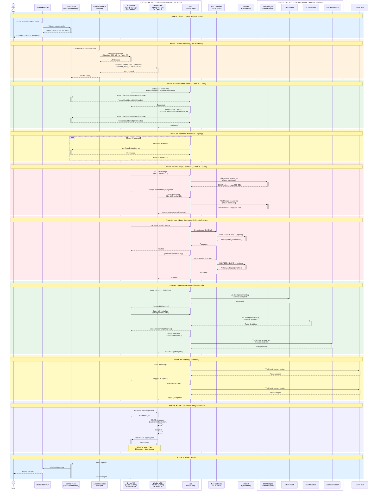

***REMOVED*** Non-Private Link (Non-PL) Deployment Pattern

**Pattern**: `deployments/non-pl`  
**Status**: ✅ **Production Ready**

---

***REMOVED******REMOVED*** Overview

The Non-Private Link (Non-PL) pattern provides a **secure, cost-effective** Azure Databricks deployment with:
- **Public control plane** (UI/API accessible from internet)
- **Private data plane** (NPIP - no public IPs on clusters)
- **NAT Gateway** for managed internet egress
- **Unity Catalog** for data governance
- **Service Endpoints** for storage connectivity
- **Network Connectivity Configuration (NCC)** for serverless compute

***REMOVED******REMOVED******REMOVED*** Use Cases

✅ **Standard production workloads**  
✅ **Cost-sensitive deployments**  
✅ **Teams needing internet access** (PyPI, Maven, etc.)  
✅ **Development and testing environments**  
✅ **Proof of concepts and demos**

---

***REMOVED******REMOVED*** Architecture

***REMOVED******REMOVED******REMOVED*** **High-Level Design**

```
┌──────────────────────────────────────────────────────────────────┐
│ Internet                                                          │
└──────────────────────────────────────────────────────────────────┘
    │                                      ↑
    │ (HTTPS)                              │ (Egress via NAT)
    ↓                                      │
┌──────────────────────────────────────────────────────────────────┐
│ Databricks SaaS (Microsoft Managed)                              │
│  ┌────────────────────────────────────────────────────────────┐  │
│  │ Workspace Services                                          │  │
│  │ - Web UI: https://adb-123.azuredatabricks.net              │  │
│  │ - REST API                                                  │  │
│  │ - SCC Relay (cluster connectivity)                         │  │
│  └────────────────────────────────────────────────────────────┘  │
│  ┌────────────────────────────────────────────────────────────┐  │
│  │ Serverless Compute Plane (Optional)                        │  │
│  │ - SQL Warehouses                                            │  │
│  │ - Serverless Notebooks                                      │  │
│  │ - Connects to customer storage via NCC                     │  │
│  └────────────────────────────────────────────────────────────┘  │
└──────────────────────────────────────────────────────────────────┘
    │                                      │
    │ (SCC over Azure backbone)            │ (NCC - Service EP or PL)
    ↓                                      ↓
┌──────────────────────────────────────────────────────────────────┐
│ Customer VNet (VNet Injection)                                    │
│  ┌────────────────────────────┐  ┌──────────────────────────┐   │
│  │ Public/Host Subnet         │  │ Private/Container Subnet │   │
│  │ (10.100.1.0/26)            │  │ (10.100.2.0/26)          │   │
│  │                            │  │                          │   │
│  │ - Driver Nodes             │  │ - Worker Nodes           │   │
│  │ - No Public IPs (NPIP)     │  │ - No Public IPs (NPIP)   │   │
│  │ - NAT Gateway attached     │  │ - NAT Gateway attached   │   │
│  └────────────────────────────┘  └──────────────────────────┘   │
│          │                                   │                    │
│          └───────────────┬───────────────────┘                    │
│                          │                                        │
│  ┌────────────────────────────────────────────────────────────┐  │
│  │ Network Security Group (NSG)                                │  │
│  │ - Databricks-managed rules (automatic)                     │  │
│  │ - Worker-to-worker communication                           │  │
│  └────────────────────────────────────────────────────────────┘  │
│                          │                                        │
│  ┌────────────────────────────────────────────────────────────┐  │
│  │ NAT Gateway                                                 │  │
│  │ - Stable outbound IP: 203.0.113.45                         │  │
│  │ - PyPI, Maven, custom repos                                │  │
│  └────────────────────────────────────────────────────────────┘  │
└──────────────────────────────────────────────────────────────────┘
    │                                      │
    │ (Service Endpoints)                  │ (Service EP or PL via NCC)
    ↓                                      ↓
┌──────────────────────────────────────────────────────────────────┐
│ Azure Storage (ADLS Gen2)                                         │
│  ┌────────────────────────────────────────────────────────────┐  │
│  │ Unity Catalog Metastore Storage                             │  │
│  │ - Classic: Service Endpoints                                │  │
│  │ - Serverless: Service Endpoints or PL via NCC               │  │
│  └────────────────────────────────────────────────────────────┘  │
│  ┌────────────────────────────────────────────────────────────┐  │
│  │ External Location Storage (Per-Workspace)                  │  │
│  │ - Classic: Service Endpoints                                │  │
│  │ - Serverless: Service Endpoints or PL via NCC               │  │
│  └────────────────────────────────────────────────────────────┘  │
└──────────────────────────────────────────────────────────────────┘

┌────────────────────────────────────────────────────────────────────┐
│ Network Connectivity Configuration (NCC)                           │
│ - Created automatically (mandatory)                                │
│ - Enables serverless → customer storage connectivity             │
│ - Configuration: Empty (no PE rules in Terraform)                 │
│ - Setup: Manual (see SERVERLESS-SETUP.md)                         │
└────────────────────────────────────────────────────────────────────┘
```

**Legend**:
- 🟢 **Green**: Classic clusters (immediate)
- 🔵 **Blue**: Serverless compute (requires setup)
- ⚡ **NCC**: Network Connectivity Configuration (automatic + manual setup)
│  │ - User data, Delta tables                                  │  │
│  └────────────────────────────────────────────────────────────┘  │
│  ┌────────────────────────────────────────────────────────────┐  │
│  │ Workspace Storage (DBFS)                                    │  │
│  │ - Managed by Databricks                                    │  │
│  └────────────────────────────────────────────────────────────┘  │
└──────────────────────────────────────────────────────────────────┘
```

---

***REMOVED******REMOVED*** Architecture Diagrams

***REMOVED******REMOVED******REMOVED*** High-Level Architecture (Mermaid)

```mermaid
graph TB
    subgraph Internet
        User[User Browser]
        PyPI[PyPI/Maven<br/>Custom Repos]
    end
    
    subgraph Azure["Azure Cloud"]
        subgraph ControlPlane["Databricks Control Plane<br/>(Microsoft-Managed)"]
            UI[Web UI/API]
            ClusterMgr[Cluster Manager]
            MetaService[Metadata Service]
        end
        
        subgraph CustomerVNet["Customer VNet (10.100.0.0/16)"]
            subgraph PublicSubnet["Public/Host Subnet<br/>(10.100.1.0/26)"]
                Driver[Driver Node<br/>No Public IP]
            end
            
            subgraph PrivateSubnet["Private/Container Subnet<br/>(10.100.2.0/26)"]
                Worker1[Worker Node 1<br/>No Public IP]
                Worker2[Worker Node 2<br/>No Public IP]
            end
            
            NSG[Network Security Group<br/>Service Tags:<br/>AzureDatabricks, Storage, EventHub]
            NAT[NAT Gateway<br/>203.0.113.45]
        end
        
        subgraph Storage["Azure Storage"]
            DBFS[DBFS Root<br/>Databricks-Managed]
            UCMetastore[UC Metastore<br/>Customer-Owned]
            ExtLocation[External Location<br/>Customer-Owned]
            DBRImages[DBR Runtime Images<br/>Databricks-Managed<br/>dbartifactsprod*]
        end
        
        EventHub[Event Hub<br/>Logs & Metrics]
    end
    
    User -->|HTTPS| UI
    UI -->|Commands| ClusterMgr
    
    ClusterMgr -.->|Provisions| Driver
    ClusterMgr -.->|Provisions| Worker1
    ClusterMgr -.->|Provisions| Worker2
    
    Driver -->|NSG: AzureDatabricks| ControlPlane
    Worker1 -->|NSG: AzureDatabricks| ControlPlane
    Worker2 -->|NSG: AzureDatabricks| ControlPlane
    
    Driver -->|NAT Gateway| PyPI
    Worker1 -->|NAT Gateway| PyPI
    Worker2 -->|NAT Gateway| PyPI
    
    Driver -->|NSG: Storage<br/>Service Endpoint| DBFS
    Driver -->|NSG: Storage<br/>Service Endpoint| UCMetastore
    Driver -->|NSG: Storage<br/>Service Endpoint| ExtLocation
    Driver -->|NSG: Storage<br/>Service Endpoint| DBRImages
    
    Worker1 -->|NSG: Storage<br/>Service Endpoint| ExtLocation
    Worker1 -->|NSG: Storage<br/>Service Endpoint| DBRImages
    Worker2 -->|NSG: Storage<br/>Service Endpoint| ExtLocation
    Worker2 -->|NSG: Storage<br/>Service Endpoint| DBRImages
    
    Driver -->|NSG: EventHub| EventHub
    Worker1 -->|NSG: EventHub| EventHub
    Worker2 -->|NSG: EventHub| EventHub
    
    Driver <-->|Within VNet| Worker1
    Driver <-->|Within VNet| Worker2
    Worker1 <-->|Within VNet| Worker2
    
    style ControlPlane fill:***REMOVED***e1f5ff
    style CustomerVNet fill:***REMOVED***fff4e1
    style Storage fill:***REMOVED***e8f5e9
    style NAT fill:***REMOVED***ffebee
    style NSG fill:***REMOVED***f3e5f5
```

***REMOVED******REMOVED******REMOVED*** Traffic Flow Routing

```mermaid
graph LR
    subgraph VNet["Customer VNet"]
        VM[Cluster VMs<br/>No Public IPs]
        NSG[NSG Outbound Rules]
    end
    
    subgraph Destinations
        DB[Databricks Control Plane]
        ST[Azure Storage]
        EH[Event Hub]
        INT[Internet<br/>PyPI/Maven/Docker]
    end
    
    NAT[NAT Gateway<br/>Public IP]
    
    VM --> NSG
    
    NSG -->|Service Tag:<br/>AzureDatabricks| DB
    NSG -->|Service Tag:<br/>Storage<br/>+Service Endpoint| ST
    NSG -->|Service Tag:<br/>EventHub| EH
    NSG -->|Default Route| NAT
    NAT -->|SNAT| INT
    
    style NSG fill:***REMOVED***f3e5f5
    style NAT fill:***REMOVED***ffebee
    style DB fill:***REMOVED***e1f5ff
    style ST fill:***REMOVED***e8f5e9
    style EH fill:***REMOVED***fff9c4
    style INT fill:***REMOVED***ffebee
```

---

***REMOVED******REMOVED*** Serverless Compute Connectivity

***REMOVED******REMOVED******REMOVED*** **Overview**

This deployment includes Network Connectivity Configuration (NCC) for serverless compute (SQL Warehouses, Serverless Notebooks).

| Component | Classic Clusters | Serverless Compute |
|-----------|------------------|-------------------|
| **Runs In** | Customer VNet | Databricks-managed VNet |
| **Storage Access** | Service Endpoints (VNet) | Service Endpoints or Private Link (NCC) |
| **Setup** | ✅ Immediate | ⏸️ Manual configuration required |
| **Use Cases** | ETL, ML, batch jobs | SQL queries, ad-hoc analysis |

***REMOVED******REMOVED******REMOVED*** **Serverless Connectivity Options**

***REMOVED******REMOVED******REMOVED******REMOVED*** **Option A: Service Endpoints** (Recommended)

**How It Works**:
```
Serverless Compute → NCC → Service Endpoint → Storage
(Databricks VNet)          (Azure backbone)    (Your subscription)
```

**Benefits**:
- ✅ **Setup**: Simple firewall configuration
- ✅ **Performance**: Low latency via Azure backbone
- ✅ **Security**: Traffic stays on Azure network (never touches internet)

**Setup Steps** (Manual):
1. Enable serverless in Databricks UI
2. Get serverless subnet IDs from Databricks
3. Add subnet IDs to storage account firewall

**Documentation**: See [../deployments/non-pl/docs/SERVERLESS-SETUP.md](../../deployments/non-pl/docs/SERVERLESS-SETUP.md)

---

***REMOVED******REMOVED******REMOVED******REMOVED*** **Option B: Private Link via NCC**

**How It Works**:
```
Serverless Compute → NCC → Private Endpoint → Storage
(Databricks VNet)          (Private Link)      (Your subscription)
```

**Benefits**:
- ✅ **Security**: Fully isolated (zero public routing)
- ✅ **Performance**: Best latency
- ✅ **Compliance**: Meets strict network isolation requirements

**Setup Steps** (Manual):
1. Enable serverless with Private Link in Databricks UI
2. Approve Private Endpoint connections in Azure Portal
3. Verify connection status
4. (Optional) Lock down storage public access

**Documentation**: See [../deployments/non-pl/docs/SERVERLESS-SETUP.md](../../deployments/non-pl/docs/SERVERLESS-SETUP.md)

---

***REMOVED******REMOVED******REMOVED*** **NCC Configuration**

**What's Created by Terraform**:
```hcl
module "ncc" {
  source = "../../modules/ncc"
  
  workspace_id_numeric = module.workspace.workspace_id_numeric
  workspace_prefix     = var.workspace_prefix
  location             = var.location
}
```

**Resources**:
- ✅ `databricks_mws_network_connectivity_config` - NCC configuration
- ✅ `databricks_mws_ncc_binding` - Binds NCC to workspace
- ❌ NO Private Endpoint rules (manual setup required)

**Why Manual Setup?**:
- Private Endpoint connections from Databricks to customer storage require **manual approval** in Azure Portal
- Service Endpoint option requires **firewall configuration** with serverless subnet IDs
- Both approaches need customer decision on which option to use

**After Deployment**:
```bash
***REMOVED*** Check NCC is attached
terraform output ncc_id
***REMOVED*** Output: ncc-abc123

terraform output ncc_name
***REMOVED*** Output: proddb-ncc
```

---

***REMOVED******REMOVED******REMOVED*** **Recommendation**

| Scenario | Recommended Option |
|----------|-------------------|
| **Cost-sensitive** | Service Endpoints |
| **Development/Testing** | Service Endpoints |
| **Standard production** | Service Endpoints |
| **Highly regulated** | Private Link |
| **Zero-trust networks** | Private Link |
| **Air-gapped requirements** | Private Link |

**Default Choice**: Start with **Service Endpoints** (simpler, no cost). Upgrade to Private Link later if needed.

---

***REMOVED******REMOVED*** Traffic Flow: Cluster Startup Sequence

***REMOVED******REMOVED******REMOVED*** Sequence Diagram (Mermaid - UML Compliant)



**Key UML Elements** (per [Wikipedia Sequence Diagram](https://en.wikipedia.org/wiki/Sequence_diagram)):
- **Lifelines**: Vertical dashed lines for each participant
- **Activation Boxes**: Solid rectangles showing when objects are active (+/- syntax)
- **Synchronous Messages**: Solid arrows (->>)
- **Reply Messages**: Dashed arrows (-->>)
- **Boxes**: Grouped participants (Customer VNet, Azure Storage)
- **Notes**: Phase descriptions with timing information
- **Loops**: Repeating interactions (heartbeats)

***REMOVED******REMOVED******REMOVED*** ASCII Diagram (for documentation/markdown viewers without Mermaid support)

This diagram shows the detailed traffic flow when a Databricks cluster starts within the VNet.

```
┌──────────────┐
│ User / API   │
└──────┬───────┘
       │
       │ 1. Create Cluster (HTTPS)
       │    POST /api/2.0/clusters/create
       ↓
┌─────────────────────────────────────────────────────────────────┐
│ Databricks Control Plane (Public - Azure Region)               │
│ ┌─────────────────────────────────────────────────────────────┐ │
│ │ Cluster Manager                                             │ │
│ │ - Validates request                                         │ │
│ │ - Allocates cluster ID                                      │ │
│ │ - Initiates provisioning                                    │ │
│ └─────────────────────────────────────────────────────────────┘ │
└────────┬────────────────────────────────────────────────────────┘
         │
         │ 2. Provision VMs in customer VNet
         │    (Azure Resource Manager API)
         ↓
┌─────────────────────────────────────────────────────────────────┐
│ Customer VNet (VNet Injection)                                  │
│                                                                 │
│ ┌──────────────────────────┐  ┌──────────────────────────┐    │
│ │ Driver Node VM           │  │ Worker Node VMs          │    │
│ │ (Public Subnet)          │  │ (Private Subnet)         │    │
│ │ - No Public IP (NPIP)    │  │ - No Public IP (NPIP)    │    │
│ └──────────┬───────────────┘  └────────┬─────────────────┘    │
│            │                            │                       │
│            │ 3. Establish secure tunnel │                       │
│            │    to Control Plane        │                       │
│            │    (Outbound HTTPS)        │                       │
│            │    NSG: AzureDatabricks    │                       │
│            │    (Direct via NSG tag)    │                       │
│            └────────────────────────────┘                       │
│                            │                                    │
│              ┌─────────────┴─────────────┐                      │
│              │ NSG Outbound Rules:       │                      │
│              │ - AzureDatabricks (allow) │                      │
│              │ - Storage (allow)         │                      │
│              │ - EventHub (allow)        │                      │
│              │ - Internet via NAT        │                      │
│              └─────────────┬─────────────┘                      │
└────────────────────────────┼────────────────────────────────────┘
                             │
         ┌───────────────────┼───────────────────┐
         │                   │                   │
         │ 4a. Heartbeat     │ 4b. Download      │ 4c. Access Storage
         │    to Control     │     User Libs     │     DBFS/UC/External
         │    Plane          │     (PyPI/Maven)  │     + DBR Images
         │    (NSG: AzureDB) │     (NAT Gateway) │     (NSG: Storage)
         ↓                   ↓                   ↓
┌──────────────────┐  ┌──────────────┐  ┌────────────────────────┐
│ Databricks       │  │ Internet     │  │ Azure Storage          │
│ Control Plane    │  │ - PyPI       │  │ (via Service Endpoint) │
│ (NSG Service Tag)│  │ - Maven      │  │ (NSG: Storage tag)     │
│ - Receives       │  │ - Custom     │  │                        │
│   heartbeats     │  │   repos      │  │ ┌────────────────────┐ │
│ - Sends commands │  │              │  │ │ DBFS Root Storage  │ │
│ - Monitors state │  │ NAT Gateway  │  │ │ - Init scripts     │ │
│ - NO NAT used!   │  │ ONLY for     │  │ │ - Cluster logs     │ │
└──────────────────┘  │ user libs!   │  │ │ - Libraries        │ │
                      └──────────────┘  │ └────────────────────┘ │
                                        │                        │
                                        │ ┌────────────────────┐ │
                                        │ │ UC Metastore       │ │
         ┌──────────────────────────────┤ │ - Table metadata   │ │
         │ 5. Worker-to-Worker          │ │ - Schemas          │ │
         │    Communication             │ └────────────────────┘ │
         │    (Within VNet)             │                        │
         ↓                              │ ┌────────────────────┐ │
┌──────────────────────────┐            │ │ External Location  │ │
│ Inter-Worker Traffic     │            │ │ - User data        │ │
│ - Shuffle operations     │            │ │ - Delta tables     │ │
│ - Data redistribution    │            │ └────────────────────┘ │
│ - RPC communication      │            │                        │
│ - Stays within VNet      │            │ ┌────────────────────┐ │
│ - No egress charges      │            │ │ DBR Images         │ │
└──────────────────────────┘            │ │ (Databricks-managed│ │
                                        │ │  dbartifactsprod*) │ │
                                        │ └────────────────────┘ │
                                        └────────────────────────┘

Time: T+0s to T+5min (typical cluster startup)

Legend:
────>  : Data/Control plane traffic
═════> : Storage traffic (Service Endpoints)
- - -> : Monitoring/heartbeat traffic
```

***REMOVED******REMOVED******REMOVED*** Traffic Flow Details

***REMOVED******REMOVED******REMOVED******REMOVED*** Phase 1: Cluster Creation Request (T+0s)
```
User → Databricks Control Plane
- Protocol: HTTPS (443)
- Authentication: Bearer token / AAD token
- Payload: Cluster configuration (node type, count, libraries)
- Response: Cluster ID and provisioning state
```

***REMOVED******REMOVED******REMOVED******REMOVED*** Phase 2: VM Provisioning (T+0s to T+2min)
```
Control Plane → Azure Resource Manager → Customer VNet
- VMs created in public and private subnets
- No public IPs assigned (NPIP enabled)
- NSG rules automatically applied by Databricks
- Managed disks attached (encrypted if CMK enabled)
```

***REMOVED******REMOVED******REMOVED******REMOVED*** Phase 3: Secure Tunnel Establishment (T+2min to T+3min)
```
Driver/Worker VMs → Control Plane (via NSG Service Tag: AzureDatabricks)
- Protocol: HTTPS (443)
- Direction: Outbound only (initiated from VNet)
- Routing: NSG Service Tag "AzureDatabricks" (NOT NAT Gateway)
- Purpose: Cluster management, commands, monitoring
- Persistent connection maintained via heartbeats
```

***REMOVED******REMOVED******REMOVED******REMOVED*** Phase 4a: Control Plane Communication (Ongoing)
```
Cluster VMs ←→ Control Plane (via NSG Service Tag: AzureDatabricks)
- Routing: NSG Service Tag "AzureDatabricks" (NOT NAT Gateway)
- Heartbeats every 30 seconds
- Cluster state updates
- Command execution (notebook runs, jobs)
- Metrics and logs collection
```

***REMOVED******REMOVED******REMOVED******REMOVED*** Phase 4b: Package Downloads (T+2min to T+4min)
```
Cluster VMs → NAT Gateway → Internet (user libraries ONLY)
- Python packages: PyPI (pip install)
- Java/Scala: Maven Central (library dependencies)
- Custom repos: Customer-configured repositories
- Source IP: NAT Gateway public IP (stable for whitelisting)

Cluster VMs → Azure Storage (DBR images via NSG Storage tag)
- DBR Runtime Images: From Databricks-managed storage (dbartifactsprod*, dblogprod*)
- Protocol: HTTPS via NSG Storage service tag
- Size: ~2-5 GB per cluster
- Cost: $0 egress (Azure backbone)
- Reference: Data Exfiltration blog

**Important**: NAT Gateway is ONLY for user libraries (PyPI/Maven), NOT for DBR images!
```

***REMOVED******REMOVED******REMOVED******REMOVED*** Phase 4c: Storage Access (T+3min to T+5min)
```
Cluster VMs → Service Endpoints → Azure Storage
- Protocol: HTTPS (443)
- Authentication: Managed identity (Access Connector)
- Traffic: Azure backbone network (never leaves Azure)
- Routing: NSG Service Tag "Storage" + Service Endpoints
- No egress charges
- No NAT Gateway involvement

Storage accessed:
1. DBFS Root Storage (Databricks-managed)
   - Init scripts execution
   - Cluster logs upload
   - Installed libraries cache

2. Unity Catalog Metastore Storage
   - Table metadata queries
   - Schema information
   - Permissions validation

3. External Location Storage (Customer-owned)
   - User data access (Delta tables, Parquet, etc.)
   - Read/write operations
   - ACID transactions
```

***REMOVED******REMOVED******REMOVED******REMOVED*** Phase 5: Worker-to-Worker Communication (During execution)
```
Worker VMs ←→ Worker VMs (Within VNet)
- Shuffle operations (Spark)
- Data redistribution
- RPC communication
- Stays entirely within VNet
- No NAT Gateway usage
- No egress charges
- Low latency (< 1ms)
```

***REMOVED******REMOVED******REMOVED*** Network Path Summary

| Traffic Type | Source | Destination | Path | Cost |
|--------------|--------|-------------|------|------|
| **Control Plane** | Cluster VMs | Databricks Control Plane | NAT Gateway → Internet | Data egress |
| **Package Downloads** | Cluster VMs | PyPI/Maven/Docker Hub | NAT Gateway → Internet | Data egress |
| **DBFS Access** | Cluster VMs | DBFS Storage | Service Endpoint (backbone) | No egress |
| **Unity Catalog** | Cluster VMs | UC Storage | Service Endpoint (backbone) | No egress |
| **External Data** | Cluster VMs | External Location | Service Endpoint (backbone) | No egress |
| **Worker-to-Worker** | Worker VMs | Worker VMs | Within VNet | No egress |

***REMOVED******REMOVED******REMOVED*** Security Controls

| Layer | Control | Purpose |
|-------|---------|---------|
| **Network** | NPIP (No Public IPs) | Prevents direct internet access to VMs |
| **Network** | NSG Rules | Controls allowed inbound/outbound traffic |
| **Network** | Service Endpoints | Secures storage access via Azure backbone |
| **Egress** | NAT Gateway | Provides stable outbound IP for whitelisting |
| **Authentication** | Managed Identity | Passwordless auth to storage (Access Connector) |
| **Data** | TLS 1.2+ | Encrypted in transit for all connections |
| **Data** | RBAC | Fine-grained access control via Unity Catalog |
| **Optional** | CMK | Customer-managed encryption keys |
| **Optional** | IP Access Lists | Restrict workspace access by source IP |

***REMOVED******REMOVED******REMOVED*** Performance Characteristics

| Metric | Value | Notes |
|--------|-------|-------|
| **Cluster Startup** | 3-5 minutes | Standard node types |
| **Control Plane Latency** | < 100ms | Via NAT Gateway |
| **Storage Access Latency** | < 10ms | Service Endpoints (same region) |
| **Worker-to-Worker Latency** | < 1ms | Within VNet |
| **Package Download Speed** | Varies | Depends on NAT Gateway bandwidth |

---

***REMOVED******REMOVED*** Cost Breakdown

***REMOVED******REMOVED******REMOVED*** Monthly Infrastructure Cost

| Resource | SKU/Tier | Quantity | Monthly Cost |
|----------|----------|----------|--------------|
| **Virtual Network** | Standard | 1 | $0 |
| **Subnets** | N/A | 2 | $0 |
| **Network Security Group** | Standard | 1 | $0 |
| **NAT Gateway** | Standard | 1 | $33.00 |
| **Public IP (NAT)** | Standard | 1 | $3.65 |
| **Storage (Metastore)** | Standard LRS | ~10 GB | $0.50 |
| **Storage (External)** | Standard LRS | ~100 GB | $5.00 |
| **Access Connector** | N/A | 1 | $0 |
| **Databricks Workspace** | Premium | 1 | $0 |
| **TOTAL INFRASTRUCTURE** | | | **~$42/month** |

**Notes**:
- Databricks compute (DBU) charges are separate and usage-based
- Storage costs scale with data volume
- Data egress charges may apply for outbound traffic
- CMK adds no additional infrastructure cost

***REMOVED******REMOVED******REMOVED*** Cost Optimization Tips

1. **NAT Gateway**: Required for package downloads (PyPI, Maven)
2. **Storage**: Use lifecycle policies to archive old data
3. **Compute**: Use cluster autoscaling and auto-termination
4. **Unity Catalog**: Shared metastore reduces per-workspace cost

---

***REMOVED******REMOVED*** Features

***REMOVED******REMOVED******REMOVED*** Included Features

| Feature | Status | Details |
|---------|--------|---------|
| **Secure Cluster Connectivity (NPIP)** | ✅ Always enabled | No public IPs on clusters |
| **VNet Injection** | ✅ Always enabled | Deploy into customer VNet |
| **NAT Gateway** | ✅ Default enabled | Stable egress IP for internet access |
| **Unity Catalog** | ✅ Mandatory | Data governance and access control |
| **Service Endpoints** | ✅ Always enabled | Azure Storage and Key Vault |
| **BYOV Support** | ✅ Optional | Bring Your Own VNet/Subnets/NSG |
| **Customer-Managed Keys** | ✅ Optional | CMK for managed services, disks, DBFS |
| **IP Access Lists** | ✅ Optional | Restrict workspace access by IP |
| **Random Suffixes** | ✅ Always enabled | Prevent naming conflicts |
| **Resource Tagging** | ✅ Always enabled | Owner and KeepUntil tags |

***REMOVED******REMOVED******REMOVED*** Not Included

| Feature | Status | Alternative |
|---------|--------|-------------|
| **Private Link** (Classic) | ❌ Not included | Use `full-private` pattern |
| **Hub-Spoke Topology** | ❌ Not included | Use `hub-spoke` pattern (future) |
| **Azure Firewall** | ❌ Not included | Use `hub-spoke` pattern (future) |

**Note**: Private Link for **serverless compute** is available via NCC (see [Serverless Compute Connectivity](***REMOVED***serverless-compute-connectivity)).

---

***REMOVED******REMOVED*** Deployment

***REMOVED******REMOVED******REMOVED*** Prerequisites

See [Quick Start Guide](../01-QUICKSTART.md***REMOVED***prerequisites) for complete details.

**Required**:
- Azure subscription with appropriate permissions
- Terraform >= 1.5
- Azure CLI (for development) or Service Principal (for CI/CD)
- Databricks Account ID

**Environment Variables**:
```bash
***REMOVED*** Azure Authentication
export ARM_SUBSCRIPTION_ID="..."
export ARM_TENANT_ID="..."

***REMOVED*** Databricks Authentication
export DATABRICKS_ACCOUNT_ID="..."
export DATABRICKS_AZURE_TENANT_ID="$ARM_TENANT_ID"
```

***REMOVED******REMOVED******REMOVED*** Quick Deploy

```bash
***REMOVED*** 1. Navigate to deployment folder
cd deployments/non-pl

***REMOVED*** 2. Copy and configure variables
cp terraform.tfvars.example terraform.tfvars
vim terraform.tfvars

***REMOVED*** 3. Initialize Terraform
terraform init

***REMOVED*** 4. Review deployment plan
terraform plan

***REMOVED*** 5. Deploy
terraform apply
```

***REMOVED******REMOVED******REMOVED*** Deployment Time

- **Initial deployment**: 15-20 minutes
- **Subsequent deployments**: 10-15 minutes

---

***REMOVED******REMOVED*** Configuration

***REMOVED******REMOVED******REMOVED*** Required Variables

```hcl
***REMOVED*** terraform.tfvars

***REMOVED*** Core Configuration
workspace_prefix    = "proddb"          ***REMOVED*** Lowercase, alphanumeric, max 12 chars
location           = "eastus2"          ***REMOVED*** Azure region
resource_group_name = "rg-databricks-prod-eastus2"

***REMOVED*** Databricks Configuration
databricks_account_id = "12345678-1234-1234-1234-123456789012"  ***REMOVED*** Your account ID

***REMOVED*** Unity Catalog
metastore_name = "prod-eastus2-metastore"  ***REMOVED*** Or use existing metastore ID

***REMOVED*** Tags
tag_owner     = "platform-team@company.com"
tag_keepuntil = "12/31/2026"

***REMOVED*** Standard tags
tags = {
  Environment = "Production"
  ManagedBy   = "Terraform"
  Project     = "DataPlatform"
}
```

***REMOVED******REMOVED******REMOVED*** Optional Configurations

**BYOV (Bring Your Own VNet)**:
```hcl
use_existing_network        = true
existing_vnet_name          = "existing-vnet"
existing_resource_group_name = "existing-rg"
existing_public_subnet_name  = "databricks-public"
existing_private_subnet_name = "databricks-private"
existing_nsg_name           = "databricks-nsg"
```

**Customer-Managed Keys**:
```hcl
enable_cmk_managed_services = true
enable_cmk_managed_disks    = true
enable_cmk_dbfs_root        = true
cmk_key_vault_key_id        = "/subscriptions/.../keys/databricks-cmk"
cmk_key_vault_id            = "/subscriptions/.../vaults/databricks-kv"
```

**IP Access Lists**:
```hcl
enable_ip_access_lists = true
allowed_ip_ranges = [
  "203.0.113.0/24",    ***REMOVED*** Corporate office
  "198.51.100.0/24",   ***REMOVED*** Remote office
]
```

**Unity Catalog (Existing Metastore)**:
```hcl
create_metastore      = false
existing_metastore_id = "abc-123-def-456"  ***REMOVED*** From first workspace
```

---

***REMOVED******REMOVED*** Outputs

***REMOVED******REMOVED******REMOVED*** Essential Outputs

```hcl
workspace_url               = "https://adb-1234567890123456.azuredatabricks.net"
workspace_id                = "/subscriptions/.../databrickses/proddb-workspace"
resource_group_name         = "rg-databricks-prod-eastus2"
vnet_name                   = "proddb-vnet-9a8b"
nat_gateway_public_ip       = "203.0.113.45"
metastore_id                = "abc-123-def-456"
external_location_url       = "abfss://external@proddbexternal9a8b.dfs.core.windows.net/"
```

***REMOVED******REMOVED******REMOVED*** Deployment Summary

```hcl
deployment_summary = {
  pattern             = "non-pl"
  deployment_type     = "Non-Private Link"
  control_plane       = "Public"
  data_plane          = "Private (NPIP)"
  egress_method       = "NAT Gateway"
  storage_connectivity = "Service Endpoints"
  unity_catalog       = "Enabled"
}
```

---

***REMOVED******REMOVED*** Security

***REMOVED******REMOVED******REMOVED*** Network Security

**Secure Cluster Connectivity (NPIP)**:
- ✅ No public IPs on cluster VMs
- ✅ All cluster communication within VNet
- ✅ Control plane access via secure tunnel

**NSG Rules**:
- ✅ Databricks manages NSG rules automatically
- ✅ Worker-to-worker communication allowed
- ✅ Control plane communication secured
- ❌ Do not manually add rules to Databricks NSG

**Service Endpoints**:
- ✅ Direct Azure backbone routing to storage
- ✅ No internet exposure for storage traffic
- ✅ No additional cost

***REMOVED******REMOVED******REMOVED*** Data Security

**Unity Catalog**:
- ✅ Fine-grained access control (GRANT/REVOKE)
- ✅ Data lineage and audit logging
- ✅ Centralized governance across workspaces

**Storage Security**:
- ✅ HTTPS-only (TLS 1.2+)
- ✅ Managed identity authentication (no keys)
- ✅ Storage Blob Data Contributor RBAC

**Optional CMK**:
- ✅ Managed services encryption (notebooks, secrets)
- ✅ Managed disks encryption (cluster VMs)
- ✅ DBFS root encryption (workspace storage)

---

***REMOVED******REMOVED*** Operations

***REMOVED******REMOVED******REMOVED*** Monitoring

**Azure Monitor**:
```bash
***REMOVED*** View workspace activity
az monitor activity-log list \
  --resource-group rg-databricks-prod-eastus2 \
  --resource-id /subscriptions/.../databrickses/proddb-workspace
```

**Databricks Audit Logs**:
- Enabled by default with Unity Catalog
- Tracks all workspace and data access
- Available via Databricks System Tables

***REMOVED******REMOVED******REMOVED*** Scaling

**Cluster Autoscaling**:
- Configure min/max workers per cluster
- Scales based on workload demand
- Autotermination after idle time

**Workspace Scaling**:
- No limit on concurrent clusters (DBU-based)
- Unity Catalog shared across workspaces
- Network resources sized appropriately

***REMOVED******REMOVED******REMOVED*** Backup and Disaster Recovery

**Databricks Workspace**:
- Notebooks: Export via Workspace API or Repos
- Jobs: Export job definitions
- Clusters: Document cluster configurations

**Unity Catalog**:
- Metadata: Backed up by Databricks
- Data: Customer-owned storage (ADLS Gen2)
- Recovery: Point-in-time restore via storage snapshots

---

***REMOVED******REMOVED*** Troubleshooting

See [Troubleshooting Guide](../TROUBLESHOOTING.md) for comprehensive issue resolution.

***REMOVED******REMOVED******REMOVED*** Common Issues

**Issue**: NSG Rule Conflicts

**Error**:
```
Security rule conflicts with Microsoft.Databricks-workspaces_UseOnly_*
```

**Solution**: Non-PL workspaces auto-create NSG rules. Do not manually add rules.

---

**Issue**: NAT Gateway Not Working

**Symptom**: Clusters cannot download packages from PyPI/Maven

**Solution**:
1. Verify NAT Gateway is attached to subnets
2. Check route tables (should be automatic)
3. Verify `enable_nat_gateway = true`

---

**Issue**: Unity Catalog Metastore Exists

**Error**:
```
Error: cannot create metastore: Metastore 'prod-eastus2-metastore' already exists
```

**Solution**: Use existing metastore:
```hcl
create_metastore      = false
existing_metastore_id = "abc-123-def-456"
```

---

***REMOVED******REMOVED*** Best Practices

***REMOVED******REMOVED******REMOVED*** Naming Conventions

```hcl
workspace_prefix = "{env}{app}"  ***REMOVED*** e.g., proddb, devml, stageetl
resource_group_name = "rg-databricks-{env}-{location}"
metastore_name = "{env}-{location}-metastore"
```

***REMOVED******REMOVED******REMOVED*** Resource Tagging

```hcl
tags = {
  Environment     = "Production"
  ManagedBy       = "Terraform"
  Project         = "DataPlatform"
  CostCenter      = "IT-Analytics"
  DataSensitivity = "Confidential"
}
```

***REMOVED******REMOVED******REMOVED*** Network Planning

- **Subnet Sizing**: Use `/24` (256 IPs) for production
- **VNet CIDR**: Avoid conflicts with other VNets (plan for peering)
- **NAT Gateway**: Always enable for Non-PL pattern

***REMOVED******REMOVED******REMOVED*** Cost Management

- **Cluster Policies**: Enforce autotermination and max DBUs
- **Storage Lifecycle**: Archive old data to cool/archive tiers
- **Unity Catalog**: Share metastore across regional workspaces
- **Tagging**: Use cost allocation tags for chargeback

---

***REMOVED******REMOVED*** Migration from Legacy Templates

If migrating from legacy templates in `templates/terraform-scripts/adb-npip`:

1. **Review [Migration Guide](../../docs/MIGRATION.md)** (coming soon)
2. **Backup existing workspace** (notebooks, jobs, clusters)
3. **Document current configuration** (network, Unity Catalog, etc.)
4. **Deploy new workspace** in parallel (test thoroughly)
5. **Migrate data and jobs** to new workspace
6. **Decommission old workspace** after validation

---

***REMOVED******REMOVED*** Next Steps

***REMOVED******REMOVED******REMOVED*** After Deployment

1. ✅ **Verify workspace access**: Open `workspace_url` in browser
2. ✅ **Configure Unity Catalog**: Create catalogs and schemas
3. ✅ **Set up cluster policies**: Enforce governance
4. ✅ **Configure notebooks repos**: Connect Git repos
5. ✅ **Create service principals**: For CI/CD automation
6. ✅ **Enable audit logging**: Monitor workspace activity

***REMOVED******REMOVED******REMOVED*** Advanced Configurations

- [Add CMK](../../docs/modules/WORKSPACE.md***REMOVED***customer-managed-keys-cmk)
- [Configure IP Access Lists](../../docs/modules/WORKSPACE.md***REMOVED***ip-access-lists)
- [Set up BYOV](../../docs/modules/NETWORKING.md***REMOVED***example-2-private-link-with-existing-network-byov)
- [Share Unity Catalog metastore](../../docs/modules/UNITY-CATALOG.md***REMOVED***example-2-additional-workspace-use-existing-metastore)

***REMOVED******REMOVED******REMOVED*** Production Readiness

- [ ] Review [Troubleshooting Guide](../TROUBLESHOOTING.md)
- [ ] Complete [Deployment Checklist](../DEPLOYMENT-CHECKLIST.md)
- [ ] Set up monitoring and alerting
- [ ] Document runbook procedures
- [ ] Train operations team

---

***REMOVED******REMOVED*** References

- [Azure Databricks Documentation](https://learn.microsoft.com/en-us/azure/databricks/)
- [Unity Catalog](https://learn.microsoft.com/en-us/azure/databricks/data-governance/unity-catalog/)
- [Secure Cluster Connectivity](https://learn.microsoft.com/en-us/azure/databricks/security/network/classic/secure-cluster-connectivity)
- [VNet Injection](https://learn.microsoft.com/en-us/azure/databricks/security/network/classic/vnet-inject)
- [Service Endpoints](https://learn.microsoft.com/en-us/azure/databricks/security/network/classic/service-endpoints)

---

**Pattern Version**: 1.0  
**Last Updated**: 2026-01-10  
**Status**: ✅ Production Ready  
**Terraform Version**: >= 1.5
