# Authentication Patterns for Databricks AI Products

> **Technical reference for authentication and authorization across Databricks AI products**

---

## ⚠️ Important Disclaimers

### Multi-Cloud Documentation

This guide primarily links to **AWS Databricks documentation** for consistency. However, all authentication concepts apply universally across **AWS, Azure, and GCP**.

**To access cloud-specific documentation:**
- Use the **cloud selector dropdown** at the top of any Databricks doc page
- Navigate: AWS docs → Switch to Azure or GCP
- Cloud-specific differences are noted where applicable

**Quick Links:**
- [AWS Documentation](https://docs.databricks.com/aws/en/)
- [Azure Documentation](https://learn.microsoft.com/en-us/azure/databricks/)
- [GCP Documentation](https://docs.databricks.com/gcp/en/)

### Guidance vs Official Documentation

- This guide represents **practical guidance and best practices**, not official Databricks positions
- Always consult [official Databricks documentation](https://docs.databricks.com) for authoritative information
- Databricks features evolve rapidly - **verify current capabilities** and syntax in official docs
- **Use your best judgment** when applying these patterns to your specific requirements
- Features, APIs, and best practices may have changed since publication
- **Check official documentation** for the latest updates

---

## 🎯 Overview

Databricks provides a **unified authentication and authorization model** that works consistently across all AI products. Understanding this model is essential for building secure, scalable AI applications.

### Databricks AI Products

This guide applies to all Databricks AI products:

| Product | Description | Documentation |
|---------|-------------|---------------|
| **Genie Space** | AI/BI chatbot for natural language queries on data | [Genie Docs](https://docs.databricks.com/en/genie/index.html) |
| **AI/BI Dashboards** | Intelligence dashboards with natural language | [AI/BI Docs](https://docs.databricks.com/en/dashboards/index.html) |
| **Agent Bricks** | Production-grade AI agents with declarative templates (see use cases below) | [Agent Bricks Docs](https://docs.databricks.com/aws/en/generative-ai/agent-bricks/) |
| **Databricks Apps** | Custom data applications with Streamlit, Dash, Gradio | [Apps Docs](https://docs.databricks.com/en/dev-tools/databricks-apps/index.html) |
| **Model Serving** | Deployed ML models and LLM endpoints | [Serving Docs](https://docs.databricks.com/en/machine-learning/model-serving/index.html) |
| **Vector Search** | Vector search is a type of search optimized for retrieving embeddings | [Vector Search](https://docs.databricks.com/aws/en/vector-search/vector-search)|

### Agent Bricks Supported Use Cases

Agent Bricks offers pre-configured templates for the following use cases:

| Use Case | Description | Status | Documentation |
|----------|-------------|--------|---------------|
| **[Knowledge Assistant](https://docs.databricks.com/aws/en/generative-ai/agent-bricks/knowledge-assistant)** | Turn documents into a high-quality chatbot that answers questions and cites sources | GA | [Docs](https://docs.databricks.com/aws/en/generative-ai/agent-bricks/knowledge-assistant) |
| **[Information Extraction](https://docs.databricks.com/aws/en/generative-ai/agent-bricks/key-info-extraction)** | Transform documents and unstructured text into structured insights via extraction, classification | Beta | [Docs](https://docs.databricks.com/aws/en/generative-ai/agent-bricks/key-info-extraction) |
| **[Custom LLM](https://docs.databricks.com/aws/en/generative-ai/agent-bricks/custom-llm)** | Custom text generation tasks such as summarization and text transformation | Beta | [Docs](https://docs.databricks.com/aws/en/generative-ai/agent-bricks/custom-llm) |
| **[Multi-Agent Supervisor](https://docs.databricks.com/aws/en/generative-ai/agent-bricks/multi-agent-supervisor)** | Design multi-agent AI systems that bring Genie Spaces and agents together | Beta | [Docs](https://docs.databricks.com/aws/en/generative-ai/agent-bricks/multi-agent-supervisor) |
| **[AI/BI Genie](https://docs.databricks.com/aws/en/genie/)** | Turn tables into an expert AI chatbot | GA | [Docs](https://docs.databricks.com/aws/en/genie/) |
| **[Code Your Own Agent](https://docs.databricks.com/aws/en/generative-ai/agent-framework/author-agent)** | Build custom agents with OSS libraries and Agent Framework | GA | [Docs](https://docs.databricks.com/aws/en/generative-ai/agent-framework/author-agent) |

> **Note:** Beta features require workspace admin to enable via **Manage Databricks Previews**. See [Managing Previews](https://docs.databricks.com/aws/en/admin/workspace-settings/manage-previews).
### Key Principles

1. **Authentication** and **Authorization** are separated:
   - **Authentication** answers: "Who are you?" (this document)
   - **Authorization** answers: "What can you access?" (see [02-AUTHORIZATION-WITH-UC.md](02-AUTHORIZATION-WITH-UC.md))

2. **Unity Catalog** enforces all data access permissions regardless of which product accesses the data

3. **Three authentication patterns** cover all use cases across all products

4. **OAuth tokens** provide secure, short-lived credentials that auto-expire and rotate

---

## 🏗️ Databricks Identity Architecture

### Identity Hierarchy


### Identity Types

Databricks supports four identity types:

#### 1. Users

**What:** Individual human identities federated from your Identity Provider (IdP)

**Characteristics:**
- Source of truth: External IdP (Okta, Azure AD, Ping, OneLogin)
- Provisioned via SCIM protocol
- Email-based identity (e.g., `alice@company.com`)
- Belong to groups (synced from IdP or managed in Databricks)
- Access resources through interactive login (OAuth)

**Lifecycle:**


**Documentation:** [User Management](https://docs.databricks.com/en/admin/users-groups/users.html)

#### 2. Service Principals

**What:** Non-human identities for automation and application access

**Characteristics:**
- Used for batch jobs, scheduled workflows, CI/CD pipelines
- Authenticate via OAuth M2M (machine-to-machine)
- Cannot log in interactively
- Have fixed permissions (not per-user)

**Management Models:**

| Type | Created In | Managed In | Use When | Authentication Methods |
|------|-----------|------------|----------|----------------------|
| **Databricks-managed** | Databricks | Databricks | General automation within Databricks | Databricks OAuth, PATs |
| **Azure Entra ID-managed** (Azure only) | Microsoft Entra ID | Microsoft Entra ID | Need access to both Databricks and other Azure resources | Databricks OAuth, Entra ID tokens |

**Azure-Specific Note:**

For Azure Databricks, service principals can be either **Databricks-managed** or **Microsoft Entra ID-managed**:
- **Databricks-managed service principals** are created directly in Azure Databricks and are recommended for Databricks-only automation
- **Microsoft Entra ID-managed service principals** are created in Microsoft Entra ID (formerly Azure AD) and synced to Databricks. Use these when your service principal needs to authenticate with both Azure Databricks and other Azure services (e.g., Azure Storage, Azure Key Vault)

For AWS and GCP Databricks, all service principals are Databricks-managed.

**Naming Convention:**
```
sp-<product>-<environment>-<purpose>
```

Examples:
- `sp-agent-prod-rebalancer`
- `sp-app-dev-client-portal`
- `sp-genie-staging-analytics`

**Documentation:**
- [Service Principals (General)](https://docs.databricks.com/en/admin/users-groups/service-principals.html)
- [Azure: Databricks and Entra ID Service Principals](https://learn.microsoft.com/en-us/azure/databricks/admin/users-groups/service-principals#databricks-and-microsoft-entra-id-service-principals)

#### 3. Groups

**What:** Collections of users and service principals for permission management

**Characteristics:**
- Two types: Account-level groups and Workspace-level groups
- Can contain users, service principals, and nested groups
- Synced from IdP or manually managed in Databricks
- Used for role-based access control (RBAC)

**Best Practice:** Always grant permissions to groups, not individual identities

**Documentation:** [Group Management](https://docs.databricks.com/en/admin/users-groups/groups.html)

#### 4. External Credentials

**What:** API keys, tokens, and passwords for external services

**Characteristics:**
- Created by external services (OpenAI, AWS, Azure, etc.)
- Stored encrypted in Databricks Secrets
- Accessed at runtime by authorized identities
- Never hardcoded in applications
- Automatically redacted in logs and notebooks

**Documentation:** [Secrets Management](https://docs.databricks.com/en/security/secrets/index.html)

---

## 🔐 The Three Authentication Patterns

Every authentication scenario in Databricks AI products uses one of three patterns. Understanding when to use each pattern is critical for security and functionality.

### Pattern Overview

```mermaid
flowchart TD
    Start{Authentication<br/>Scenario}

    Q1{Is there a user<br/>making the request?}
    Q2{Does each user need<br/>different data access?}
    Q3{Accessing external<br/>services?}

    Start --> Q1

    Q1 -->|No user<br/>Automated job| Pattern1
    Q1 -->|Yes, user present| Q2

    Q2 -->|Yes<br/>User-specific data| Pattern2
    Q2 -->|No<br/>Same data for all| Q3

    Q3 -->|Yes| Pattern3[Pattern 1 + Pattern 3]
    Q3 -->|No| Pattern1

    Pattern1[Pattern 1:<br/>Automatic Passthrough<br/>Service Principal]
    Pattern2[Pattern 2:<br/>On-Behalf-Of-User<br/>User Token]
    Pattern3

    Pattern1 --> Use1[Use Cases:<br/>• Batch jobs<br/>• Scheduled workflows<br/>• CI/CD pipelines<br/>• Background processing]

    Pattern2 --> Use2[Use Cases:<br/>• Genie Space<br/>• User-facing apps<br/>• Personalized dashboards<br/>• Compliance auditing]

    Pattern3 --> Use3[Use Cases:<br/>• External LLM APIs<br/>• Cloud storage access<br/>• Third-party integrations<br/>• MCP servers]

    style Pattern1 fill:#fdebd0,stroke:#e67e22,stroke-width:3px
    style Pattern2 fill:#d5f5e3,stroke:#27ae60,stroke-width:3px
    style Pattern3 fill:#fce4ec,stroke:#c2185b,stroke-width:3px
```



---

## 🤖 Pattern 1: Automatic Authentication Passthrough (Service Principal)

### Concept

The AI product (agent, app, or serving endpoint) operates using **automatic OAuth tokens** for a **service principal** with **fixed, predefined permissions** tied to the resources it needs to access. Databricks automatically provisions, rotates, and manages short-lived credentials when the product is deployed.

This authentication behavior is similar to the "Run as owner" behavior for Databricks dashboards. The service principal has least-privilege access to only the declared resources.

**Key Characteristic:** The identity is the **service itself**, not a human user.

### How OAuth M2M Works


### Token Characteristics

| Property | Value |
|----------|-------|
| **Lifetime** | 1 hour (auto-renews) |
| **Scope** | Limited to declared resources |
| **Rotation** | Automatic (no manual management) |
| **Audit** | Logged with service principal identity |

### When to Use

✅ **Use Automatic Passthrough when:**
- No user is making the request (batch jobs, scheduled tasks)
- All executions should have identical permissions
- Building automation pipelines
- Deploying agents for non-interactive processing
- CI/CD deployments

❌ **Don't use when:**
- Different users need different data access
- Regulatory compliance requires user-level audit trails
- Data must be filtered based on end-user identity

### Configuration Requirements

**1. Service Principal Creation:**
- Create at account or workspace level
- Grant workspace access
- Grant UC permissions (catalog, schema, table)

**2. Resource Declaration:**
- Declare which UC resources the SP will access when deploying the agent/app
- Grant minimum required permissions (least privilege)
- For cloud storage, register storage locations in Unity Catalog (UC manages credentials)

**3. Product Deployment:**
- Set SP as owner during agent/app deployment
- Product automatically uses SP credentials
- Databricks handles token provisioning and rotation

**Important:** For cloud storage access (S3, ADLS, GCS), use Unity Catalog [storage credentials](https://docs.databricks.com/en/connect/unity-catalog/cloud-storage/index.html) and [external locations](https://docs.databricks.com/en/connect/unity-catalog/cloud-services/use-service-credentials.html) instead of manual credentials. UC manages cloud authentication automatically.

### AI Product Support

| Product | Supports Pattern 1? | Configuration |
|---------|-------------------|---------------|
| **Agent Bricks** | ✅ Yes (default) | Set SP as endpoint owner |
| **Databricks Apps** | ✅ Yes | Set `auth.mode: app_authorization` |
| **Model Serving** | ✅ Yes | Set SP as endpoint owner |
| **Genie Space** | ❌ No | Always uses OBO (Pattern 2) |
| **AI/BI Dashboards** | ❌ No | Always uses OBO (Pattern 2) |

**Documentation:** [OAuth M2M](https://docs.databricks.com/en/dev-tools/auth/oauth-m2m.html)

---

## 👤 Pattern 2: User Authentication Passthrough (On-Behalf-Of-User)

### Concept

The AI product executes with the **end user's identity and permissions**. Databricks provisions, rotates, and manages short-lived downscoped credentials on behalf of the user. Unity Catalog enforces **row-level security**, **column masking**, and **attribute-based access control (ABAC)** based on the user's identity and group memberships.

This authentication behavior is similar to the "Run as viewer" behavior for Databricks dashboards. Each user's credentials are used for data access, and Unity Catalog policies determine what they can see.

**Key Characteristic:** The identity is the **logged-in user**, and data access varies per user.

### How OAuth U2M Works


### Unity Catalog Functions

When using OBO, Unity Catalog provides built-in functions for access control:

| Function | Returns | Use Case |
|----------|---------|----------|
| `current_user()` | User's email | Row filters based on user identity |
| `is_member('group')` | Boolean | Check group membership for RBAC |
| `current_catalog()` | Current catalog | Context-aware policies |
| `current_schema()` | Current schema | Context-aware policies |

**Example Row Filter:**
```sql
-- In Unity Catalog (not in application code)
CREATE FUNCTION catalog.schema.user_filter(owner_email STRING)
RETURNS BOOLEAN
RETURN owner_email = current_user();

ALTER TABLE catalog.schema.table
  SET ROW FILTER catalog.schema.user_filter ON (owner_email);
```

Now when Alice queries the table, she sees only rows where `owner_email = 'alice@company.com'`.

### When to Use

✅ **Use OBO when:**
- Users must see only their authorized data
- Different users need different results from same query
- Implementing row-level or column-level security
- Regulatory requirements mandate user-level audit trails
- Building Genie Spaces (always OBO)
- Building user-facing Databricks Apps
- Multi-tenant SaaS applications

❌ **Don't use when:**
- No user is making the request (use Pattern 1)
- All users should see identical data
- Performance requirements prohibit per-user filtering overhead

### Configuration Requirements

**1. User Authentication:**
- Users federated from IdP
- SSO configured (SAML, OIDC)
- OAuth U2M enabled

**2. Unity Catalog Policies:**
- Row filters defined with `current_user()`
- Column masks defined with `is_member()`
- GRANTs assigned to user groups

**3. Product Configuration:**
- Agent Bricks: Initialize `WorkspaceClient` with user token in `predict()`
- Databricks Apps: Set `auth.mode: user_authorization`
- Genie Space: No configuration needed (always OBO)

### AI Product Support

| Product | Supports Pattern 2? | Configuration |
|---------|-------------------|---------------|
| **Genie Space** | ✅ Yes (always) | No configuration needed |
| **AI/BI Dashboards** | ✅ Yes (always) | No configuration needed |
| **Agent Bricks** | ✅ Yes (opt-in) | Initialize with user token in `predict()` |
| **Databricks Apps** | ✅ Yes (opt-in) | Set `auth.mode: user_authorization` |
| **Model Serving** | ⚠️ Limited | Pass user context in request payload |

**Documentation:**
- [OAuth U2M](https://docs.databricks.com/en/dev-tools/auth/oauth-u2m.html)
- [Row Filters and Column Masks](https://docs.databricks.com/en/sql/language-manual/sql-ref-syntax-ddl-create-function-sql.html)

---

## 🔌 Pattern 3: Manual Credentials (External Services)

### Concept

The AI product explicitly manages credentials for **external services** that are **not Databricks-managed resources**. Credentials are stored securely in **Databricks Secrets** and retrieved at runtime.

**Key Characteristic:** Accessing resources **outside Databricks** that have their own authentication mechanisms.

**Important Distinction:**
- **Cloud Storage (S3, ADLS, GCS):** Do NOT use manual credentials. Instead, use Unity Catalog [storage credentials](https://docs.databricks.com/en/connect/unity-catalog/cloud-storage/index.html) and [external locations](https://docs.databricks.com/en/connect/unity-catalog/cloud-services/use-service-credentials.html). UC manages cloud authentication automatically.
- **External APIs (non-storage):** Use Databricks Secrets for API keys and tokens (OpenAI, Stripe, Salesforce, etc.)
- **External Databases:** Use [Query Federation](https://docs.databricks.com/en/query-federation/http.html) where possible, with connection credentials managed in UC

### How Secrets Flow Works


### Secret Scope Types

Databricks supports two types of secret scopes:

| Type | Backed By | Use Case |
|------|-----------|----------|
| **Databricks-backed** | Databricks-managed storage | General purpose, easy setup |
| **Azure Key Vault-backed** | Azure Key Vault | Azure environments, centralized secret management |
| **AWS Secrets Manager-backed** | AWS Secrets Manager | AWS environments, centralized secret management |

### When to Use

✅ **Use Manual Credentials when:**
- Calling external LLM APIs (OpenAI, Anthropic, Cohere)
- Integrating with SaaS platforms (Salesforce, Slack, Stripe)
- Connecting to external services with custom APIs
- Using MCP (Model Context Protocol) servers

❌ **Don't use when:**
- Accessing cloud storage (S3, ADLS, GCS) - Use Unity Catalog storage credentials instead
- Accessing external databases - Use Query Federation with UC-managed connections where possible
- Data is already in Unity Catalog (use UC permissions)
- Accessing Databricks-managed resources (use Pattern 1 or 2)

### Configuration Requirements

**1. Secret Scope Creation:**
```bash
# Create secret scope
databricks secrets create-scope <scope-name>
```

**2. Secret Storage:**
```bash
# Store secret
databricks secrets put-secret \
  --scope <scope-name> \
  --key <secret-key>
# (prompts for secret value)
```

**3. Access Control:**
```bash
# Grant READ access to service principal or group
databricks secrets put-acl \
  --scope <scope-name> \
  --principal <sp-name-or-group> \
  --permission READ
```

**4. Runtime Retrieval:**
- Agents/Apps: Use Databricks SDK `WorkspaceClient.secrets.get_secret()`
- Notebooks: Use `dbutils.secrets.get()`

### AI Product Support

| Product | Supports Pattern 3? | Configuration |
|---------|-------------------|---------------|
| **Agent Bricks** | ✅ Yes | Retrieve secrets in `__init__()` or `predict()` |
| **Databricks Apps** | ✅ Yes | Retrieve secrets at runtime |
| **Model Serving** | ✅ Yes | Environment variables with secret references |
| **Genie Space** | ❌ No | Cannot access external APIs |
| **AI/BI Dashboards** | ⚠️ Limited | Via SQL UDFs with Query Federation |

### Security Best Practices

1. **Never hardcode credentials** in code, notebooks, or configuration files
2. **Use secret scopes** to control access (least privilege)
3. **Rotate credentials regularly** (90-day policy recommended)
4. **Monitor secret access** in audit logs
5. **Use HTTPS** for all external API calls
6. **Implement retry logic** with exponential backoff
7. **Track external API costs** and rate limits

**Documentation:**
- [Secrets Management](https://docs.databricks.com/en/security/secrets/index.html)
- [Secret Redaction](https://docs.databricks.com/en/security/secrets/redaction.html)
- [Query Federation](https://docs.databricks.com/en/query-federation/index.html)

---

## 🔄 Combining Patterns: Hybrid Authentication

Real-world applications often use **multiple patterns simultaneously** within the same system.

### Common Hybrid Scenarios

#### Scenario 1: User App with External Data


**Use Case:** User-facing app that queries user-specific UC data and enriches it with external API data (e.g., real-time market prices, geocoding, sentiment analysis).

#### Scenario 2: Batch Job with External Dependencies


**Use Case:** Automated agent that processes UC data and sends results to external systems (e.g., nightly report sent via email API, data pushed to external data lake).

#### Scenario 3: Multi-Tier Application


**Use Case:** Complex app with user-specific data (Pattern 2), shared reference data (Pattern 1), and external enrichment (Pattern 3).

---

## ☁️ Cloud-Specific Identity Mapping

Databricks Service Principals are **universal across clouds**, but each cloud provider maps them to native identity systems for accessing cloud resources.

### Architecture


### Identity Mapping Details

| Cloud | Databricks SP Maps To | Authentication Token | Cloud Resource Access |
|-------|----------------------|----------------------|----------------------|
| **AWS** | IAM Role | AWS STS temporary credentials | S3, RDS, Redshift, EC2 via IAM policies |
| **Azure** | Azure AD Service Principal | Azure AD OAuth token | ADLS Gen2, Azure SQL, Key Vault via Azure RBAC |
| **GCP** | Service Account | GCP access token | Cloud Storage, BigQuery, Cloud SQL via IAM bindings |

### Key Insight

You create the Service Principal **once in Databricks**, and Databricks automatically handles the cloud-specific identity mapping. You don't manually create IAM roles, Azure AD SPs, or GCP service accounts - Databricks manages the integration.

**Cloud-Specific Documentation:**
- [AWS Identity and Access](https://docs.databricks.com/en/aws/iam/index.html)
- [Azure Identity and Access](https://learn.microsoft.com/en-us/azure/databricks/security/)
- [GCP Identity and Access](https://docs.databricks.com/en/gcp/iam/index.html)

---

## 📊 Pattern Comparison Matrix

| Aspect | Automatic Passthrough | On-Behalf-Of-User (OBO) | Manual Credentials |
|--------|----------------------|------------------------|-------------------|
| **Identity Type** | Service Principal | End User | External credential |
| **Managed In** | Databricks | External IdP (federated) | External service |
| **OAuth Flow** | M2M (machine-to-machine) | U2M (user-to-machine) | N/A (manual fetch) |
| **Token Lifetime** | 1 hour (auto-renews) | 1 hour (auto-renews) | Varies by service |
| **Unity Catalog** | ✅ Enforced (SP permissions) | ✅ Enforced (user permissions) | ❌ Not enforced (external) |
| **Row Filters** | Based on SP | Based on `current_user()` | N/A |
| **Column Masks** | Based on SP groups | Based on `is_member()` | N/A |
| **Audit Trail** | SP name logged | User email logged | Logged by external service |
| **Performance** | ⚡ Fast (no per-request auth) | ⚡ Slower (per-user filtering) | ⚡ Variable (external latency) |
| **Use When** | Automation, batch jobs | Per-user data access | External integrations |
| **User Present?** | ❌ No | ✅ Yes | Varies |
| **Data Access** | Same every execution | Different per user | Same external data |

---

## 🎯 Decision Framework

### Quick Decision Guide

Use this flowchart to select the right pattern(s) for your scenario:


### Decision Criteria Checklist

**Pattern 1: Automatic Passthrough**
- [ ] No user is logged in (batch job, scheduled task)
- [ ] All executions should have same permissions
- [ ] Identity can be a service, not a person
- [ ] Fixed data access requirements

**Pattern 2: OBO**
- [ ] User is logged in and authenticated
- [ ] Each user should see different data
- [ ] Unity Catalog row filters or column masks required
- [ ] Regulatory audit trails mandate user-level logging
- [ ] Building Genie Space or AI/BI Dashboard

**Pattern 3: Manual Credentials**
- [ ] Accessing external services (not in Databricks)
- [ ] External API keys or tokens required
- [ ] Cloud storage not registered in Unity Catalog
- [ ] Third-party SaaS integration
- [ ] Can be combined with Pattern 1 or Pattern 2

---

## 📚 Next Steps

Now that you understand the three authentication patterns:

### 1. Learn Authorization
**[02-AUTHORIZATION-WITH-UC.md →](02-AUTHORIZATION-WITH-UC.md)**

Deep dive into Unity Catalog:
- How row filters enforce Pattern 2 (OBO)
- Column masking for PII/PHI protection
- Attribute-Based Access Control (ABAC)
- Creating and testing UC policies

### 2. See Product Integration
**[03-PRODUCT-INTEGRATION.md →](03-PRODUCT-INTEGRATION.md)**

How patterns apply to specific products:
- Genie Space (always Pattern 2)
- Agent Bricks (configurable)
- Databricks Apps (configurable)
- Model Serving (typically Pattern 1)
- Product combinations

### 3. Review Real-World Scenarios
**[scenarios/ →](scenarios/)**

Complete implementation examples:
- Financial services wealth management platform
- Multi-team analytics with Genie
- Large-scale agent deployments (1000+ users)
- Embedded applications

### 4. Hands-On Setup
**[setup/ →](setup/)**

Step-by-step implementation guides:
- Create service principals
- Configure OAuth U2M
- Set up Databricks Secrets
- Test authentication patterns

---

## 🔖 Quick Reference

### Authentication Pattern Summary

| Pattern | Identity | OAuth Flow | UC Enforced | Audit Identity |
|---------|----------|------------|-------------|----------------|
| **Pattern 1** | Service Principal | M2M | ✅ Yes | SP name |
| **Pattern 2** | End User | U2M | ✅ Yes | User email |
| **Pattern 3** | External credential | N/A | ❌ No | External logs |

### AI Product Defaults

| Product | Default Auth | Can Use Pattern 1? | Can Use Pattern 2? | Can Use Pattern 3? |
|---------|--------------|-------------------|-------------------|-------------------|
| **Genie Space** | Pattern 2 (OBO) | ❌ No | ✅ Always | ❌ No |
| **AI/BI Dashboards** | Pattern 2 (OBO) | ❌ No | ✅ Always | ⚠️ Limited |
| **Agent Bricks** | Pattern 1 (SP) | ✅ Yes | ✅ Yes | ✅ Yes |
| **Databricks Apps** | Configurable | ✅ Yes | ✅ Yes | ✅ Yes |
| **Model Serving** | Pattern 1 (SP) | ✅ Yes | ⚠️ Limited | ✅ Yes |

### Key Functions

**Unity Catalog (Pattern 2):**
- `current_user()` - Returns user's email
- `is_member('group')` - Check group membership
- `current_catalog()` - Current catalog context
- `current_schema()` - Current schema context

**Databricks SDK (Pattern 3):**
- `WorkspaceClient.secrets.get_secret()` - Retrieve secret
- `dbutils.secrets.get()` - Retrieve secret in notebooks

---

**Questions?** See troubleshooting in [best-practices/05-TROUBLESHOOTING.md](best-practices/05-TROUBLESHOOTING.md) or continue to [02-AUTHORIZATION-WITH-UC.md](02-AUTHORIZATION-WITH-UC.md).
