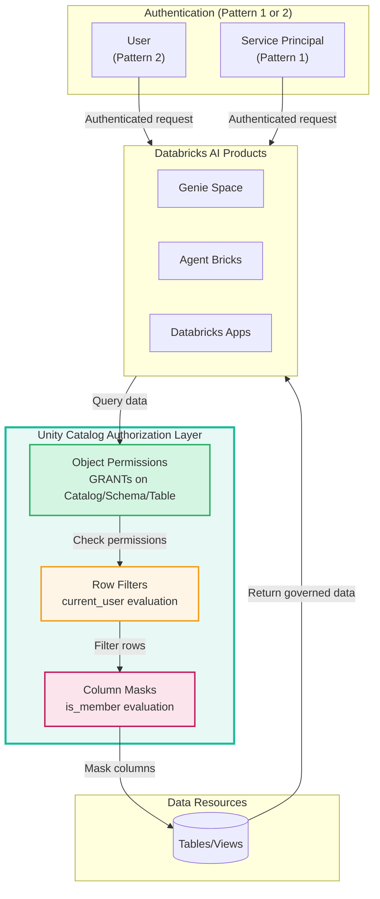
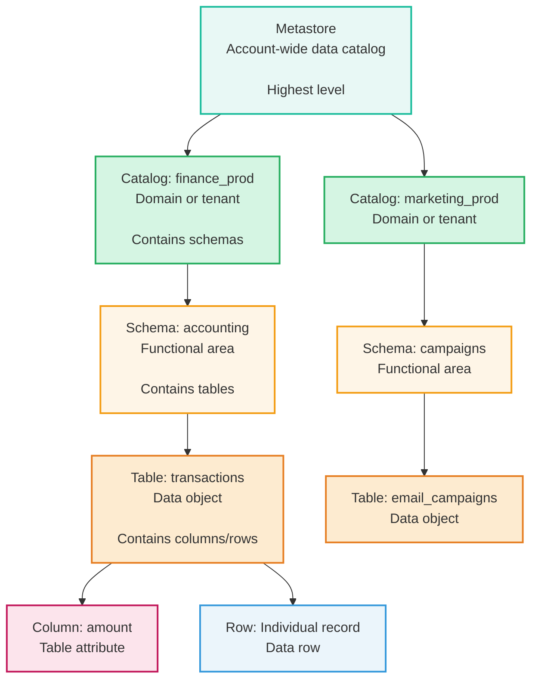
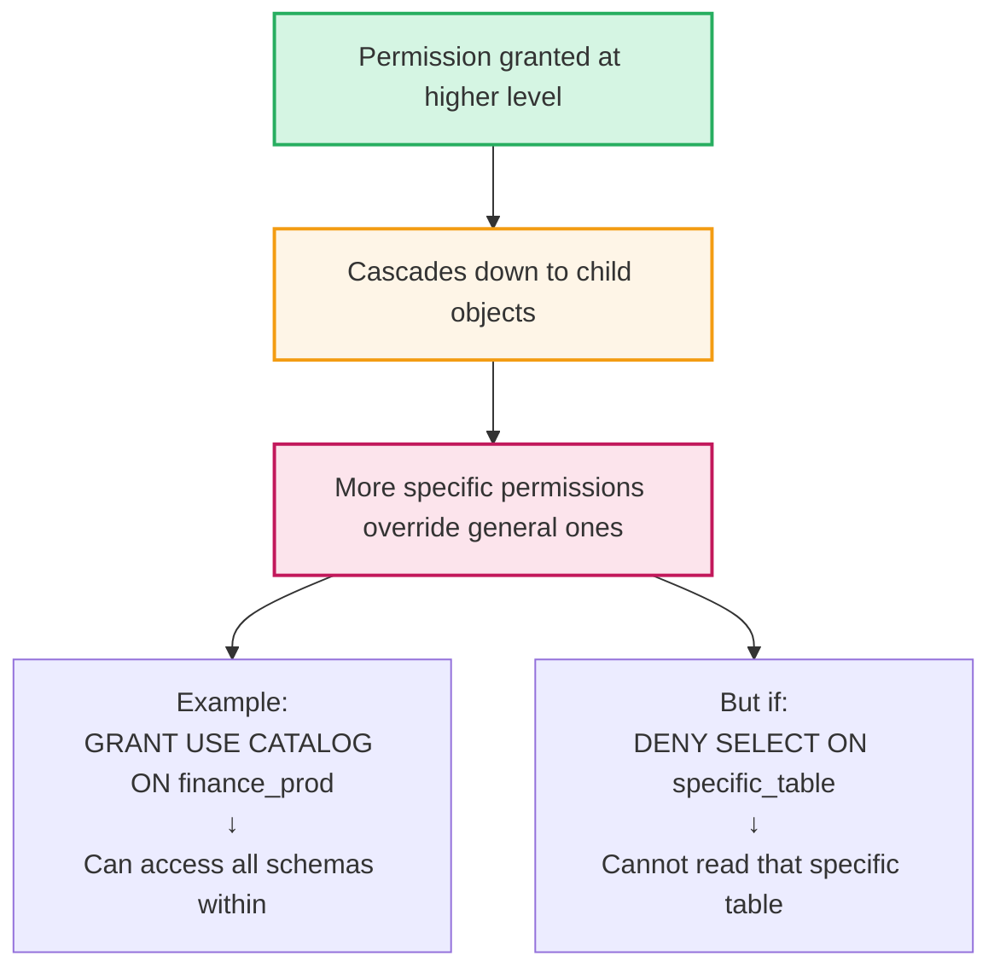
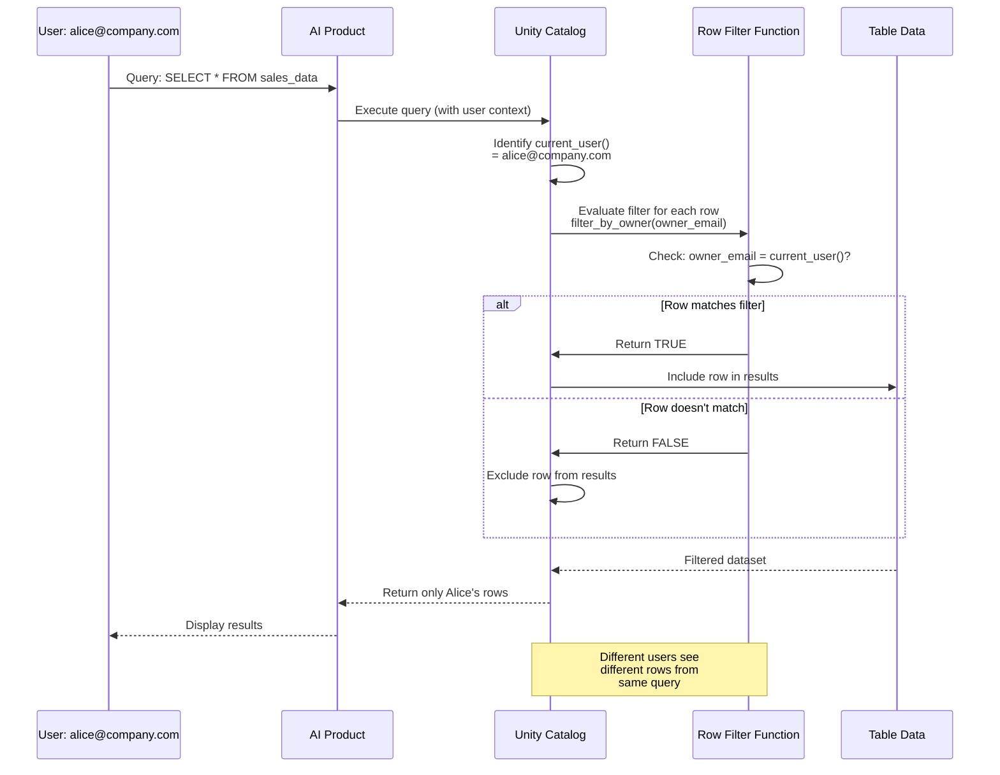
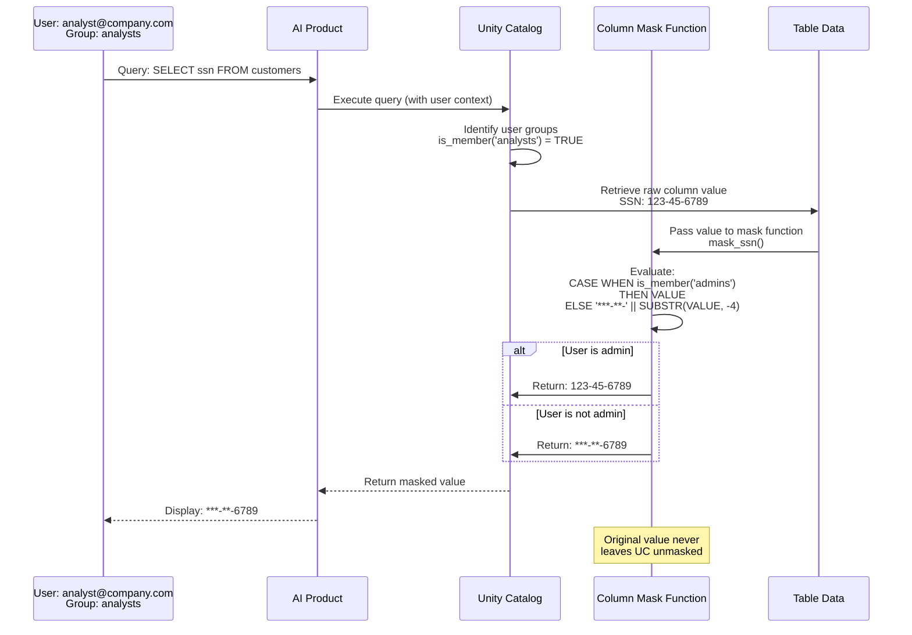
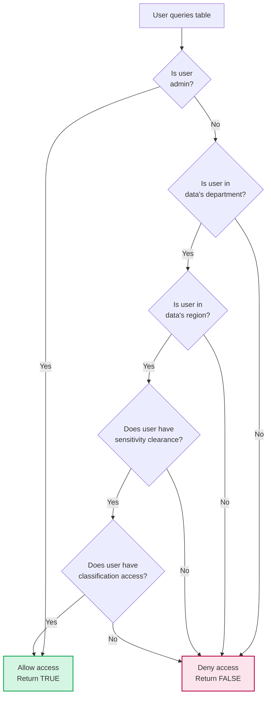
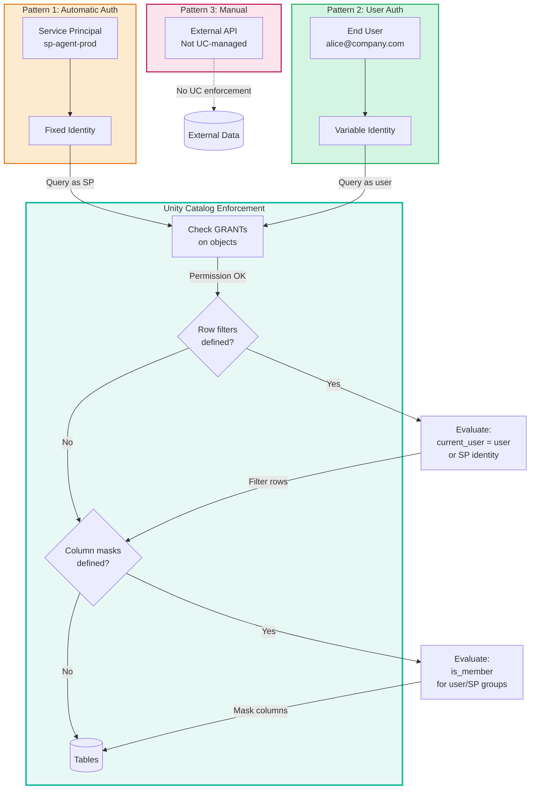
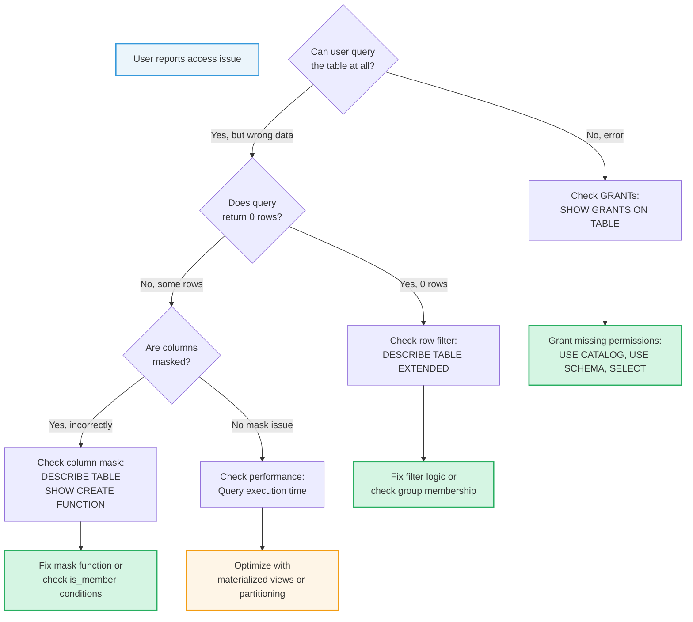

# Authorization with Unity Catalog

> **Technical reference for Unity Catalog governance across Databricks AI products**

---

## ⚠️ Important Disclaimers

### Multi-Cloud Documentation

This guide primarily links to **AWS Databricks documentation** for consistency. However, all Unity Catalog concepts apply universally across **AWS, Azure, and GCP**.

**To access cloud-specific documentation:**
- Use the **cloud selector dropdown** at the top of any Databricks doc page
- Navigate: AWS docs → Switch to Azure or GCP
- Cloud-specific differences are noted where applicable

**Quick Links:**
- [AWS Documentation](https://docs.databricks.com/aws/en/)
- [Azure Documentation](https://learn.microsoft.com/en-us/azure/databricks/)
- [GCP Documentation](https://docs.databricks.com/gcp/en/)

### Guidance vs Official Documentation

- This guide represents **practical guidance and best practices**, not official Databricks positions
- Always consult [official Databricks documentation](https://docs.databricks.com) for authoritative information
- Databricks features evolve rapidly - **verify current capabilities** and syntax in official docs
- **Use your best judgment** when applying these patterns to your specific requirements
- Features, APIs, and best practices may have changed since publication
- **Check official documentation** for the latest updates

---

## 🎯 Overview: Unity Catalog's Role in Authorization

**Unity Catalog (UC)** is Databricks' unified governance layer that enforces authorization policies for all data access, regardless of which AI product or compute resource accesses the data.

### Key Principles

1. **Separation of Concerns:**
   - **Authentication** (covered in [01-AUTHENTICATION-PATTERNS.md](01-AUTHENTICATION-PATTERNS.md)) → "Who are you?"
   - **Authorization** (this document) → "What can you access?"

2. **Single Source of Truth:**
   - UC policies are defined **once** and enforced **everywhere**
   - Works across Genie Space, Agent Bricks, Databricks Apps, SQL Warehouses, Notebooks

3. **Pattern Integration:**
   - **Pattern 1 (Automatic Auth):** UC evaluates service principal permissions
   - **Pattern 2 (User Auth):** UC evaluates user permissions + row filters + column masks
   - **Pattern 3 (Manual Credentials):** UC not involved (external services)

4. **Fine-Grained Control:**
   - **Object-level:** Catalog, schema, table permissions (GRANTs)
   - **Row-level:** Filter which rows users can see
   - **Column-level:** Mask sensitive column values

### How UC Works with Authentication Patterns



**Documentation:** [Unity Catalog Overview](https://docs.databricks.com/aws/en/data-governance/unity-catalog/index.html)

---

## 🏛️ Unity Catalog Hierarchy

Unity Catalog enforces authorization at multiple levels in a hierarchical structure:



### Hierarchy Levels

| Level | Description | Permissions Granted | Example |
|-------|-------------|---------------------|---------|
| **Metastore** | Account-wide catalog | Metastore admin | One per account |
| **Catalog** | Top-level container | USE CATALOG, CREATE SCHEMA | `finance_prod`, `marketing_prod` |
| **Schema** | Logical grouping | USE SCHEMA, CREATE TABLE | `finance_prod.accounting` |
| **Table** | Data object | SELECT, INSERT, UPDATE, DELETE | `finance_prod.accounting.transactions` |
| **Column** | Table attribute | Column masks | `transactions.amount` |
| **Row** | Individual record | Row filters | Individual transaction records |

### Permission Inheritance



**Documentation:** [Unity Catalog Object Model](https://docs.databricks.com/aws/en/data-governance/unity-catalog/best-practices.html)

---

## 🔐 Permission Model: GRANTs

Unity Catalog uses SQL GRANT statements to control access to objects.

### Permission Types

| Permission | Level | Description | Required For |
|------------|-------|-------------|--------------|
| `USE CATALOG` | Catalog | Access catalog and list schemas | Prerequisite for schema access |
| `USE SCHEMA` | Schema | Access schema and list tables | Prerequisite for table access |
| `SELECT` | Table | Read data | Queries, Genie Space, read-only agents |
| `INSERT` | Table | Write new data | ETL pipelines, data ingestion |
| `UPDATE` | Table | Modify existing data | Data correction workflows |
| `DELETE` | Table | Remove data | Data retention policies |
| `MODIFY` | Table | Alter table structure | Schema evolution |
| `CREATE TABLE` | Schema | Create new tables | Agent Bricks writing results |
| `CREATE SCHEMA` | Catalog | Create new schemas | Admin operations |
| `ALL PRIVILEGES` | Any | All permissions on object | Full control (use sparingly) |

### GRANT Syntax Pattern

```sql
-- Basic pattern
GRANT <privilege> ON <object_type> <object_name> TO <principal>;

-- Examples
GRANT USE CATALOG ON CATALOG finance_prod TO `analysts`;
GRANT USE SCHEMA ON SCHEMA finance_prod.accounting TO `analysts`;
GRANT SELECT ON TABLE finance_prod.accounting.transactions TO `analysts`;
```

### Permission Cascade Example

```sql
-- Step 1: Grant catalog access
GRANT USE CATALOG ON CATALOG finance_prod TO `analysts`;

-- Step 2: Grant schema access
GRANT USE SCHEMA ON SCHEMA finance_prod.accounting TO `analysts`;

-- Step 3: Grant table access
GRANT SELECT ON TABLE finance_prod.accounting.transactions TO `analysts`;

-- Now analysts group can query: SELECT * FROM finance_prod.accounting.transactions
```

### Who Can Grant Permissions

| Role | Can Grant On | Scope |
|------|--------------|-------|
| **Metastore Admin** | All objects | Account-wide |
| **Catalog Owner** | Catalog and all child objects | Specific catalog |
| **Schema Owner** | Schema and all child objects | Specific schema |
| **Table Owner** | Specific table | Individual table |
| **Users with GRANT permission** | Objects they have GRANT on | Delegated scope |

**Documentation:** 
- [GRANT Statement](https://docs.databricks.com/aws/en/sql/language-manual/security-grant.html)
- [Unity Catalog Privileges](https://docs.databricks.com/aws/en/data-governance/unity-catalog/manage-privileges/index.html)

---

## 🎭 Row-Level Security: Row Filters

Row filters restrict **which rows** users can see in a table based on their identity or group membership.

### Concept

When a row filter is applied to a table:
1. User queries the table normally (`SELECT * FROM table`)
2. UC automatically evaluates the filter function for each row
3. UC returns only rows where the filter function returns `TRUE`
4. User is unaware of filtered-out rows (they simply don't appear in results)

### How Row Filters Work



### Row Filter Function Pattern

```sql
-- Create filter function
CREATE FUNCTION catalog.schema.filter_function_name(column_name DATA_TYPE)
RETURNS BOOLEAN
RETURN condition_using_current_user_or_is_member;

-- Apply filter to table
ALTER TABLE catalog.schema.table_name
  SET ROW FILTER catalog.schema.filter_function_name ON (column_name);
```

### Example: User-Based Filter

```sql
-- Filter: Users see only their own rows
CREATE FUNCTION sales.filters.user_owns_row(owner STRING)
RETURNS BOOLEAN
RETURN owner = current_user();

ALTER TABLE sales.data.opportunities
  SET ROW FILTER sales.filters.user_owns_row ON (owner_email);
```

### Example: Group-Based Filter

```sql
-- Filter: Users see rows based on group membership
CREATE FUNCTION sales.filters.team_access(team STRING)
RETURNS BOOLEAN
RETURN is_member(team);

ALTER TABLE sales.data.opportunities
  SET ROW FILTER sales.filters.team_access ON (team_name);
```

### Example: Hierarchical Filter

```sql
-- Filter: Managers see team data, employees see own data
CREATE FUNCTION hr.filters.hierarchical(employee STRING, manager STRING)
RETURNS BOOLEAN
RETURN 
    employee = current_user() OR         -- Own records
    manager = current_user() OR          -- Managed records
    is_member('hr-admins');              -- HR sees all

ALTER TABLE hr.data.employee_reviews
  SET ROW FILTER hr.filters.hierarchical ON (employee_email, manager_email);
```

### Common Row Filter Patterns

| Pattern | Use Case | Logic |
|---------|----------|-------|
| **User-based** | Personal data (own records only) | `column = current_user()` |
| **Group-based** | Team data (department access) | `is_member(column)` |
| **Hierarchical** | Manager/employee relationships | `owner = current_user() OR manager = current_user()` |
| **Time-based** | Historical data restrictions | `date_column >= current_date() - 365` |
| **Multi-tenant** | SaaS isolation | `tenant_id = extract_tenant(current_user())` |
| **Compliance bypass** | Audit/compliance sees all | `is_member('compliance') OR condition` |

### Removing Row Filters

```sql
-- Remove row filter from table
ALTER TABLE catalog.schema.table_name DROP ROW FILTER;
```

**Documentation:** [Row Filters and Column Masks](https://docs.databricks.com/aws/en/sql/language-manual/sql-ref-row-filter-column-mask.html)

---

## 🔒 Column-Level Security: Column Masks

Column masks control **what values** users see in specific columns based on their identity or group membership.

### Concept

When a column mask is applied:
1. User queries the table including masked columns
2. UC evaluates the mask function for the user
3. UC returns transformed values based on mask logic
4. User sees masked/redacted values, not original data

### How Column Masks Work



### Column Mask Function Pattern

```sql
-- Create mask function
CREATE FUNCTION catalog.schema.mask_function_name()
RETURNS DATA_TYPE
RETURN 
    CASE 
        WHEN condition THEN VALUE              -- Original value
        WHEN other_condition THEN transform    -- Transformed value
        ELSE default_mask                      -- Default mask
    END;

-- Apply mask to column
ALTER TABLE catalog.schema.table_name
  ALTER COLUMN column_name SET MASK catalog.schema.mask_function_name;
```

**Important:** `VALUE` is a special keyword representing the original column value.

### Example: SSN Masking

```sql
-- Mask: Show last 4 digits only to non-admins
CREATE FUNCTION customer.masks.mask_ssn()
RETURNS STRING
RETURN 
    CASE 
        WHEN is_member('admins') THEN VALUE
        ELSE CONCAT('***-**-', SUBSTR(VALUE, -4))
    END;

ALTER TABLE customer.data.customers
  ALTER COLUMN ssn SET MASK customer.masks.mask_ssn;
```

### Example: Email Partial Masking

```sql
-- Mask: Show partial email for verification
CREATE FUNCTION customer.masks.mask_email()
RETURNS STRING
RETURN 
    CASE 
        WHEN is_member('customer-service') THEN VALUE
        WHEN is_member('analysts') THEN 
            CONCAT(SUBSTR(VALUE, 1, 2), '***@', SPLIT_PART(VALUE, '@', 2))
        ELSE '***@***'
    END;

ALTER TABLE customer.data.customers
  ALTER COLUMN email SET MASK customer.masks.mask_email;
```

### Example: Conditional Masking by Data Classification

```sql
-- Mask: Different masking based on data sensitivity
CREATE FUNCTION data.masks.conditional_mask()
RETURNS STRING
RETURN 
    CASE 
        WHEN is_member('data-owners') THEN VALUE
        WHEN sensitivity_level = 'high' AND is_member('managers') THEN VALUE
        WHEN sensitivity_level = 'medium' THEN SUBSTR(VALUE, 1, 10) || '***'
        ELSE '*** REDACTED ***'
    END;
```

### Common Column Mask Patterns

| Pattern | Use Case | Masking Logic |
|---------|----------|---------------|
| **Full redaction** | Hide entire value | `'***'` or `NULL` |
| **Partial redaction** | Show last N characters | `CONCAT('***', SUBSTR(VALUE, -4))` |
| **Email masking** | Hide username, show domain | `CONCAT('***@', SPLIT_PART(VALUE, '@', 2))` |
| **Hash masking** | Pseudonymize for analytics | `SHA2(VALUE, 256)` |
| **Role-based** | Different masks per role | Multiple `WHEN is_member()` conditions |
| **Null masking** | Hide from specific groups | `CASE WHEN is_member() THEN NULL ELSE VALUE` |

### Removing Column Masks

```sql
-- Remove mask from column
ALTER TABLE catalog.schema.table_name
  ALTER COLUMN column_name DROP MASK;
```

**Documentation:** [Column Masks](https://docs.databricks.com/aws/en/sql/language-manual/sql-ref-row-filter-column-mask.html)

---

## 🏷️ Attribute-Based Access Control (ABAC)

ABAC combines **multiple attributes** (user identity, group membership, data classification, time, location) to make fine-grained authorization decisions.

### Concept

Instead of simple rules ("user X can access table Y"), ABAC evaluates:
- **Who** is the user? (`current_user()`)
- **What groups** are they in? (`is_member()`)
- **What data** are they accessing? (column values like `department`, `region`, `sensitivity`)
- **When** are they accessing? (`current_timestamp()`)
- **From where**? (if using network policies)

### ABAC Row Filter Example

```sql
-- ABAC filter combining multiple attributes
CREATE FUNCTION data.filters.abac_filter(
    data_department STRING,
    data_region STRING,
    data_sensitivity STRING,
    data_classification STRING
)
RETURNS BOOLEAN
RETURN 
    CASE
        -- Admins bypass all checks
        WHEN is_member('admins') THEN TRUE
        
        -- Must be in data's department
        WHEN NOT is_member(data_department) THEN FALSE
        
        -- Regional restrictions
        WHEN data_region = 'EMEA' AND NOT is_member('emea-users') THEN FALSE
        WHEN data_region = 'AMER' AND NOT is_member('amer-users') THEN FALSE
        WHEN data_region = 'APAC' AND NOT is_member('apac-users') THEN FALSE
        
        -- Sensitivity-based restrictions
        WHEN data_sensitivity = 'high' AND NOT is_member('managers') THEN FALSE
        WHEN data_sensitivity = 'critical' AND NOT is_member('executives') THEN FALSE
        
        -- Classification-based restrictions
        WHEN data_classification = 'pii' AND NOT is_member('pii-authorized') THEN FALSE
        WHEN data_classification = 'financial' AND NOT is_member('finance-team') THEN FALSE
        
        -- Default: allow if all checks pass
        ELSE TRUE
    END;

-- Apply ABAC filter
ALTER TABLE corp.data.sensitive_records
  SET ROW FILTER data.filters.abac_filter 
  ON (department, region, sensitivity_level, classification);
```

### ABAC Decision Flow



### ABAC Best Practices

1. **Fail secure:** Default to `FALSE` (deny) if conditions aren't met
2. **Admin bypass:** Always allow admins/compliance to override for audits
3. **Layered checks:** Evaluate cheapest conditions first (group membership before complex logic)
4. **Clear logic:** Comment each condition in function for maintainability
5. **Test thoroughly:** Verify with multiple user personas and data combinations

**Documentation:** [Attribute-Based Access Control](https://docs.databricks.com/aws/en/data-governance/unity-catalog/row-and-column-filters.html)

---

## 🔄 Dynamic Views

Dynamic views use SQL logic to implement complex access control patterns that go beyond simple row filters and column masks.

### When to Use Dynamic Views

| Use Case | Row Filter/Mask | Dynamic View |
|----------|-----------------|--------------|
| **Simple user/group check** | ✅ Preferred | ❌ Overkill |
| **Cross-table logic** | ❌ Not possible | ✅ Use view |
| **Complex aggregations** | ❌ Not possible | ✅ Use view |
| **Conditional column selection** | ⚠️ Mask each column | ✅ SELECT CASE |
| **Legacy migration** | ❌ Requires table changes | ✅ Layer views on top |
| **Performance-sensitive** | ✅ Better | ⚠️ May be slower |

### Dynamic View Pattern

```sql
-- Create view with conditional logic
CREATE VIEW catalog.schema.dynamic_view AS
SELECT 
    column1,
    
    -- Conditional column visibility
    CASE 
        WHEN is_member('group1') THEN column2
        ELSE NULL
    END AS column2,
    
    -- Conditional aggregation
    CASE 
        WHEN is_member('executives') THEN SUM(amount)
        WHEN is_member('managers') THEN SUM(amount) OVER (PARTITION BY team)
        ELSE NULL
    END AS total_amount
    
FROM catalog.schema.base_table
WHERE 
    -- Row-level filtering
    (owner_email = current_user() OR is_member('managers'));
```

### Example: Multi-Tier Visibility View

```sql
-- Different users see different aggregations
CREATE VIEW sales.views.revenue_by_role AS
SELECT 
    date,
    region,
    
    -- Executives see exact amounts
    CASE 
        WHEN is_member('executives') THEN revenue
        WHEN is_member('regional-managers') THEN 
            -- Regional managers see regional totals
            SUM(revenue) OVER (PARTITION BY region, date)
        WHEN is_member('sales-reps') THEN 
            -- Sales reps see only their contribution
            CASE WHEN rep_email = current_user() THEN revenue ELSE NULL END
        ELSE NULL
    END AS revenue_amount
    
FROM sales.data.daily_revenue;
```

### Trade-offs

| Aspect | Row Filters/Masks | Dynamic Views |
|--------|------------------|---------------|
| **Setup** | Simpler (function + ALTER) | More complex (view definition) |
| **Performance** | Better (evaluated in engine) | May be slower (subquery) |
| **Flexibility** | Limited to single table | Complex multi-table logic |
| **Maintenance** | Change function definition | Change view definition |
| **Transparency** | Users query base table | Users query view (abstraction layer) |

**Documentation:** [Dynamic Views for Access Control](https://docs.databricks.com/aws/en/data-governance/unity-catalog/create-views.html)

---

## 📖 Unity Catalog Built-in Functions Reference

UC provides session functions that can be used in row filters, column masks, and dynamic views:

| Function | Returns | Description | Example Use Case |
|----------|---------|-------------|------------------|
| `current_user()` | STRING | Email of authenticated user | Row filter: `owner = current_user()` |
| `is_member('group')` | BOOLEAN | TRUE if user is in specified group | Column mask: `WHEN is_member('admins') THEN VALUE` |
| `current_catalog()` | STRING | Name of current catalog | Context-aware policies |
| `current_schema()` | STRING | Name of current schema | Context-aware policies |
| `current_database()` | STRING | Alias for `current_schema()` | Legacy compatibility |
| `current_timestamp()` | TIMESTAMP | Current timestamp | Time-based access: `date > current_timestamp() - INTERVAL '90' DAY` |
| `current_date()` | DATE | Current date | Date-based filtering |

### Function Examples

```sql
-- Example 1: User-specific row filter
CREATE FUNCTION filters.my_data(owner STRING)
RETURNS BOOLEAN
RETURN owner = current_user();

-- Example 2: Group-based column mask
CREATE FUNCTION masks.redact_pii()
RETURNS STRING
RETURN CASE WHEN is_member('pii-authorized') THEN VALUE ELSE '***' END;

-- Example 3: Time-based row filter
CREATE FUNCTION filters.recent_data(record_date DATE)
RETURNS BOOLEAN
RETURN record_date >= current_date() - INTERVAL '365' DAY;

-- Example 4: Combined logic
CREATE FUNCTION filters.complex_access(owner STRING, dept STRING, created_date DATE)
RETURNS BOOLEAN
RETURN 
    (owner = current_user() OR is_member(dept)) AND
    (created_date >= current_date() - INTERVAL '90' DAY OR is_member('admins'));
```

**Documentation:** [SQL Functions Reference](https://docs.databricks.com/aws/en/sql/language-manual/sql-ref-functions-builtin.html)

---

## 🔗 Pattern Integration: How UC Enforces Authentication Patterns

Unity Catalog enforces authorization differently based on which authentication pattern is used:

### Pattern Integration Architecture



### How Each Pattern Works with UC

#### Pattern 1: Automatic Authentication Passthrough (Service Principal)

```sql
-- Service principal: sp-agent-prod
-- Groups: [agents, production-services]

-- Query executed as sp-agent-prod
SELECT * FROM catalog.schema.table;

-- UC evaluation:
-- 1. Check GRANTs for sp-agent-prod
-- 2. Evaluate row filters (if any) with current_user() = sp-agent-prod
-- 3. Evaluate column masks (if any) with is_member() for SP's groups
-- 4. Return data based on SP's permissions
```

**Key Characteristics:**
- Same permissions every execution
- Row filters evaluate to same SP identity
- Column masks check SP's group memberships
- Ideal for consistent, automated access

#### Pattern 2: User Authentication Passthrough (OBO)

```sql
-- User: alice@company.com
-- Groups: [analysts, sales-team]

-- Query executed as alice@company.com
SELECT * FROM catalog.schema.table;

-- UC evaluation:
-- 1. Check GRANTs for alice@company.com and her groups
-- 2. Evaluate row filters: current_user() = 'alice@company.com'
-- 3. Evaluate column masks: is_member('analysts'), is_member('sales-team')
-- 4. Return data based on Alice's permissions and group memberships

-- Different user (Bob) gets different results from same query
```

**Key Characteristics:**
- Different permissions per user
- Row filters dynamically filter per user
- Column masks apply differently per user's groups
- Ideal for personalized, user-specific access

#### Pattern 3: Manual Credentials

- UC is **not involved** - external service handles authorization
- Use for APIs outside Databricks (OpenAI, Salesforce, etc.)
- Data from external sources is not governed by UC until written to UC tables

---

## ✅ Testing and Verification

### Check Applied Policies

```sql
-- View table details including row filters
DESCRIBE TABLE EXTENDED catalog.schema.table_name;

-- Check grants on table
SHOW GRANTS ON TABLE catalog.schema.table_name;

-- View column details including masks
DESCRIBE TABLE catalog.schema.table_name column_name;

-- View function definition
SHOW CREATE FUNCTION catalog.schema.filter_function;
```

### Test with Multiple Personas

Create test matrix:

| Test User | Groups | Expected Rows | Expected Column Values |
|-----------|--------|---------------|----------------------|
| alice@company.com | `analysts` | 100 rows (her data) | SSN masked to last 4 |
| bob@company.com | `analysts, managers` | 500 rows (team data) | SSN masked to last 4 |
| carol@company.com | `admins` | 10,000 rows (all data) | SSN unmasked |

```sql
-- Test as each user (run in separate sessions)
SELECT COUNT(*) FROM catalog.schema.table;
SELECT ssn FROM catalog.schema.table LIMIT 1;
```

### Verify Row Filter Logic

```sql
-- As admin, check filter function logic
SHOW CREATE FUNCTION catalog.schema.row_filter_name;

-- Test filter independently (as admin with bypass)
SELECT 
    COUNT(*) as total_rows,
    COUNT(*) FILTER (WHERE owner_email = 'alice@company.com') as alice_rows
FROM catalog.schema.table;
```

### Audit Logs

```sql
-- Query audit logs to see who accessed what
SELECT 
    user_identity.email,
    request_params.full_name_arg AS object_accessed,
    action_name,
    event_time,
    request_params.command_text AS query
FROM system.access.audit
WHERE request_params.full_name_arg = 'catalog.schema.table'
  AND event_date >= current_date() - INTERVAL '7' DAY
ORDER BY event_time DESC
LIMIT 100;
```

**Documentation:** [Unity Catalog Audit Logs](https://docs.databricks.com/aws/en/administration-guide/account-settings/audit-logs.html)

---

## ⚡ Performance Considerations

Row filters and column masks add overhead to query execution. Consider these optimization strategies:

### Performance Impact

| Operation | Overhead | Mitigation Strategy |
|-----------|----------|---------------------|
| **Simple row filter** | Low (5-10%) | Acceptable for most use cases |
| **Complex row filter** | Medium (10-30%) | Simplify logic, use indexes |
| **Multiple row filters** | High (30%+) | Consolidate into single filter |
| **Column mask** | Low-Medium | Minimal impact |
| **Dynamic view with aggregations** | High | Use materialized views |

### Optimization Strategies

#### 1. Use Materialized Views

```sql
-- Create materialized view with pre-filtered data
CREATE MATERIALIZED VIEW catalog.schema.filtered_view AS
SELECT * FROM catalog.schema.base_table
WHERE department = 'sales';

-- Apply row filter to materialized view
ALTER MATERIALIZED VIEW catalog.schema.filtered_view
  SET ROW FILTER catalog.schema.user_filter ON (owner_email);

-- Queries hit pre-filtered, cached data
SELECT * FROM catalog.schema.filtered_view;
```

#### 2. Partition Tables by Filter Column

```sql
-- Partition table by department (commonly filtered column)
CREATE TABLE catalog.schema.partitioned_table (
    id STRING,
    department STRING,
    data STRING
)
PARTITIONED BY (department);

-- Row filter can leverage partition pruning
ALTER TABLE catalog.schema.partitioned_table
  SET ROW FILTER catalog.schema.dept_filter ON (department);
```

#### 3. Simplify Filter Logic

```sql
-- ❌ Complex (slower)
CREATE FUNCTION filters.complex(dept STRING, region STRING, level STRING)
RETURNS BOOLEAN
RETURN 
    (dept = 'sales' AND is_member('sales-' || region || '-' || level)) OR
    (dept = 'marketing' AND is_member('marketing-team')) OR
    is_member('executives');

-- ✅ Simplified (faster)
CREATE FUNCTION filters.simple(dept STRING)
RETURNS BOOLEAN
RETURN 
    is_member(dept) OR is_member('executives');
```

#### 4. Index Commonly Filtered Columns

```sql
-- Create indexes on columns used in row filters
CREATE INDEX idx_owner ON catalog.schema.table (owner_email);
CREATE INDEX idx_dept ON catalog.schema.table (department);
```

### Performance Monitoring

```sql
-- Check query execution time
SELECT 
    query_id,
    execution_duration_ms,
    query_text
FROM system.query.history
WHERE query_text LIKE '%catalog.schema.filtered_table%'
ORDER BY execution_duration_ms DESC
LIMIT 10;
```

**Documentation:** [Performance Tuning](https://docs.databricks.com/aws/en/optimizations/index.html)

---

## 🎯 Best Practices

### 1. Least Privilege Principle

```sql
-- ❌ Don't grant broad access
GRANT ALL PRIVILEGES ON CATALOG production TO `account users`;

-- ✅ Grant minimum required permissions
GRANT USE CATALOG ON CATALOG production TO `analysts`;
GRANT USE SCHEMA ON SCHEMA production.sales TO `analysts`;
GRANT SELECT ON TABLE production.sales.data TO `analysts`;
```

### 2. Use Groups, Not Individual Users

```sql
-- ❌ Don't grant to individual users
GRANT SELECT ON TABLE data TO `alice@company.com`;
GRANT SELECT ON TABLE data TO `bob@company.com`;

-- ✅ Grant to groups
GRANT SELECT ON TABLE data TO `analysts`;
-- Manage group membership in IdP
```

### 3. Document Filter/Mask Logic

```sql
-- ✅ Add clear comments
CREATE FUNCTION filters.sales_access(owner STRING, team STRING)
RETURNS BOOLEAN
COMMENT 'Row filter: Sales reps see own data | Managers see team data | Executives see all'
RETURN 
    CASE
        -- Executives bypass filter
        WHEN is_member('executives') THEN TRUE
        -- Managers see team data
        WHEN is_member('managers') AND is_member(team) THEN TRUE
        -- Sales reps see own data
        WHEN owner = current_user() THEN TRUE
        ELSE FALSE
    END;
```

### 4. Separate Access Control from Business Logic

```sql
-- ❌ Don't mix
CREATE FUNCTION filters.mixed(status STRING, owner STRING)
RETURNS BOOLEAN
RETURN status = 'active' AND owner = current_user();
-- Confusing: is this access control or business logic?

-- ✅ Separate
CREATE FUNCTION filters.access_only(owner STRING)
RETURNS BOOLEAN
RETURN owner = current_user();

-- Business logic in query
SELECT * FROM table WHERE status = 'active';
-- Row filter handles access control automatically
```

### 5. Test with Multiple Personas

Create test users for each role:
- Regular user
- Power user (manager)
- Limited user
- Admin/compliance

Verify each sees correct data and masked columns.

### 6. Regular Audits

```sql
-- Quarterly review: Who has access to what?
SHOW GRANTS ON CATALOG production;
SHOW GRANTS ON SCHEMA production.sales;
SHOW GRANTS ON TABLE production.sales.sensitive_data;

-- Review row filters and masks
SELECT 
    table_catalog,
    table_schema,
    table_name,
    row_filter,
    column_masks
FROM system.information_schema.tables
WHERE table_catalog = 'production';
```

---

## 🚨 Troubleshooting

### Common Issues and Solutions

| Issue | Symptoms | Diagnosis | Solution |
|-------|----------|-----------|----------|
| **User can't see expected data** | Query returns 0 rows | Check GRANTs, row filters, group membership | Verify user has USE CATALOG, USE SCHEMA, SELECT permissions; Check row filter logic |
| **Column appears masked incorrectly** | Wrong mask applied | Check mask function and user groups | Verify `is_member()` conditions and group membership |
| **Performance degradation** | Slow queries after adding filters | Check filter complexity | Simplify filter logic, add materialized views, partition tables |
| **Filter not applying** | All users see all data | Check filter is set on table | Run `DESCRIBE TABLE EXTENDED` to verify filter |
| **Permission denied** | Error accessing table | Missing GRANTs | Grant USE CATALOG, USE SCHEMA, and SELECT in order |

### Diagnostic Queries

```sql
-- 1. Check if user has table permissions
SHOW GRANTS ON TABLE catalog.schema.table;

-- 2. Check if row filter is applied
DESCRIBE TABLE EXTENDED catalog.schema.table;
-- Look for: Row Filter: catalog.schema.filter_name

-- 3. Check user's group membership
SELECT * FROM system.access.users WHERE email = 'user@company.com';

-- 4. Check if any rows match filter
-- (Run as admin to see unfiltered data)
SELECT COUNT(*) FROM catalog.schema.table
WHERE owner_email = 'user@company.com';

-- 5. View filter function logic
SHOW CREATE FUNCTION catalog.schema.filter_name;

-- 6. Test is_member() for user
SELECT is_member('group_name') AS user_in_group;
```

### Debugging Flowchart



**Documentation:** [Troubleshooting Unity Catalog](https://docs.databricks.com/aws/en/data-governance/unity-catalog/troubleshooting.html)

---

## 📚 Next Steps

Now that you understand Unity Catalog authorization:

### 1. Review Product Integration
**[03-PRODUCT-INTEGRATION.md →](03-PRODUCT-INTEGRATION.md)**

Learn how specific AI products use UC:
- Genie Space (always enforces UC with user context)
- Agent Bricks (configurable UC enforcement)
- Databricks Apps (UC enforcement based on auth mode)
- Model Serving (UC enforcement for data access)

### 2. Explore Real-World Scenarios
**[scenarios/ →](scenarios/)**

Complete implementation examples:
- Multi-team analytics with row filters
- Large-scale deployments with ABAC
- Embedded applications with dynamic views
- Industry-specific patterns (financial services, healthcare, retail)

### 3. Hands-On Setup
**[examples/ →](examples/)** *(Coming Soon)*

> **Note**: Practical, copy-paste ready examples are currently being developed. These will include step-by-step SQL scripts and UI instructions for:
> - Row-level security setup
> - Column-level security and masking
> - ABAC patterns
> - Genie Space curation with UC governance

For now, refer to the [scenarios/](scenarios/) folder for complete implementation examples.

### 4. Review Best Practices
**[Best Practices →](../guides/)** *(See related guides)*

> **Note**: Dedicated best-practices section is planned for future release. For now, this document includes production-ready patterns in the sections above.

For additional guidance, see:
- [Authentication Guide](../guides/authentication.md) - Secure authentication patterns
- [Networking Guide](../guides/networking.md) - Multi-cloud networking best practices

---

## 🔖 Quick Reference

### UC Authorization Layers

| Layer | Control Type | Configured With | Example |
|-------|-------------|-----------------|---------|
| **Object** | Table access | GRANT statements | `GRANT SELECT ON TABLE` |
| **Row** | Which rows visible | Row filter functions | `current_user() = owner` |
| **Column** | Column value masking | Column mask functions | `WHEN is_member() THEN VALUE` |

### Key SQL Patterns

**Grant Permissions:**
```sql
GRANT USE CATALOG ON CATALOG catalog_name TO `group`;
GRANT SELECT ON TABLE catalog.schema.table TO `group`;
```

**Row Filter:**
```sql
CREATE FUNCTION catalog.schema.filter(col DATA_TYPE) RETURNS BOOLEAN RETURN condition;
ALTER TABLE catalog.schema.table SET ROW FILTER catalog.schema.filter ON (column);
```

**Column Mask:**
```sql
CREATE FUNCTION catalog.schema.mask() RETURNS DATA_TYPE RETURN CASE WHEN condition THEN VALUE ELSE mask END;
ALTER TABLE catalog.schema.table ALTER COLUMN column SET MASK catalog.schema.mask;
```

### UC Functions

| Function | Use For |
|----------|---------|
| `current_user()` | Row filters based on user identity |
| `is_member('group')` | Column masks and row filters based on group |
| `current_catalog()` | Context-aware policies |
| `current_timestamp()` | Time-based access control |

---

**Questions?** See troubleshooting above or continue to [03-PRODUCT-INTEGRATION.md](03-PRODUCT-INTEGRATION.md) to learn how AI products use Unity Catalog.
