# AI/BI Genie Space: Authentication & Authorization Deep Dive

> **Technical reference for securing multi-team Genie deployments with Unity Catalog**

---

## ⚠️ Important Disclaimers

### Multi-Cloud Documentation

This guide primarily links to **AWS Databricks documentation** for consistency. However, all Genie concepts apply universally across **AWS, Azure, and GCP**.

**To access cloud-specific documentation:**
- Use the **cloud selector dropdown** at the top of any Databricks doc page
- Navigate: AWS docs → Switch to Azure or GCP
- Cloud-specific differences are noted where applicable

**Quick Links:**
- [AWS Documentation](https://docs.databricks.com/aws/en/)
- [Azure Documentation](https://learn.microsoft.com/en-us/azure/databricks/)
- [GCP Documentation](https://docs.databricks.com/gcp/en/)

### Guidance vs Official Documentation

- This guide represents **practical guidance and best practices**, not official Databricks positions
- Always consult [official Databricks documentation](https://docs.databricks.com) for authoritative information
- Databricks features evolve rapidly - **verify current capabilities** and syntax in official docs
- **Use your best judgment** when applying these patterns to your specific requirements
- Features, APIs, and best practices may have changed since publication
- **Check official documentation** for the latest updates

---

## 🎯 Overview: What is AI/BI Genie Space?

**AI/BI Genie Space** is Databricks' natural language interface that allows **business teams** to ask questions about their data without writing SQL. Genie uses generative AI to translate business questions into SQL queries, execute them, and return results with visualizations.

**Key Characteristics:**
- 🗣️ **Natural language queries** - Business users ask questions in plain English
- 🤖 **AI-powered SQL generation** - Compound AI system converts questions to SQL
- 📊 **Automatic visualizations** - Charts and graphs generated from results
- 🔒 **Built-in governance** - Unity Catalog enforces all access control
- 👥 **Multi-team support** - One Genie space can serve multiple teams securely

### Why Genie Matters for Multi-Team Organizations

Traditional BI tools require:
- Technical users to build dashboards
- Fixed queries and visualizations
- Separate dashboards per team (hard to maintain)

**Genie enables:**
- Business users to self-serve (no SQL knowledge needed)
- Ad-hoc questions (not limited to pre-built dashboards)
- **One Genie space for all teams** with Unity Catalog enforcing who sees what

### The Challenge Genie Solves

```mermaid
flowchart LR
    subgraph Traditional["❌ Traditional BI"]
        TeamA1[Sales Team<br/>Dashboard]
        TeamB1[Finance Team<br/>Dashboard]
        TeamC1[Marketing Team<br/>Dashboard]
        Maintain1[Maintain 3<br/>separate dashboards]
    end

    subgraph Genie["✅ With Genie + UC"]
        Space[Single Genie Space<br/>on company_data]
        TeamA2[Sales Team<br/>sees sales data]
        TeamB2[Finance Team<br/>sees finance data]
        TeamC2[Marketing Team<br/>sees marketing data]
        UC[Unity Catalog<br/>enforces isolation]
    end

    Traditional --> Maintain1

    Space --> UC
    UC --> TeamA2
    UC --> TeamB2
    UC --> TeamC2

    style Traditional fill:#fce4ec,stroke:#c2185b,stroke-width:2px
    style Genie fill:#d5f5e3,stroke:#27ae60,stroke-width:3px
    style UC fill:#e8f8f5,stroke:#1abc9c,stroke-width:2px
```



**Official Documentation:** [What is AI/BI Genie Space](https://docs.databricks.com/aws/en/genie/)

---

## 🔐 Genie's Authentication Methods

Genie supports **multiple authentication methods**, allowing flexible and secure integration with Databricks resources. The authentication method you choose determines how queries are executed and which identity's permissions are used.

### Supported Authentication Methods

| Method | Use Case | Authorization Model | Recommended For |
|--------|----------|-------------------|-----------------|
| **OAuth U2M** | User-to-Machine flows | User-specific privileges via Unity Catalog | Interactive business users, production apps |
| **OAuth M2M** | Machine-to-Machine flows | Service principal permissions | CI/CD pipelines, backend automation |
| **On-Behalf-Of (OBO)** | Per-user context with auditability | User-specific Unity Catalog privileges | Multi-user apps requiring per-user access |
| **Automatic Passthrough** | Workspace agents (Genie Spaces) | Service principal (auto-rotated, short-lived) | Genie Spaces with automatic credential management |
| **PAT** | Personal Access Token | Token permissions (less granular) | Development, testing, short-term access |
| **Azure AD** | Microsoft support workflows | SSO/MFA, AAD as source of truth | Azure-specific support scenarios |

**Key Principle:** OAuth (U2M/M2M) and OBO are **recommended for production** due to fine-grained access control, auditability, and Unity Catalog enforcement. PATs are acceptable for development but less secure.

### Method 1: OAuth User-to-Machine (U2M)

**Best for:** Business users interacting with Genie Spaces interactively


**How It Works:**
- User logs in with their corporate identity (SSO)
- Genie receives an OAuth token representing the user
- Queries execute with **the user's permissions**
- `current_user()` = user's email in Unity Catalog
- Row filters and column masks automatically apply

**Example Use Case:**
- Sales rep Alice asks: "Show my deals" → sees only her deals (row filter: `WHERE owner = current_user()`)
- Finance user Bob asks: "Show my deals" → denied (no SELECT permission on sales table)

---

### Method 2: OAuth Machine-to-Machine (M2M)

**Best for:** Backend services, CI/CD, automated workflows


**How It Works:**
- Service principal authenticates with client credentials (client ID/secret)
- Genie receives an OAuth token representing the service principal
- Queries execute with **the service principal's permissions**
- No user context - all queries run as the SP

**Example Use Case:**
- Nightly job uses SP to query Genie for company-wide metrics
- SP has SELECT on aggregate tables only (not individual customer data)
- Results published to executive dashboard

---

### Method 3: On-Behalf-Of (OBO)

**Best for:** Multi-user applications requiring per-user access control


**How It Works:**
- Application authenticates as itself (app service principal)
- When querying Genie, app specifies to run query "on behalf of" the end user
- Genie uses the **end user's permissions**, not the app's
- Full auditability - logs show the actual user, not the app

**Example Use Case:**
- Customer portal where customers query their own data
- App runs as `sp-customer-portal` but queries execute as `customer@email.com`
- UC row filter ensures each customer sees only their data

**SDK Support:**

**Current Implementation (2024+):**
```python
from databricks.sdk import WorkspaceClient
from databricks_langchain import GenieAgent
from databricks_ai_bridge import ModelServingUserCredentials

# 1. Configure the WorkspaceClient for OBO authentication
user_client = WorkspaceClient(credentials_strategy=ModelServingUserCredentials())

# 2. Initialize the GenieAgent with the configured client
agent = GenieAgent(
    genie_space_id="<genie-space-id>",
    genie_agent_name="Genie",  # Optional name
    description="This agent queries sales data",  # Optional description
    client=user_client  # Pass the OBO client here
)

# 3. Use the agent
response = agent.invoke("Show me the total revenue for last month.")
```

**Key Changes from Legacy Approach:**
- **Authentication Method:** Use `ModelServingUserCredentials()` within `WorkspaceClient` instead of `on_behalf_of` string parameter
- **Client Parameter:** Pass the specialized `WorkspaceClient` to `GenieAgent` via the `client` parameter
- **Automatic Token Injection:** When deployed to Model Serving, Databricks automatically injects a short-lived OAuth token for the user session

**How It Works:**

1. **Token Injection:** When an agent is deployed to a Mosaic AI Model Serving endpoint, Databricks automatically injects a short-lived OAuth token for the user session into the environment
2. **Credential Strategy:** `ModelServingUserCredentials` instructs the `WorkspaceClient` to look for and use this injected token automatically
3. **User Context:** The Genie query executes with the **end user's permissions**, enforcing UC row filters and column masks

**Implementation Requirements:**

⚠️ **Initialize Inside Predict:**
```python
class MyAgent:
    def predict(self, request):
        # Initialize OBO access INSIDE predict, not in __init__
        # User identity is only known at runtime
        user_client = WorkspaceClient(
            credentials_strategy=ModelServingUserCredentials()
        )

        agent = GenieAgent(
            genie_space_id="<genie-space-id>",
            client=user_client
        )

        return agent.invoke(request.query)
```

⚠️ **Declare API Scopes:**
When logging the agent for deployment, declare the Databricks REST API scopes:
```python
import mlflow
from mlflow.models.auth_policy import AuthPolicy, UserAuthPolicy

user_policy = UserAuthPolicy(api_scopes=[
    "dashboards.genie",  # For Genie Space access
    "sql.warehouses",     # If Genie uses SQL Warehouse
    "sql.statement-execution"
])

with mlflow.start_run():
    mlflow.pyfunc.log_model(
        name="agent",
        python_model="agent.py",
        auth_policy=AuthPolicy(user_auth_policy=user_policy)
    )
```

⚠️ **Library Requirements:**
```bash
pip install databricks-sdk databricks-ai-bridge databricks-langchain
```

**Reference:** [OBO Authentication Documentation](https://learn.microsoft.com/en-us/azure/databricks/generative-ai/agent-framework/agent-authentication#on-behalf-of-user-authentication)

---

### Method 4: Automatic Passthrough

**Best for:** Genie Spaces where workspace admins want automatic credential management


**How It Works:**
- Workspace admin enables "Automatic Passthrough" on Genie Space
- Databricks automatically creates a service principal for the Genie Space
- SP credentials are **short-lived and auto-rotated** (no manual management)
- SP is granted permissions to SQL Warehouse, Vector Search, and dependent resources
- Queries execute as the auto-generated SP

**When to Use:**
- All dependent resources support automatic passthrough
- You want zero manual credential management
- Single-user or public Genie Space (not multi-user isolation)

**Limitation:** Not suitable for multi-user scenarios requiring per-user access control (use OAuth U2M or OBO instead).

---

### Method 5: Personal Access Token (PAT)

**Best for:** Development, testing, and short-term access


**How It Works:**
- User or service principal generates a PAT in workspace settings
- PAT used to authenticate API calls to Genie
- Queries execute with **the PAT owner's permissions**

**Limitations:**
- Less granular access control (token has all owner's permissions)
- No per-user context (all queries run as PAT owner)
- Subject to stricter rate limits
- Not recommended for production

**When to Use:** Development and testing only. For production, use OAuth or OBO.

---

### Authentication Decision Tree


---

### OAuth U2M Flow: Interactive User Example


**Key Insight:** With OAuth U2M or OBO, Unity Catalog's `current_user()` function returns the **actual end user's identity**, enabling per-user row filters and column masks.

---

## 🏗️ Unity Catalog: The Foundation of Multi-Team Genie

Unity Catalog (UC) is what enables **one Genie space** to securely serve **multiple teams**. Without UC, you'd need separate Genie spaces per team.

### How UC Enables Multi-Team Genie


### The Three Layers of UC Security for Genie

#### Layer 1: Object-Level Permissions (GRANTs)

**Purpose:** Control which users can access which tables at all

```sql
-- Sales team can access opportunities table
GRANT USE CATALOG ON CATALOG sales_data TO `sales-team`;
GRANT USE SCHEMA ON SCHEMA sales_data.crm TO `sales-team`;
GRANT SELECT ON TABLE sales_data.crm.opportunities TO `sales-team`;

-- Finance team CANNOT access opportunities table
-- No GRANT = no access
```

**Result:** Sales team can query `opportunities` in Genie, finance team cannot.

#### Layer 2: Row-Level Security (Row Filters)

**Purpose:** Within users who can access the table, control which rows they see

```sql
-- Filter: Sales reps see only their own deals
CREATE FUNCTION sales_data.filters.my_deals(owner STRING)
RETURNS BOOLEAN
RETURN owner = current_user();

ALTER TABLE sales_data.crm.opportunities
  SET ROW FILTER sales_data.filters.my_deals ON (owner_email);
```

**Result:**
- Alice asks "Show my deals" → sees 40 deals where `owner_email = 'alice@company.com'`
- Bob asks "Show my deals" → sees 200 deals where `owner_email = 'bob@company.com'`

#### Layer 3: Column-Level Security (Column Masks)

**Purpose:** Control which column values users see

```sql
-- Mask: Non-managers see masked customer SSN
CREATE FUNCTION sales_data.masks.mask_ssn()
RETURNS STRING
RETURN
    CASE
        WHEN is_member('sales-managers') THEN VALUE
        ELSE CONCAT('***-**-', SUBSTR(VALUE, -4))
    END;

ALTER TABLE sales_data.crm.opportunities
  ALTER COLUMN customer_ssn SET MASK sales_data.masks.mask_ssn;
```

**Result:**
- Alice (sales rep) sees: `***-**-6789`
- Bob (sales manager) sees: `123-45-6789`

### Visual Summary: UC Layers for Genie


**Documentation:**
- [Row Filters and Column Masks](https://docs.databricks.com/aws/en/sql/language-manual/sql-ref-row-filter-column-mask.html)
- [Genie Privacy and Security](https://docs.databricks.com/aws/en/genie/index.html#privacy-and-security)

---

## 🎭 Multi-Team Genie Deployment Patterns

Different organizations have different needs. Here are the common patterns for deploying Genie across multiple teams.

### Pattern 1: Single Genie Space, Team-Based Row Filters

**Use When:**
- All teams work with the same data types (e.g., all sales teams)
- Teams should be isolated by a simple attribute (e.g., team_name, region)
- You want one place for all users to ask questions

**Architecture:**


**UC Configuration:**

```sql
-- Row filter: Users see their region's data
CREATE FUNCTION sales.filters.region_access(data_region STRING)
RETURNS BOOLEAN
RETURN
    CASE
        -- Executives see all regions
        WHEN is_member('executives') THEN TRUE
        -- Regional users see their region
        WHEN data_region = 'west' AND is_member('west-sales') THEN TRUE
        WHEN data_region = 'east' AND is_member('east-sales') THEN TRUE
        WHEN data_region = 'south' AND is_member('south-sales') THEN TRUE
        ELSE FALSE
    END;

ALTER TABLE sales.data.opportunities
  SET ROW FILTER sales.filters.region_access ON (region);
```

**User Experience:**
- West region user asks: "Show top customers" → sees only west region customers
- East region user asks: "Show top customers" → sees only east region customers
- Executive asks: "Show top customers" → sees all regions

**Pros:**
- ✅ Simple to maintain (one Genie space)
- ✅ Consistent user experience
- ✅ Easy to add new teams (just add group to filter)

**Cons:**
- ⚠️ All teams see the same knowledge store (instructions, sample queries)
- ⚠️ All teams must have similar question patterns

---

### Pattern 2: Separate Genie Spaces per Department

**Use When:**
- Departments work with completely different data (sales vs HR vs finance)
- Each department needs different knowledge stores and instructions
- Departments have different levels of technical sophistication

**Architecture:**


**UC Configuration:**

```sql
-- Sales team: Access to sales catalog only
GRANT USE CATALOG ON CATALOG sales_data TO `sales-team`;
GRANT SELECT ON SCHEMA sales_data.crm TO `sales-team`;

-- Finance team: Access to finance catalog only
GRANT USE CATALOG ON CATALOG finance_data TO `finance-team`;
GRANT SELECT ON SCHEMA finance_data.accounting TO `finance-team`;

-- HR team: Access to HR catalog only
GRANT USE CATALOG ON CATALOG hr_data TO `hr-team`;
GRANT SELECT ON SCHEMA hr_data.employees TO `hr-team`;

-- No row filters needed - teams can't even see other departments' catalogs
```

**User Experience:**
- Sales user opens "Sales Genie" → asks about deals and customers
- Finance user opens "Finance Genie" → asks about budgets and expenses
- HR user opens "HR Genie" → asks about employees and benefits

**Pros:**
- ✅ Complete isolation between departments
- ✅ Tailored knowledge store per department
- ✅ Different sample queries and instructions per space

**Cons:**
- ⚠️ More Genie spaces to maintain
- ⚠️ Users need to know which Genie to use
- ⚠️ Cross-department questions require multi-space access

---

### Pattern 3: Hierarchical Access (Managers See Team Data)

**Use When:**
- Managers need to see their team's data in addition to their own
- Executives need aggregate views across all teams
- You want one Genie space with role-based visibility

**Architecture:**


**UC Configuration:**

```sql
-- Hierarchical row filter
CREATE FUNCTION sales.filters.hierarchical_access(
    owner STRING,
    team STRING
)
RETURNS BOOLEAN
RETURN
    CASE
        -- Executives see everything
        WHEN is_member('executives') THEN TRUE

        -- Managers see their team's data
        WHEN is_member('sales-managers') AND is_member(team) THEN TRUE

        -- Sales reps see only their own deals
        WHEN owner = current_user() THEN TRUE

        ELSE FALSE
    END;

ALTER TABLE sales.data.opportunities
  SET ROW FILTER sales.filters.hierarchical_access ON (owner_email, team_name);
```

**User Experience:**

| User | Role | Question | Result |
|------|------|----------|--------|
| Alice | Sales Rep | "Show my deals" | 40 deals (her own) |
| Bob | Sales Manager (West team) | "Show team performance" | 200 deals (entire west team) |
| Carol | Executive | "Show company-wide revenue" | 5,000 deals (all teams) |

**Pros:**
- ✅ Natural hierarchy mirrors org structure
- ✅ One Genie space for entire sales org
- ✅ Managers get team insights without manual aggregation

**Cons:**
- ⚠️ More complex row filter logic
- ⚠️ Requires accurate team membership data

---

### Pattern 4: Compliance/Audit Override

**Use When:**
- Compliance team needs to see all data for audits
- Support team needs to troubleshoot user issues
- You want to enforce strict access for most users but allow bypass for specific roles

**Architecture:**


**UC Configuration:**

```sql
-- Filter with compliance bypass
CREATE FUNCTION company.filters.with_audit_override(owner STRING)
RETURNS BOOLEAN
RETURN
    CASE
        -- Compliance team bypasses all filters
        WHEN is_member('compliance-auditors') THEN TRUE

        -- Support team bypasses for troubleshooting
        WHEN is_member('support-tier2') THEN TRUE

        -- Regular users see only their data
        WHEN owner = current_user() THEN TRUE

        ELSE FALSE
    END;

ALTER TABLE company.data.sensitive_records
  SET ROW FILTER company.filters.with_audit_override ON (owner_email);
```

**Audit Logging:**

```sql
-- Monitor compliance team access
SELECT
    user_identity.email,
    request_params.command_text AS genie_question,
    event_time
FROM system.access.audit
WHERE user_identity.email LIKE '%compliance%'
  AND request_params.full_name_arg = 'company.data.sensitive_records'
ORDER BY event_time DESC;
```

**Pros:**
- ✅ Compliance can investigate any issue
- ✅ Regular users still have strict access
- ✅ Audit trail of compliance access

**Cons:**
- ⚠️ Requires strong trust in compliance team
- ⚠️ Must monitor compliance access regularly

---

## 📱 Genie Embedded in Databricks Apps

Genie can be **embedded** in Databricks Apps to provide natural language capabilities within custom applications. The authentication method depends on how you configure the app.

**Key Insight:** When embedding Genie in an app, you choose the authentication method based on your requirements:
- **OAuth U2M or OBO** → Per-user data access (each user sees their own data)
- **OAuth M2M or Automatic Passthrough** → Shared data access (all users see the same data)

The scenarios below demonstrate how different authentication methods affect what users can see.

### Scenario 1: App with OAuth U2M/OBO + Embedded Genie

**Authentication Method:** OAuth U2M or OBO (per-user access)

**Use Case:** Customer portal where each customer asks questions about their own data

**Architecture:**


**How It Works:**
1. Customer logs into app with their identity (SSO)
2. App uses **OAuth U2M** to authenticate the customer
3. Embedded Genie inherits the customer's OAuth token
4. Genie queries run as the customer (`current_user()` = customer email)
5. UC row filter ensures customer sees only their orders

**App Configuration:**

```yaml
# app.yaml
name: customer-portal
auth:
  mode: user_authorization  # OAuth U2M: Per-user access
  scopes:
    - sql
    - vector-search
```

**UC Configuration:**

```sql
-- Filter: Customers see only their own orders
CREATE FUNCTION orders.filters.customer_access(customer_email STRING)
RETURNS BOOLEAN
RETURN customer_email = current_user();

ALTER TABLE orders.data.order_history
  SET ROW FILTER orders.filters.customer_access ON (customer_email);
```

**Result:**
- Customer A asks: "Show my orders" → sees Customer A's orders
- Customer B asks: "Show my orders" → sees Customer B's orders
- Same embedded Genie, different data per customer

---

### Scenario 2: App with Mixed Authentication + Embedded Genie

**Authentication Methods:** OAuth U2M (personal data) + OAuth M2M (company data)

**Use Case:** Internal dashboard showing personal data + company benchmarks

**Architecture:**


**How It Works:**
1. **Personal Genie** uses **OAuth U2M**: Queries run as employee, UC filters to employee's own data
2. **Company Genie** uses **OAuth M2M**: Queries run as app service principal, all employees see same company-wide data
3. Same app, two different Genie embeddings with different authentication methods

**Why This Pattern:**
- Personal performance is sensitive (each employee should see only their own data)
- Company benchmarks are public within company (everyone sees the same aggregated data)

---

### Scenario 3: Public App with Genie (OAuth M2M)

**Authentication Method:** OAuth M2M or Automatic Passthrough (no user login required)

**Use Case:** Public-facing analytics app where all visitors see the same data

**Architecture:**


**How It Works:**
1. App uses **OAuth M2M** with a service principal (or Automatic Passthrough)
2. No user login required - app authenticates with client credentials
3. Embedded Genie queries run as the app's service principal
4. All visitors see the same public data

**App Configuration:**

```yaml
# app.yaml
name: public-analytics
auth:
  mode: app_authorization  # OAuth M2M: Service principal authentication
  service_principal: sp-public-app
```

**UC Configuration:**

```sql
-- Grant SP access to public data
GRANT USE CATALOG ON CATALOG public_data TO `sp-public-app`;
GRANT SELECT ON TABLE public_data.stats.website_analytics TO `sp-public-app`;

-- No row filters needed - all visitors see same data
```

**Result:**
- All visitors can ask: "Show website traffic" → everyone sees same public analytics
- No personal data, no isolation needed

---

## 🔍 Genie Knowledge Store & UC Metadata

Genie uses **two sources** of information to generate accurate SQL:
1. **Unity Catalog metadata** (table/column names, descriptions, sample values)
2. **Genie knowledge store** (space-specific instructions, sample queries, synonyms)

### How They Work Together

```mermaid
flowchart LR
    User["User Question:<br/>'Show Q4 revenue'"]

    subgraph Genie["Genie Processing"]
        Parse[Parse Question]
        Context[Gather Context]
        Generate[Generate SQL]
    end

    subgraph Sources["Information Sources"]
        UC["Unity Catalog Metadata:<br/>• Table names<br/>• Column names<br/>• Descriptions<br/>• Sample values"]

        Knowledge["Genie Knowledge Store:<br/>• Instructions<br/>• Sample SQL queries<br/>• Column synonyms<br/>• Join relationships"]
    end

    SQL["Generated SQL:<br/>SELECT SUM(amount)<br/>FROM sales WHERE quarter='Q4'"]

    User --> Parse
    Parse --> Context
    Context --> UC
    Context --> Knowledge
    UC --> Generate
    Knowledge --> Generate
    Generate --> SQL
    SQL --> User

    style Genie fill:#ebf5fb,stroke:#3498db,stroke-width:3px
    style UC fill:#e8f8f5,stroke:#1abc9c,stroke-width:2px
    style Knowledge fill:#fef5e7,stroke:#f39c12,stroke-width:2px
```



### Unity Catalog Metadata

**What Genie Uses from UC:**

| UC Element | How Genie Uses It |
|------------|-------------------|
| **Table names** | Identifies which tables contain relevant data |
| **Column names** | Maps business terms to technical column names |
| **Table descriptions** | Understands table purpose and content |
| **Column descriptions** | Clarifies column meaning (e.g., "amount" = "deal size in USD") |
| **Sample values** | Understands data formats and valid values |
| **PK/FK relationships** | Knows how to JOIN tables |

**Example:**

```sql
-- Well-annotated UC table
CREATE TABLE sales.crm.opportunities (
    opportunity_id STRING COMMENT 'Unique deal identifier',
    customer_name STRING COMMENT 'Company name of the customer',
    owner_email STRING COMMENT 'Email of sales rep who owns this deal',
    amount DECIMAL(15,2) COMMENT 'Deal size in USD',
    stage STRING COMMENT 'Pipeline stage: prospecting, proposal, negotiation, closed_won, closed_lost',
    close_date DATE COMMENT 'Expected or actual close date',
    region STRING COMMENT 'Sales region: west, east, south, north'
)
COMMENT 'Sales pipeline opportunities with deal details';

-- Add FK relationship
ALTER TABLE sales.crm.opportunities
  ADD CONSTRAINT fk_customer FOREIGN KEY (customer_id) REFERENCES sales.crm.customers(customer_id);
```

**Result:** Genie understands "show my deals" means query `opportunities` where `owner_email = current_user()`.

### Genie Knowledge Store

**What You Add to Knowledge Store:**

| Element | Purpose | Example |
|---------|---------|---------|
| **General instructions** | Business context and definitions | "Q4 means Oct-Dec. Revenue = closed_won amount." |
| **Sample SQL queries** | Teach Genie common query patterns | `SELECT SUM(amount) FROM opportunities WHERE stage='closed_won'` |
| **Column synonyms** | Map business terms to columns | "revenue" = "amount", "sales rep" = "owner_email" |
| **Join relationships** | How to combine tables | "opportunities JOIN customers ON customer_id" |

**Example Knowledge Store Entry:**

```text
General Instructions:
- Q1 = Jan-Mar, Q2 = Apr-Jun, Q3 = Jul-Sep, Q4 = Oct-Dec
- "Revenue" means sum of amount for closed_won deals only
- "Pipeline" means opportunities in prospecting, proposal, or negotiation stages
- When user asks about "my" data, filter by owner_email = current_user()

Sample SQL Queries:
-- Q4 revenue
SELECT SUM(amount) as total_revenue
FROM sales.crm.opportunities
WHERE stage = 'closed_won'
  AND close_date BETWEEN '2026-10-01' AND '2026-12-31';

-- My deals in pipeline
SELECT * FROM sales.crm.opportunities
WHERE owner_email = current_user()
  AND stage IN ('prospecting', 'proposal', 'negotiation');
```

### Best Practices: UC + Knowledge Store

**1. Annotate UC Tables Thoroughly**

```sql
-- ✅ Good: Detailed descriptions
CREATE TABLE hr.employees (
    employee_id STRING COMMENT 'Unique employee identifier (format: EMP-#####)',
    full_name STRING COMMENT 'Employee first and last name',
    department STRING COMMENT 'Department name: engineering, sales, marketing, finance, hr',
    manager_email STRING COMMENT 'Email of direct manager',
    salary DECIMAL(10,2) COMMENT 'Annual salary in USD'
)
COMMENT 'Employee master data including org structure and compensation';

-- ❌ Bad: No descriptions
CREATE TABLE hr.employees (employee_id STRING, name STRING, dept STRING);
```

**2. Use Knowledge Store for Business Logic**

```text
✅ Knowledge Store:
"Top performer = sales rep with highest closed_won amount in last 90 days"
"At-risk deal = opportunity in negotiation stage for more than 30 days"

❌ Don't put this in UC table comments (too business-specific)
```

**3. Teach Genie Common Patterns**

```sql
-- Sample query: Team performance
SELECT
    owner_email,
    COUNT(*) as total_deals,
    SUM(CASE WHEN stage='closed_won' THEN amount ELSE 0 END) as revenue
FROM sales.crm.opportunities
WHERE close_date >= current_date() - 90
GROUP BY owner_email
ORDER BY revenue DESC;
```

**Documentation:** [Build a Knowledge Store for Genie](https://docs.databricks.com/aws/en/genie/knowledge-store.html)

---

## 🔐 Security, Privacy & Compliance

Genie's security is enforced by **Unity Catalog**. All the UC concepts from [02-AUTHORIZATION-WITH-UC.md](02-AUTHORIZATION-WITH-UC.md) apply to Genie.

### Key Security Principles


### What UC Enforces for Genie

| Security Layer | How It Works in Genie |
|----------------|----------------------|
| **Authentication** | User must log in - Genie always knows who is asking |
| **Object Permissions** | User must have `SELECT` on tables via GRANTs |
| **Row Filters** | Genie queries automatically filtered by `current_user()` |
| **Column Masks** | Sensitive columns automatically masked based on user's groups |
| **Audit Logging** | Every Genie question logged with user identity |

### PII/PHI Protection in Genie

**Example: Masking Customer SSN**

```sql
-- Create mask function
CREATE FUNCTION customer.masks.protect_ssn()
RETURNS STRING
COMMENT 'Mask SSN for non-compliance users'
RETURN
    CASE
        WHEN is_member('compliance-auditors') THEN VALUE
        WHEN is_member('customer-service-managers') THEN VALUE
        ELSE '***-**-****'
    END;

-- Apply mask to SSN column
ALTER TABLE customer.data.profiles
  ALTER COLUMN ssn SET MASK customer.masks.protect_ssn;
```

**Result in Genie:**
- Customer service rep asks: "Show customer John Smith" → sees SSN: `***-**-****`
- Compliance auditor asks: "Show customer John Smith" → sees SSN: `123-45-6789`

### Audit Logging for Compliance

```sql
-- Track who asked what in Genie
SELECT
    user_identity.email AS who_asked,
    request_params.command_text AS what_they_asked,
    request_params.full_name_arg AS table_accessed,
    event_time AS when_asked,
    response_length AS result_size
FROM system.access.audit
WHERE action_name = 'databricks_genie_query'
  AND event_date >= current_date() - 7
ORDER BY event_time DESC;
```

**Use Cases:**
- Regulatory compliance (GDPR, HIPAA, SOC 2)
- Insider threat detection
- Usage analytics
- Data access reviews

### Compliance Considerations

| Regulation | How Genie Supports |
|------------|-------------------|
| **GDPR** | Row filters isolate customer data; audit logs track access |
| **HIPAA** | Column masks protect PHI; row filters limit to authorized users |
| **SOC 2** | Audit logs provide access trails; UC enforces least privilege |
| **CCPA** | Row filters enable consumer data isolation |

**Important:** Genie itself doesn't guarantee compliance - **your UC configuration** determines compliance posture.

**Documentation:** [Genie Privacy and Security](https://docs.databricks.com/aws/en/genie/index.html#privacy-and-security)

---

## ⚙️ Setup Requirements & Prerequisites

Before deploying Genie for multi-team use, ensure the following are in place:

### Prerequisites Checklist

| Requirement | Description | Verification |
|-------------|-------------|--------------|
| **Unity Catalog data** | Tables registered in UC with metadata | `SHOW TABLES IN catalog.schema` |
| **SQL Warehouse** | Pro or Serverless warehouse | User has `CAN USE` permission |
| **User groups** | Teams defined as Databricks groups | `SHOW GROUPS` |
| **GRANTs configured** | Teams have `SELECT` on appropriate tables | `SHOW GRANTS ON TABLE` |
| **Row filters** (optional) | Filters defined for multi-team isolation | `DESCRIBE TABLE EXTENDED` |
| **Column masks** (optional) | Masks applied to PII/PHI columns | Check table properties |

### Minimal Setup Flow


### User Permissions Needed

**For Genie Space Creators (Data/Analytics Engineers):**
- `CAN USE` permission on SQL Warehouse
- `SELECT` privileges on source UC tables
- Permission to create Genie space

**For Business Users (End Users):**
- Consumer access OR Databricks SQL entitlement
- `CAN USE` permission on Genie's default warehouse
- `SELECT` privileges on all UC tables in the space (subject to row filters/masks)

### Testing Multi-Team Isolation

**Test Matrix:**

| Test User | Expected Behavior | Verification Query |
|-----------|-------------------|-------------------|
| Alice (Sales Rep) | Sees only her deals | "Show my deals" → 40 rows |
| Bob (Sales Manager) | Sees team deals | "Show team pipeline" → 200 rows |
| Carol (Finance) | Access denied to sales data | "Show sales data" → Error |
| Dave (Compliance) | Sees all data | "Show all deals" → 5000 rows |

**Verification Steps:**

1. Log in as test user
2. Open Genie space
3. Ask standard questions
4. Compare row counts to expected values
5. Check masked column values

**Documentation:** [Set Up and Manage Genie Space](https://docs.databricks.com/aws/en/genie/genie-setup.html)

---

## 💡 Common Use Cases

### Use Case 1: Sales Organization (Multi-Region)

**Scenario:**
- National sales org with 3 regions (West, East, South)
- Each region should see only their customers and deals
- VP of Sales sees all regions

**Solution:**
- One Genie space: "National Sales Analytics"
- Row filter on `opportunities` table by region
- User groups: `west-sales`, `east-sales`, `south-sales`, `sales-vp`

**User Experience:**
- West rep asks: "Show top customers" → sees west region only
- VP asks: "Compare region performance" → sees all regions

---

### Use Case 2: Financial Services (Client Advisors)

**Scenario:**
- Financial advisors each manage 50-100 client portfolios
- Advisors must see only their assigned clients
- Compliance team monitors all client activity

**Solution:**
- One Genie space: "Client Portfolio Analytics"
- Row filter: `WHERE advisor_email = current_user() OR is_member('compliance')`
- Column mask on SSN: Only compliance sees full SSN

**User Experience:**
- Advisor Alice asks: "Show high-net-worth clients" → sees her 100 clients
- Compliance asks: "Show advisor Alice's activity" → sees Alice's clients for audit

---

### Use Case 3: HR Analytics (Employee Self-Service)

**Scenario:**
- Employees can ask questions about their own performance, benefits, PTO
- Managers see their direct reports
- HR sees everyone

**Solution:**
- One Genie space: "Employee Hub"
- Row filter: `WHERE employee_email = current_user() OR manager_email = current_user() OR is_member('hr-team')`
- Column masks on salary: Only employees see their own, managers see team, HR sees all

**User Experience:**
- Employee Bob asks: "How much PTO do I have?" → sees his PTO balance
- Manager Carol asks: "Show team utilization" → sees her 10 direct reports
- HR asks: "Company-wide headcount" → sees all employees

---

### Use Case 4: Customer-Facing Analytics (SaaS)

**Scenario:**
- SaaS company wants customers to explore their usage data
- Each customer (tenant) should see only their data
- Customer success team assists customers

**Solution:**
- One Genie space: "Customer Analytics Portal"
- Embedded in customer-facing Databricks App
- Row filter: `WHERE tenant_id = extract_tenant(current_user())`
- Customer success group has access to all tenants

**User Experience:**
- Customer Acme Corp asks: "Show our API usage" → sees Acme Corp data only
- Customer Widgetco asks: "Show our API usage" → sees Widgetco data only
- Customer success rep (with override) helps troubleshoot any customer

---

## 🎯 Best Practices for Multi-Team Genie

### 1. Start with Well-Annotated UC Metadata

```sql
-- ✅ Excellent UC metadata
CREATE TABLE sales.crm.opportunities (
    opportunity_id STRING COMMENT 'Unique deal ID - format OPP-######',
    customer_name STRING COMMENT 'Company name - primary customer identifier',
    owner_email STRING COMMENT 'Sales rep email - used for territory assignment',
    amount DECIMAL(15,2) COMMENT 'Deal value in USD - excludes discounts',
    stage STRING COMMENT 'Pipeline stage - valid values: prospecting, proposal, negotiation, closed_won, closed_lost',
    probability INT COMMENT 'Win probability 0-100 based on stage',
    close_date DATE COMMENT 'Expected close date for open deals, actual close date for closed deals',
    region STRING COMMENT 'Sales region - values: west, east, south, north',
    created_date TIMESTAMP COMMENT 'When deal was created in CRM'
)
COMMENT 'Sales pipeline opportunities - all active and historical deals with full lifecycle data';
```

### 2. Use Groups, Not Individual Users

```sql
-- ❌ Don't do this
GRANT SELECT ON TABLE sales.opportunities TO `alice@company.com`;
GRANT SELECT ON TABLE sales.opportunities TO `bob@company.com`;
-- (Unscalable for 1000+ users)

-- ✅ Do this
GRANT SELECT ON TABLE sales.opportunities TO `sales-team`;
-- Manage membership in IdP
```

### 3. Test with Representative Users Before Launch

**Test Personas:**
- New user (minimal access)
- Power user (manager with team visibility)
- Admin (full access)
- External user (if applicable)

**Test Scenarios:**
- Standard questions ("Show my data")
- Edge cases ("Show data from last year")
- Cross-team questions (should be denied)
- Masked column visibility

### 4. Monitor Genie Usage

```sql
-- Track adoption and usage patterns
SELECT
    user_identity.email,
    COUNT(*) as questions_asked,
    MIN(event_time) as first_use,
    MAX(event_time) as last_use
FROM system.access.audit
WHERE action_name = 'databricks_genie_query'
  AND event_date >= current_date() - 30
GROUP BY user_identity.email
ORDER BY questions_asked DESC;
```

### 5. Iterate on Knowledge Store

- Start with basic instructions
- Add sample queries for common questions
- Refine based on user feedback
- Monitor questions that fail (Genie couldn't answer)

### 6. Separate Instruction Sets for Different Audiences

If sales and finance use the same Genie space:

```text
Sales Instructions:
- "Q4 revenue" means closed_won deals from Oct-Dec
- "Pipeline" means opportunities in prospecting/proposal/negotiation

Finance Instructions:
- "Q4 revenue" means recognized revenue from Oct-Dec (GAAP basis)
- "Pipeline" means ARR forecast from open opportunities
```

Consider separate Genie spaces if terminology conflicts.

---

## 🚨 Troubleshooting Genie + UC Issues

### Issue 1: User Can't See Data in Genie

**Symptoms:**
- Genie returns "No data found" or error message
- User expects to see data but gets empty results

**Diagnosis:**

```sql
-- Step 1: Check if user has table access
SHOW GRANTS ON TABLE sales.crm.opportunities;
-- Look for user's group in the list

-- Step 2: Check row filter
DESCRIBE TABLE EXTENDED sales.crm.opportunities;
-- Look for: Row Filter: <filter_function_name>

-- Step 3: Check if data exists that matches filter
-- (Run as admin)
SELECT COUNT(*)
FROM sales.crm.opportunities
WHERE owner_email = 'alice@company.com';
-- If 0, no data exists for Alice

-- Step 4: Check user's group membership
SELECT group_name
FROM system.access.group_members
WHERE user_email = 'alice@company.com';
```

**Solutions:**
- Missing GRANT → Grant `SELECT` permission
- Row filter too restrictive → Adjust filter logic
- No data for user → Expected behavior (user has no data)
- User not in correct group → Add to group in IdP

---

### Issue 2: Wrong Data Returned (User Sees Other Users' Data)

**Symptoms:**
- User Alice sees data belonging to Bob
- Row filter not working correctly

**Diagnosis:**

```sql
-- Step 1: Verify row filter is applied
DESCRIBE TABLE EXTENDED sales.crm.opportunities;
-- Should show: Row Filter: sales.filters.user_filter

-- Step 2: Check filter function logic
SHOW CREATE FUNCTION sales.filters.user_filter;
-- Review the RETURN clause

-- Step 3: Test filter logic manually
SELECT
    owner_email,
    COUNT(*) as row_count
FROM sales.crm.opportunities
WHERE owner_email = current_user()  -- Simulate filter
GROUP BY owner_email;
```

**Solutions:**
- No row filter applied → `ALTER TABLE SET ROW FILTER`
- Filter logic incorrect → Update function definition
- Wrong column used in filter → Fix function to use correct column

---

### Issue 3: PII/PHI Not Masked in Genie Results

**Symptoms:**
- User sees full SSN when they should see masked value
- Column mask not working

**Diagnosis:**

```sql
-- Step 1: Check if mask is applied
DESCRIBE TABLE sales.crm.opportunities;
-- Look for column with mask notation

-- Step 2: View mask function logic
SHOW CREATE FUNCTION sales.masks.mask_ssn;

-- Step 3: Test user's group membership
SELECT is_member('pii-authorized') AS has_pii_access;
-- Should return FALSE for users who should see masked values
```

**Solutions:**
- No mask applied → `ALTER TABLE ALTER COLUMN SET MASK`
- Mask logic incorrect → Update mask function
- User in wrong group → Adjust group membership or mask logic

---

### Issue 4: Genie Generates Incorrect SQL

**Symptoms:**
- Genie returns wrong results
- SQL doesn't match user intent

**Diagnosis:**
- Review generated SQL in Genie UI
- Check UC metadata quality
- Review knowledge store instructions

**Solutions:**
- Poor UC metadata → Add better table/column descriptions
- Missing synonyms → Add to knowledge store: "revenue" = "amount"
- Complex business logic → Add sample SQL query to knowledge store

---

## 📚 Next Steps

Congratulations! You now understand how to secure multi-team Genie deployments with Unity Catalog.

### Continue Learning

1. **[Foundational Documents →](README.md)**
   - [Authentication Patterns](01-AUTHENTICATION-PATTERNS.md) - Core authentication concepts
   - [Authorization with UC](02-AUTHORIZATION-WITH-UC.md) - Unity Catalog governance
   - **Other AI Products** *(Coming Soon)* - Agent Bricks, Databricks Apps, Model Serving

2. **[Real-World Scenarios →](scenarios/)**
   - [Genie Space Multi-Team](scenarios/05-GENIE-SPACE/standalone-multi-team.md) - Multiple teams, row filters
   - [Genie Space at Scale](scenarios/05-GENIE-SPACE/standalone-scale.md) - 1000+ users, ABAC
   - [Knowledge Assistant](scenarios/01-KNOWLEDGE-ASSISTANT/multi-team.md) - Vector Search with UC
   - [Multi-Agent Supervisor](scenarios/04-MULTI-AGENT-SUPERVISOR/genie-coordination.md) - Coordinating Genies

3. **[Practical Examples →](examples/)** *(Coming Soon)*
   - Step-by-step Genie configuration
   - UC policy implementation with SQL scripts
   - Testing with multiple personas
   - Row/column security examples

4. **Production Best Practices** *(Covered in this document)*
   - See [Best Practices for Multi-Team Genie](#-best-practices-for-multi-team-genie) above
   - See [Security & Compliance](#-security--compliance) section above
   - For additional guidance: [Authentication Guide](../guides/authentication.md)

### Official Documentation

- [AI/BI Genie Overview](https://docs.databricks.com/aws/en/genie/)
- [Set Up Genie Space](https://docs.databricks.com/aws/en/genie/genie-setup.html)
- [Build Knowledge Store](https://docs.databricks.com/aws/en/genie/knowledge-store.html)
- [Use Genie Space](https://docs.databricks.com/aws/en/genie/use-genie-space.html)
- [Genie Privacy & Security](https://docs.databricks.com/aws/en/genie/index.html#privacy-and-security)

---

## 🔖 Quick Reference

### Genie Authentication Methods

| Method | Use Case | Authorization | Production Ready? |
|--------|----------|---------------|-------------------|
| **OAuth U2M** | Interactive business users | User-specific UC privileges | ✅ Yes (recommended) |
| **OAuth M2M** | Backend automation, CI/CD | Service principal permissions | ✅ Yes (recommended) |
| **OBO** | Multi-user apps | Per-user UC privileges | ✅ Yes (recommended) |
| **Automatic Passthrough** | Genie Spaces | Auto-managed SP | ✅ Yes (limited use cases) |
| **PAT** | Development/testing | Token owner permissions | ⚠️ Dev/test only |

**Key Principle:** Use OAuth U2M or OBO for user-facing Genie. Use OAuth M2M for automated workflows. Avoid PAT in production.

### Multi-Team Patterns

| Pattern | Use When | Key UC Feature |
|---------|----------|----------------|
| **Single space, row filters** | Teams work with same data type | Row filters by team/region |
| **Separate spaces** | Teams have different data domains | Separate catalogs + GRANTs |
| **Hierarchical** | Managers need team visibility | Complex row filter with hierarchy |
| **Compliance override** | Audit team needs full access | Row filter with bypass clause |

### UC Security Layers

| Layer | Mechanism | Example |
|-------|-----------|---------|
| **Object** | GRANT statements | `GRANT SELECT ON TABLE TO group` |
| **Row** | Row filter functions | `WHERE owner = current_user()` |
| **Column** | Column mask functions | `WHEN is_member() THEN VALUE ELSE '***'` |

---

**Questions?** See troubleshooting above or refer to [official Genie documentation](https://docs.databricks.com/aws/en/genie/).
