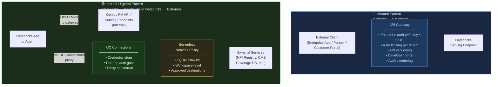
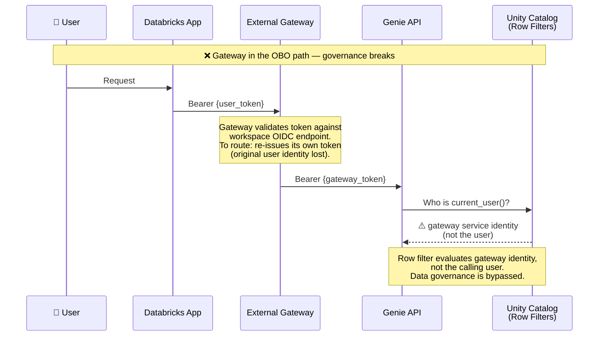
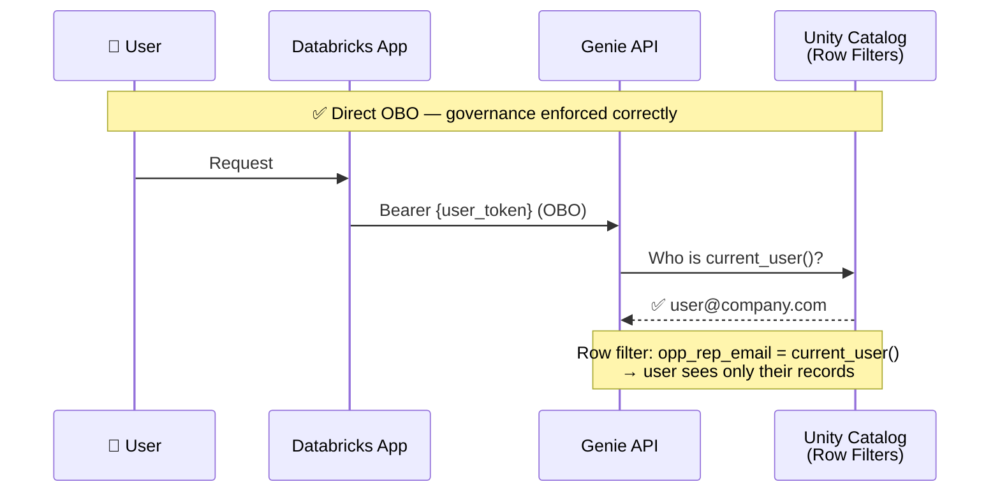
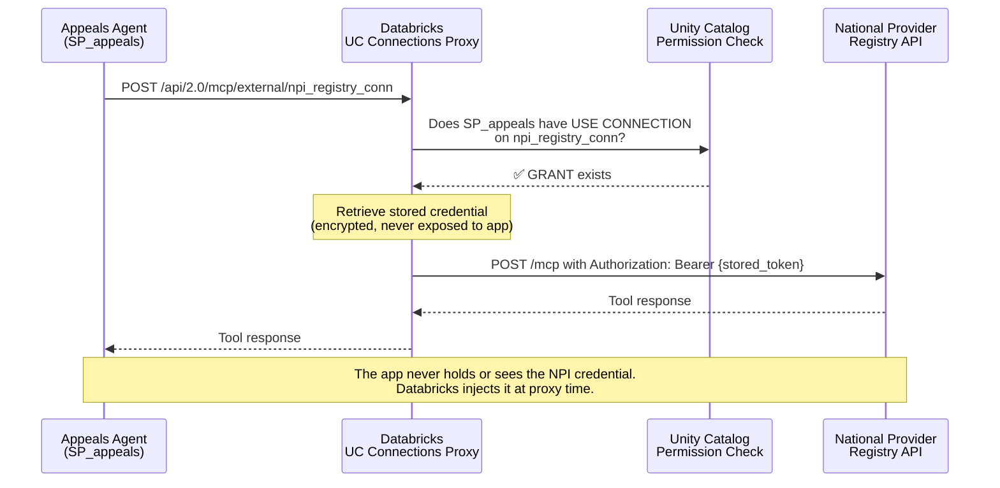
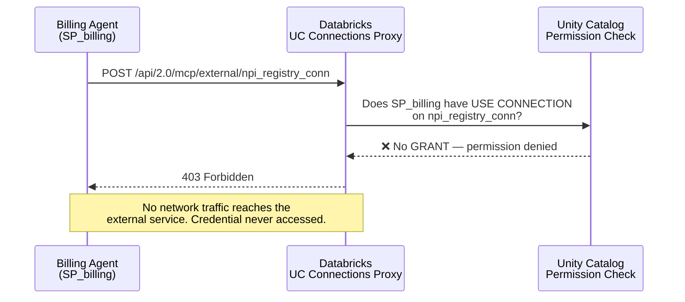
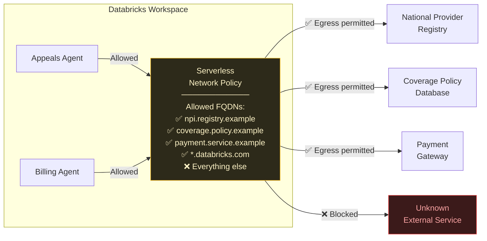
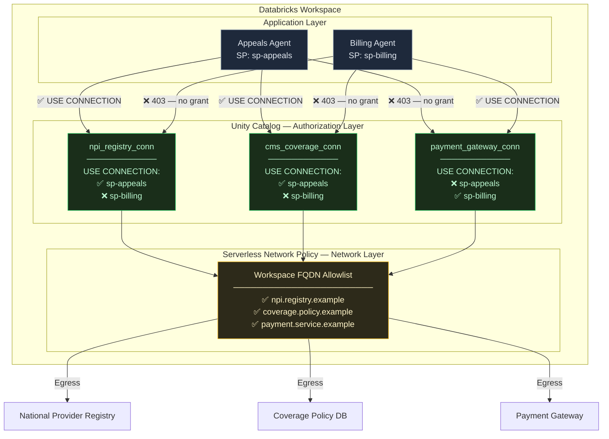
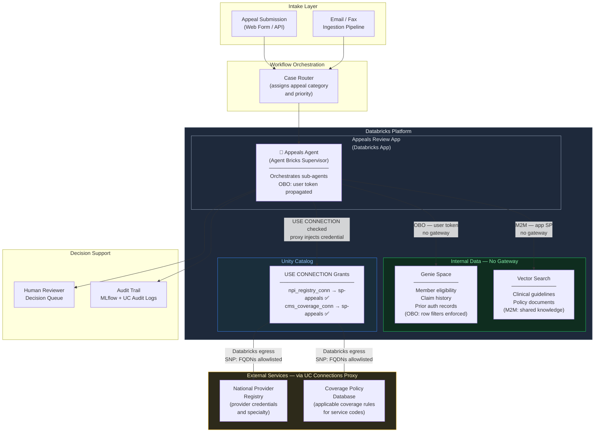
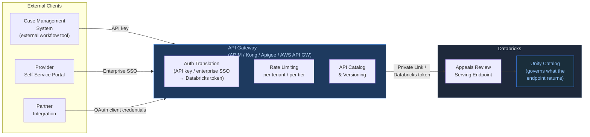
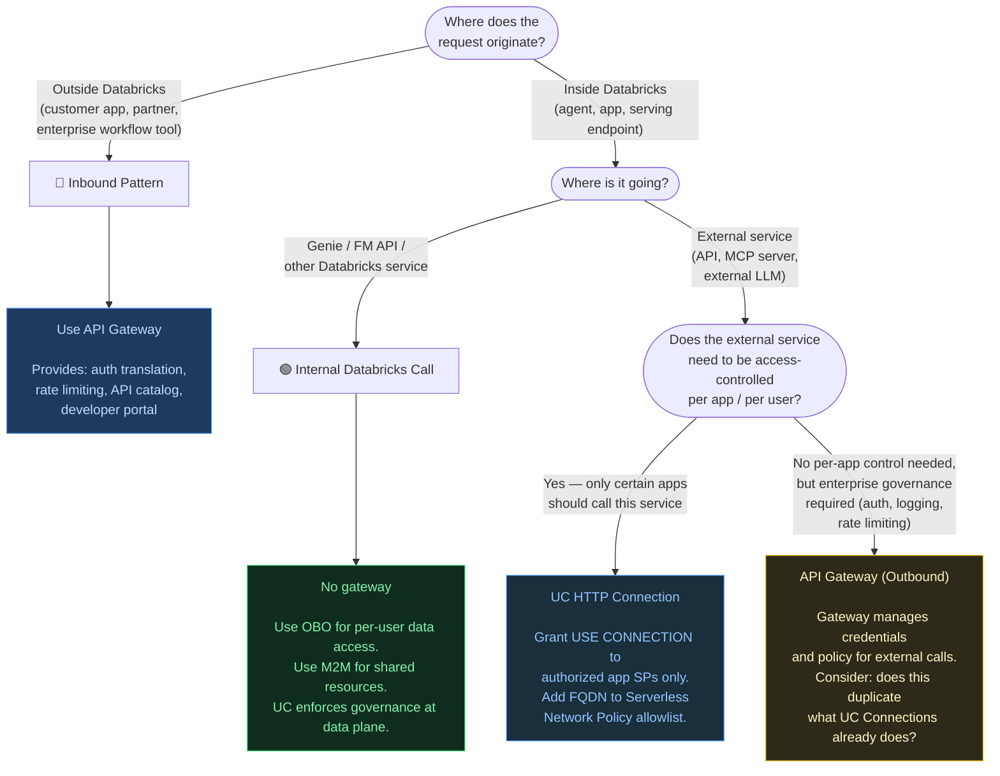

# AI Services Gateway Design
## Platform-Native Controls vs External API Gateways

> **Audience**: ML/AI Architects · Security Engineers
> **Cloud**: Agnostic — examples use Azure terminology where needed; patterns apply equally on AWS and GCP

---

## TL;DR

An external API gateway is the right answer for **inbound traffic**: requests that originate outside Databricks and need a managed facade with enterprise auth, rate limiting, and an API catalog. It is the wrong answer for **internal Databricks traffic**: calls between agents, Genie, Foundation Model APIs, custom MCP servers, and serving endpoints. That traffic is already governed by Unity Catalog at the data plane — adding a gateway in that path duplicates controls, breaks the token chain, and adds latency for zero security gain.

For **external services** (third-party APIs, external MCP servers, external LLMs), the right answer is **UC HTTP Connections + Serverless Network Policies** — not a gateway. UC Connections provide per-app credential authorization; Serverless Network Policies (SNP) define the approved destination universe at the workspace level. Together they satisfy the spirit of "each app should have controlled access to specific external services" without introducing gateway infrastructure into the data plane.

---

## The Two Traffic Categories

Every request in an AI system falls into one of two categories. Getting this classification right determines whether a gateway belongs in the architecture.



**The decisive question**: Where does governance live?

- For inbound traffic, governance lives at the gateway — the external caller has no Databricks identity and needs one assigned.
- For internal traffic, governance lives at the Unity Catalog data plane — row filters, column masks, `current_user()`, `is_member()`, and `USE CONNECTION` are enforced at query execution time, inside Databricks, regardless of what network path the request traveled.

---

## Why Internal Databricks Traffic Does Not Belong Behind a Gateway

This section addresses the most common architecture proposal we encounter: placing an API gateway in front of Genie, Foundation Model APIs, or Databricks serving endpoints for internal agent traffic. The argument is well-intentioned — centralized logging, rate limiting, a single egress point — but it conflicts with how Databricks governance actually works.

### The OBO Token Chain

The most impactful AI authorization pattern on Databricks is **OBO (On-Behalf-Of)**: the calling user's OAuth token flows end-to-end to downstream services, and Unity Catalog enforces that user's row filters and column masks at query time.





A gateway positioned between the app and Genie has two options, neither of which adds value:

1. **Pass the token through unchanged** — the gateway adds latency and a network hop but contributes no governance. UC enforces the same rules it would have without the gateway.
2. **Re-issue its own token** — the original user identity is lost. `current_user()` in row filters and column masks evaluates the gateway's service identity, not the user. Data governance silently breaks.

### Unity Catalog Enforces at the Data Plane

A gateway can observe HTTP traffic. It cannot observe what Unity Catalog does with that traffic: which rows are filtered out, which columns are masked, whether `is_member()` returned true or false for the execution context. UC enforcement happens at query execution time, inside the Databricks compute layer, and is not bypassable or observable from the network layer.

This means a gateway between an agent and Genie/FM API:
- Does not strengthen UC governance (UC enforces the same rules regardless)
- Does not weaken UC governance (you cannot bypass row filters by routing through a gateway)
- Adds operational surface area (gateway must understand Databricks OAuth token formats, workspace-specific OIDC endpoints, scope requirements)

### Databricks Apps Already Has a Managed Auth Layer

Every Databricks App has a platform-managed proxy that handles OAuth validation, session management, and identity injection before any request reaches application code. This proxy injects `X-Forwarded-Access-Token` (user's JWT), `X-Forwarded-Email` (verified user identity), and related headers. This is not infrastructure you configure — it is a platform guarantee.

An external gateway in front of a Databricks App creates a redundant, potentially conflicting auth layer. OAuth scope requirements (`unity-catalog`, `model-serving`, `genie`) are validated by the Databricks platform — a gateway cannot replicate this validation without deep integration with each workspace's OAuth server.

### The Verdict on Internal Traffic

| Concern | With Gateway | Without Gateway (UC-native) |
|---|---|---|
| Per-user data access control | ❌ Breaks OBO token chain unless pass-through | ✅ UC row filters enforce per-user access |
| Rate limiting agent calls | ✅ Can be done at gateway | ✅ Model Serving endpoint auto-scaling handles load |
| Audit logging | Partial — network layer only, no data visibility | ✅ UC audit logs + MLflow traces capture full lineage |
| Credential management | Gateway holds service credentials | ✅ App SP credentials managed by Databricks Apps platform |
| Latency | Adds external round-trip | ✅ Intra-workspace calls stay in Databricks fabric |
| Operational complexity | High — gateway must parse Databricks OAuth | Low — platform handles it |

---

## The External Services Problem

This is where the architecture question becomes real. Consider an AI agent that needs to:

- Query **internal data** — member records, claims history, clinical notes — via Genie
- Enrich with **external data** — a national provider registry, a public coverage policy database

The internal calls stay inside Databricks and need no gateway. The external calls must leave the Databricks network and need governance.

### Reference Scenario: Prior Authorization Appeals Agent

> *The following is a representative scenario using fictional company names. Technical components (NPI Registry, CMS coverage policies) are industry-standard public references.*

**RegionalCare Health Plan** processes thousands of prior authorization appeals per month. The current manual review process has a ~37% decision overturn rate — original denials get reversed on appeal because reviewers didn't have complete context at decision time (eligibility edge cases, provider credentials, coverage policy changes).

The proposed agent: an AI reviewer that, given an appeal submission, assembles the full context — internal claim history, member eligibility at the time of the original decision, provider credentials from the national registry, and the applicable coverage policy — and produces a structured decision recommendation for a human reviewer to approve.

**What the agent needs to access:**

| Data Source | Type | Location | Access Pattern |
|---|---|---|---|
| Member eligibility | Structured | Internal data warehouse | Genie (OBO — per-user row filters) |
| Claim history | Structured | Internal data warehouse | Genie (OBO) |
| Clinical guidelines | Unstructured | Knowledge base | Vector Search (M2M) |
| Provider credentials | External | National Provider Registry API | External MCP via UC Connection |
| Coverage policies | External | Coverage policy database API | External MCP via UC Connection |

The internal calls (Genie, Vector Search) require no gateway — UC governs them natively. The external calls require controlled, audited egress — this is where Serverless Network Policies and UC Connections work together.

---

## UC Connections: Credential and Authorization Layer

UC HTTP Connections solve two problems simultaneously: **credential management** (no secrets in application code) and **per-service authorization** (which app identity can authenticate to which external service).

### The Proxy Model

The mechanism that makes per-app authorization possible is the **proxy**: application code never calls external services directly. It calls a Databricks-managed proxy endpoint, which checks authorization and injects credentials before forwarding to the external service.





### USE CONNECTION as the Authorization Gate

```sql
-- Grant the appeals agent access to provider registry and coverage policy services
GRANT USE CONNECTION ON CONNECTION npi_registry_conn     TO `sp-appeals-agent`;
GRANT USE CONNECTION ON CONNECTION cms_coverage_conn     TO `sp-appeals-agent`;

-- Billing agent can only access billing-related external connections
GRANT USE CONNECTION ON CONNECTION payment_gateway_conn  TO `sp-billing-agent`;

-- Revoke access instantly — no code change, no redeploy
REVOKE USE CONNECTION ON CONNECTION npi_registry_conn FROM `sp-appeals-agent`;
```

Effects of a REVOKE take hold on the next request. No redeployment required. UC audit logs capture every GRANT, REVOKE, and USE CONNECTION check.

### What This Provides

| Capability | How it's delivered |
|---|---|
| Per-app service authorization | `USE CONNECTION` grants are per-principal — each app SP gets only the connections it needs |
| Credential isolation | Credentials stored encrypted in UC metastore; app code never receives raw credential values |
| Centralized rotation | Update the connection once; all apps using that connection get the new credential automatically |
| Instant revocation | REVOKE takes effect immediately; no app restarts or config changes |
| Audit trail | All USE CONNECTION checks generate audit events in `system.access.audit` |
| Zero-secret-in-code enforcement | The proxy pattern makes it architecturally impossible for the app to hold the credential |

---

## Serverless Network Policies: The Network Layer

Databricks Serverless Network Policies (SNP) control which external destinations serverless compute — Model Serving, Serverless SQL, Databricks Apps — can reach. They operate at the workspace level as an FQDN allowlist.



SNP answers: **"Which external destinations is this workspace permitted to reach at all?"**

It does not answer: "Which specific app within this workspace can reach which destination?" That is the question UC Connections answers.

---

## Defense-in-Depth: SNP + UC Connections

The security objection most frequently raised is: *"Your network controls are workspace-level. We need per-app egress controls. AppA should only be able to call the provider registry, AppB only the payment gateway."*

This is a legitimate requirement. The answer is that it is satisfied — at the correct architectural layer — by the combination of SNP and UC Connections. The key is distinguishing two different threat models:

| Threat | Defended by |
|---|---|
| App calls a completely unknown / unapproved external service | SNP — any destination not on the FQDN allowlist is unreachable at the network layer |
| App authenticates to an approved external service it shouldn't have access to | UC Connections — `USE CONNECTION` check blocks the call before credentials are injected |
| App exfiltrates credentials it received from UC Connections | Not possible — app code never receives raw credentials; proxy injects them server-side |
| App calls an approved destination directly (bypassing UC Connections) | Destination is reachable (SNP allows it) but the app has no credentials — authentication fails |



**The per-app service authorization guarantee:**

- `sp-appeals` can reach the National Provider Registry and Coverage Policy DB. It cannot reach the Payment Gateway — the UC proxy returns 403 before any network traffic is generated.
- `sp-billing` can reach the Payment Gateway. It cannot reach the provider registry — same enforcement.
- Neither SP can reach any service not on the SNP FQDN allowlist, regardless of what credentials they hold.
- Neither SP ever holds the actual credential value — credentials are injected by the Databricks proxy at call time.

**The governance assumption this relies on:**

Per-app service authorization via UC Connections holds as long as external service credentials are exclusively managed through UC Connections — not stored in application environment variables or workspace secrets. This is an architectural governance policy, the same class of policy as "do not hardcode secrets." It is enforced through:
- Code review and CI/CD secret scanning
- UC audit logs — any USE CONNECTION check (including denials) is recorded in `system.access.audit`
- The platform pattern itself: when developers use `DatabricksMCPClient` or the UC Connections SDK, credentials are never returned to application code

---

## Reference Architecture: Prior Authorization Appeals Agent



**Auth pattern per component:**

| Component | Auth | Identity in UC | Why |
|---|---|---|---|
| Genie (member data) | OBO | Calling user | Row filters enforce per-reviewer data access — a junior reviewer sees only assigned cases |
| Vector Search (clinical guidelines) | M2M | App SP | Shared knowledge base — same content for all reviewers |
| National Provider Registry | UC Connection (bearer) | App SP via proxy | External service; credential managed by UC; app never holds it |
| Coverage Policy DB | UC Connection (bearer) | App SP via proxy | Same pattern |

---

## When an External API Gateway Does Add Value

A gateway belongs in the architecture when the access pattern is **external clients calling Databricks** — the inbound pattern. The gateway provides what Databricks does not natively offer to external callers: a stable API surface, enterprise auth translation, rate limiting per external tenant, and a developer portal.



**When a gateway is the right choice:**

| Scenario | Why gateway adds value |
|---|---|
| External enterprise app calling a Databricks serving endpoint | External caller has no Databricks identity; gateway translates enterprise auth to Databricks token |
| "All our APIs sit behind the gateway" enterprise policy | Compliance requirement; gateway is the catalogued entry point for external consumers |
| Multi-workspace routing or A/B model versions | Gateway routes traffic across endpoints without external clients managing that complexity |
| Per-external-tenant rate limiting and metering | Usage quotas per customer, billing by API call — gateway is the right layer for this |
| Calling external LLMs not available on FMAPI | You need gateway-level cost tracking, model version pinning, and fallback across providers |

**When a gateway is not the right choice:**

| Scenario | Why it does not add value |
|---|---|
| Agent → Genie / FM API (internal) | OBO token chain breaks; UC governance already handles this |
| Agent → custom MCP server (Databricks App) | Apps proxy already handles auth; adding gateway creates redundant auth layers |
| Databricks App → Databricks serving endpoint | Same workspace; intra-fabric call; UC enforces access |
| Agent → external MCP server | UC Connections proxy handles credential management and per-app authorization |

---

## Decision Framework



---

## Summary

| Traffic type | Right approach | Do not route through external gateway |
|---|---|---|
| Agent → Genie / FM API / serving endpoint | OBO or M2M, no gateway | ✅ OBO token chain would break |
| Agent → Databricks App (custom MCP) | OBO via Databricks Apps proxy | ✅ Platform proxy already handles auth |
| Agent → approved external service (MCP, API) | UC HTTP Connection + SNP FQDN allowlist | ✅ UC Connections provide per-app credential authorization |
| External client → Databricks | **API Gateway** (inbound pattern) | — This is where gateways belong |

**The per-app egress control answer:**

Serverless Network Policies operate at the workspace level by design — they define the set of external destinations the workspace is permitted to reach. Per-app credential authorization is the responsibility of UC Connections: each app SP receives only the `USE CONNECTION` grants it needs, credentials are injected by the Databricks proxy at call time, and application code never holds raw credential values. The combination of SNP (network) + UC Connections (credential) + audit logging (`system.access.audit`) provides defense-in-depth that satisfies the governance intent behind per-app egress controls without gateway infrastructure in the data plane.

---

## References

- [Databricks Serverless Network Policies](https://docs.databricks.com/en/security/network/serverless-network-security/serverless-firewall.html)
- [Unity Catalog HTTP Connections — External MCP](https://docs.databricks.com/en/generative-ai/mcp/external-mcp.html)
- [Unity Catalog Privileges and Securable Objects](https://docs.databricks.com/en/data-governance/unity-catalog/manage-privileges/privileges.html)
- [MLflow Tracing — Agent Observability](https://mlflow.org/docs/latest/llms/tracing/index.html)
- [Databricks Foundation Model APIs](https://docs.databricks.com/en/machine-learning/foundation-models/index.html)
- [Genie Conversation API](https://docs.databricks.com/en/ai-bi/genie.html)
