# AI Gateway Patterns
## Databricks AI Gateway · External API Gateways · Platform-Native Controls

> **Audience**: ML/AI Architects · Security Engineers
> **Cloud**: Agnostic — examples use Azure terminology where needed; patterns apply equally on AWS and GCP

---

## TL;DR

Two complementary gateway options exist. Neither replaces the other, and neither is mandatory for every architecture.

| Option | What it governs | Owned by |
|---|---|---|
| **Databricks AI Gateway** | LLM endpoint traffic — rate limits, guardrails, usage tracking, fallback routing | Databricks platform, configured per serving endpoint |
| **External API Gateway** | The boundary between outside callers and Databricks — auth translation, API catalog, per-tenant rate limiting | Customer-managed (APIM, Kong, Apigee, AWS API GW, etc.) |

What neither option should govern: **internal Databricks traffic** between agents, Genie, custom MCP servers, and serving endpoints. That traffic is governed by Unity Catalog at the data plane. Inserting a gateway into that path breaks the OBO token chain and adds latency for no security gain.

For **outbound calls to external services** (third-party APIs, external MCP servers): the right approach is **UC HTTP Connections + Serverless Network Policies** — not a gateway. UC Connections provide per-app credential authorization; Serverless Network Policies (SNP) define the approved destination universe.

---

## The Four Traffic Patterns

```mermaid
flowchart TB
    subgraph P1["🟢 Pattern 1 — Internal\n(Agent ↔ Genie / FM API / Databricks Services)"]
        direction LR
        A1["Databricks App\nor Agent"]
        B1["Genie · FM API\nServing Endpoints\nDatabricks Apps"]
        C1["Unity Catalog\n(row filters, column masks,\ncurrent_user(), is_member())"]
        A1 -->|"OBO / M2M\nno gateway"| B1
        B1 --> C1
    end

    subgraph P2["🔵 Pattern 2 — LLM Endpoint Governance\n(Databricks AI Gateway)"]
        direction LR
        A2["Any Caller\n(internal or external)"]
        B2["Databricks AI Gateway\n────────────────\n• Rate limits per user / group\n• Guardrails (input / output)\n• Usage tracking\n• Fallback routing"]
        C2["LLM Serving\nEndpoint"]
        A2 --> B2 --> C2
    end

    subgraph P3["🟡 Pattern 3 — Outbound External\n(Agent → External Services)"]
        direction LR
        A3["Databricks App\nor Agent"]
        B3["UC Connections Proxy\n────────────────\n• Credential store\n• USE CONNECTION gate\n• Per-app authorization"]
        C3["External Services\n(MCP servers, APIs,\nexternal LLMs)"]
        D3["SNP FQDN Allowlist\n(workspace-level)"]
        A3 -->|"via proxy"| B3
        B3 --> D3 --> C3
    end

    subgraph P4["🔴 Pattern 4 — Inbound External\n(External Clients → Databricks)"]
        direction LR
        A4["External Clients\n(enterprise apps, partners,\ncustomer portals)"]
        B4["External API Gateway\n────────────────\n• Auth translation\n• Rate limiting per tenant\n• API versioning\n• Developer portal"]
        C4["Databricks\nServing Endpoint"]
        A4 --> B4 --> C4
    end

    style P1 fill:#0f2d1f,stroke:#22c55e,color:#e2e8f0
    style P2 fill:#1a2e3b,stroke:#3b82f6,color:#e2e8f0
    style P3 fill:#2d2a1a,stroke:#fbbf24,color:#e2e8f0
    style P4 fill:#2d1a1a,stroke:#ef4444,color:#e2e8f0
```

---

## Pattern 1 — Internal Traffic: No Gateway

### Why Internal Databricks Traffic Does Not Belong Behind a Gateway

The most impactful AI authorization pattern on Databricks is **OBO (On-Behalf-Of)**: the calling user's OAuth token flows end-to-end to downstream services, and Unity Catalog enforces that user's row filters and column masks at query time.

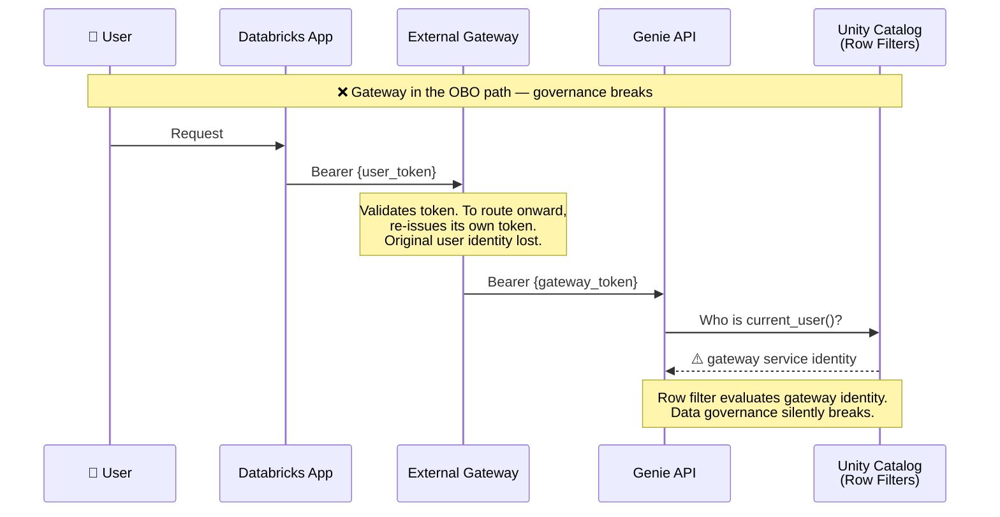

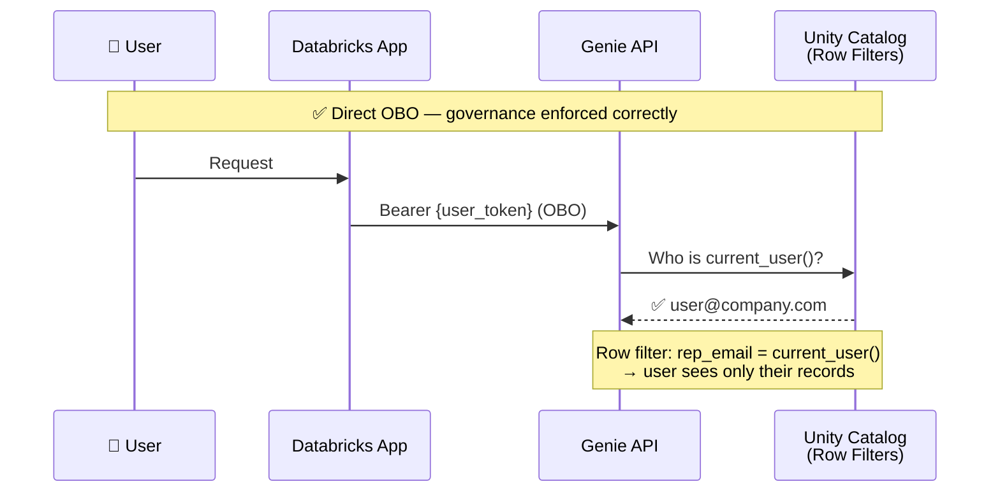

A gateway between the app and Genie/FM API has two options, neither of which adds value:

1. **Pass the token through unchanged** — adds latency and a network hop with zero governance contribution. UC enforces the same rules regardless.
2. **Re-issue its own token** — the original user identity is lost. `current_user()` in row filters evaluates the gateway's service identity. Data governance breaks silently.

**Key principle**: UC enforcement happens at query execution time, inside the Databricks compute layer. A gateway can observe HTTP traffic. It cannot observe which rows were filtered, which columns were masked, or what `is_member()` returned. The governance surface is not at the network — it is at the data plane.

| Concern | With external gateway | With UC-native controls |
|---|---|---|
| Per-user data access | Breaks OBO unless pure pass-through | UC row filters enforce per-user access |
| Audit logging | Network layer only — no data visibility | UC audit logs + MLflow traces capture full lineage |
| Rate limiting | Possible at gateway | Databricks AI Gateway (Pattern 2) handles this natively |
| Credential management | Gateway holds credentials | App SP credentials managed by Databricks Apps platform |
| Latency | Adds external round-trip | Intra-workspace calls stay in Databricks fabric |

---

## Pattern 2 — LLM Endpoint Governance: Databricks AI Gateway

Databricks AI Gateway is configured directly on serving endpoints. It governs LLM traffic at the point of consumption — before the model processes the request and after it responds — with full awareness of the Databricks identity model.

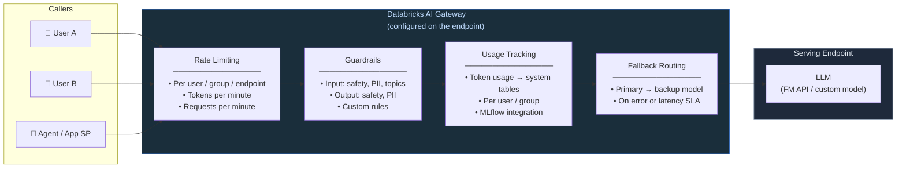

### What Databricks AI Gateway provides

| Capability | Detail |
|---|---|
| **Rate limiting** | Per user, per group, per endpoint — tokens/min and requests/min. Enforced using Databricks identity; works with OBO and M2M. |
| **Input guardrails** | Filter or flag requests containing unsafe content, PII, or off-topic queries before they reach the model. |
| **Output guardrails** | Filter or flag model responses containing unsafe content or PII before they are returned to the caller. |
| **Usage tracking** | Token consumption logged per identity to system tables. Enables cost attribution by team, app, or user group. |
| **Fallback routing** | Route to a backup model if the primary is unavailable or exceeds latency thresholds. Supports traffic splitting across model versions. |
| **UC-aware** | Rate limit policies reference Databricks users and groups — the same identity model as row filters and column masks. |

### When to use Databricks AI Gateway

- You need to rate-limit LLM consumption per team, user, or application without building custom throttling logic
- You need content guardrails (safety, PII filtering) applied uniformly at the endpoint level, not per-application
- You need cost attribution for LLM usage across multiple teams or projects
- You want automatic fallback to a secondary model if the primary is unavailable
- Your traffic stays within Databricks or arrives via the inbound gateway pattern (Pattern 4)

---

## Pattern 3 — Outbound External: UC Connections + Serverless Network Policies

When agents need to call external services (third-party APIs, external MCP servers, external LLMs not on Databricks FM API), the governance model is UC HTTP Connections for credential authorization and Serverless Network Policies for network-level allowlisting.

### The Proxy Model

Application code never calls external services directly. It calls a Databricks-managed proxy endpoint, which checks authorization and injects credentials before forwarding to the external service.

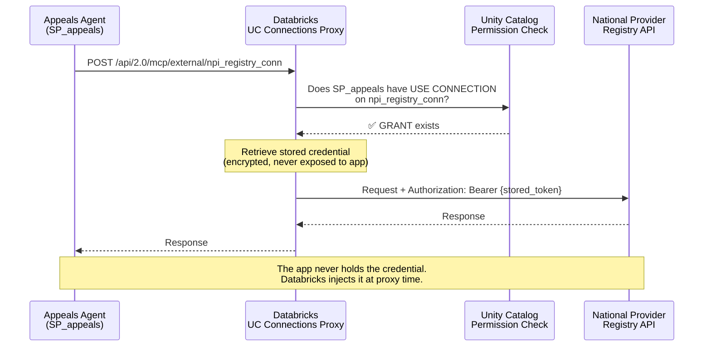

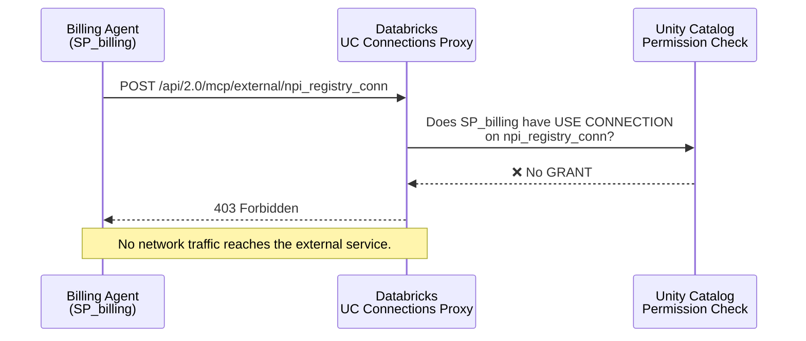

### Defense-in-Depth: SNP + UC Connections

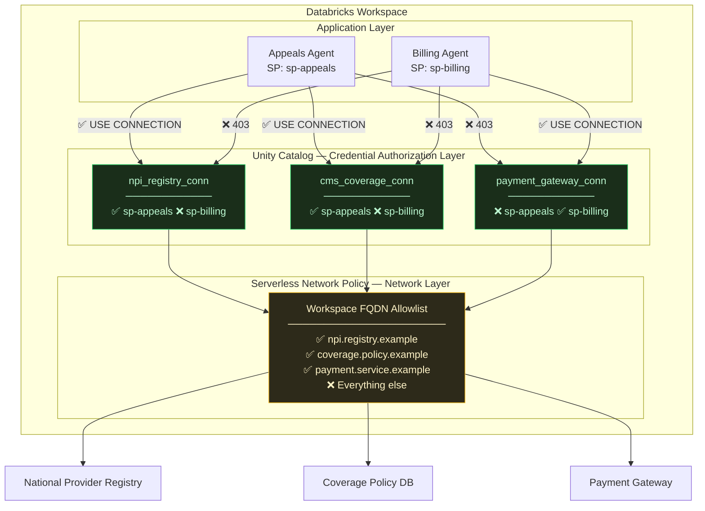

**Threat model addressed by each layer:**

| Threat | Defended by |
|---|---|
| App calls an unknown or unapproved external destination | SNP — FQDN not on allowlist is unreachable at network layer |
| App authenticates to an approved service it is not authorized for | UC Connections — `USE CONNECTION` check blocks before credentials are injected |
| App exfiltrates credentials stored in UC | Not possible — app code never receives raw credential values; proxy injects them server-side |
| App calls an approved destination directly without a UC Connection | Destination is reachable (SNP allows it) but app has no credentials — authentication at the external service fails |

**The governance assumption:** This model holds as long as external service credentials are exclusively managed through UC Connections — not in environment variables or secrets. This is a governance policy enforced through code review, CI/CD secret scanning, and the audit trail in `system.access.audit`.

---

## Pattern 4 — Inbound External: External API Gateway

An external API gateway belongs in the architecture when requests originate outside Databricks and need a managed facade. The gateway provides what Databricks does not natively offer to external callers: auth translation, rate limiting per external tenant, API versioning, and a developer portal.

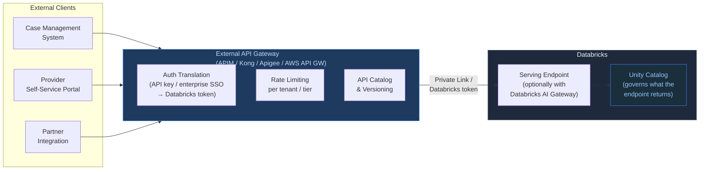

---

## Databricks AI Gateway vs External API Gateway

These two options address different problems and can be used together.

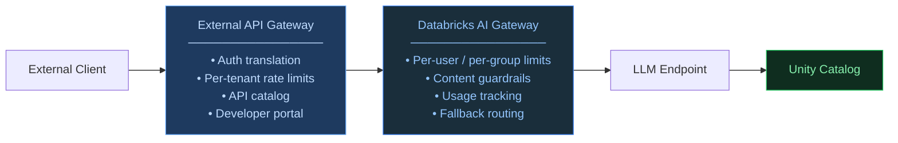

| Dimension | Databricks AI Gateway | External API Gateway |
|---|---|---|
| **Where it sits** | On the Databricks serving endpoint | In front of Databricks (customer-managed infrastructure) |
| **Identity awareness** | UC-aware — knows Databricks users and groups | Databricks-agnostic — manages external client identities |
| **Rate limiting** | Per Databricks user / group / endpoint | Per external tenant / subscription / API key |
| **Guardrails** | Input and output content filtering (safety, PII, topics) | Not provided natively; requires custom policy plugins |
| **Usage tracking** | Token-level usage → system tables and MLflow | Request-level metrics → gateway-specific analytics |
| **Fallback routing** | Across Databricks model versions and endpoints | Across arbitrary backend services or LLM providers |
| **Auth** | Validates Databricks OAuth tokens | Translates external identities to Databricks tokens |
| **Developer portal** | Not provided | Available — API catalog, subscription management |
| **Operational ownership** | Databricks platform | Customer infrastructure team |
| **Use when** | Governing LLM consumption within Databricks | Managing access from external enterprise clients |

**They are additive**: an external gateway handles the boundary crossing (external identity → Databricks token), Databricks AI Gateway handles LLM governance at the endpoint, and Unity Catalog handles data access — each at the layer it owns, without interfering with the others.

---

## Reference Scenario: Prior Authorization Appeals Agent

> *Representative scenario with fictional company names. Technical components (NPI Registry, CMS coverage policies) are industry-standard public references.*

**RegionalCare Health Plan** processes prior authorization appeals manually. The current overturn rate — original denials reversed on appeal — reflects reviewers not having complete context: eligibility edge cases, outdated provider records, coverage policy changes. The proposed agent assembles full context automatically and produces a structured recommendation for a human reviewer.

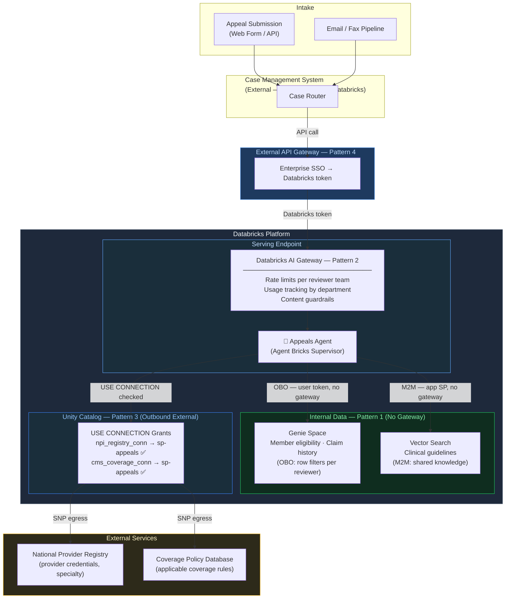

**All four patterns in one architecture:**

| Traffic | Pattern | Governance |
|---|---|---|
| Case management system → Appeals endpoint | 4 — External Gateway | Auth translation, rate limit per org |
| Endpoint LLM consumption | 2 — Databricks AI Gateway | Rate limit per reviewer team, usage tracking, guardrails |
| Agent → Genie (member data, OBO) | 1 — Internal, no gateway | UC row filters enforce per-reviewer data access |
| Agent → Vector Search (guidelines, M2M) | 1 — Internal, no gateway | Shared knowledge — same content for all reviewers |
| Agent → NPI Registry and Coverage DB | 3 — UC Connections + SNP | Per-app credential authorization via USE CONNECTION |

---

## Decision Framework

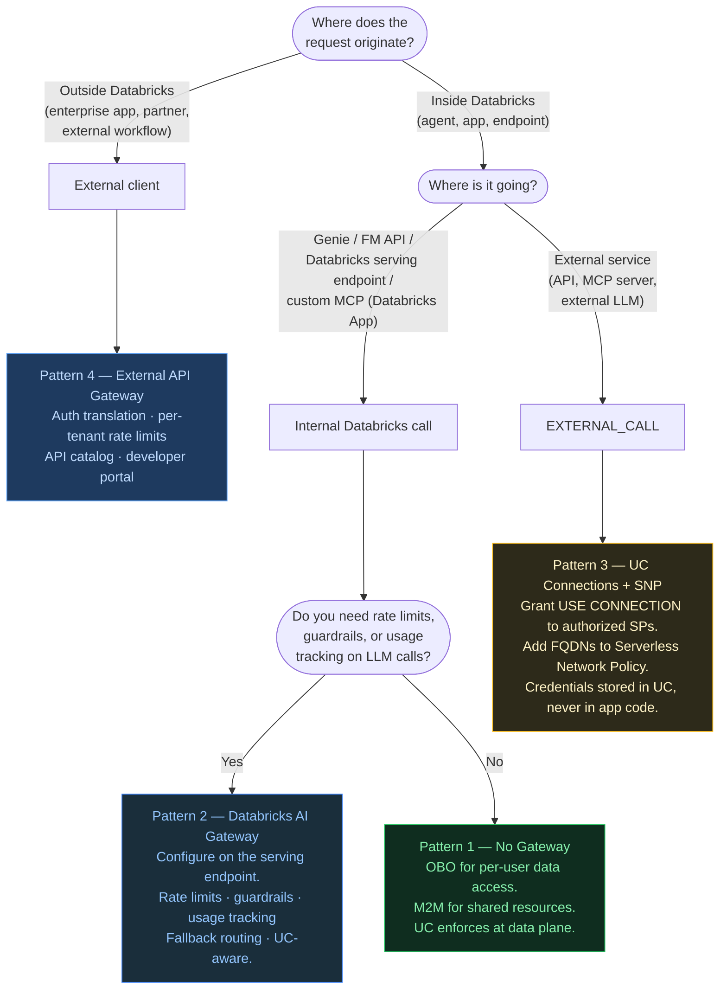

---

## Summary

| Traffic type | Pattern | Approach |
|---|---|---|
| External client → Databricks | 4 — Inbound | External API Gateway (auth translation, API catalog, per-tenant controls) |
| LLM endpoint consumption | 2 — LLM Governance | Databricks AI Gateway (rate limits, guardrails, usage tracking) |
| Agent → Genie / FM API / Databricks service | 1 — Internal | No gateway; OBO or M2M; UC governs at data plane |
| Agent → external service (API, MCP, LLM) | 3 — Outbound | UC HTTP Connections + Serverless Network Policy |

Patterns 2 and 4 are additive: an external gateway can sit in front of a Databricks endpoint that has AI Gateway configured. Each governs its own layer — external identity management, LLM consumption governance, data access — without interfering with the others.

---

## References

- [Databricks AI Gateway](https://docs.databricks.com/en/ai-gateway/index.html)
- [Databricks Serverless Network Policies](https://docs.databricks.com/en/security/network/serverless-network-security/serverless-firewall.html)
- [Unity Catalog HTTP Connections — External MCP](https://docs.databricks.com/en/generative-ai/mcp/external-mcp.html)
- [Unity Catalog Privileges and Securable Objects](https://docs.databricks.com/en/data-governance/unity-catalog/manage-privileges/privileges.html)
- [MLflow Tracing — Agent Observability](https://mlflow.org/docs/latest/llms/tracing/index.html)
- [Databricks Foundation Model APIs](https://docs.databricks.com/en/machine-learning/foundation-models/index.html)
- [Genie Conversation API](https://docs.databricks.com/en/ai-bi/genie.html)
