# Governed Orchestration Architecture

A comprehensive guide to building governed AI applications on Databricks, covering authentication flows, MCP integration, Model Serving, AI Gateway, and Unity Catalog authorization.

> **📺 Interactive Visualizations:** Explore these concepts with scrollytelling animations at [Interactive Orchestration Hub](interactive/orchestration/)

---

## Overview

This architecture defines governed applications that orchestrate across:

| Component | Role | Auth Context |
|-----------|------|--------------|
| **Model Serving** | Deploy agents, custom models, foundation models | 3 auth methods |
| **AI Gateway** | External LLM governance (rate limits, guardrails) | Centralized policies |
| **MCP Servers** | Tool registry (Genie, Vector Search, UC Functions, DBSQL) | OAuth scopes |
| **Lakebase** | Agent memory, OLTP state | OAuth or Native PG |
| **Unity Catalog** | Permissions, ABAC, row filters, column masks | All access governed |

### Architecture Diagram

```mermaid
flowchart TB
    subgraph Entry["🌐 Entry Points"]
        ExtApp["External App<br/>(Your Infrastructure)"]
        DBXApp["Databricks App<br/>(Streamlit, Dash, etc.)"]
        AgentEP["Agent Endpoint<br/>(Model Serving)"]
    end

    subgraph Auth["🔐 Authentication"]
        ExtApp -->|"Token Federation<br/>(IdP → Databricks)"| TokenEx["OAuth Token<br/>Exchange"]
        DBXApp -->|"Native OAuth<br/>(Automatic)"| NativeAuth["Databricks<br/>OAuth"]
        AgentEP -->|"3 Auth Methods"| AgentAuth["Agent Auth<br/>(Auto/OBO/Manual)"]
        TokenEx --> DBToken["Databricks Token"]
        NativeAuth --> DBToken
    end

    subgraph Compute["⚙️ Compute Layer"]
        DBToken --> Apps["Databricks Apps<br/>(Serverless)"]
        DBToken --> MS["Model Serving<br/>(Agents)"]
        AgentAuth --> MS
    end

    subgraph Resources["📦 Resources & Tools"]
        subgraph MCP["MCP Servers"]
            Genie["🔮 Genie"]
            VS["🔍 Vector Search"]
            UCFunc["⚙️ UC Functions"]
            DBSQL["📊 DBSQL"]
            ExtMCP["🔗 External MCP"]
        end
        
        subgraph Other["Other Services"]
            Gateway["🌉 AI Gateway"]
            LB["🗃️ Lakebase"]
        end
    end

    Apps --> MCP
    Apps --> Other
    MS --> MCP
    MS --> Other

    subgraph Gov["🛡️ Unity Catalog Governance"]
        UC["Permissions • ABAC • Row Filters • Column Masks • Lineage"]
    end

    MCP --> UC
    Other --> UC

    style Entry fill:#a855f7,color:#fff
    style Compute fill:#4ade80,color:#1a1a2e
    style Resources fill:#3b82f6,color:#fff
    style Gov fill:#64748b,color:#fff
    style Gateway fill:#f97316,color:#fff
    style LB fill:#fbbf24,color:#1a1a2e
```



---

## Three Authentication Scenarios

### Scenario A: External App → Databricks

Your application runs **outside** Databricks and needs to call Databricks APIs.

**Solution: OAuth Token Federation**
- Exchange IdP tokens (Okta, Entra) for Databricks OAuth tokens
- Server-side token handling (never expose on client)
- Two federation types:
  - **Account-wide** — Maps IdP users to Databricks users
  - **Workload Identity** — Maps to Databricks Service Principals


**Azure Alternative: Native OAuth with Entra**
- Call Azure Databricks APIs directly with Entra-issued tokens
- No token exchange step required

📚 [OAuth Federation Docs](https://docs.databricks.com/aws/en/dev-tools/auth/oauth-federation) | 📺 [Interactive: External App Auth](interactive/orchestration/external-app-auth.html)

---

### Scenario B: Agent → Resources (Model Serving)

Your agent runs **on** Databricks (Model Serving) and needs to access resources.

**Three Official Authentication Methods:**

| Method | Identity Used | Best For |
|--------|---------------|----------|
| **Automatic Passthrough** | Service Principal | Tools not requiring user context |
| **On-Behalf-Of-User (OBO)** | End User | User-specific data access, UC ACLs |
| **Manual Authentication** | Stored Credentials | External services (non-Databricks) |

```mermaid
flowchart LR
    Agent["🤖 Agent<br/>(Model Serving)"]
    
    Agent --> Q1{Resource<br/>Type?}
    
    Q1 -->|"Databricks<br/>Resource"| Q2{Need User<br/>Context?}
    Q1 -->|"External<br/>Service"| Manual["🔑 Manual Auth<br/>(Secrets)"]
    
    Q2 -->|"No"| Auto["⚡ Automatic<br/>Passthrough"]
    Q2 -->|"Yes"| OBO["👤 OBO<br/>(User Identity)"]
    
    Auto --> SP["Uses: Service Principal"]
    OBO --> User["Uses: End User Identity"]
    Manual --> Creds["Uses: Stored Credentials"]
    
    SP --> UC["Unity Catalog<br/>Governance"]
    User --> UC
    
    style Auto fill:#4ade80,color:#1a1a2e
    style OBO fill:#22d3ee,color:#1a1a2e
    style Manual fill:#f97316,color:#fff
```



**Key Points:**
- Declare dependencies at `mlflow.log_model()` time
- Databricks validates permissions at deployment
- Only request OAuth scopes your agent needs

📚 [Agent Authentication Docs](https://docs.databricks.com/aws/en/generative-ai/agent-framework/agent-authentication) | 📺 [Interactive: Agent Auth Methods](interactive/orchestration/agent-auth-methods.html)

---

### Scenario C: Databricks App → Resources

Your **web application** runs on the Databricks Apps platform (Streamlit, Dash, Gradio, React, etc.) and needs to access Databricks resources.

**Solution: Native OAuth (Automatic)**
- Apps run on serverless compute with built-in OAuth
- Automatic integration with Unity Catalog
- Access to Databricks SQL, Model Serving, and other APIs
- No manual token handling required

| Framework | Type | Use Cases |
|-----------|------|-----------|
| **Streamlit** | Python | Dashboards, data apps |
| **Dash** | Python | Interactive visualizations |
| **Gradio** | Python | ML/AI demos, chat interfaces |
| **React/Angular/Svelte** | Node.js | Custom web apps |

**Key Benefits:**
- No separate infrastructure needed
- Built-in security and governance
- Direct access to workspace resources
- OAuth handled automatically by the platform

📚 [Databricks Apps Docs](https://docs.databricks.com/aws/en/dev-tools/databricks-apps)

---

## Model Serving: What Can Be Deployed

| Model Type | Description | Auth Methods |
|------------|-------------|--------------|
| **Custom Models/Agents** | Your code via MLflow | All 3 methods |
| **Foundation Models (PT)** | Provisioned throughput | Automatic, OBO |
| **Foundation Models (Pay-per-token)** | On-demand | Automatic, OBO |
| **External Models** | Via AI Gateway | Manual (API keys) |

**Querying Deployed Agents:**
Deployed agents are accessible as Model Serving endpoints with multiple query methods:

| Method | Best For |
|--------|----------|
| **Databricks OpenAI Client** | New applications (recommended) |
| **MLflow Deployments Client** | Existing MLflow workflows |
| **REST API** | Language-agnostic, OpenAI-compatible |
| **AI Functions (ai_query)** | Query from SQL |

📚 [Query Agents Docs](https://docs.databricks.com/aws/en/generative-ai/agent-framework/query-agent) | 📚 [Model Serving Docs](https://docs.databricks.com/aws/en/machine-learning/model-serving/)

---

## MCP Integration Patterns

### Three MCP Server Types

| Type | URL Pattern | Hosted By |
|------|-------------|-----------|
| **Managed** | `{workspace}/api/2.0/mcp/{type}/{params}` | Databricks |
| **External** | Via UC HTTP Connection | Third-party |
| **Custom** | `{workspace}/apps/{app-name}/mcp` | Databricks Apps |

### Managed MCP Servers

| Server | URL Pattern | OAuth Scope |
|--------|-------------|-------------|
| **Genie** | `/api/2.0/mcp/genie/{space_id}` | `dashboards.genie` |
| **Vector Search** | `/api/2.0/mcp/vector-search/{catalog}/{schema}` | `vectorsearch.*` |
| **UC Functions** | `/api/2.0/mcp/functions/{catalog}/{schema}` | `unity-catalog` |
| **DBSQL** | `/api/2.0/mcp/sql` | `sql.*` |

### External MCP via UC HTTP Connections
- UC connections proxy to external MCP servers
- Tools exposed under UC governance
- Reference: `uc://connections/{connection_name}`

📚 [MCP External Services Docs](https://docs.databricks.com/aws/en/generative-ai/mcp/connect-external-services) | 📺 [Interactive: MCP Integration](interactive/orchestration/mcp-integration.html)

---

## AI Gateway Governance

Centralized governance for all AI model serving endpoints.

### Features

| Feature | Description | Paid |
|---------|-------------|------|
| **Rate Limiting** | QPM/TPM at endpoint, user, group levels | Free |
| **AI Guardrails** | Safety filtering, PII detection (block/mask) | Free |
| **Payload Logging** | Inference tables in Unity Catalog | Paid |
| **Usage Tracking** | System tables for monitoring/cost | Paid |
| **Fallbacks** | Auto failover on 429/5XX errors | Free |
| **Traffic Splitting** | Load balance across models | Free |

### Supported Providers (External Models)
OpenAI, Anthropic, Cohere, Amazon Bedrock, Google Vertex AI, Azure OpenAI, Custom (OpenAI-compatible)

### Best Practice
Route **all** external LLM traffic through AI Gateway to unify governance, tracking, and cost management.

📚 [AI Gateway Docs](https://docs.databricks.com/aws/en/ai-gateway/) | 📺 [Interactive: AI Gateway Governance](interactive/orchestration/ai-gateway-governance.html)

---

## Lakebase: Managed Postgres for AI Applications

Fully-managed Postgres OLTP database with Unity Catalog integration for unified governance.

### Unity Catalog Integration
Register Lakebase databases in Unity Catalog to enable:
- **Unified governance** — Apply UC permissions, lineage tracking, and audit logs
- **Cross-source queries** — Join Lakebase and lakehouse data in single SQL queries
- **Centralized discovery** — Browse databases in Catalog Explorer

### Use Cases

| Use Case | Description |
|----------|-------------|
| **Agent Memory** | Short-term (session context, checkpointing) and long-term (cross-session insights) memory |
| **Online Feature Store** | Low-latency feature serving for real-time ML models and recommendations |
| **OLTP State** | Fast transactional data access for apps and agents |

### Authentication Options

| Method | Details |
|--------|---------|
| **OAuth (U2M/M2M)** | 1-hour tokens as DB password; User, Group, or SP; Requires SSL |
| **Native Postgres** | For apps that can't rotate tokens hourly; Standard CREATE ROLE |

📚 [Register in UC](https://docs.databricks.com/aws/en/oltp/projects/register-uc) | 📚 [Agent Memory](https://docs.databricks.com/aws/en/generative-ai/agent-framework/stateful-agents) | 📚 [Online Feature Store](https://docs.databricks.com/aws/en/machine-learning/feature-store/online-feature-store) | 📚 [Auth Docs](https://docs.databricks.com/aws/en/oltp/instances/authentication)

---

## Dependency Declaration

Declare MCP servers and resources at `mlflow.log_model()` time:

```python
resources = [
    DatabricksGenieSpace(genie_space_id="<GENIE_SPACE_ID>"),
    DatabricksVectorSearchIndex(index_name="<CATALOG.SCHEMA.INDEX>"),
    DatabricksFunction(function_name="<CATALOG.SCHEMA.FUNCTION>"),
    DatabricksSQLWarehouse(warehouse_id="<WAREHOUSE_ID>"),
    DatabricksUCConnection(connection_name="<UC_HTTP_CONNECTION>"),
]

mlflow.log_model(
    agent,
    resources=resources,
    # ... other params
)
```

### OAuth Scopes Reference

```json
{
  "oauth_scopes": [
    "dashboards.genie",
    "vectorsearch.vector-search-endpoints",
    "vectorsearch.vector-search-indexes",
    "unity-catalog",
    "sql.warehouses",
    "sql.statement-execution",
    "serving.serving-endpoints"
  ]
}
```

**Principle:** Only request scopes your agent actually needs.

---

## Implementation Checklist

- [ ] **Model Serving** — Deploy agents with declared dependencies and auth methods
- [ ] **MCP Servers** — Register Managed MCP (Genie, VS, Functions, DBSQL) and External MCP via UC HTTP connections
- [ ] **AI Gateway** — Configure routes, rate limits, guardrails, and enable inference tables
- [ ] **Unity Catalog** — Set permissions (grants, row filters, column masks, ABAC policies)
- [ ] **Lakebase** — Configure for agent memory if needed; choose OAuth or native auth
- [ ] **Token Federation** — Set up federation policies for external apps (if applicable)
- [ ] **Testing** — Validate auth flows, permissions, and end-to-end orchestration

---

## Quick Reference: Code Snippets

### Query Deployed Agent (Databricks OpenAI Client)

```python
from databricks.sdk import WorkspaceClient

w = WorkspaceClient()
client = w.serving_endpoints.get_open_ai_client()

response = client.responses.create(
    model="my-agent-endpoint",
    input=[{"role": "user", "content": "What is the revenue trend?"}],
    stream=True,
    extra_body={
        "custom_inputs": {"thread_id": "abc123"},
        "databricks_options": {"return_trace": True}
    }
)
```

### OAuth Token Exchange (External App)

```bash
curl --request POST https://<workspace>/oidc/v1/token \
  --data "subject_token=<IDP_JWT_TOKEN>" \
  --data "subject_token_type=urn:ietf:params:oauth:token-type:jwt" \
  --data "grant_type=urn:ietf:params:oauth:grant-type:token-exchange" \
  --data "scope=all-apis"
```

### Lakebase Connection (OAuth)

```python
from databricks.sdk import WorkspaceClient
import uuid

w = WorkspaceClient()
cred = w.database.generate_database_credential(
    request_id=str(uuid.uuid4()),
    instance_names=["my-lakebase-instance"]
)

# Use cred.token as password in psycopg2/SQLAlchemy connection
```

---

## Documentation Links

### Core Concepts
- [Agent Authentication](https://docs.databricks.com/aws/en/generative-ai/agent-framework/agent-authentication)
- [Model Serving](https://docs.databricks.com/aws/en/machine-learning/model-serving/)
- [AI Gateway](https://docs.databricks.com/aws/en/ai-gateway/)
- [MCP External Services](https://docs.databricks.com/aws/en/generative-ai/mcp/connect-external-services)
- [Unity Catalog Access Control](https://docs.databricks.com/aws/en/data-governance/unity-catalog/access-control)

### Authentication & Federation
- [OAuth Federation](https://docs.databricks.com/aws/en/dev-tools/auth/oauth-federation)
- [Token Exchange](https://docs.databricks.com/aws/en/dev-tools/auth/oauth-federation-exchange)
- [Federation Policy](https://docs.databricks.com/aws/en/dev-tools/auth/oauth-federation-policy)

### Agent Development
- [Agent Memory (Lakebase)](https://docs.databricks.com/aws/en/generative-ai/agent-framework/stateful-agents)
- [Query Deployed Agents](https://docs.databricks.com/aws/en/generative-ai/agent-framework/query-agent)
- [Lakebase Authentication](https://docs.databricks.com/aws/en/oltp/instances/authentication)

---

## Interactive Visualizations

Explore these concepts with animated scrollytelling:

| Topic | Link |
|-------|------|
| **Orchestration Hub** | [interactive/orchestration/](interactive/orchestration/) |
| **Agent Auth Methods** | [interactive/orchestration/agent-auth-methods.html](interactive/orchestration/agent-auth-methods.html) |
| **External App Auth** | [interactive/orchestration/external-app-auth.html](interactive/orchestration/external-app-auth.html) |
| **MCP Integration** | [interactive/orchestration/mcp-integration.html](interactive/orchestration/mcp-integration.html) |
| **AI Gateway Governance** | [interactive/orchestration/ai-gateway-governance.html](interactive/orchestration/ai-gateway-governance.html) |
