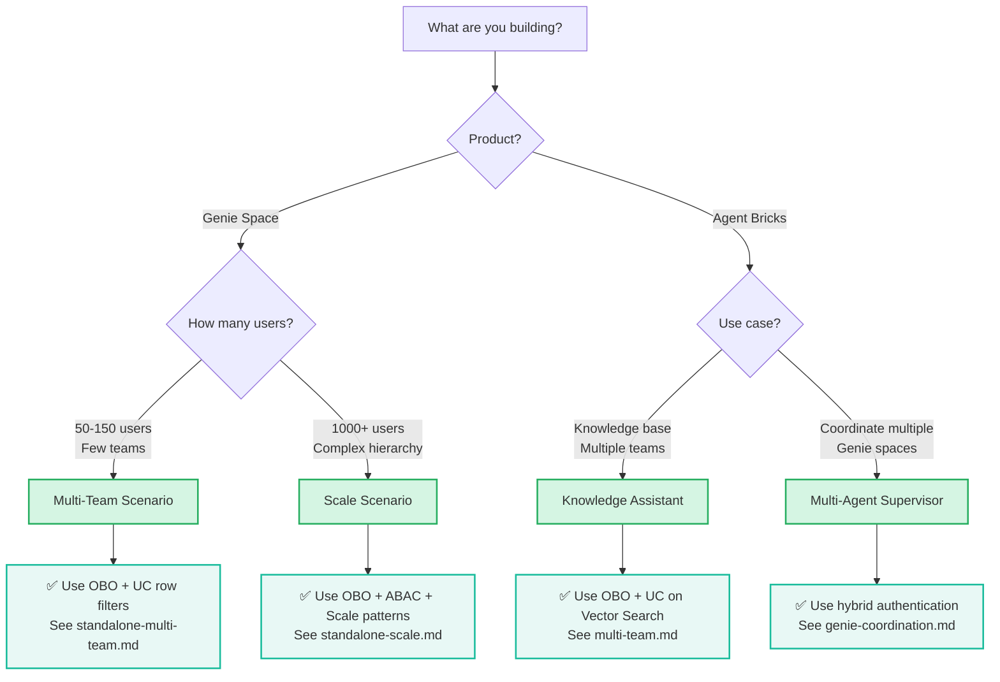

# AI Governance: Authentication & Authorization Guide

> **Production-ready authentication and authorization patterns for Databricks AI products**
>
> Unified guide covering **Genie Space**, **Agent Bricks**, **Databricks Apps**, and their combinations

---

## 🎯 What This Guide Covers

This guide provides no-nonsense, production-grade patterns for securing Databricks AI workloads:

- ✅ **Three universal authentication patterns** that work across all products
- ✅ **Unity Catalog integration** for fine-grained authorization
- ✅ **Real-world scenarios** mapped to [official Agent Bricks use cases](https://docs.databricks.com/aws/en/generative-ai/agent-bricks/)
- ✅ **Cloud-agnostic** approach (AWS, Azure, GCP)
- ✅ **Scale-tested** patterns for 1000+ users
- ✅ **Compliance considerations** (patterns support audit requirements for HIPAA, SOC2, GDPR)

---

## 🚀 Quick Start

**New to Databricks AI authentication?** Start here:

1. **[Authentication Patterns](01-AUTHENTICATION-PATTERNS.md)** - Learn the three core patterns
2. **[Authorization with Unity Catalog](02-AUTHORIZATION-WITH-UC.md)** - Understand UC governance
3. **[Genie Space Deep Dive](03-GENIE-SPACE-DEEP-DIVE.md)** - AI/BI Genie Space authentication & UC integration
4. **Pick your scenario below** based on your use case

### 📖 What You'll Learn

Each scenario includes:
- ✅ Architecture diagrams and authentication flows
- ✅ Unity Catalog policy patterns (row filters, column masks, ABAC)
- ✅ Production-ready SQL examples
- ✅ Step-by-step setup instructions
- ✅ Testing and verification steps

---

## 📋 Scenarios by Product

### 🔮 Genie Space

AI/BI chatbot that turns tables into expert conversations ([docs](https://docs.databricks.com/aws/en/genie/))

| Scenario | Description | Users | Status |
|----------|-------------|-------|--------|
| [Multi-Team Access](scenarios/05-GENIE-SPACE/standalone-multi-team.md) | Multiple teams share Genie, each sees only their data | 50-150 | ✅ Complete |
| [Large Scale + UC](scenarios/05-GENIE-SPACE/standalone-scale.md) | 1000+ users with complex hierarchical access | 1000+ | ✅ Complete |

> **Note**: Additional Genie scenarios (embedded in apps, agent integration) are covered in detail in [03-GENIE-SPACE-DEEP-DIVE.md](03-GENIE-SPACE-DEEP-DIVE.md).

### 📊 Audit Logging & Monitoring

Comprehensive monitoring and analytics for Genie spaces using system tables ([guide](audit-logging/README.md))

| Component | Description | Status |
|-----------|-------------|--------|
| [System Tables Analytics](audit-logging/monitoring/README-GENIE-AUDIT-QUICKSTART.md) | 15-min quick start for system tables-based monitoring | ✅ Complete |
| [Architecture Design](audit-logging/monitoring/GENIE-AUDIT-LOG-DESIGN.md) | Complete architecture and streaming design | ✅ Complete |
| [SQL Implementation](audit-logging/monitoring/genie-audit-implementation.sql) | Production-ready SQL queries (650+ lines) | ✅ Complete |
| [Python Utilities](audit-logging/monitoring/genie-audit-python-implementation.py) | Enrichment and alerting framework | ✅ Complete |

**Features:**
- ✅ Conversation activity tracking (daily trends, user engagement)
- ✅ User activity monitoring with email mapping
- ✅ Query insights (generated SQL parsing, performance metrics)
- ✅ Real-time alerting (failures, inactive spaces, slow queries)
- ✅ Delta streaming architecture for near-real-time monitoring

### 🤖 Agent Bricks Use Cases

Agent Bricks offers pre-configured templates for production-grade AI agents ([docs](https://docs.databricks.com/aws/en/generative-ai/agent-bricks/)):

| Use Case | Description | Status | Docs |
|----------|-------------|--------|------|
| **Knowledge Assistant** | Turn documents into a chatbot that cites sources | GA | [Docs](https://docs.databricks.com/aws/en/generative-ai/agent-bricks/knowledge-assistant) |
| **Information Extraction** | Transform unstructured text into structured insights | Beta | [Docs](https://docs.databricks.com/aws/en/generative-ai/agent-bricks/key-info-extraction) |
| **Custom LLM** | Summarization, text transformation tasks | Beta | [Docs](https://docs.databricks.com/aws/en/generative-ai/agent-bricks/custom-llm) |
| **Multi-Agent Supervisor** | Multi-agent systems with Genie + agents | Beta | [Docs](https://docs.databricks.com/aws/en/generative-ai/agent-bricks/multi-agent-supervisor) |
| **AI/BI Genie** | Turn tables into an expert AI chatbot | GA | [Docs](https://docs.databricks.com/aws/en/genie/) |
| **Code Your Own** | Build with OSS libraries and Agent Framework | GA | [Docs](https://docs.databricks.com/aws/en/generative-ai/agent-framework/author-agent) |

### 📋 Agent Bricks Scenarios

| Scenario | Description | Users | Status |
|----------|-------------|-------|--------|
| [Knowledge Assistant: Multi-Team](scenarios/01-KNOWLEDGE-ASSISTANT/multi-team.md) | Engineering teams with team-specific documentation | 100-500 | ✅ Complete |
| [Multi-Agent Supervisor: Genie Coordination](scenarios/04-MULTI-AGENT-SUPERVISOR/genie-coordination.md) | Supervisor routing to specialized Genies | Variable | ✅ Complete |

---

## 📚 Reference Materials

- **[Authentication Flows](reference/authentication-flows.md)** - Visual Mermaid diagrams of auth patterns
- **[Authorization Flows](reference/authorization-flows.md)** - Visual diagrams of UC four-layer access control
- **[Interactive Visualizations](https://bhavink.github.io/databricks/ai-governance/interactive/)** - Scrollytelling explainers for core concepts

### Interactive Visualizations

| Page | Concept | Description |
|------|---------|-------------|
| [Access Control Layers](https://bhavink.github.io/databricks/ai-governance/interactive/uc-access-control-layers.html) | UC Authorization | Four layers: workspace, privileges, ABAC, filtering |
| [ABAC + Governed Tags](https://bhavink.github.io/databricks/ai-governance/interactive/uc-abac-governed-tags.html) | ABAC | Tag-based dynamic access control |
| [Row Filters](https://bhavink.github.io/databricks/ai-governance/interactive/uc-row-filters.html) | Row-Level Security | Filter rows by `current_user()` |
| [Column Masks](https://bhavink.github.io/databricks/ai-governance/interactive/uc-column-masks.html) | Column-Level Security | Mask values by `is_member()` |
| [OBO Auth Flow](https://bhavink.github.io/databricks/ai-governance/interactive/auth-flow-obo.html) | Pattern 2 | On-Behalf-Of-User authentication |
| [Service Principal Auth](https://bhavink.github.io/databricks/ai-governance/interactive/auth-flow-service-principal.html) | Pattern 1 | Automatic passthrough |
| [Decision Guide](https://bhavink.github.io/databricks/ai-governance/interactive/decision-guide.html) | Quick Start | Choose the right pattern |

---

## 🎓 Learning Path

**Recommended order for learning:**

### Beginners
1. Read [Authentication Patterns](01-AUTHENTICATION-PATTERNS.md)
2. Read [Authorization with UC](02-AUTHORIZATION-WITH-UC.md)
3. Try [Genie Space Multi-Team](scenarios/05-GENIE-SPACE/standalone-multi-team.md)

### Intermediate
1. Review foundation docs
2. Study [Genie Space Deep Dive](03-GENIE-SPACE-DEEP-DIVE.md)
3. Implement [Knowledge Assistant Multi-Team](scenarios/01-KNOWLEDGE-ASSISTANT/multi-team.md)

### Advanced
1. Master foundation and intermediate content
2. Tackle [Genie Space at Scale](scenarios/05-GENIE-SPACE/standalone-scale.md)
3. Deploy [Multi-Agent Supervisor](scenarios/04-MULTI-AGENT-SUPERVISOR/genie-coordination.md)

---

## 🗺️ Quick Decision Guide

**Choose your path based on your needs:**

---

## 💡 Common Questions

**Q: Which authentication pattern should I use?**  
A: See [Authentication Patterns](01-AUTHENTICATION-PATTERNS.md#decision-tree) decision tree.

**Q: How do I enforce per-user data access?**  
A: Use On-Behalf-Of-User (OBO) pattern + Unity Catalog row filters. See [Authorization with UC](02-AUTHORIZATION-WITH-UC.md).

**Q: Can I combine multiple patterns?**  
A: Yes! See [Genie Space Deep Dive](03-GENIE-SPACE-DEEP-DIVE.md#hybrid-authentication-scenarios) for hybrid approaches.

**Q: How do I handle 1000+ users?**  
A: See [Genie Space at Scale](scenarios/05-GENIE-SPACE/standalone-scale.md).

**Q: What about external data sources?**  
A: Use Manual Credentials pattern. See [Authentication Patterns](01-AUTHENTICATION-PATTERNS.md#pattern-3-manual-credentials).

**Q: How do I audit access?**  
A: Use Unity Catalog audit logs via `system.access.audit` table. See [Authorization with UC](02-AUTHORIZATION-WITH-UC.md#audit-logging) and [Audit Logging & Monitoring](audit-logging/README.md) for comprehensive monitoring solutions.

**Q: How do I monitor Genie conversations and query performance?**  
A: Use the system tables-based monitoring solution in [Audit Logging & Monitoring](audit-logging/README.md). Provides conversation tracking, user analytics, query insights, and real-time alerting.

---

## 🤝 Contributing

Found an issue or have a scenario to add? Contributions welcome:

1. Check existing scenarios for similar patterns
2. Follow the [Documentation Style Guide](../../DOCUMENTATION-STYLE-GUIDE.md)
3. Include real-world examples and code samples
4. Test your configurations before submitting

---

## 🔗 Related Resources

**Databricks Official Documentation:**
- [Agent Bricks Overview](https://docs.databricks.com/aws/en/generative-ai/agent-bricks/)
- [Agent Framework Authentication](https://docs.databricks.com/aws/en/generative-ai/agent-framework/agent-authentication)
- [Unity Catalog](https://docs.databricks.com/en/data-governance/unity-catalog/index.html)
- [Access Control in Unity Catalog](https://docs.databricks.com/aws/en/data-governance/unity-catalog/access-control) — Four layers
- [ABAC (Attribute-Based Access Control)](https://docs.databricks.com/aws/en/data-governance/unity-catalog/abac)
- [Governed Tags](https://docs.databricks.com/aws/en/admin/governed-tags/)
- [Row Filters & Column Masks](https://docs.databricks.com/aws/en/sql/language-manual/sql-ref-row-filter-column-mask.html)
- [OAuth M2M](https://docs.databricks.com/aws/en/dev-tools/auth/oauth-m2m.html) — Service Principal auth
- [OAuth U2M](https://docs.databricks.com/aws/en/dev-tools/auth/oauth-u2m.html) — User auth (OBO)
- [Databricks Apps](https://docs.databricks.com/en/dev-tools/databricks-apps/index.html)
- [Genie Space](https://docs.databricks.com/aws/en/genie/)

**Other Guides in This Repo:**
- [Authentication Guide](../guides/authentication.md) - Terraform authentication
- [Networking Guide](../guides/networking.md) - Multi-cloud networking
- [Identities Guide](../guides/identities.md) - Cloud identities

---

**Questions or feedback?** Open an issue or reach out to the team.

---

*Last updated: January 2026*
