# AI Governance: Authentication & Authorization Guide

> **Production-ready authentication and authorization patterns for Databricks AI products**
>
> Unified guide covering **Genie Space**, **Agent Bricks**, **Databricks Apps**, and their combinations

---

## 🎯 What This Guide Covers

This guide provides no-nonsense, production-grade patterns for securing Databricks AI workloads:

- ✅ **Three universal authentication patterns** that work across all products
- ✅ **Unity Catalog integration** for fine-grained authorization
- ✅ **Real-world scenarios** mapped to [official Agent Bricks use cases](https://docs.databricks.com/aws/en/generative-ai/agent-bricks/)
- ✅ **Cloud-agnostic** approach (AWS, Azure, GCP)
- ✅ **Scale-tested** patterns for 1000+ users
- ✅ **Compliance considerations** (patterns support audit requirements for HIPAA, SOC2, GDPR)

---

## 🚀 Quick Start

**New to Databricks AI authentication?** Start here:

1. **[Authentication Patterns](01-AUTHENTICATION-PATTERNS.md)** - Learn the three core patterns
2. **[Authorization with Unity Catalog](02-AUTHORIZATION-WITH-UC.md)** - Understand UC governance
3. **[Genie Space Deep Dive](03-GENIE-SPACE-DEEP-DIVE.md)** - AI/BI Genie Space authentication & UC integration
4. **Pick your scenario below** based on your use case

### 📖 What You'll Learn

Each scenario includes:
- ✅ Architecture diagrams and authentication flows
- ✅ Unity Catalog policy patterns (row filters, column masks, ABAC)
- ✅ Production-ready SQL examples
- ✅ Step-by-step setup instructions
- ✅ Testing and verification steps

---

## 📋 Scenarios by Product

### 🔮 Genie Space

AI/BI chatbot that turns tables into expert conversations ([docs](https://docs.databricks.com/aws/en/genie/))

| Scenario | Description | Users | Status |
|----------|-------------|-------|--------|
| [Multi-Team Access](scenarios/05-GENIE-SPACE/standalone-multi-team.md) | Multiple teams share Genie, each sees only their data | 50-150 | ✅ Complete |
| [Large Scale + UC](scenarios/05-GENIE-SPACE/standalone-scale.md) | 1000+ users with complex hierarchical access | 1000+ | ✅ Complete |

> **Note**: Additional Genie scenarios (embedded in apps, agent integration) are covered in detail in [03-GENIE-SPACE-DEEP-DIVE.md](03-GENIE-SPACE-DEEP-DIVE.md).

### 🤖 Agent Bricks: Knowledge Assistant

Turn documents into high-quality chatbot ([docs](https://docs.databricks.com/aws/en/generative-ai/agent-bricks/knowledge-assistant))

| Scenario | Description | Users | Status |
|----------|-------------|-------|--------|
| [Multi-Team Docs](scenarios/01-KNOWLEDGE-ASSISTANT/multi-team.md) | Engineering teams with team-specific documentation | 100-500 | ✅ Complete |

### 🏗️ Agent Bricks: Multi-Agent Supervisor

Coordinate multiple Genie spaces and agents ([docs](https://docs.databricks.com/aws/en/generative-ai/agent-bricks/multi-agent-supervisor))

| Scenario | Description | Users | Status |
|----------|-------------|-------|--------|
| [Genie Coordination](scenarios/04-MULTI-AGENT-SUPERVISOR/genie-coordination.md) | Supervisor routing to specialized Genies | Variable | ✅ Complete |

---

## 📚 Reference Materials

- **[Authentication Flows](reference/authentication-flows.md)** - Visual Mermaid diagrams of auth patterns

---

## 🎓 Learning Path

**Recommended order for learning:**

### Beginners
1. Read [Authentication Patterns](01-AUTHENTICATION-PATTERNS.md)
2. Read [Authorization with UC](02-AUTHORIZATION-WITH-UC.md)
3. Try [Genie Space Multi-Team](scenarios/05-GENIE-SPACE/standalone-multi-team.md)

### Intermediate
1. Review foundation docs
2. Study [Genie Space Deep Dive](03-GENIE-SPACE-DEEP-DIVE.md)
3. Implement [Knowledge Assistant Multi-Team](scenarios/01-KNOWLEDGE-ASSISTANT/multi-team.md)

### Advanced
1. Master foundation and intermediate content
2. Tackle [Genie Space at Scale](scenarios/05-GENIE-SPACE/standalone-scale.md)
3. Deploy [Multi-Agent Supervisor](scenarios/04-MULTI-AGENT-SUPERVISOR/genie-coordination.md)

---

## 🗺️ Quick Decision Guide

**Choose your path based on your needs:**

```mermaid
flowchart TD
    Start[What are you building?]
    
    Start --> Q1{Product?}
    
    Q1 -->|Genie Space| GQ{How many users?}
    Q1 -->|Agent Bricks| AQ{Use case?}
    
    GQ -->|50-150 users<br/>Few teams| GMT[Multi-Team Scenario]
    GQ -->|1000+ users<br/>Complex hierarchy| GS[Scale Scenario]
    
    AQ -->|Knowledge base<br/>Multiple teams| KA[Knowledge Assistant]
    AQ -->|Coordinate multiple<br/>Genie spaces| MA[Multi-Agent Supervisor]
    
    GMT --> Auth1[✅ Use OBO + UC row filters<br/>See standalone-multi-team.md]
    GS --> Auth2[✅ Use OBO + ABAC + Scale patterns<br/>See standalone-scale.md]
    KA --> Auth3[✅ Use OBO + UC on Vector Search<br/>See multi-team.md]
    MA --> Auth4[✅ Use hybrid authentication<br/>See genie-coordination.md]
    
    style GMT fill:#d5f5e3,stroke:#27ae60,stroke-width:2px
    style GS fill:#d5f5e3,stroke:#27ae60,stroke-width:2px
    style KA fill:#d5f5e3,stroke:#27ae60,stroke-width:2px
    style MA fill:#d5f5e3,stroke:#27ae60,stroke-width:2px
    style Auth1 fill:#e8f8f5,stroke:#1abc9c,stroke-width:2px
    style Auth2 fill:#e8f8f5,stroke:#1abc9c,stroke-width:2px
    style Auth3 fill:#e8f8f5,stroke:#1abc9c,stroke-width:2px
    style Auth4 fill:#e8f8f5,stroke:#1abc9c,stroke-width:2px
```

---

## 💡 Common Questions

**Q: Which authentication pattern should I use?**  
A: See [Authentication Patterns](01-AUTHENTICATION-PATTERNS.md#decision-tree) decision tree.

**Q: How do I enforce per-user data access?**  
A: Use On-Behalf-Of-User (OBO) pattern + Unity Catalog row filters. See [Authorization with UC](02-AUTHORIZATION-WITH-UC.md).

**Q: Can I combine multiple patterns?**  
A: Yes! See [Genie Space Deep Dive](03-GENIE-SPACE-DEEP-DIVE.md#hybrid-authentication-scenarios) for hybrid approaches.

**Q: How do I handle 1000+ users?**  
A: See [Genie Space at Scale](scenarios/05-GENIE-SPACE/standalone-scale.md).

**Q: What about external data sources?**  
A: Use Manual Credentials pattern. See [Authentication Patterns](01-AUTHENTICATION-PATTERNS.md#pattern-3-manual-credentials).

**Q: How do I audit access?**  
A: Use Unity Catalog audit logs via `system.access.audit` table. See [Authorization with UC](02-AUTHORIZATION-WITH-UC.md#audit-logging) for details.

---

## 🤝 Contributing

Found an issue or have a scenario to add? Contributions welcome:

1. Check existing scenarios for similar patterns
2. Follow the [Documentation Style Guide](../../DOCUMENTATION-STYLE-GUIDE.md)
3. Include real-world examples and code samples
4. Test your configurations before submitting

---

## 🔗 Related Resources

**Databricks Documentation:**
- [Agent Bricks Overview](https://docs.databricks.com/aws/en/generative-ai/agent-bricks/)
- [Unity Catalog](https://docs.databricks.com/en/data-governance/unity-catalog/index.html)
- [Databricks Apps](https://docs.databricks.com/en/dev-tools/databricks-apps/index.html)
- [Genie Space](https://docs.databricks.com/aws/en/genie/)

**Other Guides in This Repo:**
- [Authentication Guide](../guides/authentication.md) - Terraform authentication
- [Networking Guide](../guides/networking.md) - Multi-cloud networking
- [Identities Guide](../guides/identities.md) - Cloud identities

---

**Questions or feedback?** Open an issue or reach out to the team.

---

*Last updated: January 2026*
