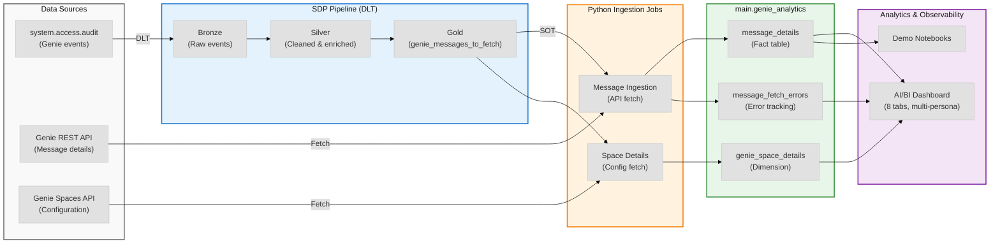
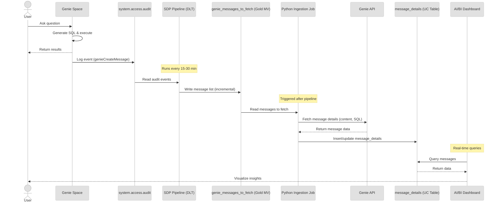

# Genie Observability

**End-to-end observability for Databricks AI/BI Genie**: audit-derived datasets, message ingestion from Genie API, and comprehensive analytics dashboards.

**Platform:** Unity Catalog (`main.genie_analytics`) • **Compute:** Serverless only (DLT pipeline + jobs)

---

## Architecture Overview



---

## Quick Start

### 1. Setup (One-Time)

```bash
# Create secrets for API access
cd setup/
export DATABRICKS_SP_CLIENT_ID="<your-sp-client-id>"
export DATABRICKS_SP_CLIENT_SECRET="<your-sp-secret>"
python create_secrets.py

# Create schema and tables
databricks sql execute -f create_schema.sql
```

### 2. Deploy Pipeline

```bash
cd pipelines/genie_observability/
databricks bundle deploy
databricks bundle run genie_observability_pipeline
```

### 3. Run Ingestion

```bash
# See python/README.md for configuration
# Then run message ingestion job
```

### 4. Deploy Dashboard

```bash
cd dashboards/
# See dashboards/README.md for deployment via MCP tools
```

---

## Repository Structure

```
genie-aibi/
├── setup/                      ← One-time setup scripts
│   ├── create_secrets.py       Python: Create Databricks secrets
│   ├── create_schema.sql       SQL: Create UC schema & tables
│   └── cleanup_schema.sql      SQL: Reset schema (destructive)
│
├── pipelines/                  ← DLT/SDP pipelines
│   └── genie_observability/    Spark Declarative Pipeline (SQL)
│       ├── pipeline.sql        Bronze → Silver → Gold MVs
│       └── README.md           Pipeline documentation
│
├── python/                     ← Ingestion jobs (Python)
│   ├── config.py               Configuration (workspaces, spaces)
│   ├── genie_oauth.py          OAuth for Genie API
│   ├── genie_message_ingestion.py        Message fetch from API
│   ├── genie_space_details.py            Space config fetch
│   └── demo_generate_test_conversations.py   Test data generator
│
├── dashboards/                 ← AI/BI dashboards
│   ├── genie_observability_dashboard_v1.0.json
│   ├── deploy_dashboard.py    Deployment utility
│   └── README.md               Dashboard documentation
│
├── docs/                       ← Documentation
│   ├── genie-observability-dashboard.md       Dashboard guide
│   ├── setup-test-data-generation.md          Test data setup
│   ├── genie-aibi-data-model-and-architecture.md   Architecture
│   ├── genie-messages-persistence-strategy.md      Data persistence
│   └── genie-observability-recommendations.md      Best practices
│
├── notebooks/                  ← Demo notebooks
│   └── genie_observability_demo.ipynb
│
└── resources/                  ← Job definitions
    ├── genie_observability_job.yml       Pipeline + ingestion
    └── genie_space_details_job.yml       Space details fetch
```

---

## Data Flow

### End-to-End Process



### Tables Created

| Schema | Table | Type | Source | Purpose |
|--------|-------|------|--------|---------|
| `main.genie_analytics` | `genie_messages_to_fetch` | Materialized View | SDP pipeline (audit) | Source of truth for messages to ingest |
| `main.genie_analytics` | `message_details` | Managed Table | Python ingestion (API) | Message content, SQL, status, timestamps |
| `main.genie_analytics` | `genie_space_details` | Managed Table | Python job (Spaces API) | Space config, title, serialized_space |
| `main.genie_analytics` | `message_fetch_errors` | Managed Table | Python ingestion (errors) | Failed API fetches, retry tracking |

---

## Key Components

### 1. Setup Scripts (`setup/`)

**One-time configuration:**
- `create_secrets.py` - Store service principal credentials in Databricks secrets
- `create_schema.sql` - Create Unity Catalog schema and tables
- `cleanup_schema.sql` - Reset schema (drops all data)

**Documentation:** [setup/README.md](setup/README.md)

### 2. SDP Pipeline (`pipelines/genie_observability/`)

**Spark Declarative Pipeline** that processes audit log:
- **Bronze:** Raw Genie events from `system.access.audit`
- **Silver:** Cleaned and enriched with workspace metadata
- **Gold:** `genie_messages_to_fetch` (message list for ingestion)

**Features:**
- Incremental processing (lookback_minutes)
- Initial load support (days_lookback)
- Workspace and space filtering
- Serverless compute only

**Documentation:** [pipelines/genie_observability/README.md](pipelines/genie_observability/README.md)

### 3. Python Ingestion (`python/`)

**Core Scripts:**
- `genie_message_ingestion.py` - Fetches message details from Genie API
  - Reads from `genie_messages_to_fetch` (SOT)
  - Calls Genie API per message
  - Writes to `message_details` and `message_fetch_errors`
  - Incremental (skips existing messages)

- `genie_space_details.py` - Fetches space configuration
  - Reads distinct spaces from `genie_messages_to_fetch`
  - Calls Spaces API with `include_serialized_space=true`
  - Writes to `genie_space_details` (merge by workspace_id, space_id)
  - Used for dashboard (human-readable titles) and space promotion

**Utilities:**
- `config.py` - Configuration (workspace IDs, space filters, secrets scope)
- `genie_oauth.py` - OAuth helpers for Genie API authentication
- `demo_generate_test_conversations.py` - Generate test data via Conversation API

**Documentation:** [python/README.md](python/README.md)

### 4. Dashboard (`dashboards/`)

**AI/BI Dashboard** with 8 persona-driven tabs:

1. **Filters** (Global) - Workspace multi-select
2. **Executive Summary** - KPIs and trends
3. **Usage Analytics** - Space activity metrics
4. **Performance & Quality** - Error analysis
5. **Prompts & SQL** - Full prompt→intelligence→SQL flow
6. **Observability** - Message status with time range filter
7. **User Adoption** - User metrics and engagement
8. **Space Configuration** - Space metadata and settings

**Features:**
- 18 datasets (star schema with message_details as fact table)
- Global workspace filter (applies to all tabs)
- Page-level time range filter (Observability tab)
- "Genie Intelligence" column (query_description)
- "Context Data" column (attachments_json)

**Documentation:** [docs/genie-observability-dashboard.md](docs/genie-observability-dashboard.md)

**Deployment:** [dashboards/README.md](dashboards/README.md)

---

## Documentation

### Getting Started
- 🚀 **[Setup Guide](setup/README.md)** - One-time secrets and schema setup
- 📊 **[Dashboard Guide](docs/genie-observability-dashboard.md)** - Complete dashboard documentation
- 🧪 **[Test Data Generation](docs/setup-test-data-generation.md)** - Generate test conversations on Databricks

### Architecture & Design
- 🏗️ **[Data Model & Architecture](docs/genie-aibi-data-model-and-architecture.md)** - Tables, MVs, diagrams, load modes
- 💾 **[Persistence Strategy](docs/genie-messages-persistence-strategy.md)** - How messages are stored
- 📈 **[Observability Recommendations](docs/genie-observability-recommendations.md)** - Best practices

### Implementation Guides
- 🔄 **[Pipeline README](pipelines/genie_observability/README.md)** - SDP pipeline setup and configuration
- 🐍 **[Python README](python/README.md)** - Ingestion jobs and configuration
- 📊 **[Dashboard README](dashboards/README.md)** - Dashboard deployment and maintenance

---

## Configuration

### Environment Variables (One-Time Setup)

```bash
# Service Principal Credentials (for API access)
export DATABRICKS_SP_CLIENT_ID="<your-sp-application-id>"
export DATABRICKS_SP_CLIENT_SECRET="<your-sp-secret>"
```

### Config File (`python/config.py`)

```python
# Required: Workspaces to monitor
WORKSPACE_IDS = ["1516413757355523", "984752964297111"]

# Optional: Specific spaces (None = all spaces)
SPACE_IDS_BY_WORKSPACE = {
    "1516413757355523": ["01f0aaabfed41a778b2e5302795ce495"],
    "984752964297111": ["01ef7bef0dbf1545bfd9184f19ad97f6"]
}
# SPACE_IDS_BY_WORKSPACE = None  # Uncomment for all spaces

# Target schema
TARGET_SCHEMA = "main.genie_analytics"

# Secrets scope
SECRETS_SCOPE = "genie-obs"
```

### Pipeline Configuration

Edit `pipelines/genie_observability/pipeline.sql`:

```sql
-- Initial load (first run)
SET genie.days_lookback = 90;
SET genie.lookback_minutes = "";

-- Incremental (scheduled runs)
SET genie.days_lookback = "";
SET genie.lookback_minutes = 30;
```

---

## Deployment

### Production Deployment Flow

```
1. Setup (One-Time)
   ├─ Create secrets → python setup/create_secrets.py
   ├─ Create schema → databricks sql execute -f setup/create_schema.sql
   └─ Configure → Edit python/config.py

2. Deploy Pipeline
   ├─ Deploy DLT → databricks bundle deploy (pipelines/)
   └─ Run initial load → genie.days_lookback = 90

3. Deploy Jobs
   ├─ Message ingestion → resources/genie_observability_job.yml
   └─ Space details → resources/genie_space_details_job.yml

4. Deploy Dashboard
   └─ Deploy via MCP → dashboards/deploy_dashboard.py

5. Schedule (Ongoing)
   ├─ Pipeline → Every 15-30 min (incremental)
   ├─ Message ingestion → Triggered after pipeline
   └─ Space details → Daily or as needed
```

### Serverless Compute

**All jobs use serverless compute** (no classic clusters):

```yaml
# Job configuration
tasks:
  - task_key: genie_pipeline
    pipeline_task:
      pipeline_id: "<pipeline-id>"
      full_refresh: false

  - task_key: message_ingestion
    python_script_task:
      script_path: "/Workspace/.../genie_message_ingestion.py"
    depends_on:
      - task_key: genie_pipeline

    # Serverless compute (not new_cluster!)
    environments:
      - environment_key: serverless
        spec:
          dependencies:
            - databricks-sdk
```

---

## Monitoring & Troubleshooting

### Health Checks

```sql
-- Pipeline: Check messages to fetch
SELECT COUNT(*), MAX(event_date)
FROM main.genie_analytics.genie_messages_to_fetch;

-- Ingestion: Check ingested messages
SELECT COUNT(*), MAX(created_date)
FROM main.genie_analytics.message_details;

-- Errors: Check fetch failures
SELECT error_type, COUNT(*)
FROM main.genie_analytics.message_fetch_errors
WHERE error_timestamp >= current_timestamp() - INTERVAL 1 DAY
GROUP BY error_type;

-- Gap analysis: Pipeline vs ingestion
SELECT
  COUNT(DISTINCT mf.message_id) as to_fetch,
  COUNT(DISTINCT md.message_id) as ingested,
  COUNT(DISTINCT mf.message_id) - COUNT(DISTINCT md.message_id) as gap
FROM main.genie_analytics.genie_messages_to_fetch mf
LEFT JOIN main.genie_analytics.message_details md
  ON mf.workspace_id = md.workspace_id
  AND mf.message_id = md.message_id;
```

### Common Issues

| Issue | Cause | Fix |
|-------|-------|-----|
| Pipeline returns 0 rows | No Genie events in timeframe | Increase `days_lookback` or generate test data |
| Ingestion fails with 403 | Service principal lacks permissions | Grant Genie Space CAN_USE permission |
| Dashboard shows empty | Pipeline or ingestion not run | Run pipeline → ingestion → verify data |
| Message count mismatch | API fetch errors | Check `message_fetch_errors` table |

**Full troubleshooting:** See respective README files in each directory

---

## Best Practices

### ✅ DO

- **Use serverless compute** for all jobs (no classic clusters)
- **Run pipeline before ingestion** (pipeline creates SOT)
- **Start with few spaces** (1-2) before scaling to all
- **Monitor fetch errors** (`message_fetch_errors` table)
- **Version dashboard changes** (v1.0, v1.1, v2.0)
- **Test SQL queries** before deploying to dashboard
- **Generate test data** for demos and validation

### ❌ DON'T

- **Don't use classic clusters** (serverless only)
- **Don't skip secrets setup** (OAuth required for API)
- **Don't commit credentials** (use secrets, not config files)
- **Don't run ingestion without pipeline** (needs SOT table)
- **Don't forget space details job** (needed for human-readable names)
- **Don't deploy dashboard without testing queries** (broken widgets)

---

## Data Governance

### Access Control

**Required Permissions:**
- **Service Principal:**
  - Workspace access (READ)
  - Genie Space access (CAN_USE)
  - Unity Catalog (SELECT on system tables, CREATE/MODIFY on main.genie_analytics)

- **Users (Dashboard):**
  - SELECT on `main.genie_analytics.*`
  - SELECT on `system.query.history` (for user adoption metrics)

### Data Privacy

- **PII Considerations:**
  - `message_details.content` contains user questions (may be sensitive)
  - `message_details.query_sql` may reveal data structures
  - User email only in `genie_messages_to_fetch` (requires join)

- **Retention:**
  - Audit log: 30 days (Databricks default)
  - Ingested messages: Configurable (default: keep all)
  - Apply retention policies via Delta table properties if needed

### Compliance

- **Audit Trail:**
  - All API calls logged in `message_fetch_errors` (failures)
  - All ingested messages in `message_details` (success)
  - Dashboard queries logged in `system.query.history`

- **Lineage:**
  - `system.access.audit` → SDP pipeline → `genie_messages_to_fetch`
  - `genie_messages_to_fetch` → Python ingestion → `message_details`
  - Unity Catalog tracks full lineage

---

## Contributing

### Code Organization

- **Setup scripts:** `setup/` (one-time configuration)
- **Pipeline code:** `pipelines/` (SQL-based DLT)
- **Ingestion code:** `python/` (API fetch jobs)
- **Dashboard code:** `dashboards/` (JSON + deployment script)
- **Documentation:** `docs/` (architecture, guides, recommendations)

### Documentation Standards

Follow the repository's documentation standards (see `CLAUDE.md`):
- Use Mermaid diagrams (note: `accTitle`/`accDescr` directives are not supported by GitHub's Mermaid renderer and should be omitted for GitHub compatibility)
- C4 Model for architecture (Context, Container, Component)
- Sequence diagrams for flows (with edge labels)
- ASCII diagrams for simple structures (max 20 lines)

---

## Support

### For Issues

1. **Check documentation** in respective README files
2. **Run health checks** (see Monitoring section above)
3. **Review error logs** (`message_fetch_errors` table, job logs)
4. **Verify configuration** (workspace IDs, secrets, permissions)

### Related Projects

- **Databricks DLT:** https://docs.databricks.com/delta-live-tables/
- **Databricks Genie:** https://docs.databricks.com/genie/
- **Unity Catalog:** https://docs.databricks.com/unity-catalog/

---

**Version:** 1.0
**Last Updated:** February 10, 2026
**Requires:** Databricks Runtime 13.3+ LTS, Unity Catalog, Serverless Compute
