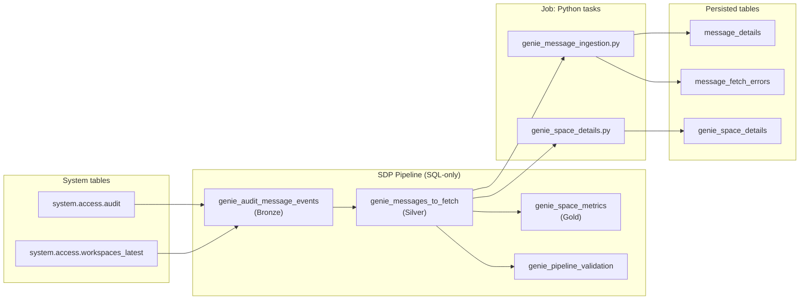
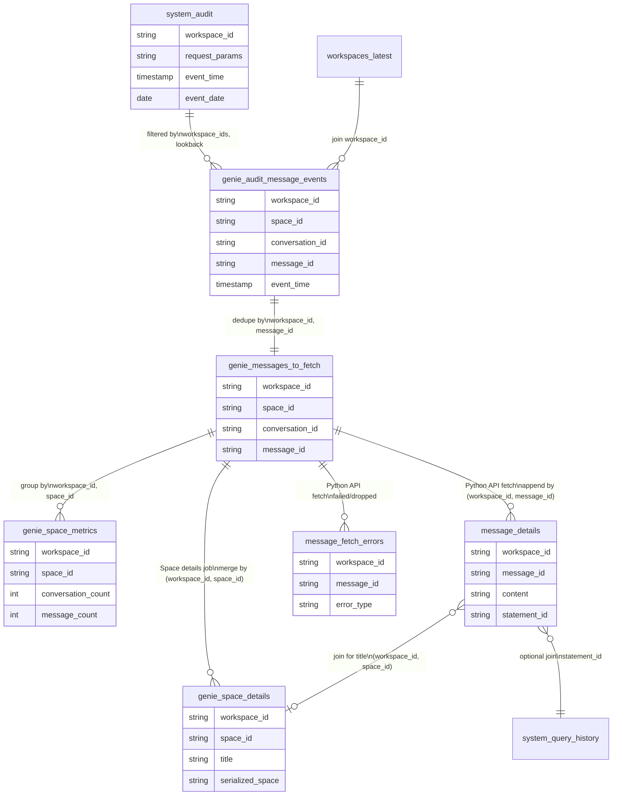

# Genie Observability – Data Model and Architecture

This document describes the data model, how all tables and materialized views tie together, load modes (initial / incremental / catch-up), and the execution flow. See also: `pipelines/genie_observability/README.md`, `sql/README.md`, `python/README.md`.

---

## 1. Load modes (when to use which config)

The pipeline and Job do **not** auto-switch between “full” and “incremental.” You choose the mode via **pipeline configuration**.

| Mode | When to use | Pipeline config | What happens |
|------|-------------|-----------------|--------------|
| **Initial load** | First run only; backfill last N days. | `genie.days_lookback = "90"` (or desired days), `genie.lookback_minutes = ""` | Pipeline reads audit where `event_date >= current_date - 90`. MVs are filled with that window. Python job fetches those messages and appends to `message_details`. |
| **Incremental** | Every scheduled run after the first load. | `genie.lookback_minutes = "30"` (or 15, 60, etc.); run Job every 30 min (or matching interval) | Pipeline reads only `event_time >= now - 30 minutes`. MVs contain only recent messages. Python appends new messages; skips (workspace_id, message_id) already in `message_details`. |
| **Catch-up after a gap** | Job didn’t run for several days (e.g. 7); you want to backfill the gap. | **One run:** `genie.days_lookback = "8"`, `genie.lookback_minutes = ""`. Then switch back to incremental. | Pipeline reads last 8 days from audit. Run Job once. Then set `genie.lookback_minutes = "30"` again for normal runs. |

**Important:** If you run incremental config (`lookback_minutes` set) but don’t run the Job for 7 days, the **next** run only sees the last N minutes. The 7 days in between are **missing** from `message_details` unless you do a catch-up run as above.

---

## 2. Data model: tables and MVs

All objects live in catalog/schema `main.genie_analytics` unless noted.

### 2.1 System tables (read-only, Databricks)

| Object | Purpose |
|--------|---------|
| `system.access.audit` | Raw audit log. Filter `service_name = 'aibiGenie'` and message-level actions (`genieGetConversationMessage`, `getConversationMessage`) to get (workspace_id, space_id, conversation_id, message_id, event_time). Pipeline reads this with parameterized workspace_ids and lookback. |
| `system.access.workspaces_latest` | Workspace metadata (workspace_name, workspace_url). Joined to audit by workspace_id for pipeline and dashboard. |
| `system.query.history` | Optional: SQL execution details. Can join to `message_details` via `statement_id` for query performance (duration, rows, etc.). |

### 2.2 Pipeline materialized views (SDP pipeline)

Created and refreshed by the **genie_observability** pipeline (SQL-only). Target schema: `main.genie_analytics`.

| MV | Layer | Purpose |
|----|-------|---------|
| **genie_audit_message_events** | Bronze | Raw Genie message events from audit (filtered by config). Expectations drop invalid rows. Source for silver. |
| **genie_messages_to_fetch** | Silver | Deduplicated list of (workspace_id, message_id, space_id, conversation_id, …), one row per message. **Source of truth for the Python ingestion job**: it reads this table and calls the Genie API for each message. |
| **genie_space_metrics** | Gold | Space-level aggregates: conversation_count, message_count, user_count, first/last event times. For dashboards and adoption metrics. |
| **genie_pipeline_validation** | Validation | Single-row summary: silver_row_count, configured_days_lookback, configured_lookback_minutes, effective_start_date. For tests and pipeline health. |

### 2.3 Persisted tables (created by DDL; written by Python)

Created by **`sql/genie_observability_schema.sql`** (run once). Written by **Python ingestion** (`genie_message_ingestion.py`).

| Table | Purpose |
|-------|---------|
| **message_details** | Denormalized message content from the Genie API: content, status, attachments, **space_name** (title from GET space API), optional query_* columns, ingestion metadata. **Append-only.** Python job merges/inserts only (workspace_id, message_id) not already present. |
| **message_fetch_errors** | Failed or dropped API fetches (e.g. NO_TOKEN, FAILED, timeout). Append-only; use for retry and monitoring. |
| **genie_space_details** | Full space config from GET space with `include_serialized_space=true`. Filled by **genie_space_details.py** (separate job). Columns: title, description, warehouse_id, created_timestamp, last_updated_timestamp, **serialized_space**. Use serialized_space with Create/Update Genie Space API to promote spaces or create backups. Merge by (workspace_id, space_id). |

### Analytics approach: keep tables separate, join for dashboards

**message_details** and **genie_space_details** are kept as separate tables. Analytics and monitoring are driven by **joins** across the full set of tables and MVs:

- **message_details** — fact table for message-level content and API fetch status.
- **genie_space_details** — dimension table for space metadata (title, description, serialized_space).
- **genie_space_metrics** — pre-aggregated space-level counts (conversation_count, message_count, user_count) from the pipeline.
- **message_fetch_errors** — failure log for retry and error-rate analysis.
- **genie_messages_to_fetch** — silver list; join when you need workspace_url or to compare “to fetch” vs “fetched”.

Dashboard queries join these on `(workspace_id, space_id)` (and optionally `workspace_id` + `message_id` for errors) to produce space-level analytics, message flow with human-readable space names, error rates by space, and adoption metrics. This keeps a single source of truth per entity and avoids duplicating data; dashboards stay consistent and easy to maintain.

---

## 3. Data flow (Mermaid)



**In words:** Audit + workspaces → Bronze MV → Silver MV → Gold MV and Validation MV. The **Job’s Python task 1** reads **Silver** (`genie_messages_to_fetch`), calls the Genie API per message, and appends to **message_details** (success) or **message_fetch_errors** (failure). A **separate Job** (or task) runs **genie_space_details.py**, which reads distinct (workspace_id, space_id) from Silver, calls GET space with `include_serialized_space=true`, and **merges** into **genie_space_details** (title, description, serialized_space for backup/promote).

---

## 4. Entity relationship (Mermaid)



---

## 5. Execution sequence (Job run)

The **recommended** way to run the pipeline and ingestion is a **single Job** with two tasks: pipeline first, then Python. Order is enforced by task dependency.

```mermaid
sequenceDiagram
  participant Scheduler
  participant Job
  participant Pipeline as Pipeline task
  participant SDP as SDP (SQL-only)
  participant Python as Python task
  participant API as Genie API
  participant Tables as main.genie_analytics

  Scheduler->>Job: Trigger (e.g. every 30 min)
  Job->>Pipeline: Run pipeline task
  Pipeline->>SDP: Refresh MVs
  SDP->>Tables: Read audit; write Bronze, Silver, Gold, Validation
  Pipeline-->>Job: Task 1 complete
  Job->>Python: Run ingestion task (depends on Task 1)
  Python->>Tables: Read genie_messages_to_fetch
  loop For each message not in message_details
    Python->>API: GET message (OAuth)
    API-->>Python: Message content
    Python->>Tables: Append to message_details or message_fetch_errors
  end
  Python-->>Job: Task 2 complete
  Job-->>Scheduler: Run complete
```

**Takeaway:** Pipeline refreshes `genie_messages_to_fetch` first; then Python reads that table and fills `message_details` / `message_fetch_errors`. No Python step inside the pipeline; use the Job for correct order.

---

## 6. File and component map

| Component | Location | Role |
|-----------|----------|------|
| Pipeline SQL | `pipelines/genie_observability/pipeline.sql` | Defines Bronze, Silver, Gold, Validation MVs. |
| Pipeline config | Pipeline UI or API `configuration` | `genie.workspace_ids`, `genie.days_lookback`, `genie.lookback_minutes`. |
| Job definition | `resources/genie_observability_job.yml` | Two tasks: pipeline, then `genie_message_ingestion.py`. |
| Schema DDL | `sql/genie_observability_schema.sql` | Creates `message_details`, `message_fetch_errors`, `genie_space_details`. Run once. |
| Python ingestion | `python/genie_message_ingestion.py` | Reads `genie_messages_to_fetch`; calls Genie API; appends to message_details / message_fetch_errors. |
| Space details job | `python/genie_space_details.py` | GET space with `include_serialized_space=true`; merges into genie_space_details (backup / promote). See `resources/genie_space_details_job.yml`. |
| Dashboard queries | `sql/genie_observability_queries.sql` | Parameterized queries for discovery and dashboards. |

---

## 7. Quick reference: config by scenario

| Scenario | genie.days_lookback | genie.lookback_minutes | Run |
|----------|---------------------|------------------------|-----|
| First time (e.g. 90 days) | `"90"` | `""` | Job once (pipeline + ingestion). |
| Normal schedule (e.g. every 30 min) | e.g. `"30"` | `"30"` | Job on schedule (e.g. cron `0 0/30 * * * ?`). |
| Missed 7 days | `"8"` | `""` | Job once (catch-up), then set lookback_minutes back to `"30"`. |
