# Agent Traffic via Azure APIM - Architecture Review

## Use Case Summary

Route all agent requests through Azure API Management (APIM) including:
- Foundation Model APIs (FMAPI)
- External MCP servers
- Authorized tools and websites

## High-Level Architecture

## Alternative: External App → APIM → Databricks (Inbound Pattern)

When requests originate from an external application and need to invoke Databricks Foundation Model APIs:

```mermaid
flowchart LR
    subgraph Client["Client Layer"]
        USER["👤 End User"]
        APP["External App<br/>(Web/Mobile/API)"]
    end

    subgraph Azure["Azure Infrastructure"]
        APIM["Azure APIM<br/>━━━━━━━━━━━━━━━━<br/>• Authentication<br/>• Rate Limiting<br/>• Request Validation<br/>• Logging & Analytics"]
        PE["Private Endpoint"]
    end

    subgraph Databricks["Databricks Workspace"]
        FMAPI["Foundation Model API<br/>(Model Serving Endpoint)"]
        AGENT["AI Agent<br/>(if agentic flow)"]
        UC["Unity Catalog<br/>Governance"]
    end

    subgraph External["External LLMs (Optional)"]
        ANT["Anthropic"]
        OAI["OpenAI"]
    end

    USER -->|"Request"| APP
    APP -->|"API Call"| APIM
    APIM -->|"Private Link"| PE
    PE -->|"Invoke"| FMAPI
    FMAPI -->|"Agent Execution"| AGENT
    AGENT -->|"Tool Calls"| UC

    AGENT -.->|"External LLM<br/>(via APIM egress)"| APIM
    APIM -.-> ANT
    APIM -.-> OAI

    style USER fill:#e1bee7,stroke:#7b1fa2,color:#000
    style APP fill:#ffe0b2,stroke:#e65100,color:#000
    style APIM fill:#bbdefb,stroke:#1565c0,color:#000
    style PE fill:#e1f5fe,stroke:#0288d1,color:#000
    style FMAPI fill:#ffccbc,stroke:#d84315,color:#000
    style AGENT fill:#ffccbc,stroke:#d84315,color:#000
    style UC fill:#c8e6c9,stroke:#2e7d32,color:#000
```

### Detailed Inbound Flow with Security Controls

```mermaid
sequenceDiagram
    participant User as End User
    participant App as External App
    participant APIM as Azure APIM
    participant PE as Private Endpoint
    participant FM as Databricks FM API
    participant Agent as AI Agent
    participant UC as Unity Catalog
    participant LLM as External LLM<br/>(Anthropic)

    User->>App: User request
    App->>APIM: API call with auth token

    Note over APIM: Validate:<br/>• OAuth/API Key<br/>• Rate limits<br/>• Request schema

    APIM->>PE: Forward via Private Link
    PE->>FM: Invoke FM API endpoint

    alt Simple Completion
        FM-->>PE: Model response
        PE-->>APIM: Response
        APIM-->>App: JSON response
        App-->>User: Display result
    else Agentic Flow
        FM->>Agent: Execute agent
        Agent->>UC: Check permissions & get tools
        UC-->>Agent: Authorized tools

        loop Tool Execution
            Agent->>Agent: Reason & plan
            Agent->>UC: Execute UC Function / Query
            UC-->>Agent: Tool result
        end

        opt External LLM Call
            Agent->>APIM: Call external model (egress)
            APIM->>LLM: Authenticated request
            LLM-->>APIM: Response
            APIM-->>Agent: Response
        end

        Agent-->>FM: Final response
        FM-->>PE: Response
        PE-->>APIM: Response
        APIM-->>App: JSON response
        App-->>User: Display result
    end
```

### Bidirectional APIM Pattern (Inbound + Outbound)

```mermaid
flowchart TB
    subgraph External["External World"]
        USER["👤 Users"]
        EXT_APP["External Apps"]
        LLM["External LLMs<br/>Anthropic / OpenAI"]
        MCP["External MCP<br/>Servers"]
    end

    subgraph APIM_Layer["Azure APIM (Central Gateway)"]
        APIM_IN["APIM Inbound<br/>━━━━━━━━━━━━━━━━<br/>External → Databricks"]
        APIM_OUT["APIM Outbound<br/>━━━━━━━━━━━━━━━━<br/>Databricks → External"]
    end

    subgraph Azure_Net["Azure Private Network"]
        PE_IN["Private Endpoint<br/>(Inbound)"]
        PE_OUT["Private Endpoint<br/>(Outbound)"]
    end

    subgraph Databricks["Databricks Workspace"]
        FM["FM API Endpoint"]
        AGENT["AI Agent"]
        UC["Unity Catalog"]
    end

    USER --> EXT_APP
    EXT_APP -->|"1. Request"| APIM_IN
    APIM_IN -->|"2. Private Link"| PE_IN
    PE_IN -->|"3. Invoke"| FM
    FM --> AGENT
    AGENT --> UC

    AGENT -->|"4. Egress (FQDN)"| PE_OUT
    PE_OUT -->|"5. Private Link"| APIM_OUT
    APIM_OUT -->|"6a. LLM Call"| LLM
    APIM_OUT -->|"6b. MCP Call"| MCP

    LLM -.->|"7. Response"| APIM_OUT
    APIM_OUT -.-> PE_OUT
    PE_OUT -.-> AGENT
    AGENT -.-> FM
    FM -.-> PE_IN
    PE_IN -.-> APIM_IN
    APIM_IN -.->|"8. Final Response"| EXT_APP

    style APIM_IN fill:#bbdefb,stroke:#1565c0,color:#000
    style APIM_OUT fill:#bbdefb,stroke:#1565c0,color:#000
    style AGENT fill:#ffccbc,stroke:#d84315,color:#000
    style FM fill:#ffccbc,stroke:#d84315,color:#000
    style UC fill:#c8e6c9,stroke:#2e7d32,color:#000
    style PE_IN fill:#e1f5fe,stroke:#0288d1,color:#000
    style PE_OUT fill:#e1f5fe,stroke:#0288d1,color:#000
```

## Detailed Security Architecture

```mermaid
flowchart LR
    subgraph DBX["Databricks Workspace"]
        subgraph SML["Serverless Model Serving"]
            AGT["🤖 AI Agent"]
            NP["Network Policy<br/>(FQDN Egress Rules)"]
        end

        subgraph GOV["Unity Catalog Governance"]
            CONN["UC HTTP Connections<br/>(Auth Proxy)"]
            CAT["Catalog/Schema<br/>Permissions"]
        end
    end

    subgraph AZ["Azure Infrastructure"]
        PE["Private Endpoint"]
        APIM["Azure APIM<br/>━━━━━━━━━━━━━━━━<br/>• Rate Limiting<br/>• Auth Policies<br/>• Request Logging<br/>• FQDN Routing"]
    end

    subgraph EXT["External Endpoints"]
        ANT["Anthropic Claude<br/>(Indemnity Clause)"]
        OAI["OpenAI"]
        MCPS["MCP Servers"]
    end

    AGT --> NP
    NP -->|"FQDN: apim.contoso.com"| PE
    CONN -->|"Credential Proxy"| PE
    PE -->|"Private Link"| APIM

    APIM --> ANT
    APIM --> OAI
    APIM --> MCPS

    style APIM fill:#bbdefb,stroke:#1565c0,color:#000
    style AGT fill:#ffccbc,stroke:#d84315,color:#000
    style PE fill:#e1f5fe,stroke:#0288d1,color:#000
    style NP fill:#fff9c4,stroke:#f9a825,color:#000
    style CONN fill:#c8e6c9,stroke:#2e7d32,color:#000
```

## Egress Control Flow

## UC HTTP Connection Pattern for External MCP

```mermaid
flowchart TB
    subgraph Agent["Agent Runtime"]
        MCP_CLIENT["DatabricksMCPClient"]
    end

    subgraph UC["Unity Catalog"]
        HTTP_CONN["UC HTTP Connection<br/>━━━━━━━━━━━━━━━━<br/>• Stores APIM URL<br/>• Manages credentials<br/>• Proxy authentication"]
    end

    subgraph APIM["Azure APIM"]
        ROUTE["Routing Rules<br/>━━━━━━━━━━━━━━━━<br/>• /mcp/server-a → MCP-A<br/>• /mcp/server-b → MCP-B<br/>• /fmapi/* → Anthropic"]
    end

    subgraph External["External MCP Servers"]
        MCP_A["MCP Server A"]
        MCP_B["MCP Server B"]
    end

    MCP_CLIENT -->|"uc://connections/apim-gateway"| HTTP_CONN
    HTTP_CONN -->|"Private Link"| APIM
    APIM --> MCP_A
    APIM --> MCP_B

    style HTTP_CONN fill:#c8e6c9,stroke:#2e7d32,color:#000
    style APIM fill:#bbdefb,stroke:#1565c0,color:#000
    style MCP_CLIENT fill:#ffccbc,stroke:#d84315,color:#000
```

## Agent Isolation Strategy

```mermaid
flowchart TB
    subgraph Isolation["Workspace & Catalog Isolation"]
        subgraph WS1["Workspace: Production"]
            CAT1["Catalog: prod_agents"]
            SCH1["Schema: approved_tools"]
            AGT1["Production Agents"]
        end

        subgraph WS2["Workspace: Development"]
            CAT2["Catalog: dev_agents"]
            SCH2["Schema: test_tools"]
            AGT2["Dev Agents"]
        end
    end

    subgraph Permissions["Unity Catalog Permissions"]
        PERM["• Catalog-level access control<br/>• Schema-level tool restrictions<br/>• Connection permissions<br/>• Row-level security"]
    end

    CAT1 --> PERM
    CAT2 --> PERM

    style WS1 fill:#c8e6c9,stroke:#2e7d32,color:#000
    style WS2 fill:#fff9c4,stroke:#f9a825,color:#000
    style PERM fill:#bbdefb,stroke:#1565c0,color:#000
```

---

## Architecture Review Checklist

### Review Session Topics

| Topic | Details |
|-------|---------|
| **APIM as Exclusive Gateway** | Validate Azure APIM configuration as the sole egress point for all agent traffic to Foundation Model APIs |
| **Private Link Connectivity** | Review Private Endpoint setup between APIM and Databricks workspace |
| **FQDN Egress Rules** | Validate serverless network policies restricting agent connectivity to specific APIM instances |
| **UC HTTP Connections** | Confirm external MCP server authentication proxy management via Unity Catalog |
| **Agent Isolation** | Review workspace separation and catalog/schema-level permissions strategy |

### Security Documentation Needed

1. **Anthropic Indemnity Clauses** - Security whitepapers for enterprise security team approval
2. **Serverless Egress Controls** - Documentation on unique FQDN mapping for model serving endpoints
3. **UC HTTP Connection Security** - Validation on secure external MCP connectivity patterns

### Key Review Areas

---

## References

- [Databricks Serverless Network Policies](https://docs.databricks.com/en/security/network/serverless-network-security/serverless-firewall.html)
- [Unity Catalog HTTP Connections](https://docs.databricks.com/en/connect/unity-catalog/connections.html)
- [Azure APIM Private Link](https://learn.microsoft.com/en-us/azure/api-management/private-endpoint)
- [Databricks Foundation Model APIs](https://docs.databricks.com/en/machine-learning/foundation-models/index.html)
