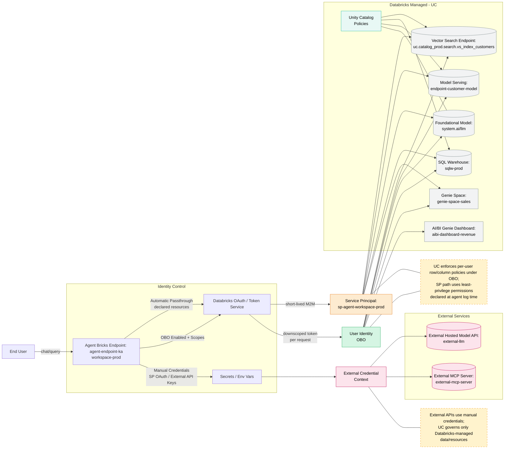
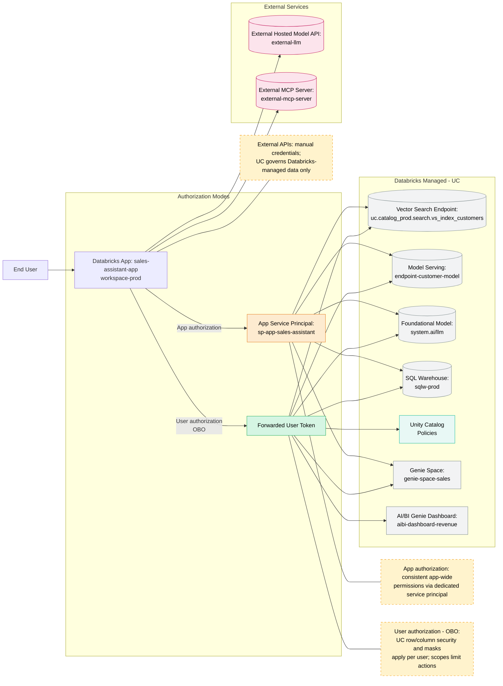

# Cloud-Agnostic Agent Bricks Authentication — Workspace Prod

This visual reflects a likely setup for a "workspace-prod" environment using Databricks Agent Bricks, Databricks Apps, Unity Catalog governance, and integrations with vector search, customer models, foundational models, external models, Genie Space, and AI/BI Genie dashboards.

## Key behaviors

- **Automatic authentication passthrough** uses short‑lived OAuth tokens for a least‑privilege service principal tied to declared resources ("run as owner"-like behavior).
- **On‑behalf‑of‑user (OBO)** runs the agent as the end user; Unity Catalog enforces row/column security and masks per user; initialize user-authenticated clients inside predict() at request time; scopes restrict the APIs the agent can call.
- **Manual credentials** are used for external services (e.g., external LLM APIs or external MCP servers) and can also be used for Databricks resources via OAuth M2M for service principals when needed.
- **Foundation models** in system.ai are accessed as Databricks-managed resources under UC governance once workspace prerequisites are enabled.
- **Databricks Apps** support app authorization (dedicated app service principal) and user authorization (OBO with scopes) with UC enforcing fine‑grained policies on the latter.

## 1) Agent Endpoint: Auth Paths and Identities (workspace-prod)

**Annotations:**

- **Automatic passthrough:** endpoint acts via short‑lived service principal credentials against declared dependencies.
- **OBO:** user identity known at request time; initialize in predict(); UC policies applied per user; scopes limit reachable APIs.
- **External model/MCP:** authenticate with manual credentials; combine with SP or OBO for Databricks resources as needed.
- **Foundation model (system.ai)** appears as Databricks-managed resource governed via UC integration once configured.

## 2) Databricks App Front-End: App vs User Authorization (workspace-prod)

## Quick Reference (cloud-agnostic)

- **Automatic passthrough** → short‑lived SP token; least‑privilege; resources declared at log time.
- **OBO** → runs as the end user; UC policies enforce per-user governance; declare scopes and initialize in predict().
- **Manual credentials** → external model/MCP; optionally SP OAuth M2M for Databricks resources in automation.
- **Foundation model (system.ai) and UC** → accessible as Databricks-managed resources with UC governance when workspace is configured.
- **Databricks Apps** → app SP (fixed permissions) vs OBO (per-user UC with scopes).
