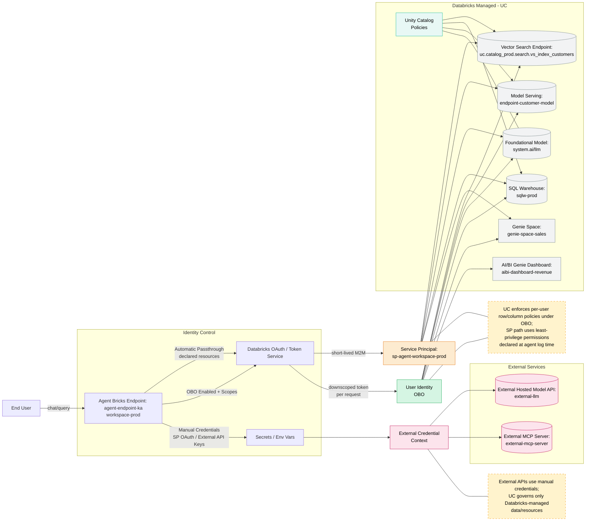
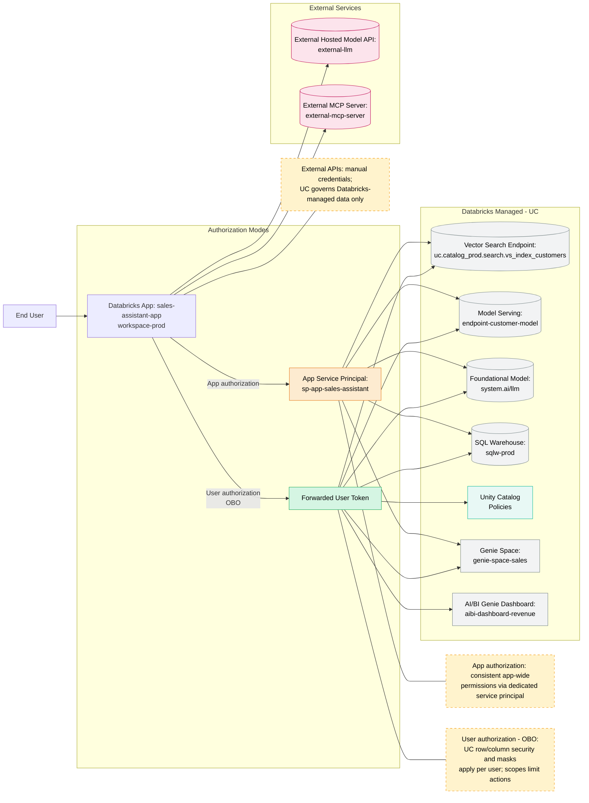

# Cloud-Agnostic Authentication Flows — Reference Diagrams

> **Official Documentation:** [Agent Bricks](https://docs.databricks.com/aws/en/generative-ai/agent-bricks/) | [Agent Authentication](https://docs.databricks.com/aws/en/generative-ai/agent-framework/agent-authentication) | [OAuth M2M](https://docs.databricks.com/aws/en/dev-tools/auth/oauth-m2m.html) | [OAuth U2M](https://docs.databricks.com/aws/en/dev-tools/auth/oauth-u2m.html)

This visual reflects a "workspace-prod" environment using Databricks Agent Bricks, Databricks Apps, Unity Catalog governance, and integrations with vector search, customer models, foundational models, external models, Genie Space, and AI/BI Genie dashboards.

## Agent Bricks Supported Use Cases

| Use Case | Description | Status |
|----------|-------------|--------|
| [**Knowledge Assistant**](https://docs.databricks.com/aws/en/generative-ai/agent-bricks/knowledge-assistant) | Turn documents into a chatbot that answers questions and cites sources | GA |
| [**Information Extraction**](https://docs.databricks.com/aws/en/generative-ai/agent-bricks/key-info-extraction) | Transform unstructured text into structured insights | Beta |
| [**Custom LLM**](https://docs.databricks.com/aws/en/generative-ai/agent-bricks/custom-llm) | Custom text generation (summarization, transformation) | Beta |
| [**Multi-Agent Supervisor**](https://docs.databricks.com/aws/en/generative-ai/agent-bricks/multi-agent-supervisor) | Multi-agent AI systems with Genie Spaces and agents | Beta |
| [**AI/BI Genie**](https://docs.databricks.com/aws/en/genie/) | Turn tables into an expert AI chatbot | GA |
| [**Code Your Own**](https://docs.databricks.com/aws/en/generative-ai/agent-framework/author-agent) | Build with OSS libraries and Agent Framework | GA |

## Key Authentication Behaviors

- **[Automatic authentication passthrough](https://docs.databricks.com/aws/en/generative-ai/agent-framework/agent-authentication#automatic-authentication-passthrough)** uses short‑lived OAuth tokens for a least‑privilege service principal tied to declared resources ("run as owner"-like behavior).
- **[On‑behalf‑of‑user (OBO)](https://docs.databricks.com/aws/en/generative-ai/agent-framework/agent-authentication#on-behalf-of-user-authentication)** runs the agent as the end user; Unity Catalog enforces row/column security, masks, and ABAC policies per user; initialize user-authenticated clients inside `predict()` at request time; scopes restrict the APIs the agent can call.
- **[Manual credentials](https://docs.databricks.com/aws/en/generative-ai/agent-framework/agent-authentication#manual-authentication)** are used for external services (e.g., external LLM APIs or external MCP servers) and can also be used for Databricks resources via OAuth M2M for service principals when needed.
- **Foundation models** in `system.ai` are accessed as Databricks-managed resources under UC governance once workspace prerequisites are enabled.
- **[Databricks Apps](https://docs.databricks.com/aws/en/dev-tools/databricks-apps/)** support app authorization (dedicated app service principal) and user authorization (OBO with scopes) with UC enforcing fine‑grained policies on the latter.

## 1) Agent Endpoint: Auth Paths and Identities (workspace-prod)

**Annotations:**

- **[Automatic passthrough](https://docs.databricks.com/aws/en/generative-ai/agent-framework/agent-authentication#automatic-authentication-passthrough):** endpoint acts via short‑lived service principal credentials against declared dependencies.
- **[OBO](https://docs.databricks.com/aws/en/generative-ai/agent-framework/agent-authentication#on-behalf-of-user-authentication):** user identity known at request time; initialize in `predict()`; UC policies (including [ABAC](https://docs.databricks.com/aws/en/data-governance/unity-catalog/abac)) applied per user; scopes limit reachable APIs.
- **[External model/MCP](https://docs.databricks.com/aws/en/generative-ai/agent-framework/agent-authentication#manual-authentication):** authenticate with manual credentials; combine with SP or OBO for Databricks resources as needed.
- **[Foundation model (system.ai)](https://docs.databricks.com/aws/en/machine-learning/model-serving/foundation-model-overview.html)** appears as Databricks-managed resource governed via UC integration once configured.

## 2) Databricks App Front-End: App vs User Authorization (workspace-prod)

## Quick Reference (cloud-agnostic)

| Pattern | Token Type | UC Enforced | Use Case | Docs |
|---------|-----------|-------------|----------|------|
| **Automatic passthrough** | Short‑lived SP token | ✅ SP permissions | Batch jobs, automation | [Docs](https://docs.databricks.com/aws/en/dev-tools/auth/oauth-m2m.html) |
| **OBO** | User token | ✅ Per-user + ABAC | User-facing apps | [Docs](https://docs.databricks.com/aws/en/dev-tools/auth/oauth-u2m.html) |
| **Manual credentials** | External API key | ❌ External | Third-party APIs | [Docs](https://docs.databricks.com/aws/en/security/secrets/) |

### Key Points

- **[Automatic passthrough](https://docs.databricks.com/aws/en/generative-ai/agent-framework/agent-authentication#automatic-authentication-passthrough)** → short‑lived SP token; least‑privilege; resources declared at log time.
- **[OBO](https://docs.databricks.com/aws/en/generative-ai/agent-framework/agent-authentication#on-behalf-of-user-authentication)** → runs as the end user; UC policies (row filters, column masks, [ABAC](https://docs.databricks.com/aws/en/data-governance/unity-catalog/abac)) enforce per-user governance; declare scopes and initialize in `predict()`.
- **[Manual credentials](https://docs.databricks.com/aws/en/security/secrets/)** → external model/MCP; optionally SP OAuth M2M for Databricks resources in automation.
- **[Foundation model (system.ai)](https://docs.databricks.com/aws/en/machine-learning/model-serving/foundation-model-overview.html)** → accessible as Databricks-managed resources with UC governance when workspace is configured.
- **[Databricks Apps](https://docs.databricks.com/aws/en/dev-tools/databricks-apps/)** → app SP (fixed permissions) vs OBO (per-user UC with scopes).

## Related Documentation

- [Unity Catalog Access Control](https://docs.databricks.com/aws/en/data-governance/unity-catalog/access-control) — Four layers of access control
- [Authorization Flows](authorization-flows.md) — Visual reference for UC authorization
- [Agent Bricks](https://docs.databricks.com/aws/en/generative-ai/agent-bricks/) — Production AI agents
- [Agent Framework Authentication](https://docs.databricks.com/aws/en/generative-ai/agent-framework/agent-authentication) — Detailed auth setup
