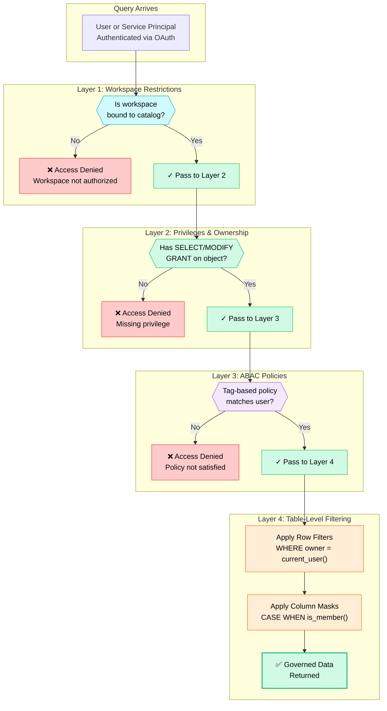
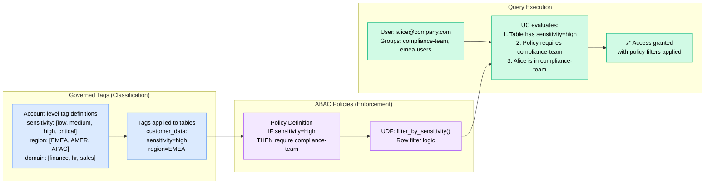
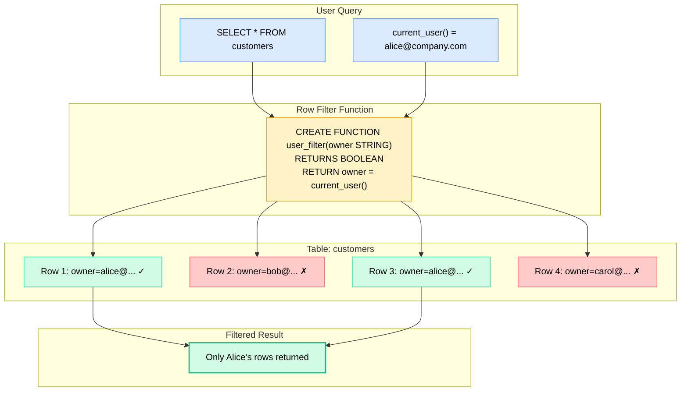
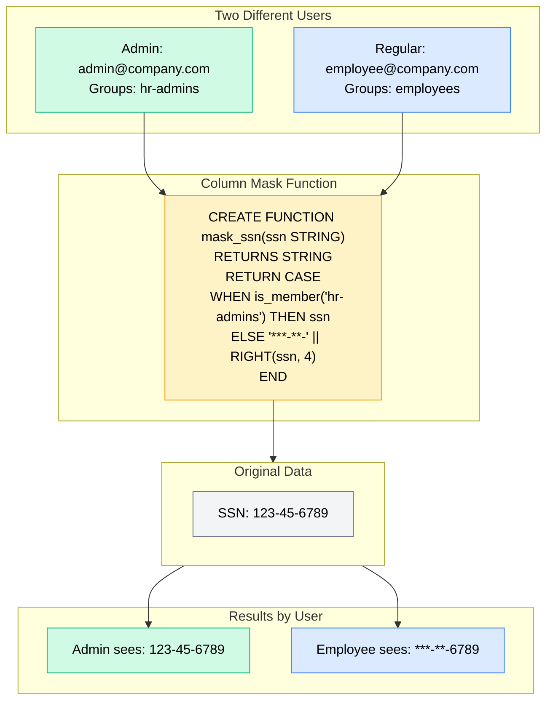
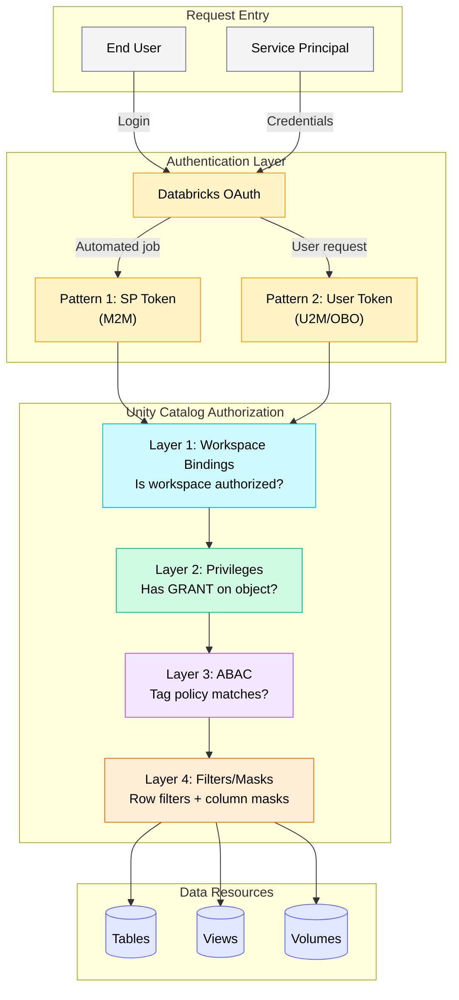

# Unity Catalog Authorization Flows — Reference Diagrams

> **Official Documentation:** [Access Control in Unity Catalog](https://docs.databricks.com/aws/en/data-governance/unity-catalog/access-control) | [ABAC](https://docs.databricks.com/aws/en/data-governance/unity-catalog/abac) | [Row Filters & Column Masks](https://docs.databricks.com/aws/en/sql/language-manual/sql-ref-row-filter-column-mask.html) | [Governed Tags](https://docs.databricks.com/aws/en/admin/governed-tags/)

This document provides visual reference diagrams for Unity Catalog authorization, showing how the four layers of access control work together to enforce secure, fine-grained data access.

## Four Layers of Access Control

Access control in Unity Catalog is built on **four complementary layers** that work together:

| Layer | Question Answered | Mechanisms | Docs |
|-------|-------------------|------------|------|
| **1. Workspace Restrictions** | WHERE can users access data? | Workspace bindings on catalogs, external locations, storage credentials | [Docs](https://docs.databricks.com/aws/en/catalogs/binding.html) |
| **2. Privileges & Ownership** | WHO can access WHAT? | GRANTs (`SELECT`, `MODIFY`, etc.), object ownership, admin roles | [Docs](https://docs.databricks.com/aws/en/data-governance/unity-catalog/manage-privileges/) |
| **3. ABAC Policies** | WHAT data based on tags? | [Governed tags](https://docs.databricks.com/aws/en/admin/governed-tags/) + policies with UDFs for dynamic enforcement | [Docs](https://docs.databricks.com/aws/en/data-governance/unity-catalog/abac) |
| **4. Table-Level Filtering** | WHAT rows/columns visible? | Row filters, column masks, dynamic views | [Docs](https://docs.databricks.com/aws/en/sql/language-manual/sql-ref-row-filter-column-mask.html) |

## 1) Four-Layer Authorization Flow

## 2) ABAC with Governed Tags Flow

## 3) Row Filter Evaluation Flow

## 4) Column Mask Evaluation Flow

## 5) Complete Authorization Flow (All Patterns)

## When to Use Each Mechanism

| Mechanism | Use When | Example | Docs |
|-----------|----------|---------|------|
| **Workspace bindings** | Isolating environments (dev/prod) | Restrict prod catalog to prod workspace | [Docs](https://docs.databricks.com/aws/en/catalogs/binding.html) |
| **Privileges (GRANTs)** | Basic access control | `GRANT SELECT ON TABLE` to group | [Docs](https://docs.databricks.com/aws/en/data-governance/unity-catalog/manage-privileges/) |
| **ABAC policies** | Centralized, tag-driven governance at scale | All `sensitivity=high` tables require compliance group | [Docs](https://docs.databricks.com/aws/en/data-governance/unity-catalog/abac) |
| **Row filters** | Per-user row-level security | Users see only their own records | [Docs](https://docs.databricks.com/aws/en/sql/language-manual/sql-ref-row-filter-column-mask.html) |
| **Column masks** | Sensitive data redaction | Mask SSN for non-HR users | [Docs](https://docs.databricks.com/aws/en/sql/language-manual/sql-ref-row-filter-column-mask.html) |
| **Dynamic views** | Complex filtering logic, Delta Sharing | Multi-table joins with embedded filters | [Docs](https://docs.databricks.com/aws/en/views/dynamic-views.html) |

> **Recommendation:** Use [ABAC](https://docs.databricks.com/aws/en/data-governance/unity-catalog/abac) for centralized, scalable governance. Use row filters and column masks when per-table logic is required or ABAC hasn't been adopted yet.

## Related Documentation

- [Authentication Flows](authentication-flows.md) — Visual reference for authentication patterns
- [Access Control in Unity Catalog](https://docs.databricks.com/aws/en/data-governance/unity-catalog/access-control) — Official four-layer model
- [ABAC](https://docs.databricks.com/aws/en/data-governance/unity-catalog/abac) — Attribute-based access control
- [Governed Tags](https://docs.databricks.com/aws/en/admin/governed-tags/) — Tag management for ABAC
- [Interactive Scrollytelling: Access Control Layers](../interactive/uc-access-control-layers.html) — Visual explainer
