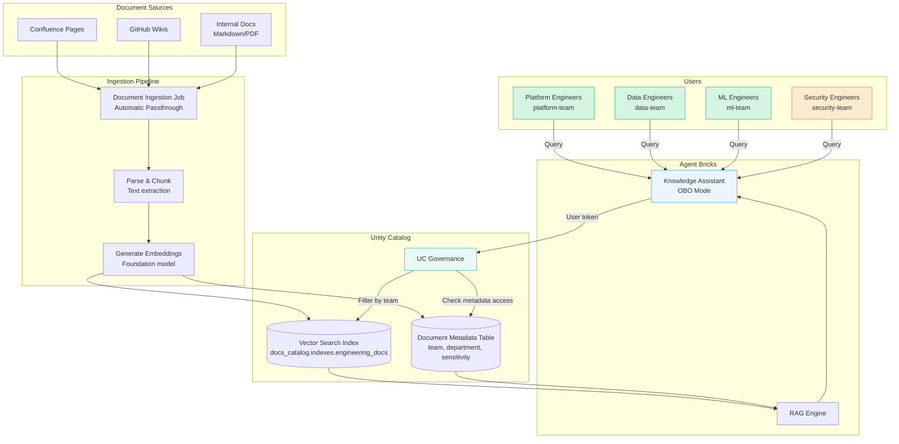

# Knowledge Assistant: Multi-Team Documentation Access

> **Engineering teams share a Knowledge Assistant for technical documentation, with team-specific access controls on Vector Search indexes**

**Official Use Case:** [Knowledge Assistant](https://docs.databricks.com/aws/en/generative-ai/agent-bricks/knowledge-assistant) - Turn your documents into a high-quality chatbot

---

## 📋 Scenario Overview

**Problem Statement:**
Multiple engineering teams (Platform, Data, ML, Security) maintain separate technical documentation in Confluence, GitHub wikis, and internal knowledge bases. Teams need a unified Knowledge Assistant that understands natural language queries but enforces team-based access control - platform engineers should only see platform docs, while security team sees all docs for cross-functional oversight.

**Business Requirements:**
- ✅ Single Knowledge Assistant across all engineering teams
- ✅ Team-specific document access (Platform, Data, ML, Security)
- ✅ Security team has cross-functional access
- ✅ Source attribution with proper access control
- ✅ Support for 200 engineers querying simultaneously
- ✅ Real-time document ingestion (new docs indexed within 1 hour)
- ✅ Semantic search with RAG (Retrieval Augmented Generation)
- ✅ Audit trail for compliance (who accessed which documents)

**Example Queries:**
```text
Platform Engineer: "How do we configure Kubernetes ingress controllers?"
Data Engineer: "What's the data pipeline SLA policy?"
ML Engineer: "Show me the model deployment checklist"
Security Engineer: "List all authentication mechanisms across services"
```

---

## 🏗️ Architecture



---

## 📊 Data Model

### Catalog Structure

```sql
-- Catalog: docs_catalog
-- Purpose: Engineering documentation with team-based access

docs_catalog
├── raw
│   ├── confluence_pages          -- Raw Confluence exports
│   ├── github_wikis              -- Raw GitHub wiki content
│   └── internal_docs             -- PDFs, Markdown, etc.
├── processed
│   ├── document_chunks           -- Chunked text for embedding
│   └── document_metadata         -- Metadata with team ownership
└── indexes
    └── engineering_docs          -- Vector Search index
```

### Document Metadata Table

```sql
CREATE TABLE docs_catalog.processed.document_metadata (
    document_id STRING,
    document_title STRING,
    document_url STRING,
    source_system STRING,          -- 'confluence', 'github', 'internal'
    team STRING,                   -- 'platform', 'data', 'ml', 'security', 'shared'
    department STRING,             -- 'engineering'
    author_email STRING,
    last_updated TIMESTAMP,
    content_type STRING,           -- 'wiki', 'runbook', 'architecture', 'api-doc'
    sensitivity STRING,            -- 'public', 'internal', 'confidential'
    tags ARRAY<STRING>,
    created_date TIMESTAMP
)
PARTITIONED BY (team, source_system);
```

### Document Chunks Table (for Vector Search)

```sql
CREATE TABLE docs_catalog.processed.document_chunks (
    chunk_id STRING,
    document_id STRING,
    chunk_text STRING,             -- Text content (chunked for embedding)
    chunk_sequence INT,            -- Order within document
    team STRING,                   -- Denormalized from metadata
    source_system STRING,          -- Denormalized from metadata
    sensitivity STRING,            -- Denormalized from metadata
    embedding ARRAY<FLOAT>,        -- Vector embedding (generated by foundation model)
    created_timestamp TIMESTAMP
)
PARTITIONED BY (team);
```

---

## 🔐 Unity Catalog Configuration

### Step 1: Create Catalog and Schemas

```sql
-- Create catalog
CREATE CATALOG IF NOT EXISTS docs_catalog
COMMENT 'Engineering documentation with team-based access';

-- Create schemas
CREATE SCHEMA IF NOT EXISTS docs_catalog.raw
COMMENT 'Raw document sources';

CREATE SCHEMA IF NOT EXISTS docs_catalog.processed
COMMENT 'Processed and chunked documents';

CREATE SCHEMA IF NOT EXISTS docs_catalog.indexes
COMMENT 'Vector Search indexes';
```

### Step 2: Grant Catalog Permissions

**Grant permissions manually via Unity Catalog UI:**

1. Navigate to **Catalog Explorer** in Databricks UI
2. Select catalog `docs_catalog`
3. Click **Permissions** tab
4. Grant `USE CATALOG` to: `platform-team`, `data-team`, `ml-team`, `security-team`

5. For each schema, grant `USE SCHEMA`:
   - **`docs_catalog.processed`**: Grant to all engineering teams
   - **`docs_catalog.indexes`**: Grant to all engineering teams

> **Why manual grants?** For learning exercises, manually granting permissions via UI helps you understand the Unity Catalog hierarchy and permission model.

### Step 3: Row Filter for Team-Based Access

**Document Metadata Filter:**

```sql
-- Function: Filter documents by team membership
CREATE FUNCTION docs_catalog.processed.filter_documents(
    doc_team STRING,
    doc_sensitivity STRING
)
RETURNS BOOLEAN
COMMENT 'Row filter: Users see documents for their team + shared docs + security sees all'
RETURN
    CASE
        -- Security team sees all documents
        WHEN is_member('security-team') THEN true

        -- Shared documents visible to all
        WHEN doc_team = 'shared' THEN true

        -- Team members see their team's docs
        WHEN doc_team = 'platform' AND is_member('platform-team') THEN true
        WHEN doc_team = 'data' AND is_member('data-team') THEN true
        WHEN doc_team = 'ml' AND is_member('ml-team') THEN true

        -- Confidential docs restricted to document owners
        WHEN doc_sensitivity = 'confidential' AND NOT is_member('security-team') THEN false

        -- Default deny
        ELSE false
    END;

-- Apply to metadata table
ALTER TABLE docs_catalog.processed.document_metadata
  SET ROW FILTER docs_catalog.processed.filter_documents
  ON (team, sensitivity);
```

**Vector Search Index Filter:**

```sql
-- Same filter applies to chunks table (for Vector Search)
ALTER TABLE docs_catalog.processed.document_chunks
  SET ROW FILTER docs_catalog.processed.filter_documents
  ON (team, sensitivity);
```

### Step 4: Grant Table Permissions

**Grant SELECT permissions manually via Unity Catalog UI:**

1. Navigate to **Catalog Explorer** → `docs_catalog.processed`
2. For each table, click **Permissions** tab and grant `SELECT` to all teams:
   - `docs_catalog.processed.document_metadata` → `platform-team`, `data-team`, `ml-team`, `security-team`
   - `docs_catalog.processed.document_chunks` → `platform-team`, `data-team`, `ml-team`, `security-team`

> **Note**: Row filters automatically apply when users query these tables, so each team only sees their own documents.

---

## 🚀 Vector Search Index Setup

### Step 1: Create Vector Search Endpoint

```python
from databricks.sdk import WorkspaceClient

w = WorkspaceClient()

# Create Vector Search endpoint (one-time setup)
endpoint = w.vector_search_endpoints.create_endpoint(
    name="engineering-docs-endpoint",
    endpoint_type="STANDARD"  # or "PERFORMANCE" for higher throughput
)

print(f"Endpoint created: {endpoint.name}")
```

### Step 2: Create Vector Search Index with Delta Sync

```python
# Create index on document_chunks table
# Delta Sync: Automatically updates index when table changes

index = w.vector_search_indexes.create_index(
    name="docs_catalog.indexes.engineering_docs",
    endpoint_name="engineering-docs-endpoint",
    primary_key="chunk_id",
    index_type="DELTA_SYNC",  # Auto-sync with source table
    delta_sync_index_spec={
        "source_table": "docs_catalog.processed.document_chunks",
        "embedding_source_column": "embedding",  # Pre-computed embeddings
        "pipeline_type": "TRIGGERED"  # or "CONTINUOUS" for real-time
    }
)

print(f"Index created: {index.name}")
```

### Step 3: Grant Index Access

**Grant SELECT permissions manually via Unity Catalog UI:**

1. Navigate to **Catalog Explorer** → `docs_catalog.indexes.engineering_docs`
2. Click **Permissions** tab
3. Grant `SELECT` to: `platform-team`, `data-team`, `ml-team`, `security-team`

> **Note**: The row filter on the source table automatically applies to Vector Search queries, ensuring team-based access control.

---

## 🤖 Knowledge Assistant Setup

### Agent Code with OBO

```python
# knowledge_assistant.py
from databricks.agents import KnowledgeAssistant
from databricks.sdk import WorkspaceClient
from databricks.vector_search.client import VectorSearchClient

class EngineeringKnowledgeAssistant(KnowledgeAssistant):
    """
    Knowledge Assistant with team-based document access.
    Uses OBO to enforce UC row filters on Vector Search index.
    """

    def __init__(self, config):
        super().__init__(config)
        self.index_name = "docs_catalog.indexes.engineering_docs"
        self.endpoint_name = "engineering-docs-endpoint"

    def predict(self, inputs, context):
        """
        Process user query with OBO authentication.
        Vector Search enforces UC row filters automatically.
        """
        # Get user identity from context
        user_token = context.user_token
        user_email = context.user_email

        query = inputs.get("question")

        # Initialize user-authenticated client
        w = WorkspaceClient(token=user_token)

        # Initialize Vector Search client with user token
        vsc = VectorSearchClient(
            workspace_url=w.config.host,
            personal_access_token=user_token
        )

        # Get index (UC row filters automatically applied based on user)
        index = vsc.get_index(
            endpoint_name=self.endpoint_name,
            index_name=self.index_name
        )

        # Semantic search
        # UC enforces: user only sees document chunks for their team
        results = index.similarity_search(
            query_text=query,
            columns=["chunk_text", "document_id", "team", "chunk_sequence"],
            num_results=5
        )

        # Get document metadata for source attribution
        doc_ids = [r["document_id"] for r in results["data_array"]]

        metadata_query = f"""
            SELECT
                document_id,
                document_title,
                document_url,
                team,
                last_updated
            FROM docs_catalog.processed.document_metadata
            WHERE document_id IN ({','.join(["'" + d + "'" for d in doc_ids])})
        """

        # Execute query as user (UC row filters apply)
        metadata_results = w.sql.execute_query(
            warehouse_id=self.config.warehouse_id,
            statement=metadata_query
        )

        # Combine chunks with metadata
        context_docs = self._combine_results(results, metadata_results)

        # Generate answer using foundation model
        answer = self._generate_answer(
            query=query,
            context=context_docs,
            user_email=user_email
        )

        # Return response with source attribution
        return {
            "answer": answer,
            "sources": [
                {
                    "title": doc["document_title"],
                    "url": doc["document_url"],
                    "team": doc["team"],
                    "last_updated": doc["last_updated"]
                }
                for doc in context_docs
            ],
            "note": f"Results filtered for your team access (user: {user_email})"
        }

    def _combine_results(self, vector_results, metadata_results):
        """Combine vector search results with metadata."""
        metadata_map = {
            row["document_id"]: row
            for row in metadata_results.data
        }

        combined = []
        for chunk in vector_results["data_array"]:
            doc_id = chunk["document_id"]
            if doc_id in metadata_map:
                combined.append({
                    "chunk_text": chunk["chunk_text"],
                    "document_id": doc_id,
                    "document_title": metadata_map[doc_id]["document_title"],
                    "document_url": metadata_map[doc_id]["document_url"],
                    "team": metadata_map[doc_id]["team"],
                    "last_updated": metadata_map[doc_id]["last_updated"]
                })

        return combined

    def _generate_answer(self, query, context, user_email):
        """Generate answer using foundation model."""
        # Use Databricks foundation model (system.ai)
        prompt = f"""
        You are an engineering documentation assistant.

        User: {user_email}
        Question: {query}

        Context from authorized documents:
        {chr(10).join([f"- {doc['chunk_text']}" for doc in context])}

        Instructions:
        - Answer based ONLY on the provided context
        - Cite sources using document titles
        - If information is not in context, say "I don't have access to that information"
        - Be concise and technical
        """

        # Call foundation model (using user context)
        response = self._call_foundation_model(prompt)

        return response
```

### Deploy Knowledge Assistant

```python
# deploy_agent.py
from databricks.sdk import WorkspaceClient
import mlflow

w = WorkspaceClient()

# Log agent as MLflow model
with mlflow.start_run():
    # Log agent code
    mlflow.pyfunc.log_model(
        artifact_path="knowledge_assistant",
        python_model=EngineeringKnowledgeAssistant(config={
            "warehouse_id": "<serverless-warehouse-id>"
        }),
        pip_requirements=[
            "databricks-agents",
            "databricks-vectorsearch",
            "databricks-sdk"
        ]
    )

    model_uri = mlflow.get_artifact_uri("knowledge_assistant")

# Register model
model_version = mlflow.register_model(
    model_uri=model_uri,
    name="engineering_knowledge_assistant"
)

# Deploy to serving endpoint
endpoint = w.serving_endpoints.create(
    name="engineering-docs-assistant",
    config={
        "served_models": [{
            "model_name": "engineering_knowledge_assistant",
            "model_version": model_version.version,
            "workload_size": "Small",
            "scale_to_zero_enabled": True
        }]
    }
)

print(f"Agent endpoint deployed: {endpoint.name}")
```

---

## 📥 Document Ingestion Pipeline

### Automated Ingestion Job (Automatic Passthrough)

```python
# ingestion_job.py
# Runs as service principal with declared resources

from databricks.sdk import WorkspaceClient
from databricks.vector_search.client import VectorSearchClient
import requests

def ingest_confluence_docs():
    """
    Fetch Confluence pages and ingest into Vector Search.
    Runs with service principal credentials (Automatic Passthrough).
    """
    w = WorkspaceClient()

    # Fetch from Confluence API (manual credentials)
    confluence_api_key = w.secrets.get_secret(
        scope="external-apis",
        key="confluence-api-key"
    )

    confluence_url = "https://company.atlassian.net/wiki/rest/api/content"
    headers = {"Authorization": f"Bearer {confluence_api_key}"}

    response = requests.get(
        confluence_url,
        headers=headers,
        params={"type": "page", "status": "current", "limit": 100}
    )

    pages = response.json()["results"]

    # Process each page
    for page in pages:
        # Determine team ownership from labels/space
        team = extract_team_from_labels(page["metadata"]["labels"])

        # Extract and chunk content
        chunks = chunk_document(page["body"]["storage"]["value"])

        # Generate embeddings
        embeddings = generate_embeddings(chunks)

        # Write to Delta table (UC-governed)
        # Service principal has INSERT permission
        write_to_delta(
            chunks=chunks,
            embeddings=embeddings,
            document_id=page["id"],
            document_title=page["title"],
            document_url=page["_links"]["webui"],
            team=team,
            source_system="confluence"
        )

    print(f"Ingested {len(pages)} Confluence pages")

def extract_team_from_labels(labels):
    """Extract team from Confluence labels."""
    team_labels = ["platform", "data", "ml", "security"]
    for label in labels:
        if label["name"] in team_labels:
            return label["name"]
    return "shared"  # Default

def chunk_document(content, chunk_size=512):
    """Split document into chunks for embedding."""
    # Simple chunking (production should use semantic chunking)
    words = content.split()
    chunks = []
    for i in range(0, len(words), chunk_size):
        chunk = " ".join(words[i:i+chunk_size])
        chunks.append(chunk)
    return chunks

def generate_embeddings(chunks):
    """Generate embeddings using foundation model."""
    # Use Databricks foundation model API
    w = WorkspaceClient()

    embeddings = []
    for chunk in chunks:
        response = w.serving_endpoints.query(
            name="databricks-gte-large-en",  # Embedding model
            inputs={"input": [chunk]}
        )
        embeddings.append(response["data"][0]["embedding"])

    return embeddings

def write_to_delta(chunks, embeddings, document_id, document_title,
                   document_url, team, source_system):
    """Write chunks and metadata to Delta tables."""
    from pyspark.sql import SparkSession
    from pyspark.sql.functions import current_timestamp
    import uuid

    spark = SparkSession.builder.getOrCreate()

    # Write metadata
    metadata_df = spark.createDataFrame([{
        "document_id": document_id,
        "document_title": document_title,
        "document_url": document_url,
        "source_system": source_system,
        "team": team,
        "department": "engineering",
        "last_updated": current_timestamp(),
        "content_type": "wiki",
        "sensitivity": "internal",
        "tags": [],
        "created_date": current_timestamp()
    }])

    metadata_df.write.format("delta").mode("append").saveAsTable(
        "docs_catalog.processed.document_metadata"
    )

    # Write chunks
    chunk_records = []
    for i, (chunk, embedding) in enumerate(zip(chunks, embeddings)):
        chunk_records.append({
            "chunk_id": str(uuid.uuid4()),
            "document_id": document_id,
            "chunk_text": chunk,
            "chunk_sequence": i,
            "team": team,
            "source_system": source_system,
            "sensitivity": "internal",
            "embedding": embedding,
            "created_timestamp": current_timestamp()
        })

    chunks_df = spark.createDataFrame(chunk_records)
    chunks_df.write.format("delta").mode("append").saveAsTable(
        "docs_catalog.processed.document_chunks"
    )

# Schedule this job to run hourly
if __name__ == "__main__":
    ingest_confluence_docs()
```

### Grant Ingestion Job Permissions

**Grant INSERT permissions manually via Unity Catalog UI:**

1. Navigate to **Catalog Explorer** → `docs_catalog.processed.document_metadata`
2. Click **Permissions** tab
3. Grant `INSERT` permission to service principal: `sp-docs-ingestion-prod`

4. Repeat for `docs_catalog.processed.document_chunks`

> **Why service principal needs INSERT**: The ingestion job runs as a service principal and needs permission to write new documents to the tables.

---

## ✅ Testing & Validation

### Test Queries by Team

| Team | Query | Expected Sources | Should NOT See |
|------|-------|------------------|----------------|
| Platform | "How to configure load balancer?" | Platform docs, Shared docs | Data/ML/Security team docs |
| Data | "What's the data retention policy?" | Data docs, Shared docs | Platform/ML team docs |
| ML | "Model deployment best practices" | ML docs, Shared docs | Platform/Data team docs |
| Security | "List all authentication methods" | All docs (cross-functional) | N/A (sees everything) |

### Validation Queries

```sql
-- Verify row filter applied to metadata
DESCRIBE TABLE EXTENDED docs_catalog.processed.document_metadata;

-- Verify row filter applied to chunks (Vector Search source)
DESCRIBE TABLE EXTENDED docs_catalog.processed.document_chunks;

-- Test as platform engineer
-- (Execute as platform-team member)
SELECT COUNT(*), team
FROM docs_catalog.processed.document_metadata
GROUP BY team;
-- Should see: platform, shared (NOT data, ml)

-- Test as security engineer
-- (Execute as security-team member)
SELECT COUNT(*), team
FROM docs_catalog.processed.document_metadata
GROUP BY team;
-- Should see: ALL teams (platform, data, ml, security, shared)
```

---

## 📊 Monitoring

### Usage Metrics

```sql
-- Track Knowledge Assistant usage by team
SELECT
    DATE(request_timestamp) as date,
    CASE
        WHEN user_email LIKE '%@platform%' THEN 'Platform'
        WHEN user_email LIKE '%@data%' THEN 'Data'
        WHEN user_email LIKE '%@ml%' THEN 'ML'
        WHEN user_email LIKE '%@security%' THEN 'Security'
        ELSE 'Other'
    END as team,
    COUNT(*) as query_count,
    AVG(response_time_ms) as avg_response_time
FROM agent_logs.knowledge_assistant_requests
WHERE date >= current_date() - 30
GROUP BY DATE(request_timestamp), team
ORDER BY date DESC, query_count DESC;
```

### Document Access Audit

```sql
-- Audit which documents were accessed
SELECT
    user_identity.email,
    request_params.full_name_arg as document_table,
    COUNT(*) as access_count,
    MAX(event_time) as last_access
FROM system.access.audit
WHERE action_name IN ('getTable', 'commandSubmit')
  AND request_params.full_name_arg LIKE 'docs_catalog%'
  AND datediff(now(), event_time) <= 7
GROUP BY user_identity.email, request_params.full_name_arg
ORDER BY access_count DESC;
```

---

## 🚀 Deployment Checklist

- [ ] Create UC catalog and schemas
- [ ] Create document metadata and chunks tables
- [ ] Create and apply row filter functions
- [ ] Set up Vector Search endpoint
- [ ] Create Vector Search index with Delta Sync
- [ ] Deploy Knowledge Assistant agent
- [ ] Set up document ingestion job (hourly)
- [ ] Grant permissions to teams
- [ ] Test with each team persona
- [ ] Validate source attribution
- [ ] Configure monitoring dashboards
- [ ] Train users on query patterns

---

## 🔗 Related Scenarios

- **[Genie Multi-Team](../05-GENIE-SPACE/standalone-multi-team.md)** - Similar team-based access for Genie
- **[Information Extraction with Sensitive Data](../02-INFORMATION-EXTRACTION/sensitive-data.md)** - PII handling patterns

---

**Next Step:** Need to coordinate multiple agents? See [Multi-Agent Supervisor](../04-MULTI-AGENT-SUPERVISOR/genie-coordination.md).
