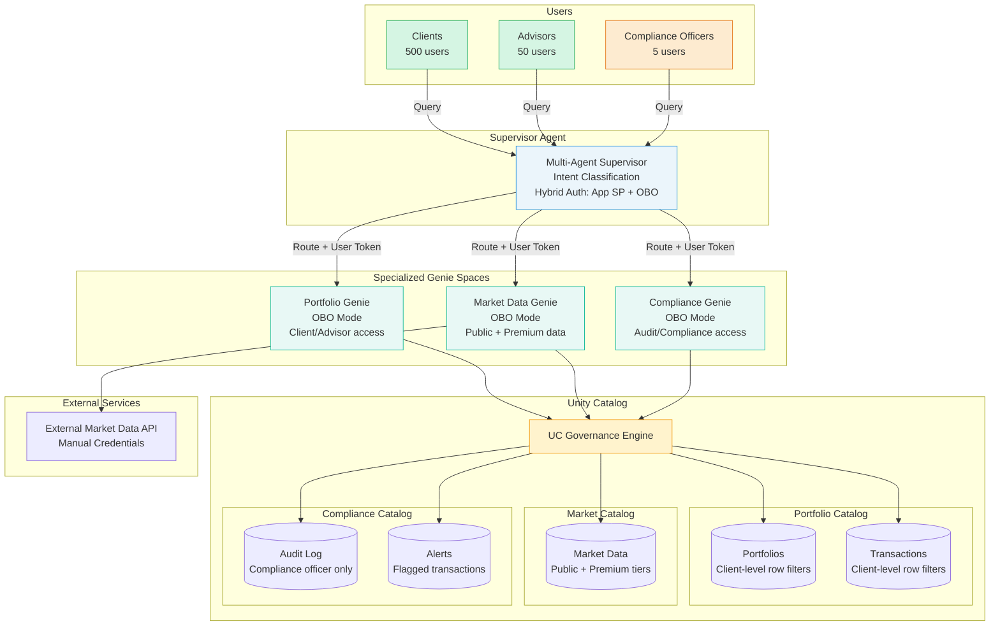

# Multi-Agent Supervisor: Coordinating Multiple Genie Spaces

> **Financial advisory platform where supervisor agent routes queries to specialized Genie Spaces with hybrid authentication**

**Official Use Case:** [Multi-Agent Supervisor](https://docs.databricks.com/aws/en/generative-ai/agent-bricks/multi-agent-supervisor) - Design a multi-agent AI system that brings Genie spaces and agents together

---

## 📋 Scenario Overview

**Problem Statement:**
Financial advisory firm needs an intelligent assistant where a supervisor agent routes client queries to specialized Genie Spaces (Portfolios, Market Data, Compliance) based on intent. Advisors see all client data, clients see only their own portfolios, and all interactions are logged for regulatory audit requirements.

**Business Requirements:**
- ✅ Single entry point (supervisor agent) for all queries
- ✅ Intelligent routing to specialized Genie Spaces
- ✅ Hierarchical access: Clients see only their portfolios, advisors see their assigned clients
- ✅ Compliance officer sees all interactions for audit
- ✅ Real-time market data integration
- ✅ Audit trail for regulatory audit requirements
- ✅ Support 50 advisors and 500 clients
- ✅ Response time < 3 seconds for portfolio queries

**Example Queries:**
```text
Client: "What's my portfolio performance this quarter?"
  → Routes to Portfolio Genie → Shows client's portfolio only

Advisor: "Show my client John's allocation vs benchmark"
  → Routes to Portfolio Genie → Shows advisor's client data

Advisor: "What's the latest Fed rate decision impact?"
  → Routes to Market Data Genie → Shows public market data

Compliance: "Show all trades for client X in the last 30 days"
  → Routes to Compliance Genie → Full audit access
```

---

## 🏗️ Architecture



---

## 📊 Data Model

### Catalog Structure

```sql
-- Three separate catalogs for clear domain separation

-- Catalog 1: Portfolio data
portfolio_catalog
├── holdings
│   ├── positions             -- Current holdings (client-level access)
│   ├── transactions          -- Trade history (client-level access)
│   └── performance           -- Returns, benchmarks (client-level access)
└── clients
    ├── client_profiles       -- Client info (advisor + compliance)
    └── advisor_assignments   -- Which advisor manages which client

-- Catalog 2: Market data
market_catalog
├── realtime
│   ├── quotes                -- Real-time quotes (public + premium)
│   └── news                  -- Market news (public + premium)
└── reference
    ├── securities            -- Security master
    └── benchmarks            -- Market indices

-- Catalog 3: Compliance data
compliance_catalog
├── audit
│   ├── trade_audit           -- All trades (compliance only)
│   └── access_log            -- User access log (compliance only)
└── alerts
    ├── trading_alerts        -- Unusual activity (compliance only)
    └── compliance_flags      -- Regulatory flags (compliance only)
```

### Portfolio Holdings Table

```sql
CREATE TABLE portfolio_catalog.holdings.positions (
    position_id STRING,
    client_id STRING,
    client_email STRING,          -- For row filter
    advisor_email STRING,         -- For hierarchical access
    security_id STRING,
    security_name STRING,
    quantity DECIMAL(15,4),
    cost_basis DECIMAL(15,2),
    current_value DECIMAL(15,2),
    unrealized_gain_loss DECIMAL(15,2),
    as_of_date DATE,
    account_type STRING,          -- 'taxable', 'ira', '401k'
    created_timestamp TIMESTAMP
)
PARTITIONED BY (client_id);
```

### Transactions Table

```sql
CREATE TABLE portfolio_catalog.holdings.transactions (
    transaction_id STRING,
    client_id STRING,
    client_email STRING,
    advisor_email STRING,
    security_id STRING,
    transaction_type STRING,      -- 'buy', 'sell', 'dividend'
    quantity DECIMAL(15,4),
    price DECIMAL(15,2),
    total_amount DECIMAL(15,2),
    commission DECIMAL(15,2),
    transaction_date TIMESTAMP,
    settlement_date DATE,
    created_timestamp TIMESTAMP
)
PARTITIONED BY (client_id, DATE(transaction_date));
```

---

## 🔐 Unity Catalog Configuration

### Hierarchical Access Control

#### Portfolio Access Function

```sql
-- Function: Hierarchical access for portfolio data
CREATE FUNCTION portfolio_catalog.holdings.can_access_portfolio(
    record_client_email STRING,
    record_advisor_email STRING
)
RETURNS BOOLEAN
COMMENT 'ABAC: Clients see own data, advisors see their clients, compliance sees all'
RETURN
    CASE
        -- Compliance officers see everything
        WHEN is_member('compliance-officers') THEN true

        -- Advisors see their assigned clients' data
        WHEN is_member('advisors') AND record_advisor_email = current_user() THEN true

        -- Clients see only their own data
        WHEN is_member('clients') AND record_client_email = current_user() THEN true

        -- Default deny
        ELSE false
    END;

-- Apply to positions table
ALTER TABLE portfolio_catalog.holdings.positions
  SET ROW FILTER portfolio_catalog.holdings.can_access_portfolio
  ON (client_email, advisor_email);

-- Apply to transactions table
ALTER TABLE portfolio_catalog.holdings.transactions
  SET ROW FILTER portfolio_catalog.holdings.can_access_portfolio
  ON (client_email, advisor_email);
```

#### Market Data Access Function

```sql
-- Function: Tiered access to market data
CREATE FUNCTION market_catalog.realtime.can_access_market_data(
    data_tier STRING  -- 'public', 'premium'
)
RETURNS BOOLEAN
COMMENT 'Tiered market data access'
RETURN
    CASE
        -- Premium data: advisors and compliance
        WHEN data_tier = 'premium' AND
             (is_member('advisors') OR is_member('compliance-officers')) THEN true

        -- Public data: everyone
        WHEN data_tier = 'public' THEN true

        -- Default deny
        ELSE false
    END;

-- Apply to quotes table
ALTER TABLE market_catalog.realtime.quotes
  SET ROW FILTER market_catalog.realtime.can_access_market_data
  ON (data_tier);
```

#### Compliance Data Access

```sql
-- Function: Compliance-only access
CREATE FUNCTION compliance_catalog.audit.compliance_only()
RETURNS BOOLEAN
COMMENT 'Compliance officers only'
RETURN is_member('compliance-officers');

-- Apply to all compliance tables
ALTER TABLE compliance_catalog.audit.trade_audit
  SET ROW FILTER compliance_catalog.audit.compliance_only ON ();

ALTER TABLE compliance_catalog.audit.access_log
  SET ROW FILTER compliance_catalog.audit.compliance_only ON ();

ALTER TABLE compliance_catalog.alerts.trading_alerts
  SET ROW FILTER compliance_catalog.audit.compliance_only ON ();
```

---

## 🤖 Multi-Agent Supervisor Implementation

### Supervisor Agent Code

```python
# supervisor_agent.py
from databricks.agents import MultiAgentSupervisor
from databricks.sdk import WorkspaceClient
import re

class FinancialAdvisorSupervisor(MultiAgentSupervisor):
    """
    Supervisor agent that routes queries to specialized Genie Spaces.

    Auth Strategy:
    - Intent classification: Uses app service principal (no user data needed)
    - Genie routing: Forwards user token (OBO) for UC enforcement
    """

    def __init__(self, config):
        super().__init__(config)

        # Genie Space configurations
        self.genies = {
            "portfolio": {
                "space_id": "portfolio-genie-space",
                "catalog": "portfolio_catalog",
                "keywords": ["portfolio", "holdings", "performance", "allocation", "balance"]
            },
            "market": {
                "space_id": "market-data-genie-space",
                "catalog": "market_catalog",
                "keywords": ["market", "price", "quote", "news", "fed", "rate", "index"]
            },
            "compliance": {
                "space_id": "compliance-genie-space",
                "catalog": "compliance_catalog",
                "keywords": ["audit", "compliance", "trades", "alerts", "flagged"]
            }
        }

    def predict(self, inputs, context):
        """
        Main prediction method:
        1. Classify intent (uses app SP - no user data)
        2. Route to appropriate Genie (forwards user token)
        """
        query = inputs.get("query")
        user_token = context.user_token
        user_email = context.user_email

        # Step 1: Classify intent (app SP - no UC queries)
        intent = self._classify_intent(query)

        # Step 2: Route to Genie with user token
        genie_response = self._route_to_genie(
            intent=intent,
            query=query,
            user_token=user_token
        )

        # Step 3: Log for compliance (write to audit table)
        self._log_interaction(
            user_email=user_email,
            query=query,
            intent=intent,
            genie_used=intent
        )

        return {
            "answer": genie_response["answer"],
            "sources": genie_response.get("sources", []),
            "genie_used": intent,
            "note": f"Query routed to {intent.title()} Genie (user: {user_email})"
        }

    def _classify_intent(self, query):
        """
        Classify query intent using keyword matching + LLM.
        Uses app SP (no user data needed).
        """
        query_lower = query.lower()

        # Simple keyword matching (can enhance with LLM classifier)
        for intent, config in self.genies.items():
            for keyword in config["keywords"]:
                if keyword in query_lower:
                    return intent

        # Default to portfolio for ambiguous queries
        return "portfolio"

    def _route_to_genie(self, intent, query, user_token):
        """
        Route query to appropriate Genie Space.
        Forwards user token for OBO authentication.
        """
        genie_config = self.genies[intent]

        # Initialize user-authenticated client
        w = WorkspaceClient(token=user_token)

        # Call Genie Space API with user token
        # Genie will enforce UC row filters based on user
        response = w.genie.query(
            space_id=genie_config["space_id"],
            query=query
        )

        return {
            "answer": response.get("text"),
            "sources": response.get("sources", [])
        }

    def _log_interaction(self, user_email, query, intent, genie_used):
        """
        Log interaction to compliance audit table.
        Uses service principal with INSERT permission.
        """
        from pyspark.sql import SparkSession
        from pyspark.sql.functions import current_timestamp
        import uuid

        spark = SparkSession.builder.getOrCreate()

        log_df = spark.createDataFrame([{
            "interaction_id": str(uuid.uuid4()),
            "user_email": user_email,
            "query_text": query,
            "intent_classified": intent,
            "genie_used": genie_used,
            "timestamp": current_timestamp()
        }])

        # Write to compliance audit log
        log_df.write.format("delta").mode("append").saveAsTable(
            "compliance_catalog.audit.access_log"
        )
```

---

## 🔮 Genie Space Configurations

### Portfolio Genie

```sql
-- Genie Space: Portfolio Genie
-- Catalog: portfolio_catalog
-- Instructions:

"You are a portfolio management assistant.

**Data Access:**
- Clients see only their own portfolio data
- Advisors see their assigned clients' data
- Compliance officers see all portfolios

**Common Queries:**
- Portfolio performance: 'What's my YTD return?'
- Holdings: 'Show my current positions'
- Allocation: 'What's my asset allocation?'
- Transactions: 'Show my recent trades'

**Guidelines:**
- Always include comparison to relevant benchmark
- Show percentage gains/losses and dollar amounts
- For advisors: Specify client name in response
- Cite specific holdings when relevant"
```

### Market Data Genie

```sql
-- Genie Space: Market Data Genie
-- Catalog: market_catalog
-- Instructions:

"You are a market data assistant.

**Data Access:**
- Public data: All users
- Premium data: Advisors and compliance only

**Common Queries:**
- Current prices: 'What's the current price of AAPL?'
- Market news: 'Latest market news about tech sector'
- Indices: 'How are the major indices performing today?'
- Economic data: 'What was the latest Fed decision?'

**Guidelines:**
- Always include timestamp for quotes
- Distinguish between real-time and delayed data
- Include source attribution for news
- For premium data queries from clients: Politely inform data tier restriction"
```

### Compliance Genie

```sql
-- Genie Space: Compliance Genie
-- Catalog: compliance_catalog
-- Instructions:

"You are a compliance and audit assistant.

**Data Access:**
- Compliance officers only

**Common Queries:**
- Trade audit: 'Show all trades for client X in date range'
- Alerts: 'Show flagged transactions this week'
- Access logs: 'Who accessed portfolio data for client Y?'
- Regulatory reports: 'Generate FINRA report for Q4'

**Guidelines:**
- Include full audit trail details
- Flag any suspicious patterns
- Include timestamps in UTC
- Format for regulatory submission requirements when applicable"
```

---

## 🚀 Deployment

### Step 1: Deploy Genie Spaces

```python
# Create three Genie Spaces (via UI or API)

# 1. Portfolio Genie
portfolio_genie = create_genie_space(
    name="Portfolio Genie",
    catalog="portfolio_catalog",
    warehouse_id="<serverless-warehouse-id>",
    instructions="<portfolio instructions>"
)

# 2. Market Data Genie
market_genie = create_genie_space(
    name="Market Data Genie",
    catalog="market_catalog",
    warehouse_id="<serverless-warehouse-id>",
    instructions="<market instructions>"
)

# 3. Compliance Genie
compliance_genie = create_genie_space(
    name="Compliance Genie",
    catalog="compliance_catalog",
    warehouse_id="<serverless-warehouse-id>",
    instructions="<compliance instructions>"
)
```

### Step 2: Deploy Supervisor Agent

```python
# deploy_supervisor.py
import mlflow
from databricks.sdk import WorkspaceClient

w = WorkspaceClient()

# Log supervisor agent
with mlflow.start_run():
    mlflow.pyfunc.log_model(
        artifact_path="supervisor",
        python_model=FinancialAdvisorSupervisor(config={
            "warehouse_id": "<serverless-warehouse-id>"
        }),
        pip_requirements=[
            "databricks-agents",
            "databricks-sdk"
        ]
    )

    model_uri = mlflow.get_artifact_uri("supervisor")

# Register model
model_version = mlflow.register_model(
    model_uri=model_uri,
    name="financial_advisor_supervisor"
)

# Deploy serving endpoint
endpoint = w.serving_endpoints.create(
    name="financial-advisor-assistant",
    config={
        "served_models": [{
            "model_name": "financial_advisor_supervisor",
            "model_version": model_version.version,
            "workload_size": "Small",
            "scale_to_zero_enabled": True
        }]
    }
)

print(f"Supervisor deployed: {endpoint.name}")
```

---

## ✅ Testing

### Test Scenarios

| User | Query | Expected Routing | Expected Access |
|------|-------|------------------|-----------------|
| Client | "My portfolio balance?" | Portfolio Genie | Own portfolio only |
| Advisor | "Show John's allocation" | Portfolio Genie | Assigned client data |
| Advisor | "Latest Fed rate?" | Market Data Genie | Premium market data |
| Client | "Apple stock price?" | Market Data Genie | Public data only |
| Compliance | "Audit client X trades" | Compliance Genie | All trade history |
| Client | "Show all client trades" | Compliance Genie | Access denied (not compliance officer) |

### End-to-End Test

```python
# test_supervisor.py
from databricks.sdk import WorkspaceClient

w = WorkspaceClient()

# Test 1: Client portfolio query
client_response = w.serving_endpoints.query(
    name="financial-advisor-assistant",
    inputs={
        "query": "What's my portfolio performance this quarter?"
    }
)

print(f"Routing: {client_response['genie_used']}")  # Should be: "portfolio"
print(f"Answer: {client_response['answer']}")

# Test 2: Market data query
market_response = w.serving_endpoints.query(
    name="financial-advisor-assistant",
    inputs={
        "query": "What's the current S&P 500 level?"
    }
)

print(f"Routing: {market_response['genie_used']}")  # Should be: "market"
```

---

## 📊 Monitoring & Compliance

### Audit Dashboard

```sql
-- Query 1: Usage by user role
SELECT
    CASE
        WHEN is_member('compliance-officers') THEN 'Compliance'
        WHEN is_member('advisors') THEN 'Advisor'
        WHEN is_member('clients') THEN 'Client'
    END as user_role,
    genie_used,
    COUNT(*) as query_count,
    DATE(timestamp) as date
FROM compliance_catalog.audit.access_log
WHERE datediff(now(), timestamp) <= 30
GROUP BY user_role, genie_used, DATE(timestamp)
ORDER BY date DESC, query_count DESC;

-- Query 2: Unusual access patterns (compliance alert)
SELECT
    user_email,
    COUNT(*) as query_count,
    COUNT(DISTINCT genie_used) as unique_genies_accessed
FROM compliance_catalog.audit.access_log
WHERE datediff(now(), timestamp) <= 1
GROUP BY user_email
HAVING query_count > 100  -- Alert if > 100 queries/day
ORDER BY query_count DESC;
```

---

## 🚀 Deployment Checklist

- [ ] Create three UC catalogs (portfolio, market, compliance)
- [ ] Create tables with partitioning
- [ ] Create and apply ABAC functions
- [ ] Grant permissions to user groups
- [ ] Create three Genie Spaces
- [ ] Deploy supervisor agent endpoint
- [ ] Test routing logic
- [ ] Test UC row filters per user role
- [ ] Set up compliance audit logging
- [ ] Configure monitoring dashboards
- [ ] Train advisors and compliance team
- [ ] Document client-facing query examples

---

## 🔗 Related Scenarios

- **[Genie Multi-Team](../05-GENIE-SPACE/standalone-multi-team.md)** - Team-based Genie access
- **[Databricks App with Agent and Genie](../../scenarios/hybrid/01-APP-WITH-AGENT-AND-GENIE.md)** - Full platform integration

---

**Next Step:** Ready to build a complete platform? See [App with Agent and Genie](../../scenarios/hybrid/01-APP-WITH-AGENT-AND-GENIE.md).
