# Genie Space: Multi-Team Access

> **Multiple teams share a Genie Space for analytics, each team sees only their authorized data**

**Official Use Case:** [AI/BI Genie](https://docs.databricks.com/aws/en/genie/) - Turn your tables into an expert AI chatbot

---

## 📋 Scenario Overview

**Problem Statement:**  
Sales, Marketing, and Finance teams need to query revenue data using natural language, but each team should only see data relevant to their function and responsibilities.

**Business Requirements:**
- ✅ All teams use a single Genie Space (no separate deployments)
- ✅ Sales team sees all opportunities and pipeline metrics
- ✅ Marketing team sees campaign attribution and lead sources
- ✅ Finance team sees closed deals and revenue recognition
- ✅ Executives see aggregated metrics across all teams
- ✅ Users get real-time answers via natural language queries
- ✅ Audit trail tracks who accessed what data

**Example Queries:**
```text
Sales Rep: "What are my top 3 opportunities by value?"
Marketing Analyst: "Show conversion rates for Q4 campaigns"
Finance Controller: "What's the recognized revenue for December?"
Executive: "Show total pipeline value across all teams"
```

---

## 🏗️ Architecture

```mermaid
flowchart TD
    subgraph Users
        SR[Sales Rep<br/>sales-team group]
        MA[Marketing Analyst<br/>marketing-team group]
        FC[Finance Controller<br/>finance-team group]
        EX[Executive<br/>executives group]
    end
    
    subgraph "Genie Space"
        GS[Revenue Analytics Genie<br/>OBO Mode]
    end
    
    subgraph "Unity Catalog"
        UC[UC Governance Engine]
        RF[Row Filters]
        CM[Column Masks]
    end
    
    subgraph "Data Layer"
        OPP[(Opportunities Table<br/>team-based filters)]
        CAMP[(Campaigns Table<br/>team-based filters)]
        REV[(Revenue Table<br/>sensitivity masks)]
    end
    
    SR -->|Query| GS
    MA -->|Query| GS
    FC -->|Query| GS
    EX -->|Query| GS
    
    GS -->|current_user&#40;&#41;| UC
    
    UC -->|Apply team filters| RF
    UC -->|Apply sensitivity masks| CM
    
    RF --> OPP
    RF --> CAMP
    CM --> REV
    
    style SR fill:#d5f5e3,stroke:#27ae60
    style MA fill:#d5f5e3,stroke:#27ae60
    style FC fill:#d5f5e3,stroke:#27ae60
    style EX fill:#fdebd0,stroke:#e67e22
    style GS fill:#ebf5fb,stroke:#3498db
    style UC fill:#e8f8f5,stroke:#1abc9c
```



---

## 📊 Data Model

### Catalog Structure

```sql
-- Catalog: revenue_analytics
-- Schema: sales, marketing, finance, shared
-- Tables: Opportunities, Campaigns, Revenue, Customers

revenue_analytics
├── sales
│   ├── opportunities           -- Sales pipeline data
│   └── customer_interactions   -- Sales touchpoints
├── marketing
│   ├── campaigns              -- Campaign performance
│   └── lead_attribution       -- Lead sources
├── finance
│   ├── revenue                -- Revenue recognition
│   └── invoices               -- Billing data
└── shared
    ├── customers              -- Shared customer master
    └── products               -- Product catalog
```

### Sample Tables

**Opportunities Table:**
```sql
CREATE TABLE revenue_analytics.sales.opportunities (
    opportunity_id STRING,
    owner_email STRING,          -- Sales rep who owns it
    team STRING,                 -- 'sales', 'marketing', 'finance'
    customer_name STRING,
    product STRING,
    amount DECIMAL(15,2),
    stage STRING,                -- 'prospecting', 'qualified', 'closed_won', etc.
    probability INT,
    expected_close_date DATE,
    lead_source STRING,          -- 'web', 'referral', 'campaign'
    campaign_id STRING,          -- Link to marketing campaigns
    created_date DATE,
    last_modified_date TIMESTAMP
);
```

**Campaigns Table:**
```sql
CREATE TABLE revenue_analytics.marketing.campaigns (
    campaign_id STRING,
    campaign_name STRING,
    channel STRING,              -- 'email', 'social', 'search', 'events'
    budget DECIMAL(15,2),
    spend DECIMAL(15,2),
    leads_generated INT,
    opportunities_created INT,
    revenue_attributed DECIMAL(15,2),
    start_date DATE,
    end_date DATE,
    created_by STRING            -- Marketing user email
);
```

**Revenue Table:**
```sql
CREATE TABLE revenue_analytics.finance.revenue (
    revenue_id STRING,
    opportunity_id STRING,       -- Link to opportunity
    customer_name STRING,
    amount DECIMAL(15,2),
    recognized_amount DECIMAL(15,2),
    recognition_date DATE,
    booking_date DATE,
    fiscal_quarter STRING,
    revenue_type STRING,         -- 'subscription', 'services', 'license'
    sensitivity STRING,          -- 'public', 'internal', 'confidential'
    department STRING            -- For allocation
);
```

---

## 🔐 Unity Catalog Configuration

### Step 1: Create Catalog and Schemas

```sql
-- Create catalog
CREATE CATALOG IF NOT EXISTS revenue_analytics
COMMENT 'Revenue analytics data for Genie Space';

-- Create schemas
CREATE SCHEMA IF NOT EXISTS revenue_analytics.sales
COMMENT 'Sales team data';

CREATE SCHEMA IF NOT EXISTS revenue_analytics.marketing
COMMENT 'Marketing team data';

CREATE SCHEMA IF NOT EXISTS revenue_analytics.finance
COMMENT 'Finance team data';

CREATE SCHEMA IF NOT EXISTS revenue_analytics.shared
COMMENT 'Shared reference data';
```

### Step 2: Grant Catalog/Schema Permissions

```sql
-- Grant catalog access to all teams
GRANT USE CATALOG ON CATALOG revenue_analytics 
  TO `sales-team`, `marketing-team`, `finance-team`, `executives`;

-- Grant schema access based on team
GRANT USE SCHEMA ON SCHEMA revenue_analytics.sales TO `sales-team`, `executives`;
GRANT USE SCHEMA ON SCHEMA revenue_analytics.marketing TO `marketing-team`, `executives`;
GRANT USE SCHEMA ON SCHEMA revenue_analytics.finance TO `finance-team`, `executives`;
GRANT USE SCHEMA ON SCHEMA revenue_analytics.shared 
  TO `sales-team`, `marketing-team`, `finance-team`, `executives`;
```

### Step 3: Grant Table Permissions

```sql
-- Sales team: Read opportunities
GRANT SELECT ON TABLE revenue_analytics.sales.opportunities TO `sales-team`, `executives`;

-- Marketing team: Read campaigns and opportunities (for attribution)
GRANT SELECT ON TABLE revenue_analytics.marketing.campaigns TO `marketing-team`, `executives`;
GRANT SELECT ON TABLE revenue_analytics.sales.opportunities TO `marketing-team`, `executives`;

-- Finance team: Read revenue and opportunities
GRANT SELECT ON TABLE revenue_analytics.finance.revenue TO `finance-team`, `executives`;
GRANT SELECT ON TABLE revenue_analytics.sales.opportunities TO `finance-team`, `executives`;

-- Shared tables: All teams
GRANT SELECT ON TABLE revenue_analytics.shared.customers 
  TO `sales-team`, `marketing-team`, `finance-team`, `executives`;
GRANT SELECT ON TABLE revenue_analytics.shared.products 
  TO `sales-team`, `marketing-team`, `finance-team`, `executives`;
```

### Step 4: Create Row Filter Functions

**Team-Based Filter for Opportunities:**

```sql
-- Function: Filter opportunities by team membership
CREATE FUNCTION revenue_analytics.sales.filter_opportunities(
    owner STRING,
    team STRING
)
RETURNS BOOLEAN
COMMENT 'Row filter: Users see opportunities based on team membership and ownership'
RETURN 
    CASE 
        -- Sales team members see:
        --   - Own opportunities
        --   - Team opportunities if in same team
        WHEN is_member('sales-team') AND (owner = current_user() OR team = 'sales') THEN true
        
        -- Marketing team sees opportunities tied to their campaigns
        WHEN is_member('marketing-team') AND team = 'marketing' THEN true
        
        -- Finance team sees closed opportunities only
        WHEN is_member('finance-team') AND team = 'finance' THEN true
        
        -- Executives see all
        WHEN is_member('executives') THEN true
        
        -- Default deny
        ELSE false
    END;

-- Apply row filter to opportunities table
ALTER TABLE revenue_analytics.sales.opportunities
  SET ROW FILTER revenue_analytics.sales.filter_opportunities 
  ON (owner_email, team);
```

**Team-Based Filter for Campaigns:**

```sql
-- Function: Filter campaigns by creator
CREATE FUNCTION revenue_analytics.marketing.filter_campaigns(creator STRING)
RETURNS BOOLEAN
COMMENT 'Row filter: Marketing users see their campaigns, executives see all'
RETURN 
    CASE 
        -- Marketing team sees own campaigns
        WHEN is_member('marketing-team') AND creator = current_user() THEN true
        
        -- Executives see all campaigns
        WHEN is_member('executives') THEN true
        
        -- Default deny
        ELSE false
    END;

-- Apply row filter
ALTER TABLE revenue_analytics.marketing.campaigns
  SET ROW FILTER revenue_analytics.marketing.filter_campaigns 
  ON (created_by);
```

### Step 5: Create Column Masks

**Revenue Amount Masking:**

```sql
-- Function: Mask sensitive revenue amounts
CREATE FUNCTION revenue_analytics.finance.mask_revenue_amount()
RETURNS DECIMAL(15,2)
COMMENT 'Column mask: Show full amounts to finance/execs, aggregated to others'
RETURN 
    CASE 
        -- Finance team and executives see actual amounts
        WHEN is_member('finance-team') OR is_member('executives') THEN VALUE
        
        -- Others see rounded amounts (less precision)
        WHEN is_member('sales-team') OR is_member('marketing-team') THEN ROUND(VALUE, -3)
        
        -- Default: NULL
        ELSE NULL
    END;

-- Apply column mask
ALTER TABLE revenue_analytics.finance.revenue
  ALTER COLUMN amount
  SET MASK revenue_analytics.finance.mask_revenue_amount;

ALTER TABLE revenue_analytics.finance.revenue
  ALTER COLUMN recognized_amount
  SET MASK revenue_analytics.finance.mask_revenue_amount;
```

---

## 🎯 Genie Space Setup

### Step 1: Create Genie Space

```python
# Via Databricks UI or API
# Navigate to: SQL Workspace -> Genie Spaces -> Create

# Configuration:
# - Name: "Revenue Analytics"
# - Description: "Natural language queries for sales, marketing, and finance data"
# - Catalogs: revenue_analytics
# - SQL Warehouse: <select-serverless-warehouse>
```

### Step 2: Configure Genie Instructions

```text
Genie Instructions (to improve query understanding):

You are a revenue analytics assistant for a B2B company. 
You help sales, marketing, and finance teams analyze pipeline and revenue data.

Common terms:
- "Pipeline" = sum of opportunity amounts in stages before 'closed_won'
- "Closed deals" = opportunities with stage = 'closed_won'
- "Conversion rate" = (closed_won opportunities / total opportunities) * 100
- "Q1/Q2/Q3/Q4" = fiscal quarters matching calendar year

Data access:
- Sales team: sees all sales opportunities
- Marketing team: sees campaigns and attributed opportunities
- Finance team: sees revenue and closed deals
- Executives: see all data

When showing revenue figures:
- Always specify the time period
- Break down by team/department when relevant
- Highlight trends (increase/decrease from prior period)
```

### Step 3: Test Queries

Grant access to test users from each team and validate:

```sql
-- Test query examples that Genie should handle:

-- Sales Rep Query:
"Show my open opportunities worth more than $100K"
-- Translates to:
SELECT opportunity_id, customer_name, amount, stage
FROM revenue_analytics.sales.opportunities
WHERE owner_email = current_user()
  AND stage NOT IN ('closed_won', 'closed_lost')
  AND amount > 100000
ORDER BY amount DESC;

-- Marketing Analyst Query:
"What's the ROI for my Q4 email campaigns?"
-- Translates to:
SELECT 
    campaign_name,
    budget,
    spend,
    revenue_attributed,
    ROUND((revenue_attributed - spend) / spend * 100, 2) as roi_percent
FROM revenue_analytics.marketing.campaigns
WHERE created_by = current_user()
  AND channel = 'email'
  AND start_date >= '2025-10-01'
  AND end_date <= '2025-12-31'
ORDER BY roi_percent DESC;

-- Finance Controller Query:
"Show recognized revenue by quarter for FY2025"
-- Translates to:
SELECT 
    fiscal_quarter,
    SUM(recognized_amount) as total_recognized
FROM revenue_analytics.finance.revenue
WHERE fiscal_quarter LIKE '2025-%'
GROUP BY fiscal_quarter
ORDER BY fiscal_quarter;

-- Executive Query:
"Total pipeline value across all teams"
-- Translates to:
SELECT 
    team,
    COUNT(*) as opportunity_count,
    SUM(amount) as total_pipeline
FROM revenue_analytics.sales.opportunities
WHERE stage NOT IN ('closed_won', 'closed_lost')
GROUP BY team
ORDER BY total_pipeline DESC;
```

---

## ✅ Validation & Testing

### Test Plan

**Test Users:**
- `alice@company.com` (sales-team)
- `bob@company.com` (marketing-team)
- `carol@company.com` (finance-team)
- `david@company.com` (executives)

**Test Cases:**

| User | Query | Expected Result | UC Policy |
|------|-------|-----------------|-----------|
| alice@company.com | "My opportunities" | Only Alice's opportunities | Row filter by owner |
| bob@company.com | "Campaign performance" | Only Bob's campaigns | Row filter by creator |
| carol@company.com | "Revenue for Q4" | All revenue (exact amounts) | No row filter, no mask |
| alice@company.com | "Total revenue Q4" | Rounded amounts | Column mask (not finance team) |
| david@company.com | "All opportunities" | All opportunities | Executives bypass filters |

### Validation Queries

```sql
-- Validate row filters are applied
DESCRIBE TABLE EXTENDED revenue_analytics.sales.opportunities;
-- Should show: Row Filter: revenue_analytics.sales.filter_opportunities

-- Validate column masks are applied
SHOW TBLPROPERTIES revenue_analytics.finance.revenue;
-- Should show mask on amount columns

-- Check user group memberships
SHOW CURRENT ROLES;
```

### Audit Queries

```sql
-- Monitor Genie Space usage by team
SELECT 
    user_identity.email,
    request_params.full_name_arg AS table_accessed,
    COUNT(*) as query_count,
    DATE(event_time) as query_date
FROM system.access.audit
WHERE action_name = 'commandSubmit'
  AND request_params.full_name_arg LIKE 'revenue_analytics%'
  AND datediff(now(), event_time) <= 7
GROUP BY user_identity.email, request_params.full_name_arg, DATE(event_time)
ORDER BY query_count DESC;

-- Track failed access attempts (permission denied)
SELECT 
    user_identity.email,
    request_params.full_name_arg AS table_name,
    response.status_code,
    event_time
FROM system.access.audit
WHERE action_name = 'getTable'
  AND response.status_code = 403  -- Forbidden
  AND datediff(now(), event_time) <= 7
ORDER BY event_time DESC;
```

---

## 🚀 Deployment Checklist

### Pre-Deployment

- [ ] Create UC catalog and schemas
- [ ] Create all tables with proper columns
- [ ] Load sample data for testing
- [ ] Create row filter functions
- [ ] Create column mask functions
- [ ] Apply filters and masks to tables
- [ ] Grant catalog/schema/table permissions to groups
- [ ] Verify user group memberships

### Genie Space Setup

- [ ] Create Genie Space in workspace
- [ ] Configure Genie instructions
- [ ] Link to revenue_analytics catalog
- [ ] Select serverless SQL warehouse
- [ ] Test with sample queries

### Testing

- [ ] Test each user persona (sales, marketing, finance, executive)
- [ ] Validate row filters work correctly
- [ ] Validate column masks work correctly
- [ ] Verify audit logs capture access
- [ ] Test common natural language queries
- [ ] Document expected vs actual results

### Post-Deployment

- [ ] Train users on Genie capabilities
- [ ] Share example queries per team
- [ ] Set up monitoring dashboards
- [ ] Configure alerts for failed access
- [ ] Schedule weekly UC policy review
- [ ] Document lessons learned

---

## 📈 Monitoring

### Metrics to Track

**Usage Metrics:**
```sql
-- Daily active users by team
SELECT 
    DATE(event_time) as date,
    CASE 
        WHEN user_identity.email LIKE '%@sales%' THEN 'Sales'
        WHEN user_identity.email LIKE '%@marketing%' THEN 'Marketing'
        WHEN user_identity.email LIKE '%@finance%' THEN 'Finance'
        ELSE 'Other'
    END as team,
    COUNT(DISTINCT user_identity.email) as active_users,
    COUNT(*) as total_queries
FROM system.access.audit
WHERE action_name = 'commandSubmit'
  AND request_params.full_name_arg LIKE 'revenue_analytics%'
  AND datediff(now(), event_time) <= 30
GROUP BY DATE(event_time), team
ORDER BY date DESC, team;
```

**Performance Metrics:**
```sql
-- Query performance by table
SELECT 
    request_params.full_name_arg AS table_name,
    AVG(response.result.duration_ms) as avg_duration_ms,
    MAX(response.result.duration_ms) as max_duration_ms,
    COUNT(*) as query_count
FROM system.access.audit
WHERE action_name = 'commandSubmit'
  AND request_params.full_name_arg LIKE 'revenue_analytics%'
  AND datediff(now(), event_time) <= 7
GROUP BY request_params.full_name_arg
ORDER BY avg_duration_ms DESC;
```

---

## ⚠️ Common Issues & Solutions

### Issue 1: User Can't See Expected Data

**Symptoms:** User queries Genie but gets "no results" or partial data

**Diagnosis:**
```sql
-- Check table permissions
SHOW GRANTS ON TABLE revenue_analytics.sales.opportunities;

-- Check row filter definition
SHOW CREATE FUNCTION revenue_analytics.sales.filter_opportunities;

-- Verify user's group membership
-- (Run as admin)
SELECT * FROM system.access.users WHERE email = '<user-email>';
```

**Solution:**
- Verify user is in correct group (sales-team, marketing-team, etc.)
- Check row filter logic allows user's group
- Ensure GRANT SELECT was applied

### Issue 2: Wrong Data Visible

**Symptoms:** User sees data they shouldn't (security violation)

**Diagnosis:**
```sql
-- Verify row filter is applied
DESCRIBE TABLE EXTENDED revenue_analytics.sales.opportunities;

-- Test filter function directly
SELECT revenue_analytics.sales.filter_opportunities(
    'alice@company.com',  -- owner
    'sales'               -- team
);
```

**Solution:**
- Verify row filter is applied: `ALTER TABLE ... SET ROW FILTER`
- Check filter function logic for gaps
- Test with multiple user personas

### Issue 3: Performance Degradation

**Symptoms:** Queries slow, Genie times out

**Diagnosis:**
```sql
-- Check query execution plans
EXPLAIN SELECT * FROM revenue_analytics.sales.opportunities;

-- Look for missing indexes or partitions
DESCRIBE DETAIL revenue_analytics.sales.opportunities;
```

**Solution:**
- Add partitioning on commonly filtered columns (e.g., created_date)
- Create Z-ORDER indexes on filter columns
- Consider materialized views for common queries
- Optimize row filter functions (avoid complex logic)

---

## 🎓 User Training

### For Sales Team

**Example Queries:**
```text
"Show my opportunities closing this quarter"
"What's my total pipeline value?"
"List customers with opportunities over $500K"
"Which opportunities moved to qualified stage last week?"
```

### For Marketing Team

**Example Queries:**
```text
"Show ROI for my digital campaigns"
"How many leads did the Q4 webinar generate?"
"Compare email vs social campaign performance"
"What's the conversion rate for paid search leads?"
```

### For Finance Team

**Example Queries:**
```text
"Show recognized revenue by quarter"
"What's the revenue breakdown by product?"
"Compare actual vs forecast revenue for Q4"
"Show invoice aging for this month"
```

### For Executives

**Example Queries:**
```text
"Total pipeline across all teams"
"Revenue trend over last 4 quarters"
"Show win rate by team"
"What's the average deal size by product?"
```

---

## 🔗 Related Scenarios

- **[Genie Space at Scale (1000+ users)](standalone-scale.md)** - Handle larger deployments with complex hierarchies
- **[Genie Embedded in App](embedded-in-app.md)** - Integrate Genie into custom app
- **[Knowledge Assistant Multi-Team](../01-KNOWLEDGE-ASSISTANT/multi-team.md)** - Similar pattern for document access

---

## 📚 Additional Resources

- [Unity Catalog Row Filters](https://docs.databricks.com/en/data-governance/unity-catalog/row-and-column-filters.html)
- [Unity Catalog Column Masks](https://docs.databricks.com/en/data-governance/unity-catalog/row-and-column-filters.html#column-masks)
- [Genie Space Documentation](https://docs.databricks.com/aws/en/genie/)
- [UC Audit Logs](https://docs.databricks.com/en/administration-guide/account-settings/audit-logs.html)

---

**Next Step:** Ready for larger scale? See [Genie Space at Scale](standalone-scale.md) for 1000+ users with complex hierarchical access.
