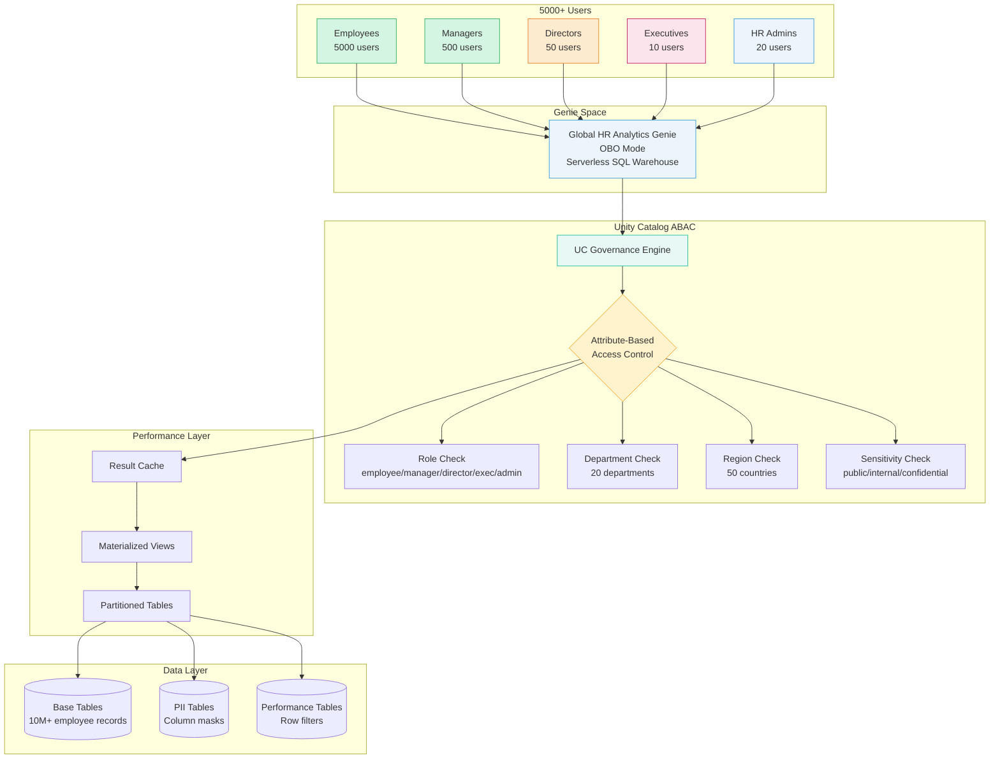

# Genie Space: Large Scale with Complex Governance (1000+ Users)

> **Enterprise-wide Genie Space serving 1000+ users with attribute-based access control and hierarchical permissions**

**Official Use Case:** [AI/BI Genie](https://docs.databricks.com/aws/en/genie/) - Turn your tables into an expert AI chatbot

---

## 📋 Scenario Overview

**Problem Statement:**  
Global organization needs an HR analytics Genie Space where 5000+ employees across 50 countries and 20 departments can query workforce data. Access levels vary by role: employees see only their own data, managers see their team's data, directors see department aggregates, executives see org-wide metrics, and HR admins see everything including PII.

**Business Requirements:**
- ✅ Support 5000+ concurrent users
- ✅ Hierarchical access: Employee → Manager → Director → Executive → HR Admin
- ✅ Multi-dimensional security: Department + Region + Role + Sensitivity
- ✅ PII/PHI masking based on user role
- ✅ Performance SLA: Query response < 5 seconds
- ✅ Compliance: Audit trail for all access (supports regulatory requirements)
- ✅ Cost-effective: Control compute spend across departments

**Example Queries:**
```text
Employee: "What's my PTO balance?"
Manager: "Show team performance ratings for Q4"
Director: "Compare engineering headcount across regions"
Executive: "What's the global attrition rate trend?"
HR Admin: "Show all employees with expiring visas"
```

---

## 🏗️ Architecture



---

## 📊 Data Model

### Catalog Structure

```sql
-- Catalog: hr_analytics
-- Multi-tenant with 5000+ users, 20 departments, 50 countries

hr_analytics
├── employees
│   ├── core_data              -- Employee master (10M records)
│   ├── compensation           -- Salary, bonus (PII masked)
│   ├── performance            -- Ratings, goals (hierarchical access)
│   └── attendance             -- PTO, sick leave (personal data)
├── organization
│   ├── departments            -- Org structure
│   ├── locations              -- Offices, regions
│   └── cost_centers           -- Budget allocation
├── analytics
│   ├── headcount_mv           -- Materialized view for fast queries
│   ├── attrition_mv           -- Pre-aggregated attrition metrics
│   └── diversity_mv           -- Diversity metrics (aggregated only)
└── audit
    ├── access_log             -- UC audit integration
    └── query_log              -- Genie query history
```

### Core Employee Table

```sql
CREATE TABLE hr_analytics.employees.core_data (
    employee_id STRING,
    email STRING,
    first_name STRING,
    last_name STRING,
    manager_email STRING,         -- Hierarchical relationship
    department STRING,            -- 20 departments
    sub_department STRING,
    job_title STRING,
    job_level INT,                -- 1 (entry) to 10 (C-level)
    region STRING,                -- AMER, EMEA, APAC
    country STRING,               -- 50 countries
    office_location STRING,
    hire_date DATE,
    employment_status STRING,     -- active, terminated, leave
    termination_date DATE,
    employee_type STRING,         -- full-time, part-time, contractor
    cost_center STRING,
    data_sensitivity STRING,      -- 'public', 'internal', 'confidential'
    created_date DATE,
    last_modified TIMESTAMP
)
PARTITIONED BY (country, department)  -- Performance optimization
TBLPROPERTIES ('delta.autoOptimize.optimizeWrite' = 'true');
```

### Compensation Table (PII)

```sql
CREATE TABLE hr_analytics.employees.compensation (
    employee_id STRING,
    email STRING,
    base_salary DECIMAL(15,2),    -- Masked for non-HR
    currency STRING,
    bonus_target DECIMAL(15,2),
    equity_grants INT,
    total_compensation DECIMAL(15,2),
    salary_band STRING,           -- Visible to managers
    effective_date DATE,
    review_date DATE,
    department STRING,
    data_sensitivity STRING DEFAULT 'confidential'
)
PARTITIONED BY (department);
```

### Performance Table

```sql
CREATE TABLE hr_analytics.employees.performance (
    employee_id STRING,
    email STRING,
    manager_email STRING,
    review_period STRING,         -- '2025-Q4', '2025-Annual'
    performance_rating INT,       -- 1-5
    goal_completion_pct INT,
    promotion_eligible BOOLEAN,
    pip_status BOOLEAN,           -- Performance improvement plan
    comments STRING,              -- Manager comments (very sensitive)
    reviewer_email STRING,
    review_date DATE,
    department STRING,
    data_sensitivity STRING DEFAULT 'confidential'
)
PARTITIONED BY (review_period);
```

---

## 🔐 Unity Catalog ABAC Configuration

### Attribute-Based Access Control Functions

#### Function 1: Hierarchical Employee Access

```sql
-- Core ABAC function: Determines if user can see employee record
CREATE FUNCTION hr_analytics.employees.can_access_employee(
    record_email STRING,
    record_manager STRING,
    record_department STRING,
    record_region STRING,
    record_sensitivity STRING,
    record_level INT
)
RETURNS BOOLEAN
COMMENT 'ABAC: Hierarchical access with multi-dimensional checks'
RETURN 
    CASE 
        -- HR Admins see everything
        WHEN is_member('hr-admins') THEN true
        
        -- Executives see all except individual PII
        WHEN is_member('executives') AND record_sensitivity != 'confidential' THEN true
        
        -- Directors see department aggregates
        WHEN is_member('directors') AND 
             is_member(CONCAT(record_department, '-directors')) AND
             record_sensitivity IN ('public', 'internal') THEN true
        
        -- Managers see their direct reports
        WHEN is_member('managers') AND 
             record_manager = current_user() THEN true
        
        -- Managers see team aggregates in their department
        WHEN is_member('managers') AND
             is_member(CONCAT(record_department, '-managers')) AND
             record_sensitivity = 'public' THEN true
        
        -- Employees see only their own record
        WHEN record_email = current_user() THEN true
        
        -- Regional data access restrictions (for data residency requirements)
        WHEN record_region = 'EMEA' AND NOT is_member('emea-authorized') THEN false
        
        -- Level-based restrictions (executives data)
        WHEN record_level >= 9 AND NOT is_member('executives') THEN false
        
        -- Default deny
        ELSE false
    END;

-- Apply to core employee table
ALTER TABLE hr_analytics.employees.core_data
  SET ROW FILTER hr_analytics.employees.can_access_employee 
  ON (email, manager_email, department, region, data_sensitivity, job_level);
```

#### Function 2: Compensation Access

```sql
-- Compensation-specific ABAC function
CREATE FUNCTION hr_analytics.employees.can_access_compensation(
    record_email STRING,
    record_department STRING
)
RETURNS BOOLEAN
COMMENT 'ABAC: Compensation data access (highly restricted)'
RETURN 
    CASE 
        -- HR Admins see everything
        WHEN is_member('hr-admins') THEN true
        
        -- HR Analysts see aggregates only (via views, not raw table)
        WHEN is_member('hr-analysts') THEN false  -- Force to use aggregate views
        
        -- Executives see department aggregates (via views)
        WHEN is_member('executives') THEN false  -- Force to use aggregate views
        
        -- Employees see only their own compensation
        WHEN record_email = current_user() THEN true
        
        -- Default deny
        ELSE false
    END;

-- Apply to compensation table
ALTER TABLE hr_analytics.employees.compensation
  SET ROW FILTER hr_analytics.employees.can_access_compensation 
  ON (email, department);
```

#### Function 3: Performance Review Access

```sql
-- Performance review ABAC function
CREATE FUNCTION hr_analytics.employees.can_access_performance(
    record_email STRING,
    record_manager STRING,
    record_department STRING,
    review_period STRING
)
RETURNS BOOLEAN
COMMENT 'ABAC: Performance review access with time-based restrictions'
RETURN 
    CASE 
        -- HR Admins see everything
        WHEN is_member('hr-admins') THEN true
        
        -- Managers see their direct reports
        WHEN is_member('managers') AND record_manager = current_user() THEN true
        
        -- Directors see department aggregates (via views only)
        WHEN is_member('directors') THEN false  -- Force to use aggregate views
        
        -- Employees see their own reviews
        WHEN record_email = current_user() THEN true
        
        -- Time-based: Historical reviews (> 2 years) restricted to HR only
        WHEN CAST(SUBSTRING(review_period, 1, 4) AS INT) < YEAR(current_date()) - 2 
             AND NOT is_member('hr-admins') THEN false
        
        -- Default deny
        ELSE false
    END;

-- Apply to performance table
ALTER TABLE hr_analytics.employees.performance
  SET ROW FILTER hr_analytics.employees.can_access_performance 
  ON (email, manager_email, department, review_period);
```

---

## 🎭 Column Masking for PII

### Salary Masking

```sql
-- Mask salary based on role
CREATE FUNCTION hr_analytics.employees.mask_salary()
RETURNS DECIMAL(15,2)
COMMENT 'Column mask: Progressive salary disclosure'
RETURN 
    CASE 
        -- HR admins see exact values
        WHEN is_member('hr-admins') THEN VALUE
        
        -- Executives see rounded to nearest 10K
        WHEN is_member('executives') THEN ROUND(VALUE, -4)
        
        -- Directors see salary band only (via separate column)
        WHEN is_member('directors') THEN NULL
        
        -- Employees see own exact salary
        -- (row filter ensures they only see own record)
        WHEN is_member('employees') THEN VALUE
        
        -- Default: NULL
        ELSE NULL
    END;

-- Apply mask
ALTER TABLE hr_analytics.employees.compensation
  ALTER COLUMN base_salary
  SET MASK hr_analytics.employees.mask_salary;

ALTER TABLE hr_analytics.employees.compensation
  ALTER COLUMN total_compensation
  SET MASK hr_analytics.employees.mask_salary;
```

### PII Masking (Email, Phone, Address)

```sql
-- Mask personal contact info
CREATE FUNCTION hr_analytics.employees.mask_email()
RETURNS STRING
COMMENT 'Column mask: Email masking for privacy'
RETURN 
    CASE 
        -- HR admins see full email
        WHEN is_member('hr-admins') THEN VALUE
        
        -- Managers see full email for direct reports (row filter handles access)
        WHEN is_member('managers') THEN VALUE
        
        -- Others see masked: "j***@company.com"
        ELSE CONCAT(
            SUBSTRING(VALUE, 1, 1),
            '***@',
            SUBSTRING(VALUE, POSITION('@' IN VALUE) + 1)
        )
    END;

-- Apply mask to email in core_data if needed for general queries
-- (Usually email is needed for joins, so consider carefully)
```

### Performance Comment Masking

```sql
-- Mask manager comments in performance reviews
CREATE FUNCTION hr_analytics.employees.mask_comments()
RETURNS STRING
COMMENT 'Column mask: Hide sensitive manager comments'
RETURN 
    CASE 
        -- HR admins see everything
        WHEN is_member('hr-admins') THEN VALUE
        
        -- Managers see comments for their direct reports
        WHEN is_member('managers') THEN VALUE
        
        -- Employee sees own comments
        -- (row filter ensures they see only their own record)
        WHEN NOT is_member('directors') AND NOT is_member('executives') THEN VALUE
        
        -- Directors/Executives don't see individual comments
        ELSE NULL
    END;

-- Apply mask
ALTER TABLE hr_analytics.employees.performance
  ALTER COLUMN comments
  SET MASK hr_analytics.employees.mask_comments;
```

---

## 📈 Performance Optimization for Scale

### Materialized Views for Common Queries

#### Headcount Dashboard View

```sql
-- Pre-aggregate headcount by department/region/level
CREATE MATERIALIZED VIEW hr_analytics.analytics.headcount_mv AS
SELECT 
    department,
    region,
    country,
    job_level,
    employment_status,
    COUNT(DISTINCT employee_id) as employee_count,
    COUNT(DISTINCT CASE WHEN employment_status = 'active' THEN employee_id END) as active_count,
    current_date() as snapshot_date
FROM hr_analytics.employees.core_data
WHERE employment_status = 'active'
GROUP BY department, region, country, job_level, employment_status;

-- Refresh daily
ALTER MATERIALIZED VIEW hr_analytics.analytics.headcount_mv 
  SET TBLPROPERTIES('pipelines.autoUpdate.enabled' = 'true');

-- Grant access via UC UI: All roles can see aggregated data
-- Navigate to Catalog Explorer → hr_analytics.analytics.headcount_mv → Permissions
-- Grant SELECT to: employees, managers, directors, executives, hr-admins
```

#### Attrition Metrics View

```sql
-- Pre-calculate attrition rates
CREATE MATERIALIZED VIEW hr_analytics.analytics.attrition_mv AS
WITH active_employees AS (
    SELECT 
        department,
        region,
        DATE_TRUNC('month', hire_date) as hire_month,
        COUNT(*) as hires
    FROM hr_analytics.employees.core_data
    WHERE employment_status = 'active'
    GROUP BY department, region, DATE_TRUNC('month', hire_date)
),
terminated_employees AS (
    SELECT 
        department,
        region,
        DATE_TRUNC('month', termination_date) as term_month,
        COUNT(*) as terminations
    FROM hr_analytics.employees.core_data
    WHERE employment_status = 'terminated'
      AND termination_date IS NOT NULL
    GROUP BY department, region, DATE_TRUNC('month', termination_date)
)
SELECT 
    COALESCE(a.department, t.department) as department,
    COALESCE(a.region, t.region) as region,
    COALESCE(a.hire_month, t.term_month) as month,
    COALESCE(a.hires, 0) as hires,
    COALESCE(t.terminations, 0) as terminations,
    ROUND(COALESCE(t.terminations, 0) * 100.0 / NULLIF(COALESCE(a.hires, 0), 0), 2) as attrition_rate_pct
FROM active_employees a
FULL OUTER JOIN terminated_employees t 
    ON a.department = t.department 
    AND a.region = t.region 
    AND a.hire_month = t.term_month;

-- Grant access via UC UI: Management and HR only
-- Navigate to Catalog Explorer → hr_analytics.analytics.attrition_mv → Permissions
-- Grant SELECT to: managers, directors, executives, hr-admins
```

### Table Partitioning Strategy

```sql
-- Partition by country and department for fast filtering
-- Already defined in table creation, but verify:
DESCRIBE DETAIL hr_analytics.employees.core_data;

-- Optimize partitions
OPTIMIZE hr_analytics.employees.core_data 
  ZORDER BY (email, manager_email);

OPTIMIZE hr_analytics.employees.compensation 
  ZORDER BY (email, department);

OPTIMIZE hr_analytics.employees.performance 
  ZORDER BY (email, manager_email, review_period);
```

### Query Result Caching

```sql
-- Enable result caching at warehouse level
-- (Done via UI or API when configuring serverless warehouse)

-- Monitor cache hit rate
SELECT 
    query_start_time,
    query_id,
    cache_hit,
    total_time_ms
FROM system.query.history
WHERE warehouse_id = '<serverless-warehouse-id>'
  AND query_start_time >= current_date() - 7
ORDER BY query_start_time DESC;
```

---

## 🎯 Genie Space Setup

### Step 1: Create Genie Space

```python
# Configuration:
# - Name: "Global HR Analytics"
# - Description: "Self-service HR analytics for all employees"
# - Catalogs: hr_analytics
# - SQL Warehouse: serverless-hr-analytics (auto-scaling)
# - Max concurrent queries: 100 (adjust based on load)
```

### Step 2: Genie Instructions (Critical for Scale)

```text
You are the Global HR Analytics assistant serving 5000+ employees worldwide.

**Data Access Rules:**
- Employees: See only their own records (salary, performance, PTO)
- Managers: See their direct reports' data
- Directors: See aggregated department metrics (no individual PII)
- Executives: See org-wide metrics and trends
- HR Admins: Full access to all data

**Query Optimization:**
- For headcount/attrition queries, use the materialized views in hr_analytics.analytics.*
- Always filter by department or region when possible
- For historical queries (> 2 years), remind users data may be limited

**Privacy & Compliance:**
- Never expose individual salaries to anyone except HR admins and the employee themselves
- Never show performance comments to executives or directors
- Aggregate data to at least 5 employees when showing to directors/executives (k-anonymity)
- For regional data access queries, only access EMEA data if user is authorized

**Common Query Patterns:**
- "My [salary/PTO/performance]" → Direct personal queries
- "Team [headcount/attrition/performance]" → Manager queries about direct reports
- "[Department] metrics" → Director/executive aggregate queries
- "Company-wide [metric]" → Executive strategic queries

**When to Use Materialized Views:**
- Headcount by department: hr_analytics.analytics.headcount_mv
- Attrition rates: hr_analytics.analytics.attrition_mv
- Always prefer MVs over base tables for aggregate queries

**Error Handling:**
- If user tries to access unauthorized data: "You don't have permission to access that level of detail. Try asking for aggregated metrics."
- If query would expose PII incorrectly: "That query would show individual employee data. Please rephrase to ask for aggregated metrics."
```

### Step 3: Example Query Mappings

**Employee Query:**
```text
User: "What's my PTO balance?"

Genie translates to:
SELECT 
    first_name,
    last_name,
    pto_balance_days,
    pto_used_ytd,
    pto_remaining
FROM hr_analytics.employees.attendance
WHERE email = current_user()
  AND year = YEAR(current_date());
```

**Manager Query:**
```text
User: "Show my team's average performance rating for Q4"

Genie translates to:
SELECT 
    AVG(performance_rating) as avg_rating,
    COUNT(*) as team_size,
    review_period
FROM hr_analytics.employees.performance
WHERE manager_email = current_user()
  AND review_period = '2025-Q4'
GROUP BY review_period;
```

**Director Query:**
```text
User: "Engineering headcount by region"

Genie translates to:
SELECT 
    region,
    SUM(active_count) as headcount
FROM hr_analytics.analytics.headcount_mv
WHERE department = 'Engineering'
GROUP BY region
ORDER BY headcount DESC;
```

**Executive Query:**
```text
User: "What's the global attrition trend over the last 12 months?"

Genie translates to:
SELECT 
    month,
    SUM(hires) as total_hires,
    SUM(terminations) as total_terminations,
    ROUND(SUM(terminations) * 100.0 / NULLIF(SUM(hires), 0), 2) as attrition_rate
FROM hr_analytics.analytics.attrition_mv
WHERE month >= ADD_MONTHS(current_date(), -12)
GROUP BY month
ORDER BY month;
```

---

## ✅ Validation & Testing

### Load Testing

```sql
-- Simulate concurrent queries
-- Use Databricks SQL query profiler

-- Test 1: 100 concurrent employee queries (each user queries own data)
-- Expected: < 2 seconds per query

-- Test 2: 50 concurrent manager queries (each queries team of 10)
-- Expected: < 5 seconds per query

-- Test 3: 10 concurrent executive queries (aggregate across org)
-- Expected: < 5 seconds per query (should hit materialized views)
```

### Access Control Testing

| User Role | Test Query | Expected Access | Expected Denial |
|-----------|------------|-----------------|-----------------|
| Employee | "My salary" | Own salary | Other employees' salaries |
| Manager | "Team performance" | Direct reports | Other teams |
| Director | "Engineering headcount" | Aggregates | Individual records |
| Executive | "Global attrition" | All aggregates | Individual PII |
| HR Admin | "All compensation data" | Everything | N/A |

### Performance Benchmarks

```sql
-- Benchmark query: Employee self-query
-- Target: < 500ms
EXPLAIN ANALYZE
SELECT * FROM hr_analytics.employees.core_data
WHERE email = current_user();

-- Benchmark query: Manager team query
-- Target: < 2s
EXPLAIN ANALYZE
SELECT 
    email,
    job_title,
    performance_rating
FROM hr_analytics.employees.performance
WHERE manager_email = current_user()
  AND review_period = '2025-Q4';

-- Benchmark query: Executive dashboard
-- Target: < 3s
EXPLAIN ANALYZE
SELECT 
    department,
    region,
    SUM(active_count) as headcount
FROM hr_analytics.analytics.headcount_mv
GROUP BY department, region
ORDER BY headcount DESC;
```

---

## 💰 Cost Management

### Compute Cost Allocation

```sql
-- Track query costs by department
SELECT 
    CASE 
        WHEN user_identity.email LIKE '%@engineering%' THEN 'Engineering'
        WHEN user_identity.email LIKE '%@sales%' THEN 'Sales'
        WHEN user_identity.email LIKE '%@hr%' THEN 'HR'
        ELSE 'Other'
    END as department,
    DATE(event_time) as date,
    COUNT(*) as query_count,
    SUM(response.result.duration_ms) / 1000 / 3600.0 as total_compute_hours
FROM system.access.audit
WHERE action_name = 'commandSubmit'
  AND request_params.warehouse_id = '<serverless-warehouse-id>'
  AND datediff(now(), event_time) <= 30
GROUP BY department, DATE(event_time)
ORDER BY date DESC, total_compute_hours DESC;
```

### Budget Alerts

```sql
-- Set up budget policy via Databricks UI:
-- Workspace Settings -> Compute -> Budget Policies

-- Create budget policy:
-- - Name: "HR Analytics Monthly Budget"
-- - Budget: $5,000/month
-- - Alerts at: 50%, 75%, 90%, 100%
-- - Actions: Notify admins, throttle queries at 100%
```

### Query Optimization Monitoring

```sql
-- Identify slow queries
SELECT 
    query_id,
    user_identity.email,
    query_start_time,
    total_time_ms,
    read_bytes,
    read_rows,
    query_text
FROM system.query.history
WHERE warehouse_id = '<serverless-warehouse-id>'
  AND total_time_ms > 10000  -- Slower than 10 seconds
  AND query_start_time >= current_date() - 7
ORDER BY total_time_ms DESC
LIMIT 20;
```

---

## 📊 Monitoring & Alerting

### Daily Health Check

```sql
-- Create dashboard with these queries:

-- 1. Active users by role
SELECT 
    DATE(event_time) as date,
    CASE 
        WHEN is_member('hr-admins') THEN 'HR Admin'
        WHEN is_member('executives') THEN 'Executive'
        WHEN is_member('directors') THEN 'Director'
        WHEN is_member('managers') THEN 'Manager'
        ELSE 'Employee'
    END as role,
    COUNT(DISTINCT user_identity.email) as active_users
FROM system.access.audit
WHERE action_name = 'commandSubmit'
  AND datediff(now(), event_time) <= 1
GROUP BY DATE(event_time), role;

-- 2. Query performance by role
SELECT 
    CASE 
        WHEN is_member('hr-admins') THEN 'HR Admin'
        WHEN is_member('executives') THEN 'Executive'
        WHEN is_member('directors') THEN 'Director'
        WHEN is_member('managers') THEN 'Manager'
        ELSE 'Employee'
    END as role,
    AVG(response.result.duration_ms) as avg_latency_ms,
    MAX(response.result.duration_ms) as max_latency_ms,
    COUNT(*) as query_count
FROM system.access.audit
WHERE action_name = 'commandSubmit'
  AND datediff(now(), event_time) <= 1
GROUP BY role;

-- 3. Failed queries (permission denied)
SELECT 
    user_identity.email,
    request_params.full_name_arg as attempted_table,
    response.status_code,
    COUNT(*) as failure_count
FROM system.access.audit
WHERE action_name IN ('getTable', 'commandSubmit')
  AND response.status_code IN (403, 401)
  AND datediff(now(), event_time) <= 1
GROUP BY user_identity.email, request_params.full_name_arg, response.status_code
ORDER BY failure_count DESC;
```

### Alert Conditions

```sql
-- Alert 1: Query latency exceeds SLA
-- Trigger if: P95 latency > 5 seconds for 15 minutes

-- Alert 2: Permission denied spike
-- Trigger if: > 50 permission denied errors in 1 hour

-- Alert 3: Cost overrun
-- Trigger if: Daily compute cost > $200

-- Alert 4: Warehouse saturation
-- Trigger if: Query queue length > 20 for 10 minutes
```

---

## 🚀 Deployment Checklist

### Phase 1: Infrastructure (Week 1)

- [ ] Create UC catalog and schema structure
- [ ] Create base tables with partitioning
- [ ] Load sample data (100K records for testing)
- [ ] Create ABAC functions
- [ ] Apply row filters to all tables
- [ ] Create column masks for PII
- [ ] Create materialized views
- [ ] Set up table optimization schedule

### Phase 2: Access Control (Week 2)

- [ ] Define all user groups (employees, managers, directors, executives, hr-admins)
- [ ] Map users to groups (integrate with AD/Okta)
- [ ] Grant catalog/schema/table permissions
- [ ] Test access control with 5 user personas
- [ ] Validate row filters work correctly
- [ ] Validate column masks work correctly
- [ ] Document group membership process

### Phase 3: Genie Setup (Week 3)

- [ ] Create serverless SQL warehouse (auto-scaling)
- [ ] Configure budget policy
- [ ] Create Genie Space
- [ ] Write comprehensive Genie instructions
- [ ] Test Genie with sample queries per role
- [ ] Optimize Genie responses
- [ ] Create user documentation

### Phase 4: Performance Testing (Week 4)

- [ ] Load test with 100 concurrent users
- [ ] Load test with 500 concurrent users
- [ ] Load test with 1000 concurrent users
- [ ] Measure P50, P95, P99 latency
- [ ] Optimize slow queries
- [ ] Tune materialized view refresh schedule
- [ ] Validate result caching effectiveness

### Phase 5: Pilot (Week 5-6)

- [ ] Pilot with 100 users (10 from each role)
- [ ] Collect feedback
- [ ] Monitor usage patterns
- [ ] Identify and fix issues
- [ ] Tune access control based on feedback
- [ ] Create training materials

### Phase 6: Rollout (Week 7-10)

- [ ] Gradual rollout: 500 users/week
- [ ] Monitor performance and cost
- [ ] Adjust warehouse sizing if needed
- [ ] Train users (self-service or live sessions)
- [ ] Set up monitoring dashboards
- [ ] Document runbooks for operations

### Phase 7: Optimization (Ongoing)

- [ ] Weekly performance review
- [ ] Monthly access control audit
- [ ] Quarterly cost optimization
- [ ] User feedback collection
- [ ] Feature enhancement

---

## ⚠️ Common Issues & Solutions

### Issue 1: Slow Queries at Scale

**Symptoms:** Queries take > 10 seconds, Genie times out

**Root Causes:**
- Lack of partitioning
- Missing Z-ORDER optimization
- Complex row filter functions
- No materialized views for common queries

**Solutions:**
```sql
-- 1. Verify partitioning
DESCRIBE DETAIL hr_analytics.employees.core_data;

-- 2. Add Z-ORDER
OPTIMIZE hr_analytics.employees.core_data 
  ZORDER BY (email, manager_email, department, region);

-- 3. Create materialized views for frequent queries
CREATE MATERIALIZED VIEW hr_analytics.analytics.my_team_summary AS
SELECT 
    manager_email,
    department,
    COUNT(*) as team_size,
    AVG(performance_rating) as avg_rating
FROM hr_analytics.employees.performance
GROUP BY manager_email, department;

-- 4. Simplify row filter functions (avoid subqueries)
```

### Issue 2: Permission Denied Errors Spike

**Symptoms:** Users report "Access denied" errors

**Diagnosis:**
```sql
-- Check failed access attempts
SELECT 
    user_identity.email,
    request_params.full_name_arg as table_name,
    response.status_code,
    response.error_message,
    COUNT(*) as error_count
FROM system.access.audit
WHERE response.status_code = 403
  AND datediff(now(), event_time) <= 1
GROUP BY user_identity.email, table_name, response.status_code, response.error_message
ORDER BY error_count DESC;
```

**Solutions:**
- Verify user group memberships
- Check if row filter function has bugs
- Validate SELECT permissions were granted via UC UI (Catalog Explorer → Permissions tab)
- Review Genie instructions (may be generating wrong queries)

### Issue 3: Cost Overrun

**Symptoms:** Compute costs exceed budget

**Diagnosis:**
```sql
-- Identify expensive queries
SELECT 
    user_identity.email,
    query_text,
    total_time_ms,
    read_bytes,
    read_rows
FROM system.query.history
WHERE warehouse_id = '<warehouse-id>'
  AND query_start_time >= current_date() - 7
ORDER BY total_time_ms * read_bytes DESC
LIMIT 20;
```

**Solutions:**
- Enable auto-suspend on warehouse (after 2 minutes idle)
- Set max cluster size
- Educate users on efficient queries
- Create more materialized views
- Consider quotas per department

### Issue 4: Genie Generates Wrong Queries

**Symptoms:** Genie returns incorrect results or accesses wrong tables

**Solutions:**
- Improve Genie instructions (be more specific)
- Add sample query patterns
- Train users on proper query phrasing
- Review and refine based on actual usage logs

---

## 🎓 User Training

### Training by Role

**Employees (5000 users):**
- Self-service training video (10 minutes)
- Example queries document
- FAQ for common questions
- Support Slack channel

**Managers (500 users):**
- Live training session (30 minutes)
- Team metrics dashboard tour
- Best practices for team queries
- How to interpret results

**Directors/Executives (60 users):**
- Executive briefing (15 minutes)
- Strategic metrics overview
- Dashboard walkthrough
- Executive-level query examples

**HR Admins (20 users):**
- Deep-dive training (2 hours)
- UC policy management
- Troubleshooting guide
- Admin operations runbook

---

## 🔗 Related Scenarios

- **[Multi-Team Genie](standalone-multi-team.md)** - Simpler multi-team setup
- **[Knowledge Assistant Multi-Team](../01-KNOWLEDGE-ASSISTANT/multi-team.md)** - Similar ABAC patterns for documents
- **[Governance Best Practices](../../best-practices/03-GOVERNANCE.md)** - UC governance at scale

---

## 📚 Additional Resources

- [Unity Catalog ABAC](https://docs.databricks.com/en/data-governance/unity-catalog/row-and-column-filters.html)
- [Serverless SQL Warehouses](https://docs.databricks.com/en/sql/serverless.html)
- [Query Optimization Guide](https://docs.databricks.com/en/optimizations/index.html)
- [Materialized Views](https://docs.databricks.com/en/sql/language-manual/sql-ref-materialized-views.html)

---

**Next Step:** Need to embed Genie in a custom app? See [Genie Embedded in Databricks App](embedded-in-app.md).
