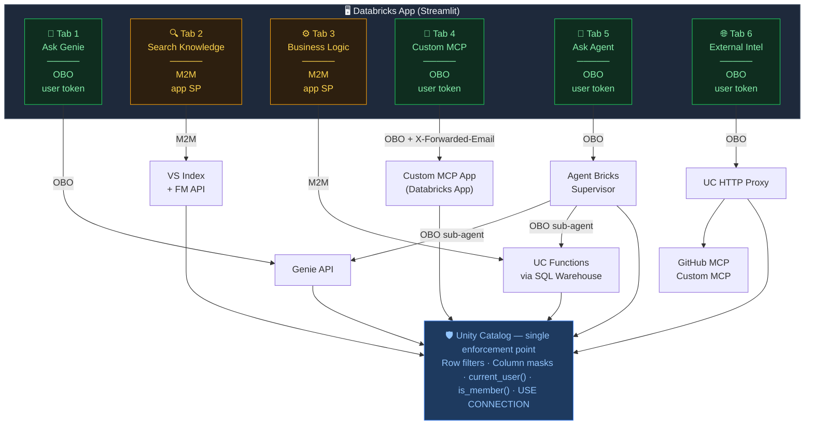

# AI AuthZ Showcase

A 6-tab Streamlit app on Databricks Apps that demonstrates every major AI authorization pattern in one place. The goal: show that Unity Catalog is the single enforcement point whether you're using Genie, Vector Search, UC Functions, a custom MCP server, an Agent Bricks supervisor, or an external API — and that OBO vs M2M is a deliberate design choice, not an accident.

## Architecture



> Green tabs = OBO (user token propagates end-to-end) · Amber tabs = M2M (app SP identity)

## Tab Quick Reference

| Tab | Auth | Key Teaching Moment |
|-----|------|---------------------|
| 1 💬 Ask Genie | OBO | UC row filters + column masks enforce data access; Genie sees only what the user can see |
| 2 🔍 Search Knowledge | M2M | App SP has CAN_USE on the VS index; content access is controlled by who owns the SP |
| 3 ⚙️ Business Logic | M2M | `is_member()` inside UC function body — the function itself is the access gate |
| 4 🔧 Custom MCP | OBO | Two-proxy problem: user token is stripped; server reads X-Forwarded-Email (unforgeable) |
| 5 🤖 Ask Agent | OBO | Supervisor auto-propagates token to sub-agents; zero auth code in the supervisor |
| 6 🌐 External Intel | OBO | Per-user GitHub OAuth vs shared bearer via UC connection; USE CONNECTION as the gate |

## `current_user()` vs `is_member()` — Choosing the Right Tool

Both are legitimate UC policy primitives. The choice comes down to **what identity context is executing the SQL** — which varies depending on where in the stack the query runs.

| Function | What it evaluates | OBO contexts (Tab 1, 4, 5) | M2M contexts (Tab 2, 3) |
|---|---|---|---|
| `current_user()` | The identity on the active SQL token | ✅ Returns the OBO caller's email | ✅ Returns the SP's client_id |
| `is_member('group')` | Group membership of the SQL execution context | ⚠️ Evaluates the **execution runtime's** groups — which in Genie/Agent Bricks OBO is the service layer's context, not the calling user's workspace groups | ✅ Ideal — SP group membership is static and controlled by design |

**`current_user()` is the right anchor for user-scoped row filters:**
```sql
-- Resolves from the OBO token regardless of what service is running the SQL
opp_rep_email = current_user()
```
This is why rep-scoped access works correctly in Tab 1 (Genie), Tab 4 (Custom MCP), and Tab 5 (Agent Bricks supervisor) — the calling user's email propagates end-to-end.

**`is_member()` is the right tool for M2M role-based logic:**
```sql
-- Works perfectly in Tab 3 (M2M) because the app SP's group membership is
-- explicitly managed and stable — it is in authz_showcase_executives by design
is_member('authz_showcase_executives')
```
In OBO contexts through Genie or Agent Bricks, `is_member()` evaluates the service's execution context — so the result depends on the service layer's groups, not the user's. For role-based column masks that need to work in OBO, the pattern is a `current_user()` lookup against an allowlist table instead.

**Design rule**: Use `current_user()` to anchor anything that must carry the calling user's identity through an OBO chain. Use `is_member()` in M2M contexts where you control the executing SP's group membership directly.

## Getting Started

### Prerequisites

- Databricks workspace with Unity Catalog enabled (AWS, Azure, or GCP)
- Account admin + workspace admin access (needed for group creation and OAuth integration)
- Databricks CLI configured with a workspace profile and an account-level profile
- A SQL warehouse (serverless recommended)
- Feature flags enabled: **Agent Bricks Beta**, **Agent Framework OBO**, **MLflow Production Monitoring** (check via Workspace Settings → Feature Preview)

### Setup Order

Every step maps to a numbered script in `seed/`. Run them in order against your workspace.

```
Step  Script                        What it does
────  ────────────────────────────  ──────────────────────────────────────────────────
 0    00_catalog_schema.sql         Create catalog + schemas (authz_showcase.*)
 1    01_create_groups.py           Create workspace groups: west, east, managers,
                                    executives, finance, custmcp (+ add yourself)
 2    02_seed_data.py               Insert synthetic sales data (opportunities, quotas,
                                    deals, knowledge docs)
 3    03_row_col_security.sql       Create row filters + column mask UC functions,
                                    attach to tables
 4    04_grant_permissions.sql      Grant SELECT/EXECUTE to account users + groups
 5    05_verify_security.sql        Spot-check filters work (run as different users)
 6    06_create_vs_index.py         Create + sync Vector Search index for Tab 2
 7    07_create_uc_functions.sql    Create get_rep_quota, calculate_attainment,
      07_grant_uc_functions.sql     recommend_next_action + grants
 8    08_create_external_mcp_conn.py  Create UC HTTP connections (GitHub OAuth +
                                    custom MCP bearer token) for Tab 6
 9    09_create_approval_requests.sql  Seed deal approval records for Tab 4 MCP tools
```

### Deploy the Apps

**1. Fill in your values** — search for `<YOUR_*>` placeholders in `app/app.yaml` and `mcp-server/app.yaml` and replace with your warehouse ID, Genie space ID, etc.

**2. Upload and deploy the custom MCP server first** (Tab 4 depends on it):
```bash
databricks workspace import-dir mcp-server /Workspace/Users/<you>/authz-showcase-custom-mcp \
  --overwrite --profile <your-profile>
databricks apps deploy authz-showcase-custom-mcp \
  --source-code-path /Workspace/Users/<you>/authz-showcase-custom-mcp \
  --profile <your-profile>
```

**3. Upload and deploy the main app:**
```bash
databricks workspace import-dir app /Workspace/Users/<you>/authz-showcase \
  --overwrite --profile <your-profile>
databricks apps deploy authz-showcase \
  --source-code-path /Workspace/Users/<you>/authz-showcase \
  --profile <your-profile>
```

**4. Patch the OAuth integration** (critical — do this immediately after first deploy):
```bash
databricks account custom-app-integration update '<integration-id>' \
  --profile <account-profile> \
  --json '{
    "scopes": ["offline_access","email","iam.current-user:read","openid",
               "dashboards.genie","genie","iam.access-control:read","profile",
               "model-serving","sql","all-apis","unity-catalog"],
    "user_authorized_scopes": ["dashboards.genie","genie","model-serving",
                                "sql","all-apis","unity-catalog"]
  }'
```
> Missing scopes cause cryptic per-feature 401/403 errors. See [AUTHZ-PATTERNS.md](AUTHZ-PATTERNS.md) for why.

**5. Re-run UC grants for the app SP** — the `resources:` block in `app.yaml` handles workspace-level permissions but not UC hierarchy grants. After deploy, get the app SP UUID and run:
```bash
# Get SP UUID
SP=$(databricks apps get authz-showcase --profile <p> | \
  python3 -c "import sys,json; print(json.load(sys.stdin)['service_principal_client_id'])")

# Grant UC access
databricks sql execute "
  GRANT USE CATALOG ON CATALOG authz_showcase TO \`$SP\`;
  GRANT USE SCHEMA ON SCHEMA authz_showcase.sales TO \`$SP\`;
  GRANT SELECT ON TABLE authz_showcase.sales.opportunities TO \`$SP\`;
  GRANT SELECT ON TABLE authz_showcase.sales.quotas TO \`$SP\`;
  GRANT SELECT ON TABLE authz_showcase.sales.quota_viewers TO \`$SP\`;
  GRANT USE SCHEMA ON SCHEMA authz_showcase.access TO \`$SP\`;
  GRANT SELECT ON TABLE authz_showcase.access.quota_viewers TO \`$SP\`;
" --warehouse <warehouse-id> --profile <p>
```

**6. Build the Agent Bricks supervisor** (Tab 5) — in the Databricks UI, go to **Agents → Supervisor Agent → Build**. Add the Genie space and UC functions as sub-agents. Copy the endpoint name into `app/app.yaml` as `SUPERVISOR_ENDPOINT`.

### Verify

Run `seed/test_harness.py` to headlessly test all 6 tab capabilities without the UI:
```bash
cd seed && python test_harness.py
```

### Personas

The demo uses 5 workspace users assigned to different groups to show role-based access:

| Persona | Groups | Sees |
|---|---|---|
| West Rep | `authz_showcase_west` | Own deals only |
| East Rep | `authz_showcase_east` | Own deals only |
| Manager | `authz_showcase_managers` | All deals in region |
| Executive | `authz_showcase_executives` | All deals + quotas |
| Finance | `authz_showcase_finance` | Quotas + financials |

---

## Files

| Path | Description |
|------|-------------|
| `app/` | Streamlit app (6 tabs) |
| `mcp-server/` | Custom MCP server deployed as a Databricks App (Tab 4) |
| `seed/` | Setup scripts: seeding data, UC grants, OAuth integration, test harness, reset |
| `DEMO-GUIDE.md` | Full demo walkthrough, persona switching, troubleshooting, nuclear rebuild option |
| `AUTHZ-PATTERNS.md` | Technical reference: auth patterns, scope map, gotchas |
| `IMPLEMENTATION-PLAN.md` | Build log for future contributors |
