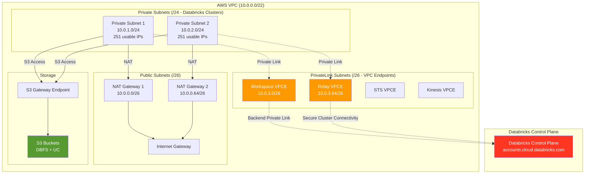
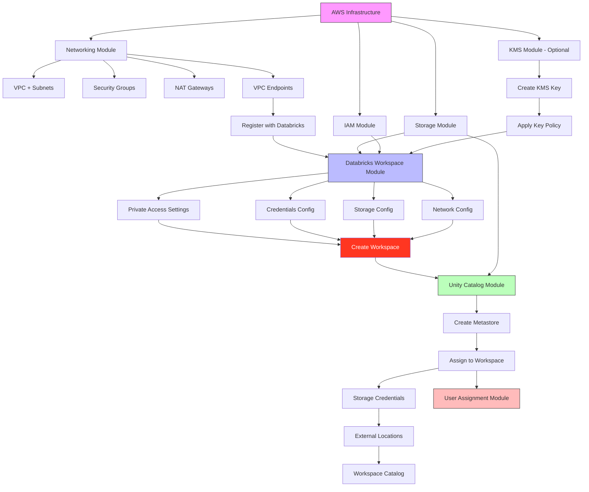
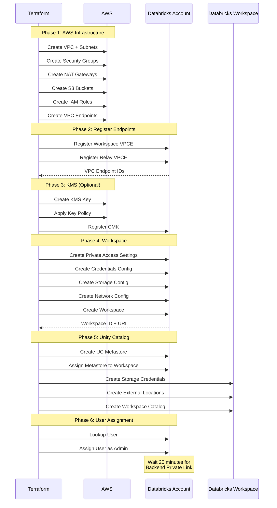

# Databricks Workspace Deployment with Private Link and Unity Catalog

A modular Terraform configuration for deploying secure Databricks workspaces on AWS with Private Link, Unity Catalog, and optional customer-managed encryption keys.

## Table of Contents

- [Architecture Overview](#architecture-overview)
- [Prerequisites](#prerequisites)
- [Provider Configuration](#provider-configuration)
- [AWS Infrastructure Components](#aws-infrastructure-components)
  - [Networking](#1-networking-modulesnetworking)
  - [VPC Endpoints](#2-vpc-endpoints-modulesnetworkingvpc_endpointstf)
  - [Security Groups](#3-security-groups-modulesnetworkingsecurity_groupstf)
  - [Storage](#4-storage-modulesstorage)
  - [IAM Roles](#5-iam-roles-and-policies-modulesiam)
  - [Customer-Managed Keys](#6-customer-managed-keys-optional-moduleskms)
- [Databricks Resources](#databricks-resources)
  - [Workspace Configuration](#1-workspace-configuration-modulesdatabricks_workspace)
  - [Unity Catalog](#2-unity-catalog-modulesunity_catalog)
  - [User Assignment](#3-user-assignment-modulesuser_assignment)
- [Deployment Flow](#deployment-flow)
- [Configuration](#configuration)
- [Deployment](#deployment)
- [Troubleshooting](#troubleshooting)

---

## Architecture Overview

This deployment creates a **secure, production-ready Databricks workspace** with:

- ✅ **Backend Private Link** (VPC endpoints for control plane and data plane)
- ✅ **Unity Catalog** for data governance
- ✅ **Customer-Managed VPC** with private and public subnets
- ✅ **Optional Customer-Managed Keys** (CMK) for encryption
- ✅ **Dedicated PrivateLink subnets** for VPC endpoints
- ✅ **IP Access Lists** (optional) for additional security

### Architecture Diagram


```mermaid
graph TB
    subgraph "AWS VPC (10.0.0.0/22)"
        subgraph "Public Subnets (/26)"
            NAT1[NAT Gateway 1<br/>10.0.0.0/26]
            NAT2[NAT Gateway 2<br/>10.0.0.64/26]
            IGW[Internet Gateway]
        end
        
        subgraph "Private Subnets (/24 - Databricks Clusters)"
            PRIV1[Private Subnet 1<br/>10.0.1.0/24<br/>251 usable IPs]
            PRIV2[Private Subnet 2<br/>10.0.2.0/24<br/>251 usable IPs]
        end
        
        subgraph "PrivateLink Subnets (/26 - VPC Endpoints)"
            VPCE1[Workspace VPCE<br/>10.0.3.0/26]
            VPCE2[Relay VPCE<br/>10.0.3.64/26]
            STS[STS VPCE]
            KINESIS[Kinesis VPCE]
        end
        
        subgraph "Storage"
            S3[S3 Buckets<br/>DBFS + UC]
            S3GW[S3 Gateway Endpoint]
        end
    end
    
    subgraph "Databricks Control Plane"
        CONTROL[Databricks Control Plane<br/>accounts.cloud.databricks.com]
    end
    
    PRIV1 -->|NAT| NAT1
    PRIV2 -->|NAT| NAT2
    NAT1 --> IGW
    NAT2 --> IGW
    
    PRIV1 -.->|Private Link| VPCE1
    PRIV2 -.->|Private Link| VPCE2
    
    VPCE1 -.->|Backend Private Link| CONTROL
    VPCE2 -.->|Secure Cluster Connectivity| CONTROL
    
    PRIV1 -->|S3 Access| S3GW
    PRIV2 -->|S3 Access| S3GW
    S3GW --> S3
    
    style CONTROL fill:#FF3621,color:#fff
    style S3 fill:#569A31,color:#fff
    style VPCE1 fill:#FF9900,color:#fff
    style VPCE2 fill:#FF9900,color:#fff
```

---

## Prerequisites

### 1. Databricks Account Requirements

- **Databricks E2 Account** (Enterprise account on AWS)
- **Account Console Access** at `https://accounts.cloud.databricks.com`
- **Service Principal** with account admin privileges:
  - `client_id` (OAuth Client ID)
  - `client_secret` (OAuth Secret)
- **Databricks Account ID** (found in Account Console)

### 2. AWS Requirements

- **AWS Account** with administrator access
- **AWS CLI** configured with credentials:
  ```bash
  aws configure --profile your-profile-name
  # OR
  aws sso login --profile your-profile-name
  ```
- **VPC Endpoint Services** enabled in your region
- **Adequate service quotas** for VPC, subnets, and NAT gateways

### 3. Local Requirements

- **Terraform** >= 1.0
- **Git** (for version control)

### 4. Databricks User

- User must **already exist** in Databricks Account Console (for workspace admin assignment)
- User email will be used for `workspace_admin_email` variable

---

## Provider Configuration

This deployment uses three Terraform providers:

### 1. AWS Provider

```hcl
provider "aws" {
  region  = "us-west-2"
  profile = "your-aws-profile"  # OR use default credentials
}
```

**Authentication Options:**
- **Option 1**: Named AWS CLI profile (`aws_profile` variable)
- **Option 2**: Default AWS credentials (SSO, environment variables, IAM role)

### 2. Databricks Account Provider

```hcl
provider "databricks" {
  alias         = "account"
  host          = "https://accounts.cloud.databricks.com"
  account_id    = var.databricks_account_id
  client_id     = var.client_id
  client_secret = var.client_secret
}
```

**Used for:**
- Creating workspace
- Registering VPC endpoints
- Unity Catalog metastore
- User permission assignments

### 3. Databricks Workspace Provider

```hcl
provider "databricks" {
  alias         = "workspace"
  host          = module.databricks_workspace.workspace_url
  client_id     = var.client_id
  client_secret = var.client_secret
}
```

**Used for:**
- Unity Catalog catalogs and schemas
- Storage credentials and external locations
- Workspace-level configurations
- IP access lists

---

## AWS Infrastructure Components

### 1. Networking (`modules/networking`)

Creates a **3-tier VPC architecture**:

#### VPC Configuration
```
VPC CIDR: 10.0.0.0/22 (1024 total IPs - optimized for single workspace)
├── DNS Hostnames: Enabled
└── DNS Support: Enabled
```

#### Subnets (2 Availability Zones)

| Subnet Type | Purpose | CIDR | Usable IPs | Count |
|-------------|---------|------|------------|-------|
| **Public** | NAT Gateways, Internet Gateway | `10.0.0.0/26`, `10.0.0.64/26` | 59 each | 2 |
| **Private** | Databricks Clusters (compute) | `10.0.1.0/24`, `10.0.2.0/24` | 251 each | 2 |
| **PrivateLink** | VPC Endpoints | `10.0.3.0/26`, `10.0.3.64/26` | 59 each | 2 |

**CIDR Allocation Strategy:**
- **VPC /22**: Efficient sizing for single workspace deployment (vs /16 which wastes IPs)
- **Private Subnets /24**: 251 IPs each = sufficient for ~80-100 concurrent clusters per AZ
- **PrivateLink Subnets /26**: 59 IPs each = more than enough for VPC endpoint ENIs (need ~10 IPs)
- **Public Subnets /26**: 59 IPs each = sufficient for NAT gateway elastic IPs

#### Route Tables

- **Public Route Table**: Routes `0.0.0.0/0` → Internet Gateway
- **Private Route Tables** (per AZ): Routes `0.0.0.0/0` → NAT Gateway
- **PrivateLink Route Table**: Routes `0.0.0.0/0` → NAT Gateway (for egress to Databricks control plane)

#### NAT Gateways

- **Count**: 2 (one per AZ for high availability)
- **Purpose**: Outbound internet access for private subnets

**Why Two NAT Gateways?**

| Aspect | 2 NAT Gateways (HA) | 1 NAT Gateway (Cost) |
|--------|---------------------|----------------------|
| **Availability** | ✅ If one AZ fails, other continues | ❌ Single point of failure |
| **Cost** | ~$64/month | ~$32/month (50% savings) |
| **Cross-AZ Charges** | ✅ No extra cost | ❌ $0.01/GB transfer fee |
| **Production Ready** | ✅ Recommended | ❌ Dev/test only |

💡 **Cost Optimization:** For dev/test environments, you can use a single NAT gateway to save ~$32/month. Update `nat_gateway_count = 1` in the networking module configuration. However, **two NAT gateways are strongly recommended for production** to ensure high availability.

---

### 2. VPC Endpoints (`modules/networking/vpc_endpoints.tf`)

#### Databricks-Specific Endpoints

| Endpoint | Type | Purpose | Port | Subnets |
|----------|------|---------|------|---------|
| **Workspace VPC Endpoint** | Interface | REST API, UI access | 443, 8443-8451 | PrivateLink |
| **Relay VPC Endpoint** | Interface | Secure Cluster Connectivity | 6666 | PrivateLink |

**Registration with Databricks:**
```hcl
resource "databricks_mws_vpc_endpoint" "workspace_vpce" {
  account_id          = var.databricks_account_id
  aws_vpc_endpoint_id = aws_vpc_endpoint.workspace.id
  vpc_endpoint_name   = "${var.prefix}-workspace-vpce"
  region              = var.region
}
```

#### AWS Service Endpoints

| Endpoint | Type | Purpose |
|----------|------|---------|
| **S3** | Gateway | DBFS, logs, artifacts |
| **STS** | Interface | IAM role assumption |
| **Kinesis** | Interface | Logging and lineage |

**Private DNS:** All interface endpoints have `private_dns_enabled = true` for automatic DNS resolution.

---

### 3. Security Groups (`modules/networking/security_groups.tf`)

#### Workspace Security Group (for Databricks Clusters)

**Ingress Rules:**
```
✅ TCP 0-65535 from self (cluster-to-cluster communication)
✅ UDP 0-65535 from self (cluster-to-cluster communication)
```

**Egress Rules:**
```
✅ TCP 0-65535 to self (cluster-to-cluster)
✅ UDP 0-65535 to self (cluster-to-cluster)
✅ TCP 443 to VPC Endpoint SG (HTTPS to control plane via Private Link)
✅ TCP 443 to 0.0.0.0/0 (library downloads, external APIs, S3 access)
✅ TCP 3306 to 0.0.0.0/0 (external metastore - optional)
✅ TCP 6666 to VPC Endpoint SG (Secure Cluster Connectivity)
✅ TCP 8443-8451 to VPC Endpoint SG (Unity Catalog, control plane)
✅ TCP/UDP 53 to 0.0.0.0/0 (DNS resolution)
```

**Important Notes:**
- **Port 443 to 0.0.0.0/0** covers S3 access for DBFS, logs, and artifacts. A separate S3 prefix list rule is **not needed** and would be redundant.
- **AWS merges rules:** If multiple targets are specified for the same port in AWS Console, they appear as a single rule. Terraform creates separate rules for clarity.
- **Security group rule evaluation:** AWS uses an "allow" model - if any rule permits traffic, it's allowed. Rules are evaluated independently without priority or ordering.

#### VPC Endpoint Security Group

**Ingress Rules:**
```
✅ TCP 443 from Workspace SG (HTTPS from clusters)
✅ TCP 6666 from Workspace SG (SCC from clusters)
✅ TCP 8443-8451 from Workspace SG (Unity Catalog, control plane)
```

**Egress Rules:**
```
✅ ALL to 0.0.0.0/0 (to Databricks control plane)
```

---

### 4. Storage (`modules/storage`)

Creates S3 buckets with encryption and versioning:

| Bucket | Purpose | Encryption | Versioning | Public Access |
|--------|---------|------------|------------|---------------|
| **Root Storage** | Workspace DBFS root | AES256 | Enabled | Blocked |
| **UC Metastore** | Unity Catalog metastore | AES256 | Enabled | Blocked |
| **UC Root Storage** | UC root storage location | AES256 | Enabled | Blocked |
| **UC External** | External data locations | AES256 | Enabled | Blocked |

**Bucket Policy:** Databricks-generated policy attached to root storage bucket for cross-account access.

---

### 5. IAM Roles and Policies (`modules/iam`)

#### Cross-Account Role

**Purpose:** Allows Databricks control plane to manage workspace resources

```hcl
Trust Policy: Databricks AWS account (414351767826)
Permissions: EC2, VPC, S3 (workspace management)
```

**Generated by:** `databricks_aws_crossaccount_policy` data source

#### Instance Profile Role

**Purpose:** Grants Databricks clusters access to S3 and AWS services

```hcl
Trust Policy: EC2 service
Permissions:
  - S3 access to workspace buckets
  - EC2 instance metadata access
  - CloudWatch logs (optional)
```

#### Unity Catalog Role

**Purpose:** Grants Unity Catalog access to S3 data locations

```hcl
Trust Policy: Databricks Unity Catalog AWS account
Permissions:
  - S3 access to UC metastore bucket
  - S3 access to UC data buckets
  - KMS decrypt (if CMK enabled)
```

---

### 6. Customer-Managed Keys (Optional) (`modules/kms`)

When `enable_workspace_cmk = true`:

#### Single KMS Key for Workspace

**Use Cases:**
- `STORAGE` - DBFS root and EBS volume encryption
- `MANAGED_SERVICES` - Control plane notebook encryption

**Key Policy:**
```hcl
Permissions:
  ✅ Account root (key administration)
  ✅ Databricks cross-account role (encrypt/decrypt)
  ✅ EC2 service (EBS volume encryption via workspace VPCE)
```

**Policy Conditions:**
- `aws:PrincipalTag/DatabricksAccountId` = Your Databricks Account ID
- `aws:SourceVpce` = Workspace VPC Endpoint ID (for EBS)

---

## Databricks Resources

### 1. Workspace Configuration (`modules/databricks_workspace`)

#### Credentials
```hcl
databricks_mws_credentials
├── Role ARN: Cross-account role
└── Purpose: AWS resource management
```

#### Storage Configuration
```hcl
databricks_mws_storage_configurations
├── Bucket: Root storage bucket
└── Purpose: DBFS root storage
```

#### Network Configuration
```hcl
databricks_mws_networks
├── VPC ID
├── Subnet IDs: Private subnets
├── Security Group: Workspace SG
└── VPC Endpoints:
    ├── rest_api: Workspace VPC Endpoint ID
    └── dataplane_relay: Relay VPC Endpoint ID
```

#### Private Access Settings
```hcl
databricks_mws_private_access_settings
├── Public Access: Configurable (default: enabled)
├── Private Access Level: ENDPOINT or ACCOUNT
└── Region: Workspace region
```

#### Workspace
```hcl
databricks_mws_workspaces
├── Credentials ID
├── Storage Configuration ID
├── Network ID
├── Private Access Settings ID
├── CMK IDs (optional):
│   ├── Managed Services CMK ID
│   └── Storage CMK ID
└── Pricing Tier: ENTERPRISE
```

---

### 2. Unity Catalog (`modules/unity_catalog`)

#### Metastore
```hcl
databricks_metastore
├── Name: {prefix}-metastore
├── Region: Workspace region
├── Storage Root: s3://uc-metastore-bucket/metastore
└── Owner: Metastore admin email
```

#### Metastore Assignment
```hcl
databricks_metastore_assignment
├── Workspace ID
├── Metastore ID
└── Default Catalog: "main"
```

#### Storage Credentials (Optional)
```hcl
databricks_storage_credential (root_storage)
├── IAM Role: UC root storage role ARN
└── Purpose: Access to UC root storage bucket

databricks_storage_credential (external_storage)
├── IAM Role: UC external storage role ARN
└── Purpose: Access to external data buckets
```

#### External Locations (Optional)
```hcl
databricks_external_location (root_storage)
├── URL: s3://uc-root-storage-bucket/
└── Credential: root_storage

databricks_external_location (external_location)
├── URL: s3://uc-external-bucket/
└── Credential: external_storage
```

#### Workspace Catalog (Optional)
```hcl
databricks_catalog
├── Name: {prefix}_catalog
├── Storage Root: s3://uc-root-storage-bucket/catalog
└── Grants: ALL_PRIVILEGES to workspace admin
```

---

### 3. User Assignment (`modules/user_assignment`)

Assigns existing Databricks account user as workspace admin:

```hcl
data "databricks_user" "workspace_access"
├── Provider: databricks.account
└── User Name: workspace_admin_email

databricks_mws_permission_assignment
├── Workspace ID
├── Principal ID: User ID
├── Permissions: ["ADMIN"]
└── Lifecycle: ignore_changes on principal_id
```

**Prerequisites:**
- User must exist in Databricks Account Console
- UC metastore must be assigned to workspace

---

## Deployment Flow

### Module Dependency Graph


```mermaid
graph TD
    A[AWS Infrastructure] --> B[Networking Module]
    A --> C[Storage Module]
    A --> D[IAM Module]
    A --> E[KMS Module - Optional]
    
    B --> F[VPC + Subnets]
    B --> G[Security Groups]
    B --> H[NAT Gateways]
    B --> I[VPC Endpoints]
    
    I --> J[Register with Databricks]
    
    E --> K[Create KMS Key]
    K --> L[Apply Key Policy]
    
    J --> M[Databricks Workspace Module]
    C --> M
    D --> M
    L --> M
    
    M --> N[Private Access Settings]
    M --> O[Credentials Config]
    M --> P[Storage Config]
    M --> Q[Network Config]
    N --> R[Create Workspace]
    O --> R
    P --> R
    Q --> R
    
    R --> S[Unity Catalog Module]
    C --> S
    
    S --> T[Create Metastore]
    T --> U[Assign to Workspace]
    U --> V[Storage Credentials]
    V --> W[External Locations]
    W --> X[Workspace Catalog]
    
    U --> Y[User Assignment Module]
    
    style A fill:#f9f,stroke:#333
    style M fill:#bbf,stroke:#333
    style S fill:#bfb,stroke:#333
    style Y fill:#fbb,stroke:#333
    style R fill:#FF3621,color:#fff
```

### Deployment Sequence


```mermaid
sequenceDiagram
    participant TF as Terraform
    participant AWS as AWS
    participant DB_ACC as Databricks Account
    participant DB_WS as Databricks Workspace
    
    Note over TF,AWS: Phase 1: AWS Infrastructure
    TF->>AWS: Create VPC + Subnets
    TF->>AWS: Create Security Groups
    TF->>AWS: Create NAT Gateways
    TF->>AWS: Create S3 Buckets
    TF->>AWS: Create IAM Roles
    TF->>AWS: Create VPC Endpoints
    
    Note over TF,DB_ACC: Phase 2: Register Endpoints
    TF->>DB_ACC: Register Workspace VPCE
    TF->>DB_ACC: Register Relay VPCE
    DB_ACC-->>TF: VPC Endpoint IDs
    
    Note over TF,AWS: Phase 3: KMS (Optional)
    TF->>AWS: Create KMS Key
    TF->>AWS: Apply Key Policy
    TF->>DB_ACC: Register CMK
    
    Note over TF,DB_ACC: Phase 4: Workspace
    TF->>DB_ACC: Create Private Access Settings
    TF->>DB_ACC: Create Credentials Config
    TF->>DB_ACC: Create Storage Config
    TF->>DB_ACC: Create Network Config
    TF->>DB_ACC: Create Workspace
    DB_ACC-->>TF: Workspace ID + URL
    
    Note over TF,DB_ACC: Phase 5: Unity Catalog
    TF->>DB_ACC: Create UC Metastore
    TF->>DB_ACC: Assign Metastore to Workspace
    TF->>DB_WS: Create Storage Credentials
    TF->>DB_WS: Create External Locations
    TF->>DB_WS: Create Workspace Catalog
    
    Note over TF,DB_ACC: Phase 6: User Assignment
    TF->>DB_ACC: Lookup User
    TF->>DB_ACC: Assign User as Admin
    
    Note over DB_ACC: Wait 20 minutes for<br/>Backend Private Link
```

### Critical Dependencies

#### Module-Level Dependencies

```hcl
module "databricks_workspace" {
  depends_on = [
    module.networking,  # VPC, subnets, VPC endpoints
    module.storage,     # S3 buckets
    module.iam,         # Cross-account role, instance profile
    module.kms          # KMS keys (if enabled)
  ]
}

module "unity_catalog" {
  depends_on = [
    module.databricks_workspace,  # Workspace must exist
    module.storage                # UC buckets must exist
  ]
}

module "user_assignment" {
  depends_on = [
    module.unity_catalog.metastore_assignment_id  # UC must be assigned first
  ]
}
```

#### Resource-Level Dependencies

**Within Databricks Workspace Module:**
```
VPC Endpoints Registration
    ↓
Private Access Settings (depends on VPC endpoints)
    ↓
Network Configuration (depends on VPC endpoints)
    ↓
Workspace Creation (depends on all configurations)
```

**Within Unity Catalog Module:**
```
Metastore Creation
    ↓
Metastore Assignment to Workspace
    ↓
Storage Credentials (IAM roles must exist)
    ↓
External Locations (credentials must exist)
    ↓
Workspace Catalog (external locations must exist)
```

---

## Configuration

### 1. Required Variables

Create `terraform.tfvars`:

```hcl
# AWS Configuration
region      = "us-west-2"
aws_profile = "your-aws-profile"  # Or use default credentials

# Databricks Account Configuration
databricks_account_id = "your-account-id"
client_id             = "your-service-principal-client-id"
client_secret         = "your-service-principal-secret"

# Workspace Configuration
workspace_name        = "my-databricks-workspace"
workspace_admin_email = "admin@example.com"

# Metastore Configuration
metastore_admin_email = "admin@example.com"

# Network Configuration
vpc_cidr             = "10.0.0.0/22"
private_subnet_cidrs = ["10.0.1.0/24", "10.0.2.0/24"]
public_subnet_cidrs  = ["10.0.0.0/26", "10.0.0.64/26"]
privatelink_subnet_cidrs = ["10.0.3.0/26", "10.0.3.64/26"]

# VPC Endpoint Services (region-specific)
workspace_vpce_service = "com.amazonaws.vpce.us-west-2.vpce-svc-xxxxx"
relay_vpce_service     = "com.amazonaws.vpce.us-west-2.vpce-svc-yyyyy"

# AWS Account
aws_account_id = "123456789012"

# Tags
tags = {
  Environment = "dev"
  Project     = "databricks-privatelink"
  ManagedBy   = "terraform"
}
```

### 2. Optional Features

#### Customer-Managed Keys
```hcl
enable_workspace_cmk = true
cmk_admin_arn        = "arn:aws:iam::123456789012:user/admin"
```

#### IP Access Lists
```hcl
enable_ip_access_lists = true
allowed_ip_addresses   = ["1.2.3.4/32", "5.6.7.8/32"]
```

#### Unity Catalog Workspace Catalog
```hcl
create_workspace_catalog = true
```

#### Private Access Settings
```hcl
public_access_enabled = false      # Fully private workspace
private_access_level  = "ACCOUNT"  # or "ENDPOINT"
```

---

## Deployment

### Step 1: Initialize Terraform

```bash
cd aws/modular-version
terraform init
```

### Step 2: Validate Configuration

```bash
terraform validate
```

### Step 3: Review Plan

```bash
terraform plan
```

### Step 4: Apply Configuration

```bash
terraform apply
```

**Deployment Time:** ~15-20 minutes

### Step 5: Wait for Backend Private Link

⚠️ **IMPORTANT:** Wait **20 minutes** after workspace creation before creating clusters.

This allows the backend Private Link connection to fully stabilize.

### Step 6: Verify Deployment

1. Access workspace at the output URL
2. Log in with workspace admin email
3. Verify Unity Catalog metastore is assigned
4. Create a test cluster to verify connectivity

---

## Troubleshooting

### Common Issues and Solutions

#### 1. Provider Type Mismatch Error

**Error:**
```
Error: Provider type mismatch
The local name "databricks.account" in the root module represents provider
"hashicorp/databricks", but "databricks.account" in module represents
"databricks/databricks".
```

**Solution:**
```bash
rm -rf .terraform .terraform.lock.hcl
terraform init -upgrade
```

**Cause:** Terraform provider cache needs to be refreshed.

---

#### 2. Security Group Egress Rules Warning

**Warning:**
```
Warning: Egress rules in the Security Group sg-xxxxx are not configured correctly.
See the requirements at https://docs.databricks.com/administration-guide/cloud-configurations/aws/customer-managed-vpc.html#security-groups.
```

**Common Causes:**
1. **Redundant S3 prefix list rule** - Having both `0.0.0.0/0` and S3 prefix list for port 443
2. **Missing required egress rules** - Not allowing traffic to VPC endpoints or self-referencing rules
3. **Manual AWS Console changes** - Rules added/modified outside of Terraform

**Solution:**

**Check for redundant rules:**
```bash
# View all egress rules for the workspace security group
aws ec2 describe-security-groups \
  --group-ids <WORKSPACE_SG_ID> \
  --query 'SecurityGroups[0].IpPermissionsEgress[?FromPort==`443`]' \
  --region <REGION>
```

**If you see both `0.0.0.0/0` and a prefix list for port 443, remove the prefix list:**
```bash
# Remove redundant S3 prefix list rule (change pl-xxxxx to your prefix list ID)
aws ec2 revoke-security-group-egress \
  --group-id <WORKSPACE_SG_ID> \
  --ip-permissions 'IpProtocol=tcp,FromPort=443,ToPort=443,PrefixListIds=[{PrefixListId=pl-xxxxx}]' \
  --region <REGION>
```

**Verify Terraform configuration matches AWS:**
```bash
terraform plan  # Should show no changes if in sync
```

**Why this happens:**
- The `0.0.0.0/0` rule already covers **all destinations** including S3
- AWS merges multiple targets into a single rule, causing Databricks validation to detect redundancy
- Terraform creates separate rules, but AWS may show them merged

**Cause:** Drift between Terraform state and actual AWS configuration, or manual changes in AWS Console.

---

#### 3. VPC Endpoint Service Not Found

**Error:**
```
Error: creating EC2 VPC Endpoint: InvalidServiceName
```

**Solution:**
1. Verify you're using the correct region
2. Get the correct VPC endpoint service names from Databricks support:
   ```bash
   # Contact Databricks support for your region-specific service names
   workspace_vpce_service = "com.amazonaws.vpce.REGION.vpce-svc-xxxxx"
   relay_vpce_service     = "com.amazonaws.vpce.REGION.vpce-svc-yyyyy"
   ```

---

#### 4. Cannot Create User Assignment Error

**Error:**
```
Error: cannot create mws permission assignment: Permission assignment APIs are not available
```

**Solution:** This API requires:
- Unity Catalog to be enabled and assigned to workspace
- User must exist in Databricks Account Console

**Workaround:**
```hcl
# In terraform.tfvars, leave empty to skip:
workspace_admin_email = ""

# Then assign admin manually via Databricks UI
```

---

#### 5. KMS Key Policy Circular Dependency

**Error:**
```
Error: Cycle: module.kms, module.iam
```

**Solution:** The KMS module constructs the cross-account role ARN internally:
```hcl
locals {
  cross_account_role_arn = "arn:aws:iam::${var.aws_account_id}:role/${var.prefix}-crossaccount"
}
```

**Verify:** Remove explicit `depends_on = [module.iam]` from KMS module call in root `main.tf`.

---

#### 6. Workspace URL Double HTTPS Error

**Error:**
```
Error: Config: host=https://https://...
```

**Solution:** The workspace URL output should not include `https://` prefix:
```hcl
# Correct:
output "workspace_url" {
  value = databricks_mws_workspaces.workspace.workspace_url
}

# Incorrect:
output "workspace_url" {
  value = "https://${databricks_mws_workspaces.workspace.workspace_url}"
}
```

---

#### 7. Cluster Creation Fails After Workspace Deployment

**Error:**
```
Cluster creation failed: Unable to connect to data plane
```

**Solution:**
1. **Wait 20 minutes** after workspace creation for backend Private Link to stabilize
2. Verify VPC endpoints are in "available" state:
   ```bash
   aws ec2 describe-vpc-endpoints --vpc-endpoint-ids vpce-xxxxx
   ```
3. Check security group rules allow traffic to VPC endpoints
4. Verify NAT gateways are healthy in both AZs

---

#### 8. S3 Access Denied Errors

**Error:**
```
Error: Access Denied when accessing S3 bucket
```

**Solution:**
1. Verify IAM roles have correct permissions:
   ```bash
   terraform state show 'module.iam.aws_iam_role.instance_profile_role'
   terraform state show 'module.iam.aws_iam_role.unity_catalog_role'
   ```
2. Check bucket policies are attached:
   ```bash
   aws s3api get-bucket-policy --bucket your-bucket-name
   ```
3. Verify IAM role assumption is working:
   ```bash
   aws sts assume-role --role-arn arn:aws:iam::ACCOUNT:role/ROLE-NAME --role-session-name test
   ```

---

#### 9. Unity Catalog Metastore Assignment Fails

**Error:**
```
Error: cannot assign metastore to workspace
```

**Solution:**
1. Verify workspace is in RUNNING state:
   ```bash
   terraform state show 'module.databricks_workspace.databricks_mws_workspaces.workspace'
   ```
2. Check metastore exists:
   ```bash
   terraform state show 'module.unity_catalog.databricks_metastore.this'
   ```
3. Ensure workspace and metastore are in the same region
4. Verify account has Unity Catalog enabled

---

#### 10. Destroy Fails with Dynamic Provider Error

**Error:**
```
Error: cannot read storage credential: failed during request visitor
```

**Solution:** Use targeted destroy:
```bash
# Step 1: Remove Unity Catalog resources
terraform destroy -target=module.user_assignment
terraform destroy -target=module.unity_catalog

# Step 2: Remove workspace
terraform destroy -target=module.databricks_workspace

# Step 3: Remove remaining resources
terraform destroy
```

**Alternative:** Use the provided destroy script:
```bash
./scripts/pre-destroy.sh
terraform destroy
```

---

### Debug Commands

#### Check Terraform State
```bash
terraform state list
terraform state show 'module.name.resource.name'
```

#### Refresh State
```bash
terraform refresh
```

#### View Outputs
```bash
terraform output
terraform output -json | jq
```

#### Enable Debug Logging
```bash
export TF_LOG=DEBUG
export TF_LOG_PATH=terraform-debug.log
terraform apply
```

#### Validate Network Connectivity
```bash
# Test VPC endpoint DNS resolution
nslookup workspace-endpoint-name.vpce-svc-xxxxx.us-west-2.vpce.amazonaws.com

# Check NAT Gateway status
aws ec2 describe-nat-gateways --region us-west-2

# Verify security group rules
aws ec2 describe-security-groups --group-ids sg-xxxxx
```

---

## Additional Resources

- [Databricks Private Link Documentation](https://docs.databricks.com/administration-guide/cloud-configurations/aws/privatelink.html)
- [Unity Catalog Setup Guide](https://docs.databricks.com/data-governance/unity-catalog/get-started.html)
- [Databricks SRA Reference Architecture](https://github.com/databricks/terraform-databricks-sra)
- [AWS VPC Endpoints Documentation](https://docs.aws.amazon.com/vpc/latest/privatelink/vpc-endpoints.html)
- [Databricks Terraform Provider Documentation](https://registry.terraform.io/providers/databricks/databricks/latest/docs)

---

## Support

For issues or questions:
1. Check the [Troubleshooting](#troubleshooting) section above
2. Review Terraform debug logs (`TF_LOG=DEBUG`)
3. Consult [Databricks documentation](https://docs.databricks.com)
4. Contact Databricks support for account-specific issues

---

## License

This configuration is provided as-is for reference purposes.
