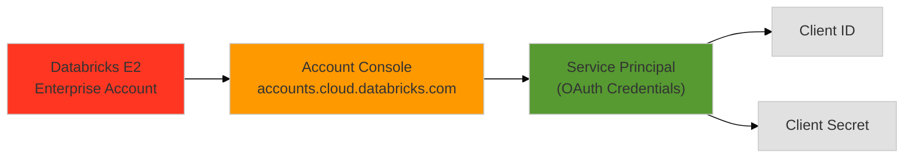
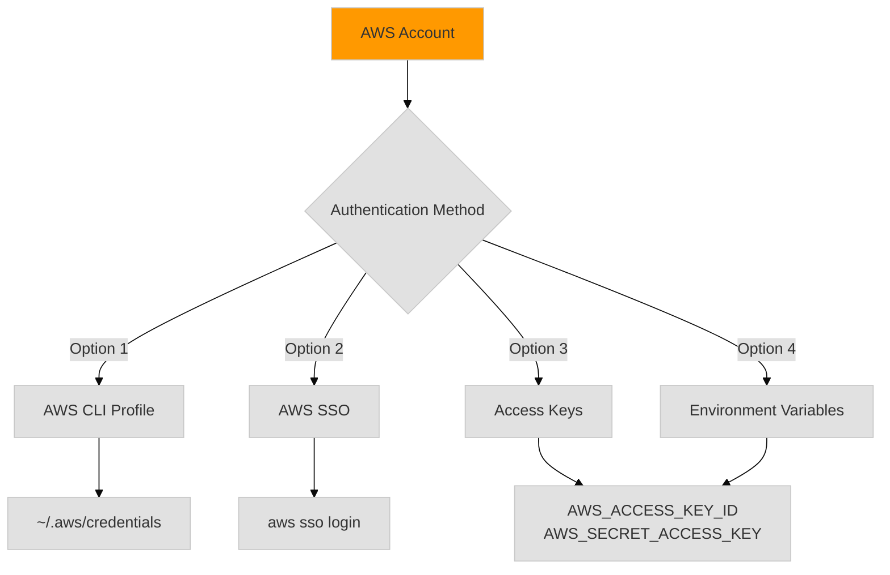

# 00 - Prerequisites & System Setup

> **Before You Begin**: This guide ensures your system is properly configured for Databricks deployment.

## Quick Reference

```
✅ Databricks Account (E2 Enterprise)
✅ Service Principal + Credentials  
✅ AWS Account + Credentials
✅ Terraform >= 1.0
✅ Environment Variables Configured
```

---

## 1. Databricks Requirements

### 1.1 Databricks Account



**Required Access:**
- Databricks E2 (Enterprise) Account on AWS
- Account Admin access to `https://accounts.cloud.databricks.com`
- Ability to create Service Principals

**Docs**: [Databricks Account Console](https://docs.databricks.com/aws/en/administration-guide/account-settings-e2/index.html)

### 1.2 Create Service Principal

```bash
# Navigate to Account Console → User Management → Service Principals
# Click "Add Service Principal"
# Name: "terraform-deployment" (or your preference)
# Copy the generated credentials immediately (shown only once!)
```

**Save these values** (needed for Step 4):
```
DATABRICKS_CLIENT_ID=<your-client-id>
DATABRICKS_CLIENT_SECRET=<your-client-secret>
DATABRICKS_ACCOUNT_ID=<your-account-id>
```

**Docs**: [Service Principal Setup](https://docs.databricks.com/aws/en/dev-tools/auth/oauth-m2m.html)

---

## 2. AWS Requirements

### 2.1 AWS Account Access



**Required Permissions:**
- VPC creation and management
- EC2, S3, IAM, KMS operations
- Databricks workspace deployment rights

**Verify Access:**
```bash
# Test AWS authentication
aws sts get-caller-identity --profile your-profile
# Output should show your AWS account ID
```

### 2.2 AWS Authentication Setup

Choose ONE option:

**Option 1: Named Profile (Recommended)**
```bash
aws configure --profile databricks-deploy
# AWS Access Key ID: <your-key>
# AWS Secret Access Key: <your-secret>
# Default region: us-west-2
# Default output format: json
```

**Option 2: AWS SSO**
```bash
aws configure sso
# Follow prompts to set up SSO profile
aws sso login --profile your-profile
```

**Option 3: Environment Variables**
```bash
export AWS_ACCESS_KEY_ID="<your-key>"
export AWS_SECRET_ACCESS_KEY="<your-secret>"
export AWS_DEFAULT_REGION="us-west-2"
```

**Option 4: Default Credentials**
```bash
aws configure
# Uses ~/.aws/credentials [default] profile
```

---

## 3. Required Tools

### 3.1 Install Terraform

```bash
# macOS (Homebrew)
brew tap hashicorp/tap
brew install hashicorp/tap/terraform

# Linux
wget https://releases.hashicorp.com/terraform/1.6.0/terraform_1.6.0_linux_amd64.zip
unzip terraform_1.6.0_linux_amd64.zip
sudo mv terraform /usr/local/bin/

# Verify
terraform --version
# Required: >= 1.0.0
```

**Docs**: [Terraform Installation](https://developer.hashicorp.com/terraform/install)

### 3.2 Install AWS CLI

```bash
# macOS
brew install awscli

# Linux
curl "https://awscli.amazonaws.com/awscli-exe-linux-x86_64.zip" -o "awscliv2.zip"
unzip awscliv2.zip
sudo ./aws/install

# Verify
aws --version
# Required: >= 2.0
```

**Docs**: [AWS CLI Installation](https://docs.aws.amazon.com/cli/latest/userguide/getting-started-install.html)

---

## 4. Environment Configuration

### 4.1 Terraform Provider Authentication

**Method 1: ~/.zshrc (Recommended for Security)**

```bash
# Edit ~/.zshrc
nano ~/.zshrc

# Add these lines (replace with your actual values)
export TF_VAR_databricks_client_id="<your-sp-client-id>"
export TF_VAR_databricks_client_secret="<your-sp-secret>"
export TF_VAR_databricks_account_id="<your-account-id>"
export TF_VAR_aws_account_id="<your-aws-account-id>"

# Reload
source ~/.zshrc
```

**Method 2: .env.local File (Alternative)**

```bash
# Create .env.local in project root (NEVER commit this!)
cat > .env.local << 'EOF'
export TF_VAR_databricks_client_id="<your-sp-client-id>"
export TF_VAR_databricks_client_secret="<your-sp-secret>"
export TF_VAR_databricks_account_id="<your-account-id>"
export TF_VAR_aws_account_id="<your-aws-account-id>"
EOF

# Load before each session
source .env.local
```

### 4.2 Verify Environment

```bash
# Check Terraform variables are set
echo $TF_VAR_databricks_client_id
echo $TF_VAR_databricks_account_id

# Verify AWS credentials
aws sts get-caller-identity --profile your-profile

# Test Databricks authentication
curl -X GET \
  -H "Authorization: Bearer $(echo -n $TF_VAR_databricks_client_id:$TF_VAR_databricks_client_secret | base64)" \
  https://accounts.cloud.databricks.com/api/2.0/accounts/$TF_VAR_databricks_account_id/workspaces
```

---

## 5. Pre-Flight Checklist

Run these commands to verify everything is ready:

```bash
# ✅ Terraform installed
terraform --version

# ✅ AWS CLI installed  
aws --version

# ✅ AWS authentication works
aws sts get-caller-identity --profile your-profile

# ✅ Environment variables set
echo "Client ID: ${TF_VAR_databricks_client_id:0:8}..."
echo "Account ID: $TF_VAR_databricks_account_id"

# ✅ Check current directory
pwd
# Should be in project root: databricks-aws-production

# ✅ Verify example configuration exists
ls terraform.tfvars.example
```

**All checks passed?** → Proceed to [04-QUICK-START.md](04-QUICK-START.md)

---

## 6. Security Best Practices

### 6.1 Credential Management

```
❌ NEVER commit credentials to Git
❌ NEVER hardcode secrets in .tf files
✅ Use TF_VAR_* environment variables
✅ Store credentials in ~/.zshrc or .env.local
✅ Add sensitive files to .gitignore
```

### 6.2 Files to Protect

Ensure these patterns are in `.gitignore`:
```
*.tfstate
*.tfstate.*
*.tfvars
.env
.env.*
*-key.json
*-credentials.json
*.pem
```

---

## 7. Optional: Multi-Account Setup

If deploying to multiple AWS accounts:

```bash
# ~/.aws/config
[profile account-dev]
region = us-west-2
output = json

[profile account-prod]
region = us-east-1
output = json

# ~/.zshrc - Use different variables per account
export TF_VAR_aws_profile="account-dev"  # or "account-prod"
```

---

## Next Steps

✅ Prerequisites complete → [01-ARCHITECTURE.md](01-ARCHITECTURE.md) - Understand the deployment architecture

✅ Ready to deploy → [04-QUICK-START.md](04-QUICK-START.md) - 5-minute deployment guide

---

## Troubleshooting

| Issue | Solution |
|-------|----------|
| `terraform: command not found` | Install Terraform (see Section 3.1) |
| `aws: command not found` | Install AWS CLI (see Section 3.2) |
| `Unable to locate credentials` | Configure AWS (see Section 2.2) |
| `Environment variables not set` | Check ~/.zshrc or source .env.local (see Section 4.1) |
| `401 Unauthorized from Databricks` | Verify Service Principal credentials (see Section 1.2) |

**More Help**: See [05-TROUBLESHOOTING.md](05-TROUBLESHOOTING.md)
