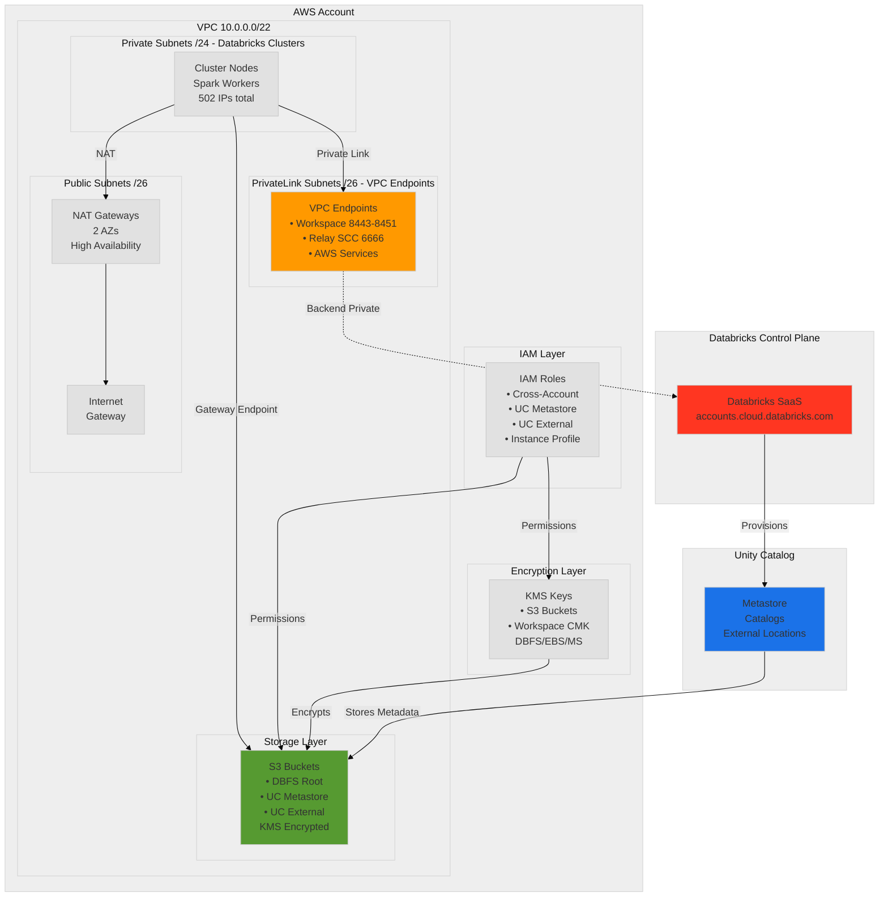
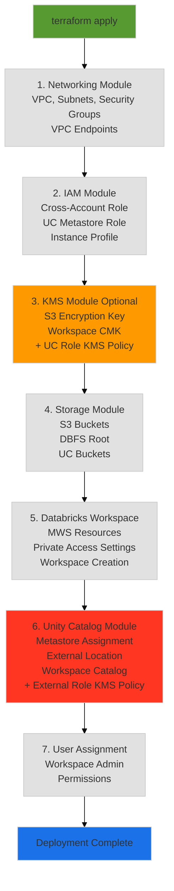
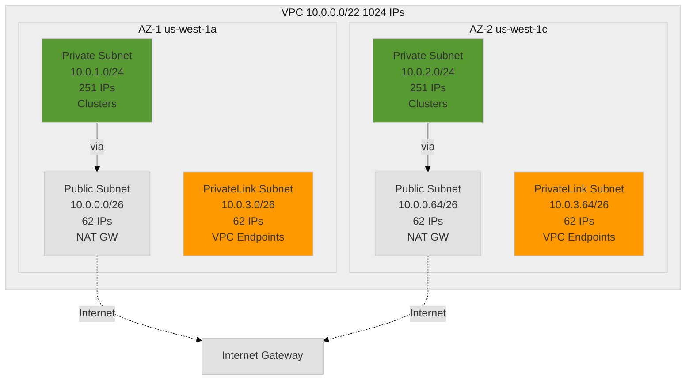
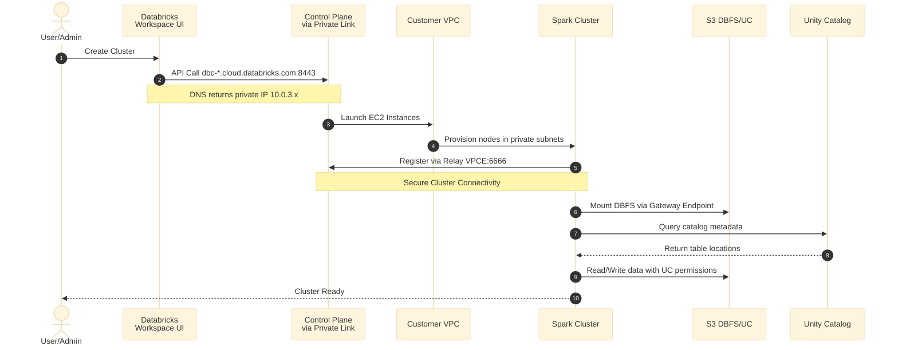
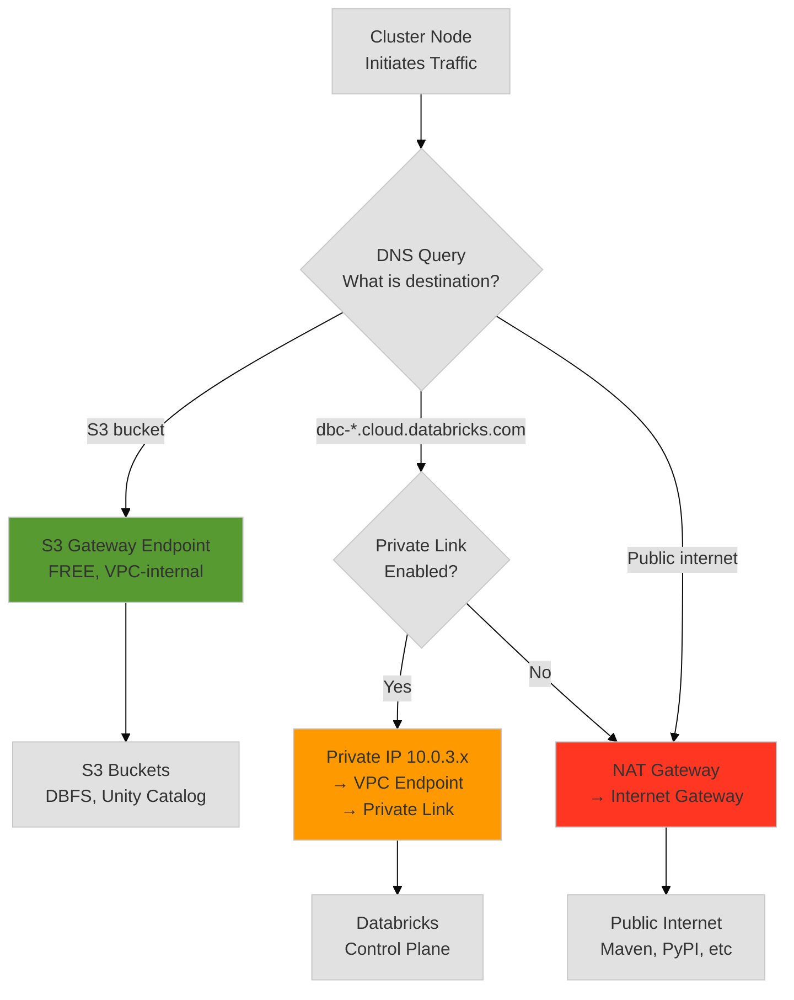
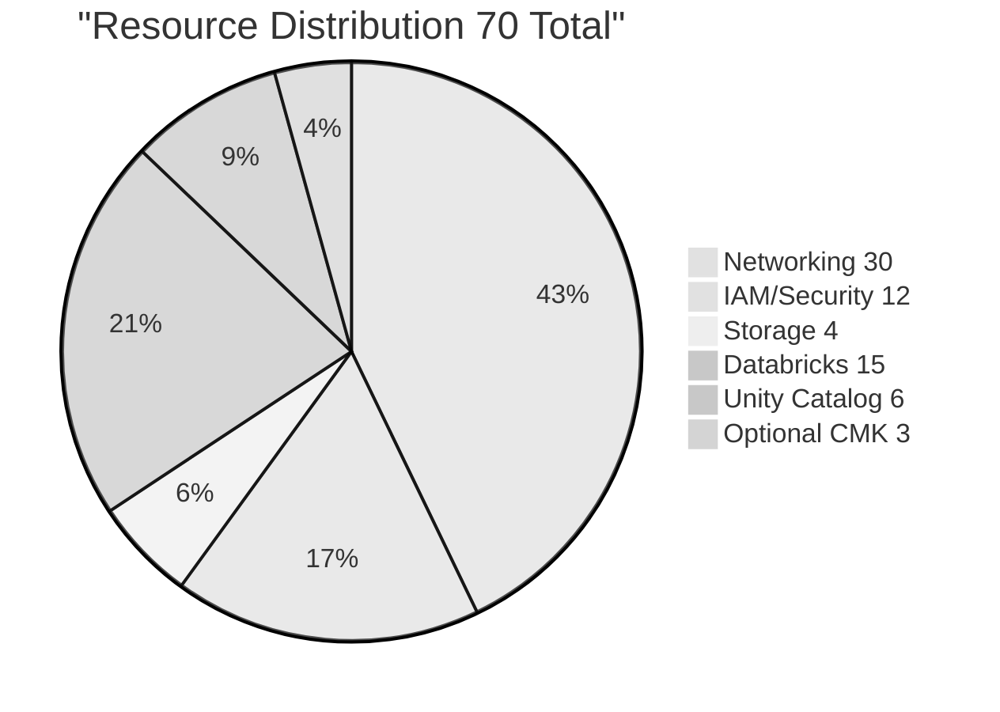
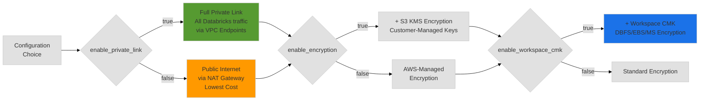

# 01 - Architecture & Deployment Flow

> **Visual Guide**: Understand the complete deployment architecture through modular diagrams.

## Quick Reference

```
📦 7 Terraform Modules → 65-70 AWS/Databricks Resources
⏱️  15-20 minutes deployment time
🔒 Private Link + Unity Catalog + CMK Encryption
```

---

## Table of Contents

1. [High-Level Architecture](#1-high-level-architecture)
2. [Module Dependency Flow](#2-module-dependency-flow)
3. [VPC & Network Layout](#3-vpc--network-layout)
4. [Deployment Sequence](#4-deployment-sequence)
5. [Resource Breakdown](#5-resource-breakdown)

---

## 1. High-Level Architecture

### 1.1 Complete System Overview



**Key Components:**
- **VPC**: Custom 10.0.0.0/22 CIDR with 3 subnet tiers
- **Private Link**: Optional VPC endpoints for secure connectivity
- **Unity Catalog**: Data governance layer with metastore
- **Encryption**: Optional customer-managed KMS keys
- **High Availability**: Multi-AZ deployment (2 availability zones)

---

## 2. Module Dependency Flow

### 2.1 Terraform Module Execution Order



**Critical Dependencies:**
- KMS depends on IAM (needs cross-account role ARN)
- Storage depends on KMS (for encrypted buckets)
- Workspace depends on Storage + IAM
- Unity Catalog depends on Workspace (needs workspace ID)
- User Assignment depends on Unity Catalog (must wait for UC resources)

**Docs**: [Databricks Terraform Provider](https://registry.terraform.io/providers/databricks/databricks/latest/docs)

---

## 3. VPC & Network Layout

### 3.1 Subnet Architecture



**IP Allocation:**
- **Public Subnets**: 124 IPs total (NAT Gateways)
- **Private Subnets**: 502 IPs total (Databricks clusters)
- **PrivateLink Subnets**: 124 IPs total (VPC endpoints)
- **Reserved**: AWS reserves first 4 + last 1 IP per subnet

**Docs**: [VPC and Subnets](https://docs.databricks.com/aws/en/administration-guide/cloud-configurations/aws/customer-managed-vpc.html)

### 3.2 Route Table Logic

```
Private Subnet Route Table:
┌─────────────────┬───────────────────┬──────────────────────┐
│   Destination   │      Target       │      Description     │
├─────────────────┼───────────────────┼──────────────────────┤
│  10.0.0.0/22    │      local        │  VPC-internal traffic│
│  0.0.0.0/0      │   nat-gateway     │  Internet via NAT    │
└─────────────────┴───────────────────┴──────────────────────┘

PrivateLink Subnet Route Table:
┌─────────────────┬───────────────────┬──────────────────────┐
│   Destination   │      Target       │      Description     │
├─────────────────┼───────────────────┼──────────────────────┤
│  10.0.0.0/22    │      local        │  VPC-internal only   │
└─────────────────┴───────────────────┴──────────────────────┘
```

---

## 4. Deployment Sequence

### 4.1 End-to-End Flow (Cluster Launch)



**Timeline:**
1. User action → API call (instant)
2. Control plane → VPC provisioning (30-60s)
3. Cluster startup → registration (2-5 min)
4. Unity Catalog → data access (instant)

**Docs**: [Cluster Creation](https://docs.databricks.com/aws/en/clusters/index.html)

### 4.2 Traffic Path Decision Tree



**Key Decision Points:**
1. **S3 traffic**: Always uses Gateway Endpoint (free)
2. **Databricks API**: Private Link if enabled, else NAT
3. **Public internet**: Always via NAT Gateway

---

## 5. Resource Breakdown

### 5.1 Resources by Category



### 5.2 Detailed Resource List

#### Networking Module (30 resources)
```
VPC & Subnets (9):
├── 1 VPC
├── 2 Public subnets
├── 2 Private subnets (Databricks clusters)
├── 2 PrivateLink subnets (VPC endpoints)
└── 2 NAT Gateways

Routing (7):
├── 3 Route tables (public, private, privatelink)
└── 6 Route table associations

VPC Endpoints (6):
├── Databricks Workspace VPCE (8443-8451) [Conditional: Private Link]
├── Databricks Relay VPCE (6666) [Conditional: Private Link]
├── S3 Gateway Endpoint (FREE, regional) [Always]
├── STS Interface Endpoint (regional) [Always]
├── Kinesis Interface Endpoint (regional) [Always]
└── RDS Endpoint: NOT CONFIGURED (Unity Catalog deployment)

Regional Endpoint Benefits:
├── Lower latency (direct regional connections)
├── Reduced cost (no cross-region data transfer)
└── Better security (traffic stays in region) ✅

Security Groups (8):
├── Workspace SG + 6 rules
└── VPCE SG + 1 rule
```

**Docs**: [VPC Requirements](https://docs.databricks.com/aws/en/administration-guide/cloud-configurations/aws/customer-managed-vpc.html)

#### IAM Module (12 resources)
```
Cross-Account Role (3):
├── IAM role
├── IAM policy (inline, Databricks-generated)
└── Policy attachment

Unity Catalog Metastore Role (3):
├── IAM role
├── IAM policy
└── Policy attachment

Instance Profile (3):
├── IAM role
├── IAM policy  
├── IAM instance profile

UC External Location Role (3):
├── Created in Unity Catalog module
├── Workspace-specific
└── Includes workspace ID in name
```

**Docs**: [IAM Roles](https://docs.databricks.com/aws/en/administration-guide/cloud-configurations/aws/iam-roles.html)

#### KMS Module (3 resources - optional)
```
S3 Bucket Encryption:
├── KMS key
├── KMS alias
└── Key policy

Workspace CMK (optional):
├── KMS key (DBFS/EBS/Managed Services)
├── KMS alias
└── Key policy

IAM Policies:
├── UC Metastore role KMS policy
└── UC External role KMS policy
```

**Docs**: [Customer-Managed Keys](https://docs.databricks.com/aws/en/security/keys/customer-managed-keys-managed-services-aws.html)

#### Storage Module (4 resources)
```
S3 Buckets:
├── DBFS Root bucket
├── Unity Catalog metastore bucket
├── Unity Catalog external location bucket
└── Unity Catalog root storage bucket (conditional)
```

**Docs**: [S3 Bucket Configuration](https://docs.databricks.com/aws/en/administration-guide/cloud-configurations/aws/configure-s3-access.html)

#### Databricks Workspace Module (15 resources)
```
MWS Resources:
├── Credentials configuration
├── Storage configuration
├── Network configuration
├── Customer-managed keys (optional)
└── Workspace

Private Access Settings:
├── PAS object (can be reused)
└── Public access control
```

**Docs**: [Workspace Configuration](https://docs.databricks.com/aws/en/getting-started/create-workspace.html)

#### Unity Catalog Module (6+ resources)
```
Metastore:
├── Metastore (or use existing)
├── Workspace assignment
└── Admin grants

External Storage:
├── Storage credential
├── External location
├── IAM role (workspace-specific)
├── IAM policy
└── Location grants

Workspace Catalog:
├── Catalog
├── Default namespace setting
└── Catalog admin grants
```

**Docs**: [Unity Catalog Setup](https://docs.databricks.com/aws/en/data-governance/unity-catalog/create-metastore.html)

### 5.3 Optional vs Required Resources

```
Always Created (55):
├── Networking: VPC, Subnets, NAT, AWS Service Endpoints
├── IAM: All roles
├── Storage: All S3 buckets
├── Workspace: MWS resources
└── Unity Catalog: Metastore assignment, catalog

Optional based on enable_private_link=true (2):
├── Databricks Workspace VPCE
└── Databricks Relay VPCE

Optional based on enable_encryption=true (3):
├── S3 encryption KMS key
└── 2x IAM policies for UC roles

Optional based on enable_workspace_cmk=true (2):
├── Workspace CMK key
└── Key policy

Optional based on existing_private_access_settings_id (1):
├── Private Access Settings (PAS)
```

---

## 6. Configuration Options

### 6.1 Deployment Scenarios



**Configuration Matrix:**

| Scenario | enable_private_link | enable_encryption | enable_workspace_cmk | Cost |
|----------|-------------------|------------------|---------------------|------|
| **Development** | false | false | false | $ |
| **Production Basic** | true | false | false | $$ |
| **Production Secure** | true | true | false | $$$ |
| **Maximum Security** | true | true | true | $$$$ |

---

## Next Steps

✅ Architecture understood → [02-IAM-SECURITY.md](02-IAM-SECURITY.md) - IAM roles and policies

✅ Ready to deploy → [04-QUICK-START.md](04-QUICK-START.md) - 5-minute deployment

**Docs**: [Databricks AWS Architecture](https://docs.databricks.com/aws/en/getting-started/overview.html)
