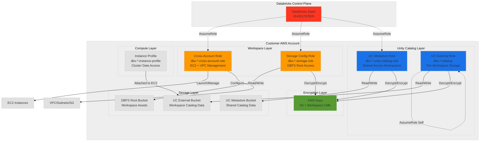
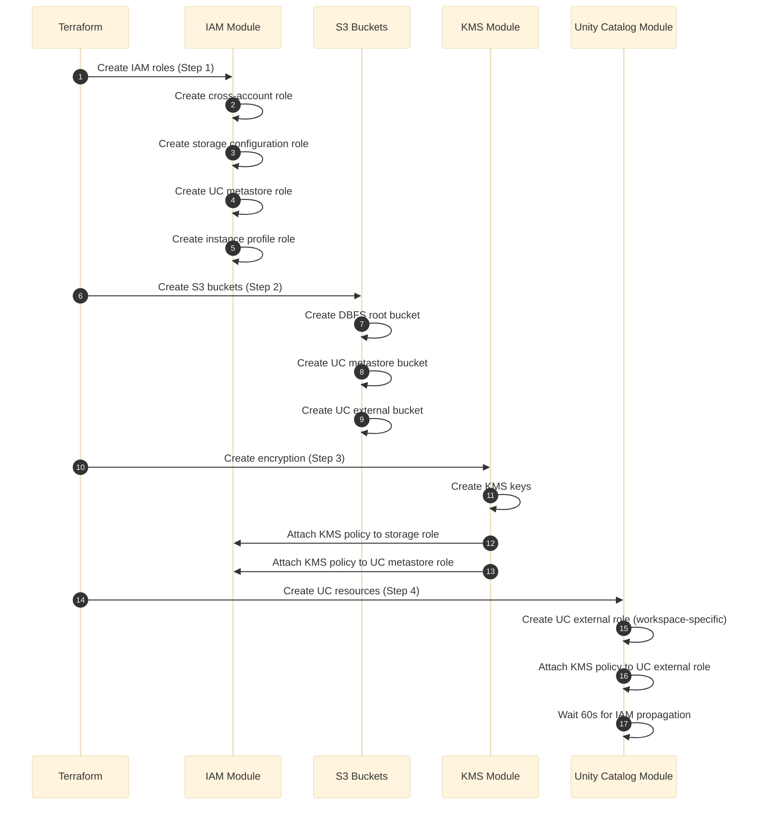
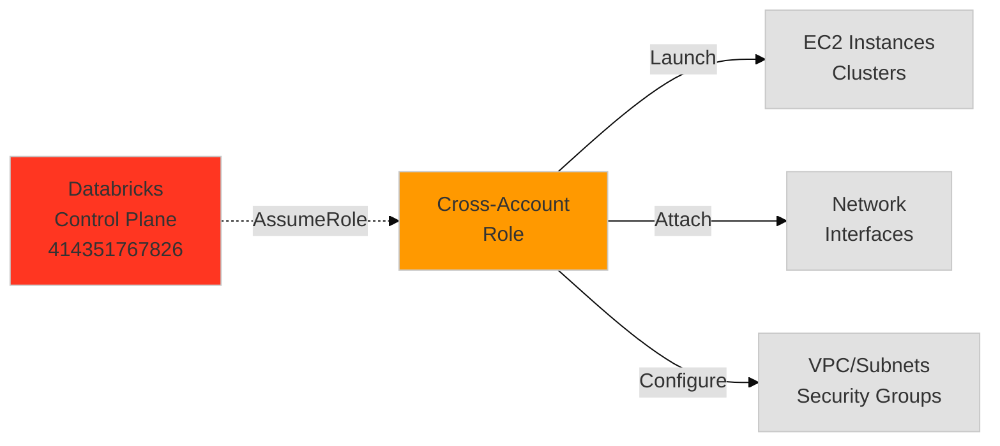
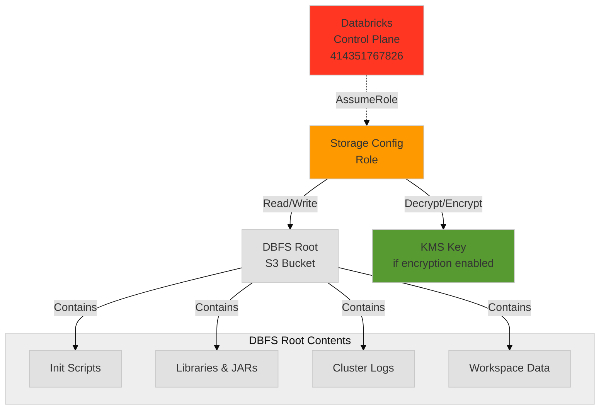
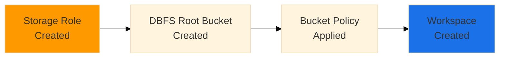
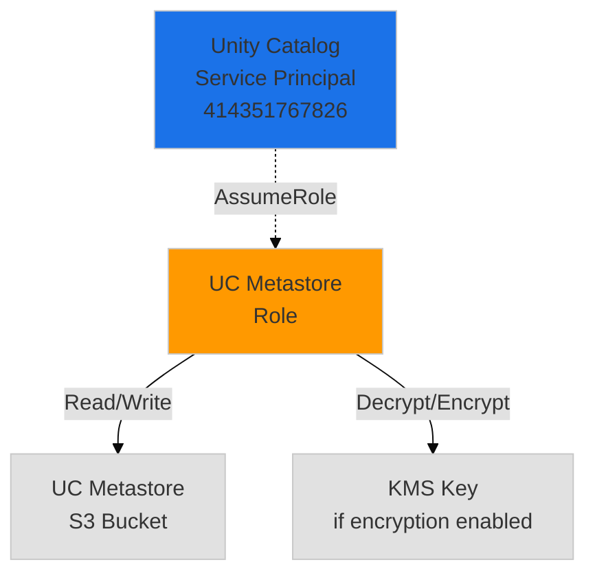
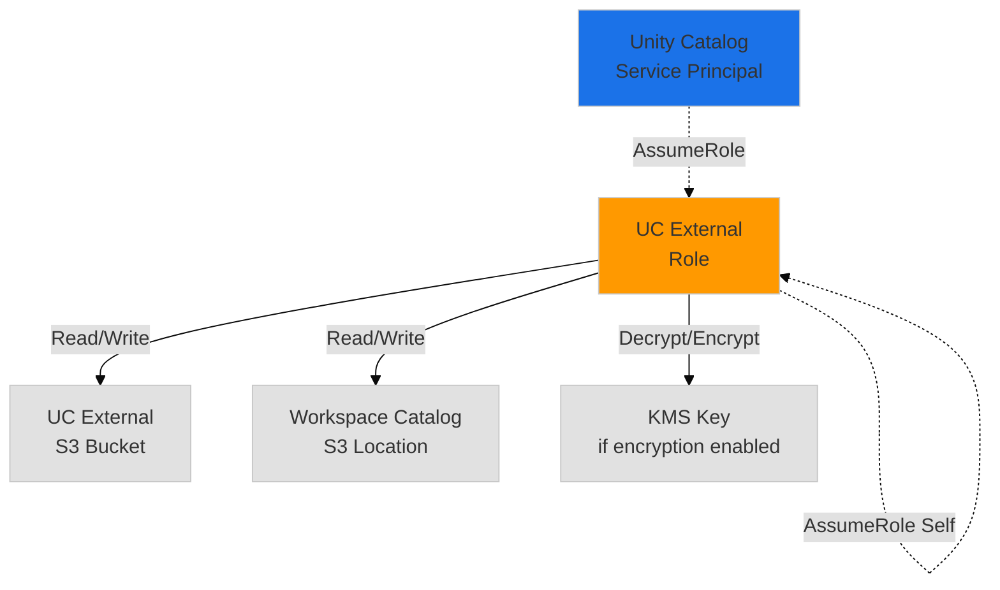
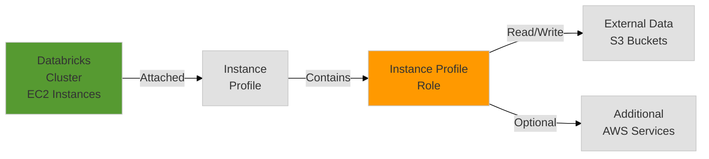
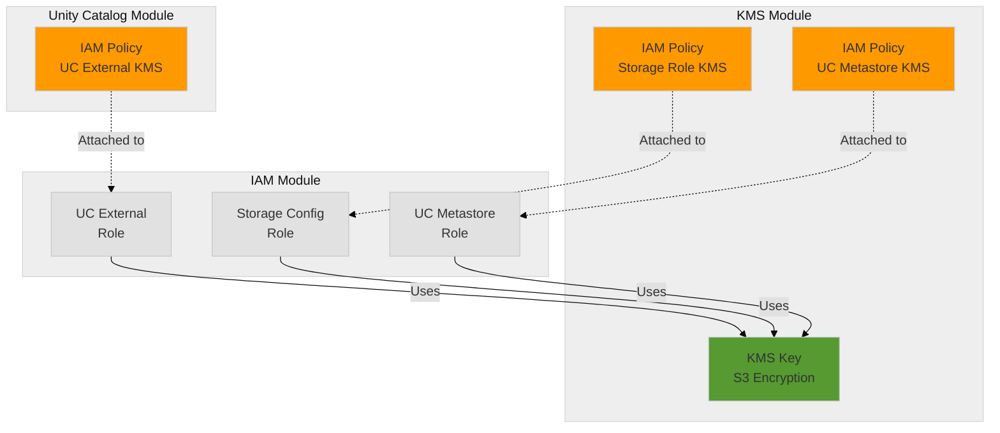
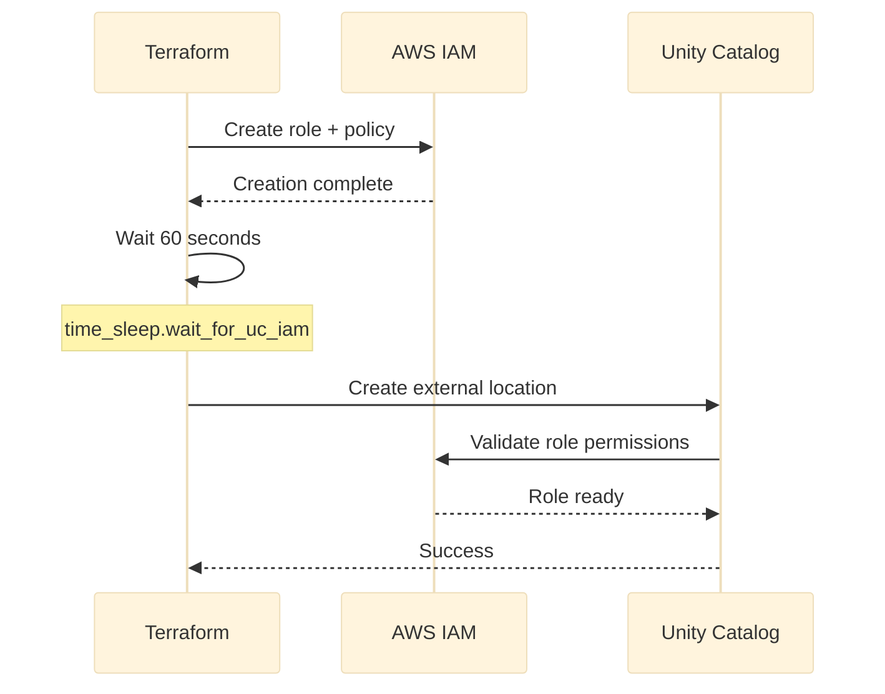

# 02 - IAM Roles, Policies & Security

> **Security Reference**: Complete guide to IAM roles, policies, and when they're created.

## Quick Reference

```
5 IAM Roles Created:
├── Cross-Account Role (Databricks Control Plane)
├── Storage Configuration Role (DBFS root bucket)
├── UC Metastore Role (Unity Catalog storage)
├── UC External Role (Per-workspace catalog storage)
└── Instance Profile Role (Cluster compute)

All roles can be pre-created ✅
```

---

## Table of Contents

1. [IAM Architecture](#1-iam-architecture)
2. [Cross-Account Role](#2-cross-account-role)
3. [Storage Configuration Role](#3-storage-configuration-role)
4. [Unity Catalog Roles](#4-unity-catalog-roles)
5. [Instance Profile Role](#5-instance-profile-role)
6. [KMS Encryption Policies](#6-kms-encryption-policies)
7. [Pre-Creation Guide](#7-pre-creation-guide)

---

## 1. IAM Architecture

### 1.1 Role Hierarchy & Purpose



**Docs**: [Databricks IAM Roles](https://docs.databricks.com/aws/en/administration-guide/cloud-configurations/aws/iam-roles.html)

### 1.2 Role Creation Timeline



**Key Points:**
- Cross-account, **storage configuration**, UC metastore, and instance profile created **early** (IAM module)
- UC external role created **late** (Unity Catalog module)
- KMS policies added automatically when `enable_encryption=true`

---

## 2. Cross-Account Role

### 2.1 Purpose & Trust Policy

**Role Name**: `{prefix}-cross-account-role`  
**Created By**: IAM module  
**Can Be Pre-Created**: ✅ Yes



**Trust Policy** (Who can assume):
```json
{
  "Version": "2012-10-17",
  "Statement": [{
    "Effect": "Allow",
    "Principal": {
      "AWS": "arn:aws:iam::414351767826:root"
    },
    "Action": "sts:AssumeRole",
    "Condition": {
      "StringEquals": {
        "sts:ExternalId": "<your-databricks-account-id>"
      }
    }
  }]
}
```

**Permissions Policy** (What it can do):  
Generated dynamically by Databricks provider: `databricks_aws_crossaccount_policy`

**Used By:**
- Databricks control plane for workspace management
- EC2 instance launches and terminations
- Network interface attachments
- VPC, subnet, and security group configuration

**Note**: This role does **not** directly access S3. S3 access is handled by the Storage Configuration Role.

**Docs**: [Cross-Account IAM Role](https://docs.databricks.com/aws/en/administration-guide/cloud-configurations/aws/iam-roles.html#step-1-create-a-cross-account-iam-role)

---

## 3. Storage Configuration Role

### 3.1 Purpose & Architecture

**Role Name**: `{prefix}-storage-role`  
**Created By**: IAM module  
**Can Be Pre-Created**: ✅ Yes  
**Scope**: DBFS root bucket access for workspace



**What This Role Controls:**
- 📁 **DBFS Root Storage**: Workspace-specific file storage
- 📚 **Libraries**: Python wheels, Maven JARs, uploaded packages
- 📝 **Logs**: Cluster driver/executor logs, init script output
- ⚙️ **Init Scripts**: Cluster startup scripts stored in DBFS
- 🗂️ **Workspace Files**: User-uploaded data files via DBFS

**How It Differs from Cross-Account Role:**

| Aspect | Cross-Account Role | Storage Configuration Role |
|--------|-------------------|---------------------------|
| **Purpose** | Workspace mgmt, EC2 launches | DBFS root data access |
| **Trust Principal** | `414351767826:root` | `414351767826:root` |
| **S3 Access** | ❌ No (uses Storage Role) | ✅ Yes (DBFS root only) |
| **EC2 Permissions** | ✅ Yes (launch, terminate) | ❌ No |
| **VPC Permissions** | ✅ Yes (configure, attach) | ❌ No |
| **Created By** | IAM module | IAM module |

**Docs**: [Storage Configuration](https://docs.databricks.com/aws/en/admin/workspace/create-uc-workspace?language=Customer-managed%C2%A0VPC%C2%A0with%C2%A0default%C2%A0restrictions#create-a-storage-configuration)

### 3.2 Trust Policy

**Trust Policy** (Who can assume):
```json
{
  "Version": "2012-10-17",
  "Statement": [{
    "Effect": "Allow",
    "Principal": {
      "AWS": "arn:aws:iam::414351767826:root"
    },
    "Action": "sts:AssumeRole",
    "Condition": {
      "StringEquals": {
        "sts:ExternalId": "<your-databricks-account-id>"
      }
    }
  }]
}
```

### 3.3 Permissions Policy

**Basic S3 Access Policy**:
```json
{
  "Version": "2012-10-17",
  "Statement": [
    {
      "Effect": "Allow",
      "Action": [
        "s3:GetObject",
        "s3:PutObject",
        "s3:DeleteObject"
      ],
      "Resource": "arn:aws:s3:::<DBFS-ROOT-BUCKET>/*"
    },
    {
      "Effect": "Allow",
      "Action": [
        "s3:ListBucket",
        "s3:GetBucketLocation"
      ],
      "Resource": "arn:aws:s3:::<DBFS-ROOT-BUCKET>"
    }
  ]
}
```

**With Customer-Managed Keys (Optional)**:
```json
{
  "Version": "2012-10-17",
  "Statement": [
    {
      "Effect": "Allow",
      "Action": [
        "s3:GetObject",
        "s3:PutObject",
        "s3:DeleteObject"
      ],
      "Resource": "arn:aws:s3:::<DBFS-ROOT-BUCKET>/*"
    },
    {
      "Effect": "Allow",
      "Action": [
        "s3:ListBucket",
        "s3:GetBucketLocation"
      ],
      "Resource": "arn:aws:s3:::<DBFS-ROOT-BUCKET>"
    },
    {
      "Effect": "Allow",
      "Action": [
        "kms:Decrypt",
        "kms:Encrypt",
        "kms:GenerateDataKey*"
      ],
      "Resource": ["arn:aws:kms:<REGION>:<ACCOUNT-ID>:key/<KMS-KEY-ID>"]
    }
  ]
}
```

**With File Events (Highly Recommended)**:

This optional policy grants Databricks permission to configure file events on the S3 bucket, which enables critical features like Auto Loader and incremental ingestion.

```json
{
  "Version": "2012-10-17",
  "Statement": [
    {
      "Sid": "ManagedFileEventsSetupStatement",
      "Effect": "Allow",
      "Action": [
        "s3:GetBucketNotification",
        "s3:PutBucketNotification",
        "sns:ListSubscriptionsByTopic",
        "sns:GetTopicAttributes",
        "sns:SetTopicAttributes",
        "sns:CreateTopic",
        "sns:TagResource",
        "sns:Publish",
        "sns:Subscribe",
        "sqs:CreateQueue",
        "sqs:DeleteMessage",
        "sqs:ReceiveMessage",
        "sqs:SendMessage",
        "sqs:GetQueueUrl",
        "sqs:GetQueueAttributes",
        "sqs:SetQueueAttributes",
        "sqs:TagQueue",
        "sqs:ChangeMessageVisibility",
        "sqs:PurgeQueue"
      ],
      "Resource": [
        "arn:aws:s3:::<DBFS-ROOT-BUCKET>",
        "arn:aws:sqs:*:*:*",
        "arn:aws:sns:*:*:*"
      ]
    },
    {
      "Sid": "ManagedFileEventsListStatement",
      "Effect": "Allow",
      "Action": [
        "sqs:ListQueues",
        "sqs:ListQueueTags",
        "sns:ListTopics"
      ],
      "Resource": "*"
    },
    {
      "Sid": "ManagedFileEventsTeardownStatement",
      "Effect": "Allow",
      "Action": [
        "sns:Unsubscribe",
        "sns:DeleteTopic",
        "sqs:DeleteQueue"
      ],
      "Resource": [
        "arn:aws:sqs:*:*:*",
        "arn:aws:sns:*:*:*"
      ]
    }
  ]
}
```

**Note**: If you don't grant file events permissions, you must configure them manually for each location, and some future Databricks features may not be available.

**Docs**: [File Events Policy](https://docs.databricks.com/aws/en/admin/workspace/create-uc-workspace?language=Customer-managed%C2%A0VPC%C2%A0with%C2%A0default%C2%A0restrictions#step-2-create-a-separate-iam-policy-for-file-events)

### 3.4 S3 Bucket Configuration

**Bucket Policy** (Applied to DBFS root bucket):
```json
{
  "Version": "2012-10-17",
  "Statement": [
    {
      "Sid": "Grant Databricks Access",
      "Effect": "Allow",
      "Principal": {
        "AWS": "arn:aws:iam::<YOUR-ACCOUNT-ID>:role/{prefix}-storage-role"
      },
      "Action": [
        "s3:GetObject",
        "s3:PutObject",
        "s3:DeleteObject",
        "s3:ListBucket",
        "s3:GetBucketLocation"
      ],
      "Resource": [
        "arn:aws:s3:::<DBFS-ROOT-BUCKET>/*",
        "arn:aws:s3:::<DBFS-ROOT-BUCKET>"
      ]
    }
  ]
}
```

**Bucket Naming Convention**:
```
{prefix}-dbfs-root-bucket
or
databricks-workspace-{workspace-id}
```

**Bucket Configuration Requirements**:
- ✅ Versioning: Recommended (for data recovery)
- ✅ Encryption: Required (SSE-S3 or SSE-KMS)
- ✅ Public Access: Blocked (all settings)
- ✅ Lifecycle Policy: Optional (for log retention)

### 3.5 Creation Timeline & Dependencies

**When It's Created**:
1. **Early** in IAM module (Step 1) alongside cross-account role
2. **Before** workspace creation
3. **Before** DBFS root bucket creation

**Dependencies**:


### 3.6 Pre-Creation Guide

**Manual Creation Steps**:

```bash
# 1. Create trust policy file
cat > storage-trust.json << EOF
{
  "Version": "2012-10-17",
  "Statement": [{
    "Effect": "Allow",
    "Principal": {
      "AWS": "arn:aws:iam::414351767826:root"
    },
    "Action": "sts:AssumeRole",
    "Condition": {
      "StringEquals": {
        "sts:ExternalId": "YOUR-DATABRICKS-ACCOUNT-ID"
      }
    }
  }]
}
EOF

# 2. Create role
aws iam create-role \
  --role-name my-databricks-storage-role \
  --assume-role-policy-document file://storage-trust.json

# 3. Create permissions policy file
cat > storage-policy.json << EOF
{
  "Version": "2012-10-17",
  "Statement": [
    {
      "Effect": "Allow",
      "Action": [
        "s3:GetObject",
        "s3:PutObject",
        "s3:DeleteObject"
      ],
      "Resource": "arn:aws:s3:::my-dbfs-root-bucket/*"
    },
    {
      "Effect": "Allow",
      "Action": [
        "s3:ListBucket",
        "s3:GetBucketLocation"
      ],
      "Resource": "arn:aws:s3:::my-dbfs-root-bucket"
    }
  ]
}
EOF

# 4. Attach policy to role
aws iam put-role-policy \
  --role-name my-databricks-storage-role \
  --policy-name databricks-storage-policy \
  --policy-document file://storage-policy.json

# 5. Create DBFS root bucket
aws s3 mb s3://my-dbfs-root-bucket --region us-west-2

# 6. Apply bucket policy
cat > bucket-policy.json << EOF
{
  "Version": "2012-10-17",
  "Statement": [{
    "Sid": "Grant Databricks Access",
    "Effect": "Allow",
    "Principal": {
      "AWS": "arn:aws:iam::YOUR-ACCOUNT-ID:role/my-databricks-storage-role"
    },
    "Action": [
      "s3:GetObject",
      "s3:PutObject",
      "s3:DeleteObject",
      "s3:ListBucket",
      "s3:GetBucketLocation"
    ],
    "Resource": [
      "arn:aws:s3:::my-dbfs-root-bucket/*",
      "arn:aws:s3:::my-dbfs-root-bucket"
    ]
  }]
}
EOF

aws s3api put-bucket-policy \
  --bucket my-dbfs-root-bucket \
  --policy file://bucket-policy.json
```

**Import to Terraform**:

```hcl
# Import existing role
terraform import module.iam.aws_iam_role.storage_role my-databricks-storage-role

# Import existing bucket
terraform import module.storage.aws_s3_bucket.dbfs_root my-dbfs-root-bucket
```

---

## 4. Unity Catalog Roles

### 4.1 Metastore Role (Shared)

**Role Name**: `{prefix}-unity-catalog-role`  
**Created By**: IAM module  
**Can Be Pre-Created**: ✅ Yes  
**Scope**: Shared across all workspaces using same metastore



**Trust Policy**:
```json
{
  "Version": "2012-10-17",
  "Statement": [{
    "Effect": "Allow",
    "Principal": {
      "AWS": "arn:aws:iam::414351767826:role/unity-catalog-prod-UCMasterRole-14S5ZJVKOTYTL"
    },
    "Action": "sts:AssumeRole",
    "Condition": {
      "StringEquals": {
        "sts:ExternalId": "<your-databricks-account-id>"
      }
    }
  }]
}
```

**Permissions Policy**:
```json
{
  "Version": "2012-10-17",
  "Statement": [
    {
      "Effect": "Allow",
      "Action": [
        "s3:GetObject",
        "s3:PutObject",
        "s3:DeleteObject",
        "s3:ListBucket",
        "s3:GetBucketLocation"
      ],
      "Resource": [
        "arn:aws:s3:::uc-metastore-bucket",
        "arn:aws:s3:::uc-metastore-bucket/*"
      ]
    },
    {
      "Effect": "Allow",
      "Action": [
        "kms:Decrypt",
        "kms:Encrypt",
        "kms:GenerateDataKey",
        "kms:DescribeKey",
        "kms:CreateGrant"
      ],
      "Resource": ["arn:aws:kms:region:account:key/key-id"]
    }
  ]
}
```

**Note**: KMS statement only added when `enable_encryption=true`

**Docs**: [Unity Catalog Storage](https://docs.databricks.com/aws/en/data-governance/unity-catalog/create-metastore.html#create-an-iam-role-for-unity-catalog)

### 4.2 External Location Role (Per-Workspace)

**Role Name**: `{prefix}-catalog-{workspace-id}`  
**Created By**: Unity Catalog module  
**Can Be Pre-Created**: ⚠️ No (requires workspace ID)  
**Scope**: Specific to one workspace



**Trust Policy** (Self-assuming + UC):
```json
{
  "Version": "2012-10-17",
  "Statement": [
    {
      "Sid": "UnityCatalogAssumeRole",
      "Effect": "Allow",
      "Principal": {
        "AWS": "arn:aws:iam::414351767826:role/unity-catalog-prod-UCMasterRole-14S5ZJVKOTYTL"
      },
      "Action": "sts:AssumeRole",
      "Condition": {
        "StringEquals": {
          "sts:ExternalId": "<your-databricks-account-id>"
        }
      }
    },
    {
      "Sid": "ExplicitSelfRoleAssumption",
      "Effect": "Allow",
      "Principal": {
        "AWS": "arn:aws:iam::<your-account-id>:root"
      },
      "Action": "sts:AssumeRole",
      "Condition": {
        "ArnLike": {
          "aws:PrincipalArn": "arn:aws:iam::<your-account-id>:role/{prefix}-catalog-{workspace-id}"
        },
        "StringEquals": {
          "sts:ExternalId": "<your-databricks-account-id>"
        }
      }
    }
  ]
}
```

**Permissions Policy**:  
Generated by Databricks provider: `databricks_aws_unity_catalog_policy` + KMS permissions

**Used By:**
- Workspace-specific external locations
- Catalog storage locations
- Data access for specific workspace

**Docs**: [External Locations](https://docs.databricks.com/aws/en/data-governance/unity-catalog/create-tables.html#create-an-external-location)

---

## 5. Instance Profile Role

### 5.1 Cluster Compute Access

**Role Name**: `{prefix}-instance-profile-role`  
**Created By**: IAM module  
**Can Be Pre-Created**: ✅ Yes



**Trust Policy** (EC2 service):
```json
{
  "Version": "2012-10-17",
  "Statement": [{
    "Effect": "Allow",
    "Principal": {
      "Service": "ec2.amazonaws.com"
    },
    "Action": "sts:AssumeRole"
  }]
}
```

**Permissions Policy** (Minimal by default):
```json
{
  "Version": "2012-10-17",
  "Statement": [{
    "Effect": "Allow",
    "Action": [
      "s3:ListBucket",
      "s3:GetObject",
      "s3:PutObject"
    ],
    "Resource": [
      "arn:aws:s3:::uc-external-bucket",
      "arn:aws:s3:::uc-external-bucket/*"
    ]
  }]
}
```

**Note**: Policy can be customized for additional data sources

**Used By:**
- Attached to EC2 instances in Databricks clusters
- Direct S3 access from clusters
- Optional: Access to other AWS services (Glue, Athena, etc.)

**Docs**: [Instance Profiles](https://docs.databricks.com/aws/en/administration-guide/cloud-configurations/aws/instance-profiles.html)

---

## 6. KMS Encryption Policies

### 6.1 KMS Policy Architecture

When `enable_encryption=true`, three additional inline IAM policies are created:



### 6.2 KMS Permissions

All three roles (Storage Config, UC Metastore, UC External) receive the same KMS permissions:

```json
{
  "Version": "2012-10-17",
  "Statement": [{
    "Effect": "Allow",
    "Action": [
      "kms:Decrypt",
      "kms:Encrypt",
      "kms:GenerateDataKey",
      "kms:DescribeKey",
      "kms:CreateGrant"
    ],
    "Resource": ["arn:aws:kms:region:account:key/key-id"]
  }]
}
```

**Why Three Policies?**
- **Storage Role**: Created early in IAM module, KMS policy added by KMS module
- **Metastore Role**: Created early in IAM module, KMS policy added by KMS module
- **External Role**: Created late in UC module, KMS policy added by UC module
- Avoids circular dependencies in Terraform

**Docs**: [Customer-Managed Keys](https://docs.databricks.com/aws/en/security/keys/customer-managed-keys-s3.html)

---

## 7. Pre-Creation Guide

### 7.1 Roles That Can Be Pre-Created

```
✅ Cross-Account Role
✅ Storage Configuration Role
✅ UC Metastore Role
✅ Instance Profile Role
⚠️ UC External Role (requires workspace ID - cannot pre-create)
```

### 7.2 Pre-Creation Steps

#### Step 1: Create Cross-Account Role Manually

```bash
# 1. Create trust policy file
cat > cross-account-trust.json << EOF
{
  "Version": "2012-10-17",
  "Statement": [{
    "Effect": "Allow",
    "Principal": {
      "AWS": "arn:aws:iam::414351767826:root"
    },
    "Action": "sts:AssumeRole",
    "Condition": {
      "StringEquals": {
        "sts:ExternalId": "YOUR-DATABRICKS-ACCOUNT-ID"
      }
    }
  }]
}
EOF

# 2. Create role
aws iam create-role \
  --role-name my-databricks-cross-account-role \
  --assume-role-policy-document file://cross-account-trust.json

# 3. Get policy from Databricks provider (run terraform plan to see it)
# 4. Attach the policy
```

#### Step 2: Import to Terraform

```hcl
# Import existing role
terraform import module.iam.aws_iam_role.cross_account_role my-databricks-cross-account-role
```

### 7.3 When NOT to Pre-Create

**Don't pre-create if:**
- First deployment (let Terraform manage everything)
- Using existing metastore (metastore role already exists)
- Need to change role names frequently

**Pre-create if:**
- Corporate policy requires manual IAM approval
- Multi-workspace deployment with shared roles
- Need to control role ARNs beforehand

---

## 8. Security Best Practices

### 8.1 Least Privilege Principle

```
✅ Each role has minimal required permissions
✅ Trust policies use ExternalId for security
✅ KMS policies only added when encryption enabled
✅ Instance profile has no default permissions (must configure)
```

### 8.2 Role Name Uniqueness

```
Role Name Pattern:
{prefix}-{role-type}-{optional-workspace-id}

Examples:
├── dbx-prod-cross-account-role
├── dbx-prod-storage-role
├── dbx-prod-unity-catalog-role
├── dbx-prod-instance-profile-role
└── dbx-prod-catalog-7474654592998885 (workspace-specific)
```

### 8.3 IAM Propagation Wait Time



**Why Wait?**
- AWS IAM changes take time to propagate globally
- Can take 30-60 seconds for role to be usable
- Prevents "Role not found" errors

---

## Next Steps

✅ IAM security understood → [03-NETWORK-ENCRYPTION.md](03-NETWORK-ENCRYPTION.md) - Network & encryption flows

✅ Ready to deploy → [04-QUICK-START.md](04-QUICK-START.md) - 5-minute deployment

**Docs**: [Databricks IAM Best Practices](https://docs.databricks.com/aws/en/administration-guide/cloud-configurations/aws/iam-roles.html#best-practices)
