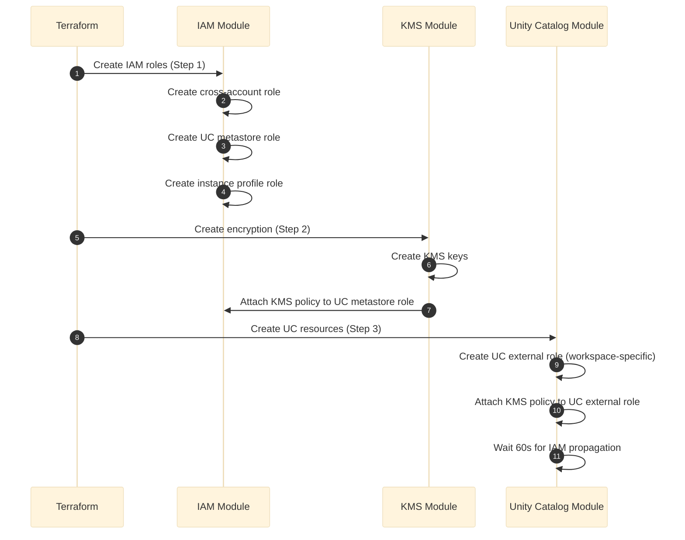
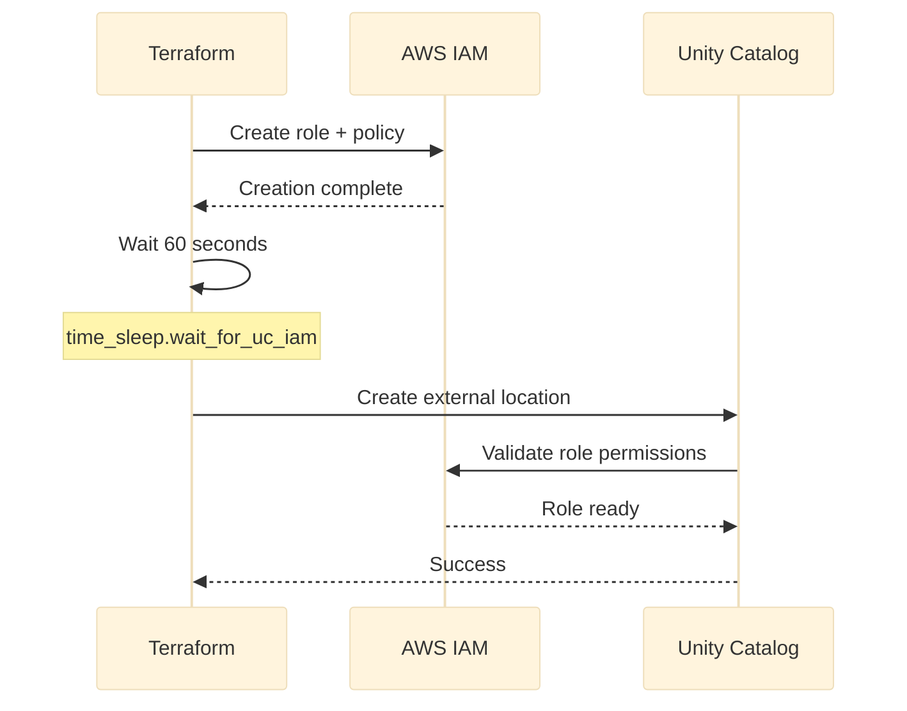

***REMOVED*** 02 - IAM Roles, Policies & Security

> **Security Reference**: Complete guide to IAM roles, policies, and when they're created.

***REMOVED******REMOVED*** Quick Reference

```
4 IAM Roles Created:
├── Cross-Account Role (Databricks Control Plane)
├── UC Metastore Role (Unity Catalog storage)
├── UC External Role (Per-workspace catalog storage)
└── Instance Profile Role (Cluster compute)

All roles can be pre-created ✅
```

---

***REMOVED******REMOVED*** Table of Contents

1. [IAM Architecture](***REMOVED***1-iam-architecture)
2. [Cross-Account Role](***REMOVED***2-cross-account-role)
3. [Unity Catalog Roles](***REMOVED***3-unity-catalog-roles)
4. [Instance Profile Role](***REMOVED***4-instance-profile-role)
5. [KMS Encryption Policies](***REMOVED***5-kms-encryption-policies)
6. [Pre-Creation Guide](***REMOVED***6-pre-creation-guide)

---

***REMOVED******REMOVED*** 1. IAM Architecture

***REMOVED******REMOVED******REMOVED*** 1.1 Role Hierarchy & Purpose

```mermaid
%%{init: {'theme': 'base', 'themeVariables': { 'primaryColor': '***REMOVED***e1e1e1'}}}%%
flowchart TD
    subgraph "Databricks Control Plane"
        CP["Databricks SaaS<br/>414351767826"]
    end
    
    subgraph "Customer AWS Account"
        subgraph "Workspace Layer"
            CROSS["Cross-Account Role<br/>dbx-*-cross-account-role<br/>Workspace Management"]
        end
        
        subgraph "Unity Catalog Layer"
            UCMETA["UC Metastore Role<br/>dbx-*-unity-catalog-role<br/>Shared Across Workspaces"]
            UCEXT["UC External Role<br/>dbx-*-catalog-<workspace-id><br/>Per-Workspace Storage"]
        end
        
        subgraph "Compute Layer"
            INSTANCE["Instance Profile<br/>dbx-*-instance-profile<br/>Cluster Data Access"]
        end
        
        subgraph "Storage Layer"
            S3["S3 Buckets<br/>DBFS, UC Metastore, UC External"]
        end
        
        subgraph "Encryption Layer"
            KMS["KMS Keys<br/>S3 + Workspace CMK"]
        end
    end
    
    CP -.->|AssumeRole| CROSS
    CROSS -->|Manages| S3
    CP -.->|AssumeRole| UCMETA
    UCMETA -->|Read/Write| S3
    UCEXT -.->|AssumeRole Self| UCEXT
    UCEXT -->|Read/Write| S3
    INSTANCE -->|Attached to EC2| S3
    UCMETA -->|Decrypt/Encrypt| KMS
    UCEXT -->|Decrypt/Encrypt| KMS
    
    style CP fill:***REMOVED***FF3621,color:***REMOVED***fff
    style CROSS fill:***REMOVED***FF9900,color:***REMOVED***000
    style UCMETA fill:***REMOVED***1B72E8,color:***REMOVED***fff
    style UCEXT fill:***REMOVED***1B72E8,color:***REMOVED***fff
    style KMS fill:***REMOVED***569A31,color:***REMOVED***fff
```

**Docs**: [Databricks IAM Roles](https://docs.databricks.com/aws/en/administration-guide/cloud-configurations/aws/iam-roles.html)

***REMOVED******REMOVED******REMOVED*** 1.2 Role Creation Timeline



**Key Points:**
- Cross-account, UC metastore, and instance profile created **early** (IAM module)
- UC external role created **late** (Unity Catalog module)
- KMS policies added automatically when `enable_encryption=true`

---

***REMOVED******REMOVED*** 2. Cross-Account Role

***REMOVED******REMOVED******REMOVED*** 2.1 Purpose & Trust Policy

**Role Name**: `{prefix}-cross-account-role`  
**Created By**: IAM module  
**Can Be Pre-Created**: ✅ Yes

```mermaid
%%{init: {'theme': 'base', 'themeVariables': { 'primaryColor': '***REMOVED***e1e1e1'}}}%%
flowchart LR
    DB["Databricks<br/>Control Plane<br/>414351767826"] -.->|AssumeRole| ROLE["Cross-Account<br/>Role"]
    ROLE -->|Manage| S3["Root DBFS<br/>Bucket"]
    ROLE -->|Launch| EC2["EC2 Instances<br/>Clusters"]
    ROLE -->|Attach| ENI["Network<br/>Interfaces"]
    
    style DB fill:***REMOVED***FF3621,color:***REMOVED***fff
    style ROLE fill:***REMOVED***FF9900,color:***REMOVED***000
```

**Trust Policy** (Who can assume):
```json
{
  "Version": "2012-10-17",
  "Statement": [{
    "Effect": "Allow",
    "Principal": {
      "AWS": "arn:aws:iam::414351767826:root"
    },
    "Action": "sts:AssumeRole",
    "Condition": {
      "StringEquals": {
        "sts:ExternalId": "<your-databricks-account-id>"
      }
    }
  }]
}
```

**Permissions Policy** (What it can do):  
Generated dynamically by Databricks provider: `databricks_aws_crossaccount_policy`

**Used By:**
- Databricks control plane for workspace management
- EC2 instance launches
- Network interface attachments
- S3 DBFS root bucket access

**Docs**: [Cross-Account IAM Role](https://docs.databricks.com/aws/en/administration-guide/cloud-configurations/aws/iam-roles.html***REMOVED***step-1-create-a-cross-account-iam-role)

---

***REMOVED******REMOVED*** 3. Unity Catalog Roles

***REMOVED******REMOVED******REMOVED*** 3.1 Metastore Role (Shared)

**Role Name**: `{prefix}-unity-catalog-role`  
**Created By**: IAM module  
**Can Be Pre-Created**: ✅ Yes  
**Scope**: Shared across all workspaces using same metastore

```mermaid
%%{init: {'theme': 'base', 'themeVariables': { 'primaryColor': '***REMOVED***e1e1e1'}}}%%
flowchart TD
    UC["Unity Catalog<br/>Service Principal<br/>414351767826"] -.->|AssumeRole| ROLE["UC Metastore<br/>Role"]
    ROLE -->|Read/Write| META["UC Metastore<br/>S3 Bucket"]
    ROLE -->|Decrypt/Encrypt| KMS["KMS Key<br/>if encryption enabled"]
    
    style UC fill:***REMOVED***1B72E8,color:***REMOVED***fff
    style ROLE fill:***REMOVED***FF9900,color:***REMOVED***000
```

**Trust Policy**:
```json
{
  "Version": "2012-10-17",
  "Statement": [{
    "Effect": "Allow",
    "Principal": {
      "AWS": "arn:aws:iam::414351767826:role/unity-catalog-prod-UCMasterRole-14S5ZJVKOTYTL"
    },
    "Action": "sts:AssumeRole",
    "Condition": {
      "StringEquals": {
        "sts:ExternalId": "<your-databricks-account-id>"
      }
    }
  }]
}
```

**Permissions Policy**:
```json
{
  "Version": "2012-10-17",
  "Statement": [
    {
      "Effect": "Allow",
      "Action": [
        "s3:GetObject",
        "s3:PutObject",
        "s3:DeleteObject",
        "s3:ListBucket",
        "s3:GetBucketLocation"
      ],
      "Resource": [
        "arn:aws:s3:::uc-metastore-bucket",
        "arn:aws:s3:::uc-metastore-bucket/*"
      ]
    },
    {
      "Effect": "Allow",
      "Action": [
        "kms:Decrypt",
        "kms:Encrypt",
        "kms:GenerateDataKey",
        "kms:DescribeKey",
        "kms:CreateGrant"
      ],
      "Resource": ["arn:aws:kms:region:account:key/key-id"]
    }
  ]
}
```

**Note**: KMS statement only added when `enable_encryption=true`

**Docs**: [Unity Catalog Storage](https://docs.databricks.com/aws/en/data-governance/unity-catalog/create-metastore.html***REMOVED***create-an-iam-role-for-unity-catalog)

***REMOVED******REMOVED******REMOVED*** 3.2 External Location Role (Per-Workspace)

**Role Name**: `{prefix}-catalog-{workspace-id}`  
**Created By**: Unity Catalog module  
**Can Be Pre-Created**: ⚠️ No (requires workspace ID)  
**Scope**: Specific to one workspace

```mermaid
%%{init: {'theme': 'base', 'themeVariables': { 'primaryColor': '***REMOVED***e1e1e1'}}}%%
flowchart TD
    UC["Unity Catalog<br/>Service Principal"] -.->|AssumeRole| ROLE["UC External<br/>Role"]
    ROLE -.->|AssumeRole Self| ROLE
    ROLE -->|Read/Write| EXT["UC External<br/>S3 Bucket"]
    ROLE -->|Read/Write| CAT["Workspace Catalog<br/>S3 Location"]
    ROLE -->|Decrypt/Encrypt| KMS["KMS Key<br/>if encryption enabled"]
    
    style UC fill:***REMOVED***1B72E8,color:***REMOVED***fff
    style ROLE fill:***REMOVED***FF9900,color:***REMOVED***000
```

**Trust Policy** (Self-assuming + UC):
```json
{
  "Version": "2012-10-17",
  "Statement": [
    {
      "Sid": "UnityCatalogAssumeRole",
      "Effect": "Allow",
      "Principal": {
        "AWS": "arn:aws:iam::414351767826:role/unity-catalog-prod-UCMasterRole-14S5ZJVKOTYTL"
      },
      "Action": "sts:AssumeRole",
      "Condition": {
        "StringEquals": {
          "sts:ExternalId": "<your-databricks-account-id>"
        }
      }
    },
    {
      "Sid": "ExplicitSelfRoleAssumption",
      "Effect": "Allow",
      "Principal": {
        "AWS": "arn:aws:iam::<your-account-id>:root"
      },
      "Action": "sts:AssumeRole",
      "Condition": {
        "ArnLike": {
          "aws:PrincipalArn": "arn:aws:iam::<your-account-id>:role/{prefix}-catalog-{workspace-id}"
        },
        "StringEquals": {
          "sts:ExternalId": "<your-databricks-account-id>"
        }
      }
    }
  ]
}
```

**Permissions Policy**:  
Generated by Databricks provider: `databricks_aws_unity_catalog_policy` + KMS permissions

**Used By:**
- Workspace-specific external locations
- Catalog storage locations
- Data access for specific workspace

**Docs**: [External Locations](https://docs.databricks.com/aws/en/data-governance/unity-catalog/create-tables.html***REMOVED***create-an-external-location)

---

***REMOVED******REMOVED*** 4. Instance Profile Role

***REMOVED******REMOVED******REMOVED*** 4.1 Cluster Compute Access

**Role Name**: `{prefix}-instance-profile-role`  
**Created By**: IAM module  
**Can Be Pre-Created**: ✅ Yes

```mermaid
%%{init: {'theme': 'base', 'themeVariables': { 'primaryColor': '***REMOVED***e1e1e1'}}}%%
flowchart LR
    CLUSTER["Databricks<br/>Cluster<br/>EC2 Instances"] -->|Attached| PROFILE["Instance<br/>Profile"]
    PROFILE -->|Contains| ROLE["Instance Profile<br/>Role"]
    ROLE -->|Read/Write| S3["External Data<br/>S3 Buckets"]
    ROLE -->|Optional| OTHER["Additional<br/>AWS Services"]
    
    style CLUSTER fill:***REMOVED***569A31,color:***REMOVED***fff
    style ROLE fill:***REMOVED***FF9900,color:***REMOVED***000
```

**Trust Policy** (EC2 service):
```json
{
  "Version": "2012-10-17",
  "Statement": [{
    "Effect": "Allow",
    "Principal": {
      "Service": "ec2.amazonaws.com"
    },
    "Action": "sts:AssumeRole"
  }]
}
```

**Permissions Policy** (Minimal by default):
```json
{
  "Version": "2012-10-17",
  "Statement": [{
    "Effect": "Allow",
    "Action": [
      "s3:ListBucket",
      "s3:GetObject",
      "s3:PutObject"
    ],
    "Resource": [
      "arn:aws:s3:::uc-external-bucket",
      "arn:aws:s3:::uc-external-bucket/*"
    ]
  }]
}
```

**Note**: Policy can be customized for additional data sources

**Used By:**
- Attached to EC2 instances in Databricks clusters
- Direct S3 access from clusters
- Optional: Access to other AWS services (Glue, Athena, etc.)

**Docs**: [Instance Profiles](https://docs.databricks.com/aws/en/administration-guide/cloud-configurations/aws/instance-profiles.html)

---

***REMOVED******REMOVED*** 5. KMS Encryption Policies

***REMOVED******REMOVED******REMOVED*** 5.1 KMS Policy Architecture

When `enable_encryption=true`, two additional inline IAM policies are created:

```mermaid
%%{init: {'theme': 'base', 'themeVariables': { 'primaryColor': '***REMOVED***e1e1e1'}}}%%
flowchart TD
    subgraph "KMS Module"
        KMS["KMS Key<br/>S3 Encryption"]
        POL1["IAM Policy<br/>UC Metastore KMS"]
    end
    
    subgraph "Unity Catalog Module"
        POL2["IAM Policy<br/>UC External KMS"]
    end
    
    subgraph "IAM Module"
        META["UC Metastore<br/>Role"]
        EXT["UC External<br/>Role"]
    end
    
    POL1 -.->|Attached to| META
    POL2 -.->|Attached to| EXT
    META -->|Uses| KMS
    EXT -->|Uses| KMS
    
    style KMS fill:***REMOVED***569A31,color:***REMOVED***fff
    style POL1 fill:***REMOVED***FF9900,color:***REMOVED***000
    style POL2 fill:***REMOVED***FF9900,color:***REMOVED***000
```

***REMOVED******REMOVED******REMOVED*** 5.2 KMS Permissions

Both UC roles receive the same KMS permissions:

```json
{
  "Version": "2012-10-17",
  "Statement": [{
    "Effect": "Allow",
    "Action": [
      "kms:Decrypt",
      "kms:Encrypt",
      "kms:GenerateDataKey",
      "kms:DescribeKey",
      "kms:CreateGrant"
    ],
    "Resource": ["arn:aws:kms:region:account:key/key-id"]
  }]
}
```

**Why Two Policies?**
- **Metastore Role**: Created early in IAM module, KMS policy added by KMS module
- **External Role**: Created late in UC module, KMS policy added by UC module
- Avoids circular dependencies in Terraform

**Docs**: [Customer-Managed Keys](https://docs.databricks.com/aws/en/security/keys/customer-managed-keys-s3.html)

---

***REMOVED******REMOVED*** 6. Pre-Creation Guide

***REMOVED******REMOVED******REMOVED*** 6.1 Roles That Can Be Pre-Created

```
✅ Cross-Account Role
✅ UC Metastore Role
✅ Instance Profile Role
⚠️ UC External Role (requires workspace ID - cannot pre-create)
```

***REMOVED******REMOVED******REMOVED*** 6.2 Pre-Creation Steps

***REMOVED******REMOVED******REMOVED******REMOVED*** Step 1: Create Cross-Account Role Manually

```bash
***REMOVED*** 1. Create trust policy file
cat > cross-account-trust.json << EOF
{
  "Version": "2012-10-17",
  "Statement": [{
    "Effect": "Allow",
    "Principal": {
      "AWS": "arn:aws:iam::414351767826:root"
    },
    "Action": "sts:AssumeRole",
    "Condition": {
      "StringEquals": {
        "sts:ExternalId": "YOUR-DATABRICKS-ACCOUNT-ID"
      }
    }
  }]
}
EOF

***REMOVED*** 2. Create role
aws iam create-role \
  --role-name my-databricks-cross-account-role \
  --assume-role-policy-document file://cross-account-trust.json

***REMOVED*** 3. Get policy from Databricks provider (run terraform plan to see it)
***REMOVED*** 4. Attach the policy
```

***REMOVED******REMOVED******REMOVED******REMOVED*** Step 2: Import to Terraform

```hcl
***REMOVED*** Import existing role
terraform import module.iam.aws_iam_role.cross_account_role my-databricks-cross-account-role
```

***REMOVED******REMOVED******REMOVED*** 6.3 When NOT to Pre-Create

**Don't pre-create if:**
- First deployment (let Terraform manage everything)
- Using existing metastore (metastore role already exists)
- Need to change role names frequently

**Pre-create if:**
- Corporate policy requires manual IAM approval
- Multi-workspace deployment with shared roles
- Need to control role ARNs beforehand

---

***REMOVED******REMOVED*** 7. Security Best Practices

***REMOVED******REMOVED******REMOVED*** 7.1 Least Privilege Principle

```
✅ Each role has minimal required permissions
✅ Trust policies use ExternalId for security
✅ KMS policies only added when encryption enabled
✅ Instance profile has no default permissions (must configure)
```

***REMOVED******REMOVED******REMOVED*** 7.2 Role Name Uniqueness

```
Role Name Pattern:
{prefix}-{role-type}-{optional-workspace-id}

Examples:
├── dbx-prod-cross-account-role
├── dbx-prod-unity-catalog-role
├── dbx-prod-instance-profile-role
└── dbx-prod-catalog-7474654592998885 (workspace-specific)
```

***REMOVED******REMOVED******REMOVED*** 7.3 IAM Propagation Wait Time



**Why Wait?**
- AWS IAM changes take time to propagate globally
- Can take 30-60 seconds for role to be usable
- Prevents "Role not found" errors

---

***REMOVED******REMOVED*** Next Steps

✅ IAM security understood → [03-NETWORK-ENCRYPTION.md](03-NETWORK-ENCRYPTION.md) - Network & encryption flows

✅ Ready to deploy → [04-QUICK-START.md](04-QUICK-START.md) - 5-minute deployment

**Docs**: [Databricks IAM Best Practices](https://docs.databricks.com/aws/en/administration-guide/cloud-configurations/aws/iam-roles.html***REMOVED***best-practices)
