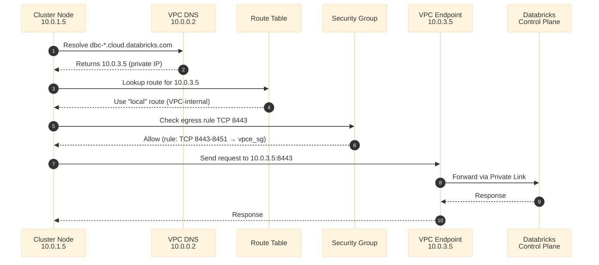
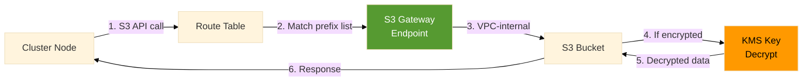
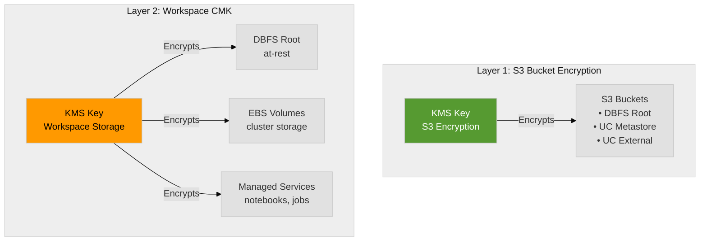
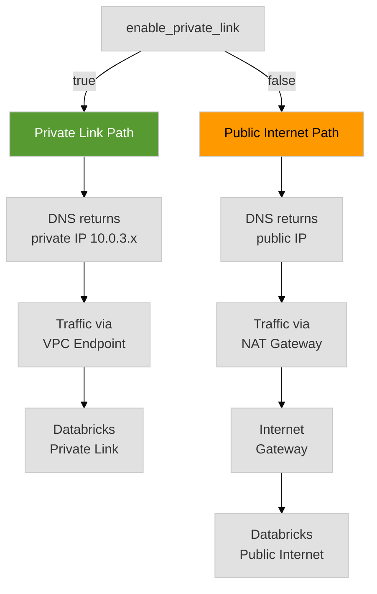
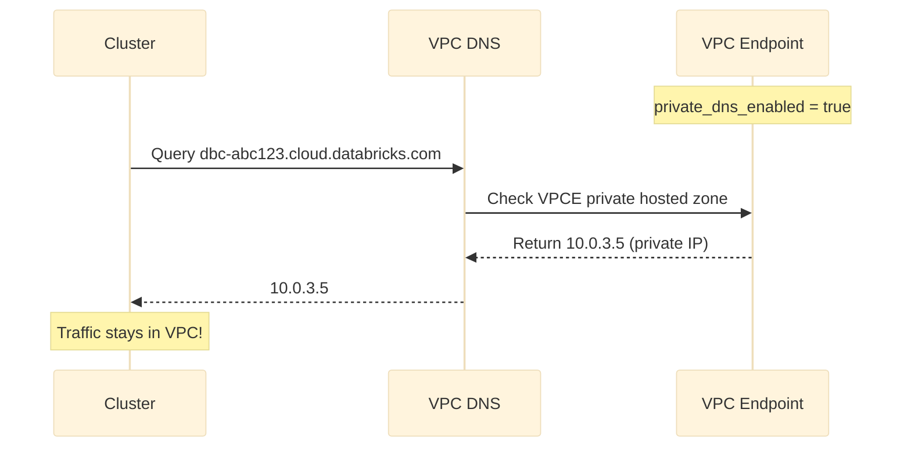

# 03 - Network Security & Encryption

> **Network Guide**: Traffic flows, security groups, and encryption layers visualized.

## Quick Reference

```
🔒 2 Encryption Layers (Independent):
├── S3 Bucket Encryption (enable_encryption)
└── Workspace CMK (enable_workspace_cmk)

🛡️ 2 Security Groups:
├── Workspace SG (cluster nodes)
└── VPCE SG (VPC endpoints)
```

---

## 1. Traffic Flow Patterns

### 1.1 Databricks API Call Flow (Private Link)


```mermaid
%%{init: {'theme': 'base'}}%%
sequenceDiagram
    autonumber
    participant C as Cluster Node<br/>10.0.1.5
    participant DNS as VPC DNS<br/>10.0.0.2
    participant RT as Route Table
    participant SG as Security Group
    participant VPCE as VPC Endpoint<br/>10.0.3.5
    participant DB as Databricks<br/>Control Plane
    
    C->>DNS: Resolve dbc-*.cloud.databricks.com
    DNS-->>C: Returns 10.0.3.5 (private IP)
    C->>RT: Lookup route for 10.0.3.5
    RT-->>C: Use "local" route (VPC-internal)
    C->>SG: Check egress rule TCP 8443
    SG-->>C: Allow (rule: TCP 8443-8451 → vpce_sg)
    C->>VPCE: Send request to 10.0.3.5:8443
    VPCE->>DB: Forward via Private Link
    DB-->>VPCE: Response
    VPCE-->>C: Response
```

**Key Points:**
- DNS returns **private IP** when Private Link enabled
- Traffic uses VPC "local" route (no NAT)
- Security groups enforce 8443-8451 port range
- VPCE forwards to Databricks control plane privately

**Docs**: [Private Link Architecture](https://docs.databricks.com/aws/en/security/network/classic/privatelink.html)

### 1.2 S3 Access Flow


```mermaid
%%{init: {'theme': 'base'}}%%
flowchart LR
    C["Cluster Node"] -->|1. S3 API call| RT["Route Table"]
    RT -->|2. Match prefix list| GW["S3 Gateway<br/>Endpoint"]
    GW -->|3. VPC-internal| S3["S3 Bucket"]
    S3 -->|4. If encrypted| KMS["KMS Key<br/>Decrypt"]
    KMS -->|5. Decrypted data| S3
    S3 -->|6. Response| C
    
    style GW fill:#569A31,color:#fff
    style KMS fill:#FF9900,color:#000
```

**Always FREE - No data transfer charges!**

---

## 2. Security Group Rules

### 2.1 Workspace Security Group (Cluster Nodes)

**Attached To**: EC2 instances in private subnets

#### Egress Rules (Outbound)
```
Rule 1: Cluster to Cluster Communication
├── Protocol: TCP
├── Port Range: 0-65535
├── Destination: self (workspace_sg)
└── Purpose: Spark worker communication

Rule 2: Cluster to Cluster UDP
├── Protocol: UDP
├── Port Range: 0-65535
├── Destination: self (workspace_sg)
└── Purpose: Spark shuffle operations

Rule 3: Control Plane API (Private Link)
├── Protocol: TCP
├── Port Range: 8443-8451
├── Destination: vpce_sg
└── Purpose: Workspace REST API via VPCE

Rule 4: Secure Cluster Connectivity (Private Link)
├── Protocol: TCP
├── Port Range: 6666
├── Destination: vpce_sg
└── Purpose: Relay/SCC via VPCE

Rule 5: Public Internet (if needed)
├── Protocol: TCP
├── Port Range: 443, 3306, 53
├── Destination: 0.0.0.0/0
└── Purpose: Maven, PyPI, DNS
```

#### Ingress Rules (Inbound)
```
Rule 1: TCP from Clusters
├── Protocol: TCP
├── Port Range: 0-65535
├── Source: self (workspace_sg)
└── Purpose: Allow worker-to-worker

Rule 2: UDP from Clusters
├── Protocol: UDP
├── Port Range: 0-65535
├── Source: self (workspace_sg)
└── Purpose: Allow shuffle traffic
```

**Docs**: [Security Groups](https://docs.databricks.com/aws/en/security/network/classic/security-groups.html)

### 2.2 VPC Endpoint Security Group

**Attached To**: Databricks VPC endpoints (workspace + relay)

#### Egress Rules
```
Rule 1: Allow All Outbound
├── Protocol: All
├── Port Range: All
├── Destination: 0.0.0.0/0
└── Purpose: VPCE to Databricks
```

#### Ingress Rules
```
Rule 1: From Workspace SG (8443-8451)
├── Protocol: TCP
├── Port Range: 8443-8451
├── Source: workspace_sg
└── Purpose: Allow API calls

Rule 2: From Workspace SG (6666)
├── Protocol: TCP
├── Port Range: 6666
├── Source: workspace_sg
└── Purpose: Allow SCC
```

---

## 3. Encryption Layers

### 3.1 Dual Encryption Architecture


```mermaid
%%{init: {'theme': 'base', 'themeVariables': { 'primaryColor': '#e1e1e1'}}}%%
flowchart TD
    subgraph "Layer 1: S3 Bucket Encryption"
        KMS1["KMS Key<br/>S3 Encryption"]
        S3["S3 Buckets<br/>• DBFS Root<br/>• UC Metastore<br/>• UC External"]
        KMS1 -->|Encrypts| S3
    end
    
    subgraph "Layer 2: Workspace CMK"
        KMS2["KMS Key<br/>Workspace Storage"]
        DBFS["DBFS Root<br/>at-rest"]
        EBS["EBS Volumes<br/>cluster storage"]
        MS["Managed Services<br/>notebooks, jobs"]
        KMS2 -->|Encrypts| DBFS
        KMS2 -->|Encrypts| EBS
        KMS2 -->|Encrypts| MS
    end
    
    style KMS1 fill:#569A31,color:#fff
    style KMS2 fill:#FF9900,color:#000
```

**Independent Configuration:**
- `enable_encryption = true` → Layer 1 only
- `enable_workspace_cmk = true` → Layer 2 only
- Both can be true simultaneously
- Neither interferes with the other

**Docs**: [Customer-Managed Keys](https://docs.databricks.com/aws/en/security/keys/customer-managed-keys-managed-services-aws.html)

### 3.2 KMS Key Usage

```
Layer 1 - S3 Bucket Encryption:
├── When: enable_encryption = true
├── Key Created: aws_kms_key.databricks
├── Encrypts: All S3 buckets (SSE-KMS)
└── Permissions: UC roles get KMS permissions

Layer 2 - Workspace CMK:
├── When: enable_workspace_cmk = true
├── Key Created: aws_kms_key.workspace_storage
├── Encrypts: DBFS root, EBS, Managed Services
└── Permissions: In KMS key policy (Databricks service principal)
```

### 3.3 Key Rotation

```
AWS Automatic Rotation (Enabled by default):
├── Rotates underlying key material annually
├── ARN remains the same
├── Applies to both Layer 1 and Layer 2 keys
└── No action required

Manual Rotation to Different Key:
├── Managed Services CMK: ✅ Supported
├── Storage CMK (DBFS/EBS): ❌ Not supported
└── S3 Bucket keys: ✅ Update S3 bucket config
```

**Docs**: [Key Rotation](https://docs.databricks.com/aws/en/security/keys/configure-customer-managed-keys#rotate-an-existing-key)

---

## 4. Network Scenarios

### 4.1 Private Link vs Public Internet


```mermaid
%%{init: {'theme': 'base', 'themeVariables': { 'primaryColor': '#e1e1e1'}}}%%
flowchart TD
    START["enable_private_link"] -->|true| PL["Private Link Path"]
    START -->|false| PUB["Public Internet Path"]
    
    PL --> PLDNS["DNS returns<br/>private IP 10.0.3.x"]
    PLDNS --> PLVPCE["Traffic via<br/>VPC Endpoint"]
    PLVPCE --> PLDB["Databricks<br/>Private Link"]
    
    PUB --> PUBDNS["DNS returns<br/>public IP"]
    PUBDNS --> NAT["Traffic via<br/>NAT Gateway"]
    NAT --> IGW["Internet<br/>Gateway"]
    IGW --> PUBDB["Databricks<br/>Public Internet"]
    
    style PL fill:#569A31,color:#fff
    style PUB fill:#FF9900,color:#000
```

**Comparison:**

| Aspect | Private Link (true) | Public Internet (false) |
|--------|---------------------|-------------------------|
| DNS Resolution | Private IP 10.0.3.x | Public IP | 
| Traffic Path | VPC Endpoint → Private Link | NAT → Internet |
| Data Egress Charges | Lower | Higher |
| Security | No internet exposure | Internet-routable |
| Cost | VPCE charges ~$7.2/day | NAT charges variable |

---

## 5. Port Requirements

### 5.1 Critical Ports

```
Databricks Control Plane:
├── 8443-8451: REST API (Workspace VPCE)
└── 6666: Secure Cluster Connectivity (Relay VPCE)

AWS Services:
├── 443: S3 Gateway, STS, Kinesis
└── 3306: MySQL metastore (optional)

Public Internet:
├── 443: Maven Central, PyPI
└── 53: DNS resolution
```

### 5.2 Port 8443-8451 Range Explained

```
Why 9 ports (8443-8451)?

8443: Primary workspace API
8444-8451: WebSocket connections, streaming, long-running jobs

All 9 ports required for full functionality!
```

**Warning**: Restricting to only 8443 will break WebSocket features

**Docs**: [Port Requirements](https://docs.databricks.com/aws/en/security/network/classic/privatelink.html#ports)

---

## 6. DNS Resolution

### 6.1 Private DNS for VPC Endpoints


```mermaid
%%{init: {'theme': 'base'}}%%
sequenceDiagram
    participant C as Cluster
    participant DNS as VPC DNS
    participant VPCE as VPC Endpoint
    
    Note over VPCE: private_dns_enabled = true
    C->>DNS: Query dbc-abc123.cloud.databricks.com
    DNS->>VPCE: Check VPCE private hosted zone
    VPCE-->>DNS: Return 10.0.3.5 (private IP)
    DNS-->>C: 10.0.3.5
    
    Note over C: Traffic stays in VPC!
```

**Key Setting**: `private_dns_enabled = true` on VPC endpoint

**Without Private DNS:**
- DNS returns public IP
- Traffic goes via NAT/IGW even with VPC endpoint
- Defeats purpose of Private Link

---

## Next Steps

✅ Network security understood → [04-QUICK-START.md](04-QUICK-START.md) - Deploy now!

✅ Need troubleshooting → [05-TROUBLESHOOTING.md](05-TROUBLESHOOTING.md) - Common issues

**Docs**: [Network Security](https://docs.databricks.com/aws/en/security/network/index.html)
