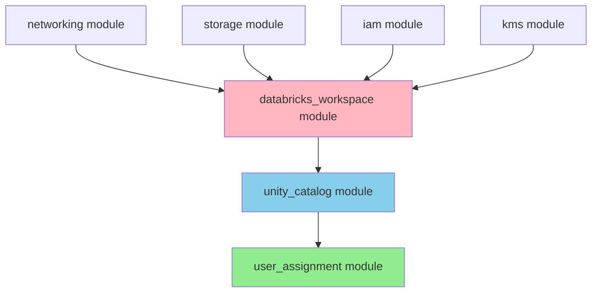

# Workspace Admin Assignment - Deployment Order Fix

> **Related Documentation:**
> - 📐 [ARCHITECTURE.md](../ARCHITECTURE.md) - Understand the complete architecture
> - 🚀 [QUICK_START.md](QUICK_START.md) - Deploy your workspace quickly
> - 📁 [DIRECTORY_STRUCTURE.md](DIRECTORY_STRUCTURE.md) - See where user_assignment module is located

## The Problem

Workspace admin permission assignment would fail if attempted before Unity Catalog was assigned to the workspace:

```
ERROR: Permission assignment APIs are not available for this workspace.
```

## Understanding the Issue

### ❌ **What Was Happening (WRONG - Early Implementation)**

```
┌─────────────────────────────────────────────────────────────┐
│ Workspace Module (runs in parallel with UC module)          │
│                                                              │
│  1. Create Workspace                                        │
│     ↓                                                        │
│  2. Assign Admin ❌ ERROR!                                  │
│     (UC not assigned yet!)                                  │
└─────────────────────────────────────────────────────────────┘

┌─────────────────────────────────────────────────────────────┐
│ Unity Catalog Module (runs in parallel)                     │
│                                                              │
│  1. Create Metastore                                        │
│     ↓                                                        │
│  2. Assign Metastore to Workspace                           │
│     (happens AFTER admin assignment tried to run)           │
└─────────────────────────────────────────────────────────────┘
```

**Problem**: Both modules depend on the workspace, so they run in parallel. The admin assignment would try to run before Unity Catalog metastore assignment completes.

### ✅ **Current Implementation (CORRECT)**

```
┌─────────────────────────────────────────────────────────────┐
│ Step 1: Workspace Module                                    │
│                                                              │
│  • Create Workspace                                         │
└─────────────────────────────────────────────────────────────┘
                          ↓
┌─────────────────────────────────────────────────────────────┐
│ Step 2: Unity Catalog Module                                │
│                                                              │
│  1. Create Metastore                                        │
│     ↓                                                        │
│  2. Assign Metastore to Workspace ✅                        │
│     (This enables permission assignment APIs!)              │
└─────────────────────────────────────────────────────────────┘
                          ↓
┌─────────────────────────────────────────────────────────────┐
│ Step 3: User Assignment Module                              │
│                                                              │
│  • Assign Workspace Admin ✅                                │
│    (Now the APIs are available!)                            │
│    depends_on = [unity_catalog.metastore_assignment_id]     │
└─────────────────────────────────────────────────────────────┘
```

## Current Implementation

### Architecture

The current implementation uses a **separate `user_assignment` module** that explicitly depends on Unity Catalog metastore assignment:

**File:** `main.tf` (lines 360-374)
```hcl
module "user_assignment" {
  source = "./modules/user_assignment"
  count  = var.workspace_admin_email != "" ? 1 : 0

  user_name    = var.workspace_admin_email
  workspace_id = module.databricks_workspace.workspace_id

  providers = {
    databricks = databricks.account
  }

  depends_on = [
    module.unity_catalog.metastore_assignment_id  # ← KEY: Waits for UC assignment!
  ]
}
```

### Module Structure

**File:** `modules/user_assignment/main.tf`
```hcl
# Look up the workspace admin user from account console
data "databricks_user" "workspace_access" {
  user_name = var.user_name
}

# Assign user as workspace admin
resource "databricks_mws_permission_assignment" "workspace_access" {
  workspace_id = var.workspace_id
  principal_id = data.databricks_user.workspace_access.id
  permissions  = ["ADMIN"]

  lifecycle {
    ignore_changes = [principal_id]
  }
}
```

**Key Points:**
- ✅ Separate module for user assignment (single responsibility)
- ✅ Explicit dependency on Unity Catalog metastore assignment
- ✅ Conditional creation (only if `workspace_admin_email` is provided)
- ✅ Uses account-level provider for permission management

## Why This Works

The `databricks_mws_permission_assignment` API is **only available after Unity Catalog is assigned** to a workspace.

By using a separate module with explicit `depends_on`, we ensure:

1. ✅ Workspace is created (`databricks_workspace` module)
2. ✅ Unity Catalog metastore is created and assigned (`unity_catalog` module)
3. ✅ Permission assignment APIs become available
4. ✅ Workspace admin is assigned successfully (`user_assignment` module)

## Deployment Order Visualization



**Green:** User Assignment (depends on Unity Catalog)
**Blue:** Unity Catalog (depends on Workspace)
**Pink:** Workspace (depends on Infrastructure)

## Key Takeaway

🔑 **The permission assignment APIs are enabled by Unity Catalog metastore assignment, not by workspace creation alone.**

**Best Practice:** Always use the `user_assignment` module after Unity Catalog is assigned, or ensure explicit `depends_on` relationship if implementing custom user assignment logic.

## Reference

- **User Assignment Module:** `modules/user_assignment/`
- **Databricks SRA Pattern:** https://github.com/databricks/terraform-databricks-sra/tree/main/aws/tf/modules/databricks_account/user_assignment
- **Current Provider Version:** `~> 1.70` (see `main.tf`)

