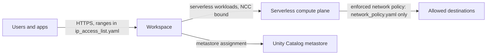

# Workspace guardrails (AWS)

The bare-minimum controls for any Databricks workspace on AWS, applied after
the workspace exists:

1. **IP access lists** on the workspace front-end, from `ip_access_list.yaml`
   (your known ranges: corporate egress, VPN, automation).
2. **Serverless egress**: a network connectivity config (NCC) and a
   `RESTRICTED_ACCESS` network policy in `ENFORCED` mode, allowing only the
   destinations in `network_policy.yaml`.
3. **Unity Catalog**: the metastore assignment, when the workspace root or the
   account doesn't assign one (`metastore_id`).
4. **Data-leak settings** (optional): notebook export, results download and
   the notebook table clipboard off (`disable_data_leak_features`).

Use it after [`aws-pl-ws/databricks-aws-production`](../aws-pl-ws/databricks-aws-production)
(which has no NCC or network policy) or [`serverless-ws`](../serverless-ws).
Same model as the [gcpdb4u root of the same name](../../gcpdb4u/templates/terraform-scripts/workspace-guardrails).

> **Maturity: validated.** `terraform validate` and mock-provider tests pass
> in CI. Not yet applied end to end.



## Use

Edit `ip_access_list.yaml` (include the IP you run Terraform from) and
`network_policy.yaml` first.

```bash
# account-admin service principal (or: export DATABRICKS_CONFIG_PROFILE=<account-profile>)
export DATABRICKS_CLIENT_ID=<client-id> DATABRICKS_CLIENT_SECRET=<client-secret>
export TF_VAR_databricks_account_id=<account-id>
terraform init
terraform apply \
  -var region=<region> \
  -var "workspace_id=$(terraform -chdir=<workspace-root> output -raw workspace_id)" \
  -var "workspace_url=$(terraform -chdir=<workspace-root> output -raw workspace_url)"
```

The Well-Architected Agent generates this step for you after the workspace
root (`wa-agent new --cloud aws --baseline <id> --build awsdb4u --set allowed_ip_ranges='[...]'`).

| Variable | Default | Meaning |
|---|---|---|
| `workspace_id`, `workspace_url` | | The workspace to secure (outputs of the workspace root) |
| `region` | | AWS region of the workspace |
| `enable_ip_access_list` | `true` | Apply `ip_access_list.yaml` |
| `enable_ncc` | `true` | Create and bind an NCC |
| `enable_network_policy` | `true` | Create and bind the serverless network policy |
| `network_policy_enforcement_mode` | `ENFORCED` | `DRY_RUN` only logs denials |
| `shared_network_policy_id` | `""` | Bind an existing policy instead of creating one |
| `metastore_id` | `""` | Metastore to assign; empty when already assigned |
| `disable_data_leak_features` | `false` | Notebook export, results download, table clipboard off |

## Tests

```bash
terraform init -backend=false && terraform test   # mock providers, no credentials
```

## References

- [IP access lists](https://docs.databricks.com/aws/en/security/network/front-end/ip-access-list)
- [Serverless network policies](https://docs.databricks.com/aws/en/security/network/serverless-network-security/network-policies)
- [Network connectivity configurations](https://docs.databricks.com/aws/en/security/network/serverless-network-security/)
