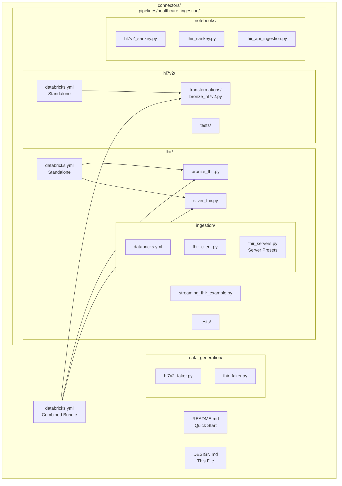
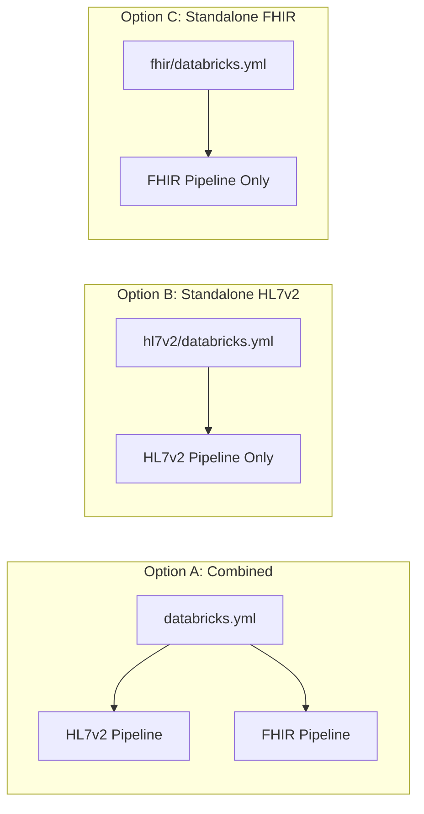
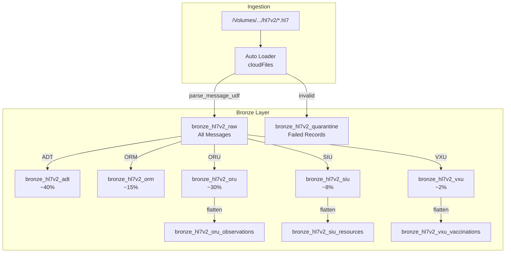
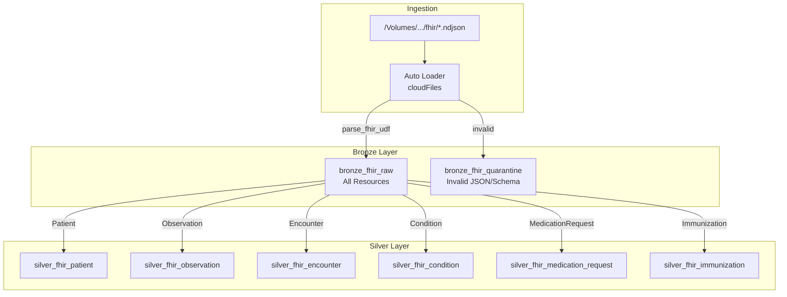
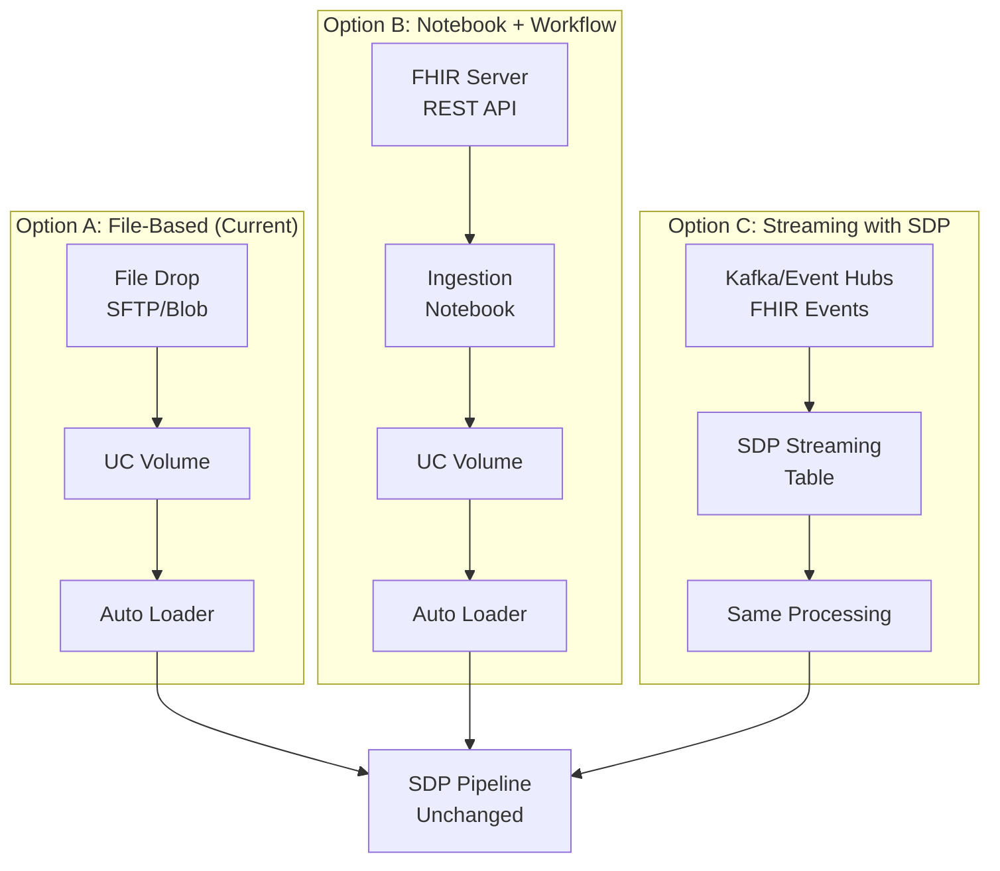
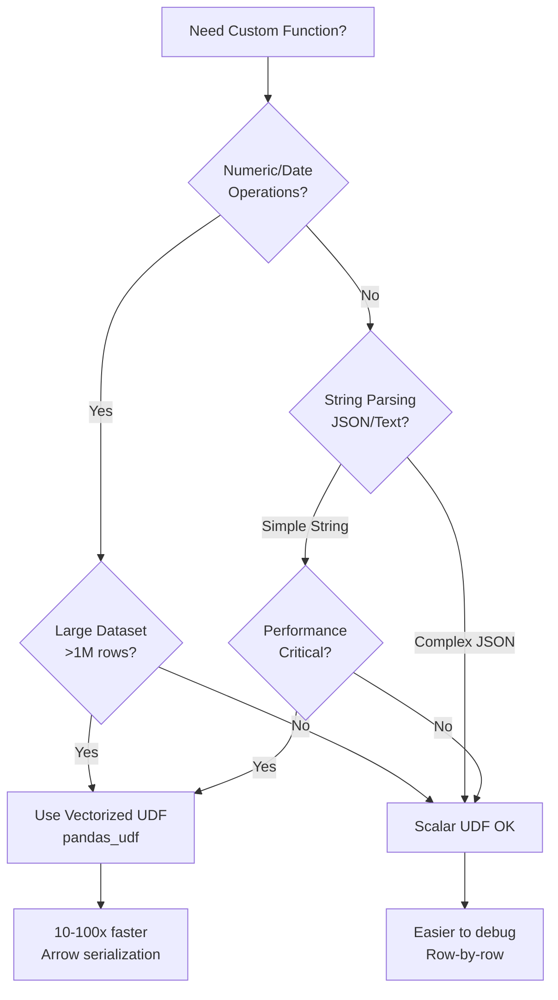
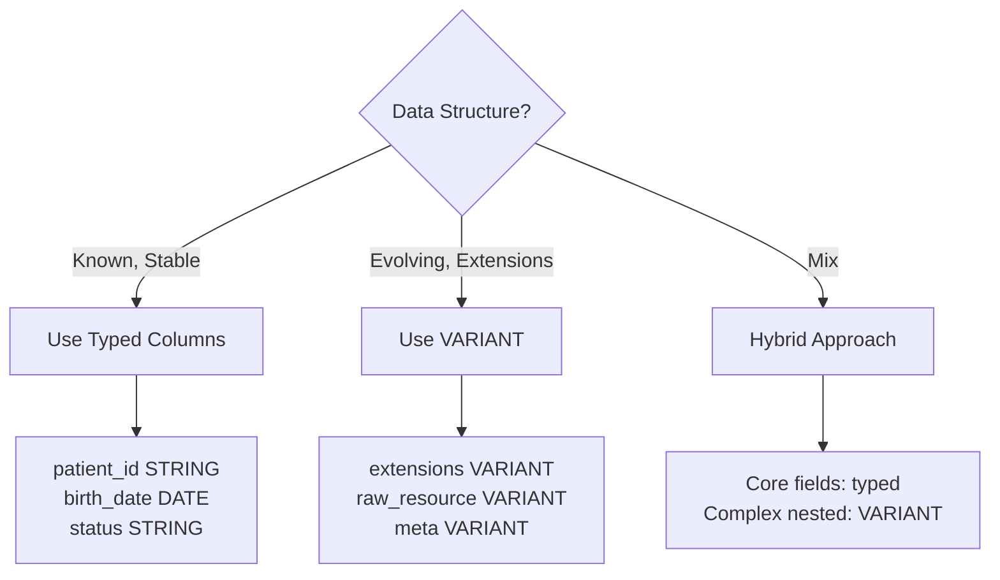
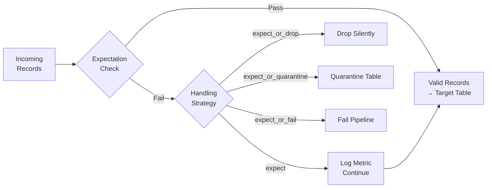
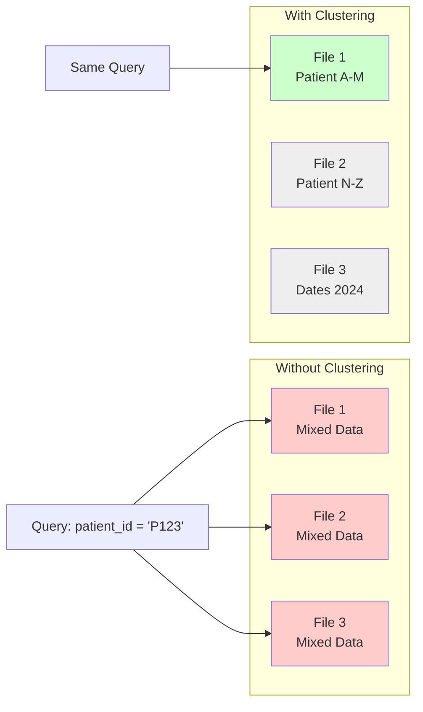
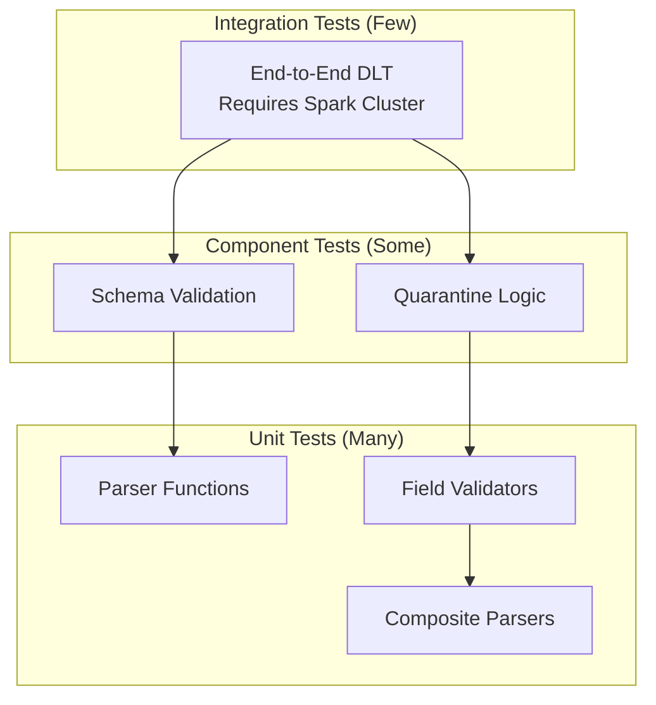

# Healthcare Data Connectors - Design Document

> **Version**: 10.0  
> **Updated**: 2026-02-04  

---

## 1. Overview

Production-grade healthcare data ingestion connectors for Databricks using Spark Declarative Pipelines (SDP).

| Format | Standard | Status | Output Tables |
|--------|----------|--------|---------------|
| **HL7v2** | Legacy Healthcare | Production | 11 bronze tables |
| **FHIR R4** | Modern Healthcare | Production | 8 bronze/silver tables |

---

## 2. Architecture

### Repository Organization



### Deployment Options



---

## 3. Data Flow

### HL7v2 Pipeline Flow



### FHIR R4 Pipeline Flow



---

## 4. REST API Ingestion (FHIR)

FHIR data can also be retrieved via REST APIs. The architecture keeps **ingestion separate from pipeline** - the pipeline stays unchanged.

### Architecture Options



### Server Presets (Easy Swapping)

Pre-configured servers make testing easy. Switch with one line:

| Preset | Server | Rate Limit | Best For |
|--------|--------|------------|----------|
| `hapi` | HAPI FHIR Public | 10 req/s | Fast testing, general dev |
| `synthea` | Synthea (MITRE) | 5 req/s | Realistic synthetic patients |
| `smart_sandbox` | SMART Health IT | 10 req/s | OAuth flow testing |
| `cerner_sandbox` | Cerner Open | 5 req/s | EHR vendor responses |
| `hl7_test` | HL7 Official | 5 req/s | Spec compliance |
| `custom` | Your URL | Configurable | Production servers |

### How to Use Presets

**In Python:**
```python
from fhir.ingestion import FHIRClient, FHIRIngestion

# One-liner server switch
client = FHIRClient.from_preset("synthea")
client = FHIRClient.from_preset("hapi")

# Full ingestion with preset
ingestion = FHIRIngestion.from_preset(
    "synthea",
    output_volume="/Volumes/main/healthcare_fhir/raw_data/fhir"
)
result = ingestion.ingest_resources(["Patient", "Observation"])
```

**In Notebook:**
Open `notebooks/fhir_api_ingestion.py` and use the dropdown widget to select server.

**Via CLI:**
```bash
cd fhir/ingestion
databricks bundle deploy -t dev

# Switch servers with --var
databricks bundle run fhir_api_ingestion -t dev --var="server_preset=hapi"
databricks bundle run fhir_api_ingestion -t dev --var="server_preset=synthea"
databricks bundle run fhir_api_ingestion -t dev --var="server_preset=cerner_sandbox"
```

### Option B: Notebook + Workflow (Batch)

Located at: `fhir/ingestion/` (standalone bundle)

```bash
# Deploy ingestion job (separate from pipeline)
cd pipelines/healthcare_ingestion/fhir/ingestion
databricks bundle deploy -t dev

# Run manually
databricks bundle run fhir_api_ingestion -t dev

# Or schedule (uncomment in databricks.yml)
```

Key features:
- Rate limiting with exponential backoff
- Automatic pagination (handles large datasets)
- Auth support (none, bearer, SMART on FHIR)
- Incremental ingestion via `_lastUpdated`
- Writes NDJSON to UC Volume → Pipeline picks up automatically

### Option C: Streaming with SDP (Real-Time)

For real-time FHIR events via Kafka, Event Hubs, or webhooks.

**Example file:** `fhir/streaming_fhir_example.py`

```python
# Modern SDP API (2026 best practice)
from pyspark import pipelines as dp
from pyspark.sql.functions import from_json, col, current_timestamp

@dp.table(
    name="bronze_fhir_streaming",
    comment="Real-time FHIR resources from Kafka/Event Hubs"
)
@dp.expect_or_quarantine("valid_json", "parsed_resource IS NOT NULL")
def bronze_fhir_streaming():
    """Stream FHIR from Kafka - same @dp decorators as batch"""
    kafka_servers = spark.conf.get("fhir.streaming.kafka.servers")
    kafka_topic = spark.conf.get("fhir.streaming.kafka.topic")
    
    return (
        spark.readStream
        .format("kafka")
        .option("kafka.bootstrap.servers", kafka_servers)
        .option("subscribe", kafka_topic)
        .option("startingOffsets", "latest")
        .load()
        .select(
            col("value").cast("string").alias("raw_json"),
            col("timestamp").alias("event_timestamp"),
            current_timestamp().alias("_ingestion_timestamp"),
        )
        .withColumn("parsed_resource", from_json(col("raw_json"), FHIR_SCHEMA))
        .withColumn("resource_type", col("parsed_resource.resourceType"))
        .withColumn("resource_id", col("parsed_resource.id"))
    )

# Silver uses spark.readStream.table() for streaming source (2026 best practice)
@dp.table(name="silver_fhir_patient_streaming")
def silver_fhir_patient_streaming():
    return spark.readStream.table("bronze_fhir_streaming").filter("resource_type = 'Patient'")
```

**Key SDP Streaming Features:**
- `spark.readStream` for continuous ingestion from external sources
- `spark.readStream.table()` to read from SDP streaming tables (2026 best practice)
- `spark.read.table()` for batch reads (don't use `dp.read()` - old syntax)
- `@dp.expect_or_quarantine` works with streaming
- Same `@dp.table` decorator as batch

**Streaming Configuration in `databricks.yml`:**
```yaml
configuration:
  fhir.streaming.source: "kafka"  # or "eventhub"
  fhir.streaming.kafka.servers: "your-kafka:9092"
  fhir.streaming.kafka.topic: "fhir-events"
  fhir.streaming.kafka.group_id: "fhir-sdp-pipeline"
```

**Unified View (Batch + Streaming):**
```python
@dp.view(name="unified_fhir_patient")
def unified_fhir_patient():
    """Combines batch and streaming - deduplicates by ID"""
    # Use spark.read.table() - not dp.read() (old syntax)
    batch = spark.read.table("silver_fhir_patient")
    streaming = spark.read.table("silver_fhir_patient_streaming")
    return batch.union(streaming).dropDuplicates(["id"])
```

### Option Comparison

| Option | Latency | Complexity | When to Use |
|--------|---------|------------|-------------|
| **A: File-Based** | Minutes-Hours | Low | Bulk exports, file drops |
| **B: Notebook + Workflow** | Minutes | Medium | REST API polling, scheduled syncs |
| **C: Streaming SDP** | Seconds | Higher | Real-time events, webhooks |

### Key Design Principle

> **Ingestion and Pipeline are decoupled.** The ingestion layer writes to volumes (or streams); the pipeline reads from volumes (or streams). They evolve independently.

---

## 5. UDF Design Patterns

### Inlined UDF Pattern (Required)

**Critical**: All parsing logic must be inlined because Spark executors cannot access workspace file imports.

```python
def parse_fhir_resource(raw_json: str) -> dict:
    """
    ALL LOGIC MUST BE INSIDE THIS FUNCTION.
    Executors cannot import from workspace files.
    """
    import json  # Import INSIDE function
    
    # Define helpers INSIDE function
    def extract_coding(codeable_concept):
        if not codeable_concept:
            return None
        codings = codeable_concept.get("coding", [])
        return codings[0] if codings else None
    
    try:
        resource = json.loads(raw_json)
        return {
            "id": resource.get("id"),
            "resource_type": resource.get("resourceType"),
            # ... more fields
        }
    except Exception as e:
        return {"_parse_error": str(e)}

# Register as UDF
parse_fhir_udf = udf(parse_fhir_resource, result_schema)
```

---

## 6. Vectorized UDFs - When & How

### Decision Matrix: Scalar vs Vectorized UDF



### When to Use Vectorized UDFs

| Scenario | Recommendation | Why |
|----------|----------------|-----|
| **JSON parsing (complex)** | Scalar UDF | Error handling per-row is critical |
| **Numeric aggregations** | Vectorized UDF | pandas/numpy optimized |
| **Date calculations** | Vectorized UDF | pandas datetime is fast |
| **String transformations** | Vectorized UDF | pandas str operations vectorized |
| **ML feature engineering** | Vectorized UDF | numpy array operations |
| **Healthcare message parsing** | Scalar UDF | Need per-message error handling |

### Vectorized UDF Implementation

```python
from pyspark.sql.functions import pandas_udf
from pyspark.sql.types import DoubleType
import pandas as pd

# Type 1: Series to Series (most common)
@pandas_udf(DoubleType())
def calculate_bmi(weight_kg: pd.Series, height_m: pd.Series) -> pd.Series:
    """
    Vectorized BMI calculation - processes entire column at once.
    10-100x faster than scalar UDF for large datasets.
    """
    return weight_kg / (height_m ** 2)

# Usage
df = df.withColumn("bmi", calculate_bmi(col("weight_kg"), col("height_m")))


# Type 2: Series to Scalar (aggregations)
@pandas_udf(DoubleType())
def weighted_avg(values: pd.Series, weights: pd.Series) -> float:
    """Aggregation UDF for grouped operations."""
    return (values * weights).sum() / weights.sum()

# Usage with groupBy
df.groupBy("patient_id").agg(weighted_avg(col("value"), col("weight")))


# Type 3: Iterator of Series (memory-efficient for large data)
from typing import Iterator

@pandas_udf(StringType())
def normalize_names_batched(names: Iterator[pd.Series]) -> Iterator[pd.Series]:
    """
    Process in batches - memory efficient for large datasets.
    Each batch is a pandas Series.
    """
    for batch in names:
        yield batch.str.strip().str.title()
```

### Vectorized UDF for Healthcare

```python
from pyspark.sql.functions import pandas_udf
from pyspark.sql.types import StructType, StructField, StringType, BooleanType
import pandas as pd

# Schema for parsed result
parsed_schema = StructType([
    StructField("patient_id", StringType()),
    StructField("is_valid", BooleanType()),
    StructField("normalized_name", StringType()),
])

@pandas_udf(parsed_schema)
def parse_patient_batch(
    patient_ids: pd.Series,
    names: pd.Series,
    birth_dates: pd.Series
) -> pd.DataFrame:
    """
    Vectorized patient parsing - use when:
    1. Data is already structured (not raw JSON)
    2. Transformations are column-based
    3. Dataset is large (>1M rows)
    """
    return pd.DataFrame({
        "patient_id": patient_ids.str.strip(),
        "is_valid": birth_dates.notna() & (patient_ids.str.len() > 0),
        "normalized_name": names.str.strip().str.title()
    })
```

### Performance Comparison

| UDF Type | 1M Rows | 10M Rows | 100M Rows |
|----------|---------|----------|-----------|
| Scalar UDF | 45s | 7min | 70min |
| Vectorized UDF | 3s | 25s | 4min |
| Native Spark | 1s | 8s | 80s |

**Rule of Thumb**: If native Spark SQL can do it, use that. If not, consider vectorized UDFs for performance-critical paths.

---

## 7. VARIANT Type Strategy

### When to Use VARIANT



### FHIR Schema Design

```sql
-- Silver Patient Table
CREATE TABLE silver_fhir_patient (
    -- Typed fields for frequent queries
    id STRING,
    gender STRING,
    birth_date DATE,
    deceased_boolean BOOLEAN,
    name_family STRING,
    name_given STRING,
    
    -- VARIANT for evolving/complex data
    raw_resource VARIANT,      -- Full FHIR resource for reprocessing
    identifiers VARIANT,       -- Array of identifiers
    names VARIANT,             -- Array of name objects
    addresses VARIANT,         -- Array of addresses
    telecoms VARIANT,          -- Array of contact info
    extensions VARIANT,        -- FHIR extensions (always evolving)
    
    -- Metadata
    _ingestion_timestamp TIMESTAMP,
    _source_file STRING
)
CLUSTER BY (id, gender);
```

### Querying VARIANT Fields

```sql
-- Access nested VARIANT data
SELECT 
    id,
    raw_resource:meta:lastUpdated::timestamp AS last_updated,
    extensions[0]:url AS first_extension_url,
    names[0]:family AS family_name,
    identifiers[*]:value AS all_identifier_values
FROM silver_fhir_patient
WHERE raw_resource:active::boolean = true;
```

---

## 8. Data Quality Patterns



### Expectation Selection Guide

| Decorator | When to Use | Example |
|-----------|-------------|---------|
| `@dp.expect` | Soft warning, non-critical | Missing optional field |
| `@dp.expect_or_drop` | Bad data, not worth keeping | Malformed JSON |
| `@dp.expect_or_quarantine` | Need to investigate later | Invalid patient ID |
| `@dp.expect_or_fail` | Critical, pipeline should stop | Schema mismatch |

---

## 9. Resilience Patterns

Production pipelines must handle failures gracefully without crashing. These patterns ensure a single bad record never brings down the entire pipeline.

### 9.1 Broader Exception Handling in UDFs

**Critical**: All UDFs wrap entire logic in try/except to prevent any single malformed record from crashing the pipeline.

```python
def parse_fhir_resource(raw_json: str) -> dict:
    """
    RESILIENCE PATTERN: Outer try/except catches ALL exceptions.
    
    This ensures:
    1. A single bad record never crashes the pipeline
    2. Errors are captured for debugging
    3. Pipeline continues processing other records
    """
    # Default result for failures
    result = {
        "is_valid": False,
        "resource_type": None,
        "resource_id": None,
        "validation_errors": []
    }
    
    # OUTER try/except catches ALL unexpected exceptions
    try:
        # Handle null/empty input first
        if raw_json is None or not raw_json.strip():
            result["validation_errors"].append("Input is null or empty")
            return result
        
        # Inner try for specific JSON errors
        try:
            resource = json.loads(raw_json)
        except (json.JSONDecodeError, TypeError) as e:
            result["validation_errors"].append(f"JSON parse error: {str(e)}")
            return result
        
        # ... parsing logic ...
        return result
        
    except Exception as e:
        # Catch-all: captures ANY unexpected error
        result["validation_errors"].append(f"Unexpected error: {type(e).__name__}: {str(e)}")
        return result  # Never throw, always return
```

### 9.2 Watermarking for Late-Arriving Data

Streaming pipelines use watermarks to handle late-arriving data while preventing unbounded state growth.

```python
@dp.table(name="bronze_fhir_raw")
def bronze_fhir_raw():
    """
    WATERMARK: 2-hour threshold balances late data handling vs memory.
    - Data arriving within 2 hours: processed normally
    - Data arriving after 2 hours: dropped to prevent unbounded state
    """
    raw_files = (
        spark.readStream
        .format("cloudFiles")
        .load(STORAGE_PATH)
    )
    
    with_timestamp = (
        raw_files
        .withColumn("_ingestion_timestamp", current_timestamp())
    )
    
    # Apply watermark - critical for production streaming
    watermarked = with_timestamp.withWatermark("_ingestion_timestamp", "2 hours")
    
    return watermarked
```

**Watermark Thresholds Guide:**

| Scenario | Threshold | Why |
|----------|-----------|-----|
| Real-time analytics | 10-30 minutes | Fresh data matters most |
| Healthcare ingestion | 2 hours | Balance freshness vs completeness |
| Batch backfill | 24 hours | Allow delayed file drops |
| Compliance reporting | 7 days | Regulatory data cannot be lost |

### 9.3 Quality Monitoring Views

Built-in views for monitoring data quality and pipeline health.

```python
@dp.temporary_view(name="bronze_fhir_quality_metrics")
def bronze_fhir_quality_metrics():
    """
    OBSERVABILITY: Tracks validation success rates by resource type.
    
    Provides:
    - Total/valid/invalid counts
    - Validation success rate percentage
    - Quality status (HEALTHY/WARNING/CRITICAL)
    - Sample errors for debugging
    """
    return (
        spark.read.table("bronze_fhir_raw")
        .groupBy("resource_type")
        .agg(
            count("*").alias("total_records"),
            sum(when(col("is_valid"), 1).otherwise(0)).alias("valid_records"),
            round(
                sum(when(col("is_valid"), 1).otherwise(0)) * 100.0 / count("*"),
                2
            ).alias("validation_success_rate_pct"),
        )
        .withColumn(
            "quality_status",
            when(col("validation_success_rate_pct") >= 99.0, "HEALTHY")
            .when(col("validation_success_rate_pct") >= 95.0, "WARNING")
            .otherwise("CRITICAL")
        )
    )
```

**Quality Status Thresholds:**

| Status | Threshold | Action |
|--------|-----------|--------|
| **HEALTHY** | >= 99% validation rate | Normal operation |
| **WARNING** | >= 95% validation rate | Investigate source data |
| **CRITICAL** | < 95% validation rate | Alert, check data source |

### 9.4 Data Freshness Monitoring

```python
@dp.temporary_view(name="bronze_fhir_freshness")
def bronze_fhir_freshness():
    """
    OBSERVABILITY: Monitors data freshness for SLA tracking.
    
    Helps detect:
    - Ingestion delays
    - Pipeline stalls
    - Source system issues
    """
    return (
        spark.read.table("bronze_fhir_raw")
        .groupBy("resource_type")
        .agg(max("_ingestion_timestamp").alias("latest_ingestion"))
        .withColumn(
            "minutes_since_last_record",
            (current_timestamp().cast("long") - col("latest_ingestion").cast("long")) / 60
        )
        .withColumn(
            "freshness_status",
            when(col("minutes_since_last_record") <= 60, "FRESH")
            .when(col("minutes_since_last_record") <= 360, "STALE")
            .otherwise("VERY_STALE")
        )
    )
```

**Freshness Status Thresholds:**

| Status | Threshold | Action |
|--------|-----------|--------|
| **FRESH** | <= 60 minutes | Normal operation |
| **STALE** | <= 6 hours | Check ingestion job |
| **VERY_STALE** | > 6 hours | Alert, investigate |

### 9.5 GDPR/CCPA Protection

Prevent accidental pipeline resets that could undo data deletions (Right to be Forgotten).

```yaml
# In databricks.yml
pipelines:
  fhir_pipeline:
    configuration:
      # CRITICAL: Prevent accidental reset undoing deletions
      pipelines.reset.allowed: "false"
```

### 9.6 Resilience Testing Checklist

Every parser/UDF should have tests for:

- [ ] Null input → returns error result, doesn't crash
- [ ] Empty string → returns error result, doesn't crash
- [ ] Invalid JSON → returns parse error, doesn't crash
- [ ] Wrong resource type → returns None or error, doesn't crash
- [ ] Deeply nested malformed data → doesn't crash
- [ ] Unicode characters → handled correctly
- [ ] Very large input → doesn't timeout/OOM
- [ ] Empty arrays → handled gracefully
- [ ] Null field values → handled gracefully

---

## 10. Liquid Clustering

### Cluster Column Selection

| Table | Cluster By | Query Pattern |
|-------|------------|---------------|
| `bronze_hl7v2_raw` | `message_type, _ingestion_timestamp` | Filter by type, time-range queries |
| `bronze_hl7v2_adt` | `patient_id, message_datetime` | Patient lookup, date filtering |
| `silver_fhir_patient` | `id, gender` | Patient lookup, demographic queries |
| `silver_fhir_observation` | `subject_id, code_code, effective_datetime` | Patient vitals over time |

### How Clustering Works



---

## 11. Testing Strategy

### Test Pyramid



### Running Tests

```bash
# All tests
cd pipelines/healthcare_ingestion
python -m pytest -v

# With coverage
python -m pytest --cov=fhir --cov=hl7v2 -v

# Specific test file
python -m pytest fhir/tests/test_fhir_parser.py -v
```

---

## 12. Deployment Commands

### Validate First (Always)

```bash
# Check bundle syntax and configuration
databricks bundle validate

# Validate specific target
databricks bundle validate -t prod
```

### Deploy Pipelines

```bash
# Option A: Combined (both pipelines from root)
databricks bundle deploy -t dev
databricks bundle run hl7v2_pipeline -t dev
databricks bundle run fhir_pipeline -t dev

# Option B: HL7v2 only (standalone)
cd pipelines/healthcare_ingestion/hl7v2
databricks bundle deploy -t dev
databricks bundle run hl7v2_pipeline -t dev

# Option C: FHIR only (standalone)
cd pipelines/healthcare_ingestion/fhir
databricks bundle deploy -t dev
databricks bundle run fhir_pipeline -t dev
```

### Production Deployment

```bash
# Deploy to production
databricks bundle deploy -t prod

# Override variables
databricks bundle deploy -t prod --var="catalog=prod_catalog"
```

### Dry Run Pipeline (Validate Without Data Changes)

```bash
# Start pipeline in validate-only mode via UI or API
# This parses all table definitions without writing data
```

---

## 13. Adding New Connectors

### Checklist for New Healthcare Format

1. **Create folder structure**
   ```
   pipelines/healthcare_ingestion/<format>/
   ├── databricks.yml           # Standalone bundle
   ├── bronze_<format>.py       # Bronze tables
   ├── silver_<format>.py       # Silver tables (optional)
   ├── config/
   │   └── pipeline_settings.json
   └── tests/
       ├── conftest.py          # Fixtures
       └── test_<format>_parser.py
   ```

2. **Define configuration prefix** (e.g., `<format>.storage_path`)

3. **Implement inlined UDFs** (all logic inside function)

4. **Add to root `databricks.yml`** (combined deployment)

5. **Create test data generator** in `data_generation/`

---

## 13. References

- [VARIANT Type](https://learn.microsoft.com/en-us/azure/databricks/sql/language-manual/data-types/variant-type)
- [Spark Declarative Pipelines](https://docs.databricks.com/en/dlt/)
- [Vectorized UDFs](https://docs.databricks.com/en/udf/pandas.html)
- [Liquid Clustering](https://docs.databricks.com/en/delta/clustering.html)
- [Unity Catalog Volumes](https://docs.databricks.com/en/volumes/)
- [FHIR R4 Specification](https://hl7.org/fhir/R4/)
- [HL7v2 Standard](https://www.hl7.org/implement/standards/product_brief.cfm?product_id=185)
