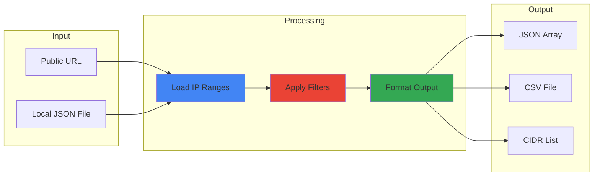
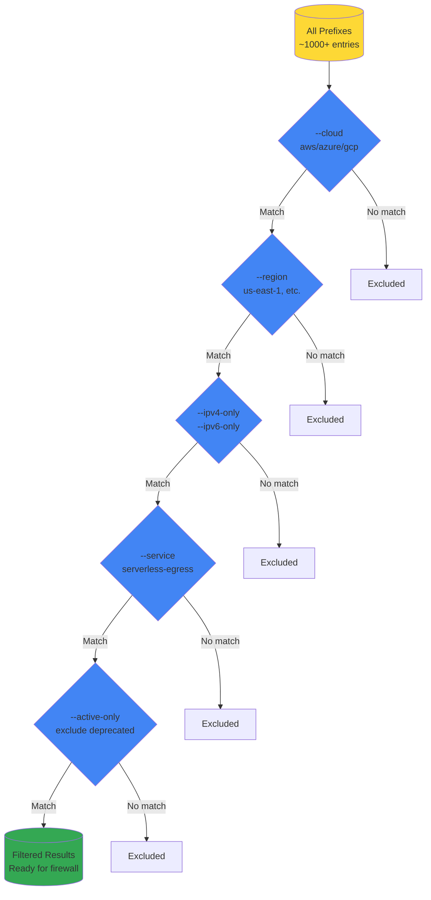
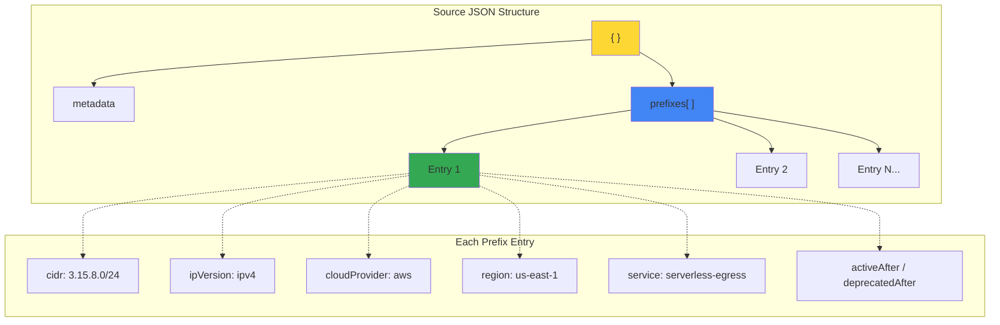
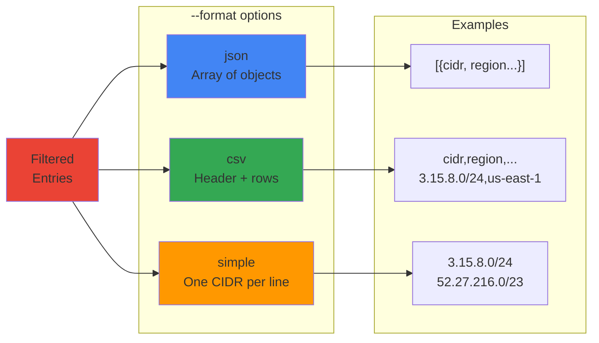
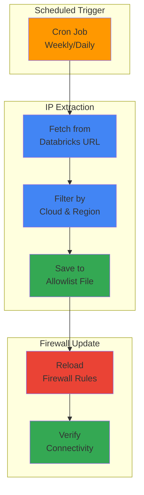

# Databricks IP Range Extractor

A Python utility to extract and filter Databricks IP ranges for egress allowlisting in firewalls and network appliances.

## How It Works



---

## Filtering Pipeline

The tool applies filters sequentially to narrow down IP ranges:



---

## Prerequisites

- Python 3.7 or higher
- No external dependencies (uses standard library only)

```bash
# Verify Python version
python --version
```

---

## Data Source

By default the script fetches the **official Databricks IP ranges** endpoint (latest schema). No local copy of the JSON is required; use `--file` only when you have a downloaded or cached file (e.g. air-gapped).

- **URL:** [https://www.databricks.com/networking/v1/ip-ranges.json](https://www.databricks.com/networking/v1/ip-ranges.json)
- **Docs:** [Databricks – IP ranges](https://docs.databricks.com/security/network/ip-ranges.html)

**Official JSON schema** (live endpoint): root has `timestampSeconds`, `schemaVersion`, and `prefixes[]`. Each prefix entry has:
- `platform` — `aws` \| `azure` \| `gcp`
- `region` — e.g. `us-east-1`, `eastus`, `europe-west1`
- `service` — e.g. `Databricks`
- `type` — `inbound` \| `outbound`
- `ipv4Prefixes` — array of CIDR strings
- `ipv6Prefixes` — array of CIDR strings

The script normalizes this into a flat list (one row per CIDR) with `cloud`, `region`, `type`, `cidr`, `ipVersion`, `service`.

**Passing input:** use `--source` or `--file` with a URL or path only when you need a specific source (e.g. cached file or alternate URL).

---

## Quick Start

```bash
# Extract all AWS IPs
python extract-databricks-ips.py --cloud aws

# Per cloud, default CSV (cloud, region, type, cidr, ipVersion, service)
python extract-databricks-ips.py --cloud aws

# Multiple regions (comma-separated); omit --type to get both inbound and outbound
python extract-databricks-ips.py --cloud aws --region us-east-1,us-west-2,eu-west-1
python extract-databricks-ips.py --cloud azure --region eastus,westeurope

# Save to file (CSV by default)
python extract-databricks-ips.py --cloud aws --output aws-ips.csv
```

---

## Usage

### Basic Commands

```bash
# All clouds, all regions (output: CSV by default)
python extract-databricks-ips.py

# Per cloud – CSV with columns: cloud, region, type, cidr, ipVersion, service
python extract-databricks-ips.py --cloud aws
python extract-databricks-ips.py --cloud azure
python extract-databricks-ips.py --cloud gcp

# Single or multiple regions (comma-separated)
python extract-databricks-ips.py --cloud aws --region us-east-1
python extract-databricks-ips.py --cloud aws --region us-east-1,us-east-2,eu-west-1
python extract-databricks-ips.py --cloud azure --region eastus,westeurope

# Type: omit for both inbound and outbound; use --type outbound for egress only
python extract-databricks-ips.py --cloud aws --type outbound
python extract-databricks-ips.py --cloud aws --type inbound

# IPv4 only (for firewalls that don't support IPv6)
python extract-databricks-ips.py --cloud aws --ipv4-only
```

### Output Formats

Default is **CSV** (one row per CIDR: cloud, region, type, cidr, ipVersion, service).

```bash
# CSV (default)
python extract-databricks-ips.py --cloud aws

# JSON – array of objects
python extract-databricks-ips.py --cloud aws --format json

# Simple – one CIDR per line
python extract-databricks-ips.py --cloud aws --format simple
```

### Discovery Commands

```bash
# List available regions
python extract-databricks-ips.py --list-regions

# List regions for specific cloud
python extract-databricks-ips.py --list-regions --cloud aws

# List available services
python extract-databricks-ips.py --list-services
```

### Using a URL or Local File

You can pass the input with `--source` or `--file` (either a URL or a path to a local file):

```bash
# Online: official URL (or any URL that serves the same JSON schema)
python extract-databricks-ips.py --file https://www.databricks.com/networking/v1/ip-ranges.json --cloud aws
python extract-databricks-ips.py --source https://www.databricks.com/networking/v1/ip-ranges.json --cloud aws

# Local: path to a downloaded or cached JSON file (e.g. air-gapped)
python extract-databricks-ips.py --file ./downloaded-ip-ranges.json --cloud aws
python extract-databricks-ips.py --file ./ip-ranges.json --type outbound
```

---

## Output Schema

### JSON Structure Overview



### Output Format Comparison



Both JSON and CSV use the same flat structure:

**JSON:**
```json
[
  {
    "cidr": "3.15.8.0/24",
    "ipVersion": "ipv4",
    "cloudProvider": "aws",
    "region": "us-east-1",
    "service": "serverless-egress"
  }
]
```

**CSV:**
```
cidr,ipVersion,cloudProvider,region,service
3.15.8.0/24,ipv4,aws,us-east-1,serverless-egress
```

| Field | Description |
|-------|-------------|
| `cidr` | IP range in CIDR notation |
| `ipVersion` | `ipv4` or `ipv6` |
| `cloudProvider` | `aws`, `azure`, or `gcp` |
| `region` | Cloud-specific region identifier |
| `service` | Service type (e.g., `serverless-egress`, `control-plane-egress`) |

---

## Automation Example

### Typical Automation Workflow



### Weekly Cron Job

```bash
# Add to crontab (runs every Monday at 6 AM)
0 6 * * 1 python /path/to/extract-databricks-ips.py --file https://www.databricks.com/networking/v1/ip-ranges.json --cloud aws --output /etc/firewall/databricks-ips.json
```

### Simple Bash Script

```bash
#!/bin/bash
# update-databricks-ips.sh

SCRIPT_DIR="/path/to/databricks-utils/extract-databricks-ips"
OUTPUT_DIR="/etc/firewall/allowlists"
SOURCE_URL="https://www.databricks.com/networking/v1/ip-ranges.json"
# Or use a local file: SOURCE_URL="/path/to/ip-ranges.json"

# Extract IPs for each cloud (--file accepts URL or local path)
python ${SCRIPT_DIR}/extract-databricks-ips.py \
  --file "${SOURCE_URL}" \
  --cloud aws \
  --format simple \
  --output ${OUTPUT_DIR}/databricks-aws.txt

# Reload firewall rules (example for iptables)
# /usr/local/bin/reload-firewall.sh
```

---

## All Options

```
--cloud, -c        Cloud provider: aws, azure, gcp, all (default: all)
--region, -r       Region(s): one or comma-separated (e.g. us-east-1,eu-west-1). Default: all
--ipv4-only        Include only IPv4 addresses
--ipv6-only        Include only IPv6 addresses
--service, -s      Filter by service type
--active-only      Exclude future/deprecated IPs
--format, -f       Output format: csv (default), json, or simple
                     json   - array of objects
                     csv    - header + rows
                     simple - one CIDR per line
--list-regions     List available regions and exit
--list-services    List available services and exit
--source, --file   URL or path to local JSON (online or downloaded file)
--output, -o       Output file (default: stdout)
```

---

## Testing

Run the test suite to validate flags and output formats (uses an inline fixture; optional tests hit the live URL if network is available):

```bash
python test_extract_databricks_ips.py
```

Tests cover: `--cloud`, `--region`, `--type`, `--ipv4-only`/`--ipv6-only`, `--service`, `--format` (json/csv/simple), `--list-regions`, `--list-services`, `--output`, combined filters, and mutual exclusivity of options.

---

## Support

- **Documentation**: [Databricks Network Connectivity](https://docs.databricks.com)
- **IP ranges JSON**: [https://www.databricks.com/networking/v1/ip-ranges.json](https://www.databricks.com/networking/v1/ip-ranges.json)
