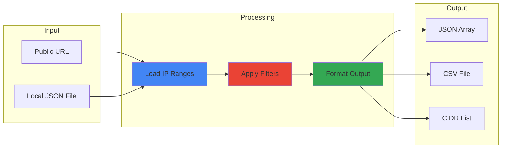
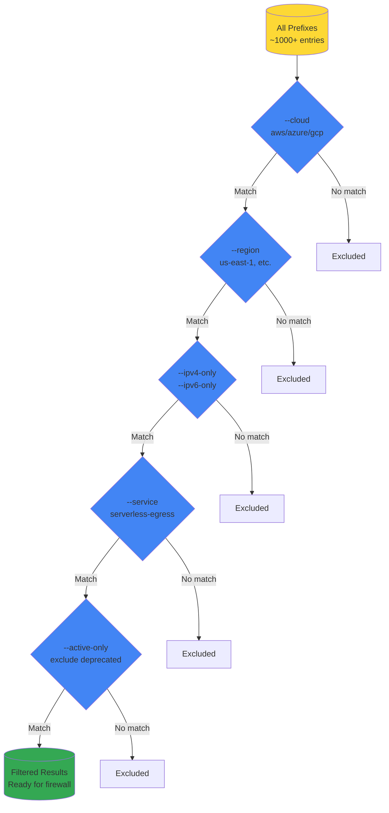
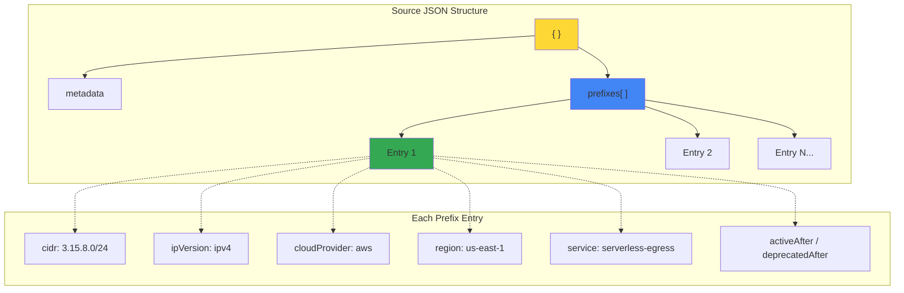
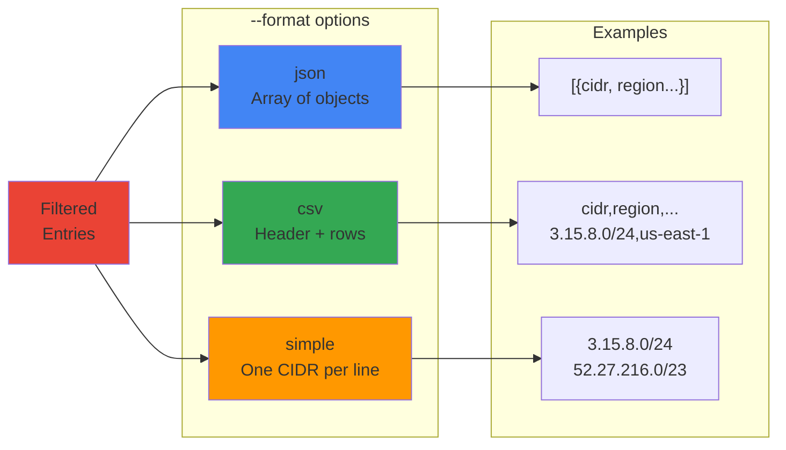
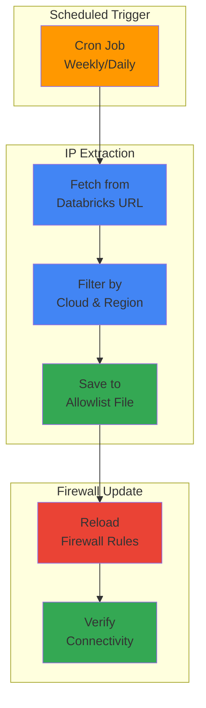

# Databricks IP Range Extractor

A Python utility to extract and filter Databricks IP ranges for egress allowlisting in firewalls and network appliances.

## How It Works



---

## Filtering Pipeline

The tool applies filters sequentially to narrow down IP ranges:



---

## Prerequisites

- Python 3.7 or higher
- No external dependencies (uses standard library only)

```bash
# Verify Python version
python --version
```

---

## Quick Start

```bash
# Extract all AWS IPs
python extract-databricks-ips.py --cloud aws

# Extract AWS us-east-1 only
python extract-databricks-ips.py --cloud aws --region us-east-1

# Save to file
python extract-databricks-ips.py --cloud aws --output aws-ips.json
```

---

## Usage

### Basic Commands

```bash
# All clouds, all regions
python extract-databricks-ips.py

# Filter by cloud provider
python extract-databricks-ips.py --cloud aws
python extract-databricks-ips.py --cloud azure
python extract-databricks-ips.py --cloud gcp

# Filter by region
python extract-databricks-ips.py --cloud aws --region us-east-1
python extract-databricks-ips.py --cloud azure --region eastus

# IPv4 only (for firewalls that don't support IPv6)
python extract-databricks-ips.py --cloud aws --ipv4-only
```

### Output Formats

```bash
# JSON (default) - array of objects
python extract-databricks-ips.py --cloud aws --format json

# CSV - header + rows
python extract-databricks-ips.py --cloud aws --format csv

# Simple - one CIDR per line
python extract-databricks-ips.py --cloud aws --format simple
```

### Discovery Commands

```bash
# List available regions
python extract-databricks-ips.py --list-regions

# List regions for specific cloud
python extract-databricks-ips.py --list-regions --cloud aws

# List available services
python extract-databricks-ips.py --list-services
```

### Using the Public JSON Endpoint

```bash
# Fetch directly from Databricks (when URL is available)
python extract-databricks-ips.py --source https://<insert-url-here> --cloud aws
```

---

## Output Schema

### JSON Structure Overview



### Output Format Comparison



Both JSON and CSV use the same flat structure:

**JSON:**
```json
[
  {
    "cidr": "3.15.8.0/24",
    "ipVersion": "ipv4",
    "cloudProvider": "aws",
    "region": "us-east-1",
    "service": "serverless-egress"
  }
]
```

**CSV:**
```
cidr,ipVersion,cloudProvider,region,service
3.15.8.0/24,ipv4,aws,us-east-1,serverless-egress
```

| Field | Description |
|-------|-------------|
| `cidr` | IP range in CIDR notation |
| `ipVersion` | `ipv4` or `ipv6` |
| `cloudProvider` | `aws`, `azure`, or `gcp` |
| `region` | Cloud-specific region identifier |
| `service` | Service type (e.g., `serverless-egress`, `control-plane-egress`) |

---

## Automation Example

### Typical Automation Workflow



### Weekly Cron Job

```bash
# Add to crontab (runs every Monday at 6 AM)
0 6 * * 1 python /path/to/extract-databricks-ips.py --source https://<insert-url-here> --cloud aws --output /etc/firewall/databricks-ips.json
```

### Simple Bash Script

```bash
#!/bin/bash
# update-databricks-ips.sh

SCRIPT_DIR="/path/to/databricks-utils/extract-databricks-ips"
OUTPUT_DIR="/etc/firewall/allowlists"
SOURCE_URL="https://<insert-url-here>"

# Extract IPs for each cloud
python ${SCRIPT_DIR}/extract-databricks-ips.py \
  --source ${SOURCE_URL} \
  --cloud aws \
  --format simple \
  --output ${OUTPUT_DIR}/databricks-aws.txt

# Reload firewall rules (example for iptables)
# /usr/local/bin/reload-firewall.sh
```

---

## All Options

```
--cloud, -c        Cloud provider: aws, azure, gcp, all (default: all)
--region, -r       Region filter (default: all)
--ipv4-only        Include only IPv4 addresses
--ipv6-only        Include only IPv6 addresses
--service, -s      Filter by service type
--active-only      Exclude future/deprecated IPs
--format, -f       Output format (default: json)
                     json   - array of objects
                     csv    - header + rows
                     simple - one CIDR per line
--list-regions     List available regions and exit
--list-services    List available services and exit
--source           Source URL or local file path
--output, -o       Output file (default: stdout)
```

---

## Support

- **Documentation**: [Databricks Network Connectivity](https://docs.databricks.com)
- **JSON Endpoint**: `https://<insert-url-here>`
