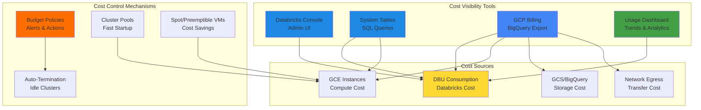
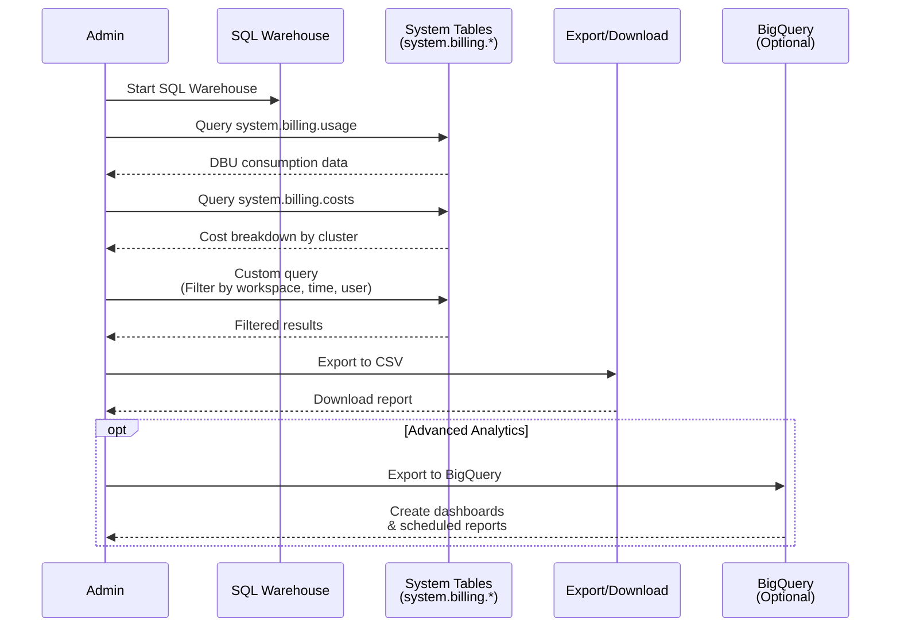
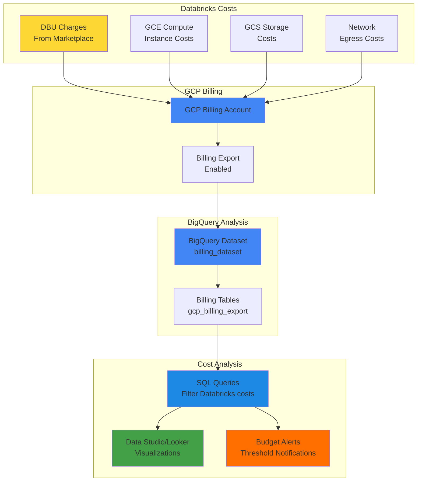
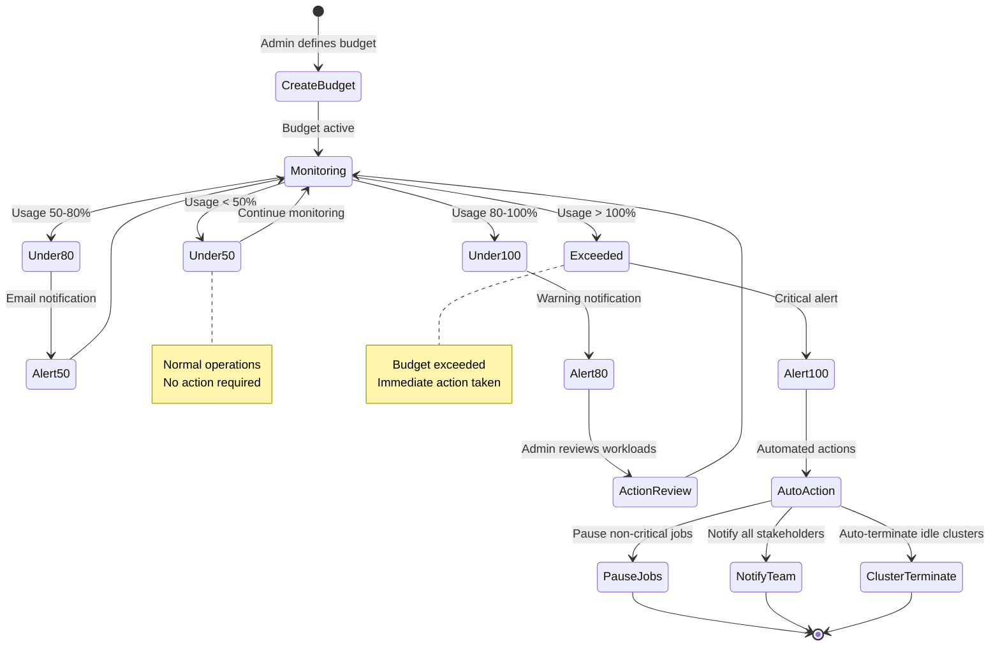
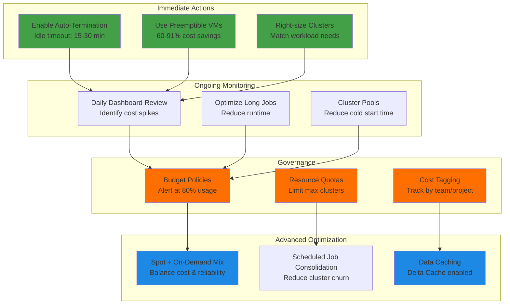

## Databricks Cost Management and Analysis

This guide provides a step-by-step walkthrough of monitoring and managing usage in Databricks on Google Cloud. It is based on the official Databricks documentation: [Monitor and Manage Cloud Usage](https://docs.databricks.com/gcp/en/admin/usage/).

### Cost Management Overview



### Table of Contents
1. [Overview](#overview)
2. [Monitor Usage with the Databricks Console](#monitor-usage-with-the-databricks-console)
3. [Using System Tables for Usage Analysis](#using-system-tables-for-usage-analysis)
4. [Using GCP Billing Reports](#using-gcp-billing-reports)
5. [Using Budget Policies for Cost Control](#using-budget-policies-for-cost-control)
6. [Using the Databricks Usage Dashboard](#using-the-databricks-usage-dashboard)
7. [Best Practices for Cost Management](#best-practices-for-cost-management)

### Overview
Databricks on Google Cloud allows administrators to track and manage resource usage effectively. This includes monitoring compute, storage, and job execution costs using built-in tools like the Databricks UI, system tables, budget policies, dashboards, and GCP billing reports.

### Monitor Usage with the Databricks Console
#### Steps:
1. **Log in to Databricks Workspace**
   - Navigate to your Databricks workspace on GCP.
   - Sign in with appropriate admin credentials.

2. **Open the Admin Console**
   - Click on the user profile in the top right corner.
   - Select **Admin Console**.

3. **Check Usage Metrics**
   - In the **Usage** tab, view details on active clusters, job execution, and DBU (Databricks Units) consumption.
   - Use the **Clusters** section to analyze the runtime and auto-scaling settings for cost control.

### Using System Tables for Usage Analysis
Databricks provides system tables that store metadata about usage. These tables can be queried using SQL for more granular insights.

#### Steps:
1. **Enable System Tables**
   - Go to **Compute** > **SQL Warehouses**.
   - Ensure you have a running SQL warehouse.

2. **Query the System Tables**
   - Open a new SQL query and use the following commands:

   ```sql
   SELECT * FROM system.billing.usage;
   ```
   - This provides a breakdown of compute and job execution costs.

   ```sql
   SELECT * FROM system.billing.costs;
   ```
   - This gives cost details associated with clusters and workloads.

3. **Export Reports**
   - Use the **Export** option in the UI to download reports in CSV format.

### System Tables Analysis Flow



### Using GCP Billing Reports
Google Cloud provides billing export features that can be leveraged to analyze Databricks costs.

#### Steps:
1. **Enable Billing Export in Google Cloud**
   - Go to **Google Cloud Console** > **Billing**.
   - Enable **BigQuery Export** under billing settings.

2. **Create a BigQuery Dataset**
   - Open BigQuery in Google Cloud.
   - Create a dataset to store exported billing data.

3. **Query Billing Data**
   - Use the following SQL query in BigQuery to fetch Databricks-related costs:

   ```sql
   SELECT * FROM `<your_project>.billing_dataset.gcp_billing_export`
   WHERE service.description LIKE '%Databricks%';
   ```
   - Replace `<your_project>` with your actual GCP project ID.

4. **Set Up Alerts**
   - Configure budget alerts in GCP Billing to notify you when Databricks costs exceed a threshold.

### GCP Billing Integration Architecture



### Using Budget Policies for Cost Control
Budget policies allow administrators to set predefined limits and take automated actions to prevent overspending.

#### Steps:
1. **Access Budget Settings**
   - Navigate to **Admin Console** > **Account Settings** > **Budgets** ([Databricks Budget Policies](https://docs.databricks.com/gcp/en/admin/account-settings/budgets)).

2. **Create a New Budget Policy**
   - Click **Create Budget** and define parameters:
     - **Scope**: Choose between workspace-level or account-level budgets.
     - **Thresholds**: Define spending thresholds at which alerts or automated actions will trigger.
     - **Actions**: Set automated actions such as notifying admins or pausing non-essential workloads.

3. **Monitor Budget Usage**
   - View real-time budget consumption through the Budgets dashboard.
   - Set up email notifications to alert administrators of budget exceedance.

### Budget Policy Workflow



### Using the Databricks Usage Dashboard
Databricks provides a built-in **Usage Dashboard** that gives a graphical representation of costs and consumption trends.

#### Steps:
1. **Access the Usage Dashboard**
   - Go to **Admin Console** > **Account Settings** > **Usage** ([Databricks Usage Dashboard](https://docs.databricks.com/gcp/en/admin/account-settings/usage)).

2. **Review Usage Metrics**
   - The dashboard displays:
     - **DBU consumption** per workspace.
     - **Compute costs** based on cluster configurations.
     - **Job execution statistics**.

3. **Analyze Trends and Optimize Costs**
   - Use the insights to:
     - Identify high-cost workloads.
     - Optimize cluster utilization.
     - Adjust auto-scaling policies.

### Best Practices for Cost Management
- **Use Auto-Termination for Clusters**: Ensure all clusters have auto-termination enabled to avoid unnecessary costs.
- **Monitor Job Execution Time**: Track and optimize long-running jobs.
- **Use Spot Instances for Workloads**: Leverage GCP Preemptible VMs to reduce costs for non-critical workloads.
- **Regularly Review Billing Reports**: Set up scheduled queries in BigQuery to track spending trends.
- **Leverage Databricks Pools**: Reduce cluster startup time and cost by using cluster pools.
- **Set Up Budget Policies**: Define budgets with automated alerts to prevent cost overruns.
- **Utilize the Usage Dashboard**: Monitor resource consumption trends for proactive cost management.

### Cost Optimization Strategy



For more details, refer to the official documentation:
- [Databricks Usage on GCP](https://docs.databricks.com/gcp/en/admin/usage/)
- [Budget Policies](https://docs.databricks.com/gcp/en/admin/account-settings/budgets)
- [Usage Dashboard](https://docs.databricks.com/gcp/en/admin/account-settings/usage)

---
This guide ensures effective tracking and management of Databricks usage costs on Google Cloud while optimizing resource consumption.

