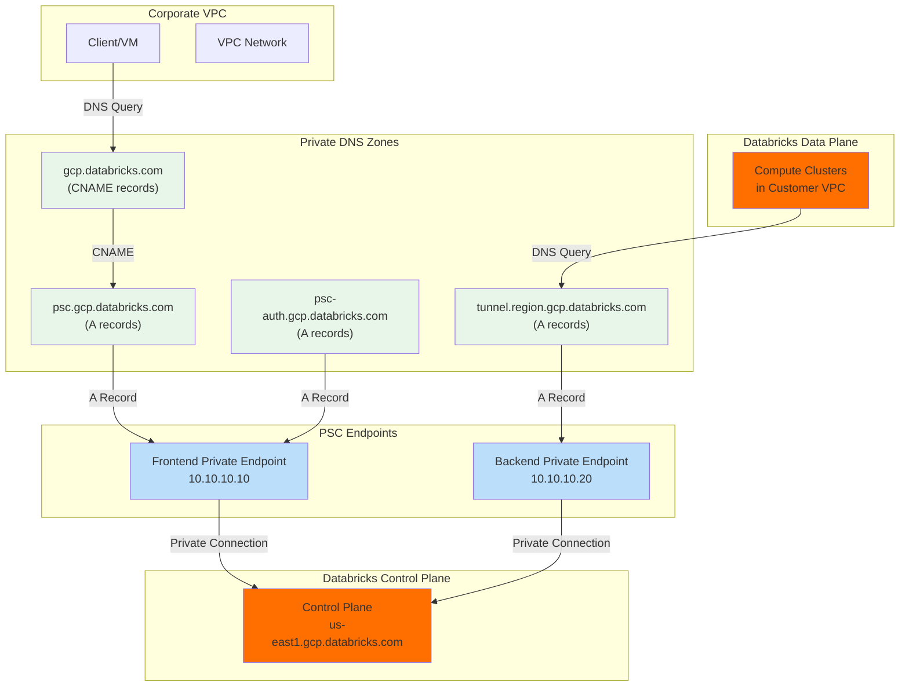
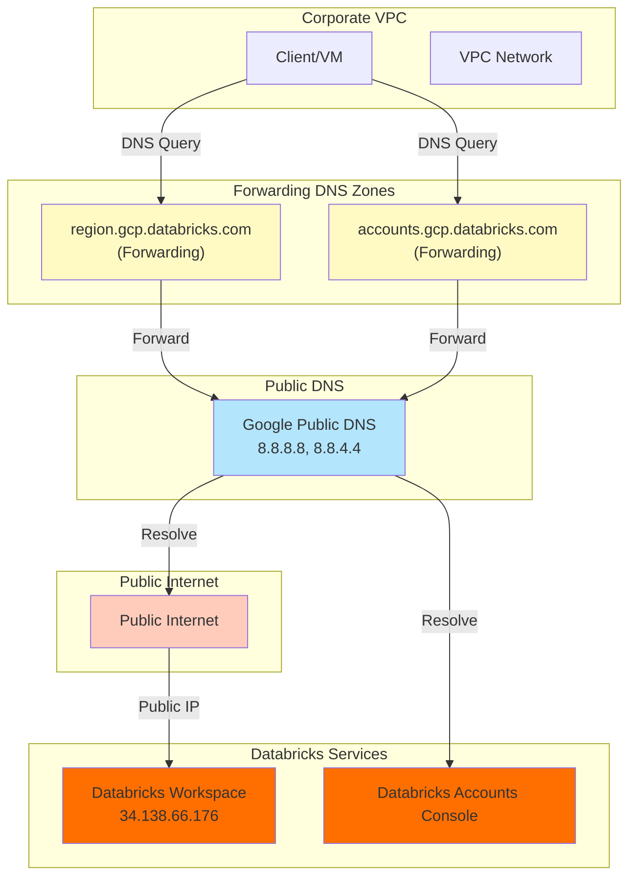
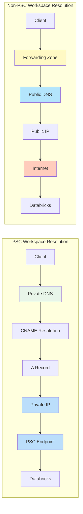
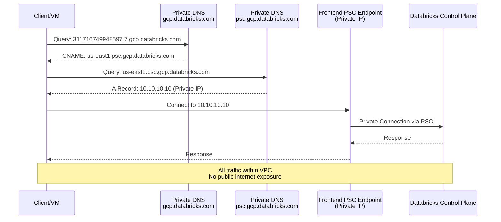
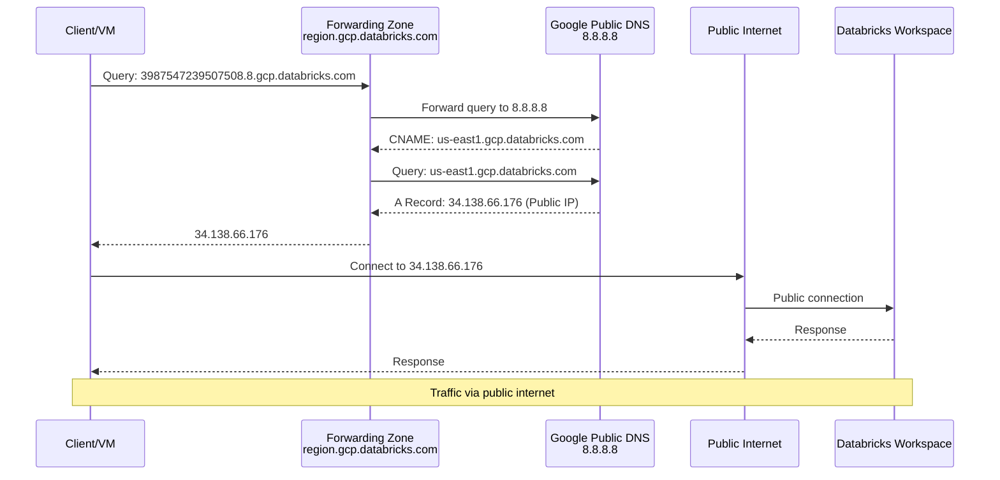
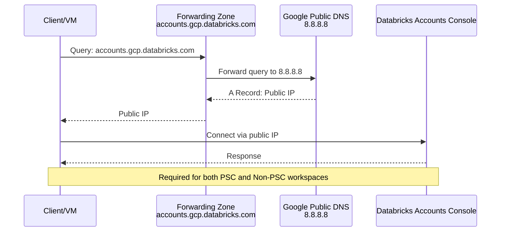

## Databricks GCP DNS Setup Guide

### Overview

Introduction to DNS configuration requirements for Databricks workspaces on GCP, covering both **Private Service Connect (PSC)** and **Non-PSC** deployment models.

####  Key Differences: PSC vs Non-PSC

| Aspect | PSC Workspace | Non-PSC Workspace |
|--------|--------------|-------------------|
| **DNS Resolution** | Private DNS zones with private IPs | Forwarding zones to public DNS (8.8.8.8, 8.8.4.4) |
| **Traffic Path** | All traffic within VPC | Traffic traverses public internet |
| **Required Zones** | 4 private zones | Per-region forwarding zones |
| **Backend DNS** | Private tunnel zone required | Handled by GCP default DNS |
| **Security** | Highest - no public exposure | Standard - relies on public DNS |

### DNS Chain Examples

#### PSC Workspace DNS Chain
```
311715749948597.7.gcp.databricks.com         [workspace URL]
→ us-east1.psc.gcp.databricks.com            [intermediate PSC DNS]
→ us-east1.gcp.databricks.com                [shard URL]
→ 34.138.66.176                              [resolves to private IP in VPC]
```

**Key Characteristics**:
- Includes PSC-specific intermediate DNS
- Resolves to private endpoint in your VPC
- All traffic stays within VPC boundaries

#### Non-PSC Workspace DNS Chain
```
3987547239507508.8.gcp.databricks.com         [workspace URL]
→ us-east1.gcp.databricks.com                 [shard URL]
→ 34.138.66.176                               [public IP]

dp-3987447239507508.8.gcp.databricks.com      [dataplane workspace record]
→ us-east1.gcp.databricks.com                 [shard URL]
→ 34.138.66.176                               [public IP]
```

**Key Characteristics**:
- Both workspace URL and dp-* records resolve publicly
- No PSC-specific intermediate DNS
- Traffic traverses public internet

### Architecture Diagrams

#### PSC Workspace Architecture



#### Non-PSC Workspace Architecture



#### DNS Resolution Comparison



### DNS Zone Requirements

#### PSC Workspace DNS Configuration

All DNS records are configured in **private DNS zones**. Records resolve to **private IP addresses**, keeping all traffic within the VPC.

| Purpose | Zone Name | DNS Name | Type | Record Type | Example Record | Resolves To | Notes |
|---------|-----------|----------|------|-------------|----------------|-------------|-------|
| **Frontend DNS (Main)** | `databricks-main` | `gcp.databricks.com.` | Private | CNAME | `311716749948597.7.gcp.databricks.com` → `us-east1.psc.gcp.databricks.com` | Intermediate PSC DNS | Repeat for each workspace; workspaces in same region point to same alias |
| **Frontend DNS (Intermediate)** | `databricks-psc-webapp` | `psc.gcp.databricks.com.` | Private | A | `us-east1.psc.gcp.databricks.com` → Frontend Private IP | Frontend Private IP | Same as workspace URL private IP |
| **Auth Callback DNS** | `databricks-psc-webapp-auth` | `psc-auth.gcp.databricks.com.` | Private | A | `us-east1.psc-auth.gcp.databricks.com` → Frontend Private IP | Frontend Private IP | Same as workspace URL private IP |
| **Backend (Tunnel) DNS** | `databricks-psc-backend-<region>` | `tunnel.<region>.gcp.databricks.com.` | Private | A | `tunnel.us-east1.gcp.databricks.com` → Backend Private PSC Endpoint IP | Backend Private PSC Endpoint IP | Region-specific private DNS zone |

#### Non-PSC Workspace DNS Configuration

DNS queries are forwarded to **public DNS servers** (e.g., Google Public DNS: 8.8.8.8, 8.8.4.4). Records resolve to **public IP addresses**.

| Purpose | Zone Name | DNS Name | Type | Record Type | Example Record | Resolves To | Notes |
|---------|-----------|----------|------|-------------|----------------|-------------|-------|
| **Frontend DNS (Workspace Access)** | `databricks-public-<region>` | `<region>.gcp.databricks.com.` | Forwarding | CNAME (via public DNS) | `51237447239507508.8.gcp.databricks.com` → `us-east1.gcp.databricks.com` | Public IP via Google Public DNS | Forwarding zone; applies to workspace URLs |
| **Backend Workspace Records** | Same as above | Same as above | Forwarding | CNAME (via public DNS) | `dp-51237447239507508.8.gcp.databricks.com` → `us-east1.gcp.databricks.com` | Public IP via Google Public DNS | Separate record; applies to backend workspace records |
| **Backend (Tunnel) DNS** | N/A | N/A | N/A | N/A | N/A | Handled by GCP's default DNS | No setup required |

#### Common: Databricks Accounts Console

Required for **both PSC and Non-PSC workspaces**:

| Purpose | Zone Name | DNS Name | Type | Forward To | Notes |
|---------|-----------|----------|------|------------|-------|
| **Accounts Console** | `databricks-account-console` | `accounts.gcp.databricks.com.` | Forwarding | 8.8.8.8, 8.8.4.4 | Resolves using Google's or your preferred public DNS service |

### Implementation Options

#### Option 1: Terraform Configuration

**Implementation File**: [dns-extend.tf](templates/terraform-scripts/infra4db/dns-extend.tf)

**Prerequisites**:
- Terraform >= 1.0
- Google provider configured
- VPC network already created
- For PSC: PSC endpoints created with private IPs assigned

**Configuration Steps**:

1. **Set variables in `terraform.tfvars`**:
   ```hcl
   workspace_type    = "psc"  # or "non-psc"
   vpc_network_id    = "projects/PROJECT_ID/global/networks/VPC_NAME"
   vpc_project_id    = "your-project-id"

   databricks_regions = {
     us-east1 = {
       region         = "us-east1"
       frontend_pe_ip = "10.10.10.10"  # PSC only - Frontend PSC Endpoint IP
       backend_pe_ip  = "10.10.10.20"  # PSC only - Backend PSC Endpoint IP
     }
   }

   workspaces = {
     ws1 = {
       workspace_id = "311716749948597.7"
       region       = "us-east1"
     }
   }
   ```

2. **Initialize and apply**:
   ```bash
   cd templates/terraform-scripts/infra4db/
   terraform init
   terraform plan
   terraform apply
   ```

3. **Verify DNS zones created**:
   ```bash
   terraform output
   ```

#### Option 2: gcloud CLI Commands

**Implementation Script**: [dns-extend-gcloud](templates/gcloud-cmds/dns-extend-gcloud)

**Prerequisites**:
- gcloud CLI installed and authenticated
- Permissions: `dns.admin` role on the project
- VPC network already created

**Execution Steps**:

1. **Edit the script variables** at the top of the file:
   ```bash
   PROJECT_ID="your-project-id"
   VPC_NETWORK="your-vpc-network"
   WORKSPACE_TYPE="psc"  # or "non-psc"
   REGION="us-east1"
   FRONTEND_PRIVATE_IP="10.10.10.10"
   BACKEND_PRIVATE_IP="10.10.10.20"
   WORKSPACE_ID="311716749948597.7"
   ```

2. **Make script executable**:
   ```bash
   chmod +x templates/gcloud-cmds/dns-extend-gcloud
   ```

3. **Run the script**:
   ```bash
   ./templates/gcloud-cmds/dns-extend-gcloud
   ```

4. **Verify DNS setup** using the verification commands in the script output

### Sequence Diagrams

#### PSC Workspace DNS Resolution



#### Non-PSC Workspace DNS Resolution



#### Accounts Console Resolution (Both Types)



### DNS Resolution Flow Summary

#### PSC Flow
- **Workspace URL**: `workspace_id.gcp.databricks.com` → private DNS → CNAME to `region.psc.gcp.databricks.com` → A record to private frontend IP → PSC Endpoint → Databricks Control Plane
- **Workspace Auth**: `region.psc-auth.gcp.databricks.com` → private DNS → A record to private frontend IP → PSC Endpoint → Databricks Control Plane
- **Tunnel DNS**: `tunnel.region.gcp.databricks.com` → private DNS → A record to private backend IP → PSC Endpoint → Databricks Control Plane

#### Non-PSC Flow
- **Workspace URL**: `workspace_id.gcp.databricks.com` → forwarding zone → public DNS (8.8.8.8) → public IP → internet → Databricks
- **dp-* record**: `dp-workspace_id.gcp.databricks.com` → forwarding zone → public DNS (8.8.8.8) → public IP → internet → Databricks
- **Backend**: Handled automatically by GCP default DNS (no configuration needed)

### Verification

#### Verify DNS Zones
```bash
## List all DNS zones in the project
gcloud dns managed-zones list --project=PROJECT_ID

## Describe a specific zone
gcloud dns managed-zones describe databricks-main --project=PROJECT_ID

## Check zone visibility and network association
gcloud dns managed-zones describe databricks-main \
  --project=PROJECT_ID \
  --format="yaml(privateVisibilityConfig)"
```

#### Verify DNS Records
```bash
## List all records in a zone
gcloud dns record-sets list --zone=databricks-main --project=PROJECT_ID

## List specific record
gcloud dns record-sets list \
  --zone=databricks-main \
  --name="311716749948597.7.gcp.databricks.com." \
  --project=PROJECT_ID

## Test DNS resolution from VM in VPC (using GCP's metadata DNS server)
dig @169.254.169.254 311716749948597.7.gcp.databricks.com

## Alternative test using nslookup
nslookup 311716749948597.7.gcp.databricks.com 169.254.169.254
```

#### Expected Outputs

**PSC Workspace**:
- `workspace_id.gcp.databricks.com` should resolve to `region.psc.gcp.databricks.com` (CNAME)
- `region.psc.gcp.databricks.com` should resolve to private IP (A record, e.g., 10.10.10.10)
- `region.psc-auth.gcp.databricks.com` should resolve to private IP (A record, same as above)
- `tunnel.region.gcp.databricks.com` should resolve to private backend IP (A record, e.g., 10.10.10.20)

**Non-PSC Workspace**:
- `workspace_id.gcp.databricks.com` should resolve to public IP via forwarding (e.g., 34.138.66.176)
- `dp-workspace_id.gcp.databricks.com` should resolve to public IP via forwarding

**Both**:
- `accounts.gcp.databricks.com` should resolve to public IP via forwarding

### Troubleshooting

#### Common Issues

##### Issue: DNS records not resolving from VMs in VPC

**Symptoms**:
- `dig` or `nslookup` returns `NXDOMAIN` or `SERVFAIL`
- Workspace URL cannot be reached

**Possible Causes**:
1. DNS zone not associated with VPC network
2. VM using wrong DNS server
3. Firewall rules blocking DNS traffic

**Solutions**:
```bash
## Check if zone is associated with VPC
gcloud dns managed-zones describe databricks-main \
  --project=PROJECT_ID \
  --format="yaml(privateVisibilityConfig)"

## Verify VM's DNS configuration
## From VM:
cat /etc/resolv.conf  # Should show 169.254.169.254 as nameserver

## Test with correct DNS server
dig @169.254.169.254 your-workspace-url.gcp.databricks.com

## Check firewall rules allow DNS (UDP/TCP port 53)
gcloud compute firewall-rules list --project=PROJECT_ID --filter="targetTags:* AND allowed.ports:53"
```

##### Issue: PSC workspace cannot reach Databricks

**Symptoms**:
- DNS resolves correctly but connection timeouts
- Private IP is reachable but returns errors

**Possible Causes**:
1. Missing intermediate PSC DNS zone (`psc.gcp.databricks.com`)
2. Incorrect private IP in DNS records
3. PSC endpoint not properly configured
4. Missing auth zone (`psc-auth.gcp.databricks.com`)

**Solutions**:
```bash
## Verify all 4 DNS zones exist for PSC
gcloud dns managed-zones list --project=PROJECT_ID | grep databricks

## Expected zones:
## - databricks-main
## - databricks-psc-webapp
## - databricks-psc-webapp-auth
## - databricks-psc-backend-<region>

## Check if IPs in DNS match PSC endpoint IPs
gcloud dns record-sets list --zone=databricks-psc-webapp --project=PROJECT_ID

## Verify PSC endpoint status
gcloud compute forwarding-rules list --project=PROJECT_ID | grep databricks

## Test connectivity to private IP
ping <private-frontend-ip>
curl -v https://<private-frontend-ip>
```

##### Issue: Non-PSC workspace DNS not forwarding correctly

**Symptoms**:
- DNS queries failing or timing out
- Workspace URL not resolving

**Possible Causes**:
1. Incorrect forwarding targets (not 8.8.8.8, 8.8.4.4)
2. Firewall blocking outbound DNS to 8.8.8.8
3. Wrong zone visibility (should be private with network association)

**Solutions**:
```bash
## Check forwarding configuration
gcloud dns managed-zones describe databricks-public-us-east1 \
  --project=PROJECT_ID \
  --format="yaml(forwardingConfig)"

## Verify forwarding targets
## Should show:
## forwardingConfig:
##   targetNameServers:
##   - ipv4Address: 8.8.8.8
##   - ipv4Address: 8.8.4.4

## Test connectivity to Google Public DNS
dig @8.8.8.8 google.com

## Check firewall rules allow outbound DNS to 8.8.8.8
gcloud compute firewall-rules list --project=PROJECT_ID --format="table(name,allowed)"
```

##### Issue: Accounts console not accessible

**Symptoms**:
- `accounts.gcp.databricks.com` not resolving
- Cannot access Databricks Accounts Console

**Possible Causes**:
1. Missing forwarding zone for `accounts.gcp.databricks.com`
2. Firewall blocking outbound HTTPS (443)

**Solutions**:
```bash
## Check if accounts zone exists
gcloud dns managed-zones list --project=PROJECT_ID | grep account

## Verify forwarding configuration
gcloud dns managed-zones describe databricks-account-console \
  --project=PROJECT_ID \
  --format="yaml(dnsName,forwardingConfig)"

## Test DNS resolution
dig @169.254.169.254 accounts.gcp.databricks.com

## Test HTTPS connectivity
curl -v https://accounts.gcp.databricks.com
```

##### Issue: CNAME records not resolving correctly (PSC)

**Symptoms**:
- Workspace URL returns `NXDOMAIN`
- CNAME record exists but doesn't resolve

**Possible Causes**:
1. CNAME target missing (no A record in PSC zone)
2. CNAME pointing to wrong target
3. Circular CNAME reference

**Solutions**:
```bash
## Check CNAME record
gcloud dns record-sets list --zone=databricks-main \
  --name="311716749948597.7.gcp.databricks.com." \
  --project=PROJECT_ID

## Verify target A record exists
gcloud dns record-sets list --zone=databricks-psc-webapp \
  --name="us-east1.psc.gcp.databricks.com." \
  --project=PROJECT_ID

## Test full resolution chain
dig +trace @169.254.169.254 311716749948597.7.gcp.databricks.com
```

#### Debug Commands

```bash
## Full DNS trace
dig +trace @169.254.169.254 <your-workspace-url>

## Check all zones
gcloud dns managed-zones list --project=PROJECT_ID

## Check all records in a zone
gcloud dns record-sets list --zone=<zone-name> --project=PROJECT_ID

## Test from specific DNS server
dig @169.254.169.254 <domain>  # GCP metadata DNS
dig @8.8.8.8 <domain>           # Google Public DNS

## Check PSC endpoint status
gcloud compute forwarding-rules describe <psc-endpoint-name> \
  --region=<region> \
  --project=PROJECT_ID

## View PSC connection status
gcloud compute forwarding-rules describe <psc-endpoint-name> \
  --region=<region> \
  --project=PROJECT_ID \
  --format="value(pscConnectionStatus)"
```

### Additional Resources

- [GCP Cloud DNS Documentation](https://cloud.google.com/dns/docs)
- [Databricks GCP Network Architecture](https://docs.databricks.com/administration-guide/cloud-configurations/gcp/index.html)
- [Private Service Connect Documentation](https://cloud.google.com/vpc/docs/private-service-connect)
- [Terraform Google DNS Provider](https://registry.terraform.io/providers/hashicorp/google/latest/docs/resources/dns_managed_zone)
- [GCP DNS Best Practices](https://cloud.google.com/dns/docs/best-practices)
- [Databricks PSC Architecture](https://docs.gcp.databricks.com/security/network/serverless-network-security/private-service-connect.html)

### Summary

This guide covers DNS setup for both PSC and Non-PSC Databricks workspaces on GCP:

- **PSC Workspaces**: Require 4 private DNS zones with CNAME and A records resolving to private IPs for maximum security
- **Non-PSC Workspaces**: Use forwarding zones to public DNS for simpler setup with public internet connectivity
- **Implementation**: Choose between Terraform (Infrastructure as Code) or gcloud CLI (imperative commands)
- **Verification**: Use `dig`, `nslookup`, and `gcloud` commands to validate DNS configuration
- **Troubleshooting**: Common issues and solutions for DNS resolution problems

For implementation files, see:
- Terraform: [dns-extend.tf](templates/terraform-scripts/infra4db/dns-extend.tf)
- gcloud: [dns-extend-gcloud](templates/gcloud-cmds/dns-extend-gcloud)
