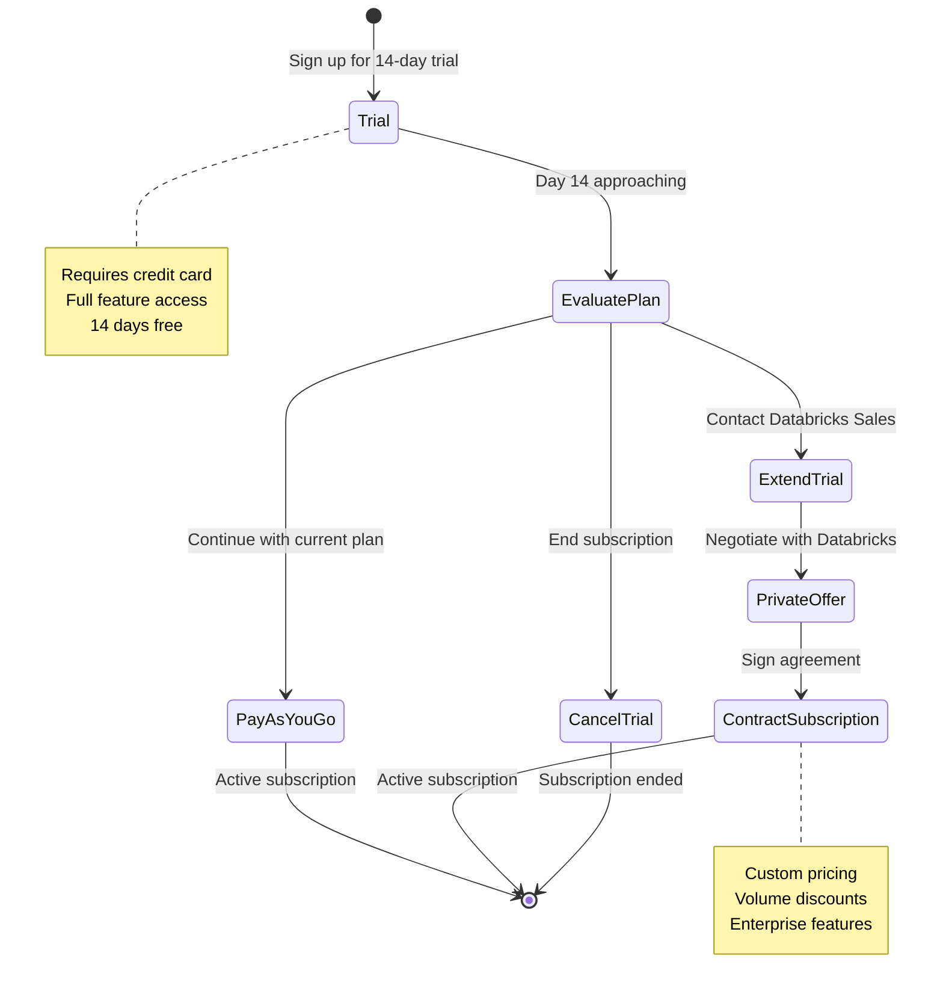
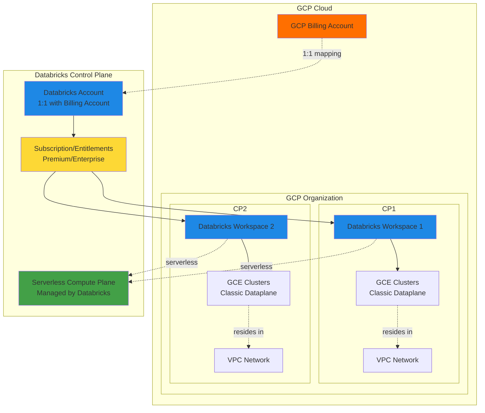
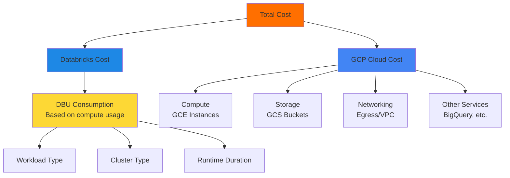
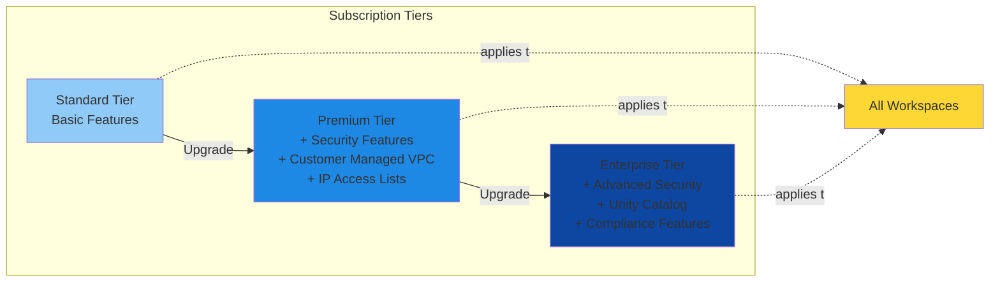
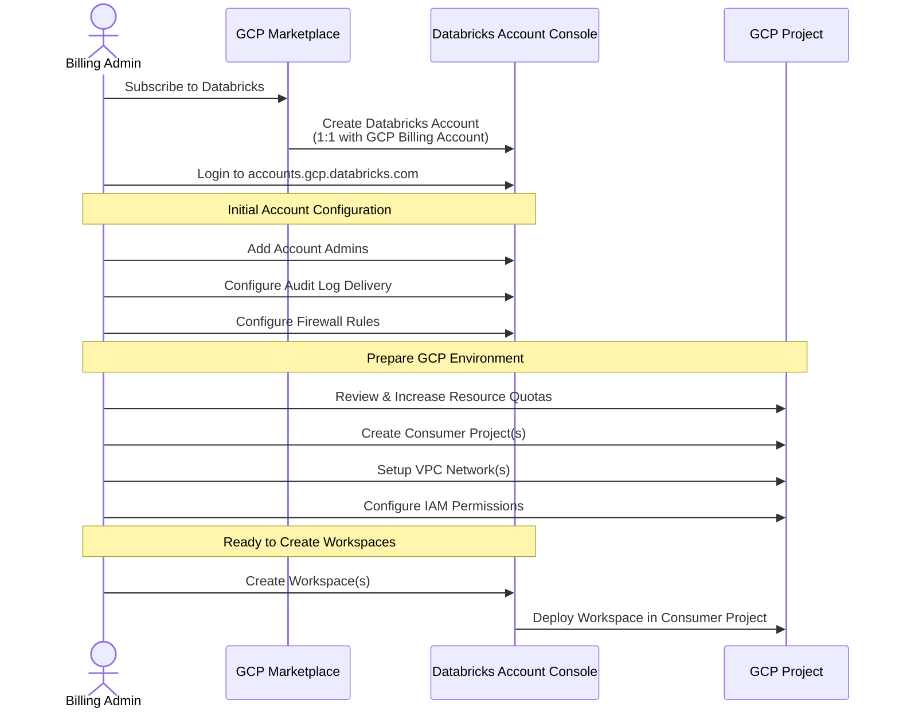
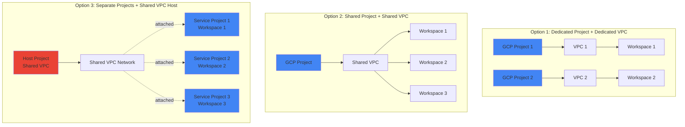
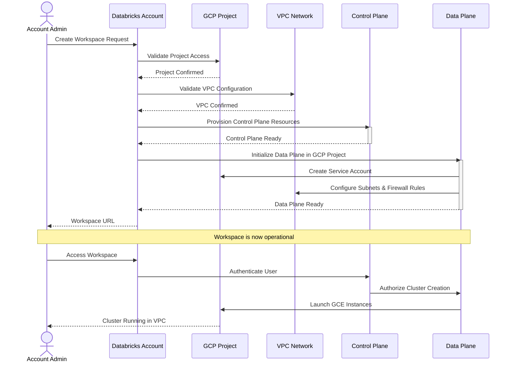

## Consuming Databricks on GCP
Databricks service is available as a GCP market place offering and the unit of deployment is called a [`workspace`](https://docs.gcp.databricks.com/getting-started/concepts.html#workspace), from here onwards we'll be using `workspace` to refer to databricks service through out this guide.

Databricks is a `Managed Service` and is fully hosted, managed, and supported by the Databricks. Although you register with the Databricks to use the service, Google handles all billing.

## Try Databricks
* Trying databricks in an individual capacity? here's your 14 days free [trial](https://docs.gcp.databricks.com/getting-started/try-databricks-gcp.html) Please note that free trial requires credit card and the trial is converted to a pay-as-you-go subscription after 14 days.
* If your company has a contract subscription in place with GCP, you have two options:
  *  start the free trial and at the end of trial become a pay-as-you-go customer or end the trial.
  *  have a need to extend the trial then reach out to your databricks representative or send an email to `sales@databricks.com` about how to create/extend your subscription with a Google Marketplace Private Offer.
*  At the end of the trial, you are automatically subscribed to the plan that you have been on during the free trial. You can cancel your subscription at any time.

### Trial to Production Journey

## Databricks to GCP mapping

| Databricks  | Relationship  | GCP  |
|---|---|---|
| Account  |  1:1 maps to | [Billing Account](https://cloud.google.com/billing/docs/concepts#overview)  |
| Subscription | maps to | *Entitlements |
| Workspaces | resides in | [Consumer Project](https://cloud.google.com/resource-manager/docs/creating-managing-projects) |
| Worker Environment (**classic dataplane) | maps to | Google Compute Engine based databricks cluster |
| Databricks Serverless | maps to | [Serverless compute resources running in the serverless compute plane, which is managed by Databricks](https://docs.gcp.databricks.com/en/security/network/serverless-network-security/index.html#serverless-compute-plane-networking-overview) |

- *Represents purchase, pricing, and payment mechanism for an account
- **Compute resources resides within your GCP Project and utilizes your own VPC

### Architecture Overview

## Availability Regions

Please refer to public doc site for [supported regions](https://docs.gcp.databricks.com/administration-guide/cloud-configurations/gcp/regions.html)

## Things to remember

* Each Databricks account is mapped to one GCP Billing Account (1:1)
* Customer can have more than one account with Databricks
* Subscription is a Databricks concept, it represent various [tiers](https://databricks.com/product/gcp-pricing) available to our customers.
* Subscription tiers dictates workspace features as well [pricing](https://databricks.com/product/gcp-pricing/instance-types)
* Subscription [cost](https://databricks.com/product/pricing) does not include cloud resource cost (storage, compute, network)
* Databricks pricing is based on your compute usage called DBU. Storage, networking and related costs will vary depending on the services you choose and your cloud service provider.
* A Databricks Unit (DBU) is a normalized unit of processing power on the Databricks Lakehouse Platform used for measurement and pricing purposes. The number of DBUs a workload consumes is driven by processing metrics, which may include the compute resources used and the amount of data processed.
* Databricks Unit (DBU), which is a unit of processing capability per hour, billed on per-second usage. See [pricing](https://databricks.com/product/gcp-pricing) for more details.
* Subscription tiers could be upgraded. This applies the upgrade to both current and future workspaces.
* Subscription tier applies at account level so all of the workspace belonging to the account have same features.

### Cost Breakdown

### Subscription Tiers

## Recommendations

* Read thru pricing and subscription tiers details before your begin.
* `Premium` tier includes security features like [Customer Managed VPC](https://docs.gcp.databricks.com/administration-guide/cloud-configurations/gcp/customer-managed-vpc.html) and [IP Access List](https://docs.gcp.databricks.com/security/network/ip-access-list.html) which are are a must have for most of the enterprises and thats what rest of the docs are going to refer to.
* Take advantage of [free training](https://docs.gcp.databricks.com/getting-started/free-training.html) to familiarize yourself with the offering.
* Upon subscribing to Databricks on GCP, make sure to add atleast one more user to the [account](https://accounts.gcp.databricks.com) console and make them [accounts admin](https://docs.gcp.databricks.com/administration-guide/account-settings-gcp/admin-users.html), typicaly someone who's going to manage Databricks, this way we won't need the `billing` admin to create workspaces later on.
* Review and Increase [GCP resource quota](https://docs.gcp.databricks.com/administration-guide/account-settings-gcp/quotas.html) appropiately.
* Configure [audit log](https://docs.gcp.databricks.com/administration-guide/account-settings-gcp/log-delivery.html) delivery, this is an account level feature.
* Configure [domain name](https://docs.gcp.databricks.com/security/network/firewall-rules.html) firewall rules.

### Initial Setup Sequence

## Workspace Deployment Considerations

Workspace deployment is influenced by your organization structure on GCP. Workspace is created within your GCP project utilizing your VPC so there are several options available to us. Taking a cue from the GCP recommendations on [resource hierarchy](https://cloud.google.com/resource-manager/docs/cloud-platform-resource-hierarchy)

 
here we share few options

### Deployment Options Overview

* Option 1:
  * 1:1 mapping between workspace to GCP Project
  * 1:1 mapping between workspace to GCP VPC i.e. dedicated VPC for workspace
  * VPC and Workspace reside in the same GCP Project
  * **Use Case**: Maximum isolation, separate billing, independent lifecycle management

* Option 2:
  * M:1 mapping between workspaces tp GCP Project i.e. Multiple workspaces in a single Project
  * M:1 mapping between workspaces to VPC i.e. multiple workspaces to share a single VPC
  * VPC could be a [Shared VPC](https://cloud.google.com/vpc/docs/shared-vpc) or a non Shared VPC
  * VPC and Workspace reside in the same GCP Project
  * **Use Case**: Cost optimization, simplified networking, team/department consolidation

* Option 3:
  * 1:1 mapping between workspaces tp GCP Project
  * M:1 mapping between workspaces to VPC i.e. multiple workspaces using a single [Shared VPC](https://cloud.google.com/vpc/docs/shared-vpc)
  * VPC and Workspace reside in different GCP Project
  * **Use Case**: Centralized network management, security compliance, multi-project organizations

### Workspace Creation Flow

**We revisit this topic in detail along with VPC and IAM permissions requirements, sizing and automation options in [Workspace Provisioning](/gcpdb4u/Workspace-Provisioning.md) section**
