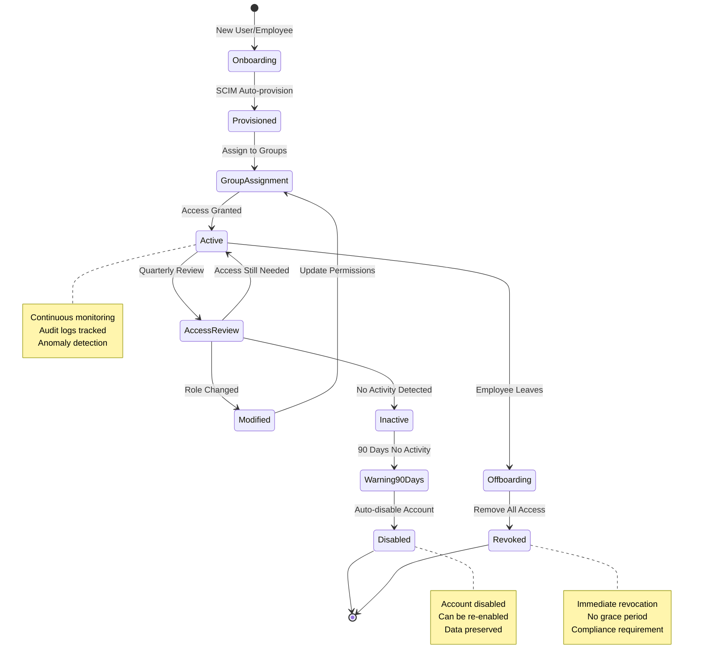

***REMOVED*** Users and Groups Best Practices

This guide provides best practices for managing users and groups in Databricks on Google Cloud, ensuring security, scalability, and efficient administration. Based on the official Databricks documentation: [Users and Groups Best Practices](https://docs.databricks.com/gcp/en/admin/users-groups/best-practices).

***REMOVED******REMOVED*** Identity Management Architecture

```mermaid
graph TB
    subgraph "Identity Provider"
        IDP[Google Cloud Identity<br/>or External IdP]
        SCIM[SCIM Provisioning<br/>Automated Sync]
        SSO[Single Sign-On<br/>SAML/OIDC]
    end
    
    subgraph "Databricks Account"
        ACCT[Account Console]
        USERS[Users]
        GROUPS[Groups]
        SP[Service Principals<br/>For Automation]
    end
    
    subgraph "Access Control"
        WS_ACCESS[Workspace Access]
        CLUSTER_ACCESS[Cluster Permissions]
        DATA_ACCESS[Data Permissions<br/>Unity Catalog]
        JOB_ACCESS[Job Permissions]
    end
    
    subgraph "Audit & Compliance"
        AUDIT[Audit Logs]
        REVIEW[Access Reviews]
        REVOKE[Auto-Revocation<br/>Inactive Users]
    end
    
    IDP --> SCIM
    SCIM --> USERS
    SCIM --> GROUPS
    SSO --> ACCT
    
    USERS --> GROUPS
    GROUPS --> WS_ACCESS
    GROUPS --> CLUSTER_ACCESS
    GROUPS --> DATA_ACCESS
    GROUPS --> JOB_ACCESS
    
    SP --> JOB_ACCESS
    
    WS_ACCESS --> AUDIT
    DATA_ACCESS --> AUDIT
    AUDIT --> REVIEW
    REVIEW --> REVOKE
    
    style IDP fill:***REMOVED***4285F4
    style SCIM fill:***REMOVED***43A047
    style GROUPS fill:***REMOVED***1E88E5
    style SP fill:***REMOVED***FF6F00
    style AUDIT fill:***REMOVED***8E24AA
```

***REMOVED******REMOVED*** Table of Contents
1. [Use Identity Federation](***REMOVED***use-identity-federation)
2. [Follow Least Privilege Access](***REMOVED***follow-least-privilege-access)
3. [Use Groups for Role-Based Access Control](***REMOVED***use-groups-for-role-based-access-control)
4. [Manage Service Principals for Automation](***REMOVED***manage-service-principals-for-automation)
5. [Audit and Monitor Access](***REMOVED***audit-and-monitor-access)
6. [Review and Revoke Unused Access](***REMOVED***review-and-revoke-unused-access)

***REMOVED******REMOVED*** Use Identity Federation
- Utilize **Google Cloud Identity** or **SCIM provisioning** to centrally manage users.
- Enable **single sign-on (SSO)** for streamlined authentication.
- Reference: [Databricks Identity Federation](https://docs.databricks.com/gcp/en/admin/users-groups/scim.html).

***REMOVED******REMOVED*** Follow Least Privilege Access
- Assign only necessary permissions to users to limit security risks.
- Use predefined **Databricks workspace permissions** (e.g., Admin, User, Viewer).
- Regularly review and remove excessive permissions.

***REMOVED******REMOVED*** Use Groups for Role-Based Access Control
- Create **groups** in Databricks and assign permissions at the group level rather than individual users.
- Align groups with **project teams** or **functional roles**.
- Assign workspace and cluster access based on the principle of least privilege.

***REMOVED******REMOVED*** Role-Based Access Control (RBAC) Model

```mermaid
graph TB
    subgraph "User Groups"
        DATA_ENG[Data Engineers Group]
        DATA_SCI[Data Scientists Group]
        DATA_ANAL[Data Analysts Group]
        ADMIN[Admins Group]
    end
    
    subgraph "Workspace Permissions"
        WS_ADMIN[Workspace Admin<br/>Full Control]
        WS_USER[Workspace User<br/>Standard Access]
        WS_VIEW[Workspace Viewer<br/>Read-only]
    end
    
    subgraph "Cluster Permissions"
        CLUSTER_CREATE[Can Create Clusters]
        CLUSTER_RESTART[Can Restart Clusters]
        CLUSTER_ATTACH[Can Attach to Clusters]
    end
    
    subgraph "Data Permissions"
        UC_ADMIN[Unity Catalog Admin<br/>Manage Catalogs]
        DATA_OWNER[Data Owner<br/>Full Table Access]
        DATA_READ[Data Reader<br/>SELECT Only]
    end
    
    ADMIN --> WS_ADMIN
    ADMIN --> CLUSTER_CREATE
    ADMIN --> UC_ADMIN
    
    DATA_ENG --> WS_USER
    DATA_ENG --> CLUSTER_CREATE
    DATA_ENG --> DATA_OWNER
    
    DATA_SCI --> WS_USER
    DATA_SCI --> CLUSTER_ATTACH
    DATA_SCI --> DATA_READ
    
    DATA_ANAL --> WS_VIEW
    DATA_ANAL --> CLUSTER_ATTACH
    DATA_ANAL --> DATA_READ
    
    style ADMIN fill:***REMOVED***E53935
    style DATA_ENG fill:***REMOVED***1E88E5
    style DATA_SCI fill:***REMOVED***43A047
    style DATA_ANAL fill:***REMOVED***FF6F00
    style WS_ADMIN fill:***REMOVED***FDD835
```

***REMOVED******REMOVED*** Manage Service Principals for Automation
- Use **service principals** instead of personal accounts for automated jobs and API access.
- Assign appropriate permissions to service principals without unnecessary admin rights.
- Reference: [Manage Service Principals](https://docs.databricks.com/gcp/en/admin/users-groups/service-principals.html).

***REMOVED******REMOVED*** Service Principal Usage Flow

```mermaid
sequenceDiagram
    participant Admin
    participant ACCT as Account Console
    participant SP as Service Principal
    participant JOB as Databricks Job
    participant API as Databricks API
    participant DATA as Data Sources
    
    Admin->>ACCT: Create Service Principal
    ACCT-->>SP: SP Created with Client ID
    
    Admin->>SP: Generate Access Token
    SP-->>Admin: Token (expires in N days)
    
    Admin->>SP: Assign Permissions<br/>(Job runner, Data access)
    
    Note over SP,JOB: Automated Job Execution
    
    JOB->>SP: Authenticate with Token
    SP->>ACCT: Validate Token
    ACCT-->>SP: Token Valid
    SP->>JOB: Authorization Granted
    JOB->>DATA: Access Data<br/>(via SP permissions)
    DATA-->>JOB: Data Returned
    
    Note over API: API Access
    
    API->>SP: API Call with Token
    SP->>ACCT: Validate & Authorize
    ACCT-->>API: Request Completed
    
    Note over Admin,SP: Best Practices:<br/>- Rotate tokens regularly<br/>- Use least privilege<br/>- One SP per application
    
    style SP fill:***REMOVED***FF6F00
    style JOB fill:***REMOVED***1E88E5
    style ACCT fill:***REMOVED***43A047
```

***REMOVED******REMOVED*** Audit and Monitor Access
- Regularly check **audit logs** to monitor access patterns and potential security risks.
- Use **Databricks system tables** to track user activity.
- Reference: [Audit Logging](https://docs.databricks.com/gcp/en/admin/account-settings/audit-logs.html).

***REMOVED******REMOVED*** Review and Revoke Unused Access
- Periodically review user access and **disable inactive users**.
- Revoke access from employees who leave or change roles.
- Use automated scripts to enforce access reviews.

***REMOVED******REMOVED*** Access Lifecycle Management



***REMOVED******REMOVED*** Audit Monitoring Dashboard

```mermaid
graph TB
    subgraph "Audit Data Sources"
        LOGS[Audit Logs<br/>Account & Workspace]
        SYS[System Tables<br/>system.access.*]
        GCS[GCS Audit Logs<br/>Storage Access]
    end
    
    subgraph "Monitoring Activities"
        LOGIN[Login Attempts<br/>Success/Failure]
        PERM[Permission Changes<br/>Grants/Revokes]
        DATA[Data Access<br/>Table Queries]
        API[API Calls<br/>Automation Activity]
    end
    
    subgraph "Alerting"
        ANOM[Anomaly Detection<br/>Unusual Patterns]
        FAILED[Failed Access<br/>Multiple Attempts]
        PRIVESC[Privilege Escalation<br/>Admin Changes]
        EXFIL[Data Exfiltration<br/>Large Exports]
    end
    
    subgraph "Actions"
        NOTIFY[Notify Security Team]
        SUSPEND[Suspend Account]
        REVIEW[Trigger Review]
        TICKET[Create Incident Ticket]
    end
    
    LOGS --> LOGIN
    LOGS --> PERM
    SYS --> DATA
    SYS --> API
    GCS --> DATA
    
    LOGIN --> FAILED
    PERM --> PRIVESC
    DATA --> EXFIL
    API --> ANOM
    
    ANOM --> NOTIFY
    FAILED --> SUSPEND
    PRIVESC --> REVIEW
    EXFIL --> TICKET
    
    style LOGS fill:***REMOVED***1E88E5
    style ANOM fill:***REMOVED***FF6F00
    style FAILED fill:***REMOVED***E53935
    style PRIVESC fill:***REMOVED***E53935
    style EXFIL fill:***REMOVED***E53935
    style NOTIFY fill:***REMOVED***FDD835
```

For more details, refer to the official [Databricks Users and Groups Best Practices](https://docs.databricks.com/gcp/en/admin/users-groups/best-practices).

---
Following these best practices ensures secure and efficient user and group management in Databricks on Google Cloud.
