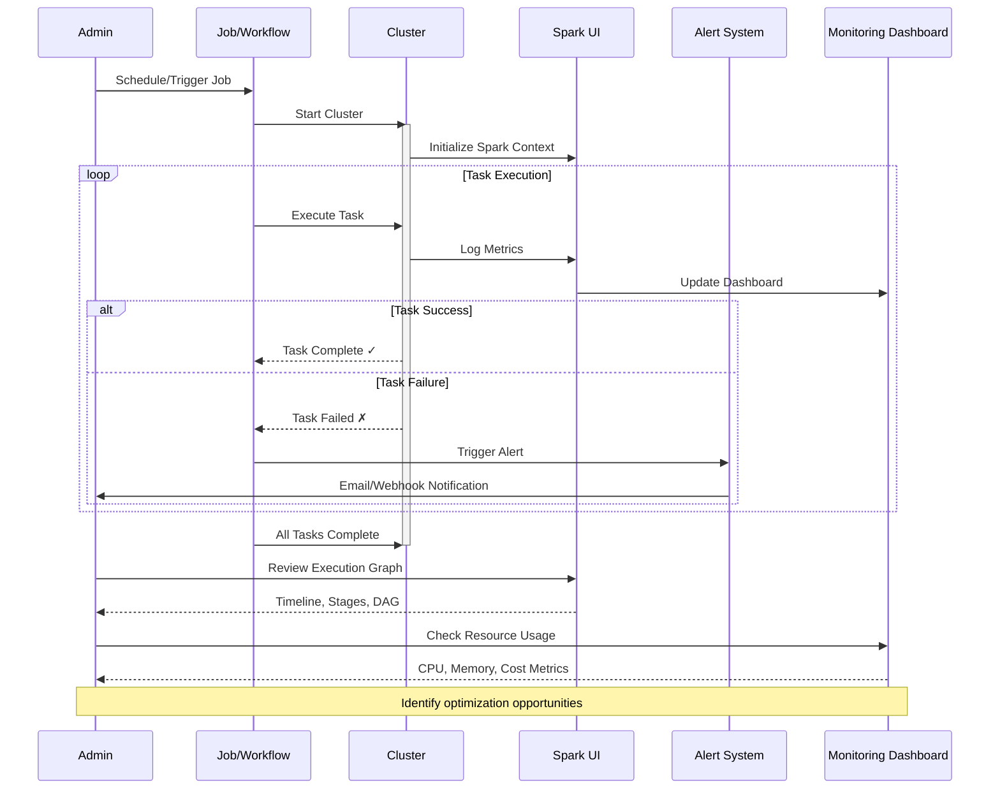

***REMOVED*** Jobs Monitoring Guide

This guide provides best practices for monitoring jobs in Databricks on Google Cloud, ensuring efficient troubleshooting, performance optimization, and cost control. Based on the official Databricks documentation: [Monitor Databricks Jobs](https://docs.databricks.com/gcp/en/jobs/monitor).

***REMOVED******REMOVED*** Observability Architecture

```mermaid
graph TB
    subgraph "Data Sources"
        JOBS[Jobs & Workflows]
        CLUSTER[Clusters]
        QUERIES[SQL Queries]
        NOTEBOOKS[Notebooks]
    end
    
    subgraph "Monitoring Tools"
        UI[Jobs UI<br/>Run History]
        SPARK_UI[Spark UI<br/>Execution Details]
        GANGLIA[Ganglia Metrics<br/>Resource Usage]
        LOGS[Cluster Logs<br/>Driver & Executors]
    end
    
    subgraph "Alerting & Analysis"
        ALERTS[Databricks Alerts<br/>Failure Notifications]
        EMAIL[Email/Webhook<br/>Notifications]
        DASH[Usage Dashboard<br/>Cost Tracking]
        API[REST API<br/>Programmatic Access]
    end
    
    subgraph "Performance Optimization"
        BOTTLENECK[Bottleneck Detection]
        CACHE[Caching Strategy]
        PARTITION[Data Partitioning]
        TUNING[Cluster Tuning]
    end
    
    JOBS --> UI
    CLUSTER --> SPARK_UI
    CLUSTER --> GANGLIA
    CLUSTER --> LOGS
    QUERIES --> SPARK_UI
    NOTEBOOKS --> UI
    
    UI --> ALERTS
    ALERTS --> EMAIL
    UI --> DASH
    API --> DASH
    
    SPARK_UI --> BOTTLENECK
    GANGLIA --> BOTTLENECK
    BOTTLENECK --> CACHE
    BOTTLENECK --> PARTITION
    BOTTLENECK --> TUNING
    
    style UI fill:***REMOVED***1E88E5
    style SPARK_UI fill:***REMOVED***1E88E5
    style ALERTS fill:***REMOVED***FF6F00
    style DASH fill:***REMOVED***43A047
    style BOTTLENECK fill:***REMOVED***E53935
```

***REMOVED******REMOVED*** Table of Contents
1. [View Job Runs](***REMOVED***view-job-runs)
2. [Monitor Job Run Details](***REMOVED***monitor-job-run-details)
3. [Set Up Alerts](***REMOVED***set-up-alerts)
4. [Analyze Job Performance](***REMOVED***analyze-job-performance)
5. [Monitor Job Costs](***REMOVED***monitor-job-costs)
6. [Use REST API for Monitoring](***REMOVED***use-rest-api-for-monitoring)

***REMOVED******REMOVED*** View Job Runs
- Access job run history via the **Jobs UI** in Databricks.
- Navigate to **Workflows > Jobs** to see scheduled and manual job runs.
- Filter job runs based on **status, start time, duration, and cluster used**.
- Reference: [Jobs UI](https://docs.databricks.com/gcp/en/jobs/index.html***REMOVED***jobs-ui).

***REMOVED******REMOVED*** Monitor Job Run Details
- Click on a specific job run to view logs, execution graphs, and detailed metrics.
- Review the **task execution timeline** to identify bottlenecks.
- Use **cluster logs** and **Spark UI** to debug failures.
- Reference: [Spark UI](https://docs.databricks.com/gcp/en/clusters/spark-ui.html).

***REMOVED******REMOVED*** Set Up Alerts
- Enable **failure notifications** via email or webhooks in job settings.
- Use **Databricks Alerts** to trigger actions when jobs meet specific conditions.
- Configure alerts in the **Jobs UI** under the **Notifications** tab.
- Reference: [Databricks Alerts](https://docs.databricks.com/gcp/en/alerts/index.html).

***REMOVED******REMOVED*** Job Monitoring Workflow



***REMOVED******REMOVED*** Analyze Job Performance
- Use **Ganglia Metrics** and **Spark UI** to analyze resource usage.
- Optimize job execution by tuning cluster settings, caching, and parallelism.
- Identify long-running tasks and optimize data partitioning.
- Reference: [Performance Tuning](https://docs.databricks.com/gcp/en/clusters/performance.html).

***REMOVED******REMOVED*** Monitor Job Costs
- Use the **Usage Dashboard** to track compute and storage costs.
- Identify high-cost jobs and optimize resource allocation.
- Enable **job-level tagging** to track costs by project or team.
- Reference: [Databricks Usage Dashboard](https://docs.databricks.com/gcp/en/admin/account-settings/usage.html).

***REMOVED******REMOVED*** Performance Troubleshooting Decision Tree

```mermaid
graph TB
    START[Job Performance Issue]
    
    START --> CHECK1{Job<br/>Completing?}
    CHECK1 -->|No - Fails| FAIL_CHECK{Error Type?}
    CHECK1 -->|Yes - Slow| PERF_CHECK{Performance<br/>Bottleneck?}
    
    FAIL_CHECK -->|OOM Error| MEM_ISSUE[Memory Issue<br/>- Increase driver/executor memory<br/>- Reduce partition size<br/>- Enable spill to disk]
    FAIL_CHECK -->|Timeout| TIME_ISSUE[Timeout Issue<br/>- Increase cluster size<br/>- Optimize query<br/>- Check data skew]
    FAIL_CHECK -->|Network| NET_ISSUE[Network Issue<br/>- Check VPC connectivity<br/>- Verify NAT/firewall<br/>- Check data source access]
    
    PERF_CHECK -->|Shuffle Heavy| SHUFFLE[Shuffle Optimization<br/>- Increase shuffle partitions<br/>- Use broadcast joins<br/>- Repartition data]
    PERF_CHECK -->|I/O Bound| IO[I/O Optimization<br/>- Enable Delta cache<br/>- Use columnar formats<br/>- Partition pruning]
    PERF_CHECK -->|CPU Bound| CPU[CPU Optimization<br/>- Add more workers<br/>- Use better instance types<br/>- Parallelize operations]
    
    MEM_ISSUE --> SPARK_UI[Review Spark UI<br/>- Stage details<br/>- Executor metrics<br/>- Storage tab]
    TIME_ISSUE --> SPARK_UI
    NET_ISSUE --> LOGS[Review Logs<br/>- Driver logs<br/>- Executor logs<br/>- Network traces]
    
    SHUFFLE --> GANGLIA[Monitor Ganglia<br/>- Network I/O<br/>- Disk usage<br/>- CPU utilization]
    IO --> GANGLIA
    CPU --> GANGLIA
    
    SPARK_UI --> FIX[Apply Fix]
    LOGS --> FIX
    GANGLIA --> FIX
    FIX --> TEST[Test & Validate]
    TEST --> END[Performance Improved ✓]
    
    style START fill:***REMOVED***FF6F00
    style MEM_ISSUE fill:***REMOVED***E53935
    style TIME_ISSUE fill:***REMOVED***E53935
    style NET_ISSUE fill:***REMOVED***E53935
    style SPARK_UI fill:***REMOVED***1E88E5
    style GANGLIA fill:***REMOVED***1E88E5
    style END fill:***REMOVED***43A047
```

***REMOVED******REMOVED*** Use REST API for Monitoring
- Retrieve job run details programmatically using the Databricks Jobs API.
- Automate monitoring by integrating with external dashboards or alerting systems.
- API Example: 
  ```bash
  curl -X GET https://<databricks-instance>/api/2.1/jobs/runs/list \
       -H "Authorization: Bearer <your-token>"
  ```
- Reference: [Databricks Jobs API](https://docs.databricks.com/api/workspace/jobs).

***REMOVED******REMOVED*** API-Driven Monitoring Integration

```mermaid
graph TB
    subgraph "Databricks"
        DB_API[Databricks REST API]
        JOBS_API[Jobs API<br/>/api/2.1/jobs/runs/list]
        CLUSTER_API[Clusters API<br/>/api/2.1/clusters/list]
        METRICS_API[Metrics API<br/>system.billing.*]
    end
    
    subgraph "External Monitoring Tools"
        PROM[Prometheus<br/>Metrics Collection]
        GRAFANA[Grafana<br/>Visualization]
        DATADOG[Datadog<br/>APM]
        SPLUNK[Splunk<br/>Log Analysis]
    end
    
    subgraph "Custom Integration"
        SCRIPT[Python/Shell Scripts<br/>Scheduled Polling]
        LAMBDA[Cloud Functions<br/>Event-driven]
        AIRFLOW[Apache Airflow<br/>Workflow Integration]
    end
    
    subgraph "Alerting Platforms"
        PAGER[PagerDuty<br/>Incident Management]
        SLACK[Slack<br/>Team Notifications]
        EMAIL[Email<br/>Alert Delivery]
    end
    
    DB_API --> JOBS_API
    DB_API --> CLUSTER_API
    DB_API --> METRICS_API
    
    JOBS_API --> SCRIPT
    CLUSTER_API --> SCRIPT
    METRICS_API --> PROM
    
    SCRIPT --> LAMBDA
    SCRIPT --> AIRFLOW
    
    PROM --> GRAFANA
    JOBS_API --> DATADOG
    CLUSTER_API --> SPLUNK
    
    GRAFANA --> PAGER
    DATADOG --> SLACK
    SPLUNK --> EMAIL
    
    style DB_API fill:***REMOVED***1E88E5
    style JOBS_API fill:***REMOVED***1E88E5
    style GRAFANA fill:***REMOVED***43A047
    style PROM fill:***REMOVED***43A047
    style PAGER fill:***REMOVED***FF6F00
    style SLACK fill:***REMOVED***FF6F00
```

***REMOVED******REMOVED*** Comprehensive Monitoring Strategy

```mermaid
graph LR
    subgraph "Level 1: Real-time Monitoring"
        RT1[Jobs UI Dashboard<br/>Active job tracking]
        RT2[Spark UI<br/>Live execution view]
        RT3[Ganglia<br/>Resource metrics]
    end
    
    subgraph "Level 2: Historical Analysis"
        H1[System Tables<br/>SQL queries]
        H2[Usage Dashboard<br/>Trends & patterns]
        H3[Audit Logs<br/>Security events]
    end
    
    subgraph "Level 3: Proactive Alerts"
        A1[Job Failure Alerts<br/>Immediate notification]
        A2[Budget Alerts<br/>Cost thresholds]
        A3[Performance Alerts<br/>SLA violations]
    end
    
    subgraph "Level 4: Optimization"
        O1[Performance Tuning<br/>Based on insights]
        O2[Cost Optimization<br/>Resource right-sizing]
        O3[Automation<br/>Self-healing]
    end
    
    RT1 --> H1
    RT2 --> H1
    RT3 --> H1
    
    H1 --> A1
    H2 --> A2
    H3 --> A3
    
    A1 --> O1
    A2 --> O2
    A3 --> O3
    
    style RT1 fill:***REMOVED***1E88E5
    style RT2 fill:***REMOVED***1E88E5
    style RT3 fill:***REMOVED***1E88E5
    style A1 fill:***REMOVED***FF6F00
    style A2 fill:***REMOVED***FF6F00
    style A3 fill:***REMOVED***FF6F00
    style O1 fill:***REMOVED***43A047
    style O2 fill:***REMOVED***43A047
    style O3 fill:***REMOVED***43A047
```

For more details, refer to the official [Databricks Jobs Monitoring Documentation](https://docs.databricks.com/gcp/en/jobs/monitor).

---
Following these best practices ensures reliable job execution, proactive troubleshooting, and optimized performance in Databricks on Google Cloud.
