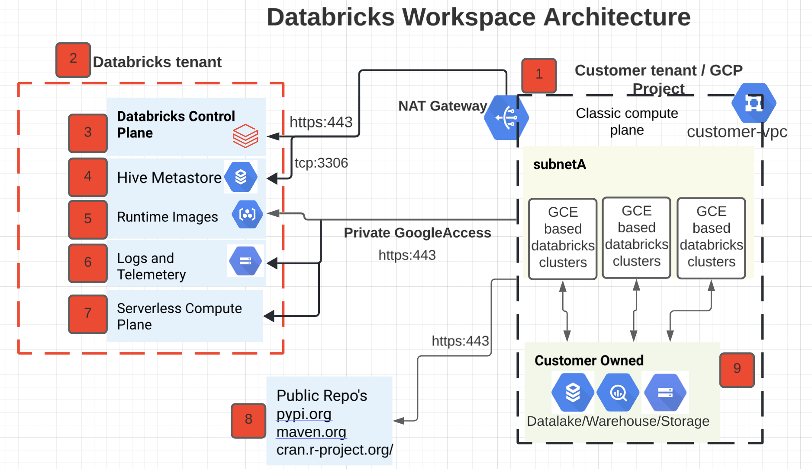

***REMOVED*** Workspace Architecture

From [here](https://docs.gcp.databricks.com/getting-started/overview.html***REMOVED***high-level-architecture): Databricks is built on GCP and operates out of a `control plane` and a `data plane`.

The `control plane` includes the backend services that Databricks manages in its own Google Cloud account. Notebook commands and many other workspace configurations are stored in the control plane and encrypted at rest.

The `data plane` is managed by `your` Google Cloud account and is where `your data resides`. This is also where `data is processed`. You can use Databricks [connectors](https://docs.gcp.databricks.com/data/data-sources/index.html) so that your databricks clusters can `connect to data sources` to ingest data or for storage. You can also ingest data from external streaming data sources, such as events data, streaming data, IoT data, and more.

The following diagram represents the flow of data for Databricks on Google Cloud:

*As the `data plane` resides within customers GCP project it is important to understand what gets created within your project*

Assuming you have gone through the [getting started section](Infrastructure-Planning.md) and have subscribed to databricks offering on GCP, `workspace` creation involves:

* GKE cluster is created utilizng customer managed VPC
* Two GCS buckets are created for [Databricks File System](https://docs.gcp.databricks.com/data/databricks-file-system.html) or DBFS

Next we'll zoom into the data plane architecture.

***REMOVED*** High-Level Communication flow between control plane and data plane

***REMOVED******REMOVED*** Things to remember

* This communication pattern is called [Secure Cluster Connectivity](https://docs.gcp.databricks.com/security/secure-cluster-connectivity.html) and is enabled by default.
* No public IP addresses on cluster nodes, by default: By default databricks creates a private GKE cluster, which means that there are no public IP addresses for cluster nodes.
* The secure cluster connectivity relay: Databricks Clusters initiate a connection to the control plane secure cluster connectivity relay during cluster creation.

***REMOVED*** Detailed Deployment Architecture

1. GKE resides within your project and it utilizes your vpc **[1]**
   * Per GKE we need [3 subnets](https://docs.gcp.databricks.com/administration-guide/cloud-configurations/gcp/network-sizing.html):
     * Primary/Node Subnet
     * Secondary1/Pod Subnet
     * Secondary2/Service Subnet
   * Each [Databricks cluster](https://docs.gcp.databricks.com/clusters/index.html) maps to a [GKE namespace](https://cloud.google.com/blog/products/containers-kubernetes/kubernetes-best-practices-organizing-with-namespaces), namespace provides cluster isolation, basically Databricks clusters are GKE tenants.
   * To further control network communication between `Pods` in namespaces [network policies](https://cloud.google.com/kubernetes-engine/docs/best-practices/enterprise-multitenancy***REMOVED***network-policies) are created which by default deny traffic across different namespaces.
 
2. GKE VPC is peered to GCP managed Kube Master VPC, which resides in its own VPC with a fixed /28 address space. **[2]**
3. Outbound communication from your vpc to databricks control plane is required. In transit traffic is encrypted using TLS 1.3. *`This is a must have requirement`* **[3]**
4. Outbound communication from your vpc to databricks managed GCR (for container images) and GCS (for workspace diagnostic logs). If Private Google Access is enabled on the VPC then this traffic stays on Google network/backbone. **[4]**
5. There remains one public IP address in your account for GKE control plane, also known as the GKE kube-master, which helps start and manage Databricks Runtime clusters. The kube-master is a part of the Google Cloud default GKE deployment. Its IP address is in your Google Cloud account but not in your data plane VPC. This IP address is managed by GKE and it has a [firewall rule](https://cloud.google.com/kubernetes-engine/docs/how-to/authorized-networks) that allows traffic only from the Databricks control plane.**[5]**
6. Outbound communication from your vpc to databricks managed HIVE Metastore **[6]**
   * optionally you could also bring your own hive metastore
7. Outbound communication to public repositories to download python, r and java libraries **[7]**
   * optionally you could have a local mirror of these public repos and avoid downloading it from public sites.
8. Accessing your data sources (GCS/BQ/PubSub/Any External source) **[8]** 

***REMOVED******REMOVED*** Things to remember
- There is 1:1 mapping between a workspace and a GKE i.e. at most 1 GKE created and managed by Databricks associated with a given workspace.
- By default a [VPC Native Private GKE](https://cloud.google.com/kubernetes-engine/docs/how-to/private-clusters) + [Regional](https://cloud.google.com/kubernetes-engine/docs/how-to/creating-a-regional-cluster) cluster is created.
- GKE cluster is created and managed by Databricks
- Three [GKE nodes](https://docs.gcp.databricks.com/administration-guide/account-settings-gcp/workspaces.html) in Data Plane (running 24/7 while GKE is on).
- Google Cloud charges you an additional per-workspace cost for the GKE cluster that Databricks creates for Databricks infrastructure in your account. As of March 30, 2021, the cost for this GKE cluster is approximately $200/month, prorated to the days in the month that the GKE cluster runs
- The GKE cluster cost applies even if Databricks clusters are idle. To reduce this idle-time cost, Databricks deletes the GKE cluster in your account if no Databricks Runtime clusters are active for five days. Other resources, such as VPC and GCS buckets, remain unchanged. The next time a Databricks Runtime cluster starts, Databricks recreates the GKE cluster, which adds to the initial Databricks Runtime cluster launch time. For an example of how GKE cluster deletion reduces monthly costs, let’s say you used a Databricks Runtime cluster on the first of the month but not again for the rest of the month: your GKE usage would be the five days before the idle timeout takes effect and nothing more, costing approximately $33 for the month.
- Databricks does not support configuration changes to a running GKE cluster. If you customize a GKE cluster configuration after it is created, and that cluster is deleted due to idle timeout, the recreated cluster will not include your customizations.