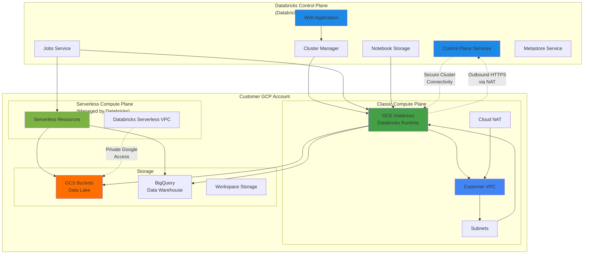
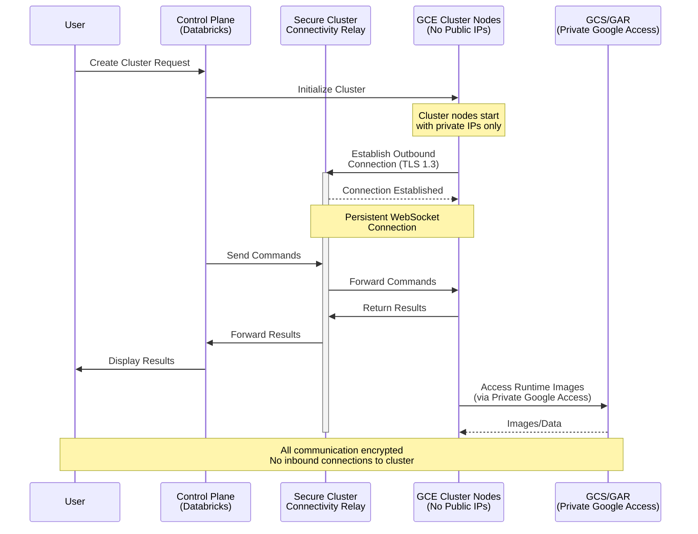
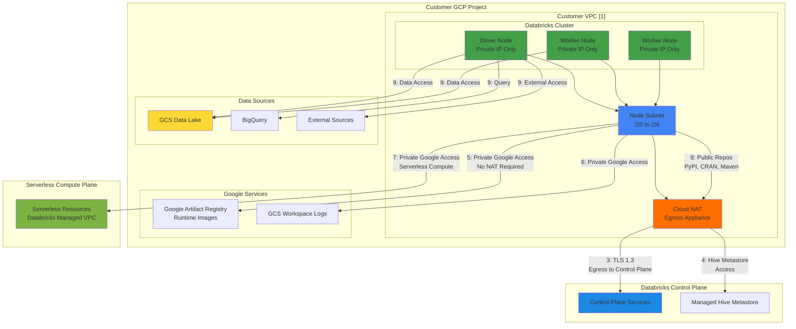

## Workspace Architecture

From [here](https://docs.gcp.databricks.com/getting-started/overview.html#high-level-architecture): Databricks is built on GCP and operates out of a `control plane` and a `compute plane`.

The `control plane` includes the backend services that Databricks manages in its own Google Cloud account. Notebook commands and many other workspace configurations are stored in the control plane and encrypted at rest.

The `compute plane` is where your data is processed. There are `two` types of compute planes depending on the compute that you are using.

For `serverless` compute, the serverless compute resources run in a serverless compute plane in your Databricks account.

For `classic` Databricks compute, the compute resources are in your Google Cloud resources in what is called the classic compute plane. This refers to the network in your Google Cloud resources and its resources.

To learn more about classic compute and serverless compute, see [Types of compute](https://docs.gcp.databricks.com/en/compute/index.html#types-of-compute).

### High-Level Architecture

Before you begin, please make sure to familiarize yourself with
- [Serverless compute plane](https://docs.gcp.databricks.com/en/getting-started/overview.html#serverless-compute-plane)
- [Classic compute plane](https://docs.gcp.databricks.com/en/getting-started/overview.html#classic-compute-plane)
- [Workspace storage buckets](https://docs.gcp.databricks.com/en/getting-started/overview.html#workspace-storage-buckets)
- [Type of compute](https://docs.gcp.databricks.com/en/compute/index.html#compute)
- [Databricks Runtime aka dbr](https://docs.gcp.databricks.com/en/compute/index.html#dbr)
- [DBR versioning](https://docs.gcp.databricks.com/en/compute/index.html#runtime-versioning)
- [Unity catalog](https://docs.gcp.databricks.com/en/data-governance/unity-catalog/index.html)
- [Budget policies](https://docs.gcp.databricks.com/en/admin/account-settings/budgets.html)
- [How to get support](https://docs.gcp.databricks.com/en/resources/support.html)

Next we'll zoom into the compute plane architecture.

## High-Level Communication flow between control plane and [classic compute plane](https://docs.gcp.databricks.com/en/security/network/classic/index.html#classic-compute-plane-networking)

### Secure Cluster Connectivity Architecture

### Things to remember

* This communication pattern is called [Secure Cluster Connectivity](https://docs.gcp.databricks.com/security/secure-cluster-connectivity.html) and is enabled by default.
* No public IP addresses on compute plane nodes(GCE instances)
* The secure cluster connectivity relay: compute plane initiate's a network connection to the control plane (egress) secure cluster connectivity relay during databricks [cluster](https://docs.gcp.databricks.com/en/compute/index.html#compute) creation.

## Detailed Deployment Architecture

### Network Communication Flows

**Network Flow Descriptions:**

1. **Flow 1:** Classic compute plane resides within your project and it utilizes your vpc
   * Per databricks workspace we need [1 subnet](https://docs.gcp.databricks.com/administration-guide/cloud-configurations/gcp/network-sizing.html):
     * Node Subnet
2. **Flow 3:** Outbound or Egress communication from your vpc to databricks control plane is required. Typically this is achieved by attaching an egress appliance like Cloud NAT to your VPC. In transit traffic is encrypted using TLS 1.3. *`Having an egress path to Databricks control plane is a must have requirement`*
3. **Flow 5,6:** Outbound communication from your vpc to databricks managed Google Artifact Registry (for runtime images) and GCS (for workspace diagnostic logs). When [Private Google Access](https://cloud.google.com/vpc/docs/configure-private-google-access) is enabled on the VPC, traffic stays on Google network/backbone and requires no egress appliance like Cloud NAT.
4. **Flow 7:** Serverless compute plane access using [Private Google Access](https://cloud.google.com/vpc/docs/configure-private-google-access). On Serverless compute VPC's PGA is enabled, traffic stays on Google network/backbone and doesnt travel thru internet.
5. **Flow 4:** Outbound communication from your vpc to databricks managed HIVE Metastore
   * optionally you could also bring your [own hive metastore](https://docs.gcp.databricks.com/data/metastores/external-hive-metastore.html)
6. **Flow 8:** Outbound communication to public repositories to download python, r and java libraries
   * optionally you could have a local mirror of these public repos and avoid downloading it from public sites.
7. **Flow 9:** Accessing your data sources (GCS/BQ/PubSub/Any External source) 