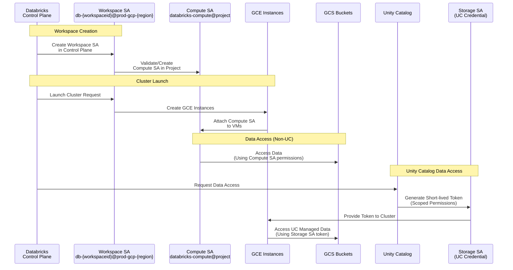
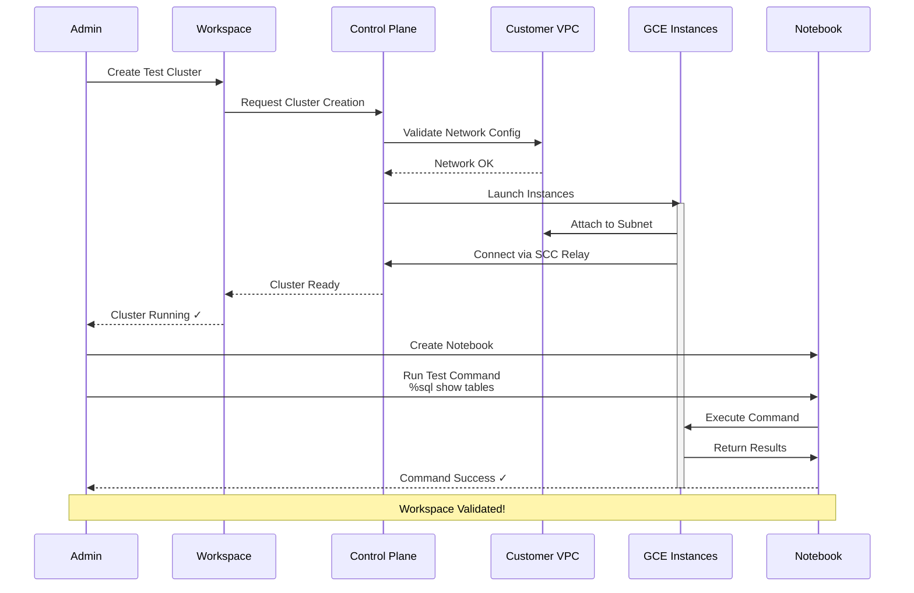

***REMOVED*** Create Databricks Workspace

***REMOVED******REMOVED*** Objective
Create Databricks workspace in a **customer managed VPC**. VPC could be a shared vpc or a customer managed stand alone vpc.

***REMOVED******REMOVED*** Customer Managed VPC Architecture

```mermaid
graph TB
    subgraph "Databricks Account"
        ACCT[Account Console]
        NC[Network Configuration]
    end
    
    subgraph "Customer GCP Project"
        VPC[Customer Managed VPC]
        
        subgraph "VPC Configuration"
            SUBNET[Primary Subnet<br/>/29 to /9]
            FW[Firewall Rules]
            PGA[Private Google Access<br/>Enabled]
            NAT[Cloud NAT<br/>Egress]
        end
        
        subgraph "Databricks Workspace"
            WS[Workspace]
            SA[Compute Service Account<br/>databricks-compute@project]
            CLUSTER[Clusters<br/>GCE Instances]
        end
        
        subgraph "IAM & Policies"
            ORGPOL[Organization Policies]
            IMGPOL[Trusted Image Policy<br/>databricks-external-images]
            AUTHPOL[Storage Auth Policy<br/>SERVICE_ACCOUNT_HMAC]
        end
    end
    
    ACCT --> NC
    NC --> VPC
    VPC --> SUBNET
    VPC --> FW
    VPC --> PGA
    VPC --> NAT
    
    NC --> WS
    WS --> SA
    WS --> CLUSTER
    CLUSTER --> SUBNET
    
    ORGPOL -.validates.-> WS
    IMGPOL -.validates.-> CLUSTER
    AUTHPOL -.validates.-> SA
    
    style ACCT fill:***REMOVED***1E88E5
    style VPC fill:***REMOVED***4285F4
    style WS fill:***REMOVED***1E88E5
    style CLUSTER fill:***REMOVED***43A047
    style ORGPOL fill:***REMOVED***FF6F00
```

***REMOVED******REMOVED*** Before you begin

***REMOVED******REMOVED******REMOVED*** Domain Restricted Sharing
If your Google Cloud organization enables Domain Restricted Sharing Organization Policy, add Google Workspace customer ID for Databricks (C01p0oudw) to your policy’s allowed list. You may override your policy at the project level instead of modifying at the organization level.

For more information, see Restricting identities by [domain](https://cloud.google.com/resource-manager/docs/organization-policy/restricting-domains)

***REMOVED******REMOVED******REMOVED*** Trusted Image Policies
Add `databricks-external-images` to the trusted image policy for the GCP Databricks workspace project

***REMOVED******REMOVED******REMOVED*** Restrict Authentication Types Cloud Storage Policy
Make sure to allow `SERVICE_ACCOUNT_HMAC_SIGNED_REQUESTS` authentication, more details [here](https://cloud.google.com/storage/docs/org-policy-constraints***REMOVED***restrict-auth-types)
 

***REMOVED******REMOVED******REMOVED*** Databricks Related Google Service Accounts(GSA's)

`Workspace SA`: This is created in the Regional Control Plane that is specific to this Workspace is assigned privileges to create and manage resources 
inside the Databricks Compute Plane.  Its email address looks like db-{workspaceid}@prod-gcp-{region}.iam.gserviceaccount.com 

`Compute SA`: Databricks will use a service account in the Compute Plane named `databricks-compute@{workspace-project}.iam.gserviceaccount.com` as the SA attached to every VM launched by Databricks in the GCP project. This GSA could be precreated in the project used by Databricks workspace and in that workspace would automatically use it.

`Storage SAs` (one or more Google Service Accounts) in the Control Plane are used to set up Unity Catalog (UC) Credentials that enable granting access to UC managed  storage in your Projects and in the Compute Plane.  The Storage SA generates a short-lived token and provides it to the Compute cluster process with privileges to access data. Privileges are scoped down to be specific to the requested operation.

***REMOVED******REMOVED*** Service Account Interaction Flow




***REMOVED******REMOVED*** FAQ
* Can I use Terraform to create workspace
  * Yes you can, more details [here](https://registry.terraform.io/providers/databricks/databricks/latest/docs/guides/gcp-workspace).
* How many subnets I need?
  * In total we need 1 subnet
    * Node Subnet 
* Can I share subnets among different databricks workspace's?
  * No, each workspace requires its own dedicated subnet.
* Can I change Subnet address space after the workspace is created?
  * No
* Can I share a VPC among different databricks workspace's?
  * Yes, as long as you do not use existing subnets being used by databricks.
* Supported IP Address Range?
  * `10.0.0.0/8`, `100.64.0.0/10`, `172.16.0.0/12`, `192.168.0.0/16`, and `240.0.0.0/4`
* User/Service Account creating the workspace is automatically added to the workspace as an admin.

***REMOVED******REMOVED*** Quick sizing guideline

| Subnet Size                                                                 | Total Nodes Per Workspace |
|-----------------------------------------------------------------------------|---------------------------|
| Nodes subnet size   /26 |             30            |
| Nodes subnet size   /25 |             60            |
| Nodes subnet size   /24 |            120            |
| Nodes subnet size   /23 |            250            |
| Nodes subnet size   /22 |            500            |
| Nodes subnet size   /21 |            1000           |
| Nodes subnet size   /20 |            2000           |
| Nodes subnet size   /19 |            4000           |

Total Nodes Per Workspace = Total number of concurrent nodes (compute instances) supported by the workspace at a given point in time.

***REMOVED******REMOVED*** Subnet Sizing Visualization

```mermaid
graph LR
    subgraph "Subnet Size Selection"
        S26["/26 CIDR<br/>30 Nodes<br/>Small Dev/Test"]
        S24["/24 CIDR<br/>120 Nodes<br/>Medium Workloads"]
        S22["/22 CIDR<br/>500 Nodes<br/>Large Production"]
        S20["/20 CIDR<br/>2000 Nodes<br/>Enterprise Scale"]
        S19["/19 CIDR<br/>4000 Nodes<br/>Very Large Scale"]
    end
    
    S26 -->|Scale Up| S24
    S24 -->|Scale Up| S22
    S22 -->|Scale Up| S20
    S20 -->|Scale Up| S19
    
    S26 -.cannot resize.-> S26
    
    style S26 fill:***REMOVED***90CAF9
    style S24 fill:***REMOVED***64B5F6
    style S22 fill:***REMOVED***42A5F5
    style S20 fill:***REMOVED***1E88E5
    style S19 fill:***REMOVED***1565C0
```

**Important Note:** Subnet CIDR ranges cannot be changed after workspace creation. Choose carefully based on your expected growth!

***REMOVED******REMOVED*** Subnet CIDR ranges


| Network resource or attribute   | Description      | Range |
|----------|:-------------:|------:|
| Primary subnet |  Classic compute nodes | between /29 to /9 |
| Region | VPC Region |    Workspace and VPC region must match |

***REMOVED******REMOVED*** Recommendation

* Pay close attention to subnet CIDR ranges, they cannot be changed (increase or decrease) after the workspace is created.
* Review and Increase [GCP resource quota](https://docs.gcp.databricks.com/administration-guide/account-settings-gcp/quotas.html) appropiately.
* Use Customer Managed VPC
* Enable [Private Google Access](./security/Configure-PrivateGoogleAccess.md) on your vpc
* Double check DNS is properly configured to resolve to restricted or private and restrcited.googleapis.com correctly (part of private google access configuration)
* Please verify that VPC:
  * For a non PSC workspace: have an egress path to databricks control plane and managed hive metastore, this is typically achieved by attaching a Cloud NAT to your VPC and having an egress route using default gateway.
  * For a PSC enabled workspace: make sure that the private DNS for Databricks is configured properly and has the required A records for fontend and backend PSC endpoints.
* If you have VPC SC configured than please make sure you read through [this](./security/Configure-VPC-SC.md) section.


***REMOVED******REMOVED*** Create Workspace (using UI)
Step by Step [guide](https://docs.gcp.databricks.com/administration-guide/cloud-configurations/gcp/customer-managed-vpc.html)

***REMOVED******REMOVED*** Create Workspace (using Terraform)
Please follow public [documentation](https://registry.terraform.io/providers/databricks/databricks/latest/docs/guides/gcp-workspace). Here's a few sample [TF script](./templates/terraform-scripts/readme.md) to deploy a bring your VPC based workspace using Terraform

* create a [PSC + CMEK enabled workspace and attach a custom SA](./templates/terraform-scripts/byovpc-psc-cmek-ws). Please note that PSC and CMEK is in preview, follow [instructions](https://docs.gcp.databricks.com/administration-guide/cloud-configurations/gcp/private-service-connect.html***REMOVED***step-1-enable-your-account-for-private-service-connect) to sign up for this feature
  
***REMOVED******REMOVED*** Validate setup
- Create a Databricks cluster to validate n/w setup
- Databricks Cluster comes up fine

***REMOVED******REMOVED*** Cluster Validation Flow




* Upon creation of workspace, immediately test it by creating a databricks cluster and run a test command in databricks notebook like:
  ```
  %sql
  show tables
  ```
  make sure that commands runs successfully.


***REMOVED******REMOVED*** Troubleshooting

* Not able to create Network Configuration
  * Follow steps mentioned over [here](https://docs.gcp.databricks.com/administration-guide/cloud-configurations/gcp/customer-managed-vpc.html), pay close attention to required roles and permissions.
  * If VPC SC is configured on the GCP project used by Databricks than please make sure that you have followed steps mentioned over here
* Workspace creation fails
  * Verify that there is no organization policy blocking workspace creation process, please see recommendations section above
  * If VPC SC is configured on the GCP project used by Databricks than please make sure that you have followed steps mentioned over [here](./security/Configure-VPC-SC.md)
  * Verify that you have required role and permissions
* Databricks Cluster Creation fails with:
  ```
  {
  "reason": {
    "code": "DBR_CLUSTER_LAUNCH_TIMEOUT",
    "type": "SERVICE_FAULT",
    "parameters": {
      "databricks_error_message": "Cluster launch timeout."
    }
  }
  }
  ```
  Verify that you have egress/outbound network connectivity from your VPC to Databricks Control plane.
    - Most likely VPC firewall is blocking egress communication
    - You do not have a n/w route set for vpc to communicate with Databricks control plane
    - Make sure an egress appliance like Cloud NAT is attached to subnets used by Databricks

* Databricks Cluster Creation fails with quota errors:
  - Verify that you have adequate GCP resource quota limit set, follow steps mentioned over [here](https://docs.gcp.databricks.com/administration-guide/account-settings-gcp/quotas.html).

***REMOVED******REMOVED*** Common Failure Scenarios

```mermaid
graph TB
    START[Cluster Launch Initiated]
    
    START --> CHECK1{Network<br/>Configuration<br/>Valid?}
    CHECK1 -->|No| FAIL1[Network Config Error<br/>Fix: Verify subnet,<br/>firewall rules]
    CHECK1 -->|Yes| CHECK2{VPC Firewall<br/>Allows Egress?}
    
    CHECK2 -->|No| FAIL2[DBR_CLUSTER_LAUNCH_TIMEOUT<br/>Fix: Allow egress to<br/>Control Plane]
    CHECK2 -->|Yes| CHECK3{Cloud NAT<br/>Attached?}
    
    CHECK3 -->|No| FAIL3[No Internet Access<br/>Fix: Attach Cloud NAT<br/>to VPC subnets]
    CHECK3 -->|Yes| CHECK4{GCP Resource<br/>Quota Available?}
    
    CHECK4 -->|No| FAIL4[Quota Exceeded Error<br/>Fix: Request quota<br/>increase]
    CHECK4 -->|Yes| CHECK5{Organization<br/>Policies OK?}
    
    CHECK5 -->|No| FAIL5[Policy Violation<br/>Fix: Update org policies<br/>or project settings]
    CHECK5 -->|Yes| SUCCESS[Cluster Running ✓]
    
    style START fill:***REMOVED***1E88E5
    style SUCCESS fill:***REMOVED***43A047
    style FAIL1 fill:***REMOVED***E53935
    style FAIL2 fill:***REMOVED***E53935
    style FAIL3 fill:***REMOVED***E53935
    style FAIL4 fill:***REMOVED***E53935
    style FAIL5 fill:***REMOVED***E53935
```

