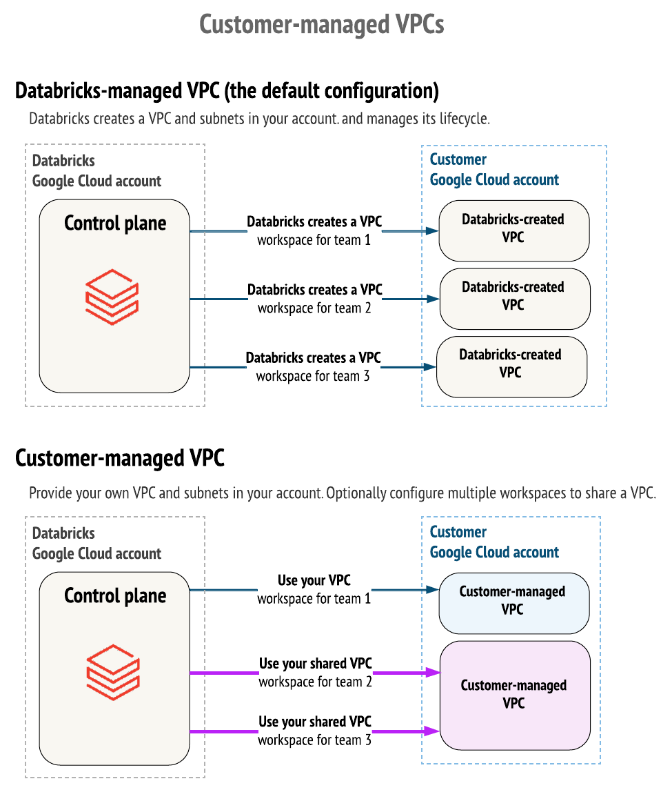
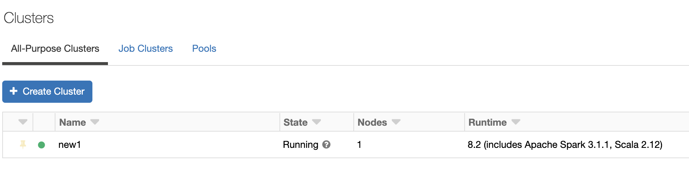
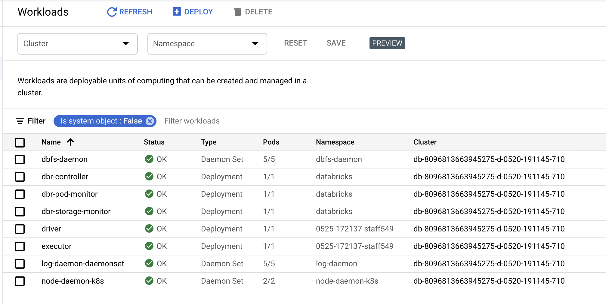
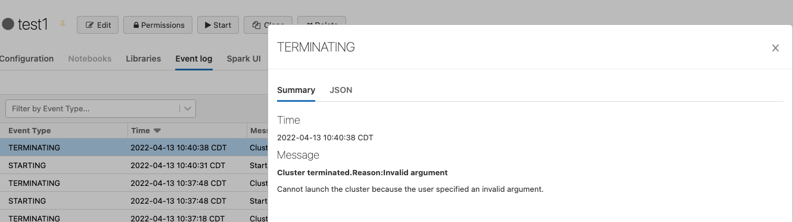
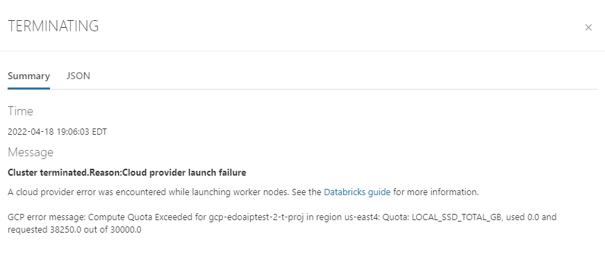

***REMOVED*** Create Databricks Workspace

***REMOVED******REMOVED*** Objective
Create Databricks workspace in a **customer managed VPC**. VPC could be a shared vpc or a customer managed stand alone vpc.


***REMOVED******REMOVED*** FAQ
* Can I use Terraform to create workspace
  * Yes you can, more details [here](https://registry.terraform.io/providers/databricks/databricks/latest/docs/guides/gcp-workspace).
* How many subnets I need?
  * In total we need 1 subnet
    * Node Subnet 
* Can I share subnets among different databricks workspace's?
  * No, each workspace requires its own dedicated subnet.
* Can I change Subnet address space after the workspace is created?
  * No
* Can I share a VPC among different databricks workspace's?
  * Yes, as long as you do not use existing subnets being used by databricks.
* Supported IP Address Range?
  * `10.0.0.0/8`, `100.64.0.0/10`, `172.16.0.0/12`, `192.168.0.0/16`, and `240.0.0.0/4`
* User/Service Account creating the workspace is automatically added to the workspace as an admin.

***REMOVED******REMOVED*** Quick sizing guideline

| Subnet Size                                                                 | Total Nodes Per Workspace |
|-----------------------------------------------------------------------------|---------------------------|
| Nodes subnet size   /25 |             60            |
| Nodes subnet size   /24 |            120            |
| Nodes subnet size   /23 |            250            |
| Nodes subnet size   /22 |            500            |
| Nodes subnet size   /21 |            1000           |
| Nodes subnet size   /20 |            2000           |
| Nodes subnet size   /19 |            4000           |

Total Nodes Per Workspace = Total number of concurrent nodes (compute instances) supported by the workspace at a given point in time.

***REMOVED******REMOVED*** Subnet CIDR ranges


| Network resource or attribute   | Description      | Range |
|----------|:-------------:|------:|
| Primary subnet |  Classic compute nodes | between /29 to /9 |
| Region | VPC Region |    [Workspace and VPC region](https://github.com/bhavink/databricks/blob/master/gcpdb4u/regions.html) must match |

***REMOVED******REMOVED*** Recommendation

* Pay close attention to subnet CIDR ranges, they cannot be changed (increase or decrease) after the workspace is created.
* Review and Increase [GCP resource quota](https://docs.gcp.databricks.com/administration-guide/account-settings-gcp/quotas.html) appropiately.
* Use Customer Managed VPC
* Enable [Private Google Access](./security/Configure-PrivateGoogleAccess.md) on your vpc
* Double check DNS is properly configured to resolve to restricted or private.googleapis.com correctly (part of private google access configuration)
* Please verify that VPC:
  * For a non PSC workspace: has an egress path to databricks control plane and managed hive metastore, this is typically achieved by attaching a Cloud NAT to your VPC.
  * For a PSC enabled workspace: make sure that the private DNS for Databricks is configured properly and has the required A records for fontend and backend PSC endpoints.
* If your Google Cloud organization policy enables domain restricted sharing, ensure that both the Google Cloud customer IDs for Databricks (C01p0oudw) and your own organization’s customer ID are in the policy’s allowed list.
* Please make sure that you are allowed to: 
  * Create GCP resources (GCE/GCS)
  * Enable `Workload Identity` is set to `true`
  * Enable `serial port logging` is set to `true`

* If you have VPC SC configured than please make sure you read through [this](./security/Configure-VPC-SC.md) section.


***REMOVED******REMOVED*** Create Workspace (using UI)
Step by Step [guide](https://docs.gcp.databricks.com/administration-guide/cloud-configurations/gcp/customer-managed-vpc.html)

***REMOVED******REMOVED*** Create Workspace (using Terraform)
Please follow public [documentation](https://registry.terraform.io/providers/databricks/databricks/latest/docs/guides/gcp-workspace). Here's a few sample [TF script](./templates/terraform-scripts/readme.md) to deploy a bring your VPC based workspace using Terraform

* create a [PSC + CMEK enabled workspace and attach a custom SA](./templates/terraform-scripts/byovpc-psc-cmek-ws). Please note that PSC and CMEK is in preview, follow [instructions](https://docs.gcp.databricks.com/administration-guide/cloud-configurations/gcp/private-service-connect.html***REMOVED***step-1-enable-your-account-for-private-service-connect) to sign up for this feature
  
***REMOVED******REMOVED*** Validate setup
- Create a Databricks cluster to validate n/w setup
- Databricks Cluster comes up fine




* Upon creation of workspace, immediately test it by creating a databricks cluster and run a test command in databricks notebook like:
  ```
  %sql
  show tables
  ```
  make sure that commands runs successfully.


***REMOVED******REMOVED*** Troubleshooting

* Not able to create Network Configuration
  * Follow steps mentioned over [here](https://docs.gcp.databricks.com/administration-guide/cloud-configurations/gcp/customer-managed-vpc.html), pay close attention to required roles and permissions.
  * If VPC SC is configured on the GCP project used by Databricks than please make sure that you have followed steps mentioned over here
* Workspace creation fails
  * Verify that there is no organization policy blocking workspace creation process, please see recommendations section above
  * If VPC SC is configured on the GCP project used by Databricks than please make sure that you have followed steps mentioned over [here](./security/Configure-VPC-SC.md)
  * Verify that you have required role and permissions
* Databricks Cluster Creation fails with:
  ```
  {
  "reason": {
    "code": "K8S_DBR_CLUSTER_LAUNCH_TIMEOUT",
    "type": "SERVICE_FAULT",
    "parameters": {
      "databricks_error_message": "Cluster launch timeout."
    }
  }
  }
  ```
  or you see 
  Verify that you have egress/outbound network connectivity from your VPC to Databricks Control plane.
    - Most likely VPC firewall is blocking egress communication
    - You do not have a n/w route set for vpc to communicate with Databricks control plane
    - Make sure an egress appliance like Cloud NAT is attached to subnets used by Databricks

* Databricks Cluster Creation fails with:

  - Verify that you have adequate GCP resource quota limit set, follow steps mentioned over [here](https://docs.gcp.databricks.com/administration-guide/account-settings-gcp/quotas.html).

