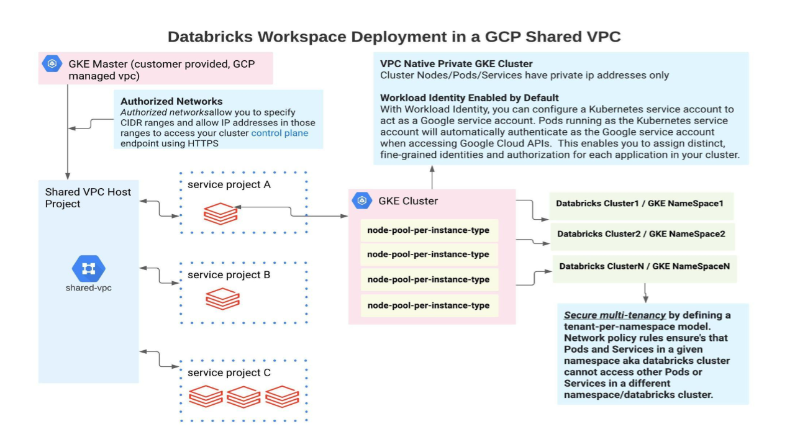

# Objectives
As part of workspace creation process, Databricks creates a GKE cluster with in your GCP Project and utilizes your own VPC. In this section we'll focus on default security controls in place.

* Each workspace is provisioned to a single GKE in the customer's GCP project. On this GKE we spin up [Databricks clusters](https://docs.gcp.databricks.com/clusters/index.html).
* Life cycle of a GKE cluster is managed by Databricks Control Plane.
* Compute instance type aka `node's` used by a Databricks cluster is backed by GKE [node pools](https://cloud.google.com/kubernetes-engine/docs/concepts/node-pools)
* Each node type is backed a GKE node pool
* Node pool's are shared by different Databricks cluster's
* Spark Driver and Executor's are deployed as `pods` inside GKE nodes.
* Nodes have Private IP addresses only
* Spark Driver and Spark Executor runs as a GKE pod.
* Databricks clusters are GKE tenants
  
* To provide a secure logical isolation between tenants that are on the same GKE cluster, Databricks implements [GKE namespace’s](https://cloud.google.com/kubernetes-engine/docs/best-practices/enterprise-multitenancy#create-namespaces).

  * Databricks automatically creates a GKE namespace for each Databricks cluster

  * Follows [guidelines](https://cloud.google.com/kubernetes-engine/docs/best-practices/enterprise-multitenancy#network-policies) provided by GKE

    * To control network communication between Pods in each of your cluster's namespaces [network policies](https://cloud.google.com/kubernetes-engine/docs/best-practices/enterprise-multitenancy#network-policies) are created which by default deny traffic across different namespaces.
    * To securely grant workloads access to Google Cloud services, [Workload Identity](https://cloud.google.com/kubernetes-engine/docs/how-to/workload-identity) is enabled. Workload Identity helps administrators manage Kubernetes service accounts that Kubernetes workloads use to access Google Cloud services.
    * To protect your GKE control plane, restrict access to authorized networks. Databricks by default enable [authorized networks](https://cloud.google.com/kubernetes-engine/docs/how-to/authorized-networks), this way we authorize CIDR ranges and allow IP addresses only in those ranges to access your control plane. GKE already uses Transport Layer Security (TLS) and authentication to provide secure access to your control plane endpoint from the public internet. By using authorized networks, we can further restrict access to specified sets of IP addresses.
  
  

user's could further customize the security settings to suite their needs, for example:

* Make sure GKE created by Databricks follows [CIS guidelines](./security/GKE-CIS-Guidelines.md)
* Customize Default [Compute SA role](./security/Customize-Default-ComputeSA-Role.md)
* Enable [Binary Authorization](./security/Enable-Binary-Authorization.md)
* Enable [Workload Identity](./security/Workload-Identity.md)
* Configure [VPC Service Control](./security/Configure-VPC-SC.md) to prevent data exfiltration
* Lock down [VPC firewall rules](./security/LockDown-VPC-Firewall-Rules.md)
  