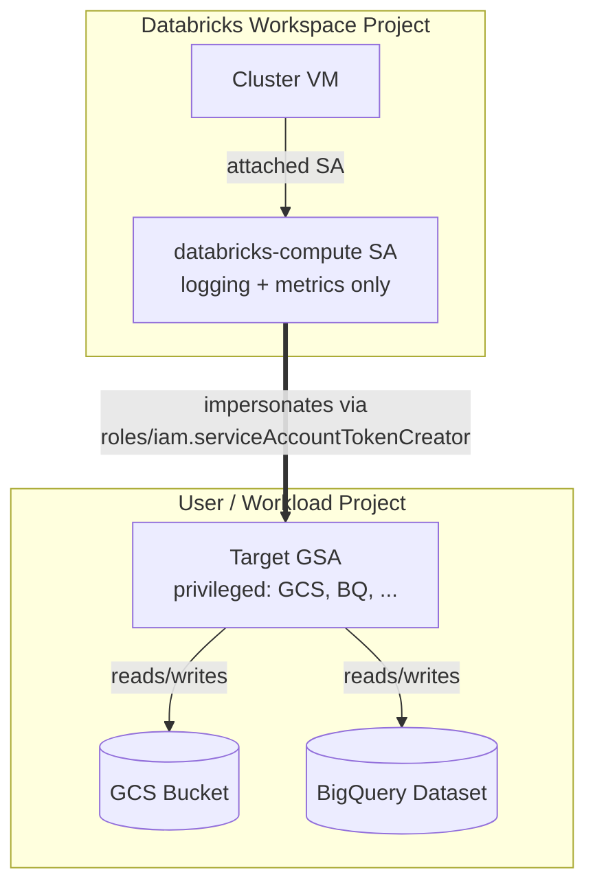
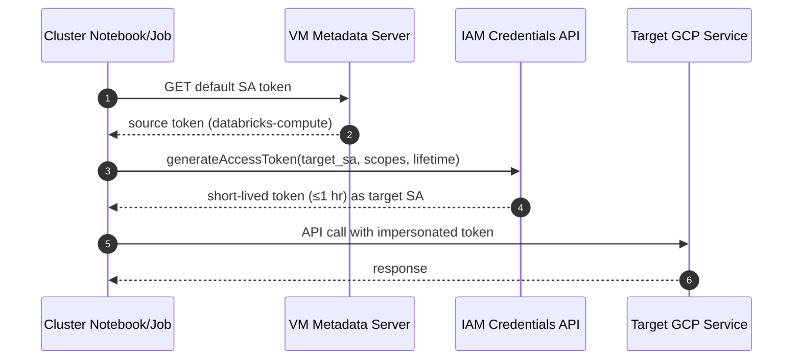

## Short-Lived GCP Tokens via GSA Impersonation

Mint per-call, short-lived (≤1 hour) GCP access tokens on a Databricks cluster, scoped to a privileged Google service account (GSA) the workload owner controls. No key files, no long-lived credentials, full audit trail.

### Why this pattern

At workspace creation, Databricks automatically provisions the `databricks-compute` service account used by all clusters that do not have a custom service account attached. **Out of the box this SA has only the minimal permissions required for logging and metrics** — it cannot read your data, query BigQuery, or write to GCS on its own.

To give a workload access to GCP resources, instead of attaching a privileged SA to the cluster (long-lived, hard to scope per-workload), grant the cluster SA permission to **impersonate** a separate target SA that holds the actual data permissions. The cluster mints a fresh, short-lived token per call.

### Architecture



The `tokenCreator` binding lives on the **target's** IAM policy, not on the source. Each target SA's owner independently authorizes the cluster SA — authorization is per-target, never project-wide.

### Runtime flow



### Prerequisites

**Per workspace (one time)**
- Databricks workspace on GCP — provides the `databricks-compute@<workspace-project>` SA automatically.
- Identify the workspace SA email by running this on any cluster:
  ```bash
  curl -s -H "Metadata-Flavor: Google" \
    http://metadata.google.internal/computeMetadata/v1/instance/service-accounts/default/email
  ```

**Per target SA (per workload owner)**
- A target GSA in the workload project, with whatever GCS, BigQuery, or other roles the workload requires.
- The `iamcredentials.googleapis.com` API enabled in the **target's** project:
  ```bash
  gcloud services enable iamcredentials.googleapis.com --project=<target-project>
  ```
- `google-auth` available on the cluster (preinstalled in Databricks ML runtimes; otherwise `pip install google-auth`).

### Step 1 — Grant the cluster SA permission to impersonate the target

Run from any machine with IAM admin on the **target** project:

```bash
SOURCE_SA="databricks-compute@<workspace-project>.iam.gserviceaccount.com"
TARGET_SA="workload-sa@<target-project>.iam.gserviceaccount.com"

gcloud iam service-accounts add-iam-policy-binding "$TARGET_SA" \
  --member="serviceAccount:$SOURCE_SA" \
  --role="roles/iam.serviceAccountTokenCreator" \
  --project=<target-project>
```

The binding is recorded on the target SA's own IAM policy. The cluster SA gains **no** project- or org-wide impersonation role.

### Step 2 — Mint and use the token from a notebook or job

```python
from google.auth import default, impersonated_credentials
from google.auth.transport.requests import Request

TARGET_SA = "workload-sa@<target-project>.iam.gserviceaccount.com"

source_creds, _ = default()                              # workspace SA, from metadata server
target_creds = impersonated_credentials.Credentials(
    source_credentials=source_creds,
    target_principal=TARGET_SA,
    target_scopes=[
        "https://www.googleapis.com/auth/cloud-platform",
        "https://www.googleapis.com/auth/userinfo.email",  # only for tokeninfo introspection
    ],
    lifetime=3600,                                       # max 3600s unless org policy lifted
)
target_creds.refresh(Request())

# Pass to any google-cloud-* client — refresh is handled automatically.
from google.cloud import storage
client = storage.Client(credentials=target_creds, project="<target-project>")
for blob in client.list_blobs("workload-bucket"):
    print(blob.name)
```

### Step 3 — Verify

```python
import requests
info = requests.get(
    f"https://oauth2.googleapis.com/tokeninfo?access_token={target_creds.token}"
).json()
assert info["email"] == TARGET_SA
print("Impersonation working")
```

Then in the **target project's** Cloud Logging, filter:

```
protoPayload.methodName="GenerateAccessToken"
protoPayload.authenticationInfo.principalEmail="databricks-compute@<workspace-project>.iam.gserviceaccount.com"
```

Each mint shows up with the cluster SA as the caller and the target SA in the resource path.

### Gotchas

| Symptom | Resolution |
|---|---|
| `403 ... iam.serviceAccounts.getAccessToken denied` | Binding missing, or IAM propagation lag of 60–90s after `add-iam-policy-binding`. |
| `Could not automatically determine credentials` | No SA attached to the cluster VM. Check the workspace SA email via the metadata server. |
| `tokeninfo` returns no `email` field | Add `userinfo.email` to `target_scopes`. The token is still valid; introspection just omits identity claims without that scope. |
| Token works once, fails an hour later | Don't cache the raw `target_creds.token`. Pass the credentials object to client libraries and let them refresh. |
| Need >1 hour lifetime | Requires the org policy `constraints/iam.allowServiceAccountCredentialLifetimeExtension` to be lifted. The default cap is 3600s. |
| `impersonated_credentials` does not inherit source scopes | Expected. List every scope you need on the target explicitly. |

### Security notes

- **No key files** — neither the source nor target SA needs a JSON key. The full chain runs through the VM metadata server and IAM Credentials API.
- **Cluster SA stays minimal** — Databricks-managed, logging and metrics only. Impersonation is the only escalation path, and each path is gated by the target SA's own IAM policy.
- **Least privilege per target** — grant `roles/iam.serviceAccountTokenCreator` on the target SA only, never at the project or folder level. A project-wide grant would let the cluster SA impersonate every SA in scope.
- **App-layer authorization** — GCP cannot tell which user in a notebook requested which target. If multiple users share a cluster, enforce target SA selection in app code (allowlist, mapping table, or policy-based check) before calling `generateAccessToken`.
- **Audit every mint** — `iamcredentials.googleapis.com` calls are logged in the target's project. Ship these to a SIEM or alerting pipeline for anomaly detection.

### Related

- IAM Credentials API: <https://cloud.google.com/iam/docs/reference/credentials/rest>
- Service account impersonation overview: <https://cloud.google.com/iam/docs/service-account-impersonation>
- `google-auth` impersonated credentials: <https://googleapis.dev/python/google-auth/latest/reference/google.auth.impersonated_credentials.html>
