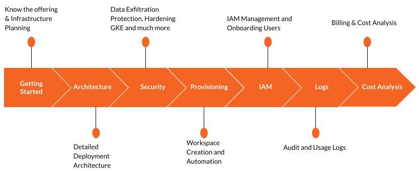

# Databricks on GCP
_The best practice guide that you've been looking for_

# Introduction

[Databricks](https://www.databricks.com) provides a data lakehouse platform unifying the best of data warehouses and data lakes in one simple platform to handle all your data, analytics and AI use cases. It’s built on an open and reliable data foundation that efficiently handles all data types and applies one common security and governance approach across all of your data and cloud platforms.

# Objective
In this guide we'll share with you architectural patterns and design guidelines to help you with:
* [Getting Started](Getting-Started.md)
* [Workspace Architecture](Workspace-Architecture.md)
* [Workspace Security Control](Workspace-Security.md)
  * Enforce [CIS GKE guidelines](./security/GKE-CIS-Guidelines.md)
  * Customize Default [Compute SA role](./security/Customize-Default-ComputeSA-Role.md)
  * Enable [Workload Idenity](./security/Workload-Identity.md)
  * Configure [VPC Service Control](./security/Configure-VPC-SC.md) to prevent data exfiltration
  * Lock down [VPC firewall rules](./security/LockDown-VPC-Firewall-Rules.md)
* [Workspace Provisioning](Workspace-Provisioning.md)
* [Identity and Access Management](Identity-And-Access-Management.md)
* [Observability and Monitoring](Observability-And-Monitoring.md)
* [Cost Management, Charge backs & Analysis](gcpdb4u/Cost-Management-And-Analysis.md)

Most of the content is derived from [public docs](https://docs.gcp.databricks.com)

# Contributing

Knowledge when shared gets multiplied. Any contributions you make are **greatly appreciated**.

If you have a suggestion that would make this better, please fork the repo and create a pull request.
And if you like it then please give us a star and spread the word!

1. Fork the Project
2. Create your own Branch (`git checkout -b gcpdb4u/mybranch`)
3. Commit your Changes (`git commit -m 'Add something new'`)
4. Push to the Branch (`git push origin gcpdb4u/mybranch`)
5. Open a Pull Request

# Contact

Project Link: [https://github.com/bhavink/databricks/gcpdb4u](https://github.com/bhavink/databricks/gcpdb4u)

